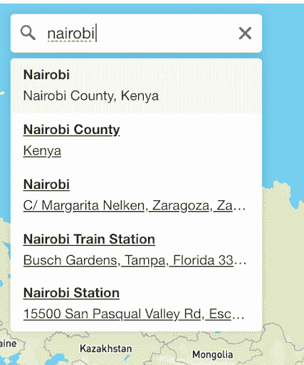
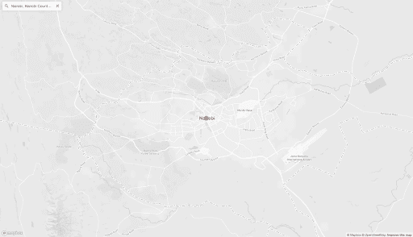
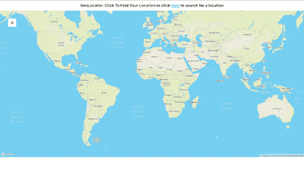
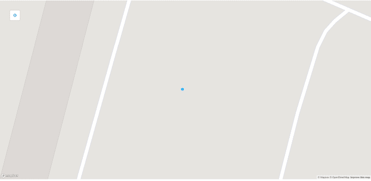

# 将 Mapbox GL JS 与 React - LogRocket Blog 一起使用

> 原文：<https://blog.logrocket.com/using-mapbox-gl-js-react/>

***编者按:**本文于 2022 年 6 月 27 日更新，包含故障排除提示和更多关于 Mapbox GL JS 的最新信息。*

## 什么是 Mapbox GL JS？

Mapbox 是一个实时定位平台，允许开发者为各种应用程序创建交互式和直观的地图界面。在网络上，这是通过一个名为 [Mapbox GL JS](https://docs.mapbox.com/mapbox-gl-js/api/) 的 JavaScript 库来完成的，该库使用 [Web GL](https://get.webgl.org/) 来渲染来自[矢量图块](https://docs.mapbox.com/help/glossary/vector-tiles/)和 [Mapbox 样式](https://docs.mapbox.com/mapbox-gl-js/style-spec/)的交互式地图。

如果你要向 React 应用程序添加地图接口，优步工程团队已经创建了一个名为 [react-map-gl](https://visgl.github.io/react-map-gl/) 的 React 包，使这个过程变得更加容易。这个包为 Mapbox GL JS 提供了一个集成，以及一个易于使用的组件库。

在本文中，我们将利用 react-map-gl 构建两个地图组件:一个显示我们的当前位置，另一个允许我们在全球范围内搜索位置。

### 内容

## 入门指南

首先，让我们使用以下命令创建一个新的 React 应用程序:

```
npx create-react-app mapbox-react

```

要开始使用 react-map-gl 包，我们还需要在我们的应用程序中安装 npm，以及 Mapbox GL JS 库(`mapbox-gl`)，以便我们可以导入它的样式。

我们也可以使用下面的命令来实现这一点:

```
npm install react-map-gl mapbox-gl

```

## 使用 react-map-gl 定位您的位置

让我们从确定我们目前的位置开始。使用 react-map-gl 包，我们可以通过导入一个名为`GeolocateControl`的内置组件来实现这一点，该组件允许我们通过浏览器跟踪用户的位置，只需单击一个按钮。

然而，在我们开始使用地图框样式之前，我们需要创建一个免费的帐户来检索我们的`MAPBOX_TOKEN`。如果你还没有，你可以前往[他们的注册页面](https://account.mapbox.com/auth/signup/)e。

让我们通过使用以下代码创建一个新的 React 组件来尝试一下:

```
import Map, { GeolocateControl } from "react-map-gl";
import "mapbox-gl/dist/mapbox-gl.css";

function MyMap() {
  return (
    <div>
      <Map
        mapboxAccessToken="MAPBOX_TOKEN"
        initialViewState={{
          longitude: -100,
          latitude: 40,
          zoom: 3.5,
        }}
        mapStyle="mapbox://styles/mapbox/streets-v11"
      >
        <GeolocateControl
          positionOptions={{ enableHighAccuracy: true }}
          trackUserLocation={true}
        />
      </Map>
    </div>
  );
}
export default MyMap;

```

请务必用您从自己的 Mapbox 仪表板中检索到的令牌更新上面第八行的`MAPBOX_TOKEN`。

上面显示的代码创建了一个地图，能够通过点击页面左上角的按钮来获取我们的当前位置，我们可以看到，只需几行代码从`react-map-gl`库中导入两个组件，这是多么简单。

我们还使用了`<Map/>`组件来设置地图视图，并通过`initialViewState`属性设置了默认的经度和纬度。接下来，我们导入了第二个组件`<GeolocateControl/>`，它负责让我们检索当前位置的图标。

## 使用地理定位 API

我们的例子的一个缺陷是，在我们的地图被激活后，我们的当前位置没有被立即加载；我们仍然需要点击一个按钮来得到它。我们可以通过利用浏览器的[地理定位 API](https://developer.mozilla.org/en-US/docs/Web/API/Geolocation_API) 在加载时获取我们的当前位置，并将结果设置为我们的默认视口来解决这个问题。

下面是一个更新的示例，展示了如何做到这一点:

```
import { useState, useEffect } from "react";
import Map, { Marker } from "react-map-gl";
import "mapbox-gl/dist/mapbox-gl.css";

function MyMap() {
  const [viewport, setViewport] = useState({});
  useEffect(() => {
    navigator.geolocation.getCurrentPosition((pos) => {
      setViewport({
        ...viewport,
        latitude: pos.coords.latitude,
        longitude: pos.coords.longitude,
        zoom: 3.5,
      });
    });
  }, []);
  return (
    <div>
      {viewport.latitude && viewport.longitude && (
        <div>
          <h1>Your Location:</h1>
          <Map
            mapboxAccessToken="MAPBOX_TOKEN"
            initialViewState={viewport}
            mapStyle="mapbox://styles/mapbox/streets-v11"
          >
            <Marker
              longitude={viewport.longitude}
              latitude={viewport.latitude}
            />
          </Map>
        </div>
      )}
    </div>
  );
}
export default MyMap;

```

在这个新示例中，我们使用 React 的`useState`钩子创建了一个新的`viewport`状态，并使用`useEffect`钩子，将这个状态的值更新为从浏览器的导航 API 中检索到的当前位置。你可能还注意到我们已经抛弃了`GeolocateControl`组件，因为我们现在可以自动获取当前位置。

最后，我们进一步通过`Marker`组件为我们的位置添加了一个标记。

这样，每当我们的 React 应用程序被加载时，我们就能够通过一个标记看到我们的当前位置。

## 使用 react-map-gl 搜索位置

为了能够搜索用户的位置，我们将使用名为 [react-map-gl-geocoder](https://www.npmjs.com/package/react-map-gl-geocoder) 的包来构建 react-map-gl 的功能，这是一个用于 react-map-gl 的 mapbox-gl-geocoder 的 react 包装器。此外，为了添加覆盖，我们将在地图上标记我们搜索过的区域。

为了提高可读性，我们还将采用另一个可视化框架， [deck-gl](https://deck.gl/#/) ，也是由优步工程团队创建的。我们可以用下面的命令安装这两个库:

```
npm install react-map-gl-geocoder deck.gl

```

一旦我们设置好这些，让我们用下面的代码创建一个新的`SearchableMap`地图:

```
import "mapbox-gl/dist/mapbox-gl.css";
import "react-map-gl-geocoder/dist/mapbox-gl-geocoder.css";
import { useEffect, useRef, useState } from "react";
import Map from "react-map-gl";
import DeckGL, { GeoJsonLayer } from "deck.gl";
import Geocoder from "react-map-gl-geocoder";

const token = "MAPBOX_TOKEN";

const SearchableMap = () => {
  const [viewport, setViewPort] = useState({
    latitude: 0,
    longitude: 0,
    zoom: 1,
    transitionDuration: 100,
  });
  const [searchResultLayer, setSearchResult] = useState(null);
  const mapRef = useRef();
  const handleOnResult = (event) => {
    console.log(event.result);
    setSearchResult(
      new GeoJsonLayer({
        id: "search-result",
        data: event.result.geometry,
        getFillColor: [255, 0, 0, 128],
        getRadius: 1000,
        pointRadiusMinPixels: 10,
        pointRadiusMaxPixels: 10,
      })
    );
  };
  const handleGeocoderViewportChange = (viewport) => {
    const geocoderDefaultOverrides = { transitionDuration: 1000 };
    console.log("Updating");
    return setViewPort({
      ...viewport,
      ...geocoderDefaultOverrides,
    });
  };
  useEffect(() => {
    console.log({ viewport });
  }, [viewport]);
  return (
    <div>
      <h1>Use the search bar to find a location on the map</h1>
      <Map
        ref={mapRef}
        {...viewport}
        mapStyle="mapbox://styles/mapbox/streets-v9"
        width="100%"
        height="70vh"
        onViewportChange={setViewPort}
        mapboxAccessToken={token}
      >
        <Geocoder
          mapRef={mapRef}
          onResult={handleOnResult}
          onViewportChange={handleGeocoderViewportChange}
          mapboxAccessToken={token}
          position="top-left"
        />
      </Map>
      <DeckGL {...viewport} layers={[searchResultLayer]} />
    </div>
  );
};
export default SearchableMap;

```

首先，我们用`<Map/>`组件创建一个地图容器，就像我们在前面的例子中所做的那样。接下来，我们使用 react-map-gl-geocoder 中的`Geocoder`组件，它作为一个搜索组件，从 Mapbox API 返回给定位置的坐标。

它需要一些道具；`onResult` prop 是一个函数，当搜索返回一个结果参数时会调用这个函数，在我们的例子中，它会创建一个`GeoJsonLayer`对象，并将其状态设为`searchResultLayer`。该`GeoJsonLayer`然后用于在地图上创建一个 deck-gl 层，指示在地图中搜索的位置。

就像`<Map/>`组件一样，`Geocoder`也有一个被调用来更新地图的`onViewportChange`函数；在我们的例子中，我们选择创建一个单独的函数来处理这个名为`handleGeocoderViewportChange`的函数，以便在更新地图上的视区时覆盖过渡持续时间。

如果您希望使用默认值，可以使用与 Mapbox 相同的视口更改处理程序。地理编码器还需要 Mapbox 令牌来访问 Mapbox API 和获取位置。

搜索时，我们的地理编码器会建议一些位置，如下所示。



您还会注意到，我们创建并使用了一个集成了这两个组件的 ref，并作为一个`mapRef` prop 传递给这两个组件。

我们的可搜索地图中的最后一块是我们为其创建数据的 deck.gl 图层。当我们搜索一个区域时，这将在地图上呈现。它被传递了视口细节和`searchResultLayer`，用来在我们的位置上生成点，如下所示。



就这样，我们有了一个可搜索的地图！

## Mapbox GL JS 中的工艺路线

到目前为止，我们已经为我们的地图示例创建了两个 React 组件(`MyMap`和`SearchableMap`)。让我们通过在这两个组件之间进行路由，让我们的应用程序更进一步。我们可以通过简单地安装 react-router-dom 来做到这一点:

```
npm install react-router-dom

```

为了实现路由，让我们用下面的代码更新我们的`App.js`文件:

```
import MyMap from  './components/MyMap'
import SearchableMap from './components/SearchableMap';
import { Route, Switch, BrowserRouter } from 'react-router-dom'

function App() {
  return (
      <div>
        <div style={{ margin: '0 auto', textAlign: 'center', fontSize: '2rem'}}>
          <a href="/">Show My Location</a> or <a href="/search">Search</a>
        </div>
        <BrowserRouter >
        <Switch>
            <Route exact path="/" component={Map} />
            <Route exact path="/search" component={SearchableMap} />
        </Switch>
        </BrowserRouter>
      </div>
  )
}

export default App

```

我们都准备好了！运行您的应用程序来玩两个组件。这是它们完成后的样子。我们可以使用页面顶部的链接在搜索和位置页面之间导航。





## 故障排除错误

如果您使用的是 react-map-gl-geocoder 包的不兼容版本，在尝试导入`Geocoder`组件时，您可能会遇到以下错误:

```
export 'FlyToInterpolator' (imported as 'r') was not found in 'react-map-gl'

```

出现此错误是因为 react-map-gl-geocoder 包所依赖的组件可能与您安装的 react-map-gl 库版本不兼容。为了解决这个问题，我们需要通过安装并遵循 [this GitHub repository](https://github.com/visgl/react-map-gl/tree/7.0-release/examples/geocoder) 中强调的说明，从头开始重新创建`Geocoder`组件。

对于其他错误，请确保您已经安装了所有必要的软件包，因为没有它们，您的地图可能无法正常工作。

## 结论

Mapbox GL JS 是一个创建交互式地图界面的伟大工具，有了 react-map-gl，集成到 react 应用程序中就更容易了。除了来自优步的软件包的周围生态系统，您可以扩展其功能，使用 deck-gl 创建各种好看的界面，以创建令人惊叹的外观覆盖。

优步更加重视网络地理空间技术，如 Mapbox 到 vis.gl，他们的各种框架套件(包括 Mapbox)都属于这种技术，看看他们的未来会怎样将会很有趣。

## [LogRocket](https://lp.logrocket.com/blg/react-signup-general) :全面了解您的生产 React 应用

调试 React 应用程序可能很困难，尤其是当用户遇到难以重现的问题时。如果您对监视和跟踪 Redux 状态、自动显示 JavaScript 错误以及跟踪缓慢的网络请求和组件加载时间感兴趣，

[try LogRocket](https://lp.logrocket.com/blg/react-signup-general)

.

[ ](https://lp.logrocket.com/blg/react-signup-general) [](https://lp.logrocket.com/blg/react-signup-general) 

LogRocket 结合了会话回放、产品分析和错误跟踪，使软件团队能够创建理想的 web 和移动产品体验。这对你来说意味着什么？

LogRocket 不是猜测错误发生的原因，也不是要求用户提供截图和日志转储，而是让您回放问题，就像它们发生在您自己的浏览器中一样，以快速了解哪里出错了。

不再有嘈杂的警报。智能错误跟踪允许您对问题进行分类，然后从中学习。获得有影响的用户问题的通知，而不是误报。警报越少，有用的信号越多。

LogRocket Redux 中间件包为您的用户会话增加了一层额外的可见性。LogRocket 记录 Redux 存储中的所有操作和状态。

现代化您调试 React 应用的方式— [开始免费监控](https://lp.logrocket.com/blg/react-signup-general)。