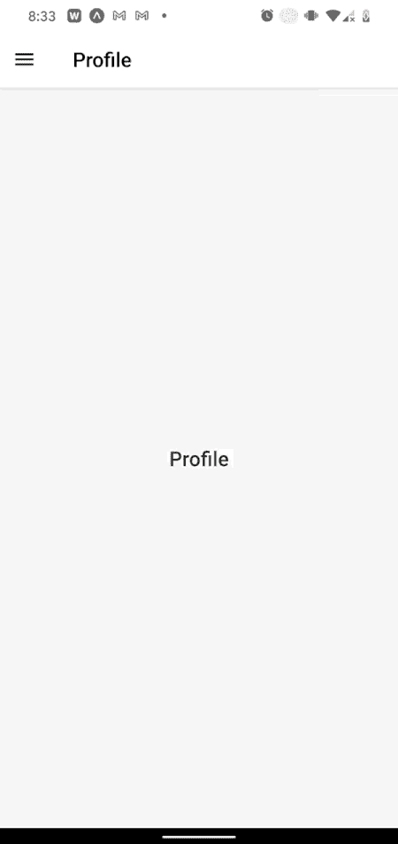
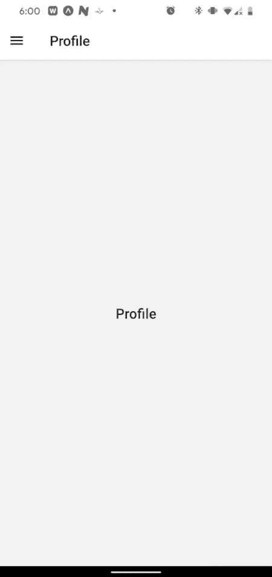
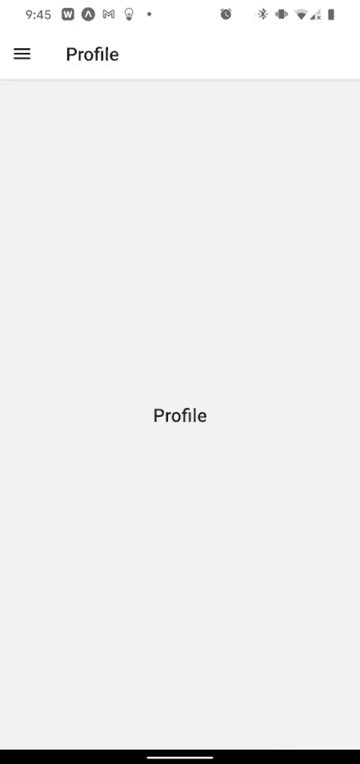
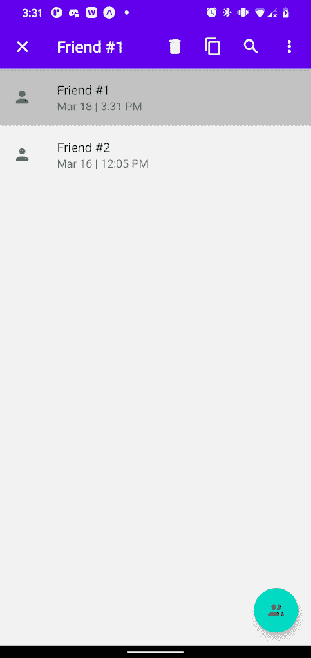
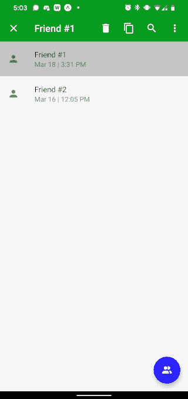
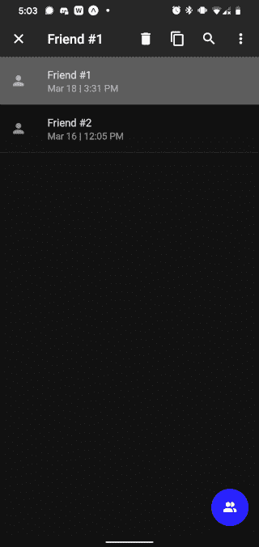
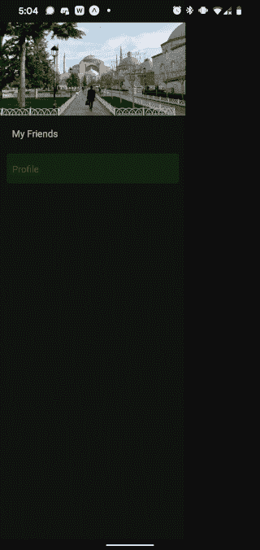

# 在 React Native 中使用 MUI

> 原文：<https://blog.logrocket.com/using-mui-react-native/>

***编者按**:这篇文章最后更新于 2022 年 10 月 14 日，以反映对 MUI 和 MUI 核心所做的[更改。](https://mui.com/blog/material-ui-is-now-mui/)*

如果你正在开发一个跨平台的移动应用，让你的应用的 UI 和 UX 基于谷歌自己的设计语言 [Material Design](https://material.io/design) 是一个好主意，谷歌在所有的移动应用中都使用这种语言。

许多最受欢迎的移动应用程序大量使用材料设计概念，包括 WhatsApp、优步、Lyft、谷歌地图等。因此，你的用户已经熟悉了材料设计的外观和感觉，如果你坚持使用相同的设计语言，他们会很快很容易地理解如何使用你的 app。

[React Native Paper](https://reactnativepaper.com) 是 React Native 的材料设计组件库的重量级人物。在本文中，我们将重点关注[使用 React Native Paper 设置一个具有一些最突出和最容易识别的材料设计功能的入门应用](https://blog.logrocket.com/comparing-react-native-ui-libraries/#reactnativepaper)，包括汉堡菜单、浮动动作按钮(FAB)、上下文动作栏和抽屉导航。我们开始吧！

## React 原生演示应用

我们将在下面的 gif 中构建初学者应用程序。通读本指南时，您可以在[material-ui-in-react-native](https://github.com/kathawala/material-ui-in-react-native)GitHub repo:



MUI in React Native app demo gif

## 设置本地反应

首先，我将使用 Expo 初始化我的 React 本机应用程序。在您的终端中运行以下命令:

```
npx create-expo-app material-ui-in-react-native --template expo-template-blank-typescript
cd material-ui-in-react-native

```

要安装 React Native Paper 包，请在终端中运行以下命令:

```
#npm
npm install react-native-paper
#yarn
yarn add react-native-paper 

```

要启用树摇动并减小 React 原生纸的捆尺寸，请遵循[这些附加安装说明](https://callstack.github.io/react-native-paper/getting-started.html)。

我还将 React 导航添加到这个项目中，我建议您也使用它。 [React Navigation 是 React Native](https://blog.logrocket.com/react-navigation-vs-react-native-navigation/) 最受欢迎的导航库，与其他导航库相比，它更支持与 React Native Paper 一起运行。

你应该遵循 React Navigation 的安装说明，因为根据你使用 Expo 还是普通 React Native，它们会略有不同。

## 初始屏幕

在应用程序的主目录中创建两个文件，分别名为`MyFriends.tsx`和`Profile.tsx`。如果想回顾一下使用的风格，可以参考 [GitHub repo](https://github.com/kathawala/material-ui-in-react-native) :

```
import React from 'react';
import {View} from 'react-native';
import {Title} from 'react-native-paper';
import base from './styles/base';

interface IMyFriendsProps {}

const MyFriends: React.FunctionComponent<IMyFriendsProps> = (props) => {
  return (
    <View style={base.centered}>
      <Title>MyFriends</Title>
    </View>
  );
};
export default MyFriends;

import React from 'react';
import {View} from 'react-native';
import {Title} from 'react-native-paper';
import base from './styles/base';

interface IProfileProps {}

const Profile: React.FunctionComponent<IProfileProps> = (props) => {
  return (
    <View style={base.centered}>
      <Title>Profile</Title>
    </View>
  );
};
export default Profile;

```

在本指南中，我将使用一个导航抽屉和一个汉堡菜单将这些屏幕相互链接起来，并为每个屏幕添加 MUI 组件。

因为 Material Design 提倡使用导航抽屉，所以我将使用一个来使`My Friends`和`Profile`屏幕可以相互导航。首先，我将添加 React 导航的`drawer`库:

```
yarn add @react-navigation/native @react-navigation/drawer

```

现在，我将把下面的代码添加到我的`App.tsx`文件中，以启用抽屉导航:

```
import React from 'react';
import {createDrawerNavigator} from '@react-navigation/drawer';
import {NavigationContainer} from '@react-navigation/native';
import {StatusBar} from 'expo-status-bar';
import {SafeAreaProvider} from 'react-native-safe-area-context';
import MyFriends from './MyFriends';
import Profile from './Profile';

export default function App() {
  const Drawer = createDrawerNavigator();
  return (
    <SafeAreaProvider>
        <NavigationContainer>
          <Drawer.Navigator>
            <Drawer.Screen name='My Friends' component={MyFriends} />
            <Drawer.Screen name='Profile' component={Profile} />
          </Drawer.Navigator>
        </NavigationContainer>
      <StatusBar style='auto' />
    </SafeAreaProvider>
  );
}

```

这个抽屉也需要一个按钮才能打开。它应该看起来像经典的汉堡图标`≡`，按下时应该会打开导航抽屉。按钮的代码可能看起来像下面的`components/MenuIcon.tsx`中的代码:

```
import React from 'react';
import {IconButton} from 'react-native-paper';
import {DrawerActions, useNavigation} from '@react-navigation/native';
import {useCallback} from 'react';

export default function MenuIcon() {
  const navigation = useNavigation();
  const openDrawer = useCallback(() => {
    navigation.dispatch(DrawerActions.openDrawer());
  }, []);

  return <IconButton icon='menu' size={24} onPress={openDrawer} />;
}

```

这里有几点需要注意。首先，我们将使用 React Navigation 的`useNavigation`钩子来执行导航动作，从改变屏幕到打开抽屉。

React Native Paper 的`<IconButton>`通过名称支持所有的[材质设计图标](https://materialdesignicons.com/)，并且可选地支持你想要传递的任何 React 节点，这意味着你可以从任何第三方库中添加任何想要的图标。

现在，我将把`<MenuIcon>`添加到我的导航抽屉中，分别用下面的代码替换下面来自`App.tsx`的代码:

```
  <Drawer.Navigator>
    ...
  </Drawer.Navigator>
```

```
import MenuIcon from './components/MenuIcon.tsx';
...
  <Drawer.Navigator
    screenOptions={{headerShown: true, headerLeft: () => <MenuIcon />}}
  >
    ...
  </Drawer.Navigator>

```

最后，我可以使用我刚刚修改的同一个`<Drawer.Navigator>`组件的`drawerContent`道具定制我的导航抽屉。我将展示一个向抽屉顶部添加标题图像的示例，但是您可以随意定制您想放入抽屉的内容。在`components/MenuContent.tsx`中添加下面的代码:

```
import React from 'react';
import {
  DrawerContentComponentProps,
  DrawerContentScrollView,
  DrawerItemList,
} from '@react-navigation/drawer';
import {Image} from 'react-native';
const MenuContent: React.FunctionComponent<DrawerContentComponentProps> = (
  props
) => {
  return (
    <DrawerContentScrollView {...props}>
      <Image
        resizeMode='cover'
        style={{width: '100%', height: 140}}
        source={require('../assets/drawerHeaderImage.jpg')}
      />
      <DrawerItemList {...props} />
    </DrawerContentScrollView>
  );
};
export default MenuContent;

```

现在，我将把`<MenuContent>`传入`<Drawer.Navigator>`。为此，我将把`App.tsx`中的代码从下面的代码块分别改为下面的代码块:

```
import MenuIcon from './components/MenuIcon.tsx';
...
  <Drawer.Navigator
    screenOptions={{headerShown: true, headerLeft: () => <MenuIcon />}}
  >
    ...
  </Drawer.Navigator>

```

```
import MenuIcon from './components/MenuIcon.tsx';
import MenuContent from './components/MenuContent.tsx';
...
  <Drawer.Navigator
    screenOptions={{headerShown: true, headerLeft: () => <MenuIcon />}}
    drawerContent={(props) => <MenuContent {...props} />}
  >
    ...
  </Drawer.Navigator>

```

现在，我有了功能齐全的带有自定义图像标题的抽屉导航。下面是结果:



Gif of drawer navigation

接下来，我们将用更多的材料设计概念充实主屏幕。

## 浮动操作按钮

材料设计的标志之一是浮动动作按钮(FAB)。根据材料设计原则，`<FAB>`和`<FAB.Group>`组件提供了浮动动作按钮的有用实现。通过最少的设置，我将把它添加到`My Friends`屏幕。

首先，我需要添加来自 React Native Paper 的`<Provider>`组件，并将该组件包装在`App.tsx`中的`<NavigationContainer>`上，如下所示:

```
import {Provider} from 'react-native-paper';
...
  <Provider>
    <NavigationContainer>
      ...
    </NavigationContainer>
  </Provider>

```

现在，我将我的浮动动作按钮添加到`My Friends`屏幕。为此，我需要以下内容:

*   React 原生纸的`<Portal>`和`<FAB.Group>`组件
*   状态变量`fabIsOpen`,用于跟踪工厂是开放还是关闭
*   关于该屏幕当前是否对用户可见的一些信息，`isScreenFocused`

如果没有`isScreenFocused`，FAB 可能会出现在`My Friends`屏幕以外的屏幕上。

添加了所有这些内容后，`My Friends`屏幕看起来类似于`MyFriends.tsx`中的代码:

```
import {useIsFocused} from '@react-navigation/native';
import React, {useState} from 'react';
import {View} from 'react-native';
import {FAB, Portal, Title} from 'react-native-paper';
import base from './styles/base';

interface IMyFriendsProps {}

const MyFriends: React.FunctionComponent<IMyFriendsProps> = (props) => {
  const isScreenFocused = useIsFocused();
  const [fabIsOpen, setFabIsOpen] = useState(false);

  return (
    <View style={base.centered}>
      <Title>MyFriends</Title>
      <Portal>
        <FAB.Group
          visible={isScreenFocused}
          open={fabIsOpen}
          onStateChange={({open}) => setFabIsOpen(open)}
          icon={fabIsOpen ? 'close' : 'account-multiple'}
          actions={[
            {
              icon: 'plus',
              label: 'Add new friend',
              onPress: () => {},
            },
            {
              icon: 'file-export',
              label: 'Export friend list',
              onPress: () => {},
            },
          ]}
        />
      </Portal>
    </View>
  );
};
export default MyFriends;

```

现在，`My Friends`屏幕表现如下:



Gif of floating action button demonstration

接下来，我将添加一个上下文动作栏，您可以通过长按任何屏幕上的一个项目来激活它。

## 上下文动作栏

像 Gmail 和 Google Photos 这样的应用程序使用了一种叫做[上下文动作栏](https://material.io/components/app-bars-top#contextual-action-bar)的材料设计概念。在我们当前的应用程序中，我将快速实现一个版本。

首先，我将使用 React Native Paper 的 [appbar 组件构建`ContextualActionBar`组件本身。首先，它应该如下所示:](https://callstack.github.io/react-native-paper/appbar.html)

```
./components/ContextualActionBar.tsx
```

```
import React from 'react';
import {Appbar} from 'react-native-paper';

interface IContextualActionBarProps {}

const ContextualActionBar: React.FunctionComponent<IContextualActionBarProps> = (
  props
) => {
  return (
    <Appbar.Header {...props} style={{width: '100%'}}>
      <Appbar.Action icon='close' onPress={() => {}} />
      <Appbar.Content title='' />
      <Appbar.Action icon='delete' onPress={() => {}} />
      <Appbar.Action icon='content-copy' onPress={() => {}} />
      <Appbar.Action icon='magnify' onPress={() => {}} />
      <Appbar.Action icon='dots-vertical' onPress={() => {}} />
    </Appbar.Header>
  );
};
export default ContextualActionBar;

```

每当一个项目被长按，我希望这个组件呈现在给定的屏幕标题的顶部。我将通过向`MyFriends.tsx`添加以下代码，在`My Friends`屏幕的标题上呈现上下文动作栏:

```
>import {useNavigation} from '@react-navigation/native';
import ContextualActionBar from './components/ContextualActionBar';
...
  const [cabIsOpen, setCabIsOpen] = useState(false);
  const navigation = useNavigation();

  const openHeader = useCallback(() => {
    setCabIsOpen(!cabIsOpen);
  }, [cabIsOpen]);

  useEffect(() => {
    if (cabIsOpen) {
      navigation.setOptions({
        // have to use props: any since that's the type signature
        // from react-navigation...
        header: (props: any) => (<ContextualActionBar {...props} />),
      });
    } else {
      navigation.setOptions({header: undefined});
    }
  }, [cabIsOpen]);
...
  return (
    ...
    <List.Item
      title='Friend #1'
      description='Mar 18 | 3:31 PM'
      style={{width: '100%'}}
      onPress={() => {}}
      onLongPress={openHeader}
    />
    ...
  );

```

在上面的代码中，每当一个给定的项目被长按时，我就切换一个状态布尔值`cabIsOpen`。基于这个值，我或者切换 React 导航头来呈现`<ContextualActionBar>`，或者切换回呈现默认的 React 导航头。

现在，当我长按`Friend #1`项时，应该会出现一个上下文动作栏。但是，题目还是空的，任何一个动作我都做不了。作为一个整体，`<ContextualActionBar>`不知道`Friend #1`项目或更大的`My Friends`屏幕的状态。

接下来，我们将在`<ContextualActionBar>`中添加一个标题，我们还将传入一个关闭工具栏的函数，该函数将由工具栏中的一个按钮触发。为此，我将向`My Friends`屏幕添加另一个状态变量:

```
const [selectedItemName, setSelectedItemName] = useState('');

```

我还需要创建一个函数来关闭标题并重置上面的状态变量:

```
  const closeHeader = useCallback(() => {
    setCabIsOpen(false);
    setSelectedItemName('');
  }, []);

```

然后，我需要将`selectedItemName`和`closeHeader`都作为道具传递给`<ContextualActionBar>`:

```
  useEffect(() => {
    if (cabIsOpen) {
      navigation.setOptions({
        header: (props: any) => (
          <ContextualActionBar
            {...props}
            title={selectedItemName}
            close={closeHeader}
          />
      ),
      });
    } else {
      navigation.setOptions({header: undefined});
    }
  }, [cabIsOpen, selectedItemName]);

```

最后，我需要将`selectedItemName`设置为长时间按下的项目的标题:

```
  ...
  const openHeader = useCallback((str: string) => {
    setSelectedItemName(str);
    setCabIsOpen(!cabIsOpen);
  }, [cabIsOpen]);
  ...
  return (
    ...
    <List.Item
      title='Friend #1'
      ...
      onLongPress={() => openHeader('Friend #1')}
    />
  );

```

现在，我可以使用`<ContextualActionBar>`中的`title`和`close`道具了。将下面的代码添加到`./components/ContextualActionBar.tsx`:

```
interface IContextualActionBarProps {
  title: string;
  close: () => void;
}
...
  return (
      ...
      <Appbar.Action icon='close' onPress={props.close} />
      <Appbar.Content title={props.title} />
      ...
  );

```

现在，我有了一个实用的、受材料设计启发的上下文动作栏，它利用了 React 原生纸和 React 导航。它看起来像下面这样:



Contextual action bar, activates when the user long presses an item

## 用材料设计主题

最后，我想为我的应用程序设置主题，这样我就可以更改主要颜色、次要颜色、文本颜色等等。

主题化有点棘手，因为 React Navigation 和 React Native Paper 都有自己的`ThemeProvider`组件，很容易相互冲突。幸运的是，在[主题化应用上有一个很好的指南，它同时使用了 React 原生纸和 React 导航](https://callstack.github.io/react-native-paper/theming-with-react-navigation.html)。

我将为那些使用 TypeScript 的人增加一点额外的帮助，他们在试图遵循上面的指南时会遇到深奥的错误。

首先，我将创建一个主题文件`theme.ts`，它看起来像下面的代码:

```
import {
  DarkTheme as NavigationDarkTheme,
  DefaultTheme as NavigationDefaultTheme,
  Theme,
} from '@react-navigation/native';
import {ColorSchemeName} from 'react-native';
import {
  DarkTheme as PaperDarkTheme,
  DefaultTheme as PaperDefaultTheme,
} from 'react-native-paper';
declare global {
  namespace ReactNativePaper {
    interface ThemeColors {
      animationColor: string;
    }
    interface Theme {
      statusBar: 'light' | 'dark' | 'auto' | 'inverted' | undefined;
    }
  }
}
interface ReactNavigationTheme extends Theme {
  statusBar: 'light' | 'dark' | 'auto' | 'inverted' | undefined;
}
export function combineThemes(
  themeType: ColorSchemeName
): ReactNativePaper.Theme | ReactNavigationTheme {
  const CombinedDefaultTheme: ReactNativePaper.Theme = {
    ...NavigationDefaultTheme,
    ...PaperDefaultTheme,
    statusBar: 'dark',
    colors: {
      ...NavigationDefaultTheme.colors,
      ...PaperDefaultTheme.colors,
      animationColor: '#2922ff',
      primary: '#079c20',
      accent: '#2922ff',
    },
  };
  const CombinedDarkTheme: ReactNativePaper.Theme = {
    ...NavigationDarkTheme,
    ...PaperDarkTheme,
    mode: 'adaptive',
    statusBar: 'light',
    colors: {
      ...NavigationDarkTheme.colors,
      ...PaperDarkTheme.colors,
      animationColor: '#6262ff',
      primary: '#079c20',
      accent: '#2922ff',
    },
  };
  return themeType === 'dark' ? CombinedDarkTheme : CombinedDefaultTheme;
}

```

`combineThemes`返回类型包括`ReactNavigationTheme`和`ReactNativePaper.Theme`。我改变了`primary`和`accent`的颜色，这将分别影响驾驶室和工厂。我给主题添加了一个新的颜色叫做`animationColor`。如果不想添加新颜色，就不需要声明全局名称空间。

在`App.tsx`中，我将把我的主题添加到 React Native Paper `Provider`组件和 React Navigation 的`NavigationContainer`组件中:

```
import {useColorScheme} from 'react-native';
import {NavigationContainer, Theme} from '@react-navigation/native';
import {combineThemes} from './theme';
...
  const colorScheme = useColorScheme() as 'light' | 'dark';
  const theme = combineThemes(colorScheme);
  ...
    <Provider theme={theme as ReactNativePaper.Theme}>
      <NavigationContainer theme={theme as Theme}>
      </NavigationContainer>
    </Provider>

```

我用的是 Expo，所以我还需要在`app.json`中添加以下代码来启用黑暗模式。但是，您可能不需要:

```
"userInterfaceStyle": "automatic",

```

现在，您有了一个自定义主题、启用黑暗模式、受材料设计启发的应用程序:



Contextual action bar and floating action button with custom colors, light theme


Drawer open, showing header image, light mode



Contextual action bar and floating action button with custom colors, dark theme



Drawer open, showing header image, dark mode

## 结论

此时，您应该拥有自己的跨平台应用程序，其中包含 React 原生纸库中的材料设计元素，如抽屉菜单中带有自定义设计的抽屉导航、浮动操作按钮和上下文操作栏。

您还应该启用主题化，这可以很好地与 React 原生纸和 React 导航库一起工作。这种设置应该能让你轻松、快速、时尚地构建你的下一个移动应用。

## [LogRocket](https://lp.logrocket.com/blg/react-native-signup) :即时重现 React 原生应用中的问题。

[](https://lp.logrocket.com/blg/react-native-signup)

[LogRocket](https://lp.logrocket.com/blg/react-native-signup) 是一款 React 原生监控解决方案，可帮助您即时重现问题、确定 bug 的优先级并了解 React 原生应用的性能。

LogRocket 还可以向你展示用户是如何与你的应用程序互动的，从而帮助你提高转化率和产品使用率。LogRocket 的产品分析功能揭示了用户不完成特定流程或不采用新功能的原因。

开始主动监控您的 React 原生应用— [免费试用 LogRocket】。](https://lp.logrocket.com/blg/react-native-signup)