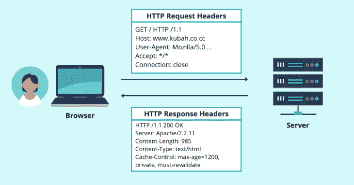
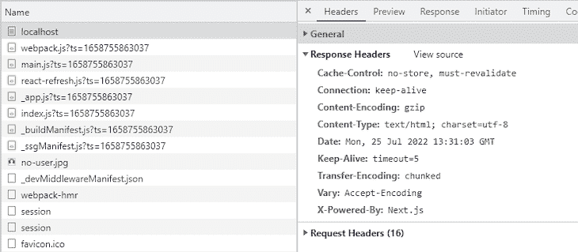
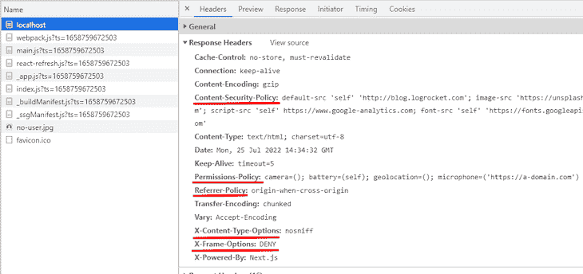

# 使用 Next.js 安全头加强应用程序安全性

> 原文：<https://blog.logrocket.com/using-next-js-security-headers/>

网站中的安全漏洞通常是由配置不良或不充分的重要安全功能造成的。任何未被发现的安全漏洞都会使您的网站面临被恶意用户攻击的风险。这可能会导致灾难性的后果，如数据盗窃和未经授权的操作。

作为网站管理员，您必须采取必要的措施来保护您的网站或应用程序。使用带有正确指令的安全标头是保护网站免受常见安全威胁(如跨站脚本(XSS)和点击劫持)的高效方法。

在本文中，我们将了解安全头、它们在网站安全中的作用，以及如何将它们添加到 Next.js 应用程序中。我们将涵盖:

每次浏览器与 web 服务器通信时，其他几条信息会使用 HTTP 头随实际负载一起发送。

当浏览器从 web 服务器请求资源时，它会在 HTTP 请求头中包含有关请求的附加信息。然后，服务器用请求的内容和 HTTP 响应头进行响应。请看下图，了解这是如何工作的:



虽然在 HTTP 请求和响应中有许多不同的头字段来传递不同种类的信息，但我们的重点是安全头。

安全头是 web 应用程序用来指定 web 浏览器必须遵守或强制执行的指令的一组唯一的头字段。这些标题的目的是实现一组保护规则，以确保用户和网站之间的安全通信。

对于这个演示，我已经[创建了一个新的 Next.js 应用](https://blog.logrocket.com/creating-website-next-js-react/)，它使用默认的设置配置。我还通过在我的终端上运行`npm run dev`在 [http://localhost:3000](http://localhost:3000) 启动了下一个应用程序。

在检查开发人员控制台的 network 选项卡中的 HTTP 响应头时，很明显 starter Next 应用程序没有默认启用安全头。下图显示了活动的 HTTP 响应标头:



不出所料，响应报头中既没有`Content-Security-Policy`、`X-Content-Type-Options`、`X-Frame-Options`、`Referrer-Policy`，也没有任何其他安全报头。如果没有这些政策，应用程序将容易受到一些安全威胁，包括跨站脚本(XSS)和点击劫持。

在学习如何将这些安全头添加到 Next.js 应用程序之前，让我们先了解一下每个安全头是如何工作的。如果您已经熟悉安全头，请随意[跳到本文的最后一节](#how-add-security-headers-next-js-app)。

在接下来的几节中，我们将介绍您应该了解的六种不同的 HTTP 安全头。如果可能的话，我们建议在您的 Next.js 项目中实现这些安全头，以加强应用程序的安全性。

`X-Content-Type-Options`头旨在禁用 MIME 类型嗅探，这是浏览器使用的一种技术，用于根据响应内容而不是在`Content-Type`头中指定的内容来确定资源的多用途互联网邮件扩展(MIME)类型。

虽然 MIME 嗅探是确定内容类型的有用方法，但攻击者也有可能操纵 MIME 嗅探算法。通过这样做，他们可以迷惑浏览器，使其以一种允许攻击者执行恶意操作(如跨站点脚本)的方式解释数据。

为了应对这个安全漏洞，`X-Content-Type-Option`头支持`nosniff`指令，该指令强制浏览器遵守在`Content-Type`中指定的 MIME 类型:

```
X-Content-Type-Options: nosniff

```

通常，您的应用程序可能需要执行来自其他地方的脚本。这将使应用程序容易受到[跨站点脚本(XSS)攻击](https://blog.logrocket.com/what-you-need-know-inbuilt-browser-html-sanitization/)，这是一种客户端代码注入攻击，其特征是攻击者将恶意代码注入合法的网页或 web 应用程序。

通过使用`Content-Security-Policy`头，我们可以指定我们希望允许内容来自的确切域——换句话说，哪些域应该被认为是安全的，哪些域不应该。

下面，你可以看到一般的语法:

```
Content-Security-Policy: default-src <trusted-domains>

```

`<trusted-domains>`可以是以下任何一种:

*   `*`允许来自所有域的内容
*   将您自己的域指定为唯一受信任的域
*   您希望允许内容来自的外部域的 URL，例如`'https://logrocket.com'`

`Content-Security-Policy`头还允许我们为各种资源设置定制的安全策略，包括图像和其他媒体、字体、样式、脚本等等，所有这些都使用它们各自的指令。

以下面的例子为例:

```
Content-Security-Policy: default-src 'self' 'http://blog.logrocket.com'; image-src 'https://unsplash.com'; script-src 'self' https://www.google-analytics.com; font-src 'self' 'https://fonts.googleapis.com'; 

```

在上述政策中，我们规定只允许来自我们网站和`blog.logrocket.com`的内容。除非另有说明，这两个域将作为我们所有资源的来源。

我们还只允许来自当前域的脚本——定义为`self`——以及`google-analytics.com`。

对于字体，我们允许当前域和`fonts.googleapis.com`都是来源，而图像只信任来自`unsplash.com`的。

### `X-Frame-Options`表头

`X-Frame-Options`标题旨在通过确保网站内容不嵌入其他网站来阻止网站的点击劫持企图。

通过为这个头设置`DENY`指令，我们禁止浏览器在`<iframe>`、`<frame>`、`<object>`或`<embed>`元素中加载页面，无论哪个站点正在加载页面:

```
X-Frame-Options: DENY

```

另一个更宽松的选择是只允许页面在与页面本身相同的源上的 iframe 中显示。这是通过将`X-Frame-Options`的指令设置为`SAMEORIGIN`来实现的，如下所示:

```
X-Frame-Options: SAMEORIGIN

```

`Strict-Transport-Security`报头指示网络浏览器只能通过 HTTPS 与网络服务器连接，从而确保每个 HTTP 连接都是加密的，不会被第三方渗透。

* * *

### 更多来自 LogRocket 的精彩文章:

* * *

该标题的指令为`max-age`、`SubDomains`和`preload`。下面是这种情况的一个例子:

```
Strict-Transport-Security: max-age=3571000; includeSubDomains; preload

```

`max-age`是唯一必需的指令；其余的是可选的。`max-age`指定浏览器在多长时间内应该记住一个站点只能通过 HTTPS 访问。

`Permissions-Policy`头，以前称为`Feature-Policy`，允许您指定允许 Web 浏览器使用的 Web APIs。

这意味着如果你的网站不需要外部设备，你可以选择不使用它们，比如摄像头、麦克风和地理定位。这有助于降低攻击者利用此类渠道的风险。

下面是标题外观的一个示例:

```
Permissions-Policy: camera=(); battery=(self); geolocation=(); microphone=('https://a-domain.com')

```

`camera`和`geolocation`的空括号向浏览器表明我们拒绝使用这两个 API。此外，我们指定电池状态 API 应该只允许用于当前域，而麦克风应该只允许用于指定的域。

当你点击一个链接从一个域转到另一个域时，比如从`DomainA`转到`DomainB`，那么在这种情况下`DomainA`被称为推荐人，关于推荐人的某些信息在 HTTP 请求的推荐人报头中被发送到`DomainB`。

`Referrer-Policy`头允许您指定当从一个域导航到另一个域时，在每个 HTTP 请求中有多少关于推荐人的信息与推荐人头一起发送。

有许多指令可以和`Referrer-Policy`头一起使用。下面的例子使用`origin-when-cross-origin`在同等协议级别之间执行同源请求时发送路径、起点和查询字符串，例如，在 HTTPS 和 HTTPS 之间。

```
Referrer-Policy: origin-when-cross-origin

```

[看一下 MDN 文档](https://developer.mozilla.org/en-US/docs/Web/HTTP/Headers/Referrer-Policy),了解更多关于可以与`Referrer-Policy`头一起使用的其他指令。

现在我们已经知道了不同的安全头以及它们在保护网站中的作用，让我们看看如何将它们添加到 Next.js 应用程序中。

Next 允许您从位于项目主文件夹中的`next.config.js`文件设置安全头——如果这个文件不存在，您可能需要创建它。这里，您必须向对象添加一个异步的`headers`函数。

函数必须返回一个包含单个对象的数组。该对象将包含您想要应用头的源，以及实际的指令本身。

```
const nextConfig = {
  reactStrictMode: true,
  swcMinify: true,  
  // Adding policies:
  async headers() {
    return [
        {
          source: '/(.*)',
          headers: [
            {
              key: 'X-Frame-Options',
              value: 'DENY',
            },
            {
              key: 'Content-Security-Policy',
              value:
                "default-src 'self' 'http://blog.logrocket.com'; image-src 'https://unsplash.com'; script-src 'self' https://www.google-analytics.com; font-src 'self' 'https://fonts.googleapis.com'",
            },
            {
              key: 'X-Content-Type-Options',
              value: 'nosniff',
            },
            {
              key: 'Permissions-Policy',
              value: "camera=(); battery=(self); geolocation=(); microphone=('https://a-domain.com')",
            },
            {
              key: 'Referrer-Policy',
              value: 'origin-when-cross-origin',
            },
          ],
        },
      ];
  },   
}

module.exports = nextConfig

```

上面的例子为站点上的所有路由设置了安全头，由`source /(.*)`指定。有些情况下，您可能只希望为给定的页面设置一组标题。您也可以这样做，如下所示:

```
const nextConfig = {
  reactStrictMode: true,
  swcMinify: true,  
  // Adding policies:
  async headers() {
    return [
      {
          source: '/user',
          headers: [
            {
              key: 'Content-Security-Policy',
              value:
                "default-src 'self' 'http://blog.logrocket.com'; image-src 'https://unsplash.com'; script-src 'self' https://www.google-analytics.com; font-src 'self' 'https://fonts.googleapis.com'",
            }
          ]
        },
       {
          source: '/posts',
          headers: [
            {
              key: 'Content-Security-Policy',
              value:
                "default-src 'self'",
            }
          ]
        },
      ];
  },

}

module.exports = nextConfig

```

有了这个，你就万事俱备了！

要测试您的项目，只需在您的终端上运行`npm run dev`来启动您的 Next.js 开发服务器。然后，在你的浏览器中，导航到你的本地服务器上的网址——它应该在 [http://localhost:3000](http://localhost:3000) 。您应该能够看到您在开发人员控制台的 network 选项卡中设置的标题，如下所示:



## 包扎

在本文中，我们研究了安全头以及如何在 Next.js 应用程序中实现它们。有关 HTTP 头的信息，请查看 MDN 文档。

下次再见！

## [LogRocket](https://lp.logrocket.com/blg/nextjs-signup) :全面了解生产 Next.js 应用

调试下一个应用程序可能会很困难，尤其是当用户遇到难以重现的问题时。如果您对监视和跟踪状态、自动显示 JavaScript 错误、跟踪缓慢的网络请求和组件加载时间感兴趣，

[try LogRocket](https://lp.logrocket.com/blg/nextjs-signup)

.

[](https://lp.logrocket.com/blg/nextjs-signup)[](https://lp.logrocket.com/blg/nextjs-signup)

LogRocket 就像是网络和移动应用的 DVR，记录下你的 Next.js 应用上发生的一切。您可以汇总并报告问题发生时应用程序的状态，而不是猜测问题发生的原因。LogRocket 还可以监控应用程序的性能，报告客户端 CPU 负载、客户端内存使用等指标。

LogRocket Redux 中间件包为您的用户会话增加了一层额外的可见性。LogRocket 记录 Redux 存储中的所有操作和状态。

让您调试 Next.js 应用的方式现代化— [开始免费监控](https://lp.logrocket.com/blg/nextjs-signup)。