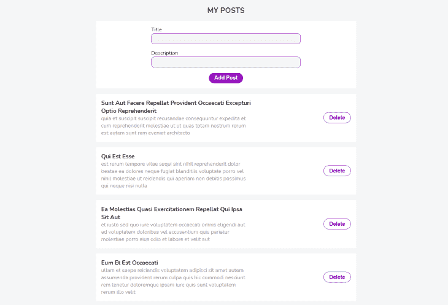

# 将 Next.js 与 TypeScript - LogRocket Blog 一起使用

> 原文：<https://blog.logrocket.com/using-next-js-with-typescript/>

编者按:这篇文章于 2021 年 11 月 15 日更新，以更新过时的信息，并提供关于打字稿类型的更多澄清。

Next.js 允许您使用 React 构建静态和动态(服务器端)应用程序。它附带了方便的功能，例如:

*   API 路线
*   文件系统路由
*   图像优化
*   中间件
*   ES 模块支持和 URL 导入
*   服务器组件
*   HTTP 流
*   Next.js Live

[Next.js](https://nextjs.org/) 是用[类型脚本](https://www.typescriptlang.org/)构建的，所以默认情况下，只需 JavaScript 就能在编辑器中获得更好的智能感知和类型定义。但是当您将它与 TypeScript 结合使用时，您可以获得更好的开发人员体验——包括当您的组件需要道具，但是您没有通过任何道具时的即时反馈。

您还可以使用 Next 的导出类型进行构建，并定义您自己的类型来构建您的应用程序。这些[类型通过指定你的对象、数组等等，帮助你的代码有更好的结构](https://blog.logrocket.com/type-flowing-rethinking-typescript-typing-system/)。，看起来像是提前了。这样，您、您的代码编辑器以及您之后的任何开发人员都知道如何引用您的代码。

Next 的功能使构建全栈 React 应用比以往任何时候都更容易，从[简化路由](https://nextjs.org/docs/basic-features/pages)到性能增强功能，如[图像优化](https://nextjs.org/docs/basic-features/image-optimization)。

在本教程中，我们将演示如何使用 Next.js 和 TypeScript，并向您介绍一个令人兴奋的现代堆栈，用于构建高质量、搜索优化和可预测的应用程序。我们将详细介绍以下内容:

为了展示 Next.js 和 TypeScript 的实际应用，我们将介绍如何构建一个简单的文章管理器应用程序。我们的示例应用程序将从 [JSON 占位符](https://jsonplaceholder.typicode.com/)中检索数据。

## Next.js 是什么？

Next.js 是一个构建在 React 和 Node.js 之上的生产就绪框架。它提供了上面列出的所有功能以及更多的功能。

您可以使用 Next.js 构建静态和动态应用程序，因为它支持客户端和服务器端呈现。Next.js 9 引入了 [API routes](https://nextjs.org/docs/api-routes/introduction) ，允许你用 Node.js、Express.js、GraphQL 等构建的真正的后端(无服务器)来扩展你的下一个应用。在撰写本文时，最新的版本是 [Next.js 12](https://blog.logrocket.com/whats-new-next-js-12/) ，它有一个新的、更快的 Rust 编译器。

Next.js 使用[自动代码分割(延迟加载)](https://blog.logrocket.com/understanding-lazy-loading-in-javascript/)来只呈现你的应用程序需要的 JavaScript。Next.js 还可以在构建时预渲染页面以按需提供服务，这可以让你的应用程序感觉很快，因为浏览器不必花时间执行 JavaScript 捆绑包来为你的应用程序生成 HTML，这使得更多的搜索引擎爬虫可以索引你的应用程序，这反过来对 SEO 很好。

## 什么是 TypeScript？

TypeScript 是一种由微软创建和维护的流行语言。它是 JavaScript 的超集，这意味着所有有效的 JavaScript 都是有效的 Typescript。

你可以[将你现有的 JavaScript 应用程序转换成 TypeScript](https://blog.logrocket.com/a-simple-guide-for-migrating-from-javascript-to-typescript/) ，只要你的代码是有效的 JavaScript，它就会像预期的那样工作。TypeScript 允许您在变量和函数上设置类型，这样您就可以静态地对代码进行类型检查，并在编译时捕捉错误。

您还可以使用 JavaScript 尚不支持的现代特性。不要担心浏览器支持——TypeScript 编译成普通 JavaScript，这意味着您的 TypeScript 代码永远不会出现在浏览器中。

## 在 Next.js 应用程序中使用 TypeScript

要创建新的 Next.js 应用程序，可以使用创建下一个应用程序。

首先，打开命令行界面(CLI)并运行以下命令:

```
npx create-next-app next-typescript-example 
```

该命令将生成一个全新的 Next.js 应用程序。现在，让我们按如下方式构建项目:

```
src
├── components
|  ├── AddPost.tsx
|  └── Post.tsx
├── pages
|  ├── index.tsx
|  └── _app.tsx
├── styles
|  └── index.css
├── tsconfig.json
├── types
|  └── index.ts
├── next-env.d.ts
└── package.json 
```

要在 Next.js 应用程序中启用 TypeScript，请在项目的根目录中添加一个`tsconfig.json`文件。Next.js 将识别该文件并为项目使用 TypeScript。

有了这些，我们现在可以创建扩展名为`.ts`或`.tsx`的文件。Next.js 处理将 TypeScript 代码编译成 JavaScript，然后像往常一样在浏览器中为我们的应用程序提供服务。

## 在 Next.js 中创建 TypeScript 类型

您可以为应用程序中的任何内容创建类型，包括属性类型、API 响应、实用函数的参数，甚至全局状态的属性！

我们首先为我们的帖子创建一个类型。下面的界面反映了一个`Post`物体的形状。它需要`id`、`title`和`body`属性。

```
// types/index.ts

export interface IPost {
  id: number
  title: string
  body: string
}

```

## 在 Next.js 中创建组件

既然 post 类型(`IPost`)已经可以使用了，让我们创建 React 组件并设置类型。

```
// components/AddPost.tsx

import * as React from 'react'
import { IPost } from '../types'

type Props = {
  savePost: (e: React.FormEvent, formData: IPost) => void
}

const AddPost: React.FC<Props> = ({ savePost }) => {
  const [formData, setFormData] = React.useState<IPost>()

  const handleForm = (e: React.FormEvent<HTMLInputElement>): void => {
    setFormData({
      ...formData,
      [e.currentTarget.id]: e.currentTarget.value,
    })
  }

  return (
    <form className='Form' onSubmit={(e) => savePost(e, formData)}>
      <div>
        <div className='Form--field'>
          <label htmlFor='name'>Title</label>
          <input onChange={handleForm} type='text' id='title' />
        </div>
        <div className='Form--field'>
          <label htmlFor='body'>Description</label>
          <input onChange={handleForm} type='text' id='body' />
        </div>
      </div>
      <button
        className='Form__button'
        disabled={formData === undefined ? true : false}
      >
        Add Post
      </button>
    </form>
  )
}

export default AddPost

```

如您所见，我们从导入`IPost`类型开始。之后，我们创建另一个名为`Props`的类型，它镜像组件作为参数接收的属性。

接下来，我们在[钩子](https://blog.logrocket.com/a-guide-to-usestate-in-react-ecb9952e406c/)上设置类型`IPost`。然后，我们用它来处理表单数据。一旦表单被提交，我们就依靠函数`savePost`将数据保存在数组`posts`中。
现在，我们可以创建并保存一个新帖子。

让我们继续关注负责显示`Post`对象的组件。

```
// components/Post.tsx

import * as React from 'react'
import { IPost } from '../types'

type Props = {
  post: IPost
  deletePost: (id: number) => void
}

const Post: React.FC<Props> = ({ post, deletePost }) => {
  return (
    <div className='Card'>
      <div className='Card--body'>
        <h1 className='Card--body-title'>{post.title}</h1>
        <p className='Card--body-text'>{post.body}</p>
      </div>
      <button className='Card__button' onClick={() => deletePost(post.id)}>
        Delete
      </button>
    </div>
  )
}

export default Post

```

这个`Post`组件接收要显示的`post`对象和作为道具的`deletePost`函数。参数必须匹配`Props`才能让 TypeScript 满意。

我们现在能够添加、显示和删除帖子。让我们将组件导入到`App.tsx`文件中，并创建处理帖子的逻辑。

```
import * as React from 'react'
import { InferGetStaticPropsType } from 'next'
import AddPost from '../components/AddPost'
import Post from '../components/Post'
import { IPost } from '../types'

const API_URL: string = 'https://jsonplaceholder.typicode.com/posts'

export default function IndexPage({
  posts,
}: InferGetStaticPropsType<typeof getStaticProps>) {
  const [postList, setPostList] = React.useState(posts)

  const addPost = async (e: React.FormEvent, formData: IPost) => {
    e.preventDefault()
    const post: IPost = {
      id: Math.random(),
      title: formData.title,
      body: formData.body,
    }
    setPostList([post, ...postList])
  }

  const deletePost = async (id: number) => {
    const posts: IPost[] = postList.filter((post: IPost) => post.id !== id)
    console.log(posts)
    setPostList(posts)
  }

  if (!postList) return <h1>Loading...</h1>

  return (
    <main className='container'>
      <h1>My posts</h1>
      <AddPost savePost={addPost} />
      {postList.map((post: IPost) => (
        <Post key={post.id} deletePost={deletePost} post={post} />
      ))}
    </main>
  )
}

export async function getStaticProps() {
  const res = await fetch(API_URL)
  const posts: IPost[] = await res.json()

  return {
    props: {
      posts,
    },
  }
}

```

在这个组件中，我们首先导入前面创建的类型和组件。Next.js 提供的类型`InferGetStaticPropsType`允许我们在方法`getStaticProps`上设置类型。它会推断出`getStaticProps`返回的道具上定义的类型。

之后，我们使用`useState`钩子用`posts`数组初始化状态。接下来，我们声明函数`addPost`来保存 posts 数组中的数据。`deletePost`方法接收帖子的`id`作为参数，这允许我们过滤数组并删除帖子。

最后，我们将预期的道具传递给组件。然后，我们遍历响应数据，并使用`Todo`组件显示它。借助 Next.js 提供的`getStaticProps`方法，从 JSON 占位符 API 中检索数据。

将`posts`的类型设置为具有由`IPost`定义的结构的对象数组，有助于我们和我们的编辑器确切地知道从 API 的响应中哪些字段对我们可用。

您也可以使用 [`getServerSideProps`方法](https://nextjs.org/docs/basic-features/data-fetching#getserversideprops-server-side-rendering)、Fetch 或者一个库来获取数据。只是你想怎么渲染你的 Next.js 应用的问题。

在这个演示中，我们通过[静态生成](https://nextjs.org/docs/basic-features/pages#static-generation-recommended)页面来呈现我们的应用程序，这意味着 Next.js 在构建时使用少量 JavaScript 生成 HTML 文件，并且相同的 HTML 文件服务于每个请求。静态生成页面是推荐的应用程序服务方式，因为提供预先生成的 HTML 文件可以提高性能。

[服务器端渲染](https://nextjs.org/docs/basic-features/pages#server-side-rendering)也是一个选项，这个方法在每次向服务器发出请求时生成一个新的 HTML 文件。这是您将使用`getServerSideProps`的模式。

## 测试 Next.js 应用程序

完成最后一步后，应用程序就可以在浏览器上进行测试了。首先找到项目的根目录并运行以下命令:

```
yarn dev

```

或者，如果使用`npm`:

```
npm run dev

```

如果一切正常，您应该会在`[http://localhost:3000/](http://localhost:3000/)`看到下一个应用程序:



And that’s it!

## 结论

在本教程中，我们介绍了如何通过构建一个文章管理器应用程序来使用 TypeScript 和 Next.js。你可以[在 GitHub 上查看完成的项目](https://github.com/ibrahima92/next-typescript-example)。

Next.js 对 TypeScript 有很好的支持，并且很容易设置。这使得使用 Next.js 和 TypeScript 构建强类型 React 应用程序变得简单，这些应用程序可以在客户端或服务器上运行。坦率地说，Next.js 和 TypeScript 是一个非常令人兴奋的堆栈，可以在您的下一个 React 项目中尝试。

## [LogRocket](https://lp.logrocket.com/blg/typescript-signup) :全面了解您的网络和移动应用

[](https://lp.logrocket.com/blg/typescript-signup)

LogRocket 是一个前端应用程序监控解决方案，可以让您回放问题，就像问题发生在您自己的浏览器中一样。LogRocket 不需要猜测错误发生的原因，也不需要向用户询问截图和日志转储，而是让您重放会话以快速了解哪里出错了。它可以与任何应用程序完美配合，不管是什么框架，并且有插件可以记录来自 Redux、Vuex 和@ngrx/store 的额外上下文。

除了记录 Redux 操作和状态，LogRocket 还记录控制台日志、JavaScript 错误、堆栈跟踪、带有头+正文的网络请求/响应、浏览器元数据和自定义日志。它还使用 DOM 来记录页面上的 HTML 和 CSS，甚至为最复杂的单页面和移动应用程序重新创建像素级完美视频。

## [LogRocket](https://lp.logrocket.com/blg/nextjs-signup) :全面了解生产 Next.js 应用

调试下一个应用程序可能会很困难，尤其是当用户遇到难以重现的问题时。如果您对监视和跟踪状态、自动显示 JavaScript 错误、跟踪缓慢的网络请求和组件加载时间感兴趣，

[try LogRocket](https://lp.logrocket.com/blg/nextjs-signup)

.

[](https://lp.logrocket.com/blg/nextjs-signup)[](https://lp.logrocket.com/blg/nextjs-signup)

LogRocket 就像是网络和移动应用的 DVR，记录下你的 Next.js 应用上发生的一切。您可以汇总并报告问题发生时应用程序的状态，而不是猜测问题发生的原因。LogRocket 还可以监控应用程序的性能，报告客户端 CPU 负载、客户端内存使用等指标。

LogRocket Redux 中间件包为您的用户会话增加了一层额外的可见性。LogRocket 记录 Redux 存储中的所有操作和状态。

让您调试 Next.js 应用的方式现代化— [开始免费监控](https://lp.logrocket.com/blg/nextjs-signup)。

[Try it for free](https://lp.logrocket.com/blg/typescript-signup)

.