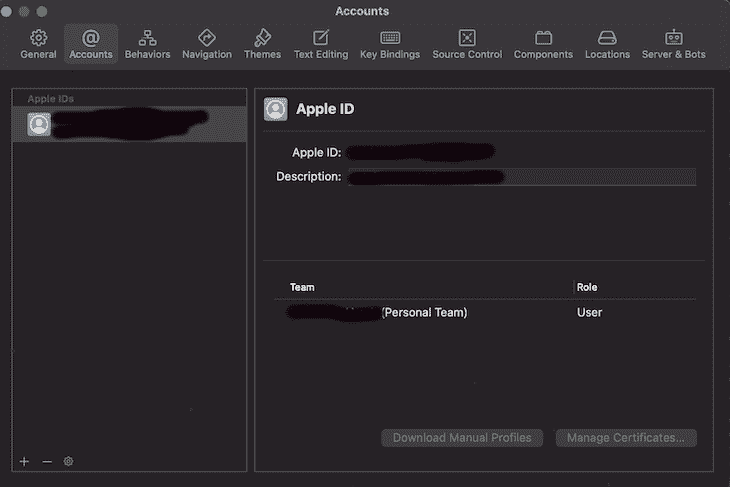
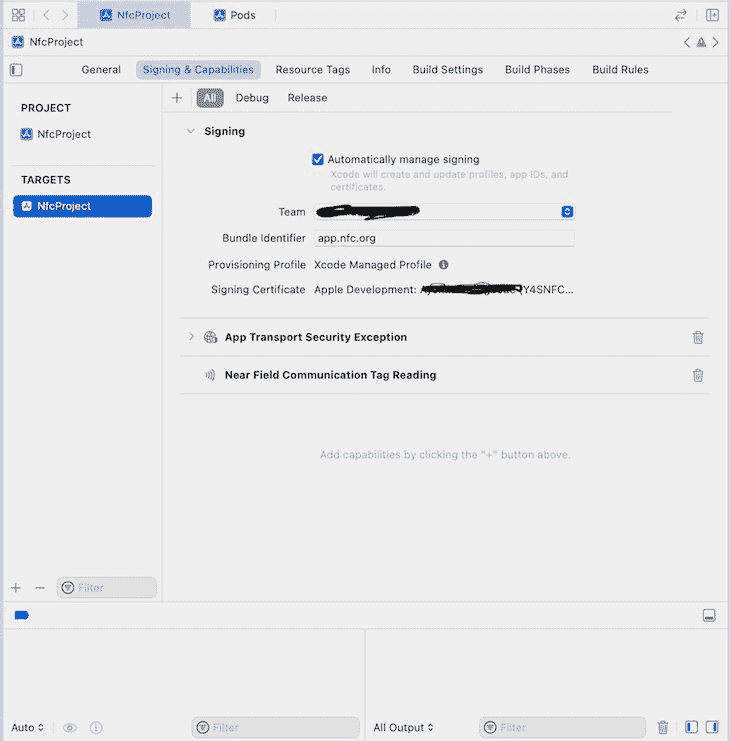
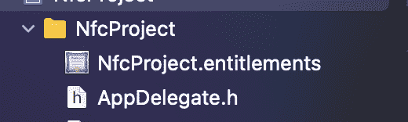
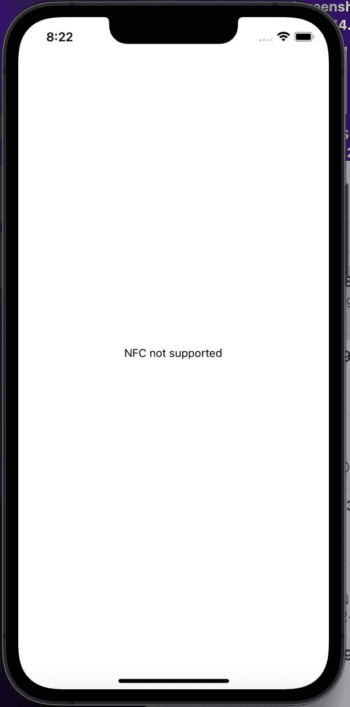
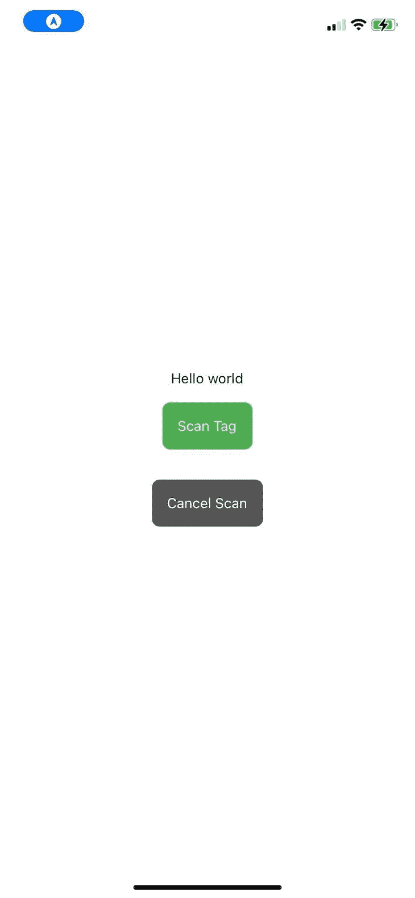
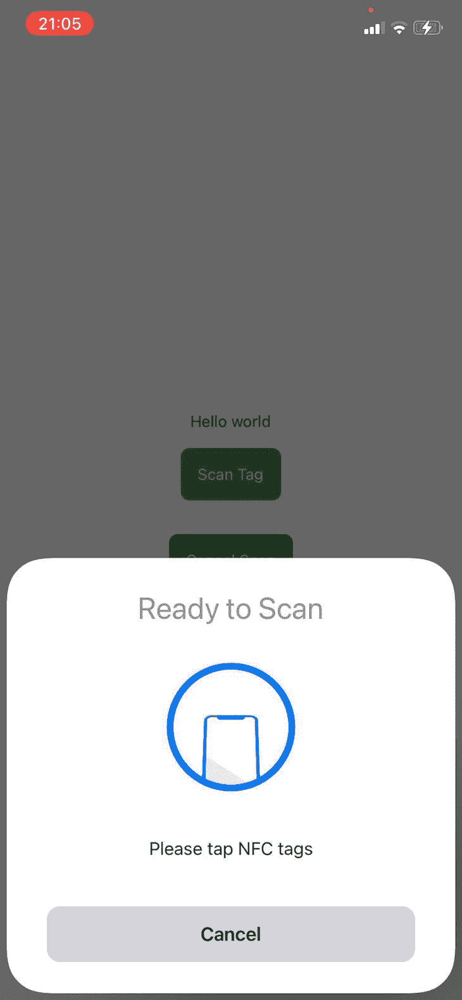
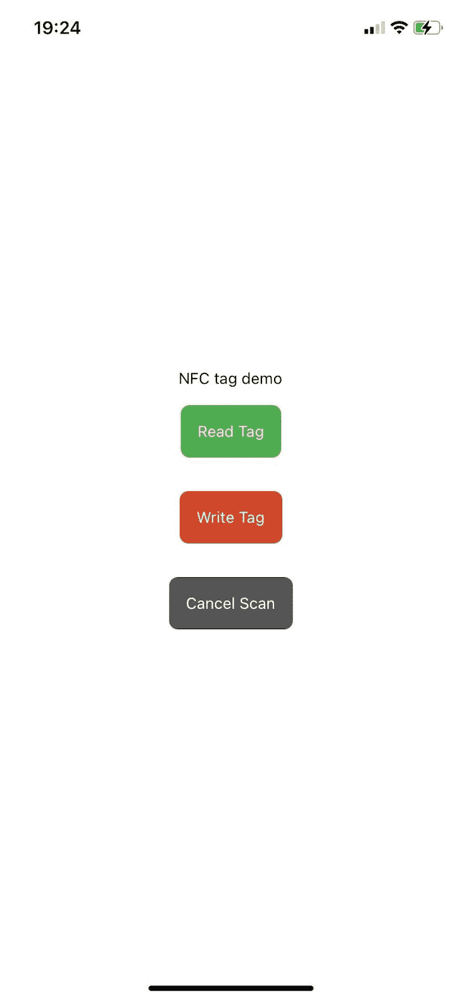

# 如何在 React Native 中使用 NFC 标签

> 原文：<https://blog.logrocket.com/using-nfc-tags-react-native/>

近场通信(NFC)允许数据在彼此靠近的设备之间传输。NFC 标签是嵌入了存储信息的微型芯片的贴纸或腕带，可以在十厘米内被 NFC 阅读器读取。

使用 NFC 标签，您可以轻松传输少量信息，如应用程序 URL、加密的银行帐户等。NFC 最大的优点是不需要配对或任何手动输入来建立连接。您只需轻轻一点就可以传输数据，我们稍后会演示这一点。在本文中，我们将介绍什么是 NFC 标签，以及如何在 React Native 中使用它们。我们开始吧！

我们可以在需要快速交换数字化数据的应用中使用 NFC 标签。NFC 标签包含存储器和无线电芯片。由于磁感应，NFC 标签没有自己的电源。相反，它们从读取它们的设备获得能量。

本质上，当 NFC 阅读器被带到 NFC 标签的 10 厘米范围内时，NFC 标签被通电，传输存储在其微芯片内的任何数据。当阅读器验证信息时，信息交换完成。NFC 读卡器一次只能连接一个 NFC 标签，最大限度地减少意外交易。

## NFC 标签阅读器是如何工作的？

之前，我们提到 NFC 标签读取器充当电源，从无源 NFC 标签读取信息。NFC 标签读取器需要电源通过线圈将电流传递到 NFC 标签，从而在读取器周围产生磁场。

由于[法拉第感应定律](https://en.wikipedia.org/wiki/Faraday%27s_law_of_induction)，将标签放在磁场范围内会导致两个线圈之间的感应耦合，这就是信息交换发生的时间。

现在我们已经了解了 NFC 标签和 NFC 标签读取器的基础知识，让我们学习如何编写 React 本机代码来读写 NFC 标签。首先，让我们使用下面的命令初始化一个新的 React 本地项目:

```
npx react-native init NFCTutorial

```

上面的命令将在您选择的位置安装一个新的 React 本机样板文件，这样您就可以快速开始编写代码。运行以下命令，使用 pods 安装 iOS 依赖项。 [CocoaPods](https://cocoapods.org/) 是 Swift 等 iOS 编程语言的依赖管理器:

```
cd ios && pod install && cd ..

```

然后，运行`npm start`启动 [Metro bundler](https://facebook.github.io/metro/) 和`npm ios`在 iOS 模拟器上运行项目。

在本教程中，我们将使用 [react-native-nfc-manager](https://github.com/revtel/react-native-nfc-manager) 。但是，在进入代码之前，我们需要配置 Android 和 iOS 平台来启用 NFC。尽管我们将介绍 Android 和 iOS 平台的配置，但我们将只演示在 iOS 设备上读写 NFC 标签。

## Android 的 NFC 配置

为了访问 Android 设备的 NFC 硬件并正确处理 NFC 意图，我们将在`AndroidManifest.xml`文件中声明这些项目:

`uses-feature`元素确保应用程序仅在具有 NFC 硬件的设备上显示在 Google Play 中:

```
<uses-feature android:name="android.hardware.nfc" android:required="true" />

```

NFC `uses-permission`元素允许访问 NFC 硬件:

```
<uses-permission android:name="android.permission.NFC" />

```

## 在 iPhone 上请求 NFC 访问

首先，你需要注册[苹果开发者计划](https://idmsa.apple.com/IDMSWebAuth/signin?appIdKey=891bd3417a7776362562d2197f89480a8547b108fd934911bcbea0110d07f757&path=%2Faccount%2F&rv=1)；您还需要为应用程序创建一个应用程序身份，以便可以在 iOS 设备上测试 NFC 项目。

*   在 Mac 上的 Xcode 中，导航到 **Xcode** → **偏好设置** → **账户**
*   点击左下角的 **+** 图标，添加您的 Apple ID
*   选择您的帐户。在主账户窗口右侧`Team`下显示为`(Personal Team)`，`Role`显示为`User`



*   从菜单栏中点击**窗口** → **设备和模拟器** *→* **设备**
*   用 lightning 线缆连接您的 iPhone，并通过右侧的**活动方案**下拉菜单选择它作为构建目的地
*   接下来，打开我们之前在 Xcode 上安装的项目
*   在 **General** 选项卡下，将捆绑包标识符更改为唯一标识符

在`Signing and capabilities`选项卡中，选择您用于项目的合适团队。然后，在`Signing and capabilities`选项卡下，选择**功能**或点击 **+** 符号并搜索`Near field communication tag`以在项目上启用 NFC 功能:



请注意 Xcode 如何创建了一个名为`entitlements`的文件夹，其中包含应用程序功能:



最后，让我们编辑`info.plist`文件，添加下面几行描述项目的代码:

```
<key>NFCReaderUsageDescription</key>
<string>Reading NFC with react native</string>

```

这就是所有需要的配置！继续操作，点击 Xcode 上的 **run** 按钮，这样我们就可以在连接的 iPhone 设备上查看项目了。现在，让我们继续编写代码吧！

## 如何使用 React Native 读取 NFC 标签

首先，让我们安装 react-native-nfc-manager 库:

```
npm i --save react-native-nfc-manager

```

记得再次运行`cd ios && pod install`。

### 检查当前设备是否支持 NFC

我们需要导入 react-native-nfc-manager 库，然后我们将使用`isSupported()`方法来确定设备是否支持 nfc。在下面的代码中，我们创建了一个状态，当我们发现设备是否支持 NFC 时，该状态将被更新:

```
import NfcManager, { NfcEvents } from 'react-native-nfc-manager';

 const [hasNfc, setHasNFC ] = useState(null);

```

当组件挂载时，我们将在一个`useEffect`钩子中更新状态。一旦我们确认设备支持 NFC，我们将继续使用`start()`方法初始化 NFC 模块:

```
useEffect(() => {
    const checkIsSupported = async () => {
      const deviceIsSupported = await NfcManager.isSupported()

      setHasNFC(deviceIsSupported)
      if (deviceIsSupported) {
        await NfcManager.start()
      }
    }

    checkIsSupported()
  }, [])

```

现在，让我们编写将读取 NFC 标签的代码:

```
useEffect(() => {
    NfcManager.setEventListener(NfcEvents.DiscoverTag, (tag) => {
      console.log('tag found')
    })

    return () => {
      NfcManager.setEventListener(NfcEvents.DiscoverTag, null);
    }
  }, [])

  const readTag = async () => {
    await NfcManager.registerTagEvent();
  }

```

在上面的`useEffect()`钩子中，事件监听器正在监听一个名为`onDiscoverTag`的事件。您还可以使用`setAlertMessages()`来设置用户界面消息的形式，供用户查看。我们用`registerTagEvent()`开始检测 NFC 标签的过程，用`unregisterTagEvent()`取消它。

如果设备支持 NFC，我们将有条件地呈现一个按钮，如果不支持，我们将呈现一条消息。下面的代码是点击时调用`readTag()`的按钮的代码:

```
if (hasNfc === null) return null;

  if (!hasNfc) {
    return (
      <View style={styles.sectionContainer}>
        <Text>NFC not supported</Text>
      </View>
    )
  }

  return (
    <SafeAreaView style={styles.sectionContainer}>
      <Text>Hello world</Text>
      <TouchableOpacity style={[styles.btn, styles.btnScan]} onPress={readTag}>
        <Text style={{ color: "white" }}>Scan Tag</Text>
      </TouchableOpacity>
      <TouchableOpacity style={[styles.btn, styles.btnCancel]} onPress={cancelReadTag}>
        <Text style={{ color: "white" }}>Cancel Scan</Text>
      </TouchableOpacity>
    </SafeAreaView>
  );

```

下图显示了不支持 NFC 扫描的模拟器上的项目:



下面的屏幕截图显示了项目在物理设备上的样子:



当您点击**扫描标签**按钮时，如下图所示，设备将准备读取 NFC 标签:



如何编写 NFC 标签

## 到目前为止，我们已经建立了如何检查设备是否支持 NFC 标签，以及如何读取 NFC 标签来访问其中存储的信息。现在，我们将学习如何将信息编码到 NFC 标签中，以便当读取器读取它时，他们将访问我们写入标签的信息。例如，我们将对[日志 URL](https://blog.logrocket.com/) 进行编码:

在上面的代码中，我们通过`NfcManager.requestTechnology`请求了特定的 NFC 技术。在我们的例子中，它是 [Ndef 技术](https://developer.android.com/reference/android/nfc/tech/Ndef)，一种数据格式。然后，我们使用`Ndef.encodeMessage`对我们想要编写的 URL 进行编码，并使用`writeNdefMessage(bytes)`来编写它。

```
const writeNFC = async() => {
    let result = false;

    try {
      await NfcManager.requestTechnology(NfcTech.Ndef);

      const bytes = Ndef.encodeMessage([Ndef.uriRecord('https://blog.logrocket.com/')]);

      if (bytes) {
        await NfcManager.ndefHandler
          .writeNdefMessage(bytes);
        result = true;
      }
    } catch (ex) {
      console.warn(ex);
    } finally {
      NfcManager.cancelTechnologyRequest();
    }

    return result;
  }

```

现在，我们将创建一个按钮，当用户想要将 LogRocket 博客 URL 写入 NFC 标签时，该按钮将调用此函数:

因此，当单击按钮时，NFC 抽屉准备将 LogRocket URL 编码为 NFC 标签:

```
<TouchableOpacity style={[styles.btn, styles.btnWrite]} onPress={writeNFC}>
        <Text style={{ color: "white" }}>Write Tag</Text>
 </TouchableOpacity>

```



结论

## NFC 技术用于我们日常生活的许多方面，包括非接触式支付、音乐会门票兑换和场地位置登记，仅举几例。

在本文中，我们探讨了如何读写 NFC 标签来编码或访问其中的信息。我们使用 React Native 和 iOS 构建了一个示例应用程序来轻松传输 URL，但是，您可以根据本教程中的信息在自己的项目中实现 NFC 标签。我希望你喜欢这本书，如果你有任何问题，一定要留下评论。编码快乐！

[LogRocket](https://lp.logrocket.com/blg/react-native-signup) :即时重现 React 原生应用中的问题。

## [LogRocket](https://lp.logrocket.com/blg/react-native-signup) 是一款 React 原生监控解决方案，可帮助您即时重现问题、确定 bug 的优先级并了解 React 原生应用的性能。

[](https://lp.logrocket.com/blg/react-native-signup)

LogRocket 还可以向你展示用户是如何与你的应用程序互动的，从而帮助你提高转化率和产品使用率。LogRocket 的产品分析功能揭示了用户不完成特定流程或不采用新功能的原因。

开始主动监控您的 React 原生应用— [免费试用 LogRocket】。](https://lp.logrocket.com/blg/react-native-signup)

Start proactively monitoring your React Native apps — [try LogRocket for free](https://lp.logrocket.com/blg/react-native-signup).