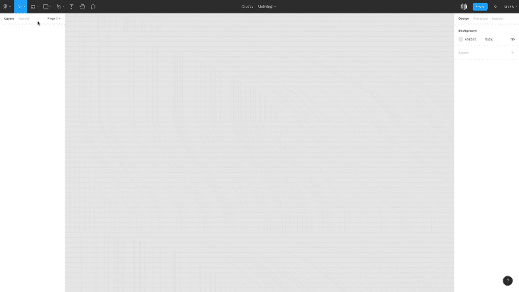
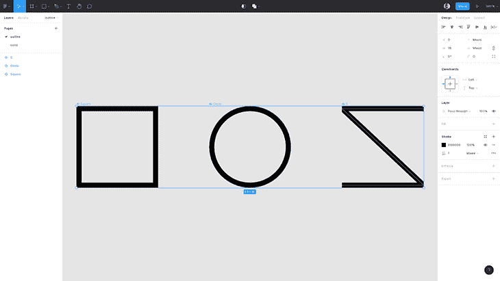
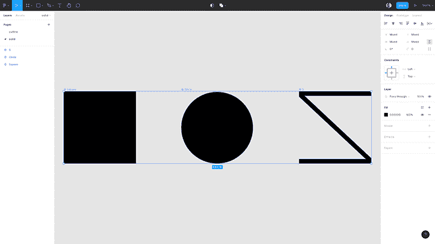
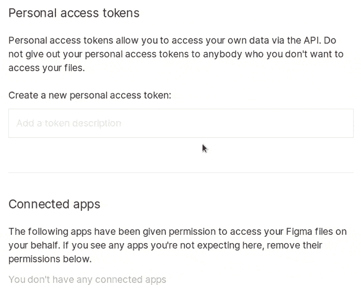
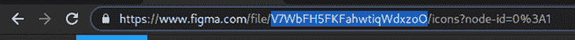

# 使用 npm 创建 JavaScript 图标库

> 原文：<https://blog.logrocket.com/using-npm-to-create-javascript-icon-libraries/>

## 介绍

在本文中，我们将学习如何使用[节点包管理器(npm)](https://www.npmjs.com/) 创建 JavaScript 图标库。要开始，请确保您具备以下条件:

*   节点 v14 ( [nvm](https://github.com/nvm-sh/nvm) ，或节点版本管理器，可用于指定每个工作目录的节点版本)
*   国家预防机制账户
*   Figma 帐户

## 初始设置

在命令行上为您的包创建一个目录，其中`$package_name`是您的实际包名。

```
$ mkdir $package_name && cd $package_name

```

在确定了包的名称之后，您需要知道它是否将被限定范围(例如，`package` vs. `@username/package`)。在开发过程的早期找到并注册一个名字是非常重要的，因为名字只能使用一次，其他开发人员可能会抢先一步。

要查找某个名称是否可用，您可以使用这个方便的 [npm 名称检查器](https://remarkablemark.org/npm-package-name-checker/)，或者您可以在浏览器中键入`[https://www.npmjs.com/package/](https://www.npmjs.com/package/)`，并将您选择的名称附加到 URL 的末尾，如下所示:

```
https://www.npmjs.com/package/iconslib
```

如果该名称可用，您将看到一个 404 页面。如果您怀疑该包是为将来使用而注册的，您可以[要求 npm](https://www.npmjs.com/policies/disputes) 提供名称。

运行`$ npm init`。如果您想要的包名不可用，您可以通过运行`$ npm init --scope=$your_username`使用您的用户名来确定包的范围。这将提示您填充一些常见的 npm 属性并创建一个`package.json`，我们将在整篇文章中继续填充。确保将版本设置为`0.0.0`。

您的`package.json`应该是这样的:

```
{
  "name": "$package_name",
  "version": "0.0.0",
  "description": "$package_description",
  "main": "index.js",
  "scripts": {
    "test": "echo \"Error: no test specified\" && exit 1"
  },
  "author": "$your_username <$your_email> ($your_website)",
  "license": "$license"
}

```

### 选择 npm 许可证

选择一个合适的许可证对你构建的每个 npm 包都是至关重要的，因为没有一个许可证，许多个人和组织会放弃使用你的包。

参观[选执照](https://choosealicense.com/)挑一个。复制文本并相应地替换`[year]`和`[fullname]`，然后将内容粘贴到包目录根目录下的`license`文件中。

如果您做了更改，不要忘记更新`package.json`中的`license`属性。

### 设置 Git 和 GitHub

从自动更新你过时的依赖到运行测试和标记你的发布，GitHub 将在维护你的 npm 包中发挥巨大的作用。

首先，在您的包目录中运行`$ git init`来初始化一个新的 Git 存储库。

然后，创建一个带有简短描述的`README.md`文件，稍后您可以对其进行扩展，并创建一个包含以下内容的`.gitignore`文件:

```
# build output

# dependencies
/node_modules

# build
/outline
/solid

# misc
.DS_Store
.npm
.eslintcache
.yarn-integrity

# env files
.env

# Logs
logs
*.log
npm-debug.log*
yarn-debug.log*
yarn-error.log*

# Output of 'npm pack'
*.tgz
/package

```

之后，访问`[https://github.new](https://github.new)`并创建一个存储库。

在添加一个`remote`或者对这个新的存储库进行任何修改之前，您首先需要通过添加`repository`、`bugs`和`homepage`属性来修改您的`package.json`。您还可以添加`keywords`属性，使您的包更容易被发现。

```
{
  "homepage": "https://github.com/$your_username/$github_repo#readme",
  "repository": {
    "type": "git",
    "url": "git+https://github.com/$your_username/$github_repo.git"
  },
  "bugs": {
    "url": "https://github.com/$your_username/$github_repo/issues"
  },
  "keywords": [
    "icons",
    "svg",
    "react"
  ]
}

```

如果您打算为您的图标库建立一个网站，您可以将`homepage`的值设置为您的域名。主页可通过`$ npm home <package>`访问。

然后，您可以将现有的存储库推送到 GitHub:

```
$ git add . && git commit -m 'initial commit'
$ git remote add origin [email protected]:$your_username/$github_repo.git
$ git branch -M main
$ git push -u origin main

```

### 提前向 npm 发布

如前所述，尽早发布到 npm 可以保护您的包名不被他人盗用。要发布到 npm，[创建一个帐户](https://www.npmjs.com/signup)并在您的包目录的根目录的命令行上验证您自己。

```
$ npm login

```

这将提示您输入凭据。之后，您将能够使用以下命令发布到 npm 注册表:

```
$ npm publish --access public

```

这将使用您在`package.json`中定义的`name`属性创建一个公共 npm 包。

如果您想[取消发布您的包](https://www.npmjs.com/policies/unpublish)，运行`$ npm unpublish $package_name -f`。理想情况下，这在发布后的 72 小时内完成，但是如果需要的话，npm 有一些额外的关于在这个时间框架后取消发布的指导方针。

一旦发布，您的包将在`[https://www.npmjs.com/package/$package_name](https://www.npmjs.com/package/%24package_name)`存活。

## 创建图标

SVG 规范的灵活性允许图标设计者使用规范的不同特性以多种方式实现相同的视觉效果，例如使用`path`与基本形状，或者`fill`与`stroke`。

然而，当创建一个图标集或库时，必须做一些假设以允许更好的优化，因为您必须分发尽可能优化的 SVG 文件。

### 轮廓与实心图标

一个很容易做出的假设是使用`stroke`表示轮廓图标，使用`fill`表示实心图标。当可识别性至关重要时，人们倾向于使用实心图标，因此`fill` s 将很好地服务于这一目的。`Stroke`非常适合创建微小的细节，因此它们与轮廓图标配合得很好。

这是一个简单优化的有用的经验法则，因为你会有一个使用`stroke` s 编写的轮廓图标子集和一个使用`fill` s 编写的轮廓图标子集。你将避免使用`stroke` s 和`fill` s 编写的单个图标的噩梦，这在关键方面是不可能优化的。

请注意，如果你正在创建一个双色调图标集，你将不得不使用不同的策略。如果你正在寻找创建图标的进一步的最佳实践，谷歌的[系统图标指南](https://material.io/design/iconography/system-icons.html)是一个很好的资源。

### 使用 Figma 作为设计工具

SVG 规范非常庞大，只有部分被供应商实现，包括编辑器和浏览器。通过将 SVG 导出和导入到不同的环境中，您会不断地“破坏”它们。

如果您使用 [Figma](https://blog.logrocket.com/using-figma-variants-for-better-error-handling-design/) ，您可以使用钢笔从预绘制的向量中分支出来，并创建斜接关节。不幸的是，这在浏览器中还没有实现:



Figma 中的可导出图标

### 为了能够在稍后的 npm 包构建过程中以编程方式从 Figma 导出图标，您需要从您的图标创建 Figma 组件，并将它们分成`outline`和`solid`页面。

创建构建过程



Outline icons created using stroke



Solid icons created using fill

## 计划性出口

### 一旦完成，使用 [`figma-export`软件包](https://github.com/marcomontalbano/figma-export)从 Figma 自动导出你的图标。你需要一个个人访问令牌，可以从你的 [Figma 账户设置](https://www.figma.com/settings)以及你的 Figma 文件的 ID 中获得。



此 URL 突出显示的部分是您的文件 ID:



为了快速测试我们的 Figma 图标，我们可以运行下面的`npx`命令:

分别用您的令牌和文件 ID 替换`FIGMA_TOKEN`的值和`V7WbFH5FKFahwtiqWdxzoO`。

```
$ FIGMA_TOKEN=180901-363fe5d2-f0c2-45a9-b564-d49c708281ea npx -p @figma-export/cli -p @figma-export/output-components-as-svg figma-export components V7WbFH5FKFahwtiqWdxzoO -O @figma-export/output-components-as-svg

```

该命令应该创建一个包含以下内容的`output`目录:

如果导出成功，我们可以继续创建 npm 包。

```
output
├── outline
│   ├── Circle.svg
│   ├── Square.svg
│   └── S.svg
└── solid
    ├── Circle.svg
    ├── Square.svg
    └── S.svg

```

在 npm 软件包中安装依赖项

### 回到我们的包目录，安装`dotenv`、`@figma-export/cli`和`@figma-export/output-components-as-svg`作为开发依赖项:

在`.env`文件中，包含`FIGMA_TOKEN`环境变量，如下所示:

```
$ npm install --save-dev dotenv @figma-export/cli @figma-export/output-components-as-svg

```

`dotenv`将用于在构建过程中加载我们的变量。

```
# .env
FIGMA_TOKEN=180901-363fe5d2-f0c2-45a9-b564-d49c708281ea # use your own
FILE_ID=V7WbFH5FKFahwtiqWdxzoO

```

配置`figma-export`

### 在根目录下创建一个`figma.config.js`文件，然后继续以下步骤:

需要`dotenv`的`config`函数，它读取`.env`并用你的变量填充`process.env`

*   定义一个保存 Figma 文件 ID env 变量的`fileId`常量
*   为`figma-export`的输出目录定义一个`outputters`常量
*   导出一个类型为`FigmaExportRc`的对象，这有助于自动完成并从`solid`和`outline` Figma 页面中提取
*   为了测试这是否有效，运行`$ npx figma-export use-config figma.config.js`，这将创建单独的`solid`和`outline`目录来保存我们的图标。

```
// figma.config.js
require("dotenv").config();const fileId = process.env.FILE_ID;
const outputters = [
require("@figma-export/output-components-as-svg")({ output: "./" })
];/** @type {import('@figma-export/types').FigmaExportRC} */
module.exports = {
commands: [
[ "components", {
fileId,
onlyFromPages: ["solid"],
outputters,
},
],
[ "components", {
fileId,
onlyFromPages: ["outline"],
outputters,
},
],
],
};

```

优化图标

## 为了优化，我们将使用无处不在的 [`svgo`](https://github.com/svg/svgo) 。SVGO 根据我们配置使用的插件集来优化我们的 SVG。您可以使用这个 [SVGO 前端工具](https://jakearchibald.github.io/svgomg/)在浏览器中直接测试这些规则的子集。

至于优化，我们将应用[默认配置](https://github.com/svg/svgo#configuration:~:text=See%20the%20list%20of%20the%20default%20plugins:)，并在我们认为合适的地方偏离。

`removeDimensions`

### 通过移除`width`和`height`以支持`viewBox`，您可以避免依赖默认大小。这有助于识别导出不良的 SVG，设计工具会在 SVG 的尺寸上增加一两个像素——例如，将图标从`100px`改为`101px`。依赖默认大小会使 SVG 看起来很清晰，但手动将预期大小重置为`100px`会导致 SVG 看起来有点模糊，并提示您正确地重新导出。

`removeAttrs`和`addAttributesToSVGElement`

### 我们分开`solid`和`outline`变量优化的原因是，我们只有一个特定的属性。`removeAttrs`将允许我们从 SVG 中完全删除我们选择的属性，而`addAttributesToSVGElement`将允许我们将它添加回`svg`元素本身。

设置`currentColor`值

```
<!-- before -->
<svg fill="none"  viewBox="0 0 16 16">
  <path stroke="#000" d="M.5.5h15v15H.5V.5z"/>
  <path stroke="#000" d="M6 10V6h4v4H6z"/>
</svg>

<!-- after -->
<svg stroke="#000" fill="none"  viewBox="0 0 16 16">
  <path d="M.5.5h15v15H.5V.5z"/>
  <path d="M6 10V6h4v4H6z"/>
</svg>

```

### `currentColor`被广泛认为是第一个 CSS 变量。将 CSS 中的一个颜色值设置为`currentColor`(例如`border: 2px dashed currentColor`)会自动地、反应性地选取该元素的`color`属性值。

在我们的 SVG 中，我们可以用`currentColor`预先填充`fill`和`stroke`属性，让用户更容易覆盖图标的颜色。

注意，当 SVG 在``中用于浏览器缓存目的时，`currentColor`将简单地将 SVG 渲染成黑色。在这种情况下要改变颜色，你可以使用 [SVG 的 feColorMatrix 滤镜](https://codepen.io/cassie-codes/pen/OrxRaz)。

另外，注意`outline` SVGs 中的`fill="none"`需要保持原样。

优化 SVG

## 为了利用`svgo`，我们可以直接安装并运行导出的 SVG。但是因为我们已经在使用`figma-export`，它有作为`transformer`的`svgo`集成，我们将使用它来代替。

除了默认配置，我们还将添加这些优化，其中`sortAttrs`是一种风格选择:

```
$ npm i --save-dev @figma-export/transform-svg-with-svgo

```

最后，我们将为图标创建命令添加一个`figma` npm 脚本:

```
// figma.config.js
require("dotenv").config();
const svgo = require('@figma-export/transform-svg-with-svgo')

const fileId = process.env.FILE_ID;
const outputters = [
  require("@figma-export/output-components-as-svg")({ output: "./" })
];

/** @type {import('svgo').PluginConfig[]} */
const solidSVGOConfig = [
  { removeDimensions: true },
  { sortAttrs: true },
  { removeAttrs: { attrs: "fill" } },
  { addAttributesToSVGElement: { attribute: { fill: "currentColor" } } },
];

/** @type {import('svgo').PluginConfig[]} */
const outlineSVGOConfig = [
  { removeDimensions: true },
  { sortAttrs: true },
  { removeAttrs: { attrs: "stroke" } },
  { addAttributesToSVGElement: { attribute: { stroke: "currentColor" } } },
];

/** @type {import('@figma-export/types').FigmaExportRC} */
module.exports = {
  commands: [
    ["components", {
        fileId,
        onlyFromPages: ["solid"],
        transformers: [svgo({ multipass: true, plugins: solidSVGOConfig })],
        outputters,
      },
    ],
    ["components", {
        fileId,
        onlyFromPages: ["outline"],
        transformers: [svgo({ multipass: true, plugins: outlineSVGOConfig })],
        outputters,
      },
    ],
  ],
};

```

运行`$ npm run export`将输出我们的`outline`和`solid`目录。

```
{
  "scripts": {
    "export": "figma-export use-config figma.config.js"
  }
}

```

打包您的图标

## 要发布你的图标，我们必须首先决定发布什么。为此，npm 的`package.json`使用了 [`files`](https://docs.npmjs.com/cli/v7/configuring-npm/package-json#files) 属性。当你不给它一个值时，npm 将会发布所有不包括在`.gitignore`中的内容。出于我们的目的，`outline`和`solid`都是需要发布的，所以我们将为`package.json`添加一个`files`数组，如下所示:

注意`README.md`、`package.json`和`LICENSE`都是发布的，与设置无关。有了这个改变，我们现在可以测试和发布我们的包了。

```
{
  "files": [
    "outline/",
    "solid/"
  ]
}

```

测试和发布我们的 npm 包

## 为了模拟发布我们的 npm 包，我们可以使用`npm pack`命令。运行`npm pack`将创建一个以您的包的名称和版本命名的 TAR 文件。我们可以解压 TAR 文件来测试我们的包。

这将输出一个保存我们发布的文件的`package`目录。

```
$ tar zxvf $package_name-0.0.0.tgz

```

非常重要的是要注意，如果你在运行`npm run export`后删除或修改了`outline`或`solid`目录，那么这些修改将按照`npm pack`的指示被发布。因此，我们应该设置一个 npm 脚本来清理、导出和发布软件包，以消除任何干扰的机会。

清理和构建脚本

### 为了清理我们的工作空间，我们需要删除`outline`、`solid`和`package`目录以及任何 tar 文件，尽管`package`和 TAR 文件被排除在发布之外。

我们可以求助于`$ rm -rf`来移除这些目录和文件，但是`rm`不是跨平台的。另一种选择是安装 [`rimraf`](https://docs.npmjs.com/cli/v7/configuring-npm/package-json#files) 并使用它。

为了构建我们的包，我们将使用`npm-run-all`包连续运行脚本`clean`和`export`，这暴露了一个我们可以使用的`run-s`脚本。

```
$ npm i --save-dev rimraf

{
  "scripts": {
    "clean": "rimraf outline solid package *.tgz",
    "export": "figma-export use-config figma.config.js"
  }
}

```

运行`npm run build`现在将运行我们的`clean`和`export`脚本。

```
$ npm i --save-dev npm-run-all

{
  "scripts": {
    "clean": "rimraf outline solid package *.tgz",
    "export": "figma-export use-config figma.config.js",
    "build": "run-s clean export"
  }
}

```

测试

### 从 Figma 中自动导出图标意味着我们现在可以编写一个简单的测试脚本来确保我们的图标被正确导出。为此，我们可以安装标记解析器`cheerio`，来验证我们的`viewBox`属性。

为了测试我们的图标，我们将创建一个包含以下内容的`test.js`:

```
$ npm i --save-dev cheerio

```

这将从`outline`和`solid`目录中读取所有 SVG 并循环遍历它们，将它们的`viewBox`属性与`0 0 16 16`进行比较。如果比较失败，我们会显示一条有用的消息，并使用一个`1`退出代码退出节点流程，表明我们的测试脚本已经失败。

```
const fs = require("fs");
const $ = require("cheerio");

const directories = ["outline", "solid"];
let errors = 0;

directories.forEach((dir) =>
  fs.readdirSync(dir).forEach((file) => {
    const viewBox = $.load(fs.readFileSync(`${dir}/${file}`))("svg").attr(
      "viewBox"
    );
    if (viewBox !== "0 0 16 16") {
      console.error(
        `Error: \`${dir}/${file}\` has a viewBox of \x1b[31m\`${viewBox}\`\x1b[0m`
      );
      errors++;
    }
  })
);

if (errors > 0) {
  process.exit(1);
} else {
  console.log("Tests passed!");
}

```

在我们的`package.json`中，我们应该更新我们的脚本，添加一个`test`脚本:

`npm t`是`npm run test`的简写，我们可以用它来手动运行我们的测试脚本。

```
{
  "scripts": {
    "clean": "rimraf outline solid package *.tgz",
    "export": "figma-export use-config figma.config.js",
    "test": "node test.js",
    "build": "run-s clean export"
  }
}

```

发布我们的图标

## 向 npm 发布新版本需要运行测试、修改包版本和添加 Git 标签。

语义版本控制

### 为了碰撞版本，npm 通过它的`npm version`命令使用语义版本化，或`semver`。

`semver`是 API 版本最流行的格式之一。出于我们的目的，一个简单的`MAJOR.MINOR.PATCH`格式就足够了。

根据`semver`的说法，当您的更改打破了 API 的现有使用时，`MAJOR`应该增加。`MINOR`保留用于添加功能，同时保持向后兼容性。当我们的更改旨在修复一个错误时，应该增加。

在将您的更改提交到`git`之后，运行`npm version`然后运行`major`、`minor`或`patch`会相应地增加版本。

Git 标签

### [Git 标签](https://docs.npmjs.com/cli/v7/configuring-npm/package-json#files)用于将特定版本与 Git 历史中的某一点联系起来，这在用户使用非最新版本的软件包时会很方便。

要创建一个标签，您可以使用相应的版本和注释运行`git tag v0.0.0 -m` `initial release`。

更好的`npm publish`

## 由于增加了测试、修改版本和标记我们的版本，发布新版本时很有可能会不小心跳过某个步骤。为了帮助安全地发布我们的包，我们可以依靠 [`np`](https://www.npmjs.com/package/np) 。

在我们的`package.json`中，我们将添加一个运行`build`和`np`的`release`脚本。

```
$ npm i --save-dev np

```

为了发布我们的版本，我们应该首先提交我们的更改——不要推送，因为`np`会为我们推送我们的更改——然后我们应该运行:

```
{
  "scripts": {
    "clean": "rimraf outline solid package *.tgz",
    "export": "figma-export use-config figma.config.js",
    "test": "node test.js",
    "build": "run-s clean export",
    "np": "np",
    "release": "run-s build np"
  }
}

```

这将构建我们的包，并提示我们升级我们的版本，并针对我们的 Git 存储库和 npm 依赖项运行多次检查。`np`将在 GitHub 中打开一个新的发布页面，允许我们添加最新标签和附件。

```
$ npm run release

```

使用 SVG 作为 React 组件

## 用户可以通过多种方式将 SVG 转换成 React 组件。然而，我们可以提前做工作，使我们的软件包更加通用。

我们将依靠`[svgr](https://react-svgr.com/)`将我们的 SVG 转换成 React 组件。和`svgo`一样，`figma-export`也有一个我们将使用的`svgr`插件。

在`figma.config.js`中，我们可以向我们的`outputters`数组添加一个额外的值，如下所示:

```
$ npm i --save-dev @figma-export/output-components-as-svgr

```

运行`npm run export`现在将创建一个`src`目录，其中有保存 React 组件的`outline`和`solid`子目录。

```
const outputters = [
  require("@figma-export/output-components-as-svg")({ output: "./" }),
  require("@figma-export/output-components-as-svgr")({
    output: "./src",
  }),
];

```

这些 React 组件是用 JSX 语言编写的，这意味着用户需要一个`build`步骤来使用它们。因此，我们将使用 bundler 将组件转换成 JavaScript。我们还将添加类型脚本支持。

我们将首先在项目的根目录下为 [Rollup](https://rollupjs.org/guide/en/) 创建一个`index.js`入口点，它将导出我们的 React 组件。

```
$ npm i --save-dev react rollup typescript @rollup/plugin-typescript @types/react

```

然后，修改我们的`outputters`生成`tsx`文件。

```
// ./index.js
export * from "./src/solid";
export * from "./src/outline";

```

接下来，我们将创建`tsconfig.json`和`rollup.config.js`文件以及一个`bundle` npm 脚本，将我们的文件捆绑到一个`react/index.js`文件中:

```
const capitalize = (s) => s.charAt(0).toUpperCase() + s.slice(1);

const fileId = process.env.FILE_ID;
const outputters = [
  require("@figma-export/output-components-as-svg")({ output: "./" }),
  require("@figma-export/output-components-as-svgr")({
    getFileExtension: () => ".tsx",
    getComponentName: ({ componentName, pageName }) =>
      componentName + capitalize(pageName),
    getSvgrConfig: () => ({ typescript: true }),
    output: "./src",
  }),
];

```

运行`npm run build`将生成一个带有`index.js`的`react`目录，保存我们的捆绑组件，我们将把它指定为我们在`package.json`中的包的`main`条目。

```
// tsconfig.json
{
  "compilerOptions": {
    "jsx": "react",
    "strict": true,
    "noImplicitAny": true,
    "allowSyntheticDefaultImports": true,
    "declaration": true,
    "outDir": "react"
  }
}

// rollup.config.js
import typescript from "@rollup/plugin-typescript";

const config = [
  {
    input: "index.js",
    output: {
      dir: "react",
      format: "module",
    },
    plugins: [typescript()],
  },
];

export default config;

{
  "scripts": {
    "bundle": "rollup --config",
    "build": "run-s clean export bundle",
  }
}

```

用户可以通过导入这些组件来使用它们:

```
{
  "main": "react/index.js"
}

```

要发布 React 组件的支持，我们必须在运行`npm run release`之前，首先将`react`目录添加到 npm 的`files`、`clean`脚本和`.gitignore`以及`src`中。我们还应该添加一个`[peerDependencies](https://nodejs.org/es/blog/npm/peer-dependencies/)`字段来表明使用我们的包需要`react`。

```
import { HouseSolid, GlobeOutline } from 'iconlib'

```

使用精灵和 cdn

```
// package.json
"files": [
  "outline/",
  "solid/",
  "react/"
],
"peerDependencies": {
  "react": ">= 16"
}

// package.json
"scripts": {
  "clean": "rimraf outline solid react src package *.tgz"
}

# .gitignore

# build
/outline
/solid
/react
/src

```

## 精灵是保存所有图标的单个文件，也是使用 SVG 的另一种方式。为了显示图标，我们依赖于`use` SVG 元素:

对于一些项目来说，精灵是使用 SVG 的最合适的方式。因此，我们将为我们的 SVG 导出精灵，并通过包 cdn 使它们随时可用。

```
<svg>
  <use xlink:href="path/to/sprite.svg#our-icon"/>
</svg>

```

首先，我们可以安装`@figma-export/output-components-as-svgstore`作为一个开发依赖项:

然后我们可以在我们的`outputters`数组中添加另一个条目，并指向一个`sprite`目录。我们也用我们的图标名作为`id`的小写字母。

```
$ npm i --save-dev @figma-export/output-components-as-svgstore

```

运行`npm run export`会在`sprite`目录中生成精灵。

```
const outputters = [
  // ...
  require("@figma-export/output-components-as-svgstore")({
    getIconId: ({ componentName }) => componentName.toLowerCase(),
    output: "./sprite",
  }),
];

```

通过将我们的`sprite`目录添加到`.gitignore`、`clean`脚本和`files`数组，我们可以将我们的精灵发布到 npm。

然后，每当有人通过像 [unpkg](https://unpkg.com/) 或 [jsDelivr](https://www.jsdelivr.com/) 这样的 CDN 访问我们的包时，我们可以通过在我们的`package.json`中添加`unpkg`、`cdn`和`jsdelivr`字段来指向我们的`outline`或`solid`精灵，并将它们指向我们的精灵:

```
# .gitignore

# build
/outline
/solid
/react
/src
/sprite

// package.json
"files": [
  "outline/",
  "solid/",
  "react/",
  "sprite/"
]

// package.json
"scripts": {
  "clean": "rimraf outline solid react src sprite package *.tgz"
}

```

如果有人访问`[https://unkg.com/$package_name](https://unkg.com/%24package_name)`，URL 将解析为我们的`outline.svg`精灵。

```
{  
  "jsdelivr": "sprite/outline.svg",
  "cdn": "sprite/outline.svg",
  "unpkg": "sprite/outline.svg"
}

```

结论

## 这篇博文涵盖了发布到 npm，创建优化图标，以及直接从 Figma 导出它们。我们还解决了测试问题，增加了 React 和 sprite 支持。请在下面告诉我们您的实现情况！

您是否添加了新的 JS 库来提高性能或构建新特性？如果他们反其道而行之呢？

## 毫无疑问，前端变得越来越复杂。当您向应用程序添加新的 JavaScript 库和其他依赖项时，您将需要更多的可见性，以确保您的用户不会遇到未知的问题。

LogRocket 是一个前端应用程序监控解决方案，可以让您回放 JavaScript 错误，就像它们发生在您自己的浏览器中一样，这样您就可以更有效地对错误做出反应。

[LogRocket](https://lp.logrocket.com/blg/javascript-signup) 可以与任何应用程序完美配合，不管是什么框架，并且有插件可以记录来自 Redux、Vuex 和@ngrx/store 的额外上下文。您可以汇总并报告问题发生时应用程序的状态，而不是猜测问题发生的原因。LogRocket 还可以监控应用的性能，报告客户端 CPU 负载、客户端内存使用等指标。

[](https://lp.logrocket.com/blg/javascript-signup)[https://logrocket.com/signup/](https://lp.logrocket.com/blg/javascript-signup)

自信地构建— [开始免费监控](https://lp.logrocket.com/blg/javascript-signup)。

Build confidently — [Start monitoring for free](https://lp.logrocket.com/blg/javascript-signup).