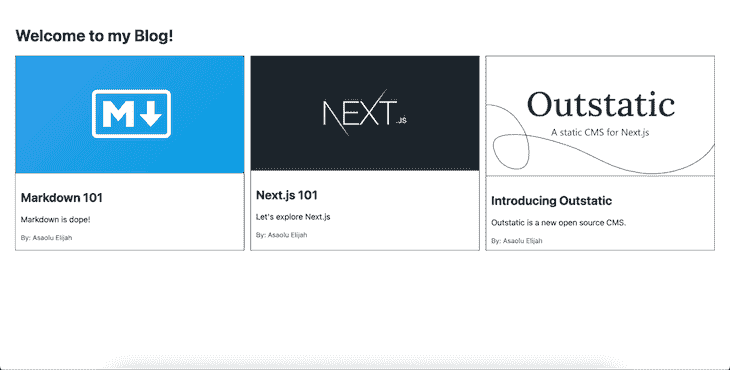
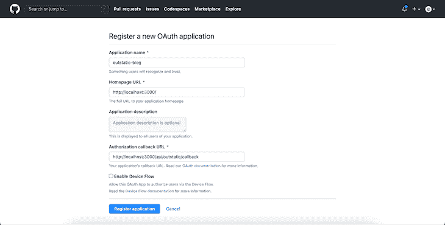
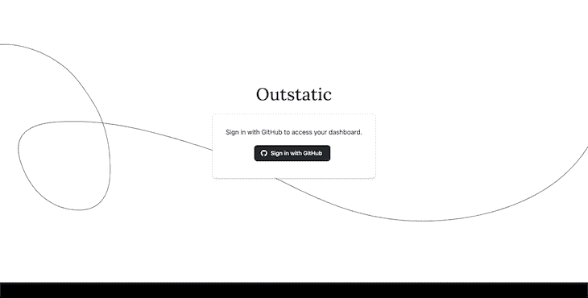
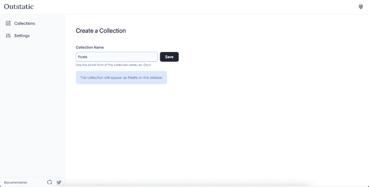
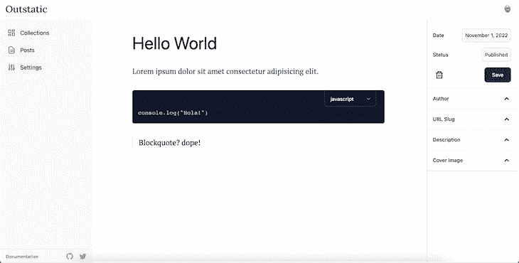
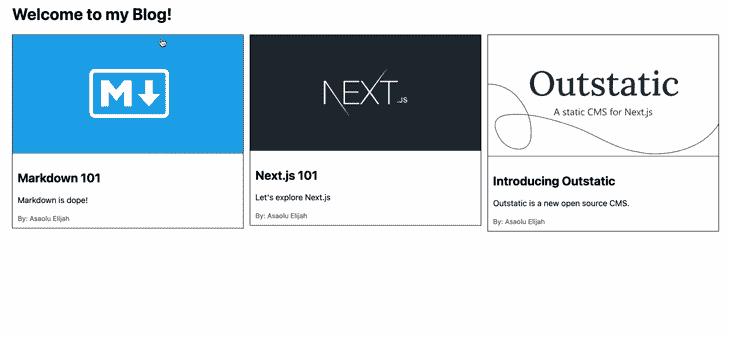

# 使用 Outstatic 进行 Next.js 静态站点管理

> 原文：<https://blog.logrocket.com/using-outstatic-next-js-static-site-management/>

像 WordPress 和 Drupal 这样的内容管理系统(CMS)使得在网上分享数字内容的过程变得不那么技术化了。它们在很大程度上消除了学习服务器端或数据库编程的需要。

静态 CMS 特别允许您为静态站点创建和管理数字内容。

在这个简短的指南中，我们将探索一个相对较新的静态 CMS 包。我们将讨论它是如何工作的，如何为 Next.js 应用程序安装和配置 Outstatic，以及如何开始创建和获取内容。

向前跳:

要跟随本教程，您应该熟悉 [Next.js 静态站点生成](https://blog.logrocket.com/ssg-vs-ssr-in-next-js/)，并具备一些 Git 和 GitHub 的基础知识。

## 什么是突出的？

[Outstatic 是为 Next.js 应用程序创建的静态 CMS 包](https://outstatic.com/)。它将于 2022 年底向开发者开放。

此工具使您能够创建、编辑和保存内容，然后自动提交到您的存储库并部署到您的实时网站。Outstatic 速度很快，不需要任何数据库配置，并包括一个仪表板来创建和管理您的内容。

这个框架的许多用例包括博客、用于管理和展示项目的组合网站、新闻网站和文档网站。

### Outstatic 如何工作

外围站使用集合文档模式存储数据。您可以将集合视为传统数据库中的一个表，而文档则是该表中的一条记录。

每个外围项目都链接到你的 GitHub 账户和一个 GitHub 库。然后，您创建的所有内容都被映射到远程 GitHub 存储库，并转换为 markdown 文件。

然后，您可以直接在您的外围仪表板上管理您的内容，或者根据需要在您的 Next.js 应用程序中获取它们。

## Outstatic 和 Next.js 入门

为了探索 Outstatic 的能力，我们将创建一个简单的博客网站来展示我们最近的作品。当一切都完成后，让我们先睹为快，看看我们的应用程序会是什么样子:



让我们从创建一个新的 Next.js 应用程序开始:

```
npx create-next-app outstatic-blog

```

如前所述，Outstatic 需要连接到 GitHub 才能运行。因此，在开始创建集合和文档之前，我们必须首先将项目推送到 GitHub。

转到 GitHub，[创建一个新的存储库](https://github.com/new)，并将我们刚刚创建的新 Next.js 应用程序推送到这个存储库中。如果你对这个程序不熟悉，可以参考 GitHub 的这个[有用指南。](https://docs.github.com/en/get-started/importing-your-projects-to-github/importing-source-code-to-github/adding-locally-hosted-code-to-github)

### 创建 GitHub OAuth 应用程序

您的外围仪表板是您可以管理所有内容的地方。要授权对这个仪表板的访问和对 GitHub 存储库的写访问，您需要创建一个新的 GitHub OAuth 应用程序。这将允许外围站远程创建集合和文件。

从[向 GitHub](https://github.com/settings/applications/new) 注册你的新 OAuth 应用开始。如果您直接按照本教程进行操作，那么在注册过程中，请确保您输入的信息与下面显示的信息相匹配:



在新的 GitHub OAuth 应用程序页面中，您应该看到显示的应用程序客户端 ID。您还应该看到一个“生成新的客户端密码”按钮。点击此按钮生成新的密码。

完成后，复制新生成的值和客户机 ID，并暂时保存在安全的地方。

### 将 Outstatic 添加到 Next.js

下一步是在 Next.js 应用程序中安装外围框架。我们可以使用以下命令来实现这一点:

```
npm install outstatic
# OR
yarn add outstatic

```

我们还需要安装以下 ProseMirror 依赖项，因为它们是创建外围内容编辑器所必需的:

```
npm install prosemirror-dropcursor prosemirror-gapcursor prosemirror-history
# OR
yarn add prosemirror-dropcursor prosemirror-gapcursor prosemirror-history

```

接下来，在 Next.js 的默认`/pages`目录中，创建一个新的`outstatic/[[...ost]].tsx`文件，并将以下内容粘贴到其中:

```
import 'outstatic/outstatic.css'
import { Outstatic, OstSSP } from 'outstatic'

export default Outstatic

export const getServerSideProps = OstSSP

```

上面的代码导出了`Outstatic`和一个`OstSSP`函数。`OstSSP`功能负责创建外围内容管理仪表板以及其他所有与服务器相关的操作。

此外，在默认的`/pages/api`中创建一个新的`outstatic/[[...ost]].tsx`文件，并将下面的代码粘贴到该文件中:

```
import { OutstaticApi } from 'outstatic'

export default OutstaticApi

```

上面的代码是 Outstatic 与 [Next.js API 特性](https://blog.logrocket.com/build-api-serverless-functions-next-js/)集成的地方，允许它异步获取创建的内容。

最后，在您的项目根文件夹中，创建一个新的`.env`文件，并将以下代码粘贴到其中:

```
OST_GITHUB_ID=YOUR_GITHUB_OAUTH_APP_ID
OST_GITHUB_SECRET=YOUR_GITHUB_OAUTH_APP_SECRET
OST_TOKEN_SECRET=A_RANDOM_TOKEN
OST_REPO_SLUG=YOUR_GITHUB_REPOSITORY_SLUG

```

让我们仔细看看上面代码中设置的 env 变量:

*   `OST_GITHUB_ID` —来自我们之前创建的 GitHub OAuth 应用程序的客户端 ID
*   `OST_GITHUB_SECRET` —我们之前生成的客户端机密
*   `OST_TOKEN_SECRET` —至少 32 个字符的随机字符串
*   `OST_REPO_SLUG` —您的 GitHub 存储库名称

我们都做完了！使用`npm run dev`命令运行 Next.js 应用程序，并导航到[http://localhost:3000/outstatic](http://localhost:3000/outstatic)。您将看到如下输出:



使用您的 GitHub 帐户登录以确认授权，您将被重定向到您的外围内容仪表板，如下所示:


## 外围内容管理

我们可以直接创建新的集合，并使用 Outstatic 内容编辑器管理这些集合中的所有内容。现在让我们来探索如何创建和管理外围集合和文档。

### 创建收藏

让我们为我们的博客文章创建一个新的收藏。单击显示在您的外围仪表板上的“新收藏”按钮。然后，在集合名称字段中键入“文章”，如下所示，并单击“保存”按钮:



### 创建文档:降价编辑器

Outstatic 具有一个用于创建文档的交互式编辑器。在这个编辑器中，您可以编写 Markdown 代码，相应的输出会立即生成。此外，您可以轻松格式化所选元素、导入图像等等:



既然我们已经到了这一步，您可以自己探索编辑器了。尝试为我们的`Posts`收藏创建一些新文档，添加封面照片和描述，并确保将它们的状态设置为“已发布”

## 获取数据

如果你用`git pull`命令拉远程改变，你会看到外围站已经创建了一个新的`outstatic/content`文件夹。在这个文件夹中，我们创建的所有收藏和文档都存在，并被转换为 Markdown 文件。

外围包支持以下方法:

*   `getDocuments()`获取所有文件的方法
*   `getDocumentBySlug()`通过 slug 获取单个文档的方法

然后，我们可以利用这些方法和本地的 Next.js `getStaticProps`或`getServerSideProps`方法为我们的应用程序获取创建的内容。

要继续，用以下内容替换`pages/index.js`文件的内容:

```
import { getDocuments } from "outstatic/server";
import Link from "next/link";

const Index = ({ posts }) => {
  return (
    <>
      <div className="container">
        <h1>Welcome to my Blog!</h1>
        <div className="row">
          {posts.map((post) => (
            <Link href={"/blog/" + post.slug} key={post.publishedAt}>
              <div className="card">
                
                <div className="card-body">
                  <h2>{post.title}</h2>
                  <p>{post.description}</p>
                  <small className="author">By: {post.author.name}</small>
                </div>
              </div>
            </Link>
          ))}
        </div>
      </div>
    </>
  );
};

export default Index;

export const getStaticProps = async () => {
  const posts = getDocuments("posts", [
    "title",
    "publishedAt",
    "slug",
    "coverImage",
    "description",
    "author",
  ]);

  return {
    props: { posts },
  };
};

```

这里，我们使用了`getDocuments()`方法来获取所有帖子的文档。然后，我们将返回的数据作为道具传递给页面组件。

之后，我们对返回的数据进行映射，并为每次迭代显示一张博客卡。每张博客卡都显示了文章的封面图片、标题、描述和作者姓名。我们还将每个博客卡链接到一个显示博客内容的动态页面。

为了给你的 Next.js 应用增加一点美感，用下面的代码替换你的`styles/global.css`文件中的内容:

```
html,
body {
  padding: 0;
  margin: 0;
  font-family: -apple-system, BlinkMacSystemFont, Segoe UI, Roboto, Oxygen,
    Ubuntu, Cantarell, Fira Sans, Droid Sans, Helvetica Neue, sans-serif;
}

.container {
  padding: 30px;
}

.row {
  display: flex;
  justify-content: space-between;

}

.card {
  border: 1px solid;
  max-width: 450px;
}

.card-body {
  padding: 10px;
}

.card-img {
  width: 100%;
  border-bottom: 1px solid #282828;
}

.author {
  color: #4c4c4c;
  font-weight: 400;
}

```

使用以下命令运行应用程序:

```
npm run dev

```

然后，您应该会在浏览器中看到类似下面的输出:


对于我们的博客信息页面，在现有的`/pages`文件夹中创建一个新的`blog/[slug].js`文件，并将下面的代码粘贴到其中:

```
import { getDocuments, getDocumentBySlug } from "outstatic/server";

const BlogSingle = ({ post }) => {
  return (
    <div>
      <div className="container">
        
        <div className="card-body">
          <h2 style={{ margin: "10px 0" }}>{post.title}</h2>
          <small className="author">By: {post.author.name}</small>
          <p style={{ marginTop: "5vh" }}>{post.content}</p>
        </div>
      </div>
    </div>
  );
};

export default BlogSingle;

export async function getStaticPaths() {
  const posts = getDocuments("posts", ["slug"]);

  const paths = posts.map((post) => ({
    params: { slug: post.slug },
  }));

  return {
    paths,
    fallback: false,
  };
}

export const getStaticProps = async ({ params }) => {
  const slug = params.slug;
  const post = getDocumentBySlug("posts", slug, [
    "title",
    "slug",
    "coverImage",
    "author",
    "content",
  ]);
  return {
    props: { post },
  };
};

```

下面是这个文件中发生的事情的概要。首先，我们使用 Next.js `getStaticPaths()`方法和 Outstatic `getDocuments()`方法来检索所有文档并为它们生成动态路径。

此外，我们结合使用 Next.js `getStaticProps()`方法和 Outstatic `getDocumentBySlug()`方法来检索带有传递的 slug 的文档内容。之后，我们将返回的数据作为道具传递，并显示在我们的页面上。

如果我们现在运行我们的应用程序，我们应该会看到一切工作正常，如下面的 GIF 所示:



## 结论

Outstatic 是一个用于 Next.js 的新兴静态 CMS。本教程通过使用它来构建一个简单的博客站点，演示了它是如何工作的。Outstatic 是一个相当新的库，正在进行改进，看起来有着光明的未来。

查看[官方分站网站](https://outstatic.com/)了解更多。如果你的应用有频繁变化的动态页面内容，或者是从外部服务或数据库获取的，你也可以在 Next.js 中阅读[实现 SSR。](https://blog.logrocket.com/implementing-ssr-next-js-dynamic-routing-prefetching/)

## [LogRocket](https://lp.logrocket.com/blg/nextjs-signup) :全面了解生产 Next.js 应用

调试下一个应用程序可能会很困难，尤其是当用户遇到难以重现的问题时。如果您对监视和跟踪状态、自动显示 JavaScript 错误、跟踪缓慢的网络请求和组件加载时间感兴趣，

[try LogRocket](https://lp.logrocket.com/blg/nextjs-signup)

.

[](https://lp.logrocket.com/blg/nextjs-signup)[](https://lp.logrocket.com/blg/nextjs-signup)

LogRocket 就像是网络和移动应用的 DVR，记录下你的 Next.js 应用上发生的一切。您可以汇总并报告问题发生时应用程序的状态，而不是猜测问题发生的原因。LogRocket 还可以监控应用程序的性能，报告客户端 CPU 负载、客户端内存使用等指标。

LogRocket Redux 中间件包为您的用户会话增加了一层额外的可见性。LogRocket 记录 Redux 存储中的所有操作和状态。

让您调试 Next.js 应用的方式现代化— [开始免费监控](https://lp.logrocket.com/blg/nextjs-signup)。