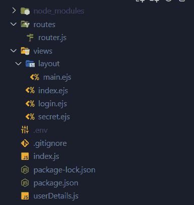
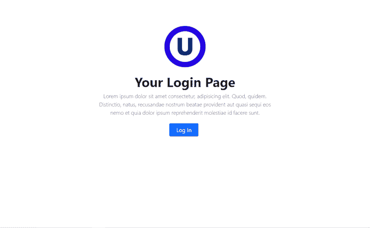
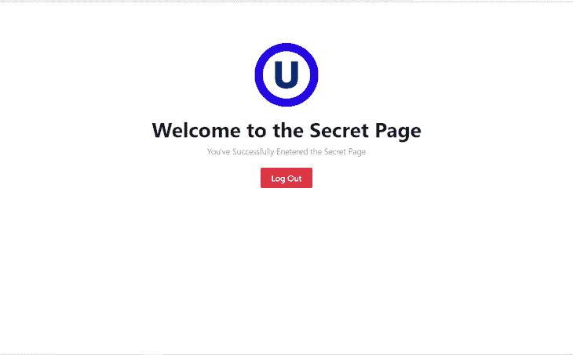
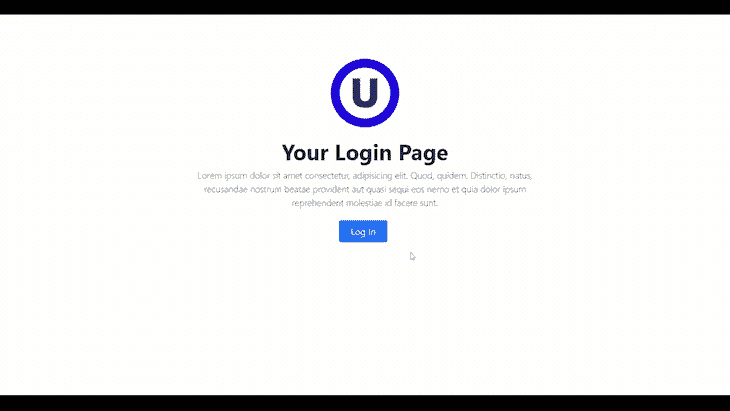

# 在 Node.js 中使用 Passport 进行身份验证

> 原文：<https://blog.logrocket.com/using-passport-authentication-node-js/>

对于开发人员来说，从头实现应用程序身份验证可能是一件非常头疼的事情。此外，如果没有正确实施，身份认证过程会导致系统出现漏洞。

在本文中，我们将使用 [Passport 库](http://www.passportjs.org/)和 [MongoDB](https://mongodb.com/) 在 Node.js 应用程序中实现身份验证。

## Passport.js 是什么？

Passport 是 Node.js 应用程序的一个流行的模块化认证中间件。有了它，身份验证可以轻松集成到任何基于节点和基于 Express 的应用程序中。Passport 库提供了 500 多种身份验证机制，包括 OAuth、JWT 和基于用户名和密码的简单身份验证。

使用 Passport 还可以轻松地将多种类型的身份验证集成到应用程序中。我们将使用本文中的`mongoose-local`策略来实现认证。

## 创建节点应用程序的文件夹结构

首先，让我们为文件创建特定的文件夹，如下所示:



这里，`routes`文件夹包含所有路线的文件。`views`文件夹包含将要显示的`ejs`文件，`layout`文件夹包含`ejs`布局代码。

除此之外，我们有一个`.env`文件来存储密钥，一个`index.js`文件作为应用程序的起点，还有一个`userDetails.js`文件用于 Mongoose 模式。

用 Passport、`passport-local-mongoose`和 MongoDB 构建一个认证系统非常简单，但是在构建应用程序之前，我们需要一个 MongoDB 集群。

可以使用自己的 MongoDB 自托管版本，也可以使用 MongoDB Atlas。在任一情况下，首先创建一个 MongoDB 数据库，并将 SRV URI 存储在`.env`文件中。

## 初始化节点并安装软件包

创建完数据库后，让我们用 npm 初始化文件夹。创建一个新文件夹并用`npm init -y`初始化。

接下来，安装依赖项。以下是它们的列表:

*   我们将为我们的 web 应用程序使用 Express 框架
*   `mongoose`:node . js 的 MongoDB 驱动程序将用于连接 MongoDB
*   我们的模板引擎
*   `express-ejs-layouts`:这将用于布局
*   `dotenv`:这个包从一个名为`.env`的文件中加载环境变量到`process.env`
*   `connect-ensure-login`:这保护了需要认证的页面
*   `passport`和`passport-local-mongoose`:用于实现认证
*   `express-session`:创建和管理会话

用以下内容安装此软件包:

`npm i express mongoose ejs express-ejs-layouts dotenv connect-ensure-login passport passport-local-mongoose express-session`

我们将使用`nodemon` dev 依赖项。使用`npm i -D nodemon`安装开发依赖项，然后用这两行代码修改`package.json`文件的`scripts`部分:

```
"scripts": {
    "start": "node index.js",
    "dev": "nodemon index.js"
  }

```

## 创建视图和布局

因为我们将使用`ejs`作为模板引擎，所以我们使用`express-ejs-layouts`包来构建我们的默认布局。

虽然安装这个插件是可选的，但在处理大型项目时，它很方便。首先，在根目录下创建一个名为`views`的文件夹，然后在`views`目录下创建一个名为`layout`的文件夹。

在`layout`目录中创建一个名为`main.ejs`的文件。我正在使用 [Bootstrap](https://getbootstrap.com/) CSS 来设计这个应用程序中的网页，所以我不需要写任何 CSS。我不打算在这里解释 HTML 文件，因为它们非常简单易懂。下面是`main.ejs`文件的代码:

```
<!DOCTYPE html>
<html lang="en">

<head>
    <meta charset="UTF-8">
    <meta http-equiv="X-UA-Compatible" content="IE=edge">
    <meta name="viewport" content="width=device-width, initial-scale=1.0">
    <link href="https://cdn.jsdelivr.net/npm/[email protected]/dist/css/bootstrap.min.css" rel="stylesheet"
        integrity="sha384-EVSTQN3/azprG1Anm3QDgpJLIm9Nao0Yz1ztcQTwFspd3yD65VohhpuuCOmLASjC" crossorigin="anonymous">
    <script src="https://cdn.jsdelivr.net/npm/[email protected]/dist/js/bootstrap.bundle.min.js"
        integrity="sha384-MrcW6ZMFYlzcLA8Nl+NtUVF0sA7MsXsP1UyJoMp4YLEuNSfAP+JcXn/tWtIaxVXM"
        crossorigin="anonymous"></script>
    <title>
        <%- title %>
    </title>
</head>

<body>
    <%- body %>
</body>

</html>

```

在标题部分，我们已经使用 CDN 导入了引导 CSS 和 JavaScript。对于每个视图，title 标记和正文中的文本都将发生变化。

因此，我们使用了`<%- title %>`和`<%- body %>`文字。我们将从我们的`routes`文件中传递`title`，而`body`将呈现 HTML 主体。

这就是添加到`main.ejs`文件所需的全部内容。让我向您展示其他三个页面的代码。

### 1.`index.ejs`

```
<div class="px-4 py-5 my-5 text-center">
    
    <h1 class="display-5 fw-bold">Your Login Page</h1>
    <div class="col-lg-6 mx-auto">
        <p class="lead mb-4">Lorem ipsum dolor sit amet consectetur, adipisicing elit. Quod, quidem. Distinctio,
            natus, recusandae nostrum beatae provident aut quasi sequi eos nemo et quia dolor ipsum reprehenderit
            molestiae id facere sunt.</p>
        <div class="d-grid gap-2 d-sm-flex justify-content-sm-center">
            <a type="button" class="btn btn-primary btn-lg px-4 gap-3 me-2" href="/login">Log In</a>
        </div>
    </div>
</div>

```

这是我们渲染时的样子:



### 2.`login.ejs`

```
<div class="px-4 py-5 my-5 text-center">
    
    <h1 class="display-5 fw-bold">Login Here</h1>
    <div class="col-lg-3 mx-auto">
        <form action="/login" method="POST">
            <div class="mb-2">
                <label for="username" class="form-label">Username</label>
                <input type="text" class="form-control" name="username" placeholder="Username" required>
            </div>
            <div class="mb-2">
                <label for="password" class="form-label">Password</label>
                <input type="password" class="form-control" name="password" placeholder="Password" required>
            </div>
            <button type="submit" class="btn btn-primary mt-2">Submit</button>
        </form>
    </div>
</div>

```

这里唯一需要注意的是，我们在表单操作中使用了`POST`方法来访问`login`路线。除此之外，它是一个简单的带有标签的 HTML 表单。登录页面将如下所示:


### 3.`secret.ejs`

```
<div class="px-4 py-5 my-5 text-center">
    
    <h1 class="display-5 fw-bold">Welcome to the Secret Page</h1>
    <div class="col-lg-6 mx-auto">
        <p class="lead mb-4">You've Successfully Entered the Secret Page</p>
    </div>
    <div class="d-grid gap-2 d-sm-flex justify-content-sm-center">
        <a href="/logout" type="button" class="btn btn-danger btn-lg px-4 gap-3">Log Out</a>
    </div>
</div>
```

秘密页面将如下所示:



该页面包含一个名为`logout`的按钮，用于注销用户。
然而，这些页面都不会呈现，因为我们还没有设置我们的服务器。让我们现在做那件事。

## 设置服务器

让我们导入`index.js`文件中的包。

```
// Requiring Modules
const express = require('express');
var expressLayouts = require('express-ejs-layouts');
const app = express();

// set up view engine and layout
app.use(expressLayouts);
app.set('layout', './layout/main');
app.set('view engine', 'ejs');

app.use(express.urlencoded({ extended: false }));

const PORT = process.env.PORT || 3000;

// Set up express server
const server = app.listen(PORT, () => {
  console.log(`Listening on port ${PORT}`);
});

```

这里，我们导入`express`和`express-ejs-layouts`包。之后，我们用`const app = express()`和`app.use(expressLayouts)`初始化`express`和`express-ejs-layouts`。

`app.set('layout', './layout/main')`正在将`main`文件设置为布局，`app.set('view engine', 'ejs')`正在将`ejs`设置为模板引擎。`app.use(express.urlencoded({ extended: false }))`作为主体解析器工作。最后，我们在端口`3000`上创建我们的服务器。

现在，让我们创建一个名为`routes`的新文件夹，并在该文件夹中创建一个名为`router.js`的新文件。

* * *

### 更多来自 LogRocket 的精彩文章:

* * *

```
const express = require('express');
const router = express.Router();
const connectEnsureLogin = require('connect-ensure-login');
const passport = require('passport');

// GET Routes
router.get('/', (req, res) => {
  res.render('index', { title: 'Home' });
});

router.get('/login', (req, res) => {
  res.render('login', { title: 'Login' });
});

router.get('/secret', connectEnsureLogin.ensureLoggedIn(), (req, res) =>
  res.render('secret', { title: 'Secret Page' })
);

router.get('/logout', (req, res) => {
  req.logout();
  res.redirect('/');
});

// POST Routes
router.post(
  '/login',
  passport.authenticate('local', {
    failureRedirect: '/login',
    successRedirect: '/secret',
  }),
  (req, res) => {
    console.log(req.user);
  }
);

module.exports = router;

```

从上面的代码可以看出，我们有三条`GET`路由和一条`POST`路由。首先，我们添加了必要的包。

`secret`路线中的`connectEnsureLogin.ensureLoggedIn()`中间件保证了禁止用户在没有登录的情况下进入页面。

在`POST`路由中，`passport.authenticate`中间件使用`local`策略对用户进行认证，如果用户成功登录，它将重定向到`secret`路由。否则，它会重定向到`login`路线。

我们还通过`title`变量传递页面的标题。`req.logout()`是注销用户的 passport 方法。最后，我们正在导出路由器。

## 使用 MongoDB 设置用户模式

在根目录下创建一个名为`userDetails.js`的新文件。

```
const mongoose = require('mongoose');
const passportLocalMongoose = require('passport-local-mongoose');
require('dotenv').config();

// Connecting Mongoose
mongoose.connect(process.env.MONGODB_URI, {
  useNewUrlParser: true,
  useUnifiedTopology: true,
});

// Setting up the schema
const User = new mongoose.Schema({
  username: String,
  password: String,
});

// Setting up the passport plugin
User.plugin(passportLocalMongoose);

module.exports = mongoose.model('User', User);

```

我们要求`mongoose`与 MongoDB 连接，而`passport-local-mongoose`使得用户名和密码认证与 MongoDB 的集成变得极其容易。

我们设置了`dotenv`包来使用下一行中的环境变量。

然后，我们使用 mongoose 连接到数据库。`User`变量保存着 mongoose 模式。`User.plugin(passportLocalMongoose)`方法在数据库中为每个用户生成并存储散列、salt 和用户名。最后，我们导出模式。

我们差不多完成了。我们只需要建立我们的`index.js`文件。

## 在节点应用程序中初始化 Passport

让我们导入`Passport`和`express-session`模块、`router.js`和`userDetails.js`文件。然后，使用`express-session`包建立会话:

```
const passport = require('passport');
const session = require('express-session');
const UserDetails = require('./userDetails');
const routes = require('./routes/router');
require('dotenv').config();

// Set up session
app.use(
  session({
    secret: process.env.SECRET,
    resave: false,
    saveUninitialized: true,
  })
);

```

`secret`存储在`.env`文件中，它对会话 ID cookie 进行签名。如果`resave`标志被设置为`true`，会话数据将被强制存储。我们不希望这样，因为当设置为`true`时，`saveUninitialized`将强制保存未初始化的会话。你可以在这里阅读关于包[的详细内容。](https://github.com/expressjs/session#readme)

现在，通过添加以下行来设置 Passport:

```
// Set up Passport
app.use(passport.initialize());
app.use(passport.session());

```

我们首先初始化 Passport 和会话认证中间件。完成后，我们必须设置本地身份验证。

```
passport.use(UserDetails.createStrategy());
passport.serializeUser(UserDetails.serializeUser());
passport.deserializeUser(UserDetails.deserializeUser());

```

上面的代码向我们的节点应用程序添加了本地身份验证。首先，我们通过调用`createStrategy`方法在`UserDetails`模型上设置本地策略。

然后，`serializeUser`方法在认证时序列化传递的用户实例，并且在每个后续请求中调用`deserializeUser`实例来反序列化用户。

现在将这段代码添加到您的`index`文件中，并且只运行`index.js`一次:

```
UserDetails.register({username:'nemo', active: false}, '123');

```

上面的行将注册一个用户名为`nemo`密码为`123`的用户。如果您现在检查您的 MongoDB 数据库，您将看到用户。

最终的`index.js`文件将如下所示:

```
// Requiring Modules
const express = require('express');
var expressLayouts = require('express-ejs-layouts');
const app = express();
const passport = require('passport');
const session = require('express-session');
const UserDetails = require('./userDetails');
const routes = require('./routes/router');
require('dotenv').config();

// Set up view engine and layout
app.use(expressLayouts);
app.set('layout', './layout/main');
app.set('view engine', 'ejs');

// Set up session
app.use(
  session({
    secret: process.env.SECRET,
    resave: false,
    saveUninitialized: true,
  })
);

app.use(express.urlencoded({ extended: false }));

// Set up Passport
app.use(passport.initialize());
app.use(passport.session());

passport.use(UserDetails.createStrategy());
passport.serializeUser(UserDetails.serializeUser());
passport.deserializeUser(UserDetails.deserializeUser());

app.use(routes);

// Set up Express server
const server = app.listen(3000, () => {
  console.log(`Listening on port ${server.address().port}`);
});

UserDetails.register({ username: 'nemo', active: false }, '123');

```

这就完成了认证。查看下面的 GIF 图片，看看它是如何工作的。



## 结论

身份验证是许多 web 应用程序的重要组成部分。本文介绍了如何使用 Passport 库和 MongoDB 将身份验证集成到 Node.js 应用程序中。

您还可以查看 [Passport Docs](http://www.passportjs.org/docs/) ，了解更多要在您的应用程序中实现的身份验证策略。希望你喜欢这本书。[的完整代码可以在这个 GitHub repo](https://github.com/nemo0/passport-mongo-auth) 中找到。

## 200 只显示器出现故障，生产中网络请求缓慢

部署基于节点的 web 应用程序或网站是容易的部分。确保您的节点实例继续为您的应用程序提供资源是事情变得更加困难的地方。如果您对确保对后端或第三方服务的请求成功感兴趣，

[try LogRocket](https://lp.logrocket.com/blg/node-signup)

.

[](https://lp.logrocket.com/blg/node-signup)[https://logrocket.com/signup/](https://lp.logrocket.com/blg/node-signup)

LogRocket 就像是网络和移动应用程序的 DVR，记录下用户与你的应用程序交互时发生的一切。您可以汇总并报告有问题的网络请求，以快速了解根本原因，而不是猜测问题发生的原因。

LogRocket 检测您的应用程序以记录基线性能计时，如页面加载时间、到达第一个字节的时间、慢速网络请求，还记录 Redux、NgRx 和 Vuex 操作/状态。

[Start monitoring for free](https://lp.logrocket.com/blg/node-signup)

.