# 使用 Payload CMS 构建博客

> 原文：<https://blog.logrocket.com/using-payload-cms-build-blog/>

无头 CMSs 是现代 web 开发的重要组成部分。与传统的 CMS 相比，它们提供了更多的功能和灵活性。

无头 CMS 的工作原理是“切割”普通 CMS 的头部——换句话说，前端，负责网站或应用程序的外观和感觉。最终结果是一个只管理内容和数据的系统，并允许我们使用最符合我们需求的前端。

在本教程中，我们将探索一个名为 Payload 的[强大而灵活的无头 CMS。我们将涵盖:](https://payloadcms.com/)

## 什么是有效载荷 CMS？

Payload 是一个主要基于配置的无头 CMS 和应用程序框架，这使得它非常容易使用和定制。

Payload CMS 提供的基于功能的访问控制可以处理您需要的任何访问控制模式。Payload 还提供了文档级和字段级挂钩，允许轻松集成和最大的灵活性。以下是其他一些主要的有效载荷能力:

*   100%打字稿
*   为每个数据模型自动生成[类型脚本接口](https://blog.logrocket.com/understanding-using-interfaces-typescript/)
*   干净和最小的[反应管理面板](https://blog.logrocket.com/create-react-admin-panel/)
*   选择使用自己的组件
*   自动为您的应用程序生成 API
*   内置本地化
*   内置认证
*   文件上传支持
*   功能强大的字段集，可处理任何类型的数据建模
*   默认情况下附带一个 Mongo 数据库
*   基于块的布局构建适合于创建任何类型的块编辑器

Payload 通过实现配置、集合、全局、字段、挂钩和访问控制的概念，实现了上面列出的所有优秀特性。在了解如何开始使用有效负载 CMS 之前，让我们先定义这些概念。

有效负载使用配置文件，配置文件负责 CMS 可以做的几乎所有事情。例子包括定义数据模型、定制验证、挂钩逻辑、认证等等。

有效负载将内容分组到集合中。每个集合根据定义的字段自动创建一个 MongoDB 集合。

全局与集合非常相似，主要区别在于集合被设计成包含许多文档，而全局更像是一个单一的、可重用的模板。当您想要定义页眉、页脚、导航和菜单、应用程序范围的本地化字符串以及您可能需要的任何其他“全局”数据时，全局变量就很方便了。

有效负载使用字段作为其构建块。集合和全局变量中都使用字段来定义它们存储的数据类型。有效载荷提供了从简单到复杂的广泛领域。

此外，Payload 为添加定制逻辑和与第三方工具和服务集成提供了许多挂钩。

最后，Payload 附带了细粒度的访问控制，它强大、灵活，同时易于实现。

## 有效负载 CMS 入门

在我们开始使用 Payload 之前，您需要确保已经在您的机器上安装了【Mongo 和节点。

开始使用 Payload 就像在您选择的目录中运行以下命令一样简单:

```
npx create-payload-app

```

这将指导您创建一个新的有效负载应用程序。以下是您需要的信息:

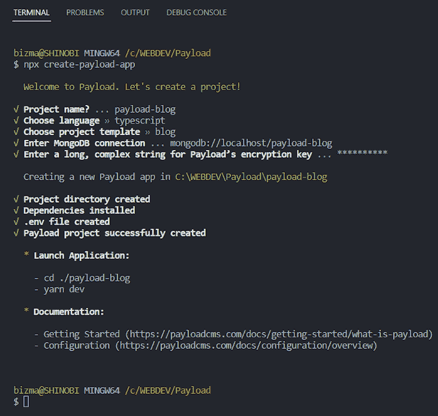

请注意，如果您第一次运行上述命令，它可能会要求您安装`create-payload-app`，然后才允许您继续。

出于本教程的目的，请确保您已经选择了`blog`作为项目模板，选择了`typescript`作为语言。

请注意，安装本身可能需要一些时间。

安装完成后，导航到应用程序目录。当您运行`yarn dev`命令时，您应该会看到类似如下的内容:

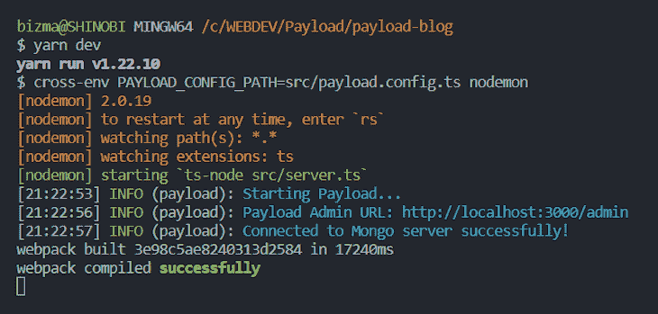

现在转到[http://localhost:3000/admin](http://localhost:3000/admin)来创建第一个用户。当您创建完第一个用户帐户(应该是您自己的个人资料)后，登录到管理面板。您应该看到以下内容:

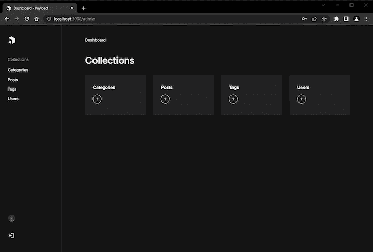

如您所见，有四个为您自动创建的集合。这些为一些简单的博客功能提供了一个良好的起点。

如果您点击左下角的圆形头像按钮切换到您的用户帐户，您将看到以下页面:

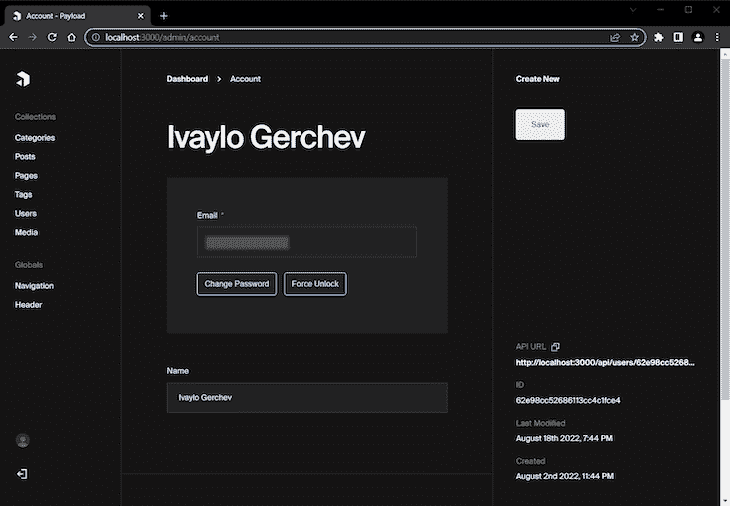

您的用户帐户页面只是一个简单的页面，上面有您在创建第一个新用户时输入的姓名和电子邮件。现在，让我们切换到您的代码编辑器，探索项目结构，看起来应该是这样的:

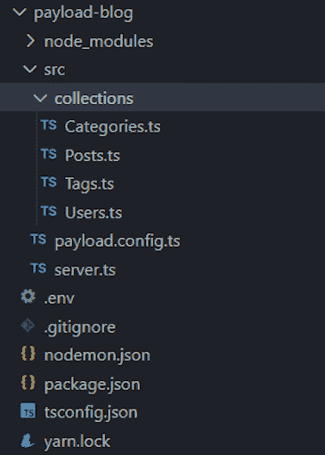

如您所见，有一个包含四个文件的`collections`目录。这四个文件对应于 admin 中的四个集合。这些是[有效负载 CMS 配置文件](https://payloadcms.com/docs/configuration/overview)，我们现在将它们导入到主`payload.config.ts`文件中，如下所示:

```
import { buildConfig } from 'payload/config';
import path from 'path';
import Categories from './collections/Categories';
import Posts from './collections/Posts';
import Tags from './collections/Tags';
import Users from './collections/Users';

export default buildConfig({
  serverURL: 'http://localhost:3000',
  admin: {
    user: Users.slug,
  },
  collections: [
    Categories,
    Posts,
    Tags,
    Users,
  ],
  typescript: {
    outputFile: path.resolve(__dirname, 'payload-types.ts')
  },
  graphQL: {
    schemaOutputFile: path.resolve(__dirname, 'generated-schema.graphql'),
  },
});

```

从技术上来说，我们可以将集合的所有代码直接包含在`payload.config.ts`文件中。然而，为了使事情更容易管理，我们把它们分割成单独的文件。然后，我们只需导入它们并将它们包含在一个特殊的`collections`数组中。

现在让我们探索一下`server.ts`文件的内容:

```
import express from 'express';
import payload from 'payload';
require('dotenv').config();

const app = express();
// Redirect root to Admin panel
app.get('/', (_, res) => {
  res.redirect('/admin');
});
// Initialize Payload
payload.init({
  secret: process.env.PAYLOAD_SECRET,
  mongoURL: process.env.MONGODB_URI,
  express: app,
  onInit: () => {
    payload.logger.info(`Payload Admin URL: ${payload.getAdminURL()}`)
  },
})
// Add your own express routes here
app.listen(3000);

```

有效载荷[需要一个快速服务器](https://blog.logrocket.com/express-js-5-migration-guide/)，它是自动为你创建的。为了初始化有效负载，调用了`init()`方法。

需要`init()`方法的前三个选项。第一个和第二个选项分别是密钥和 Mongo 数据库。在安装过程中，您应该已经在`.env`文件中输入了这些信息。第三个选项将应用程序与 Express 服务器连接起来。

`init()`方法的最后一个选项是一个名为`onInit`的函数，意思是“初始化时”，它将一个有效负载实例作为它的参数。

您可以在有效负载 CMS 文档的[服务器部分看到其余可用的命令。](https://payloadcms.com/docs/getting-started/installation#server)

## 使用有效负载 CMS 构建博客功能

有趣的部分来了。在这一节中，我们将探索如何用新的特性和功能来扩展我们的博客。

大多数现代博客需要某种媒体管理来在帖子中包含图片。所以，让我们先给我们的博客添加一些简单的媒体支持。

要添加媒体支持，请在`collections`目录中创建包含以下内容的新`Media.ts`文件:

```
import { CollectionConfig } from 'payload/types';

const Media: CollectionConfig = {
  slug: 'media',
  admin: {
    useAsTitle: 'title',
  },
  access: {
    read: () => true,
  },
  fields: [
    {
      name: "alt",
      type: "text",
    },
  ],
  upload: {
    staticURL: "/media",
    staticDir: "media",
    mimeTypes: ["image/*"],
  },
}
export default Media;

```

这里，我们首先导入了`CollectionConfig`类型，并使用它来创建媒体配置。

[每个集合都需要](https://payloadcms.com/docs/configuration/collections) `slug`和`fields`属性。`slug`属性用来引用这个集合。`fields`属性用于构建 UI 块，帮助我们管理应用的内容。

在本例中，我们给我们的集合添加了一段`media`并添加了一个简单的文本字段，用于输入上传图像的 alt 文本。

为了添加特定于管理员的配置，我们使用了`admin`属性。在我们的例子中，`useAsTitle`定义了哪个字段将被用作集合的主键。

`access`属性提供访问控制功能，用于定义特定用户的确切权限。在我们的例子中，我们授权所有用户阅读媒体集合。

最后，为了确保我们的应用程序中的媒体支持功能，我们使用了`upload`属性。每个支持 `[upload](https://payloadcms.com/docs/upload/overview)` [功能](https://payloadcms.com/docs/upload/overview)的[有效负载集合都需要`staticURL`和`staticDir`属性，它们定义了应用程序媒体的基本路径和用于媒体存储的文件夹目录。这里我们也使用`mimeTypes`属性来定义用户只能上传图片。](https://payloadcms.com/docs/upload/overview)

现在我们已经完成了向我们的博客添加媒体支持。我们将在下一节中看到如何在其他集合中使用它。

在`Media`页面中，我们现在可以通过点击`Create New`按钮来添加新图像。然后，我们可以选择一个文件或将其拖放到指定区域。我们还可以在媒体文件中添加替代文本。请看下面这些功能的样子:

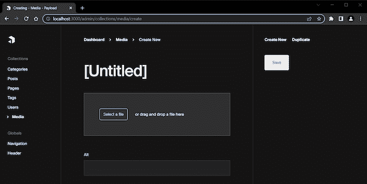

当我们上传了一些媒体时，这个集合看起来是这样的:

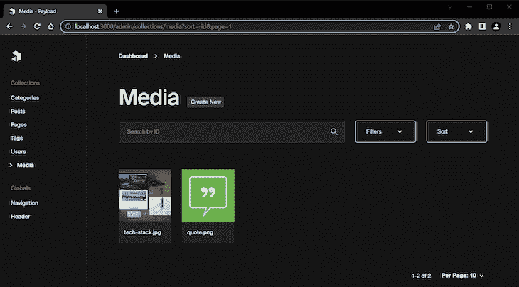

### 创建 post 块

有效负载提供的最强大的字段之一是 Blocks 字段。您可以使用该字段来创建甚至组合单个可重用块。

在下一节中，我们将通过为博客文章创建一个简单的块编辑器来扩展`Posts`集合，首先创建三个必要的块:内容、引用和提醒。

首先，创建一个新的`blocks`目录，并添加一个包含以下内容的`Content.ts`文件:

```
import { Block } from 'payload/types';

const Content: Block = {
  slug: 'content',
  fields: [
  {
    name: 'content',
    type: 'richText'
  },
  ]
};
export default Content;

```

这创建了一个只有一个字段的基本内容块，它提供了一个[富文本编辑器](https://payloadcms.com/docs/fields/rich-text)。我们在这里使用`Block`类型来定义`Content`块的配置。

对于下一个块，创建一个包含以下内容的`Quote.ts`文件:

```
import { Block } from 'payload/types';

const Quote: Block = {
  slug: 'quote',
  imageURL: 'http://localhost:3000/media/quote.png',
  imageAltText: 'Quote block',
  fields: [
    {
      name: 'quote',
      type: 'textarea',
    },
    {
      name: 'author',
      type: 'text',
    },
  ]
};
export default Quote;

```

这里，我们创建了一个包含两个字段的报价块:一个 Textarea 字段用于报价本身，另一个文本字段用于报价作者。

同时，`imageURL`和`imageAltText`属性定义了当我们从弹出面板中选择块时要显示的缩略图。稍后我们将看到这一点。

对于最后一个块，创建一个包含以下内容的`Alert.ts`文件:

```
import { Block } from 'payload/types';

const Alert: Block = {
  slug: 'alert',
  fields: [
    {
      name: 'type',
      type: 'select',
      options: [
        {
          value: 'info',
          label: 'Info',
        },
        {
          value: 'success',
          label: 'Success',
        },
        {
          value: 'warning',
          label: 'Warning',
        },
        {
          value: 'danger',
          label: 'Danger',
        },
      ],
    },
    {
      name: 'message',
      type: 'textarea',
    },
  ]
};
export default Alert;

```

这里，[使用了一个选择字段](https://payloadcms.com/docs/fields/select)来定义不同的警报类型，并使用了一个文本区域字段来输入警报消息。

好了，积木准备好了。现在让我们看看如何使用它们。

### 添加帖子功能

现在我们准备扩展创建博客文章的功能。

打开`Posts.ts`文件，将其内容替换为以下内容:

```
import { CollectionConfig } from 'payload/types';
import Quote from '../blocks/Quote';
import Content from '../blocks/Content';
import Alert from '../blocks/Alert';

const Posts: CollectionConfig = {
  slug: 'posts',
  admin: {
    defaultColumns: ['title', 'author', 'category', 'tags', 'status'],
    useAsTitle: 'title',
  },
  access: {
    read: () => true,
  },
  fields: [
    {
      name: 'postMeta',
      type: 'group',
      fields: [
        {
          name: 'title',
          type: 'text',
          required: true,
          minLength: 20,
          maxLength: 100,
        },
        {
          name: 'description',
          type: 'textarea',
          required: true,
          minLength: 40,
          maxLength: 160,
        },
        {
          name: 'keywords',
          label: 'Keywords',
          type: 'text',
        },
      ],
    },
    {
      name: 'title',
      type: 'text',
      required: true,
    },
    {
      type: 'tabs',
      tabs: [
        {
          label: 'Post Media',
          fields: [
            {
              name: 'postImage',
              type: 'upload',
              relationTo: 'media',
              required: true,
            },
          ],
        },
        {
          label: 'Post Layout',
          fields: [
            {
              name: 'layout',
              type: 'blocks',
              blocks: [
                Quote,
                Content,
                Alert
              ],
            },
          ]
        }
      ]
    },
// add sidebar fields here
  ],
}
export default Posts;

```

这里，我们首先导入前面创建的块。

接下来，我们使用`defaultColumns`属性来定义在呈现集合时哪些列将在管理面板中可见。

然后[使用分组字段](https://payloadcms.com/docs/fields/group)为帖子的元数据创建一组特性，并使用`required`、`minLength`和`maxLength`属性添加一些简单的验证。我们还定义了一个用于编辑文章标题的字段。

最后，我们[创建了两个标签](https://payloadcms.com/docs/fields/tabs) — `Post Media`和`Post Layout`。

`Post Media`选项卡[使用上传字段](https://payloadcms.com/docs/fields/upload)，通过使用`relationTo`属性将它与之前创建的媒体收藏连接起来。

`Post Layout`选项卡[使用 Blocks 字段](https://payloadcms.com/docs/fields/blocks)并注册我们创建的块，将它们添加到`blocks`数组中。

以上所有配置都设置了文章编辑页面主区域中显示的编辑字段。要在侧边栏区域添加一些字段，请添加以下代码:

```
{
  name: 'status',
  type: 'select',
  options: [
    {
      value: 'draft',
      label: 'Draft',
    },
    {
      value: 'published',
      label: 'Published',
    },
  ],
  defaultValue: 'draft',
  admin: {
    position: 'sidebar',
  }
},
{
  name: 'publishedDate',
  type: 'date',
  admin: {
    position: 'sidebar',
  }
},
{
  name: 'author',
  type: 'relationship',
  relationTo: 'users',
  admin: {
    position: 'sidebar',
  }
},
{
  name: 'category',
  type: 'relationship',
  relationTo: 'categories',
  admin: {
    position: 'sidebar',
  }
},
{
  name: 'tags',
  type: 'relationship',
  relationTo: 'tags',
  hasMany: true,
  admin: {
    position: 'sidebar',
  }
},

```

为了移动侧边栏区域中的字段，我们使用了`admin`属性，并将其子属性`position`设置为`sidebar`。

我们在这里添加了几个不同的字段:

选择字段允许我们定义帖子的状态—草稿或已发布。我们使用了`defaultValue`属性来设置新帖子的默认状态。

[日期字段](https://payloadcms.com/docs/fields/date)允许我们设置文章的发表日期。

我们还添加了三个[关系字段](https://payloadcms.com/docs/fields/relationship)来定义文章的作者、类别和标签。

仅此而已。现在让我们探索一下到目前为止我们已经构建了什么。查看您的`Posts`收藏:

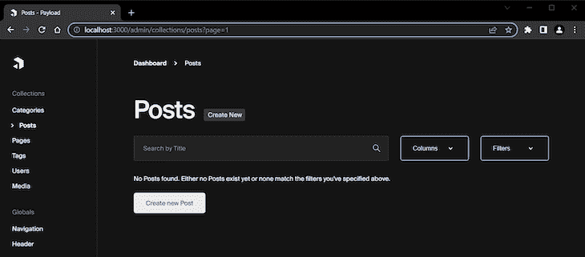

点击`Create new Post`按钮后，您会看到以下内容:

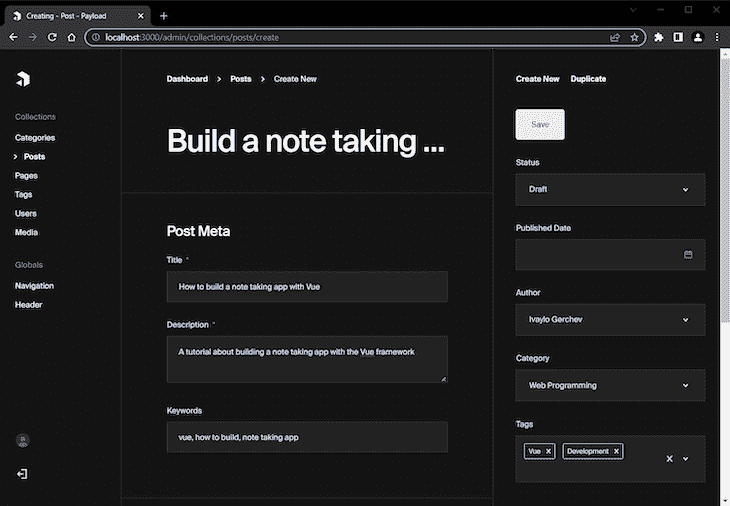

这个截屏显示了页面的 Post Meta 部分和侧边栏字段。我已经填写了其中的一些来演示如何使用它们。

注意，Author 字段在这里显示了用户名—在本例中是`Ivaylo Gerchev`。但是，默认情况下，该字段使用用户的电子邮件。要改变这一点，打开`Users.ts`文件并将`useAsTitle`属性更改为`name`，如下所示:

```
admin: {
  useAsTitle: 'name', // changed to name from email
},

```

现在，当您转到`Users`集合时，主键将是用户名，它将用于`Author`字段:

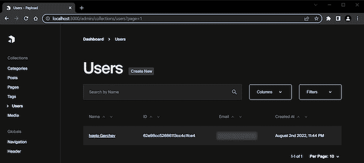

现在，让我们回到创建我们的新职位。当我们向下滚动时，我们可以找到文章标题的字段以及我们之前创建的`Post Media`和`Post Layout`选项卡:

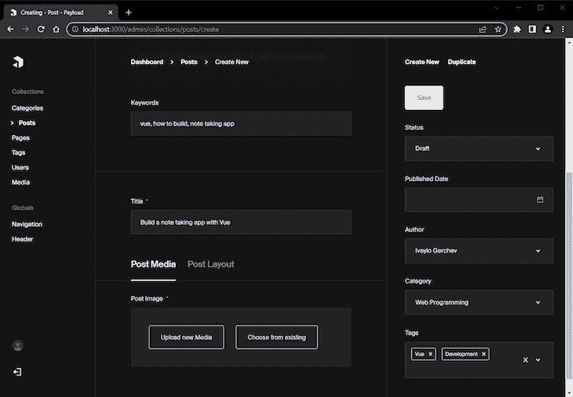

当我们通过`Post Media`选项卡上传帖子的图片时，图片会显示如下:

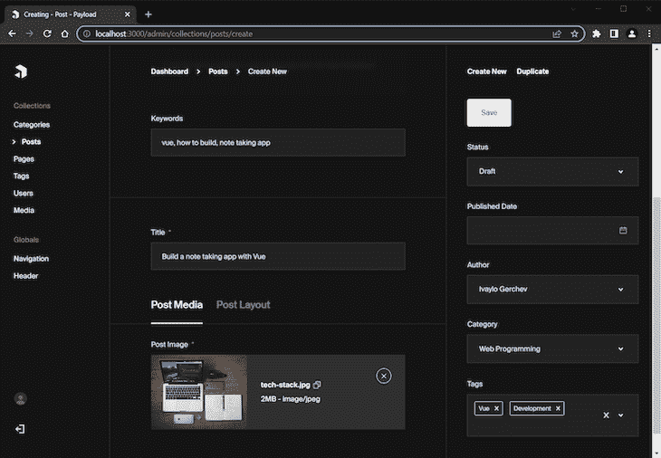

当我们切换到`Post Layout`选项卡时，我们会看到一个圆圈中的加号，旁边是一些文本`Add Block`:

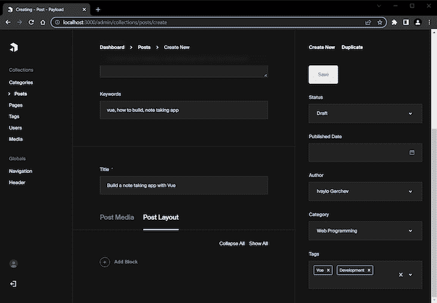

点击`Add Block`按钮将显示一个弹出面板，其中包含我们之前添加的所有可用模块:

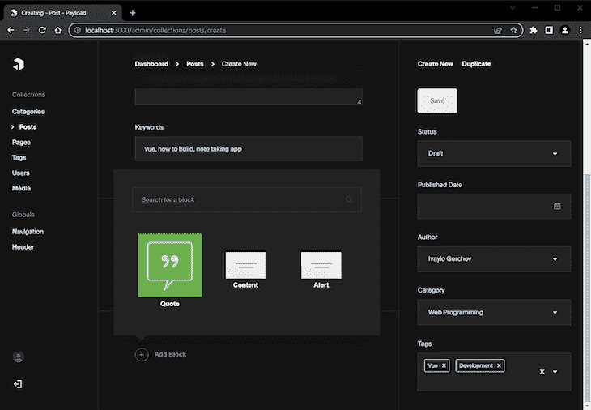

您可以看到，这里显示了我们为报价块定义的图像。没有定义图像的块使用默认图像。此外，如果您有许多块，您可以选择搜索特定的块。

让我们来看看这些积木是如何工作的。在下一个屏幕截图中，我添加了一个报价组件:

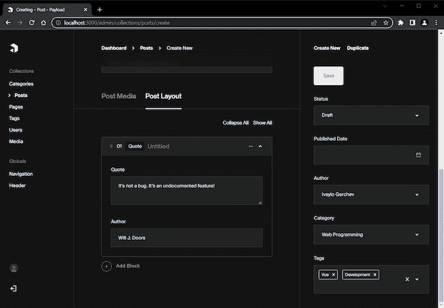

在下一个截图中，我在报价后添加了一个内容块:

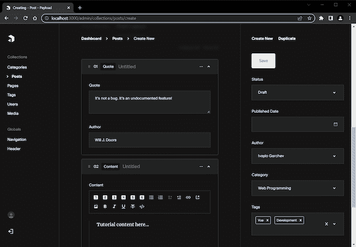

正如您所看到的，Payload 允许您构建一个定制的块编辑器，这为一些配置的内容结构化提供了很大的灵活性。

现在，当您保存文章并转到文章集合时，您可以看到您刚刚创建的文章:

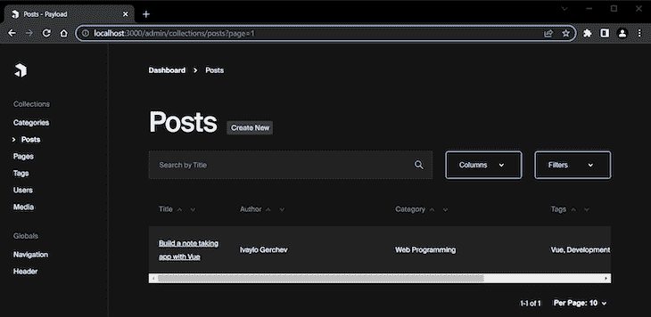

### 添加对创建新页面的支持

通常，除了博客文章之外，一个博客至少还会有几个其他页面，比如联系页面、关于页面等等。现在让我们为我们的博客添加页面创建功能。

在`collections`目录下，创建一个包含以下内容的`Pages.ts`文件:

```
import { CollectionConfig } from 'payload/types'

const Pages: CollectionConfig = {
  slug: 'pages',
  admin: {
    defaultColumns: ['title', 'status'],
    useAsTitle: 'title',
  },
  access: {
    read: () => true,
  },
  fields: [
    {
      name: 'pageMeta',
      type: 'group',
      fields: [
        {
          name: 'title',
          type: 'text',
          required: true,
          minLength: 20,
          maxLength: 100,
        },
        {
          name: 'description',
          type: 'textarea',
          required: true,
          minLength: 40,
          maxLength: 160,
        },
        {
          name: 'keywords',
          label: 'Keywords',
          type: 'text',
        },
      ],
    },
    {
      name: 'title',
      type: 'text',
      required: true,
    },
    {
      name: 'content',
      type: 'richText',
      required: true,
    },
    {
      name: 'status',
      type: 'select',
      options: [
        {
          value: 'draft',
          label: 'Draft',
        },
        {
          value: 'published',
          label: 'Published',
        },
      ],
      defaultValue: 'draft',
      admin: {
        position: 'sidebar',
      }
    }
  ],
}
export default Pages;

```

以上其实是`posts`配置的简化版；我们定义了一个页面元部分，然后是标题和内容字段。在管理侧边栏中，我们只放置了一个状态字段。

让我们看看我们对添加新页面的支持。以下是页面元编辑部分:

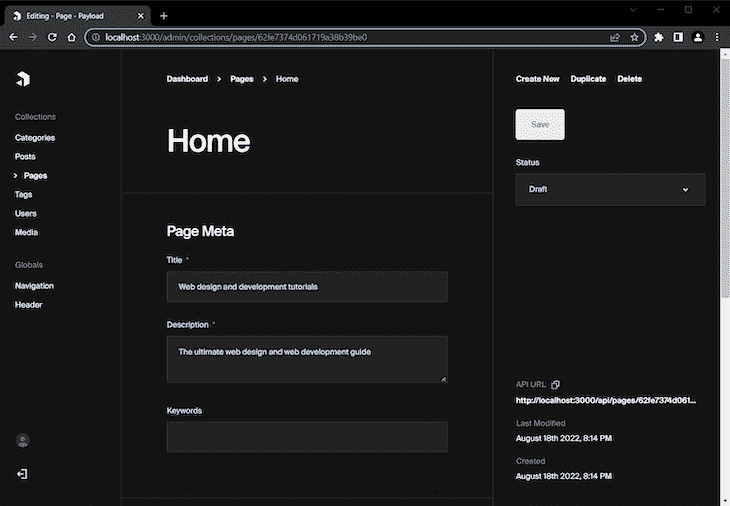

以下是标题和内容编辑部分:

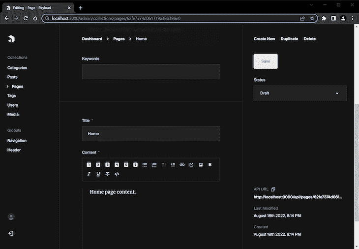

以下是我使用该功能创建的示例页面:


在下面的截图中，您可以看到我们在配置中定义为`default`的列被自动选择并显示在管理中。点击`Columns`按钮，您可以看到:

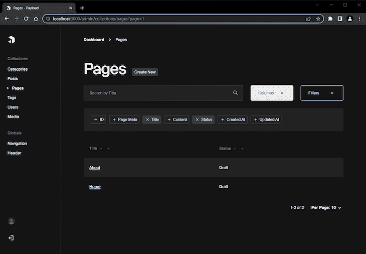

### 添加导航全局

到目前为止，我们已经探索了用于创建集合的有效负载 CMS 特性。但是正如我在开始提到的，Payload 为更具体的目标提供了另一个很好的特性:[创建全局变量的能力](https://payloadcms.com/docs/configuration/globals)。

在这一节中，我们将探索如何创建一个最常见的全局用例:创建一个站点导航菜单。在下一节中，我们将学习如何为我们的博客创建一个标题部分，这是另一个常见的用例。

首先，创建新的`globals`目录，其中包含一个包含以下内容的`Navigation.ts`文件:

```
import { GlobalConfig } from 'payload/types';

const Navigation: GlobalConfig = {
  slug: 'navigation',
  fields: [
    {
      name: 'menuItems',
      type: 'array',
      required: true,
      maxRows: 8,
      fields: [
        {
          name: 'page',
          type: 'relationship',
          relationTo: 'pages',
          required: true,
          unique: true,
        }
      ]
    },
  ]
}
export default Navigation;

```

定义一个全局实体与定义一个集合非常相似。在上面的代码中，我们使用了`GlobalConfig`类型，而不是之前使用的`CollectionConfig`类型。

我们还[使用了一个数组字段](https://payloadcms.com/docs/fields/array)来添加创建菜单项列表的功能。对于这些菜单项，我们使用关系字段从现有页面中获取和选择。

下面是它的实际运行情况:

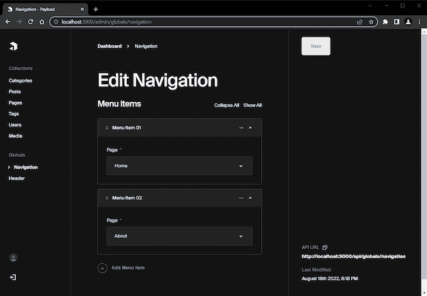

通过点击`Add Menu Item`按钮，您可以选择一个现有页面添加到导航菜单中。在这里，我选择了`Home`和`About`。

当我们使用数组编辑字段时，我们有一些选项来管理数组。当我们单击字段右侧的省略号图标按钮时，这些选项可用，如下所示:

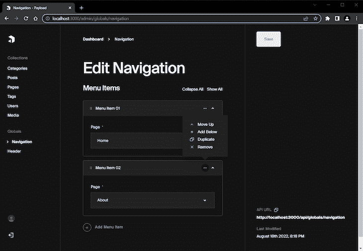

对于第二个全局，创建一个包含以下内容的`Header.ts`文件:

```
import { GlobalConfig } from 'payload/types';

const Header: GlobalConfig = {
  slug: 'header',
  fields: [
    {
      name: 'styles',
      type: 'array',
      fields: [
        {
          name: 'cssLink',
          type: 'text',
        }
      ]
    },
    {
      name: 'scripts',
      type: 'array',
      fields: [
        {
          name: 'jsLink',
          type: 'text',
        }
      ]
    },
  ]
}
export default Header;

```

在上面的代码中，我们使用两个数组分别为 CSS 和 JavaScript 链接创建了两个列表。

为此，您需要在`payload.configts`文件中添加一个`globals`数组。将下面的代码放在`collections`数组下面:

```
globals: [
  Navigation,
  Header
],

```

下面是它的实际效果:


如您所见，现在您可以添加样式或脚本的链接，这将是全球可用的，类似于 CodePen。

最后，在我们所有的编辑完成后，管理面板应该看起来像这样:

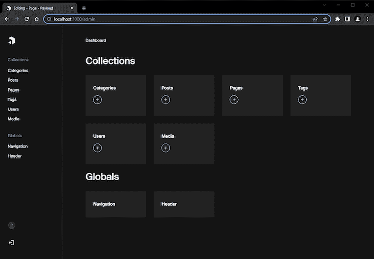

恭喜你。您刚刚使用 Payload CMS 创建了一个简单但功能强大的博客内容管理系统。

### 探索 API 功能

我想提到的最后一点是，Payload 自动为每个集合项提供了一个 API 端点。例如，当您编辑一个特定的页面时，您可以单击右下角的 API URL 链接来获取该页面的 JSON 数据。请参见下面的示例:

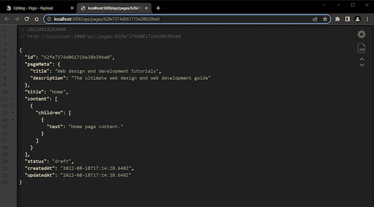

在上图中，您可以看到我们之前创建的主页的数据。

## 结论

在这篇介绍 Payload CMS 的教程中，我们通过构建一个简单的博客管理系统，探索了 Payload 的许多优秀特性。尽管看起来很简单，但 Payload 非常强大和灵活。

对于更复杂的有效载荷示例，请在 Github 中探索[公共演示](https://demo.payloadcms.com/?_gl=1*hwt42k*_ga*MTU4NTg1ODI5LjE2NTkwODgxODU.*_ga_FLQ5THRMZQ*MTY2MDg1MDc2MC4yMy4xLjE2NjA4NTA5ODMuMC4wLjA.)及其[代码。你也可以看看一个](https://github.com/payloadcms/public-demo)[和 Next.js](https://github.com/payloadcms/nextjs-custom-server) 一起使用的有效载荷的例子。

最后，查看来自有效载荷 CMS 的[官方文档，以获取更深入的信息和指导。](https://payloadcms.com/docs/getting-started/what-is-payload)