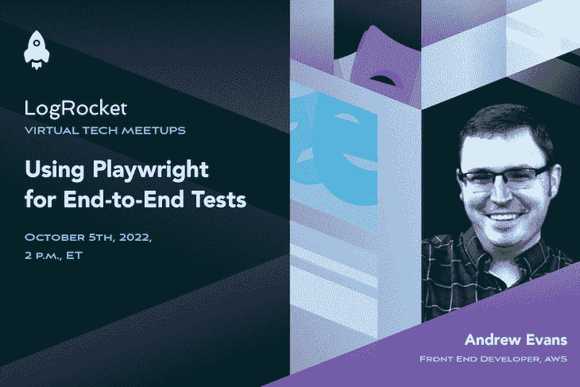

# 使用剧作家进行端到端测试

> 原文：<https://blog.logrocket.com/using-playwright-for-end-to-end-tests/>

加入我们吧

**October 5th at 2 p.m. EDT**

并了解如何使用剧作家为您的前端项目进行端到端测试。

在这次聚会中，您将了解到:

*   剧作家如何工作
*   为您的项目进行端到端测试
*   如何使用报告功能

#### 您的主持人:

Andrew Evans
Andrew Evans 是 AWS 的前端开发人员，拥有超过 10 年的行业经验。他的兴趣领域包括前端框架，如 Angular 和 DevOps，他曾与 AWS、Google、Azure 和其他几个平台和系统合作过。

#### 注册 meetup:

10 月 5 日|美国东部时间下午 2 点

之后要发送的录音

### 谢谢大家！

我们已经收到你的活动注册。