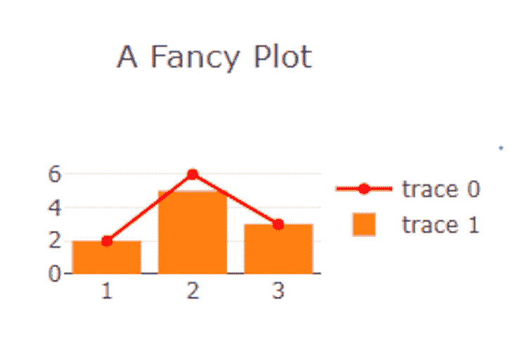
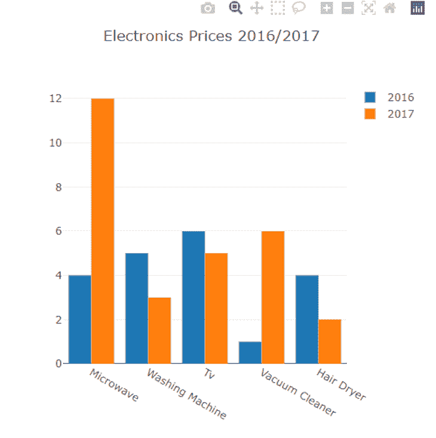
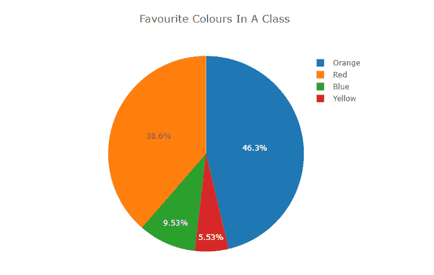
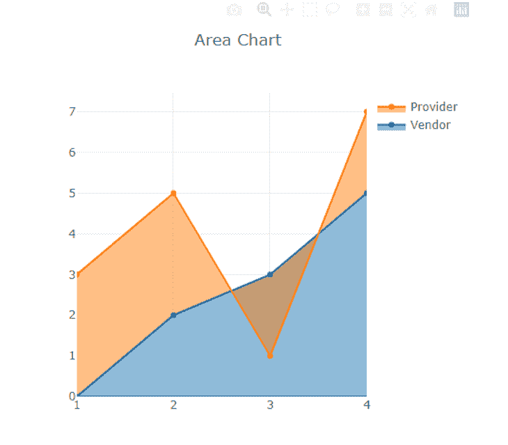
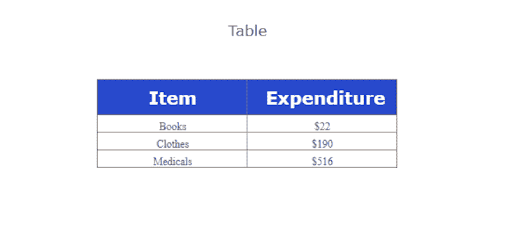
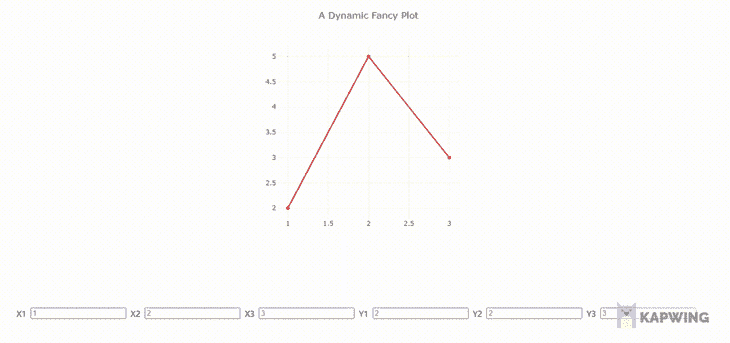
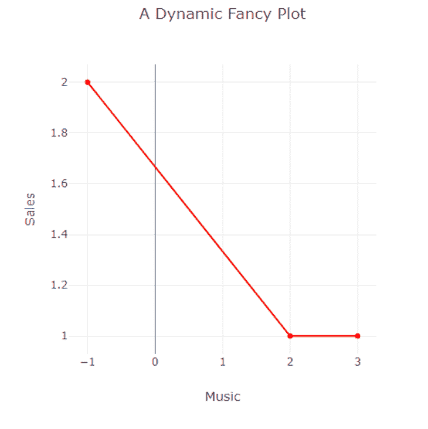
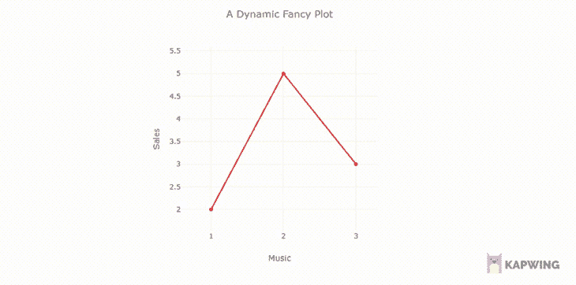
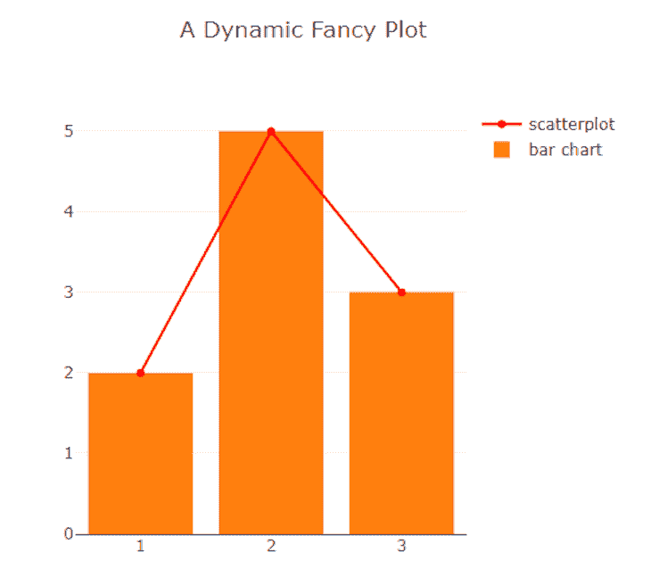

# 在 React 中使用 Plotly 构建动态图表

> 原文：<https://blog.logrocket.com/using-plotly-react-build-dynamic-charts-graphs/>

您是否曾经想要在 React 应用程序中构建和显示图形，或者您是否发现使用当前的库很难做到这一点？如果是的话，这篇文章正是你所需要的:我们将探索如何在 React 应用程序中利用它。

Plotly 是一个免费的开源数据可视化框架，提供了各种绘图类型，如折线图、散点图、直方图、cox 图等。

通过使我们能够不断地定制我们的图表，我们可以使我们的图更相关，更容易被他人理解。Plotly 目前只在 Python、R、Julia、Matlab、F#和 Javascript 应用程序中可用。

## 先决条件

要学习本教程，您需要以下内容:

要安装 Plotly 和 Chakra，请在您的终端中运行以下命令:

```
npm install react-plotly.js plotly.js 
npm i @chakra-ui/react @emotion/[email protected]^11 @emotion/[email protected]^11 [email protected]^4

```

## Plotly 是如何工作的

在 Plotly 中，用户将图形或图表的数据点和配置传递给绘图组件:

```
<Plot
      data={[
        {
          x: [1, 2, 3],
          y: [2, 6, 3],
          type: 'scatter',
          mode: 'lines+markers',
          marker: {color: 'red'},
        },
        {type: 'bar', x: [1, 2, 3], y: [2, 5, 3]},
      ]}
      layout={ {width: 320, height: 240, title: 'A Fancy Plot'} } />

```

在下图中，我们在图表中有两个不同的图:条形图和散点图。为了实现这一点，我们使用 JSON 格式将两个图以及它们的数据点和配置作为列表中的项目传递给图组件中的数据属性。



上面的例子是一个静态条形图和散点图，我们将数据直接传递给 props。在本教程的后面，我们将会看到一种更动态的创建图表的方法。

## 不同类型的 Plotly 图形和图表

Plotly 超越了简单的条形图和散点图。我们将回顾可以用 Plotly 实现的其他图表以及如何在 React 中使用它们。

### 分组条形图

组合条形图比较同一数据组的两个不同数据点。让我们看看如何用 Plotly 构建它:

```
const GroupedBarChart = (props) =>{
  var plot1 = {
  x: ["Microwave", "Washing Machine", "Tv", "Vacuum Cleaner", "Hair Dryer"],
  y: [4, 5, 6, 1, 4],
  name: "2016",
  type: "bar",
};

var plot2 = {
  x: ["Microwave", "Washing Machine", "Tv", "Vacuum Cleaner", "Hair Dryer"],
  y: [12, 3, 5, 6, 2],
  name: "2017",
  type: "bar",
};

var data = [plot1, plot2];
    return(
      <Plot
      data={data}
      layout={ {width: 500, height: 500, title: 'Electronics Prices 2016/2017'} } />
    )
}

```

在上面的代码中，我们创建了两个条形图(`plt1`和`plot2`)，然后使用相同的`x`值将它们分组，并将这两个图传递给`Plot`组件的数据属性。用这种方法，我们可以将两个或多个条形图组合在一起。

然后，代码输出下图:



### 圆形分格统计图表

饼图比较特定数据集或数据组的不同区域。我们的饼图示例将比较一个班级中学生最喜欢的颜色的选择。

让我们看看如何用 Plotly 实现这一点:

```
const PieChart = (props) =>{
  var data = [
    {
      values: [112, 454, 65, 544],
      labels: ["Blue", "Red", "Yellow", "Orange"],
      type: "pie",
    },
  ];

    return(
      <Plot
      data={data}
      layout={ {width: 500, height: 500, title: 'Favourite Colours In A Class'} } />
    )
}

```

在上面的代码中，我们为图表传递了`labels`、`values`和`type`，分别包含图表的颜色、学生数量和类型。



### 对比图

面积图描绘了一个或多个量随时间的演变，与折线图相当。在面积图和折线图中，数据点被绘制出来，然后用线段连接起来，以说明一个量在不同时期的值。

但是，面积图不同于折线图，因为 x 轴和线条之间的区域用颜色或阴影填充。

当我们想展示一段时间内的模式，但不关心提供准确的值时，面积图是一个合适的选择。

要使用 Plotly 构建面积图，我们只需为散点图的 fill 属性添加一个值。对于本例，我们将构建一个面积图来找出供应商和销售商之间的价格趋势:

```
const AreaChart = (props) =>{
  var data = [
    {
         x: [1, 2, 3, 4],
         y: [0, 2, 3, 5],
         fill: 'tozeroy',
         type: 'scatter',
         name: 'Vendor'
       },
       {
         x: [1, 2, 3, 4],
         y: [3, 5, 1, 7],
         fill: 'tonexty',
         type: 'scatter',
         name: 'Provider'
       }
  ];

    return(
      <Plot
      data={data}
      layout={ {width: 500, height: 500, title: 'Area Chart'} } />
    )
}

```

代码的输出如下。



### 桌子

表格是以行和列的形式组织信息，并带有便于比较和对比的单元格。要用 Plotly 构建表格，我们必须传递标题和单元格值，如下面的代码所示。

在这个例子中，我们将比较一些基本支出的成本:

```
const Table= (props) =>{
  const values = [
    ["Books", "Clothes", "Medicals"],
    ["$22", "$190", "$516"],
  ];
  const headers = [["<b> Item </b>"], ["<b> Expenditure </b>"]];
  const data = [
    {
      type: "table",
      header: {
        values: headers,
        align: "center",
      },
      cells: {
        values: values,
        align: "center",
      },
    },
  ];

    return(
      <Plot
      data={data}
      layout={ {width: 500, height: 500, title: 'Table'} } />
    )
}

```

通过为支出表传递两个标题，并为每个标题传递一个列表，第一个列表的内容占据了第一个标题下的单元格，第二个列表的内容占据了第二个标题下的单元格。

然后，代码输出以下内容:


我们还可以设计我们的餐桌:

```
const Table= (props) =>{
  const values = [
    ["Books", "Clothes", "Medicals"],
    ["$22", "$190", "$516"],
  ];
  const headers = [["<b> Item </b>"], ["<b> Expenditure </b>"]];
  const data = [
    {
      type: "table",
      header: {
        values: headers,
        align: "center",
        fill: { color: "#2849cc" },
        font: { color: "white", size: 20 },
      },
      cells: {
        values: values,
        align: "center",
        font: { family: "Ubuntu" },
      },
    },
  ];

    return(
      <Plot
      data={data}
      layout={ {width: 500, height: 500, title: 'Table'} } />
    )
}

```



## 用 Plotly 创建动态图表

既然我们已经学习了如何构建图形、曲线图和图表，那么让我们学习如何使它们动态化。为此，我们必须更新用反应状态绘制的数据。让我们看看动态散点图是什么样子的:

```
import Plot from 'react-plotly.js';
import React, { useState } from "react"
import { HStack,Input, Text } from "@chakra-ui/react"

const GraphCard = (props) =>{

  const [ scatter, setScatter ] = useState(
    {
          x: [1,2,3],
          y: [2,5,3],
          type: 'scatter',
          mode: 'lines+markers',
          marker: {color: 'red'},
        }
  );
  const [ data, setData ] = useState([scatter]);

  const handleChange = (i,j,e) => {
    const newScatter = {...scatter};
    newScatter\[i\][j]=parseInt(e.target.value);
    setScatter(newScatter);
    setData([scatter]);
  }

    return(
      <>
      <Plot data={[{
            x: \[data[0\]["x"]\[0],data[0\]["x"]\[1],data[0\]["x"][2]],
            y: \[data[0\]["y"]\[0],data[0\]["y"]\[1],data[0\]["y"][2]],
            type: 'scatter',
            mode: 'lines+markers',
            marker: {color: 'red'},
          }]} layout={ {width: 500, height: 500, title: 'A Dynamic Fancy Plot'} } />
    <HStack align="center" marginTop="2rem" padding="2rem">
      <Text fontSize="md">X1</Text>
      <Input type="number" placeholder={data\[0\]["x"][0]} onChange={(e) => handleChange("x",0,e)}/>
      <Text fontSize="md">X2</Text>
      <Input type="number" placeholder={data\[0\]["x"][1]} onChange={(e) => handleChange("x",1,e)}/>
      <Text fontSize="md">X3</Text>
      <Input type="number" placeholder={data\[0\]["x"][2]} onChange={(e) => handleChange("x",2,e)}/>
      <Text fontSize="md">Y1</Text>
      <Input type="number" placeholder={data\[0\]["y"][0]} onChange={(e) => handleChange("y",0,e)}/>
      <Text fontSize="md">Y2</Text>
      <Input type="number" placeholder={data\[0\]["x"][1]} onChange={(e) => handleChange("y",1,e)}/>
      <Text fontSize="md">Y3</Text>
      <Input type="number" placeholder={data\[0\]["x"][2]} onChange={(e) => handleChange("y",2,e)}/>
    </HStack>
      </>
    )
}

export default GraphCard;

```

在上面的代码中，我们使用 Chakra UI 库构建了用户界面，在`scatter`状态中定义了散点图数据，并将其包装在`data`列表状态中。

通过创建一个`handleChange`函数并将其附加到脉轮输入的`onChange`事件上，`handleChange`函数跟踪所有数据点的输入变化，并更新绘图数据，使散点图动态化。

下面是上面代码的输出:



## 使用 Plotly 自定义图表

在这里，我们将学习如何配置和定制我们的情节，以更好地使用和体验。

### 标签轴

要标记绘图的 x 和 y 轴，使用布局属性中的`xaxis`和`yaxis`键，如下面的代码所示:

```
<Plot data={data} layout={ {width: 500, height: 500, title: 'A Dynamic Fancy Plot', xaxis:{title:"Music"}, yaxis:{title:"Sales"}} } />

```

这样做将呈现一个带有“音乐”和“销售”轴的情节。



### 滚动到缩放

该功能允许用户缩放散点图，使浏览数据更容易。我们可以用它来检查或获得一个布局的更详细的观点。要在我们的绘图中实现滚动缩放，请在`config`属性中设置`scrollZoom`:

```
<Plot data={data} layout={ {width: 500, height: 500, title: 'A Dynamic Fancy Plot', xaxis:{title:"Music"}, yaxis:{title:"Sales"}}} config={{scrollZoom:true}}/>

```



### 添加图例名称

对于在一个图上有两个图的情况，我们必须用图例标记它们。为此，在我们定义数据的地方设置它们的名称属性。让我们看一个带有散点图和条形图的图表示例:

```
<Plot
      data={[
        {
          x: [1, 2, 3],
          y: [2, 6, 3],
          type: 'scatter',
          mode: 'lines+markers',
          marker: {color: 'red'},
name: "scatterplot"
        },
        {type: 'bar', x: [1, 2, 3], y: [2, 5, 3], name:"bar chart},
      ]}
      layout={ {width: 500, height: 500, title: 'A Fancy Plot'} } />

```

在上面的代码中，我们为列表中的每个数据集设置了一个名称值。这样做可以将标签添加到数据集，并将其呈现在绘图的右侧。



## 结论

本文教你如何用 Plotly 构建图表、图形和动态图。你可以在他们的官方文档中了解更多关于 [Plotly 的信息。如果你有任何问题，不要犹豫，在推特上联系我，电话:](https://plotly.com/javascript/) [@LordChuks3](https://twitter.com/LordChuks3) 。

## 使用 LogRocket 消除传统反应错误报告的噪音

[LogRocket](https://lp.logrocket.com/blg/react-signup-issue-free)

是一款 React analytics 解决方案，可保护您免受数百个误报错误警报的影响，只针对少数真正重要的项目。LogRocket 告诉您 React 应用程序中实际影响用户的最具影响力的 bug 和 UX 问题。

[ ](https://lp.logrocket.com/blg/react-signup-general) [  ](https://lp.logrocket.com/blg/react-signup-general) [LogRocket](https://lp.logrocket.com/blg/react-signup-issue-free)

自动聚合客户端错误、反应错误边界、还原状态、缓慢的组件加载时间、JS 异常、前端性能指标和用户交互。然后，LogRocket 使用机器学习来通知您影响大多数用户的最具影响力的问题，并提供您修复它所需的上下文。

关注重要的 React bug—[今天就试试 LogRocket】。](https://lp.logrocket.com/blg/react-signup-issue-free)