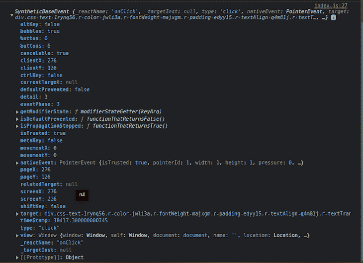
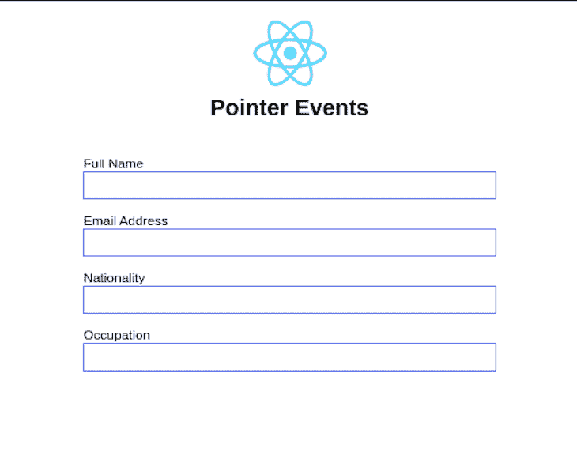
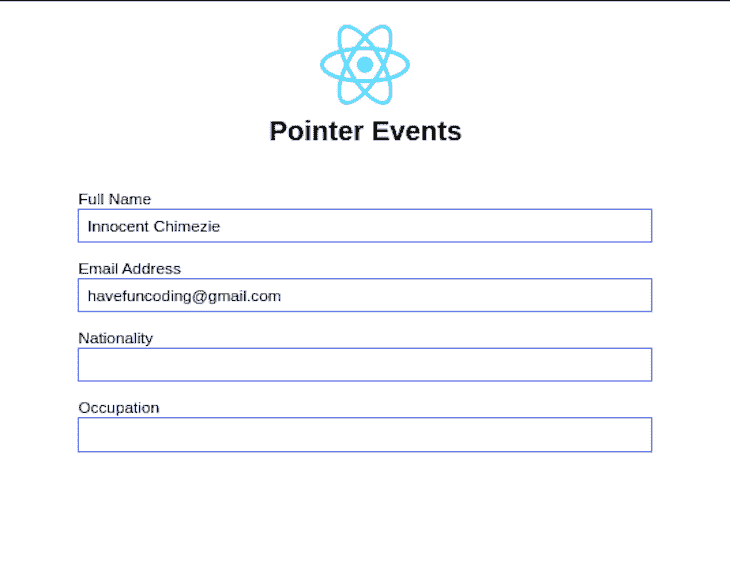

# 在 React Native 中使用指针事件

> 原文：<https://blog.logrocket.com/using-pointerevents-react-native/>

React Native `pointerEvents`是众多`View`响应器道具之一，决定了`View`如何与触摸事件交互。在本文中，我们将了解如何使用`pointerEvents`来处理 React 本地应用程序中的不同事件。

向前跳:

要学习本教程，您需要在计算机上安装 React Native，并了解 React Native 的工作原理。

## web 应用程序的输入和事件简史

几年前，计算机主要是为鼠标输入而设计的。因此，web 应用程序只需监听鼠标事件并与之交互，这也让开发人员的工作变得简单易行，他们只需为这些鼠标事件编写逻辑。

鼠标事件是由鼠标的动作或移动触发的事件。当用户使用鼠标[与 web 应用程序的 DOM 元素](https://blog.logrocket.com/what-virtual-dom-react/)交互时，它们就会触发。鼠标事件的例子包括`onMouseEnter`、`onMouseLeave`、`onDoubleClick`、`onDrag`、`onDragEnter`等等。

随着时间的推移，创新和现代化带来了更新的设备，包括移动设备，这些设备集成了其他形式的输入，如触摸输入和笔输入。因此，设计了不同的事件类型来处理这些新事件，包括触摸事件。

触摸事件是当[用户与触摸屏设备上的可触摸组件](https://blog.logrocket.com/react-native-touchable-vs-pressable-components/)交互时触发的事件。触摸事件的例子包括`onTouchCancel`、`onTouchEnd`、`onTouchMove`、`onTouchStart`等等。

然而，至少可以说，为不同的事件和不同的设备编写和复制相同的逻辑有点不必要和不明确。还有兼容性的问题，因为鼠标事件的逻辑不能用于触摸屏，反之亦然。

一种称为指针输入的新输入形式就是为了解决这个问题而建立的。指针可以是用户进行的任何形式的接触，包括触摸输入、笔输入、多点触摸和鼠标输入。

类似地，`pointerEvents` prop 被设计来处理这个输入表单并组合上面的事件；即触摸事件、鼠标事件和笔支持。

## React 原生`pointerEvents`道具是什么？

在 React Native 中，`View`是构建用户界面最基本的组件。`pointerEvents`控制`View`是否可以成为触摸事件的目标——当用户对设备表面进行点或触摸接触时触发的事件。

这些事件包括`pointerDown`、`pointerUp`等等。

让我们看看下面的例子:

```
{/* App.js */}

 <View style={styles.app} pointerEvents="none">
      <View style={styles.header}>
        <Text style={styles.title}>React Native for Web</Text>
      </View>
      <Button onPress={() => console.log("test")} title="Example button" />
</View>

```

在上面的例子中，我们将`pointerEvents`添加到根`View`中，并将其设置为`none`。这意味着`View`——及其相应的子节点——不再是任何指针事件的目标。换句话说，如果你试图点击孩子`Button`，它将无法点击。

`none`属性是 React Native 中三个`pointerEvents`属性之一。让我们进一步了解这些属性以及它们如何影响`View`。

## 了解 React Native 中的`pointerEvents`属性

在 React Native 中，`pointerEvents`有四个属性:

*   `auto`
*   `none`
*   `box-only`
*   `box-none`

React Native 中`pointerEvents`的默认值为`auto`。将`pointerEvents`设置为`auto`意味着`View`及其对应的子节点可以成为触摸事件的目标。复制下面示例中的代码，并尝试单击生成的按钮:

```
{/* App.js */}

 <View style={styles.app} pointerEvents="auto">
      <View style={styles.header}>
        <Text style={styles.title}>React Native for Web</Text>
      </View>
      <Button onPress={() => console.log("test")} title="Example button" />
</View>

```

由于`pointerEvents`设置为`auto`，按钮应该是可点击的。

相反，正如我们前面看到的，`none`属性值意味着`View`及其对应的子对象都不会成为触摸事件的目标。

然而，将`pointerEvents`属性设置为`box-none`意味着虽然`View`永远不会成为触摸事件的目标，但是它的子对象可以。让我们来看下面的例子`View`设置为`box-none`:

```
{/* App.js */}

 <View style={styles.app} pointerEvents="box-none">
      <View style={styles.header}>
        <Text style={styles.title}>React Native for Web</Text>
      </View>
      <Button onPress={() => console.log("test")} title="Example button" />
</View>

```

在上面的例子中，`View`不是触摸事件的目标，但是它的子视图仍然可以是目标，这就是为什么在这种情况下可以单击子视图`Button`。

最后，将`pointerEvents`属性设置为`box-only`意味着`View`可以成为触摸事件的目标，但是它的孩子不能。让我们来看下面的例子`View`设置为`box-only`:

```
{/* App.js */}

 <View style={styles.app} pointerEvents="box-only">
      <View style={styles.header}>
        <Text style={styles.title}>React Native for Web</Text>
      </View>
      <Button onPress={() => console.log("test")} title="Example button" />
</View>

```

在上面的例子中，`Button`不能被点击，因为它不是触摸事件的目标；只有父级`View`是。

## React Native 的好处`pointerEvents`

[在](#brief-history-inputs-events-web-apps)上面的简史部分，我们回顾了`pointerEvents`在 React Native 中的用途。现在，让我们回顾一下它们的好处——换句话说，为什么`pointerEvents`道具如此重要。

### 建立跨输入类型的兼容性

`pointerEvents` prop 使得具有不同输入形式的设备之间的兼容性成为可能，统一了鼠标、触摸和笔事件。

* * *

### 更多来自 LogRocket 的精彩文章:

* * *

这意味着不用为单独的事件监听器重写逻辑，您可以使用`pointerEvent`监听器同时为所有输入类型应用相同的逻辑。看看下面的示例代码块。

不要这样做:

```
/* TouchScreen devices */
something.addEventListener("touchdown", () => {
    // write your logic
});

/* Mouse devices */
something.addEventListener("mousedown", () => {
    // write your logic
});

```

您可以这样做:

```
/* TouchScreen and Mouse devices */
something.addEventListener("pointerdown", () => {
    // write your logic
});

```

### 提高应用性能

除了使跨输入类型的兼容性成为可能之外，使用`pointerEvents` prop 对所有输入类型应用相同的逻辑可以帮助减轻代码的负担。

回头看看上面的代码示例。我们没有为不同的设备——触摸和鼠标设备——编写相同的逻辑，而是简单地使用`pointerEvents`将两者合二为一。`pointerdown`将一直为`mousedown`、`touchdown`等事件工作。

由于您不必复制代码来监听不同设备输入的不同事件，因此可以减少一些代码歧义，这有助于提高或优化应用程序的性能。

### 检测输入类型

`pointerEvent` prop 的另一个好处是，如果有必要，它可以区分输入类型。这意味着它可以检测用户何时使用触摸、鼠标或笔输入设备。

```
/* TouchScreen and Mouse devices */
something.addEventListener("pointerdown", (e) => {
    // write your logic
    console.log(e.pointerType)
});

```

在上面的代码中，我们使用`pointerdown`事件监听`mousedown`和`touchdown`事件。当您在 web 上单击鼠标或在移动设备上进行触摸接触时，您可以检查控制台日志以查看调用的事件类型。

让我们看看下面的代码，以便更好地理解这一优势:

```
/* App.js */
import React from "react";
import { Button, StyleSheet, Text, View } from "react-native";

function App() {
  const getDeviceType = (e) => {
    console.log(e);
  };

  return (
    <View style={styles.app} pointerEvents="box-none">
      <View style={styles.header}>
        <Text style={styles.title}>React Native for Web</Text>
      </View>
      <Button onPress={getDeviceType} title="Example button" />
    </View>
  );
}

const styles = StyleSheet.create({
  app: {
    marginHorizontal: "auto",
    maxWidth: 500
  },
  header: {
    padding: 20
  },
  title: {
    fontWeight: "bold",
    fontSize: "1.5rem",
    marginVertical: "1em",
    textAlign: "center"
  }
});
export default App;

```

在上面的代码中，我们扩展了我们一直使用的例子。当我们单击产生的按钮时，我们可以再次检查开发人员控制台，看看我们触发了什么事件。

在你的浏览器中打开你的开发者控制台，看看我们在谈论什么。您应该会看到类似下图的内容:



如果您查看`nativeEvent`，您可以看到`pointerEvent`对象显示了`pointerId`、`width`、`height`和其他属性。

一个`pointerEvent`对象属性是`pointerType`，它显示设备输入。通过这种类型，我们可以确定设备是鼠标、笔还是触摸屏设备。

在我们的`App.js`文件的`getDeviceType`函数中，让我们将`console.log`方法改为如下:

```
/* App.js */

const getDeviceType = (e) => {
  console.log(e.nativeEvent.pointerType); // "touch" for touchscreen devices
};

```

修改代码后点击按钮，您将看到`touch`作为设备类型登录到控制台，这表明我们在一个触摸屏设备上。如果我们在像计算机这样的鼠标输入设备上运行我们的应用程序，它将显示`mouse`。

如果你愿意，你可以使用它，并根据用户使用的设备做任何你想做的事情。

```
/* App.js */

const getDeviceType = (e) => {
   if (e.nativeEvent.pointerType === "touch") {
     // do something
   } else if (e.nativeEvent.pointerType === "mouse") {
     // do something different
   } else {
     // do something else entirely
   }
};

```

例如，如果您只为移动设备构建特定的功能，并且不希望该功能在 web 上运行，则可以在用户在 web 上尝试该功能时提醒用户。

```
/* App.js */
useEffect(() => {
    window.addEventListener("pointerdown", (e) => {
      if (e.nativeEvent.pointerType === "touch") {
        console.log(e.pointerType);
      } else if (e.nativeEvent.pointerType === "mouse") {
        alert("Web feature is not supported");
      }
    });
  }, []);

```

## 以`TextInput`的形式使用`pointerEvents`

我们可以在许多情况下使用`pointerEvent`——比如为 Canva 这样的图形创建器添加拖动功能，为视频播放器创建拖动和快进功能，以及许多其他场景。在这个例子中，我们将看到如何在文本输入表单中使用它。

假设我们正在构建一个约会应用程序，我们希望为用户提供使用谷歌或脸书账户登录的能力。

假设用户使用 Google 帐户登录。他们的谷歌登录信息向我们提供了一些细节，如用户的姓名、电子邮件地址和图像。用户登录后，我们希望用户填写应用程序需要的其他详细信息，如年龄、国籍、性别、职业等。

在这个场景中，我们将有一个如下所示的简单表单:

```
/* App.js */

import React from "react";
import { TextInput, Image, StyleSheet, Text, View } from "react-native";
const logoUri =
  "https://d33wubrfki0l68.cloudfront.net/554c3b0e09cf167f0281fda839a5433f2040b349/ecfc9/img/header_logo.svg";
function App() {
  return (
    <View style={styles.app}>
      <View style={styles.header}>
        <Image
          accessibilityLabel="React logo"
          source={{ uri: logoUri }}
          resizeMode="contain"
          style={styles.logo}
        />
        <Text style={styles.title}>Pointer Events</Text>
      </View>
      <View>
        <View style={styles.textInputParent}>
          <Text>Full Name </Text>
          <TextInput style={styles.textInput} />
        </View>
        <View style={styles.textInputParent}>
          <Text>Email Address </Text>
          <TextInput style={styles.textInput} />
        </View>
        <View style={styles.textInputParent}>
          <Text>Nationality </Text>
          <TextInput style={styles.textInput} />
        </View>
        <View style={styles.textInputParent}>
          <Text>Occupation</Text>
          <TextInput style={styles.textInput} />
        </View>
      </View>
    </View>
  );
}
const styles = StyleSheet.create({
  app: {
    marginHorizontal: 100,
    maxWidth: 500
  },
  logo: {
    height: 70
  },
  header: {
    padding: 20
  },
  textInputParent: {
    marginVertical: 7
  },
  textInput: {
    backgroundColor: "transparent",
    borderWidth: 2,
    borderColor: "#516beb",
    width: "100%",
    height: 30
  },
  title: {
    fontWeight: "bold",
    fontSize: "1.5rem",
    marginVertical: ".4em",
    textAlign: "center"
  }
});
export default App;

```



由于用户使用他们的 Google 登录信息登录应用程序，这意味着我们已经可以访问他们的电子邮件地址和姓名。我们可以自动填充这些信息来优化用户体验，并使用`pointerEvents`来禁用自动填充的文本输入，这样用户就不能编辑它们了。

为此，我们将把`pointerEvent`道具添加到包含我们的文本输入的`View`中，这样它只对那个`View`及其子元素有效:

```
/* App.js */

 <View
          style={styles.textInputParent}
          pointerEvents={userDetails.name ? "none" : "auto"}
        >
          <Text>Full Name </Text>
          <TextInput style={styles.textInput} value={userDetails.name} />
        </View>
        <View
          style={styles.textInputParent}
          pointerEvents={userDetails.email ? "none" : "auto"}
        >
          <Text>Email Address </Text>
          <TextInput style={styles.textInput} value={userDetails.email} />
        </View>

```

我们使用条件语句来检查用户的电子邮件和姓名是否存在。如果该信息存在，那么我们自动填充适当的字段并取消激活`View`。否则，用户可以自己填写这些字段。

这真的很好用，因为你可以用同一个表单登录谷歌和脸书，也可以登录苹果和普通的登录表单。只有当必要的详细信息已经可用时，才可以禁用表单输入。

看看下面的完整代码和输出:

```
/* App.js */

import React, { useState } from "react";
import { TextInput, Image, StyleSheet, Text, View } from "react-native";
const logoUri =
  "https://d33wubrfki0l68.cloudfront.net/554c3b0e09cf167f0281fda839a5433f2040b349/ecfc9/img/header_logo.svg";
function App() {
  const [userDetails, setUserDetails] = useState({
    name: "Innocent Chimezie",
    email: "[email protected]",
    nationality: "",
    occupation: ""
  });
  return (
    <View style={styles.app}>
      <View style={styles.header}>
        <Image
          accessibilityLabel="React logo"
          source={{ uri: logoUri }}
          resizeMode="contain"
          style={styles.logo}
        />
        <Text style={styles.title}>Pointer Events</Text>
      </View>
      <View>
        <View
          style={styles.textInputParent}
          pointerEvents={userDetails.name ? "none" : "auto"}
        >
          <Text>Full Name </Text>
          <TextInput style={styles.textInput} value={userDetails.name} />
        </View>
        <View
          style={styles.textInputParent}
          pointerEvents={userDetails.email ? "none" : "auto"}
        >
          <Text>Email Address </Text>
          <TextInput style={styles.textInput} value={userDetails.email} />
        </View>
        <View style={styles.textInputParent}>
          <Text>Nationality </Text>
          <TextInput style={styles.textInput} />
        </View>
        <View style={styles.textInputParent}>
          <Text>Occupation</Text>
          <TextInput style={styles.textInput} />
        </View>
      </View>
    </View>
  );
}
const styles = StyleSheet.create({
  app: {
    marginHorizontal: 100,
    maxWidth: 500
  },
  logo: {
    height: 70
  },
  header: {
    padding: 20
  },
  textInputParent: {
    marginVertical: 7
  },
  textInput: {
    backgroundColor: "transparent",
    borderWidth: 2,
    borderColor: "#516beb",
    width: "100%",
    height: 30,
    paddingLeft: 6
  },
  title: {
    fontWeight: "bold",
    fontSize: "1.5rem",
    marginVertical: ".4em",
    textAlign: "center"
  }
});
export default App;

```



## 结论

在本文中，我们回顾了 React Native `pointerEvents` prop 是什么，并研究了它的一些属性和优点。我们还看了一个例子，展示了`pointerEvents`在检测输入类型的实际场景中是如何工作的，以及一个`TextInput`表单中`pointerEvents`的用例。

希望这篇关于 React Native `pointerEvents`的文章对你有所帮助。如果你有意见或问题，请在下面的评论区告诉我。

## [LogRocket](https://lp.logrocket.com/blg/react-native-signup) :即时重现 React 原生应用中的问题。

[](https://lp.logrocket.com/blg/react-native-signup)

[LogRocket](https://lp.logrocket.com/blg/react-native-signup) 是一款 React 原生监控解决方案，可帮助您即时重现问题、确定 bug 的优先级并了解 React 原生应用的性能。

LogRocket 还可以向你展示用户是如何与你的应用程序互动的，从而帮助你提高转化率和产品使用率。LogRocket 的产品分析功能揭示了用户不完成特定流程或不采用新功能的原因。

开始主动监控您的 React 原生应用— [免费试用 LogRocket】。](https://lp.logrocket.com/blg/react-native-signup)