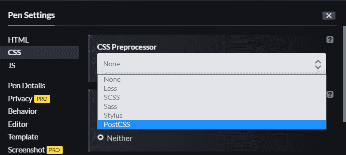
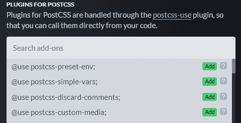

# 使用 PostCSS 与媒体查询级别 4 -日志火箭博客

> 原文：<https://blog.logrocket.com/using-postcss-media-queries-level4/>

媒体查询为开发人员提供了一种强大的方式，无论用户设备的类型或大小如何，都可以为网站访问者提供最佳的 web 体验。例如，媒体查询可用于根据设备的屏幕大小自动调整文档或其元素的样式。

PostCSS JavaScript 插件可以用来有效地实现媒体查询。这个工具使开发人员能够编写 CSS 前处理器或后处理器。PostCSS 可以处理各种各样的任务，如林挺 CSS，转换未来的 CSS 语法，显示内嵌图像，支持混合和变量。开发需求可能因项目而异，但幸运的是，有几个 [PostCSS 插件](https://www.postcss.parts)可用。

在本文中，我们将回顾媒体查询级别 4 中的几个可用功能。我们将使用 PostCSS 来演示每个特性的实现。在撰写本报告时，[第 5 级媒体问询仍在起草中](https://blog.logrocket.com/new-media-queries-you-need-to-know/)。

我们将在整篇文章中使用 [Codepen](https://codepen.io/) 来演示例子。这个在线代码编辑器允许我们保持简单，随时查看我们的输出，并避免使用任何类型的 CSS 或 JavaScript 框架。

我们开始吧！

## 为 Codepen 设置 PostCSS

如果您没有 Codepen 帐户，您可以在这里创建一个[。](https://codepen.io/accounts/signup/user/free)

要为 Codepen 演示设置 PostCSS，请遵循以下五个步骤:

1.  点击工具条上的**笔**创建一个新笔。
    T3
2.  点击**设置**按钮打开本模态:
    
3.  从侧边栏选择 **CSS** 显示不同的 CSS 设置。
4.  从 **CSS** **预处理器**下拉菜单中，选择 **PostCSS** 。在 **CSS 基础**下，选择**规格化**。然后在**供应商** **前缀**下，选择**自动前缀**。
    

Autoprefixer 是一个 PostCSS 插件，它使用来自 [Can I](https://caniuse.com) [Use](https://caniuse.com) 的值，不需要编写供应商前缀。这节省了时间，并有助于保持代码的整洁。

点击**需要一个附加组件吗？**modal 右上角的徽章，显示可用的 PostCSS 插件列表。在整个教程中，我们将把其中几个直接添加到代码中:



5.  选择**保存&关闭**。

## 使用 PostCSS 实现媒体查询第 4 级功能

现在，让我们探索一些最有趣的媒体查询 4 级功能。当我们回顾每个特性时，我们将看看用 PostCSS 插件编写的示例代码。

### `pointer`

`pointer`媒体功能对于检查鼠标或触摸屏等指点设备的存在和准确性非常有用。它还可以用于根据用户设备中的指针类型编写媒体查询。

`pointer`有三个值可用:`none`、`coarse`和`fine`。

以下代码使用`postcss-custom-media`插件在检测到`coarse`(或不太精确的)指针类型时放大单选按钮和复选框:

```
@use postcss-custom-media;

@custom-media --pointer-check (pointer: coarse);

@media (--pointer-check) {
    input[type="checkbox"], input[type="radio"] {
    min-width:30px;
    min-height:40px;
    background:transparent;
  }
}

```

### `range`

`range`媒体功能使我们能够根据用户设备调整显示，这些设备在特定维度上处于指定的最小值和最大值范围内。

以下代码使用`postcss-media-minmax`插件在指定的`width`范围内为用户设备屏幕更改`display`的样式:

```
@use postcss-media-minmax;

@media screen and (500px <= width <= 1200px) {
  .bar {
    display: block;
  }
}

```

### `color`

`color`媒体功能使我们能够测试视觉设备的每种颜色成分(红色、绿色和蓝色)的位数。单色设备的值为零。

以下代码使用`postcss-media-minmax`插件为每个颜色分量至少有`8`位的用户设备显示指定的样式:

```
/* This media query expresses that a style sheet applies to color devices with at least 8 bits per color component */

@use postcss-media-minmax;

@media (color >= 8) { … }

```

### `resolution`

`resolution`媒体功能允许我们检查任何输出设备的像素密度。这使我们能够在向用户呈现内容的同时管理显示质量。

以下代码使用`postcss-media-minmax`插件根据用户输出设备的像素密度调整文本`resolution`:

```
@use postcss-media-minmax;

@custom-media --exact-resolution (resolution: 150dpi);
@custom-media --min-resolution (min-resolution: 72dpi);
@custom-media --max-resolution (max-resolution: 300dpi);

/* Exact resolution */
@media (--exact-resolution) {
  p {
    color: red;
  }
}

/* Minimum resolution */
@media (--min-resolution) {
  p {
    text-decoration: underline;
  }
}

/* Maximum resolution */
@media (--max-resolution) {
  p {
    background: yellow;
  }
}

```

### `hover`

媒体查询为我们提供了一个本地 CSS 解决方案，用于测试用户设备上的触摸支持。它检查用户的主要输入设备是否可以悬停在 HTML 元素上。

例如，下面的代码使用`postcss-custom-media`插件来显示一个`hover`激活的下拉菜单，仅当该功能在用户的设备上可用时。

```
@use postcss-custom-media;

@custom-media --hover-check (hover);

@media ((--hover-check)) {
  .menu > li        {display:inline-block;}
  .menu ul          {display:none; position:absolute;}
  .menu li:hover ul {display:block; list-style:none; padding:0;}
  /* ... */
}

```

媒体查询级别 4 还允许使用逻辑运算符，如`and`、`not`和`only`。在上面的例子中，使用`not`会否定媒体特性。换句话说，`not(--hover-check)`只会匹配缺乏悬停功能的可视设备。

### `update`

当我们想要评估用户的输出设备修改呈现内容外观的能力时，CSS `update`媒体特性就派上了用场。这个特性特别有助于根据用户的输出设备来确定 web 内容所需的功能类型。

`update`媒体特征接受三个值:`none`、`slow`和`fast`。

例如，考虑一个在悬停时带有下划线链接的网页。如果页面被下载或打印，将这些链接显示为下划线可能会有所帮助。

下面的代码使用`postcss-custom-media`插件来检查悬停时带下划线的链接，然后总是用`underline`来显示它们:

```
@use postcss-custom-media;

@custom-media --update-check (update);

@media (--update-check) {
  a { text-decoration: none; }
  a:hover, a:focus { text-decoration: underline; }
}

/* In non-updating output devices, the links are always underlined. */

```

## 结论

在本文中，我们介绍了如何将 PostCSS 与媒体查询级别 4 中可用的`pointer`、`range`、`color`、`resolution`、`hover`和`update`特性结合使用。PostCSS 是增强 CSS 工作流的有用工具。它的速度快得令人难以置信，它的命名语法也大大简化了，这要归功于一个庞大的可用插件生态系统。

查看 [PostCSS 文档](https://github.com/postcss/postcss)以获得更多信息，帮助您驾驭 PostCSS 的力量。有关第 4 级附加媒体查询功能的详细信息可在其[文档](https://www.w3.org/TR/mediaqueries-4/)和 [MDN](https://developer.mozilla.org/en-US/docs/Web/CSS/@media) 中找到。

## 你的前端是否占用了用户的 CPU？

随着 web 前端变得越来越复杂，资源贪婪的特性对浏览器的要求越来越高。如果您对监控和跟踪生产环境中所有用户的客户端 CPU 使用情况、内存使用情况等感兴趣，

[try LogRocket](https://lp.logrocket.com/blg/css-signup)

.

[](https://lp.logrocket.com/blg/css-signup)[https://logrocket.com/signup/](https://lp.logrocket.com/blg/css-signup)

LogRocket 就像是网络和移动应用的 DVR，记录你的网络应用或网站上发生的一切。您可以汇总和报告关键的前端性能指标，重放用户会话和应用程序状态，记录网络请求，并自动显示所有错误，而不是猜测问题发生的原因。

现代化您调试 web 和移动应用的方式— [开始免费监控](https://lp.logrocket.com/blg/css-signup)。