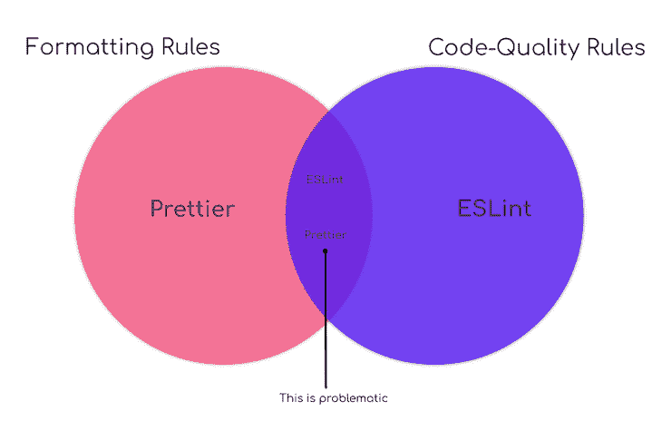
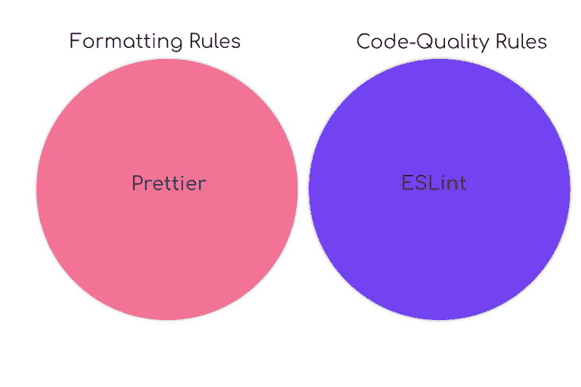
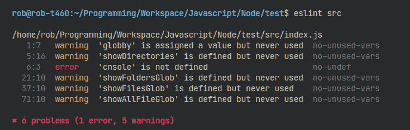
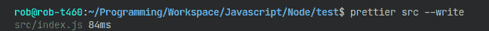
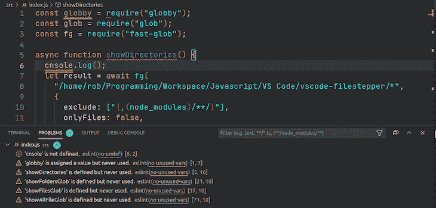

# 使用 Prettier 和 ESLint 自动格式化和修复 JavaScript 

> 原文：<https://blog.logrocket.com/using-prettier-eslint-automate-formatting-fixing-javascript/>

***编者按:**这篇文章于 2022 年 2 月 11 日更新，以纠正任何过时的信息，并增加了[beautiful vs . ESLint](#prettier-vs-eslint)部分。*

林挺和漂亮打印 JavaScript 代码可以帮助开发人员及早发现错误，使代码更加易读，并提高整体代码质量。然而，当并行使用格式器进行漂亮打印和棉绒时，可能会有一些摩擦。

例如，格式化程序可能会做一些 linter 认为有问题的事情。然后，linter 可以覆盖来自格式化程序的样式更改，使两者向不同的方向拉动。

为了成功地一起使用它们，开发人员必须将它们放在同一页面上。在本文中，我们将讨论如何在流行的 linter，ESLint 中使用流行的格式化程序。

我们将学习如何设置它们，并在命令行和 Visual Studio 代码(VS 代码)中一起使用它们来自动修复和格式化代码。

我见过不同的方法来处理如何一起使用它们，但是由于代码编辑器的限制，有些方法很粗糙。所以，我将讨论其中一些的利弊，你可以自己决定什么是最好的。

在本帖中，我们将讨论以下内容:

首先，让我们清楚地了解 ESLint 和 Prettier 是做什么的，并强调它们的不同之处。

## Prettier 诉 ESLint

### 什么更漂亮？

Prettier 是一个固执己见的 JavaScript 和其他流行语言的代码格式化程序。通过解析代码并根据自己的规则重新打印代码(考虑到最大行长度，在必要时换行), Prettier 强制执行一致的格式。

这种重写过程可以防止开发人员引入任何格式错误。

创建漂亮器的主要原因是为了消除对代码风格的争论。这个想法是漂亮的风格指南是全自动的。即使 Prettier 没有按照您喜欢的方式 100%格式化您的代码，为了方法的简单性做出牺牲也是值得的。

虽然使用 pretty 的一个重要原因是完全避免配置，但 pretty 确实支持它自己的配置文件，该文件有一些格式选项。

那么，为什么还有其他选择呢？

主要是历史原因。在 Prettier 的初期增加了一些来吸引更多的人使用它，由于需求增加了一些选项，出于兼容性的原因增加了一些规则。

底线是开发团队打算从现在开始不再添加更多的选项；你可以在 Prettier 的[期权哲学](https://prettier.io/docs/en/option-philosophy.html)中读到更多这方面的内容。

### 什么是 ESLint？

ESLint 是 JavaScript 林挺实用程序，于 2013 年 6 月首次发布，目前是林挺排名第一的实用程序。

林挺是一种静态分析，它发现有问题的模式和不符合特定风格指南的代码。

由于 JavaScript 是一种动态的、松散类型的语言，它特别容易让开发人员出错。如果没有编译过程的帮助，JavaScript 代码通常会执行来查找语法或其他错误。

然而，ESLint 使开发人员能够在不实际执行代码的情况下发现代码中的问题。

创建 ESLint 的主要原因是允许开发者创建他们自己的林挺规则。ESLint 的内置规则使它从一开始就很有用，但是您可以添加特定于您的项目和您使用的任何风格的 JavaScript 的规则。

许多人已经通过创建[可共享配置](https://eslint.org/docs/developer-guide/shareable-configs)为您完成了繁重的工作，这些配置拥有流行 JavaScript 框架的规则集和通用样式指南/编码标准，如[谷歌的 JavaScript 样式指南](https://google.github.io/styleguide/jsguide.html)。

通过搜索“eslint-config”(共享配置的命名约定)，您可以在[npmjs.com 上找到其中一些共享配置。](https://www.npmjs.com/search?q=eslint%20config)

ESLint 有一个可插拔的架构，可以创建[插件](https://eslint.org/docs/developer-guide/working-with-plugins)，这可以为 ESLint 添加额外的功能，并提供一个新的基线来添加您自己的定制规则。

一个例子是 [eslint-plugin-vue](https://github.com/vuejs/eslint-plugin-vue/) ，这是 vue.js 的官方插件。这个插件允许我们 lint`.vue`文件的`<template>`和`<script>`部分，以及包含在`.js`文件中的 Vue 代码。

在专用的 ESLint 配置文件中，您可以管理项目使用的规则，并禁用任何您不想使用的规则。ESLint 允许将规则设置为错误或警告，一些错误可以自动修复。

### ESLint 和 Prettier 的区别

总之，主要区别如下:

| 斯洛文尼亚语 | -什么 | 报告代码错误 |
| --- | --- | --- |
| 是 | 不 | 自动修复代码错误 |
| 是 | 不 | 格式代码 |
| 是 | 是 | 配置选项 |
| 是 | 有限的 | 添加自定义规则/选项 |
| 是 | 不 | 你还在想为什么要两个都用呢？ |

简而言之，您将使用 Prettier 来简化代码的格式，并使用 ESLint 来捕捉 bug。

管理 ESLint 的规则以避免与更漂亮的冲突

## 有两大类林挺规则:格式规则和代码质量规则。

格式规则是影响代码风格的规则，与错误无关。例如，ESLint 中的 rule `[no-mixed-spaces-and-tabs](https://eslint.org/docs/rules/no-mixed-spaces-and-tabs)`规则确保只使用制表符或空格进行缩进。

Prettier 有一个 [`tabs`选项](https://prettier.io/docs/en/options.html#tabs)做同样的事情。

其次，代码质量规则提高了代码质量，并且可以防止或捕捉错误。例如，ESLint 中的规则`[no-implicit-globals](https://eslint.org/docs/rules/no-implicit-globals)`不允许全局范围变量。

从其他脚本创建的全局变量可能会发生名称冲突，这通常会导致运行时错误或意外行为。



问题是更漂亮和 ESLint 的规则是重叠的，我们希望它们不要重叠！

一般来说，我们希望[更漂亮的](https://prettier.io/)来处理第一类，ESLint 来处理第二类。有些规则可能很难归类为一个或另一个；我们不必拘泥于它们属于哪一类。

我们感兴趣的是确保 Prettier 或 ESLint 执行特定的动作，并且不会相互碰撞。



至于运行它们的顺序，一般来说最好在 ESLint 之前运行 pretty，因为 pretty 会从头开始重新打印你的整个程序。因此，如果您想让 ESLint 参与格式化操作，您应该在 Prettier 之后运行它，以防止更改被覆盖。

如果您不熟悉 ESLint 和 Prettier，让我们在下一节讨论如何配置和使用它们。

ESLint 和更漂亮的初始配置和基本用法

## ESLint 和 beauty 都可以从 npm 和 Yarn 下载。对于每个项目，您必须创建一个`package.json`并将它们添加为`devDependencies`:

ESLint 从一张白纸开始。它不会做任何事情，直到您创建一个带有一些规则的配置。您必须将配置文件`.eslintrc.{js,yml,json}`放到项目目录中，然后就可以开始 lint 了。

```
npm install --save-dev eslint
npm install --save-dev --save-exact prettier

```

您可以使用以下命令在命令行上创建配置:

注意，`npm init @eslint/config`假设您已经有了一个`package.json`文件。如果没有，您可以运行`npm init`或`yarn init`来创建一个。

```
npm init @eslint/config

# or

yarn create @eslint/config

```

这个命令将引导一个向导，其中有一系列问题来确定您想要 lint 的内容，比如模块类型、使用的框架、代码在哪里运行等等。它会给出一个配置文件，并为您安装任何相关的依赖项。

如果只是想使用[内置的推荐规则](https://eslint.org/docs/rules/)，可以简单的像这样添加`eslint.json`:
<

配置就绪后，您可以在任何文件或目录上运行 ESLint。比如，我这里是林挺我的`src`目录:

```
{
    "extends": "eslint:recommended"
}

```



```
npx eslint src

# or

yarn run eslint src

```

正如您在上面的截图中所看到的，ESLint 输出了一个问题列表，其中包含详细信息:错误的位置(格式为`<line number: character number>`)、类型(错误或警告)、描述和规则名称。你可以阅读 ESLint 的[入门指南](https://eslint.org/docs/user-guide/getting-started)了解更多详情。

你也可以设置一个全局配置，但是 ESLint 反对这样做。我仍然使用全局配置。🤫

另一方面，更漂亮的有一个默认配置。它可以在不创建配置文件的情况下运行，因此您可以直接开始使用它。建议在大型项目中使用更漂亮的特定版本，否则更新可能会导致文件发生变化，并增加 git 提交的噪声。

你也应该使用一个`[.prettierignore](https://prettier.io/docs/en/ignore.html)`文件来忽略那些不应该被格式化的东西。你可以阅读更漂亮的[安装指南](https://prettier.io/docs/en/install.html)了解更多信息。



一个典型的`package.json`看起来会像下面这样。这里，我们将文件夹`src`和`test`中的文件作为 npm 脚本的目标。

如果可能的话，我更喜欢跳过`.eslintignore`和`.prettierignore`文件——越简单越好！😅

所有主要的代码编辑器都有对 ESLint 和 Prettier 的扩展。对于 VS 代码，官方的扩展是[更漂亮——代码格式化程序](https://marketplace.visualstudio.com/items?itemName=esbenp.prettier-vscode)和 [ESLint](https://marketplace.visualstudio.com/items?itemName=dbaeumer.vscode-eslint) 。

```
{
  "name": "basic-project",
  "version": "1.0.0",
  "main": "index.js",
  "scripts": {
    "lint": "npx eslint src test",
    "lint:fix": "npm run lint -- --fix",
    "prettier": "npx prettier src test --check",
    "prettier:fix": "npm run prettier -- --write",
  },
  "author": "rob o'leary",
  "license": "ISC",
  "devDependencies": {
    "eslint": "^7.25.0",
    "prettier": "^2.2.1"
  }
}

```



林挺和美化代码的方法

## 删除冲突的规则并连续运行

### 这种方法是最干净、最有效的，也是最值得推荐使用的方法。

通过使用以下配置，很容易在 ESLint 中关闭与更漂亮的规则相冲突的规则:

首先，安装 JavaScript 的配置:

然后，将该配置名称附加到本地`.stylelintrc.*` ESLint 配置文件中的`[extends](https://stylelint.io/user-guide/configuration/#extends)`数组。确保把漂亮的配置放在最后，这样它会覆盖其他配置的设置。

```
npm install --save-dev eslint-config-prettier

```

这里有一个例子`.eslintrc.json`:

现在，你可以运行更漂亮和 ESLint 在一起，没有任何副作用。通过将它们定义为 npm 脚本，您还可以像在命令行上一样一个接一个地运行它们。这是它在`package.json`中的样子:

```
{
  // ...
  extends: [
    // ...
    'eslint:recommended',
    "prettier" // Make sure this is the last
  ],
  // ...
}

```

现在，您可以运行`npm run format`命令来一次性格式化并修复所有代码。

```
{
   "name": "no-worries-setup",   
   "version": "1.0.0",
   "scripts": {
    "lint": "npx eslint src test",
    "lint:fix": "npm run lint -- --fix",
    "prettier": "npx prettier src test --check",
    "prettier:fix": "npm run prettier -- --write",
    "format": "npm run prettier:fix && npm run lint:fix",
  }
  // ...
}

```

要使用 VS 代码，安装扩展: [ESLint](https://marketplace.visualstudio.com/items?itemName=dbaeumer.vscode-eslint) 、[prettle](https://marketplace.visualstudio.com/items?itemName=esbenp.prettier-vscode)和 [Format Code Action](https://marketplace.visualstudio.com/items?itemName=rohit-gohri.format-code-action&ssr=false#review-details) ，并更新您的用户设置(`settings.json`，如下所示:

首先，需要在保存时禁用编辑器格式化(`editor.formatOnSave`)；我们希望通过代码操作来处理所有事情。

```
{
  //...
  "editor.defaultFormatter": "esbenp.prettier-vscode",
  "eslint.probe": [
      "javascript",
      "javascriptreact",
      "vue"
  ],
  "editor.formatOnSave": false,
  // Runs Prettier, then ESLint
  "editor.codeActionsOnSave": [
    "source.formatDocument",
    "source.fixAll.eslint"
  ],
  "vetur.validation.template": false
  // ...
}

```

在【2020 年 3 月(v1.44) 中，`editor.codeActionsOnSave`属性被更新以接受一组代码动作，这允许有序的代码动作。如果我们安装了[格式化代码动作](https://marketplace.visualstudio.com/items?itemName=rohit-gohri.format-code-action&ssr=false#review-details)扩展，我们就可以将格式化作为一个代码动作。

所以现在，我们可以按照我们喜欢的任何顺序运行更漂亮和 ESLint 作为代码动作。太棒了。

在这个例子中，我们首先用动作`source.formatDocument`运行得更漂亮(它使用默认的格式化程序)，然后用`source.fixAll.eslint`动作运行`eslint --fix`。

属性的目标是 ESLint 应该验证的语言。如果您想查看弹出消息，可以使用`eslint.validate`。

如果您使用 Vetur 扩展，请确保它不会进行自己的验证。有一个设置`vetur.validation.template`，您不应该启用它。

以编程方式运行更漂亮的后跟 ESLint

### 以下应用程序提供了一种统一的方式来运行文件上的`prettier`，然后立即运行`eslint --fix`:

首先，安装软件包。这只适用于 JavaScript:

接下来，编写您自己的实现来定位您的文件并运行格式化。

```
npm install --save-dev prettier-eslint

```

下面是一个格式化字符串的基本示例:

显然，这种方法需要更多的工作来定位文件、读取内容和编写输出。

```
const format = require("prettier-eslint");

// notice, no semicolon in the original text
const sourceCode = "const {foo} = bar";

const options = {
  text: sourceCode,
  eslintConfig: {
    parserOptions: {
      ecmaVersion: 7,
    },
    rules: {
      semi: ["error", "never"],
    },
  },
  prettierOptions: {
    bracketSpacing: true,
  },
  fallbackPrettierOptions: {
    singleQuote: false,
  },
};

const formatted = format(options);

// notice no semicolon in the formatted text
formatted; // const { foo } = bar

```

为了在 VS 代码中使用，你可以安装并使用[漂亮的 ESLint](https://marketplace.visualstudio.com/items?itemName=rvest.vs-code-prettier-eslint) 扩展。

作为一项 ESLint 规则，运行更漂亮

### 通常不建议这样做，因为:

ESLint 报告的格式问题

1.  比直接跑漂亮一点慢一点
2.  你还有另一层可以引入错误
3.  你可以使用 ESLint 插件，让你运行得更漂亮，就好像它是一个 linter 规则:

首先，安装插件。这只适用于 JavaScript:

然后，将插件附加到您的`.stylelintrc.*`文件中的 [`plugins`](https://stylelint.io/user-guide/configuration/#extends) 数组，例如在`.eslintrc.json`中:

```
npm install --save-dev eslint-plugin-prettier

```

韦斯博斯[推荐这个方法一](https://github.com/wesbos/eslint-config-wesbos) [几](https://github.com/wesbos/eslint-config-wesbos) [年前](https://github.com/wesbos/eslint-config-wesbos)。这可能是当时最好的选择，但现在有更多的选择。

```
{
  "plugins": ["prettier"],
  "rules": {
    "prettier/prettier": "error"
  }
}

```

要为 VS 代码配置:

安装扩展件:[埃斯林特](https://marketplace.visualstudio.com/items?itemName=dbaeumer.vscode-eslint)和[更漂亮的](https://marketplace.visualstudio.com/items?itemName=esbenp.prettier-vscode)

1.  更新您的用户设置(`settings.json`)，如下所示:
    1.  结论
    2.  Prettier 和 ESLint 可以非常有效地结合使用。这需要一些配置，但是阅读完本文后应该就简单了！

```
"eslint.alwaysShowStatus": true,
"editor.formatOnSave": true,
// turn it off for JS and JSX, we will do this via eslint
"[javascript, javascriptreact]": {
"editor.formatOnSave": false
},
// tell the ESLint plugin to run on save
"editor.codeActionsOnSave": {
"source.fixAll": true
},
// Optional BUT IMPORTANT: If you have the prettier extension enabled for other languages like CSS and HTML, turn it off for JS since we are doing it through ESLint already
"prettier.disableLanguages": ["javascript", "javascriptreact"],

```

## 就我个人而言，我喜欢这种设置。从你手中拿走一些任务并收回一些空间是很棒的。它将帮助您提高代码质量，并在没有人工干预的情况下给您一个更清晰的代码库。

通过理解上下文，更容易地调试 JavaScript 错误

调试代码总是一项单调乏味的任务。但是你越了解自己的错误，就越容易改正。

## LogRocket 让你以新的独特的方式理解这些错误。我们的前端监控解决方案跟踪用户与您的 JavaScript 前端的互动，让您能够准确找出导致错误的用户行为。

LogRocket 记录控制台日志、页面加载时间、堆栈跟踪、慢速网络请求/响应(带有标题+正文)、浏览器元数据和自定义日志。理解您的 JavaScript 代码的影响从来没有这么简单过！

.

[](https://lp.logrocket.com/blg/javascript-signup)

LogRocket records console logs, page load times, stacktraces, slow network requests/responses with headers + bodies, browser metadata, and custom logs. Understanding the impact of your JavaScript code will never be easier!

[Try it for free](https://lp.logrocket.com/blg/javascript-signup)

.