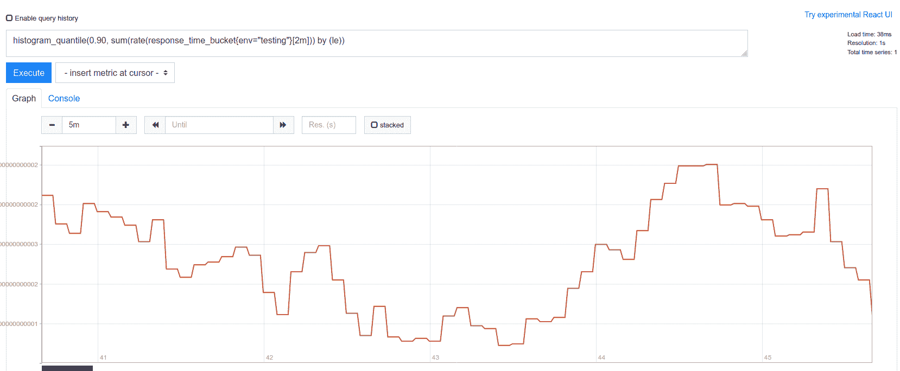
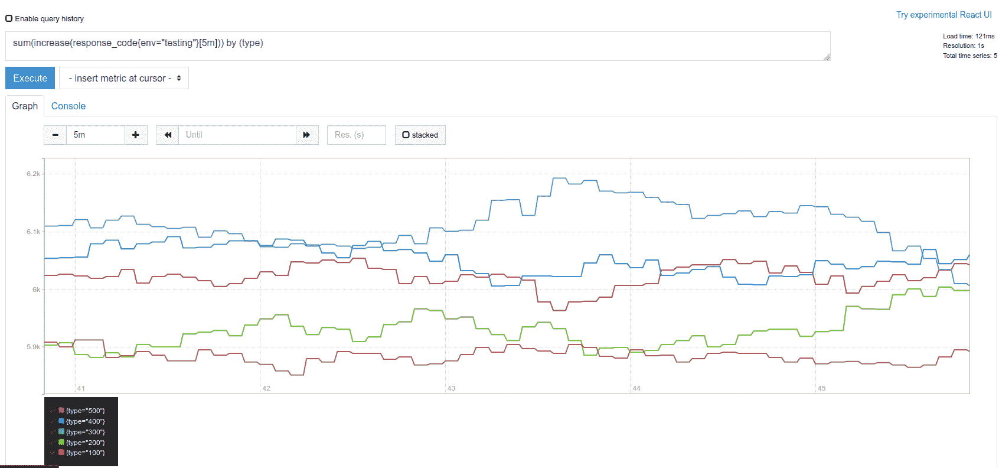

# 在 Rust web 服务中使用普罗米修斯度量标准

> 原文：<https://blog.logrocket.com/using-prometheus-metrics-in-a-rust-web-service/>

Prometheus 是一个开源工具，用于收集、分析时间序列数据并发出警报。它在 DevOps 社区中得到广泛使用和高度评价。

在本教程中，我们将在 Rust 中构建一个 [warp](https://github.com/seanmonstar/warp) web 服务，它使用 [Prometheus](https://prometheus.io/) 收集一些有趣的指标。

我们将向您展示如何向 Rust web 服务添加这种指标收集功能，然后如何将这些指标放入 Prometheus。

## 设置

接下来，您需要的只是一个相当新的 Rust 安装(1.39+)和一个启动本地 Prometheus 实例的方法——例如，用 [Docker](https://www.docker.com/) 。

首先，创建一个新的 Rust 项目:

```
cargo new rust-web-prometheus-example
cd rust-web-prometheus-example

```

接下来，编辑`Cargo.toml`文件并添加您需要的依赖项。

```
[dependencies]
tokio = { version = "0.2", features = ["macros", "rt-threaded", "time"] }
warp = "0.2"
prometheus = { version = "0.9", features = ["process"] }
lazy_static = "1.4"
futures = { version = "0.3", default-features = false }
rand = "0.7"

```

除了我们将用来记录指标的`prometheus`箱，我们还有`warp` web 框架、`tokio`异步运行时和用于生成一些随机指标数据的`rand`。

因为我们也要在这里用`warp`实现一个小的`websockets`服务器，我们也需要`futures`机箱。`lazy_static`箱将用于初始化指标收集器，并使其全球可用。

## 指标定义

从 web 服务收集指标的第一步是定义它们。

```
use prometheus::{
    HistogramOpts, HistogramVec, IntCounter, IntCounterVec, IntGauge, Opts, Registry,
};

lazy_static! {
    pub static ref REGISTRY: Registry = Registry::new();

    pub static ref INCOMING_REQUESTS: IntCounter =
        IntCounter::new("incoming_requests", "Incoming Requests").expect("metric can be created");

    pub static ref CONNECTED_CLIENTS: IntGauge =
        IntGauge::new("connected_clients", "Connected Clients").expect("metric can be created");

    pub static ref RESPONSE_CODE_COLLECTOR: IntCounterVec = IntCounterVec::new(
        Opts::new("response_code", "Response Codes"),
        &["env", "statuscode", "type"]
    )
    .expect("metric can be created");

    pub static ref RESPONSE_TIME_COLLECTOR: HistogramVec = HistogramVec::new(
        HistogramOpts::new("response_time", "Response Times"),
        &["env"]
    )
    .expect("metric can be created");
}

```

我们在这里定义的第一件事是`REGISTRY`，这是一个`prometheus`注册表，用于记录程序运行过程中的度量。可以有多个注册表，但我们只需要一个。

接下来，明确你要收藏的东西。

*   `INCOMING_REQUESTS` —统计对`/some`路由的传入请求
*   `CONNECTED_CLIENTS` —统计当前通过 websockets 连接的客户端
*   `RESPONSE_CODE_COLLECTOR` —统计一系列随机生成的请求的不同响应代码
*   `RESPONSE_TIME_COLLECTOR` —收集一系列随机生成的请求的响应时间

这些指标最重要的方面是它们的数据类型。`INCOMING_REQUESTS`度量是一个简单的`IntCounter`，这意味着它只能以整数形式递增。

另一方面，用于`CONNECTED_CLIENTS`的`IntGauge`可以递增和递减，这在客户端断开连接的情况下是必要的。

`IntCounterVec`捆绑了一组`Counters`，即使它们属于相同的指标，也可以给它们贴上不同的标签。我们将用它来区分不同的响应类型(例如，400 个客户端错误与 500 个服务器错误)。

最后，`HistogramVec`捆绑了一组直方图。这可以用来计算同一事物在不同维度上的划分。我们在这里使用的一个流行的例子是响应时间百分比——例如，如果我们想知道系统的第 90 个百分比的响应时间。

定义好指标后，下一步是用`REGISTRY`注册它们。

```
fn register_custom_metrics() {
    REGISTRY
        .register(Box::new(INCOMING_REQUESTS.clone()))
        .expect("collector can be registered");

    REGISTRY
        .register(Box::new(CONNECTED_CLIENTS.clone()))
        .expect("collector can be registered");

    REGISTRY
        .register(Box::new(RESPONSE_CODE_COLLECTOR.clone()))
        .expect("collector can be registered");

    REGISTRY
        .register(Box::new(RESPONSE_TIME_COLLECTOR.clone()))
        .expect("collector can be registered");
}

```

您可能已经注意到了，我们在这里并不关心错误处理。如果我们的指标收集设置失败，我们甚至不希望服务启动，所以如果它死机也没关系。

在这个注册函数中，我们简单地调用`REGISTRY`的`register`方法和我们度量的装箱版本。

这种设置使我们能够从应用程序中的任何地方收集指标，但仍然在`REGISTRY`中收集所有信息，我们稍后将使用它在端点上发布收集的指标，以便 Prometheus 可以从服务中收集它们。

## 跟踪指标

让我们开始收集一些指标。

* * *

### 更多来自 LogRocket 的精彩文章:

* * *

首先我们需要实现`warp` web 服务。

定义`main`:

```
#[tokio::main]
async fn main() {
    register_custom_metrics();

    let metrics_route = warp::path!("metrics").and_then(metrics_handler);
    let some_route = warp::path!("some").and_then(some_handler);
    let ws_route = warp::path("ws")
        .and(warp::ws())
        .and(warp::path::param())
        .and_then(ws_handler);

    tokio::task::spawn(data_collector());

    println!("Started on port 8080");
    warp::serve(metrics_route.or(some_route).or(ws_route))
        .run(([0, 0, 0, 0], 8080))
        .await;
}

```

调用 metrics registration helper 后，定义三个路由，生成一个在后台运行的`data_collector`函数，并启动 web 服务器。

`data_collector`将模拟这个服务从另一个服务收集请求数据。例如，在实践中，这可能是一个用于收集日志的 ElasticSearch 实例。在任何情况下，我们都将在这个例程中以一定的间隔创建随机响应数据。

定义`some_handler`来看看如何跟踪一个非常简单的`Counter`指标。

```
async fn some_handler() -> Result<impl Reply, Rejection> {
    INCOMING_REQUESTS.inc();
    Ok("hello!")
}

```

如你所见，这很简单。因为我们可以在任何地方访问度量，所以我们可以简单地从端点调用`inc()`，这将增加计数器。`prometheus`机箱在内部处理所有并发问题，所以这样做是安全的。

接下来说下一个:`CONNECTED_CLIENTS`。这有点复杂，因为我们想要计算当前连接的 websocket 客户端。

```
async fn ws_handler(ws: warp::ws::Ws, id: String) -> Result<impl Reply, Rejection> {
    Ok(ws.on_upgrade(move |socket| client_connection(socket, id)))
}

async fn client_connection(ws: WebSocket, id: String) {
    let (_client_ws_sender, mut client_ws_rcv) = ws.split();

    CONNECTED_CLIENTS.inc();
    println!("{} connected", id);

    while let Some(result) = client_ws_rcv.next().await {
        match result {
            Ok(msg) => println!("received message: {:?}", msg),
            Err(e) => {
                eprintln!("error receiving ws message for id: {}): {}", id.clone(), e);
                break;
            }
        };
    }

    println!("{} disconnected", id);
    CONNECTED_CLIENTS.dec();
}

```

上面的代码片段本质上是来自`warp`文档的最小 websocket 实现，其中传入的连接被升级为 WebSocket。正如您在`client_connection`函数中看到的，一旦客户端成功连接，我们就会增加`CONNECTED_CLIENTS`量规。

现在我们可以开始等待来自客户端的消息。如果那里出现任何问题或者客户端只是断开连接，WebSocket 连接和通道就会被丢弃，从而关闭连接。在断开连接时，调用`.dec()`来递减计数器。

到目前为止，一切顺利。接下来，我们来看看`data_collector`例程。

```
const ENVS: &'static [&'static str] = &["testing", "production"];
async fn data_collector() {
    let mut collect_interval = tokio::time::interval(Duration::from_millis(10));
    loop {
        collect_interval.tick().await;
        let mut rng = thread_rng();
        let response_time: f64 = rng.gen_range(0.001, 10.0);
        let response_code: usize = rng.gen_range(100, 599);
        let env_index: usize = rng.gen_range(0, 2);

        track_status_code(response_code, ENVS.get(env_index).expect("exists"));
        track_request_time(response_time, ENVS.get(env_index).expect("exists"))
    }
}

```

我们启动一个异步定时器，它每 10 毫秒触发一次，产生新的数据。下一步是生成一些随机的`response_times`和`response codes`，并确定一个随机的`env`，你可以把它想象成一个集群环境——例如，如果你从一个`testing`和`production`集群中收集数据。

使用两个助手来跟踪这些生成的值。

```
fn track_request_time(response_time: f64, env: &str) {
    RESPONSE_TIME_COLLECTOR
        .with_label_values(&[env])
        .observe(response_time);
}

fn track_status_code(status_code: usize, env: &str) {
    match status_code {
        500..=599 => RESPONSE_CODE_COLLECTOR
            .with_label_values(&[env, &status_code.to_string(), "500"])
            .inc(),
        400..=499 => RESPONSE_CODE_COLLECTOR
            .with_label_values(&[env, &status_code.to_string(), "400"])
            .inc(),
        300..=399 => RESPONSE_CODE_COLLECTOR
            .with_label_values(&[env, &status_code.to_string(), "300"])
            .inc(),
        200..=299 => RESPONSE_CODE_COLLECTOR
            .with_label_values(&[env, &status_code.to_string(), "200"])
            .inc(),
        100..=199 => RESPONSE_CODE_COLLECTOR
            .with_label_values(&[env, &status_code.to_string(), "100"])
            .inc(),
        _ => (),
    };
}

```

`track_request_time`助手简单地用响应时间调用`.observe()`，用它被跟踪的环境来标记这个度量。这在内部生成了我们以后可以使用的直方图。

对于状态代码，我们匹配响应代码，并根据我们得到的 HTTP 响应的类型，用不同的类型标记它。验证`.with_label_values`中使用的标签数量与我们在选项中创建指标时定义的标签数量相匹配非常重要。

最后，但同样重要的是，我们需要实现`metrics_handler`,这样 Prometheus 就可以收集我们的指标。

```
async fn metrics_handler() -> Result<impl Reply, Rejection> {
    use prometheus::Encoder;
    let encoder = prometheus::TextEncoder::new();

    let mut buffer = Vec::new();
    if let Err(e) = encoder.encode(&REGISTRY.gather(), &mut buffer) {
        eprintln!("could not encode custom metrics: {}", e);
    };
    let mut res = match String::from_utf8(buffer.clone()) {
        Ok(v) => v,
        Err(e) => {
            eprintln!("custom metrics could not be from_utf8'd: {}", e);
            String::default()
        }
    };
    buffer.clear();

    let mut buffer = Vec::new();
    if let Err(e) = encoder.encode(&prometheus::gather(), &mut buffer) {
        eprintln!("could not encode prometheus metrics: {}", e);
    };
    let res_custom = match String::from_utf8(buffer.clone()) {
        Ok(v) => v,
        Err(e) => {
            eprintln!("prometheus metrics could not be from_utf8'd: {}", e);
            String::default()
        }
    };
    buffer.clear();

    res.push_str(&res_custom);
    Ok(res)
}

```

我们在这里做同样的事情两次。这是因为我们想要从`REGISTRY`收集定制指标，以及使用`prometheus::gather`从机箱的`DEFAULT_REGISTRY`收集系统指标。这将使我们深入了解内存和 CPU 消耗，正在运行的 Rust 进程的打开文件描述符等。

这两种情况下的方法是一样的。创建一个新的缓冲区，将指标编码到该缓冲区中，对其进行字符串化，并将该字符串返回给调用者——在大多数情况下，调用者将是向服务请求数据的 Prometheus 实例。

现在让我们看看这些是否真的有效，并使用 Prometheus 来处理这些收集到的指标。

## 用普罗米修斯测试

要在本地启动一个 Prometheus 实例，在项目中添加`prom`文件夹，并在该文件夹中添加下面的`Dockerfile`和`prometheus.yml`。

```
FROM prom/prometheus:v2.16.0
ADD prometheus.yml /etc/prometheus/prometheus.yml

global:
  scrape_interval:     5s
  evaluation_interval: 5s

scrape_configs:
  - job_name: 'prometheus'
    static_configs:
      - targets: ['localhost:9090']

  - job_name: 'service-collector'
    static_configs:
      - targets: ['localhost:8080']

```

Dockerfile 文件简单地获取 prometheus 并添加配置。配置本身非常简单；它只是用 web 应用程序的主机和端口定义了一个`service-collector`。该实例将每五秒钟轮询一次服务的`/metrics`端点上的新数据。

现在让我们构建一个可运行的容器。

```
cd prom
docker build -t prometheus .

```

要运行它:

```
docker run -p 9090:9090 --network=host prometheus

```

导航到`[http://localhost:9090/graph](http://localhost:9090/graph)`应该会将您带到本地运行的 Prometheus 实例。

现在，使用`cargo run`启动 Rust web 服务。

如果您在查询字段中输入一些内容，比如`incoming_requests`，您将会看到下面的结果。

在等待几秒钟让服务生成一些随机数据之后，您可以尝试一些更高级的查询。例如，要查看响应时间的第 90 个百分位数:

```
histogram_quantile(0.90, sum(rate(response_time_bucket{env="testing"}[2m])) by (le))

```

该查询可能会产生如下结果。



您还可以查询与状态代码相关的内容，例如，按响应类型列出的随时间增长的总和。

```
sum(increase(response_code{env="testing"}[5m])) by (type)

```

上面的结果可能是这样的:



太棒了——它起作用了！当然，在具有真实数据的真实应用程序中，这些图表看起来会有很大不同。但是有了随机的测试数据，我们至少能够确保我们的设置是可行的。

您还可以使用 cURL 之类的工具来检查原始指标。

```
curl http://localhost:8080/metrics

```

你可以在 [GitHub](https://github.com/zupzup/rust-web-prometheus-example) 上找到这个例子的完整代码。

## 结论

Prometheus 是一个强大的工具，已经理所当然地成为收集指标的行业标准。

在本指南中，我们介绍了如何在 Rust web 服务中收集系统和自定义 Prometheus 指标。板条箱运行良好，有一个简单明了的 API，特别是如果你以前曾用另一种语言使用过 Prometheus。

这些指标对于分析、触发警报或者你能想到的任何事情都非常有用。天空是极限。

## [log rocket](https://lp.logrocket.com/blg/rust-signup):Rust 应用的 web 前端的全面可见性

调试 Rust 应用程序可能很困难，尤其是当用户遇到难以重现的问题时。如果您对监控和跟踪 Rust 应用程序的性能、自动显示错误、跟踪缓慢的网络请求和加载时间感兴趣，

[try LogRocket](https://lp.logrocket.com/blg/rust-signup)

.

[](https://lp.logrocket.com/blg/rust-signup)

LogRocket 就像是网络和移动应用程序的 DVR，记录你的 Rust 应用程序上发生的一切。您可以汇总并报告问题发生时应用程序的状态，而不是猜测问题发生的原因。LogRocket 还可以监控应用的性能，报告客户端 CPU 负载、客户端内存使用等指标。

现代化调试 Rust 应用的方式— [开始免费监控](https://lp.logrocket.com/blg/rust-signup)。