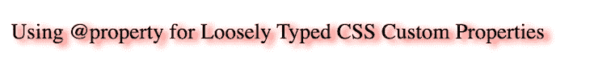
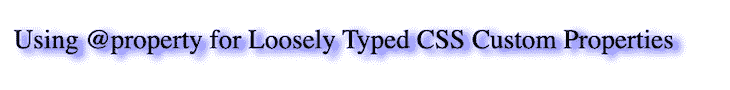
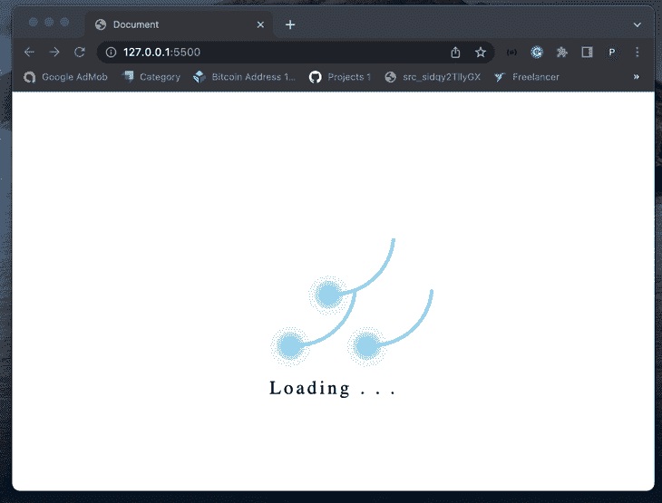
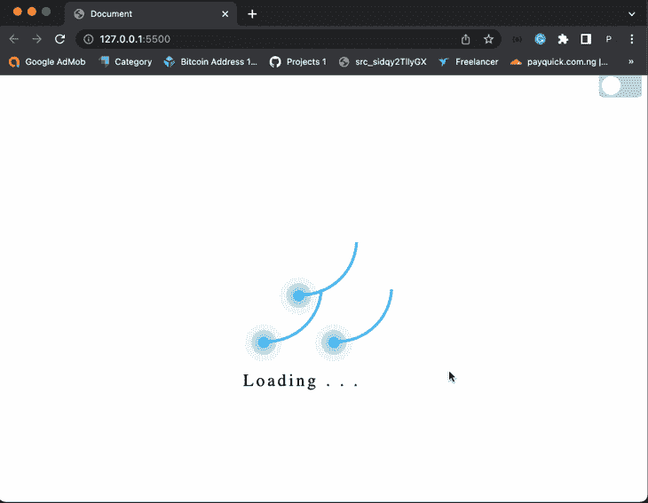
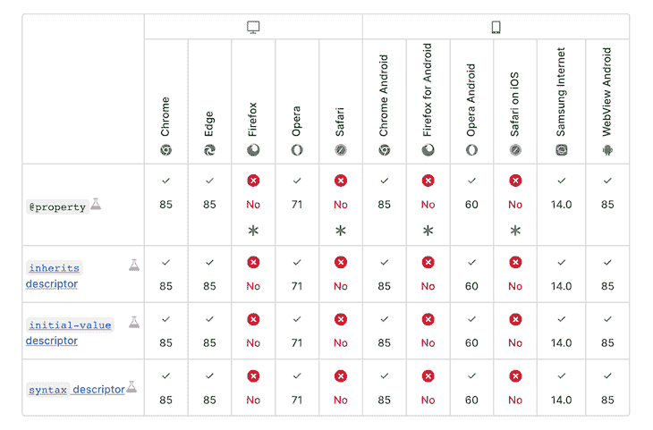

# 对松散类型的 CSS 自定义属性使用@property

> 原文：<https://blog.logrocket.com/using-property-loosely-typed-css-custom-properties/>

CSS 变量允许开发人员创建可重用的 CSS 属性。在引入 CSS 变量之前，我们无法设置默认的变量类型；在某些情况下，这个小缺陷可能会破坏整个应用程序。然而，CSS `@propery`特别解决了这个缺陷。

在本教程中，我们将探索使用[CSS`@property`功能](https://developer.mozilla.org/en-US/docs/Web/CSS/@property)设置 CSS 变量配置。我们将检查自定义 CSS 属性的优缺点，了解`@propery`如何工作，并回顾它的不同用例。重要的是要记住，`@propery`在撰写本文时仍处于试验阶段，所以你应该在开始之前检查一下你的[浏览器的兼容性](https://developer.mozilla.org/en-US/docs/Web/CSS/@property#browser_compatibility)。

*向前跳转*

## CSS 自定义属性

让我们考虑下面的 CSS 变量用例；我们声明一个变量`foo`，并给它赋值`10px`，如下所示:

```
--foo: 10px;

```

我们可以使用`foo`变量来设置元素的宽度，如下所示:

```
.element {
   width: var(--foo);
} 

```

假设我们错误地在另一个元素中误用了`--foo`变量，如下面的代码所示:

```
.another-element {
    --foo:red;
    Text-shadow: var(--foo) 2px 5px red;
}

```

因为`--foo`变量被赋予了与其类型不同的值，所以`Text-shadow`属性将被破坏。虽然您可以很快调试这种类型的错误，但是使用新的`@property`声明，我们可以通过为 CSS 变量设置一个[默认类型](https://developer.mozilla.org/en-US/docs/Web/CSS/CSS_Types)来完全避免这种错误，包括颜色、长度、百分比等。

## `@property`如何工作

使用`@property`，我们可以通过简单地设置[变量类型](https://developer.mozilla.org/en-US/docs/Web/CSS/CSS_Types)、初始值和`inherits`属性来避免前面例子中的错误。我们可以如下声明`@property`变量:

```
@property --x {
 syntax: '<color>';
 initial-value:blue;
 inherits: false;
}

```

在上面的代码片段中，我们使用`@property`来声明和配置`syntax`、`initial-value`和`inherits`变量的值。`syntax`指定我们可以分配给 CSS 变量的值的类型，而`@property`语法包括 CSS 类型，如长度、颜色、百分比等。

当声明`@property`变量时，需要`initial value`。如果分配给变量的值与其类型不同，`@property`将返回`initial value`。最后， [`inherits`是布尔值](https://blog.logrocket.com/css-inheritance-inherit-initial-unset-and-revert/)；将其设置为`true`意味着该变量是从 DOM 树继承的。

在我们为`@property`创建了`--x`变量之后，我们可以为`--x`变量赋值`red`，然后将它添加到`element`属性，如下所示:

```
 .element {
     --x: red;
     text-shadow: 4px 2px 5px var(--x);
   }

```

以下是输出:



假设在上面的例子中，我们错误地将`20px`赋给了`--x`变量。输出如下所示:



## 动画与`@property`

我们可以使用`@property`变量给网站添加动画。例如，让我们使用`@property`创建一个简单的页面加载器动画。

我们将从 HTML 代码开始。创建一个`index.html`文件，并添加以下 HTML 代码:

```
<!DOCTYPE html>
<html lang="en">
 <head>
   <meta charset="UTF-8" />
   <meta http-equiv="X-UA-Compatible" content="IE=edge" />
   <meta name="viewport" content="width=device-width, initial-scale=1.0" />
   <link rel="stylesheet" href="style.css" />
   <title>Document</title>
 </head>
 <body>
   <div class="body">
     <div class="container">
       <div class="ring"></div>
       <div class="ring"></div>
       <div class="ring"></div>
       <p>Loading . . .</p>
     </div>
   </div>
 </body>
</html>

```

在上面的代码中，我们用一个`container`类创建了一个`div`。在`div`中，我们用类`ring`定义了另外三个孩子`div`，它们将作为我们的加载环。

现在，创建一个`style.css`文件并添加以下代码:

```
@property --main_color {
 syntax: "<color>";
 initial-value: #53b8f3;
 inherits: false;
}
@property --main_color2 {
 syntax: "<color>";
 initial-value: white;
 inherits: false;
}
@property --main_length {
 syntax: "<length>";
 initial-value: 150px;
 inherits: false;
}
@property --angle {
 syntax: "<angle>";
 initial-value: 0deg;
 inherits: false;
}
@property --percentage {
 syntax: "<length-percentage>";
 initial-value: 100%;
 inherits: false;
}
body {
 --main_color: white;
 background: var(--main_color);
}
.body {
 display: flex;
 justify-content: center;
 align-items: center;
 min-height: 100vh;
}
.container {
 position: relative;
 width: var(--percentage);
 display: flex;
 justify-content: center;
 align-items: center;
}
.container .ring {
 position: relative;
 width: var(--main_length);
 height: var(--main_length);
 margin: -30px;
 --percentage: 50%;
 border-radius: var(--percentage);
 border: 4px solid transparent;
 border-top: 4px solid var(--main_color);
 animation: animate 4s linear infinite;
}

@keyframes animate {
 0% {
   transform: rotate(var(--angle));
 }
 100% {
   --angle: 360deg;
   transform: rotate(var(--angle));
 }
}

.container .ring::before {
 --main_lenght: 15px;
 --main_color2: #24ecff33;
 content: "";
 position: absolute;
 top: 12px;
 right: 12px;
 --percentage: 50%;
 border-radius: var(--percentage);
 width: var(--main_lenght);
 height: var(--main_lenght);
 background: var(--main_color);
 box-shadow: 0 0 0 5px var(--main_color2), 0 0 0 10px var(--main_color2),
   0 0 0 20px #24ecff11, 0 0 20px var(--main_color), 0 0 20px var(--main_color);
}

.container .ring:nth-child(1) {
 position: absolute;
 top: -66.665%;
}
.container p {
 --main_lenght: -120px;
 position: absolute;
 --main_color2:black;
 color: var(--main_color2);
 font-size: 1.5em;
 font-family: consolas;
 bottom: var(--main_lenght);
 letter-spacing: 0.15em;
}

```

在上面的代码中，我们定义了四个属性，用两个颜色属性`main-color`和`main-color2`表示，分别表示加载程序的颜色和网页的背景。

我们还引入了一个额外的属性角来反映环的旋转程度。使用之前指定的值，我们添加了一些新的 CSS 用于页面对齐，并创建了负责加载器动画的实际关键帧。

下面是结果:



## 用 JavaScript 操作`@property` CSS 变量

在 JavaScript 中，我们可以使用`registerProperty`方法声明`@property` CSS 变量，方法是将变量的名称、语法、`initialValue`和`inherits`属性作为对象传递:

```
window.CSS.registerProperty({
  name: '--foo',
  syntax: '<color>',
  initialValue: '#c0ffee',
  inherits: true,
});

```

## 使用 JavaScript 设置`@property` CSS 变量

在 JavaScript 中，我们可以使用`setProperty`方法更新`@property` CSS 变量的值。如果一个 CSS 变量的`inherits`属性是`true`，我们可以如下修改它的初始值:

```
document.documentElement.style.setProperty("--foo", "pink");

```

我们还可以在不改变变量初始值的情况下更新`element`属性中 CSS 变量的值:

```
document.querySelector(".element").style.setProperty("--foo", "red");

```

## 使用 JavaScript 获取`@property` CSS 变量的值

我们可以使用`getPropertyValue`方法在 JavaScript 中检索`@property`变量的值，如下所示:

```
document.querySelector(".element").style.getPropertyValue("--foo"))

```

## 带`@property`变量的主题切换器

让我们看另一个使用`@property`变量的例子；我们将添加一个主题切换器在亮暗模式 到我们之前的动画加载器项目中。当用户切换按钮时，动画 加载器主题会改变。让我们从给 `index.html` 文件添加主题切换器开始，如下图:

```
<!-- ... -->
<body>
<header>
<div class="toggle-button-container">
<label class="toggle-button-label" for="checkbox">
<input
type="checkbox"
class="toggle-button"
id="checkbox"
onchange="toggleTheme()"
/>
<div class="toggle-rounded"></div>
</label>
</div>
</header>
<!-- ... -->
```

接下来，我们将下面的 CSS 样式添加到 `style.css` 文件中:

```
/* ... */
.toggle-button-container {
 align-items: center;
 margin-top: 5px;
 width: 100%;
}

.toggle-button-label {
 display: inline-block;
 height: 34px;
 position: relative;
 width: 60px;
 float: right;
}

.toggle-rounded {
 --main_color: #ccc;
 background: var(--main_color);
 bottom: 0;
 cursor: pointer;
 left: 0;
 position: absolute;
 right: 0;
 top: 0;
 transition: 0.4s;
 border-radius: 15%;
}
.toggle-rounded:before {
 --main_color: #fff;
 background: var(--main_color);
 bottom: 4px;
 content: "";
 height: 26px;
 left: 4px;
 position: absolute;
 transition: 0.4s;
 width: 26px;
 border-radius: 100%;
}
input:checked + .toggle-rounded {
 --main_color: #9cafeb;
 background: var(--main_color);
}
input:checked + .toggle-rounded:before {
 transform: translateX(26px);
}

```

在上面的代码片段中，我们使用了`@property`变量来设计主题切换按钮的样式。现在，当切换主题切换器按钮时，按钮的颜色会改变。接下来，我们将创建一个`themes.js`文件并粘贴以下 JavaScript 代码:

```
const toggleButton = document.querySelector(".toggle-button");
toggleButton.addEventListener("change", toggleTheme, false);
const theme = {
 dark: {
   "--main_color": "black",
   "--main_color2": "white",
 },
 light: {
   "--main_color": "white",
   "--main_color2": "black",
 },
};

function toggleTheme(e) {
 if (e.target.checked) {
   useTheme("dark");
   localSto,rage.setItem("theme", "dark");
 } else {
   useTheme("light");
   localStorage.setItem("theme", "light");
 }
}
function useTheme(themeChoice) {
 document
   .querySelector("body")
   .style.setProperty("--main_color", theme\[themeChoice\]["--main_color"]);
 document
   .querySelector("p")
   .style.setProperty("--main_color2", theme\[themeChoice\]["--main_color2"]);
}

const preferredTheme = localStorage.getItem("theme");
if (preferredTheme === "dark") {
 useTheme("dark");
 toggleButton.checked = true;
} else {
 useTheme("light");
 toggleButton.checked = false;
}

```

从上面的代码来看，每当按钮被切换时，就会调用`toggleTheme()`函数。然后，`useTheme`函数通过将所选主题作为参数传入来更新所选主题的颜色。

最后，将`themes.js`文件添加到`index.html`中。输出应该如下图所示:



## 浏览器兼容性

虽然`@property`是一个独特的 CSS 类型的变量特性，但是`@property`只有在与用户的浏览器兼容时才有用。这个 CSS 特性仍然是试验性的，还没有被一些浏览器支持。在撰写本文时，请查看下表了解`@property`浏览器的兼容性:



## 结论

CSS 变量有助于简化我们构建动态网站和复杂动画的方式，同时还能防止 CSS 属性的破坏。像 TypeScript 一样，`@property`旨在确保将有效值分配给 CSS 变量。

在本教程中，我们通过构建一个简单的页面加载器动画和主题切换器，学习了如何像专业人士一样使用`@property` CSS 变量。我们还探索了`@property`如何在 JavaScript 代码中工作。

## 你的前端是否占用了用户的 CPU？

随着 web 前端变得越来越复杂，资源贪婪的特性对浏览器的要求越来越高。如果您对监控和跟踪生产环境中所有用户的客户端 CPU 使用、内存使用等感兴趣，

[try LogRocket](https://lp.logrocket.com/blg/css-signup)

.

[](https://lp.logrocket.com/blg/css-signup)[https://logrocket.com/signup/](https://lp.logrocket.com/blg/css-signup)

LogRocket 就像是网络和移动应用的 DVR，记录你的网络应用或网站上发生的一切。您可以汇总和报告关键的前端性能指标，重放用户会话和应用程序状态，记录网络请求，并自动显示所有错误，而不是猜测问题发生的原因。

现代化您调试 web 和移动应用的方式— [开始免费监控](https://lp.logrocket.com/blg/css-signup)。