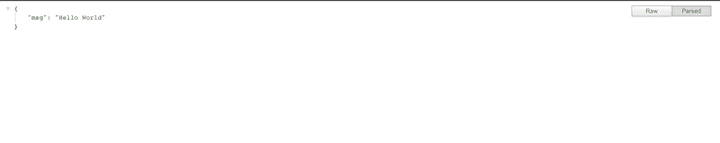
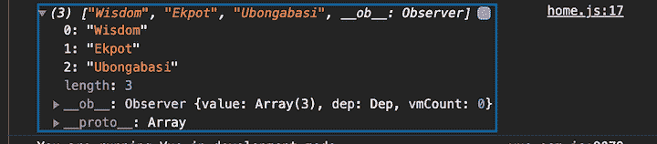

# Pug.js 教程:带示例的初学者指南

> 原文：<https://blog.logrocket.com/using-pug-js-with-vue-js/>

在这个 Pug.js 教程中，我们将向您展示如何使用 Pug 作为模板引擎将 Vue.js 集成到后端应用程序中。

关于 Pug.js 的介绍，请查看“[开始使用 Pug](https://blog.logrocket.com/getting-started-with-pug/) ”

## Pug.js 是什么？

[Pug.js](https://pugjs.org/api/getting-started.html) ，原名 Jade，是 Node.js 等服务器端技术中用于渲染 HTML 的模板引擎，与任何 JavaScript 模板引擎一样，Pug.js 支持编写可重用的 HTML 代码和渲染动态数据。

Vue.js 是一个用于 JavaScript 的渐进式框架，用于构建 web 界面和单页应用程序。不仅仅是网络界面，Vue.js 还被用于桌面和移动应用开发，使用[电子](https://github.com/SimulatedGREG/electron-vue)框架。

## 为什么要用 Pug 搭配 Vue.js？

大多数后端开发人员选择将 Pug 与 Vue.js 一起使用，因为它更容易实现和阅读，并且不需要大量的配置。任何有效的 HTML 也是有效的 Vue.js 模板。使用 Pug.js 作为 Vue.js 模板的预处理器，可以更容易地迁移现有项目，以利用 Vue 的反应特性。

Pug.js 经常与后端技术一起使用，如 [Express](https://pugjs.org/api/express.html) [。](https://pugjs.org/api/express.html) [js](https://pugjs.org/api/express.html) 用于模板化，因为它向下编译为 HTML。与后端开发人员不同，大多数前端开发人员发现编写和维护 Pug 令人沮丧，因为它对空白敏感，这意味着它使用缩进来确定哪些标签嵌套在彼此内部。

要跟随本教程，您应该了解 JavaScript 和 Vue.js，并有使用文本编辑器的经验，例如 [VS Code](https://code.visualstudio.com/) 。

## 设置 Node.js 项目

在设置 nodejs 项目时，我们需要初始化一个`package.json`文件，以便使用`npm init -y`命令跟踪我们的应用程序依赖关系。

接下来，我们将创建一个`index.js`文件，这将是我们的根 Node.js 文件。我们将使用 Express.js 作为我们的服务器，所以我们需要安装 Express，将其导入到我们的根`index.js`文件中，并创建它的一个实例。我们将使用该实例监听运行在`3000`上的一个端口。

### 在 Node.js 应用程序中安装 Express.js

要安装 Express.js，打开你的终端，输入`npm i express` `--``save`。

```
let express = require('express');
let app = express();

app.get('/', (req, res) => res.json({msg:"Hello World"}))

app.listen(3000, () => console.log('Test running'))

```

要运行该应用程序，请打开您的终端并键入`node index.js`。这个命令会在终端上显示`Test running`，表示服务器正在运行。现在，我们可以在浏览器中访问`[http://localhost:3000/](http://localhost:3000/)`上的应用程序:



### 设置 Pug.js

要将 Pug 设置为您的模板引擎，首先通过运行`npm install pug`安装它。

安装 Pug 后，我们需要将它设置为默认的 Express 模板引擎，并指向一个目录，在那里我们所有的模板都将被定义。我们可以将我们的`index.js`文件修改为:

```
let express = require('express');
let pug = require("pug")
let path = require('path')
let app = express();

app.set(path.join(__dirname, './views'))
app.set('view engine', 'pug')

app.get('/', (req, res) => res.render('home'))

app.listen(3000, () => console.log('Test running'))

```

注意，我们需要 Node.js `path`模块，它提供了处理文件和目录路径的工具。

让我们创建一个`views`目录，在这里我们将定义所有的 Pug 模板。我们将使用`path`模块来定位`views`目录，并将其设置为所有模板的根目录。

接下来，在`views`目录中创建一个`home.pug`文件，并添加如下内容:

```
.container
    h1 Hello World

```

我们的应用程序现在将在浏览器中呈现`Hello World`，因为我们改变了呈现`home.pug`模板的路径。注意 Pug 是如何使用缩进来找出哪些标签相互嵌套的。

## 使用 Pug 和 Vue.js

为了在我们的 Pug 模板中设置 Vue.js，我们需要安装并设置 [webpack](https://webpack.js.org/) 。

webpack 基本上是一个模块捆绑器。它的主要目的是捆绑 JavaScript 文件，以便在浏览器中使用。

要安装 webpack 及其 CLI，请打开终端并键入以下内容:

```
npm i -D webpack webpack-cli

```

安装 webpack 后，我们需要安装一些其他的包来帮助 bootstrap Vue.js:

*   `vue-loader`，一个 webpack 的加载器，允许你将 Vue.js 组件设置为一个单文件组件
*   `vue-loader-plugin`，帮助解决 Webpack5 配置的兼容性问题。
*   `vue-template-compiler`，用于将 Vue.js 2.0 模板预编译成渲染函数，以避免运行时编译开销和 CSP 限制。
*   `css-loader`，它像`import/require()`一样解释和解析`@import`和`url()`

要安装这些软件包，请打开您的终端并键入以下内容:

```
npm i -D vue-loader vue-loader-plugin vue-template-compiler css-loader

```

标志会将这些包作为开发依赖项安装。

接下来我们要安装 [`babel`](https://blog.logrocket.com/whats-coming-in-babel-8/) ，这是一个工具链，主要用于将 ECMAScript 2015+代码转换成当前和旧版本浏览器和环境下的向后兼容版本的 JavaScript。安装了这个之后，我们就可以在 JavaScript 文件中使用像`import`和`export`这样的东西了。

我们将通过在我们的终端上运行`npm i babel-watch`来使用 npm 安装`babel-watch`，然后安装`babel-core`和`babel-loader`作为开发依赖项:

```
npm i -D babel-core babel-loader

```

让我们创建一个`client`目录，在这里我们将编写我们的 Vuejs 代码。在目录中，创建一个`home.js`文件并添加以下内容:

```
import Vue from "vue";
let app = new Vue({
    el: '#home',
    data: {
        names: ['Wisdom', "Ekpot", "Ubongabasi"]
    },
    methods: {
        logSomeThing() {
            return 'Hello Wisdom Ekpot'
        }
    },
    mounted() {
        console.log(this.logSomeThing());
    }
})

```

如果你熟悉 Vue.js，你应该认识到这是一个简单的 Vuejs 设置。这里，根元素的目标是一个 div，其`id`为`home`。一旦安装了模板，就会调用`logSomething`方法，该方法在`methods`对象中定义。

为了将它包含在我们的 Pug 文件中，我们必须添加一些 webpack 配置。让我们创建一个`webpack.config.js`文件，导入 webpack，并为 Vue.js 编写一些配置。

我们将从导入 webpack、`path`和`VueLoaderPlugin`开始:

```
const webpack = require('webpack');
const path = require('path');
const VueLoaderPlugin = require('vue-loader/lib/plugin');

```

我们的 webpack 配置将被包装在一个`config`对象中。我们首先将`mode`设置为`development`，并定义我们的入口文件。

在设置了入口文件之后，我们需要设置一个输出，所有转换后的代码都将存储在这个输出中。属性告诉 webpack 在哪里发出它创建的包，以及如何命名这些文件。基本上，webpack 将我们的 Vue.js 代码转换成普通的 JavaScript。

```
const config = {
    mode: 'development',
    entry: {
        'home': './client/home.js',
    },
    output: {
        path: path.resolve(__dirname, 'public/js'),
        filename: '[name].bundle.js'
    },
}

```

我们将创建一个`public`目录来存储我们编译的代码。我们还需要提出一些 webpack 规则，以便在规则匹配时使用。仅当父规则条件匹配时，才会评估这些规则。每个嵌套规则都可以包含自己的条件。

```
 module: {
        rules: [
            {
                test: /\.vue$/,
                loader: 'vue-loader'
            },
            {
                test: /\.js$/,
                use: 'babel-loader',
                exclude: /node_modules/
            },
            {
                test: /\.css$/,
                use: [
                    'vue-style-loader',
                    'css-loader'
                ]
            }
        ]
    },

```

基本上，webpack 检查是否有任何`.vue`文件扩展名，并使用`vue-loader`插件将其捆绑到 JavaScript。

我们还需要定义一个`resolve`对象来配置如何解析模块:

```
 resolve: {
        alias: {
            'vue$': 'vue/dist/vue.esm.js'
        },
        extensions: [
            '.js',
            '.vue'
        ]
    },

```

接下来，我们需要定义一个新的`VueLoaderPlugin`实例来帮助处理[web pack](https://webpack.js.org/blog/2020-10-10-webpack-5-release/)5 的一些配置:

```
 plugins: [
        new VueLoaderPlugin(),
    ],

```

这样做之后，我们必须导出我们的`config`对象:

```
module.exports = config;

```

为了引导这个 webpack 配置，我们需要在我们的`package.json`文件中添加一些脚本来引导它:

```
 "watch": "babel-watch  --watch -- index",
    "dev": "npm run watch & npm run client:build-dev ",
    "client:build-dev": "webpack --watch"

```

`client:build-dev`命令将启动 Bootstrap 并观察我们的文件是否有任何变化。要启动应用程序，请在您的终端上运行`npm run dev`。

现在我们可以将我们的`home.pug`文件修改为:

```
.container#home
    h1 Hello World
script(src="/js/home.bundle.js")

```

如果我们在终端上运行`npm run dev`,它会在我们的公共目录中创建一个`home.bundle.js`文件，这就是我们经过转换的代码。

如果我们查看我们的浏览器控制台，我们会看到打印的`logSomeThing()`方法:



以上表明 Vue.js 正在我们的 Pug 模板中使用。

我们要做的最后一件事是创建一个`.gitignore`文件并添加以下内容:

```
public/js
node_modules

```

这将防止在 git 中提交`node_modules`目录和`public`目录。

## 结论

当在后端处理大型复杂的前端任务时，使用 Pug 和 Vue.js 是简化和扩展开发过程的好方法。

本文中使用的示例的源代码可以在 [GitHub](https://github.com/Wisdom132/webpack-Vue-pug-express) 上获得。

## 像用户一样体验您的 Vue 应用

调试 Vue.js 应用程序可能会很困难，尤其是当用户会话期间有几十个(如果不是几百个)突变时。如果您对监视和跟踪生产中所有用户的 Vue 突变感兴趣，

[try LogRocket](https://lp.logrocket.com/blg/vue-signup)

.

[](https://lp.logrocket.com/blg/vue-signup)[https://logrocket.com/signup/](https://lp.logrocket.com/blg/vue-signup)

LogRocket 就像是网络和移动应用程序的 DVR，记录你的 Vue 应用程序中发生的一切，包括网络请求、JavaScript 错误、性能问题等等。您可以汇总并报告问题发生时应用程序的状态，而不是猜测问题发生的原因。

LogRocket Vuex 插件将 Vuex 突变记录到 LogRocket 控制台，为您提供导致错误的环境，以及出现问题时应用程序的状态。

现代化您调试 Vue 应用的方式- [开始免费监控](https://lp.logrocket.com/blg/vue-signup)。