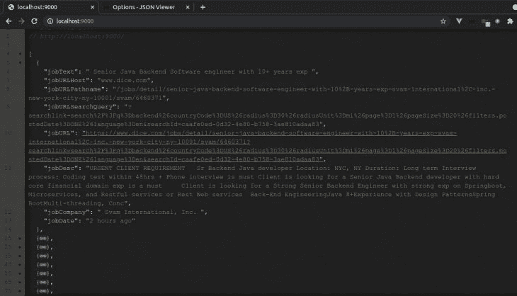
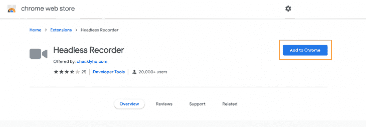
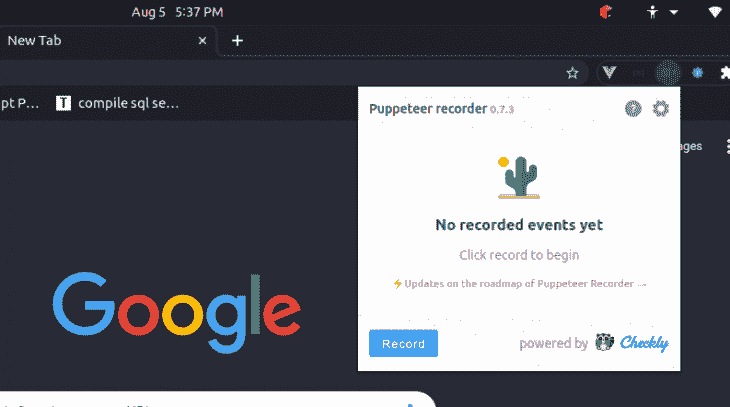
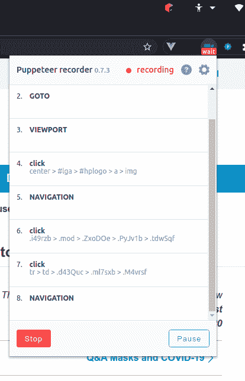

# 使用木偶师进行自动化 UI 测试

> 原文：<https://blog.logrocket.com/using-puppeteer-for-automated-ui-testing/>

在这个先进技术的时代，为 web 抓取、测试和监控编写脚本可能会很棘手。这就是为什么谷歌 Chrome 的团队提供了一个工具，让你通过 JavaScript，通过一个简单易用的 API，名为[木偶师](https://developers.google.com/web/tools/puppeteer)，以编程方式在[Chrome](https://www.chromium.org/quic)或 Chrome 浏览器上执行常见操作。

在这篇博文中，您将了解到 Puppeteer，以及如何使用它来抓取网页并为您的项目记录自动化 UI 测试。

## 先决条件

对于本教程，您需要 JavaScript 和 Node.js 的基础知识。

## 什么是木偶师？

[据 Google](https://developers.google.com/web/tools/puppeteer) 介绍，“Puppeteer 是一个节点库，它提供了一个高级 API 来控制 headless Chrome 或 DevTools 协议上的 Chrome。也可以配置成使用全无头铬或铬。”

使用 Puppeteer，您可以抓取网站、生成页面的截图和 pdf、充当 SPA 的爬虫并生成预呈现的内容、自动化表单提交、测试 UI、使用 DOM API 访问网页和额外信息，以及最终自动化性能分析。

让我们通过抓取一个工作门户来演示 Puppeteer 是如何工作的，这很容易完成，并且有助于我们从总体上理解 web 抓取。

准备好了吗？让我们开始吧。

## 设置节点项目

首先设置您的节点项目:

1.  1.  安装 [Node.js 12.12.0](https://nodejs.org/en/download/) 或更高版本
    2.  安装[纱线](https://classic.yarnpkg.com/en/docs/install/#mac-stable)或 [npm](https://www.npmjs.com/)

```
mkdir JobScrapper
cd JobScrapper

yarn add puppeteer
```

注意，如果你不想下载 Chromium 浏览器，你可以使用`puppeteer-core`，你可以在这里阅读关于[的内容。](https://developers.google.com/web/tools/puppeteer/get-started)

## 创建一个`jobScript.js`文件

在刚刚创建的脚本文件中添加以下代码:

```
const puppeteer = require("puppeteer");
const jobUrl = process.env.JOB_URL;
let page;
let browser;
let cardArr = [];
class Jobs {
    static async init() {
        // console.log('Loading Page ...')
        browser = await puppeteer.launch();
        page = await browser.newPage();
        await page.goto(jobUrl, { waitUntil: "networkidle2" });
        await page.waitForSelector(".search-card");
    }
    static async resolve() {
        await this.init();
        // console.log('Grabbing List of Job URLS ...')
        const jobURLs = await page.evaluate(() => {
            const cards = document.querySelectorAll(".search-card");
            cardArr = Array.from(cards);
            const cardLinks = [];
            cardArr.map(card => {
                const cardTitle = card.querySelector(".card-title-link");
                const cardDesc = card.querySelector(".card-description");
                const cardCompany = card.querySelector(
                    'a[data-cy="search-result-company-name"]'
                );
                const cardDate = card.querySelector(".posted-date");
                const { text } = cardTitle;
                const { host } = cardTitle;
                const { protocol } = cardTitle;
                const pathName = cardTitle.pathname;
                const query = cardTitle.search;
                const titleURL = protocol + "//" + host + pathName + query;
                const company = cardCompany.textContent;
                cardLinks.push({
                    jobText: text,
                    jobURLHost: host,
                    jobURLPathname: pathName,
                    jobURLSearchQuery: query,
                    jobURL: titleURL,
                    jobDesc: cardDesc.innerHTML,
                    jobCompany: company,
                    jobDate: cardDate.textContent
                });
            });
            return cardLinks;
        });
        return jobURLs;
    }
    static async getJobs() {
        const jobs = await this.resolve();
        await browser.close();
        // console.log(jobs)
        return jobs;
    }
}
export default Jobs;

```

这里，`Jobs`类有三个重要的方法:`Init`、`resolve`和`getJobs`。

`Init`方法初始化木偶师实例并创建一个`browser`对象，该对象反过来被用于使用`newPage()`方法在浏览器中创建一个新页面。我们将使用希望浏览器访问的 URL 调用`goto()`，并指定`networkidle2`，这对于执行长轮询或任何其他附带活动的页面来说很方便。之后，等待具有指定类`.search-card`的特定 HTML 元素加载到视口中。

第二个方法是`resolve`方法，它调用`Init`方法，`evaluates`打开的页面，并用`.search-card`查询所有 HTML 元素。它遍历其中的每一个并检索特定的信息，如职位、发布日期、公司和描述，然后将它们推到一个数组中进行显示。

最后，`getJobs`方法简单地调用`resolve`方法来获取找到的所有作业的列表并返回给调用者。

现在，通过输入以下代码创建一个`server.js`文件来显示作业:

```
// Create a simple Express API
const express = require("express");

// Require the Job Scrapper
const Jobs = require("./jobScript");

// Instantiate Express server
const app = express();
const port = 9000;

// Get Jobs from with the Scrapper and return a Job with jobs
app.get("/", async (req, res) => {
  const jobs = await Jobs.getJobs();
  res.json(jobs);
});

// Listen to port 9000
app.listen(port, () => {});

// PS: If you encounter problem with `Module not found` run:
// npm i puppeteer
// again

```

## 显示报废的作业

下面是一个 JSON 示例，根据提供的工作网站 URL，列出了所有成功取消的工作。



List of scraped jobs

## 什么是木偶记录器？

现在我们知道了什么是木偶师，它能做什么，让我们看看木偶师的一个重要用法:自动化测试。

使用 Chrome 扩展的[木偶记录器](https://github.com/checkly/headless-recorder)，我们可以记录我们的浏览器交互和活动，然后生成一个木偶脚本用于自动化测试。

以下是木偶录制器 Chrome 扩展可以执行的有用操作列表:

1.  1.  1.  1.  可以轻松记录网站点击和不同的事件类型
            2.  可以方便地显示已执行的事件和当前正在执行的事件
            3.  它有有用的子句，如`waitForNaigation`和`setViewPort`
            4.  内置的复制到剪贴板功能
            5.  它有不同的配置选项
            6.  可以查询带有`data-id`属性的元素
            7.  木偶剧本自动生成

首先，通过点击**添加到 Chrome** 来安装木偶记录器的 Chrome 扩展。



## 导航木偶记录器

以下是在木偶记录器中记录一个会话的基础。首先，选择图标并点击**记录**。在输入一个`input`元素后，点击 **`tab`** 。您可以点击不同的链接，并输入元素来记录您的会话。

点击之后，等待每个页面完全加载是很重要的。要停止记录，点击**暂停**。通过**恢复**按钮可以恢复记录，通过**停止**可以完全停止记录。最后，您可以点击**复制到剪贴板来复制生成的脚本。**

## 自动化 UI 测试

自动化 UI 测试用于测试应用程序是否正常运行，方法是通过模拟普通用户的方式导航网站和使用技术。它有助于在网站最终上线之前，在网站开发过程中识别网站上的错误、bug 和断开的链接。

已经开发了许多工具来实现这一点，包括 [Selenium](https://www.selenium.dev/) 和 [TestComplete](https://smartbear.com/product/testcomplete/overview/) ，但是我们将演示如何使用木偶师来实现这一点。

现在，让我们记录一个自动化的 UI 测试。

开始录制前，进入**设置**并取消`headless`和`waitForNavigation`选项，以实现平滑录制。

点击木偶师扩展图标，然后点击**记录**:



接下来，在地址栏中键入`[http://www.google.com](https://www.google.com)`并点击浏览器，这样木偶记录器就可以记录一些事件。

确保观察木偶图标栏上的`wait`和`rec`状态——它们会给你一个线索，告诉你什么时候继续下一个事件或点击。



当您为 UI 测试记录了足够的事件后，您可以点击**停止**。接下来，复制生成的木偶脚本，并使用 Node/Express server 运行您的测试。

我在下面的脚本中记录了一些事件:

```
  const puppeteer = require("puppeteer");
  (async () => {
    const browser = await puppeteer.launch({ headless: false });
    const page = await browser.newPage();
    await page.goto(
      "https://www.google.com/search?q=what+is+puppeteer+js&oq=wh&aqs=chrome.0.69i59j69i64j0l3j5l3.7647j0j7&sourceid=chrome&ie=UTF-8"
    );
    await page.setViewport({ width: 1366, height: 669 });
    await page.waitForSelector(
      ".g:nth-child(3) > .rc:nth-child(1) > .r > a > .LC20lb"
    );
    await page.click(".g:nth-child(3) > .rc:nth-child(1) > .r > a > .LC20lb");
    await page.waitForSelector(
      ".blog_post-main_content > .blog_post-body > .blog_post_body > p> a:nth-child(3)"
    );
    await page.click(
      ".blog_post-main_content > .blog_post-body > .blog_post_body > p > a:nth-child(3)"
    );
    await browser.close();
  })();

```

## 运行木偶脚本

一旦设置好测试环境，运行木偶脚本就很简单了。使用 Node/Express，您可以简单地粘贴生成的代码并执行它:

```
const express = require("express");
const app = express();
const port = 9000;
app.get("/test", (req, res) => {
  const puppeteer = require("puppeteer");
  (async () => {
    const browser = await puppeteer.launch({ headless: false });
    const page = await browser.newPage();
    await page.goto(
      "https://www.google.com/search?q=what+is+puppeteer+js&oq=wh&aqs=chrome.0.69i59j69i64j0l3j5l3.7647j0j7&sourceid=chrome&ie=UTF-8"
    );
    await page.setViewport({ width: 1366, height: 669 });
    await page.waitForSelector(
      ".g:nth-child(3) > .rc:nth-child(1) > .r > a > .LC20lb"
    );
    await page.click(".g:nth-child(3) > .rc:nth-child(1) > .r > a > .LC20lb");
    await page.waitForSelector(
      ".blog_post-main_content > .blog_post-body > .blog_post_body > p > a:nth-child(3)"
    );
    await page.click(
      ".blog_post-main_content > .blog_post-body > .blog_post_body > p > a:nth-child(3)"
    );
    await browser.close();
  })();
});
app.listen(port, () => {});

```

现在，你完成了！恭喜你。

## 结论

在这篇文章中，我们了解了木偶师以及如何用它来抓取网页。我们还学习了木偶记录器，并使用它来自动化您的 UI 测试。和往常一样，你可以从我的 [GitHub 库](https://github.com/Kaperskyguru/web-scrapping-puppeteer)获得这篇博文中的所有代码。编码快乐！

## [LogRocket](https://logrocket.com/signup/) :全面了解您的网络应用

[](https://logrocket.com/signup/)

LogRocket 是一个前端应用程序监控解决方案，可以让您回放问题，就像问题发生在您自己的浏览器中一样。LogRocket 不需要猜测错误发生的原因，也不需要向用户询问截图和日志转储，而是让您重放会话以快速了解哪里出错了。它可以与任何应用程序完美配合，不管是什么框架，并且有插件可以记录来自 Redux、Vuex 和@ngrx/store 的额外上下文。

除了记录 Redux 操作和状态，LogRocket 还记录控制台日志、JavaScript 错误、堆栈跟踪、带有头+正文的网络请求/响应、浏览器元数据和自定义日志。它还使用 DOM 来记录页面上的 HTML 和 CSS，甚至为最复杂的单页面应用程序重新创建像素级完美视频。

[免费试用](https://logrocket.com/signup/)。