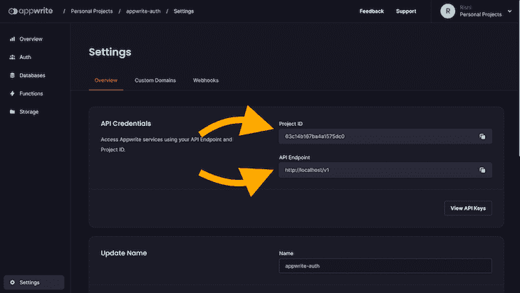
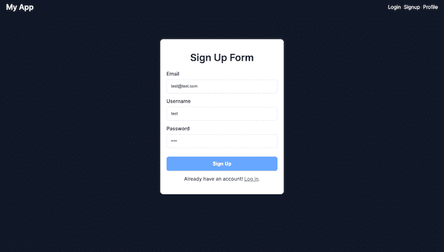
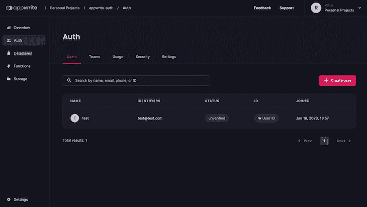
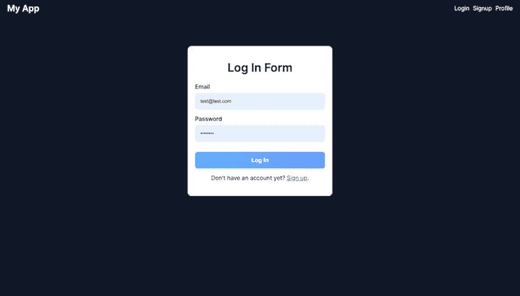
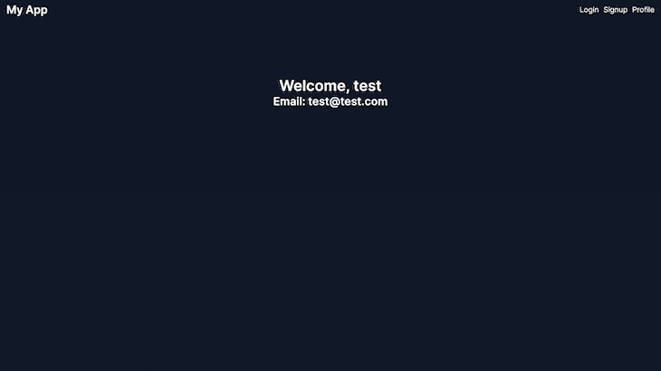
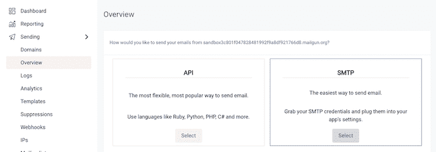
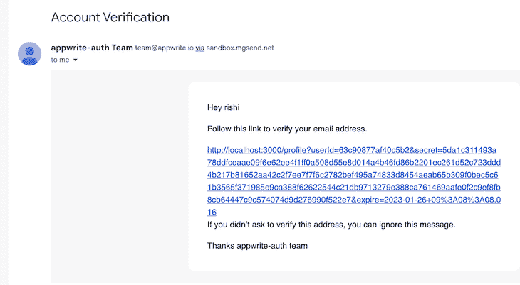

# 使用 React 和 Appwrite 设置用户身份验证

> 原文：<https://blog.logrocket.com/using-react-appwrite-user-authentication/>

用户身份验证是任何 web 应用程序的重要组成部分，对于许多开发人员来说，设置用户身份验证是一项艰巨的任务。但是，在 Appwrite 的帮助下，这个过程可以变得更加容易和简化。

本教程将介绍如何使用 Appwrite Web SDK 与 Appwrite 的新 Graphql API 进行交互，以便在 React 应用程序中设置用户身份验证。我们将讨论如何实现注册功能，处理用户登录和注销，以及实现电子邮件验证功能。

向前跳:

要学习本教程，您应该对 React 及其概念有一个基本的了解。本教程还要求对 GraphQL 有基本的了解，包括如何编写查询和变异。

所以，让我们开始吧！

## 设置 Appwrite

在这篇博客中，我们将讨论如何使用 Appwrite 在 React 应用程序中轻松实现用户认证。但是在深入细节之前，我们先简单讨论一下 Appwrite 是什么。

Appwrite 是一个开源、自托管、后端即服务的平台。它提供了所有的核心 API，允许开发人员轻松地管理各种服务并与之交互，例如用户认证、数据库管理和文件存储。

通过使用 Appwrite，开发人员可以专注于构建他们的核心应用程序逻辑，而将后端基础架构留给 Appwrite。

设置 Appwrite 的第一步是使用 Docker 安装它。为此，您需要在您的主机上安装 [Docker CLI](https://www.docker.com/products/docker-desktop/) 。然后，您可以根据您的操作系统运行以下命令之一来安装 Appwrite。

在运行该命令之前，请确保 Docker 正在您的机器上运行。

要在 Mac 或 Linux 设备上安装 Appwrite，请使用以下命令:

```
docker run -it --rm \
    --volume /var/run/docker.sock:/var/run/docker.sock \
    --volume "$(pwd)"/appwrite:/usr/src/code/appwrite:rw \
    --entrypoint="install" \
    appwrite/appwrite:1.2.0

```

要在 Windows 设备上安装 Appwrite，请使用命令提示符运行以下命令:

```
docker run -it --rm ^
    --volume //var/run/docker.sock:/var/run/docker.sock ^
    --volume "%cd%"/appwrite:/usr/src/code/appwrite:rw ^
    --entrypoint="install" ^
    appwrite/appwrite:1.2.0

```

运行该命令后，将提示您一系列配置问题。这些问题会询问诸如 HTTP 端口、主机名和其他设置等信息。您可以通过按 enter 键选择默认选项，或者根据需要修改选项。

关于安装 Appwrite 的更多详细说明，可以参考 Appwrite 网站上的官方[安装文档](https://appwrite.io/docs/installation)。

## 在 Appwrite 控制台上创建项目

现在您已经在机器上安装并运行了 Appwrite，您可以通过导航到 [http://localhost](http://localhost) 来访问 Appwrite 控制台。

系统将提示您创建新帐户。此帐户将用于访问 Appwrite 控制台并管理您的项目和服务。

要创建项目，请单击 Appwrite 仪表板上的“创建项目”按钮，输入项目名称，然后单击“创建”

一旦您创建了一个项目，您将需要向您的项目添加一个 web 平台来初始化 Appwrite SDK 并与 Appwrite APIs 进行交互。您可以通过点击 Appwrite 控制台上的“Web App”按钮来完成此操作。

系统将提示您输入项目名称和主机名。出于开发目的，您可以使用`localhost`作为您的主机名。一旦添加了 web 平台，您将能够使用 Appwrite SDK 与 Appwrite 服务进行交互。

## 克隆 React 和 Appwrite 项目的启动代码

为了快速开始，我创建了一个包含所有必要代码的 [starter 代码库](https://github.com/rishipurwar1/appwrite-graphql-authentication)。要克隆启动代码，请打开终端并运行以下命令:

```
git clone https://github.com/rishipurwar1/appwrite-graphql-authentication.git

```

一旦您克隆了 starter 代码库，您将在`src/components`文件夹中找到所有的`components`。这些组件包括:

*   `Navbar.js` —负责在应用程序顶部显示导航栏
    *   包含应用程序不同页面的链接
*   `Home.js` —示例应用程序的主登录页面
*   `Login.js` —包含登录表单的代码
*   `Signup.js` —包含注册表单的代码
*   `Profile.js` —包含个人资料页面的代码
    *   显示用户的配置文件信息(显示名称、电子邮件地址等。)

除了前面提到的组件之外，starter 代码存储库还在`src/App.js`文件中包含 React 路由器的[路由设置。例如，`/` URL 被映射到`Home`组件，`/login` URL 被映射到`Login`组件，等等。](https://blog.logrocket.com/migrating-react-router-v6-guide/)

您还可以在`src/App.css`文件中找到所有组件的 CSS 代码，这些代码被导入到`App.js`文件中。

在克隆了起始代码存储库之后，您必须在运行应用程序之前安装所有的依赖项。为此，您需要导航到`appwrite-graphql-authentication`目录并运行以下命令:

```
npm install

```

安装完依赖项后，您可以使用以下命令运行应用程序:

```
npm start

```

该命令将启动应用程序，您可以通过在 web 浏览器中导航到 [http://localhost:3000](http://localhost:3000/) 来访问该应用程序。

## 设置 Appwrite Web SDK

既然我们的示例应用程序已经启动并运行，我们可以继续安装`appwrite`包，以便使用 Appwrite Web SDK 轻松地与 Appwrite 服务进行交互。为此，通过运行以下命令安装`appwrite`包:

```
npm install appwrite

```

一旦软件包安装完毕，在`src`文件夹中创建一个`appwrite`文件夹，并在其中创建一个`config.js`文件。该文件将用于导入和初始化 Appwrite SDK。

在`config.js`文件中，您可以导入 Appwrite 模块，并通过向文件添加以下代码来初始化 Appwrite SDK:

```
import { Client, Graphql } from "appwrite";

// initialize SDK
const client = new Client();
client
  .setEndpoint("YOUR_API_ENDPOINT") // Replace this
  .setProject("YOUR_PROJECT_ID"); // Replace this

export const graphql = new Graphql(client);

```

确保用项目的 API 端点和项目 ID 替换“您的 API 端点”和“您的项目 ID”。您可以在 Appwrite 项目设置页面上找到此信息:



在代码的最后一行，我们创建并导出了`graphql`实例，我们将在其他组件中使用它来与 Appwrite Graphql API 进行交互。

## 在 React 应用中实现注册功能

在本节中，我们将实现 React 应用程序的注册功能。为此，我们将[创建一个定制钩子](https://blog.logrocket.com/create-your-own-custom-react-hooks/)，它将包含用于`login`、`signup`和`logout`动作的函数。这个钩子也有一个状态变量来跟踪登录的用户。

通过创建自定义挂钩，我们可以在一个地方轻松管理与用户身份验证相关的状态和功能。这将使跨不同组件重用代码变得容易，并使应用程序保持有序。

现在，让我们在`src`文件夹中创建一个`hooks`文件夹，然后创建一个`useAuth.js`文件。在这个文件的顶部，从`config.js`导入`graphql`。然后，您需要通过添加以下代码来创建一个`useAuth`函数:

```
import { graphql } from "../appwrite/config";

const useAuth = () => {
  // useAuth hook code goes here
};

export default useAuth;

```

让我们在`useAuth`中创建一个`signup`函数。我们可以通过添加以下代码来实现这一点:

```
import { graphql } from "../appwrite/config";

const useAuth = () => {
  // sign up functionality
  const signup = async (email, password, username) => {
    const response = await graphql.mutation({
      query: `mutation (
                $email: String!,
                $password: String!,
                $name: String
            ) {
                accountCreate(
                    userId: "unique()",
                    email: $email,
                    password: $password,
                    name: $name
                ) {
                  _id
                }
            }`,
      variables: {
        email: email,
        password: password,
        name: username,
      },
    });

    if (response.errors) {
      throw response.errors[0].message;
    }
  };

  return {
    signup,
  };
};

export default useAuth;

```

我们在上面的代码中创建的`signup`函数接受三个参数— `email`、`password`和`username`。在函数内部，有一个叫做`graphql.mutation`的方法，用于对数据进行修改。在这种情况下，该方法使用提供的电子邮件、密码和用户名创建一个新帐户。

`mutation`方法接受一个包含两个属性的对象——`query`属性和`variables`对象。

`query`属性使用`accountCreate`变异，用提供的电子邮件、密码和用户名创建一个新的用户帐户。

`variables`对象用于将`email`、`password`和`username`的值动态传递给`accountCreate`变异。如果变异成功，会返回创建账号的`_id`。

添加`if`块是为了在创建账户时检查任何错误。

最后，钩子返回一个包含`signup`函数的对象，该函数可以在其他组件中使用。

### 在我们的 Appwrite 项目中使用`signup`函数

现在我们已经在我们的`useAuth`钩子中创建了`signup`函数，我们可以在我们的`Signup`组件中使用它来创建一个新账户。在此之前，让我解释一下`Signup`组件代码。

在这个组件中，我们有两个函数— `handleChange`和`handleSubmit`。

`handleChange`函数用于用用户在表单输入字段中输入的值更新`user`状态变量。

`handleSubmit`函数用于处理表单提交事件，防止默认的表单提交行为。在这个例子中，这个函数只将用户对象记录到控制台，但是稍后，我们将使用`signup`函数创建一个新帐户。

该表单有三个输入字段，分别为`email`、`username`和`password`。每个输入字段都有一个`onChange`事件，该事件调用`handleChange`函数用用户输入的值更新`user`状态变量。

`form`元素还有一个`onSubmit`事件，当用户点击提交按钮时，该事件调用`handleSubmit`函数。

当用户使用`Signup`表单注册时，让我们使用`signup`函数创建一个新的用户帐户。

为此，首先，我们需要在`Signup`组件中导入`useAuth`钩子，然后调用`useAuth`钩子并从中析构`signup`函数。然后，用用户输入的`email`、`password`和`username`的值调用`handleSubmit`函数内的`signup`函数。

您的代码应该如下所示:

```
import { useState } from "react";
import { Link } from "react-router-dom";
import { useAuth } from "../hooks/useAuth"; // import useAuth

const Signup = () => {
  const [user, setUser] = useState({});
  const { signup } = useAuth();

  const handleChange = (e) => {
    setUser({ ...user, [e.target.name]: e.target.value });
  };

  const handleSubmit = async (e) => {
    e.preventDefault();
    try {
      await signup(user.email, user.password, user.username);
      alert("Account created successfully!");
    } catch (error) {
      console.log(error);
    }
  };

  // rest of the code
}

```

要测试注册功能，请打开应用程序的注册页面。在表格中填写您的电子邮件、用户名和密码。请记住，密码长度至少应为八个字符。



填写完表格后，单击“注册”按钮提交表格。如果帐户创建成功，您应该会看到一条警告消息。如果帐户创建失败，控制台上会显示一条错误消息。

您还可以通过检查您的 Appwrite 项目仪表板来验证用户是否已经创建。登录到您的 Appwrite 帐户，导航到项目仪表板，并选择侧边栏上的“Auth”选项卡。在这里，您将能够看到刚刚创建的新用户帐户:



恭喜你！🎉您已经使用 Appwrite 在 React 应用程序中成功实现了注册功能。

## 在 React 应用中实现登录功能

为了使用 Appwrite 在 React 应用程序中实现登录功能，我们将遵循与注册功能类似的方法。首先，通过添加以下代码，在`useAuth`挂钩内创建一个`login`函数:

```
import { graphql } from "../appwrite/config";

const useAuth = () => {
  const signup = async (email, password, username) => {
   // signup function code
  };

  const login = async (email, password) => {
    const response = await graphql.mutation({
      query: `mutation (
          $email: String!,
          $password: String!,
      ) {
        accountCreateEmailSession(
          email: $email,
          password: $password,
      ) {
          _id
        }
      }`,
      variables: {
        email: email,
        password: password,
      },
    });

    if (response.errors) {
      throw response.errors[0].message;
    }
  };

  return {
    signup,
    login, // return it
  };
};

export default useAuth;

```

上面的查询属性使用了`accountCreateEmailSession`突变，允许用户通过提供有效的电子邮件和密码来登录他们的帐户。这将为用户创建一个新会话。

### 在我们的 Appwrite 项目中使用`login`函数

让我们在`Login.js`文件中导入`useAuth`钩子，并在`Login`组件中调用它。然后，从`useAuth`钩子中析构`login`函数。最后，调用`handleSubmit`函数内部的`login`函数，传入用户输入的`email`和`password`的值。

代码应该如下所示:

```
import { useState } from "react";
import { Link, useNavigate } from "react-router-dom";
import useAuth from "../hooks/useAuth";

const Login = () => {
  const [user, setUser] = useState({});
  const navigate = useNavigate();
  const { login } = useAuth();

  const handleChange = (e) => {
    setUser({ ...user, [e.target.name]: e.target.value });
  };

  const handleSubmit = async (e) => {
    e.preventDefault();
    try {
      await login(user.email, user.password);
      navigate("/profile");
    } catch (error) {
      console.log(error);
    }
  };

  // rest of the code
};

export default Login;

```

要测试登录特性，请打开应用程序的登录页面。在表格中填写您的电子邮件和密码。填写完表格后，单击“登录”按钮提交表格。



如果登录成功，用户将被导航到`/profile`页面。如果登录失败，控制台上会显示一条错误消息。

目前，配置文件页面上显示的信息是硬编码的，但是我们将在下一节中通过使用 Appwrite API 获取登录用户的数据来使其动态化。

## 使用 Appwrite API 获取登录的用户数据

在这一节中，我将向您展示如何获取登录用户的数据并将其显示在`Profile`组件上。首先，让我们使用`useAuth`钩子中的`[useState](https://blog.logrocket.com/guide-usestate-react/)`[钩子](https://blog.logrocket.com/guide-usestate-react/)创建一个用户状态，并将其设置为`null`:

```
import { useState } from "react"; // import useState

const useAuth = () => {
  const [user, setUser] = useState(null); // create a user state

  // rest of the code
}

```

接下来，我们将在`useAuth`钩子内部创建`getCurrentUser`函数。`getCurrentUser`函数使用 Appwrite GraphQL API 提供的`accountGet`查询来获取当前登录用户的数据。

下面是`getCurrentUser`函数的代码:

```
const getCurrentUser = async () => {
  const response = await graphql.query({
    query: `query {
          accountGet {
              _id
              name
              emailVerification
              email
          }
      }`,
  });
  return response.data.accountGet;
};

```

如您所见，该查询返回一个包含用户 ID、姓名、电子邮件地址和电子邮件验证状态的对象。

接下来，我们将使用`[useEffect](https://blog.logrocket.com/useeffect-hook-complete-guide/)`[钩子](https://blog.logrocket.com/useeffect-hook-complete-guide/)调用`getCurrentUser`函数，并用返回的数据更新`user`状态。

最后，我们将从`useAuth`钩子返回`user`状态，这样就可以在其他组件中访问它。

您的`useAuth`代码应该是这样的:

```
import { useEffect, useState } from "react"; // import useEffect
import { graphql } from "../appwrite/config";

const useAuth = () => {
  const [user, setUser] = useState(null);

  const signup = async (email, password, username) => {
    // signup code
  };

  const login = async (email, password) => {
    // login code
  };

  const getCurrentUser = async () => {
    // getCurrentUser code
  };

  // fetching the logged user data
  useEffect(() => {
    const fetchUser = async () => {
      const userDetails = await getCurrentUser();
      setUser(userDetails);
    };
    fetchUser();
  }, []);

  return {
    signup,
    login,
    user, // return it
  };
};

export default useAuth;

```

## 使用`Profile`组件中的用户状态

在`Profile`组件中，您可以导入`useAuth`钩子并析构`user`状态。然后，您可以使用`user`数据在个人资料页面上显示用户的姓名、电子邮件和其他信息。

下面是`Profile`组件的更新代码:

```
import useAuth from "../hooks/useAuth"; // import useAuth

const Profile = () => {
  const { user } = useAuth(); // destructure user

  return (
    <div className="profile">
      <h1 className="name">Welcome, {user?.name}</h1>
      <h2 className="email">Email: {user?.email}</h2>
    </div>
  );
};

export default Profile;

```

更新代码后，您应该会看到当前登录的用户名和电子邮件显示在`/profile`页面上:



## 在 React 应用中实现注销功能

要使用 Appwrite 在 React 应用中实现注销功能，首先通过添加以下代码在`useAuth`挂钩中创建一个`logout`函数:

```
const logout = async () => {
  const response = await graphql.mutation({
    query: `mutation {
          accountDeleteSession(
              sessionId: "current"
          ) {
              status
          }
      }`,
  });

  if (response.errors) {
    throw response.errors[0].message;
  }
};

```

如您所见，`accountDeleteSession`突变将“current”作为会话 ID，从当前设备会话中注销当前登录的用户。

最后，我们将从`useAuth`钩子返回`logout`函数，这样就可以在其他组件中访问它。

您的`useAuth`代码应该是这样的:

```
import { useEffect, useState } from "react";
import { graphql } from "../appwrite/config";

const useAuth = () => {
  const [user, setUser] = useState(null);

  const signup = async (email, password, username) => {
    // signup code
  };

  const login = async (email, password) => {
    // login code
  };

  const getCurrentUser = async () => {
    // getCurrentUser code
  };

  // logout function
  const logout = async () => {
    // logout code
  };

  useEffect(() => {
    // code
  }, []);

  return {
    signup,
    login,
    logout, // return logout
    user
  };
};

export default useAuth;

```

### 在我们的 Appwrite 项目中使用注销功能

让我们在`Profile.js`文件中导入`useAuth`钩子，并在`Profile`组件中调用它。然后，从`useAuth`钩子中析构`logout`函数。

接下来，通过添加以下代码，在`Profile`组件中创建一个`handleLogout`函数:

```
const handleLogout = async () => {
  try {
    await logout();
    navigate("/login");
  } catch (error) {
    console.log(error);
  }
};

```

最后，向“注销”按钮添加一个`onClick`事件监听器。您的`Profile`组件代码应该如下所示:

```
import { useNavigate } from "react-router-dom"; // import useNavigate
import useAuth from "../hooks/useAuth";

const Profile = () => {
  const { logout, user } = useAuth();
  const navigate = useNavigate();

  const handleLogout = async () => {
    try {
      await logout();
      navigate("/login");
    } catch (error) {
      console.log(error);
    }
  };

  return (
    <div className="profile">
      <h1 className="name">Welcome, {user?.name}</h1>
      <h2 className="email">Email: {user?.email}</h2>
      <button className="logOut-btn" onClick={handleLogout}>
        Log Out
      </button>
    </div>
  );
};
export default Profile;

```

要测试`logout`功能，请打开个人资料页面并点击“注销”按钮。如果注销操作成功，用户将被重定向到`/login`页面。如果注销操作失败，控制台上会显示一条错误消息。

## 使用 Appwrite 的 GraphQL API 添加电子邮件验证功能

在本节中，我们将学习如何使用 Appwrite 的 GraphQL API 在我们的应用程序中实现电子邮件验证功能。要验证用户的电子邮件地址，我们需要完成两个步骤:

*   向用户的电子邮件地址发送验证链接
*   一旦用户点击验证链接，请确认电子邮件地址

但是在我们开始之前，需要注意的是，为了发送验证邮件，我们需要设置一个第三方 SMTP 提供商，比如 SendGrid 或 MailGun。在本教程中，我们将使用 MailGun。

要设置 MailGun，首先[到 MailGun 网站](https://www.mailgun.com/)注册一个免费账户。注册后，你将被带到仪表板，在那里你需要通过[按照 MailGun 的指示](https://help.mailgun.com/hc/en-us/articles/217531258-Authorized-Recipients)来验证你的电子邮件地址。

之后，选择“概述”页面上的“SMTP”选项。在这里，您可以找到您的 SMTP 凭证，如主机名、端口、用户名和密码:



### 用您的 SMTP 凭证配置`.env`文件

现在，打开安装 Appwrite 时创建的`appwrite`文件夹，而不是我们在项目文件夹中创建的文件夹。在这个文件夹中，您会发现一个名为`.env`的文件，它需要用您的 SMTP 凭证进行更新。

打开`.env`文件，用项目的相关信息更新以下字段:

*   `_APP_SMTP_HOST` —您的 SMTP 主机名
*   `_APP_SMTP_PORT` —您的 SMTP 端口
*   `_APP_SMTP_SECURE` — SMTP 安全连接协议(如果在安全连接上运行，您可以将其设置为“tls”)
*   `_APP_SMTP_USERNAME` —您的 SMTP 用户名
*   `_APP_SMTP_PASSWORD` —您的 SMTP 密码
*   `_APP_SYSTEM_EMAIL_ADDRESS` —您的 SMTP 电子邮件地址

一旦更新了`.env`文件，保存它并通过运行以下命令重新启动 Appwrite 服务器:

```
docker compose up -d

```

现在我们已经设置了 SMTP 配置，我们可以继续实现电子邮件验证功能。

### 向新注册用户发送验证电子邮件

使用下面的代码在`useAuth`钩子中创建一个`sendVerificationEmail`函数:

```
const useAuth = () => {
  // other functions and state

const sendVerificationEmail = async () => {
    const response = await graphql.mutation({
      query: `mutation {
        accountCreateVerification(
            url: "http://localhost:3000/profile"
        ) {
            _id
            _createdAt
            userId
            secret
            expire
        }
    }`,
    });

    if (response.errors) {
      throw response.errors[0].message;
    }
  };

  return {
    signup,
    login,
    logout,
    user,
    sendVerificationEmail // return this
  };
};

```

该功能将负责发送验证电子邮件。请注意，该函数中的`accountCreateVerification`变异接受一个`url`属性，这是用户单击发送到其电子邮件地址的验证链接后将被重定向到的 URL。

在我们使用此功能之前，需要注意的是，您只能在为用户创建登录会话后发送验证电子邮件。为此，您需要在调用`Signup`组件的`handleSubmit`函数中的`signup`函数之后立即调用`login`函数，如下所示:

```
const Signup = () => {
  const [user, setUser] = useState({});
  const { signup, login } = useAuth(); // add login function

  const handleChange = (e) => {
    setUser({ ...user, [e.target.name]: e.target.value });
  };

  const handleSubmit = async (e) => {
    e.preventDefault();
    try {
      await signup(user.email, user.password, user.username);
      await login(user.email, user.password); // call login function
      alert("Account created successfully!");
    } catch (error) {
      console.log(error);
    }
  };

  // rest of the code
};

```

让我们在调用`login`函数后调用`sendVerificationEmail`函数来发送验证邮件:

```
const Signup = () => {
  const [user, setUser] = useState({});
  const { signup, login, sendVerificationEmail } = useAuth(); // add sendVerificationEmail function

  const handleChange = (e) => {
    setUser({ ...user, [e.target.name]: e.target.value });
  };

  const handleSubmit = async (e) => {
    e.preventDefault();
    try {
      await signup(user.email, user.password, user.username);
      await login(user.email, user.password);
      await sendVerificationEmail(); // call sendVerificationEmail function
      alert("Account created and verification email sent successfully!");
    } catch (error) {
      console.log(error);
    }
  };

  // rest of the code
};

```

若要测试此功能，请使用您在 MailGun 上验证的电子邮件在您的应用程序中注册一个帐户。您应该会在电子邮件中收到一个验证链接。请务必检查您的垃圾邮件文件夹:



### 验证用户的电子邮件

在您收到的验证链接中，您会看到附加的`userId`和`secret`参数。我们将使用这些参数发出另一个 API 请求来验证用户的电子邮件地址。让我们使用下面的代码在`useAuth`钩子中创建一个函数:

```
const useAuth = () => {
  // other functions and state

  const confirmEmailVerification = async (userId, secret) => {
    const response = await graphql.mutation({
      query: `mutation (
          $userId: String!,
          $secret: String!,
      ) {
          accountUpdateVerification(
              userId: $userId,
              secret: $secret
          ) {
              _id
          }
      }`,
      variables: {
        userId: userId,
        secret: secret,
      },
    });

    if (response.errors) {
      throw response.errors[0].message;
    }
  };

  return {
    // rest of the functions and state
    confirmEmailVerification
  };
};

```

在`Profile`组件中，我们需要从重定向的 URL 中提取参数，并在用户重定向后位于个人资料页面时将它们作为参数传递给`confirmEmailVerification`函数。这可以通过使用以下代码来完成:

```
import { useNavigate } from "react-router-dom";
import useAuth from "../hooks/useAuth";
const Profile = () => {
  const { logout, user, confirmEmailVerification } = useAuth(); // add confirmEmailVerification

  // rest of the code

  const handleLogout = async () => {
    // code
  };

  const urlParams = new URLSearchParams(window.location.search);
  const userId = urlParams.get("userId"); // extract userId
  const secret = urlParams.get("secret"); // extract secret

  const handleConfirmEmailVerification = async () => {
    try {
      await confirmEmailVerification(userId, secret);
      alert("Email verified successfully!");
      navigate("/profile");
    } catch (err) {
      console.log(err);
    }
  };

  if (!user?.emailVerification && userId && secret) {
    handleConfirmEmailVerification();
  }

  // rest of the code
};
export default Profile;

```

您应该能够验证用户的电子邮件地址。至此，本教程结束！

## 结论

我们关于使用 Appwrite 和 GraphQL API 在 React 中设置用户认证的教程到此结束。我们讨论了安装和设置 Appwrite、创建项目、实现注册和登录功能、获取登录用户的信息以及设置电子邮件验证功能。

我希望你喜欢这篇文章！感谢您花时间阅读它。如果你在阅读这篇文章时有任何问题，或者有进一步的疑问，请在评论区告诉我。

如果你喜欢我在这里做的事情，并想帮助我继续做下去，别忘了点击分享按钮。编码快乐！

## 使用 LogRocket 消除传统反应错误报告的噪音

[LogRocket](https://lp.logrocket.com/blg/react-signup-issue-free)

是一款 React analytics 解决方案，可保护您免受数百个误报错误警报的影响，只针对少数真正重要的项目。LogRocket 告诉您 React 应用程序中实际影响用户的最具影响力的 bug 和 UX 问题。

[ ](https://lp.logrocket.com/blg/react-signup-general) [  ](https://lp.logrocket.com/blg/react-signup-general) [LogRocket](https://lp.logrocket.com/blg/react-signup-issue-free)

自动聚合客户端错误、反应错误边界、还原状态、缓慢的组件加载时间、JS 异常、前端性能指标和用户交互。然后，LogRocket 使用机器学习来通知您影响大多数用户的最具影响力的问题，并提供您修复它所需的上下文。

关注重要的 React bug—[今天就试试 LogRocket】。](https://lp.logrocket.com/blg/react-signup-issue-free)