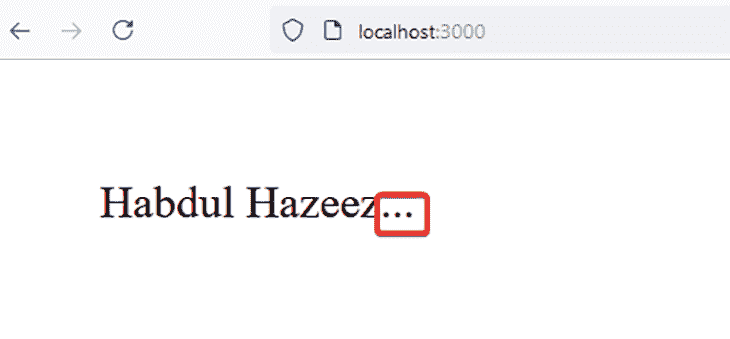
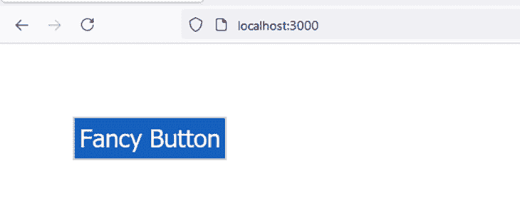
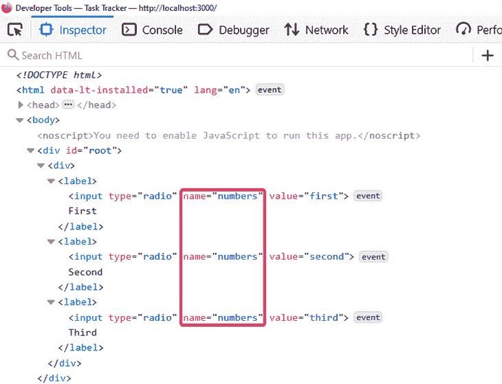
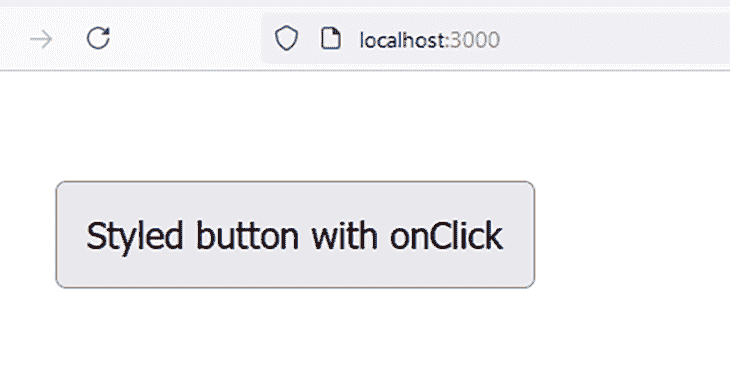

# 使用 React.cloneElement()函数克隆元素

> 原文：<https://blog.logrocket.com/using-react-cloneelement-function/>

## 介绍

### 什么是`React.cloneElement()`？

`[React.cloneElement()](https://reactjs.org/docs/react-api.html#cloneelement)`是用来操作元素的 React 顶级 API 的一部分。它克隆并返回一个新元素，使用它的第一个参数作为起点。该参数可以是 React 元素或呈现 React 元素的组件。

新元素将具有以下特征:

*   原有元素的道具与新道具的融合
*   新的子代替换现有的子代
*   保留原始元素中的`key`和`ref`

当您想要添加或修改父组件的子组件的属性，同时避免不必要的重复代码时,`React.cloneElement()`非常有用。

### `React.cloneElement()`的语法和用法

在看一些例子之前，我们先来看看`React.cloneElement()`的语法。下一个代码块给出了语法，后面是一些术语定义。

```
React.cloneElement(element, [props], [...children])

```

*   `element`:要克隆的元素
*   `[props]`:除了原始元素的属性之外，将被添加到克隆元素的属性
*   `[...children]`:克隆对象的子对象。请注意，现有对象的子对象不会被复制

您可以在父组件的定义中使用`React.cloneElement()`来执行以下过程:

*   修改子属性
*   添加到子属性
*   扩展子组件的功能

本文使用以下示例深入探讨了这三种操作中的每一种:

## 修改子属性

当您修改子属性时，这意味着您通过将它们传递给父组件来改变子属性。

没有比通过真实的代码示例来解释更好的方法了。我们将用下面的例子来说明这个概念:

1.  重复字符
2.  花式儿童按钮
3.  一次性修改单选按钮的属性
4.  将 React 元素克隆为属性

在我们继续之前，请注意在这些例子中，修改后的属性被简单地合并——保留了`key`和`ref`。虽然我们将在本文的最后一个示例中查看，但是还没有创建新的子对象。

### 1.重复字符

在下一个代码块中，`RepeatCharacters`是父组件，`CreateTextWithProps`是子组件。

`CreateTextWithProps`有一个名为`ASCIIChar`的属性，它的值是任何有效的 ASCII 字符。`RepeatCharacters`将使用`React.cloneElement()`在克隆的元素中重复这个字符，重复的次数在其`times`属性中指定。

```
import React from "react";
​
const CreateTextWithProps = ({ text, ASCIIChar, ...props }) => {
 return (
   <span {...props}>
    {text}{ASCIIChar}
   </span>
)
};
​
const RepeatCharacters = ({ times, children }) => {
 return React.cloneElement(children, {
   // This will override the original ASCIIChar in the text.
   ASCIIChar: children.props.ASCIIChar.repeat(times),
})
};
​
function App() {
 return (
   <div>
     <RepeatCharacters times={3}>
       <CreateTextWithProps
         text="Habdul Hazeez"
         ASCIIChar='.'
         />
     </RepeatCharacters>
   </div>
)
}
​
export default App

```

以下是在 Web 浏览器中看到的结果:



### 2.花式儿童按钮

这里没有什么新奇的东西——这是一些代码，显示了一个带有文本“新奇按钮”的按钮。这证明您可以定制这些组件来满足您的需求。

`ButtonContainer`组件使用`React.cloneElement()`来修改由`Button`组件呈现的元素的外观。

在这种情况下，您提供`null`作为`React.cloneElement()`的第三个参数，因为，提醒一下，您没有创建任何新的子元素。

```
import React from "react";
​
const ButtonContainer = (props) => {
 let newProp = {
   backgroundColor: "#1560bd",
   textColor: '#ffffff',
   border: '1px solid #cccccc',
   padding: '0.2em',
}
​
 return (
   <div>
    {React.Children.map(props.children, child => {
       return React.cloneElement(child, {newProp}, null)
    })}
   </div>
)
};
​
const Button = (props) => {
 return <button
   style={{
     color: props.newProp.textColor,
     border: props.newProp.border,
     padding: props.newProp.padding,
     backgroundColor: props.newProp.backgroundColor
  }}>Fancy Button</button>
}
​
function App() {
 return (
   <ButtonContainer>
     <Button />
   </ButtonContainer>
)
}
​
export default App

```

当您在 Web 浏览器中查看结果时，您会看到类似下图的内容。



### 3.修改单选按钮的属性

在 HTML 中，单选按钮被分组。您只能选择所提供的选项中的一个，并且它们似乎总是附带有一个`name`属性。

利用您目前所获得的知识，您可以通过单个父组件将这个`name`属性动态地添加到多个子组件中。

在这种情况下，子组件应该是单选按钮或呈现单选按钮的组件。

```
import React from "react";
​
const RadioGroup = (props) => {
 const RenderChildren = () => (
   React.Children.map(props.children, child => {
     return React.cloneElement(child, {
       name: props.name,
    })
  })
)
​
 return (
   <div>
    {<RenderChildren />}
   </div>
)
}
​
const RadioButton = (props) => {
 return (
   <label>
     <input type="radio" value={props.value} name={props.name} />
    {props.children}
   </label>
)
}
​
function App() {
 return (
 <RadioGroup name="numbers">
   <RadioButton value="first">First</RadioButton>
   <RadioButton value="second">Second</RadioButton>
   <RadioButton value="third">Third</RadioButton>
 </RadioGroup>
)
}
​
export default App

```

您可以使用浏览器的 **Inspect Element** 功能来确认这一点。



### 4.克隆另一个反应元素作为道具

您可能会发现自己处于这样一种情况:您必须为不同的网页创建一个带有不同文本的网站标题。

React 库中有多个选项，可能包括将标题文本存储在一个变量中，将这个变量作为道具传递给一个组件，以及呈现文本。然后，您可能会在每个需要标题文本的组件中这样做。

正如您可能猜到的那样，这造成了不必要的代码重复，正如软件开发人员所知道的那样，我们应该始终提倡保持简单。

相反，你可以使用`React.cloneElement`来更容易地实现同样的目标。创建三个可重用组件，即:

*   `Header`
*   `DefaultHeader`
*   `BigHeader`

`Header`组件将接收一个组件作为道具。该组件最终将呈现标题文本。为了安全起见，`DefaultHeader`将是传递给`Header`的默认组件。

* * *

### 更多来自 LogRocket 的精彩文章:

* * *

`DefaultHeader`将呈现默认文本。当不带任何属性调用`Header`时，会呈现这个默认文本。

同时，`BigHeader`组件将有一个`message`属性，其值是您选择的标题文本。每次通过`BigHeader`到`Header`，都可以在`BigHeader`渲染之前修改这个`message`道具的值。

所有这些都将在下一个代码块中演示。

```
import React from "react";
import { BrowserRouter as Router, Route, Link } from 'react-router-dom';
​
const DefaultHeader = (color) => {
 return (
   <div style={{ color: "#1560bd" }}>
     <p>Website of Habdul Hazeez</p>
   </div>
)
}
​
const defaultMessage = 'Website of Habdul Hazeez';
​
const BigHeader = ({ color, message = defaultMessage }) => {
 return (
   <div style={{ color, fontSize: '2em' }}>
    {message}
   </div>
)
}
​
const Header = ({ hero = <DefaultHeader />}) => {
 return (
   <div>
    {React.cloneElement(hero, { color: "#1560bd"})}
   </div>
)
}
​
const HomePage = () => {
 return (

<Header hero={<BigHeader message="This is the home page" />} />
)
}
​
const AboutMe = () => {
 return (
   <Header hero={<BigHeader message="Information about me" />} />
)
}
​
const ContactPage = () => {
 return (
   <Header hero={<BigHeader message="This contains my contact information." />} />
)
}
​
function App() {
 return (
   <React.Fragment>
     <Router>
       <nav>
         <ul>
           <li>
             <Link to="/">Home</Link>
           </li>
           <li>
             <Link to="/contact-page">Contact</Link>
           </li>
           <li>
             <Link to="about-me">About</Link>
           </li>
         </ul>
       </nav>

       <Route exact path="/"><HomePage /></Route>
        <Route path="/contact-page"><ContactPage /></Route>
        <Route path="/about-me"><AboutMe /></Route>
      </Router>
    </React.Fragment>
)
}
​
export default App

```

## 添加到子属性

当您添加到一个子属性时，这意味着您已经通过父组件在子属性中插入了新的内容。

本节讨论的以下例子将解释如何通过`React.cloneElement()`添加道具。

注意，正如我在上一节中所说的，新的道具被合并进来，`key`和`ref`被保留，新的子元素没有被创建(至少现在是这样)。

### 粗体文本

当你读到这一节的标题并认为:“这很容易”时，不要气馁。我知道这很“容易”——从表面上看。这里的课程是使用`React.cloneElement()`向子元素添加属性。

为了向您展示这是如何工作的，我们将重温本文中关于重复字符的第一个例子。不过，您不会重复任何字符——相反，您将使用`React.cloneElement()`函数定义一个添加到子元素的自定义 CSS 样式。

这将在下一个代码块中演示。

```
import React from "react";

const CreateTextWithProps = ({ text, ...props }) => {
  return (
    <span {...props}>
      {text}
    </span>
  )
};

const BoldText = ({ children }) => {
  return React.cloneElement(children, {
    style: {
      fontWeight: 'bold'
    },
  })
};

function App() {
  return (
    <div>
      <BoldText>
        <CreateTextWithProps
          text="Habdul Hazeez"
        />
      </BoldText>
    </div>
  )
}

export default App;

```

### 将 prop 传递给通过`React.cloneElement()`接收的元素

这与上一节“将另一个 React 元素克隆为道具”中的操作类似，但在这里，您将使用`React.cloneElement()`克隆一个道具。这个属性必须是一个有效的 React 元素，比如`<h1>`或者`<button>`。

当您克隆这个属性时，您可以传递额外的属性，如 CSS 样式或事件处理程序。

在下一个代码块中，您将传递一个`handleClick`函数给由`AlertOnClick`渲染的道具。因此，每次点击元素时，都会执行`handleClick`中的代码。

```
import React from "react";
​
const AlertOnClick = (props) => {

 function handleClick () {
   alert("Hello World")
}
​
 const Trigger = props.trigger;
​
 return (
   <div>
    {React.cloneElement(Trigger, {
       onClick: handleClick
    })}
   </div>
)
}
​
function App() {

 return (
   <div>
    {
       <AlertOnClick trigger={<button>Click me</button>} />
    }
   </div>
)
}
​
export default App

```

## 扩展子组件的功能

到目前为止，您已经修改并添加了儿童道具。这个例子展示了一个克隆元素的最后的特征，因为我们最终创建了一个新的子元素！这个新的子节点作为第三个参数传递给`React.cloneElement()`。

### 点击时提醒

在这个例子中，我们将[扩展孩子的功能](https://blog.logrocket.com/a-guide-to-react-onclick-event-handlers)。

在下一个代码块中，通过`Button`组件的`React.cloneElement()`创建的新按钮元素有两个额外的变化:一个`onClick`事件处理程序和新文本。

```
import React from "react";
const Button = () => {
 return (
   <button type="button" style={{ padding: "10px" }}>
     This is a styled button
   </button>
)
}
​
function App() {
 return (
   <section>
    {
       React.cloneElement(
         Button(), // component to overwrite
        {

           onClick: () => { // additional props
             alert("You are making progress!!!")
          }
        },
         <>
           Styled button with onClick
         </>
      )
    }
   </section>
)
}
​
export default App

```

当执行这段代码时，按钮将呈现通过`React.cloneElement()`函数添加的文本，如下图所示，该文本将显示为“带有 onClick 的样式化按钮”。



## 结论

本文通过七个不同的例子解释了如何使用`React.cloneElement()`函数。其中四个例子解释了如何修改子组件的属性；另外两个例子详细说明了如何给子组件添加道具；最后，我们的最后一个例子展示了如何扩展子组件的功能。

希望您在本文中学到的东西能够为您的 React 应用程序增加一些创造性！

## 使用 LogRocket 消除传统反应错误报告的噪音

[LogRocket](https://lp.logrocket.com/blg/react-signup-issue-free)

是一款 React analytics 解决方案，可保护您免受数百个误报错误警报的影响，只针对少数真正重要的项目。LogRocket 告诉您 React 应用程序中实际影响用户的最具影响力的 bug 和 UX 问题。

[ ](https://lp.logrocket.com/blg/react-signup-general) [  ](https://lp.logrocket.com/blg/react-signup-general) [LogRocket](https://lp.logrocket.com/blg/react-signup-issue-free)

自动聚合客户端错误、反应错误边界、还原状态、缓慢的组件加载时间、JS 异常、前端性能指标和用户交互。然后，LogRocket 使用机器学习来通知您影响大多数用户的最具影响力的问题，并提供您修复它所需的上下文。

关注重要的 React bug—[今天就试试 LogRocket】。](https://lp.logrocket.com/blg/react-signup-issue-free)