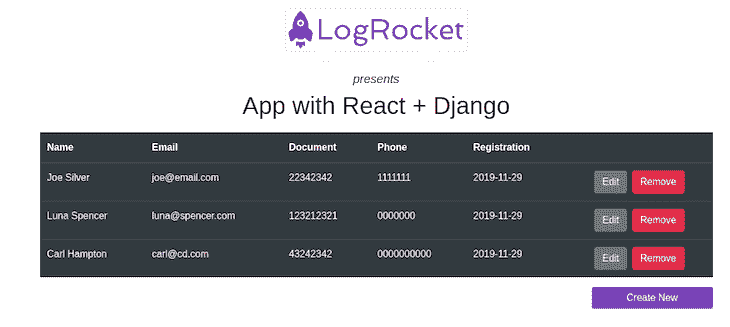
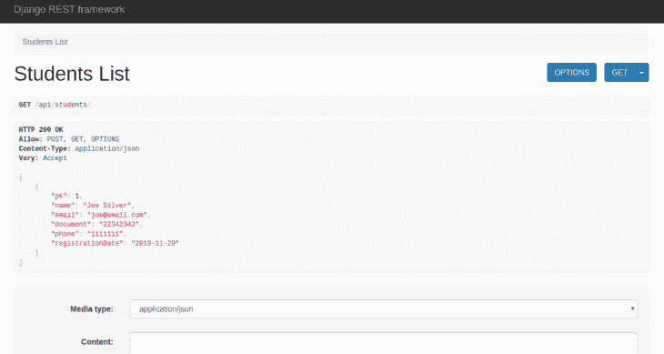
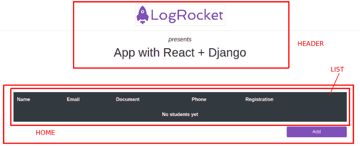
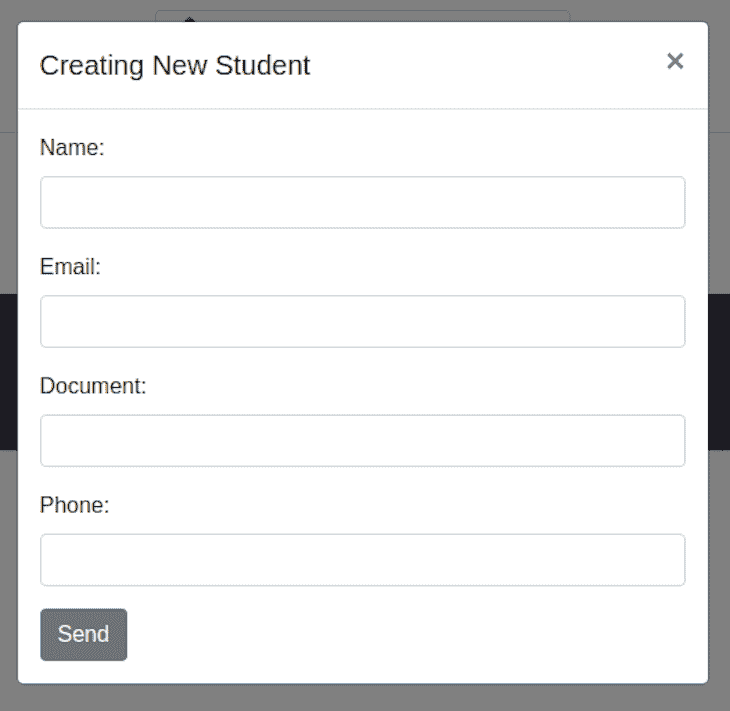

# 使用 React 和 Django 创建一个应用程序:教程-日志火箭博客

> 原文：<https://blog.logrocket.com/using-react-django-create-app-tutorial/>

***编者按:**本帖于 2022 年 7 月 15 日更新，以反映 React 和 Django 的最新版本，以及添加关于如何在 React 和 Django 之间发送数据的信息。*

Django 是目前最完整的 web 开发框架之一。它快速、安全且可扩展。借助 Python 的强大功能，我们几乎可以立即启动并运行应用程序。它管理一切，从数据库到最终发送到客户端的 HTML。

然而，随着单页面应用程序(SPAs)的出现，越来越常见的是创建这样的应用程序，它们使用 Django 只是为了提供一个 API 来响应在各种 JavaScript 框架中开发的应用程序所使用的 JSON 数据。

这种架构将前端和后端分开，允许两个接口更好地解耦，这样团队可以在各自的领域中完全独立地开发。

它还支持多个客户端应用程序与同一个 API 进行交互，同时确保数据完整性和业务规则，以及各种用户界面。

另一方面，两个不同的项目会产生更多的工作:两个独立的部署，两个要配置的环境，等等。简化的一个方法是使用 Django 自己的能力来服务静态文件。毕竟前端无非就是这种类型的一组文件。

在本文中，我们将概述如何使用 Django 及其著名的 Django REST 框架创建一个简单的 CRUD API，避免常见的跨源资源共享(CORS)问题。我们还将学习如何将 Django 与 React 应用程序集成。

我们将涵盖一切，从设置和配置到定制我们的前端组件和后端 API:

## 我们如何从 Django 发送数据以作出反应？

使用 Django，您可以用不同的方式公开您的 API。你可以使用 REST API、 [GraphQL API](https://docs.graphene-python.org/projects/django/en/latest/) ，或者 [RPC API](https://djangogrpcframework.readthedocs.io/en/latest/) ，每一个都有[自己的优缺点](https://main.grokoverflow.com/posts/2022/02-understanding-rpc-node-walkthrough)。虽然 GraphQL 是一个安全的赌注，但我们将使用传统的 REST 端点。

在本教程结束时，这将是我们的最终输出:



## 设置 Python 和 Django

对于本文，我们不打算介绍如何安装基本工具，所以在阅读本文之前，请务必查看一下您需要在计算机中设置的内容列表:

如果您使用的是 Linux，那么 Python 可能已经安装了。运行`python3 -V`命令进行检查。

在某些环境中，您可能已经安装了 Python 2 和 Python 3。在这种情况下，运行命令时应该使用`python3`而不是`python`。你可以通过安装 PyEnv 来切换`python`命令使用的 Python 版本，从而避免这种情况。

在本文中，我们还将利用一个名为 `[venv](https://docs.python.org/3/tutorial/venv.html)`的[便捷 Python 特性，也称为 Python 虚拟环境。这个特性基本上允许开发人员创建一个文件夹，其行为完全类似于特定的 Python 环境。](https://docs.python.org/3/tutorial/venv.html)

### 设置 Python

打开您首选的 IDE 到一个空目录，并按照我们开始的步骤进行操作。记住总是[给你的目录起一个好名字](https://stackoverflow.com/questions/52827722/folder-naming-convention-for-python-projects)。

让我们运行这个文件夹中的命令来创建我们的`venv`:

```
python -m venv logrocket_env

```

进入创建的文件夹后，你会看到其他一些文件，如`bin`、`lib`、`share`。这些文件保证您处于 Python 配置的独立环境中。要使用`bin`文件，您必须确保它已被激活:

```
source ./logrocket_env/bin/activate

```

然后您的命令行将看起来像下面的例子，括号中的名称确认您在`venv`中:

```
(logrocket_env) [email protected]: _

```

注意，一旦你进入`venv`，你可以正常使用命令`pip`或`python`。如果你在`venv`之外，你必须使用`pip3`和`python3`。

就是这样。你很适合和你的 venv 一起去。

### 建立姜戈

接下来，让我们通过在`venv`中运行以下命令来开始安装 Django :

```
pip install django djangorestframework django-cors-headers

```

请注意，我们正在为我们的 API 安装另外两个依赖项:

当我们试图从一个不同的应用程序访问 API 时，这些依赖关系非常有用。在这种情况下，它们帮助连接 Django 并做出反应。

我们还将利用 Django 的另外两个特性来帮助我们进行样板配置:`[django-admin](https://docs.djangoproject.com/en/4.0/ref/django-admin/)` [和](https://docs.djangoproject.com/en/4.0/ref/django-admin/) `[manage.py](https://docs.djangoproject.com/en/4.0/ref/django-admin/)`。

是 Django 的自动管理界面。它基本上是一个命令行实用程序，可以用 Django 执行方便的操作。

是一个脚本，它将帮助我们管理我们的数据库，从我们的模型中创建表格，处理迁移和版本控制，以及正确地创建我们的项目。

现在，我们将运行以下命令来创建我们的 API 项目——记住，您必须在`venv`中:

```
django-admin startproject django_react_proj

```

创建项目后，检查我们前面提到的`manage.py`文件的根文件夹。我们将进一步研究其余的文件。

让我们使用`django_react_proj/`文件夹中的`settings.py`文件开始我们的 Django 配置。当您打开这个文件时，您会看到许多配置。`INSTALLED_APPS`对我们来说很重要。

将以下三行添加到数组中:

```
INSTALLED_APPS = [
   ...
    'rest_framework',
    'corsheaders',
    'students'
]

```

这三行是我们之前安装的依赖项，以及将要创建的 API 文件夹的名称。

现在，将以下内容添加到`MIDDLEWARE`数组中:

```
MIDDLEWARE = [
    ....
    'corsheaders.middleware.CorsMiddleware',
    'django.middleware.common.CommonMiddleware',
]

```

这些对应于一个过滤器，它将拦截我们应用程序的所有请求，并对它们应用 CORS 逻辑。

然而，由于我们正在全力工作`localhost`，我们将通过向同一个文件添加以下内容来禁用 CORS 特性:

```
CORS_ORIGIN_ALLOW_ALL = True

```

太好了！现在，让我们继续讨论应用程序的模型和视图。

## 向 Django 添加模型和视图

为了创建一些预置文件，我们将再次使用`manage.py`脚本。这一次，运行以下命令:

```
django-admin startapp students

```

之后，将会创建一个`students/`文件夹，以及`models.py`和`views.py`。最初，这些文件中几乎没有内容。

让我们先删除当前在`models.py`文件中的所有内容，然后添加我们的模型:

```
from django.db import models

class Student(models.Model):
    name = models.CharField("Name", max_length=240)
    email = models.EmailField()
    document = models.CharField("Document", max_length=20)
    phone = models.CharField(max_length=20)
    registrationDate = models.DateField("Registration Date", auto_now_add=True)

    def __str__(self):
        return self.name

```

注意，我们的`Student`类是从 [Django 的](https://docs.djangoproject.com/en/3.0/ref/models/instances/#django.db.models.Model) `[Model](https://docs.djangoproject.com/en/3.0/ref/models/instances/#django.db.models.Model)` [类](https://docs.djangoproject.com/en/3.0/ref/models/instances/#django.db.models.Model)扩展而来的。一旦它直接连接到 Django 模型框架，我们将使用它来创建数据库表，这将使我们的生活更加轻松。

用正确的类型和配置来设置所有字段也很重要，包括`max length`(如果需要的话)、`description`、`autocreation`等。

## 将我们的 Django 模型迁移到数据库

现在，让我们通过 [Django 的迁移特性](https://blog.logrocket.com/making-django-migrations-python/)将模型导出到数据库中。

迁移是 Django 将您对模型所做的更改——比如添加一个字段或删除一个模型——传播到数据库模式中的一种方式。

它们被设计成大部分是自动的，但是您需要知道何时进行迁移，何时运行迁移，以及您可能会遇到哪些常见问题。

转到应用程序的根目录，运行以下命令:

```
python manage.py makemigrations

```

您将看到为对这些更改进行版本控制而创建的文件的名称和位置。然后，我们需要将更改应用到数据库本身:

```
python manage.py migrate

```

下一步是创建我们称之为数据迁移文件的东西。它代表了对数据库中数据的直接操作。要创建此文件，请运行以下命令:

```
python manage.py makemigrations --empty --name students students

```

请注意，版本控制是根据文件末尾的数字进行的，以保持顺序。

之后，转到`django_react_proj/students/migrations/`文件夹，将内容更改为:

```
from django.db import migrations

def create_data(apps, schema_editor):
    Student = apps.get_model('students', 'Student')
    Student(name="Joe Silver", email="[email protected]", document="22342342", phone="00000000").save()

class Migration(migrations.Migration):

    dependencies = [
        ('students', '0001_initial'),
    ]

    operations = [
        migrations.RunPython(create_data),
    ]

```

简而言之，`create_data`方法恢复`Student`模型对象并创建初始数据，这样当 API 启动时我们的数据库就不会为空。

`dependencies`属性将迁移过程中要考虑的其他文件联系起来。

`operations`基本上是一旦迁移被触发，Django 必须执行的动作。

现在，我们准备再次运行 migrate 命令。在`django_react_proj/`文件夹中，运行:

```
python manage.py migrate

```

## 深入我们的 Django REST API

现在是时候深入研究 REST API 了，我们将[在 Django REST 框架](https://blog.logrocket.com/django-rest-framework-create-api/)之上构建这个 API。在这里，您将接触到两个主要的世界:视图和 URL。视图是由 URL 提供服务的特定端点上的请求的初始入口点。

一旦我们将函数本身连接到端点，所有这些都由 Django REST 框架进行映射。我们还将[利用序列化器](http://www.django-rest-framework.org/api-guide/serializers/)。

它们允许将复杂的数据(如查询集和模型实例)转换成本地 Python 数据类型，然后可以很容易地呈现到 JSON 中。让我们从那里开始。

在`students/`文件夹中新建一个文件`serializers.py`，并添加以下内容:

```
from rest_framework import serializers
from .models import Student

class StudentSerializer(serializers.ModelSerializer):

    class Meta:
        model = Student 
        fields = ('pk', 'name', 'email', 'document', 'phone', 'registrationDate')

```

`Meta`类在这里很重要，因为它定义了我们的模型拥有的元数据信息(数据库),这些信息必须转换成`Student`类。

接下来，让我们打开位于`django_react_proj/`文件夹中的`urls.py`文件，并将其内容更改为以下内容:

```
from django.contrib import admin
from django.urls import path, re_path
from students import views

urlpatterns = [
    path('admin/', admin.site.urls),
    re_path(r'^api/students/$', views.students_list),
    re_path(r'^api/students/([0-9])$', views.students_detail),
]

```

路径已经存在。我们唯一添加的是`students`端点。注意，它们中的每一个都连接到一个将要创建的视图函数，所以这是我们路由请求的地方。

第一个端点将处理创建(`POST`)和列表(`GET`)。第二个将删除(`DELETE`)或更新(`PUT`)单个学生的数据。简单吧？

现在，让我们去看风景。打开`students/views.py`文件，复制以下代码:

```
from rest_framework.response import Response
from rest_framework.decorators import api_view
from rest_framework import status

from .models import Student
from .serializers import *

@api_view(['GET', 'POST'])
def students_list(request):
    if request.method == 'GET':
        data = Student.objects.all()

        serializer = StudentSerializer(data, context={'request': request}, many=True)

        return Response(serializer.data)

    elif request.method == 'POST':
        serializer = StudentSerializer(data=request.data)
        if serializer.is_valid():
            serializer.save()
            return Response(status=status.HTTP_201_CREATED)

        return Response(serializer.errors, status=status.HTTP_400_BAD_REQUEST)

@api_view(['PUT', 'DELETE'])
def students_detail(request, pk):
    try:
        student = Student.objects.get(pk=pk)
    except Student.DoesNotExist:
        return Response(status=status.HTTP_404_NOT_FOUND)

    if request.method == 'PUT':
        serializer = StudentSerializer(student, data=request.data,context={'request': request})
        if serializer.is_valid():
            serializer.save()
            return Response(status=status.HTTP_204_NO_CONTENT)
        return Response(serializer.errors, status=status.HTTP_400_BAD_REQUEST)

    elif request.method == 'DELETE':
        student.delete()
        return Response(status=status.HTTP_204_NO_CONTENT)

```

第一种方法是`students_list`，在我们的 API 的根端点上处理`GET`和`POST`操作。

这意味着每次我们通过带有`GET`和`POST` HTTP 动词的[HTTP://localhost:8000/API/students](http://localhost:8000/api/students)发出请求时，我们都会执行这个方法。

第一件事是通过`Student`对象获取我们模型中的所有学生。它为一个名为`object`的隐式对象提供了访问整个数据库的方法:`all()`。

然后，我们将结果传递给序列化程序，在我们将结果作为响应返回之前，序列化程序会负责转换过程。

对于`POST`方法，注意我们首先在序列化器上调用`is_valid()`方法，以确保接收的数据符合我们的模型。否则，序列化程序将在这里引发异常。如果一切正常，我们将其保存到数据存储区。

接下来的`PUT`和`DELETE`操作非常相似，只是改变了 HTTP 动词和响应。

就是这样！

## 测试我们在 Django 的端点

现在，让我们运行 Django 应用程序来测试这些端点。在根文件夹中运行以下命令:

```
python manage.py runserver

```

在您看到显示我们的服务器已经启动并运行的日志之后，进入浏览器并访问[http://localhost:8000/API/students/](http://localhost:8000/api/students/)。您会看到类似这样的内容:



你在这里看到的是 [Django 的可浏览 API](https://www.django-rest-framework.org/topics/browsable-api/) ，一个人性化的 HTML 输出，允许轻松浏览资源，以及向资源提交数据的表单。不需要使用`cURL`或其他 UI 工具，就可以很方便地测试你的端点。

您还可以通过图像底部的表单使用其他 HTTP 方法。继续玩吧。

## 构建 React 应用程序

现在是前端时间。

需要注意的是，我们不会在这里深入讨论 React 的细节，所以如果你是初学者，请花一些时间阅读 React 。本教程的重点是向您展示如何从 React 应用程序中快速使用 Django API。

在本文中，我们将使用 React 的最新版本。但是，请随意使用您喜欢的版本。我们也不会讨论 React 钩子的使用或 React 的其他特性，因为目的是 the API 消费本身。

一旦安装了 Node 和 npm，让我们在 Django 项目的根文件夹中运行以下命令来创建 React 应用程序:

```
npx create-react-app students-fe

```

如果你不知道`create-react-app`，[通读快速设置指南](https://blog.logrocket.com/create-react-app-a-quick-setup-guide-b812f0aad03c/)以获得一些帮助。

### CRUD 反应组件

我们将前端分成一些更小的组件，如下图所示:



标题组件将存储标题信息、徽标等。

home 组件将是我们的主容器，存储其他组件的剩余部分，比如表中的学生列表。

我们还将为表单添加两个组件。“更新”和“添加”表单将有几乎相同的组件，并将被放置在模态中。拥有这两个功能取决于现在哪个模态是活动的。



### 设置 React 应用程序以与 Django 集成

让我们直奔主题吧。我们将[使用 Bootstrap 和 React 为](https://blog.logrocket.com/using-bootstrap-with-react-tutorial-with-examples/)设计强大的`reactstrap`包。我们还将使用基于 promise 的 HTTP 客户端 [Axios 对我们的 Django API 进行 HTTP 请求调用](https://blog.logrocket.com/how-to-make-http-requests-like-a-pro-with-axios/)。

首先，我们将向我们的`students-fe`项目添加一些重要的依赖项，因此`cd`进入项目并运行以下命令:

```
npm install bootstrap reactstrap axios --save

```

接下来，转到`src/index.js`文件并添加以下导入语句:

```
import "bootstrap/dist/css/bootstrap.min.css";

```

在你的`src/`文件夹中，创建另一个名为`constants`的文件夹，然后是一个文件`index.js`。这个文件将存储 React 项目的实用程序常量。添加一个常量来保存我们的 API 的 URL:

```
export const API_URL = "http://localhost:8000/api/students/";

```

然后，让我们开始创建组件，从头部开始。

创建另一个名为`components`的文件夹，并在其中创建一个名为`Header.js`的 JavaScript 文件。增加以下内容:

```
import React, { Component } from "react";

class Header extends Component {
  render() {
    return (
      <div className="text-center">
        
        <hr />
        <h5>
          <i>presents</i>
        </h5>
        <h1>App with React + Django</h1>
      </div>
    );
  }
}

export default Header;

```

这是在 JSX 下表现的非常静态的 HTML。这里没什么值得注意的。

### 正在创建新的学生表单

现在，让我们改变策略，从最里面到最外面构建下一个组件。在同一个`components`文件夹中，创建一个名为`NewStudentForm.js`的新文件，并添加以下内容:

```
import React from "react";
import { Button, Form, FormGroup, Input, Label } from "reactstrap";

import axios from "axios";

import { API_URL } from "../constants";

class NewStudentForm extends React.Component {
  state = {
    pk: 0,
    name: "",
    email: "",
    document: "",
    phone: ""
  };

  componentDidMount() {
    if (this.props.student) {
      const { pk, name, document, email, phone } = this.props.student;
      this.setState({ pk, name, document, email, phone });
    }
  }

  onChange = e => {
    this.setState({ [e.target.name]: e.target.value });
  };

  createStudent = e => {
    e.preventDefault();
    axios.post(API_URL, this.state).then(() => {
      this.props.resetState();
      this.props.toggle();
    });
  };

  editStudent = e => {
    e.preventDefault();
    axios.put(API_URL + this.state.pk, this.state).then(() => {
      this.props.resetState();
      this.props.toggle();
    });
  };

  defaultIfEmpty = value => {
    return value === "" ? "" : value;
  };

  render() {
    return (
      <Form onSubmit={this.props.student ? this.editStudent : this.createStudent}>
        <FormGroup>
          <Label for="name">Name:</Label>
          <Input
            type="text"
            name="name"
            onChange={this.onChange}
            value={this.defaultIfEmpty(this.state.name)}
          />
        </FormGroup>
        <FormGroup>
          <Label for="email">Email:</Label>
          <Input
            type="email"
            name="email"
            onChange={this.onChange}
            value={this.defaultIfEmpty(this.state.email)}
          />
        </FormGroup>
        <FormGroup>
          <Label for="document">Document:</Label>
          <Input
            type="text"
            name="document"
            onChange={this.onChange}
            value={this.defaultIfEmpty(this.state.document)}
          />
        </FormGroup>
        <FormGroup>
          <Label for="phone">Phone:</Label>
          <Input
            type="text"
            name="phone"
            onChange={this.onChange}
            value={this.defaultIfEmpty(this.state.phone)}
          />
        </FormGroup>
        <Button>Send</Button>
      </Form>
    );
  }
}

export default NewStudentForm;

```

在这里，我们有一些重要的事情正在进行。

在第一行中，我们第一次导入了一些`reactstrap`组件，包括`Form`、`Button`，以及其他将组成我们表单的组件。

然后，我们用我们的`NewStudentForm`模型的相应属性创建了我们的`state`对象。这将有助于单独操纵每个道具。

`componentDidMount`函数将在组件完成启动后运行，因此我们可以在这里从父组件(`this.props`)中恢复学生的`props`，并用它们设置`state`(如果它们存在，用于编辑场景。)

`onChange`函数将用每个字段中输入的当前值来处理每个`state`道具的更新。

`createStudent`函数将处理表单的 HTTP `POST`请求。每次我们按下“提交”按钮，这个函数就会被调用，触发 Axios 的`post()`函数并传递请求的`body.`中的当前`state`

一旦完成，我们将调用两个`props`函数:`resetState`刷新表格，和`toggle`关闭模态。我们稍后将讨论如何创建这些。

### 处理编辑学生信息的模式

`editStudent`函数的工作方式几乎与前一个一样，但是调用了我们的`PUT`操作。

`defaultIfEmpty`函数是作为一个辅助函数创建的，它将检查每个字段的当前值，以便在创建新学生时确定是否要用`state`的值填充它们(如果存在的话，用于编辑)。

`render`函数将在`reactstrap`组件的帮助下合成我们的表单。注意`onSubmit`属性，它检查名为`student`的`props`属性。如果属性存在，提交函数将用于编辑(值由父组件传递)；否则就是为了创作。

接下来，我们将注意力转向包含我们刚刚创建的表单的模态组件。为此，创建一个名为`NewStudentModal.js`的新组件文件，并添加以下代码:

```
import React, { Component, Fragment } from "react";
import { Button, Modal, ModalHeader, ModalBody } from "reactstrap";
import NewStudentForm from "./NewStudentForm";

class NewStudentModal extends Component {
  state = {
    modal: false
  };

  toggle = () => {
    this.setState(previous => ({
      modal: !previous.modal
    }));
  };

  render() {
    const create = this.props.create;

    var title = "Editing Student";
    var button = <Button onClick={this.toggle}>Edit</Button>;
    if (create) {
      title = "Creating New Student";

      button = (
        <Button
          color="primary"
          className="float-right"
          onClick={this.toggle}
          style={{ minWidth: "200px" }}
        >
          Create New
        </Button>
      );
    }

    return (
      <Fragment>
        {button}
        <Modal isOpen={this.state.modal} toggle={this.toggle}>
          <ModalHeader toggle={this.toggle}>{title}</ModalHeader>

          <ModalBody>
            <NewStudentForm
              resetState={this.props.resetState}
              toggle={this.toggle}
              student={this.props.student}
            />
          </ModalBody>
        </Modal>
      </Fragment>
    );
  }
}

export default NewStudentModal;

```

这一次，我们创建的唯一的`state`道具是模态的`state`,以便检查它是必须打开还是关闭。

`toggle`函数(我们的表单作为参数接收的函数)会在每次调用时将当前模态的值切换到相反的值。

在`render`函数中，我们首先检查一个`create`布尔值是否作为一个参数从父调用者传递来，以决定按钮是用于编辑还是创建。这些按钮是根据家长对我们说的话动态创建的。

然后，`Modal`组件可以在这些条件下进一步安装。注意我们将刚刚创建的`<NewStudentForm />`组件放在哪里。

### 创建学生列表

`NewStudentModal`组件将被放入我们现在要创建的`StudentList.js`中:

```
import React, { Component } from "react";
import { Table } from "reactstrap";
import NewStudentModal from "./NewStudentModal";

import ConfirmRemovalModal from "./ConfirmRemovalModal";

class StudentList extends Component {
  render() {
    const students = this.props.students;
    return (
      <Table dark>
        <thead>
          <tr>
            <th>Name</th>
            <th>Email</th>
            <th>Document</th>
            <th>Phone</th>
            <th>Registration</th>
            <th></th>
          </tr>
        </thead>
        <tbody>
          {!students || students.length <= 0 ? (
            <tr>
              <td colSpan="6" align="center">
                <b>Ops, no one here yet</b>
              </td>
            </tr>
          ) : (
            students.map(student => (
              <tr key={student.pk}>
                <td>{student.name}</td>
                <td>{student.email}</td>
                <td>{student.document}</td>
                <td>{student.phone}</td>
                <td>{student.registrationDate}</td>
                <td align="center">
                  <NewStudentModal
                    create={false}
                    student={student}
                    resetState={this.props.resetState}
                  />
                  &nbsp;&nbsp;
                  <ConfirmRemovalModal
                    pk={student.pk}
                    resetState={this.props.resetState}
                  />
                </td>
              </tr>
            ))
          )}
        </tbody>
      </Table>
    );
  }
}

export default StudentList;

```

在这里，焦点是明确的`students`列表，而不是别的。注意不要混淆不属于这里的不同逻辑和规则。

这个组件的核心是对我们将从父组件(`Home`)接收的`students`属性的迭代。`map`函数将通过提供一个变量(`student`)让我们访问每个值来处理迭代。

再来看一下`NewStudentModal`和`ConfirmRemovalModal`组件，它们就放在最后一个`<td>`的下面。

以下是`ConfirmRemovalModal`组件的内容:

```
import React, { Component, Fragment } from "react";
import { Modal, ModalHeader, Button, ModalFooter } from "reactstrap";

import axios from "axios";

import { API_URL } from "../constants";

class ConfirmRemovalModal extends Component {
  state = {
    modal: false
  };

  toggle = () => {
    this.setState(previous => ({
      modal: !previous.modal
    }));
  };

  deleteStudent = pk => {
    axios.delete(API_URL + pk).then(() => {
      this.props.resetState();
      this.toggle();
    });
  };

  render() {
    return (
      <Fragment>
        <Button color="danger" onClick={() => this.toggle()}>
          Remove
        </Button>
        <Modal isOpen={this.state.modal} toggle={this.toggle}>
          <ModalHeader toggle={this.toggle}>
            Do you really wanna delete the student?
          </ModalHeader>

          <ModalFooter>
            <Button type="button" onClick={() => this.toggle()}>
              Cancel
            </Button>
            <Button
              type="button"
              color="primary"
              onClick={() => this.deleteStudent(this.props.pk)}
            >
              Yes
            </Button>
          </ModalFooter>
        </Modal>
      </Fragment>
    );
  }
}

export default ConfirmRemovalModal;

```

这个组件也很简单；它托管删除操作。我们称这个为我们的`DELETE`端点。

因为它也是模态的，所以我们也必须有状态的`modal`属性，以及`toggle`函数。
`deleteStudent`函数将处理 HTTP 调用来删除给定的学生。

代码的其余部分与我们已经看到的非常相似。

### 处理家庭组件

现在让我们构建我们的`Home.js`组件。创建文件，并向其中添加以下内容:

```
import React, { Component } from "react";
import { Col, Container, Row } from "reactstrap";
import StudentList from "./StudentList";
import NewStudentModal from "./NewStudentModal";

import axios from "axios";

import { API_URL } from "../constants";

class Home extends Component {
  state = {
    students: []
  };

  componentDidMount() {
    this.resetState();
  }

  getStudents = () => {
    axios.get(API_URL).then(res => this.setState({ students: res.data }));
  };

  resetState = () => {
    this.getStudents();
  };

  render() {
    return (
      <Container style={{ marginTop: "20px" }}>
        <Row>
          <Col>
            <StudentList
              students={this.state.students}
              resetState={this.resetState}
            />
          </Col>
        </Row>
        <Row>
          <Col>
            <NewStudentModal create={true} resetState={this.resetState} />
          </Col>
        </Row>
      </Container>
    );
  }
}

export default Home;

```

在这里，我们的`state`将托管我们将从服务器恢复的`students`的数组。

`resetState`函数(我们在前面调用过)将只调用`getStudents`，T1 又调用我们的 API 中的`GET`端点和完整的学生列表。

清单的其余部分指的是使用`StudentList`和`NewStudentModal`组件。请自行组织您的组件展览。

接下来是测试我们的应用程序之前的最后一步。将`Header`和`Home`组件导入到我们的`App.js`文件中:

```
import React, { Component, Fragment } from "react";
import Header from "./components/Header";
import Home from "./components/Home";

class App extends Component {
  render() {
    return (
      <Fragment>
        <Header />
        <Home />
      </Fragment>
    );
  }
}

export default App;

```

现在，运行命令`npm start`，您的 React 应用程序将打开浏览器到 http://localhost:3000/ URL。确保您的 Django API 已经启动并运行。

## 结论

你可以[在这里](https://github.com/diogosouza/django-react-logrocket)访问这个项目的完整源代码。

当然，这只是一种方法。使用 React 的好处是，您可以用多种不同的方式组织组件(或者甚至在现有组件的基础上创建更多组件)来实现相同的目标。

在 SPAs 的世界中，您的后端 API 实际上完全独立于前端客户端。这给了你改变整个 API 架构的灵活性(比如从 Django 切换到 [Flask](https://github.com/pallets/flask) ，而不会对你的 React 应用产生任何副作用。

作为一个挑战，尝试给你的 API/React 应用添加一个[分页系统](https://blog.logrocket.com/4-ways-to-render-large-lists-in-react/)。Django REST 框架提供了对[可定制分页样式](https://www.django-rest-framework.org/api-guide/pagination/)的支持。

## 使用 LogRocket 消除传统反应错误报告的噪音

[LogRocket](https://lp.logrocket.com/blg/react-signup-issue-free)

是一款 React analytics 解决方案，可保护您免受数百个误报错误警报的影响，只针对少数真正重要的项目。LogRocket 告诉您 React 应用程序中实际影响用户的最具影响力的 bug 和 UX 问题。

[ ](https://lp.logrocket.com/blg/react-signup-general) [  ](https://lp.logrocket.com/blg/react-signup-general) [LogRocket](https://lp.logrocket.com/blg/react-signup-issue-free)

自动聚合客户端错误、反应错误边界、还原状态、缓慢的组件加载时间、JS 异常、前端性能指标和用户交互。然后，LogRocket 使用机器学习来通知您影响大多数用户的最具影响力的问题，并提供您修复它所需的上下文。

关注重要的 React bug—[今天就试试 LogRocket】。](https://lp.logrocket.com/blg/react-signup-issue-free)