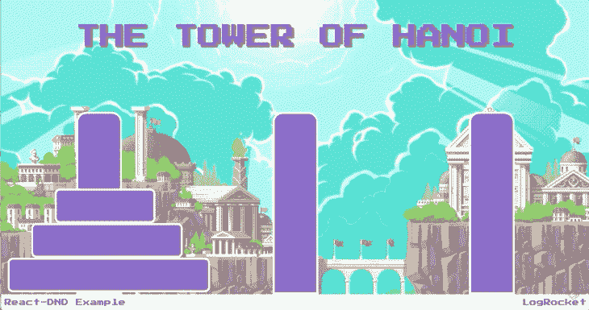
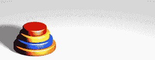
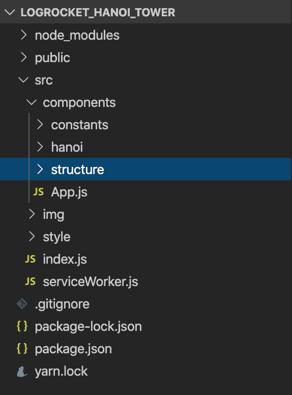

# 使用 react-dnd 创建汉诺塔游戏日志博客

> 原文：<https://blog.logrocket.com/using-react-dnd-to-create-a-tower-of-hanoi-game/>

拖放功能已经存在很多年了。

自从 jQuery 和 DOM 操作的出现，使得事情变得可拖动并为它们创建可放置的位置变得容易多了。

如今，像 Gmail、Dropbox 和微软这样的公司似乎热衷于使用这一成熟的功能，通过利用大量不同的库和技术来实现各种效果。

他们还利用拖放功能允许用户上传文件。

它甚至超越了这一点，UI/UX 专业人员可以根据用户的偏好和行为来衡量何时需要这种效果。

说到反应，三个主要的图书馆似乎已经接受了这个世界:

*   React-beautiful-dnd:React 开发者中最受欢迎的(可能是因为受到了 Atlassian 的照顾)，它已经成熟并拥有广泛的社区
*   [react-dnd](https://github.com/react-dnd/react-dnd) :本文之所以关注它，是因为它有处理拖放的强大 API
*   [react-grid-layout](https://github.com/STRML/react-grid-layout) :依赖大量网格和复杂堆栈结构的人的最佳选择

在本文中，我们将避开这个库的常见用法，它用于[文件上传](https://blog.logrocket.com/drag-and-drop-in-react/)或类似的功能。

相反，我们将开发一个游戏:著名的河内塔。

这是我们完成后的样子:



The final game.

## 河内塔基础

如果你不熟悉这个谜题，那么 Hanoi Tower 是许多计算机科学专业的学生在刚开始学习如何编程时玩和开发的经典游戏，特别是因为它很容易编码。



该游戏由三个或更多的圆盘或瓦片在一个初始塔中相互堆叠而成。

它们从最大到最小的磁盘开始堆叠。您可以移除它们并将它们拖到另一个塔上。

这些是规则:

*   一次只能移动一个磁盘
*   只能将磁盘移动到空塔或已有其他磁盘的塔的顶部
*   您只能将磁盘放在更大的磁盘上。

目标是以尽可能少的移动次数将整堆磁盘从一个塔移动到另一个塔。

### 关于 react-dnd 的一点信息

[react-dnd](https://react-dnd.github.io/react-dnd/docs/overview) 的文档非常简单，容易理解。

在我们继续编码之前，我们需要首先理解一些关键概念。

#### 后端

它们是使用拖放的抽象下的 API。

我们有一个公共接口，它的功能可以在任何类型的设备上重写，这取决于哪个设备实现了抽象。

对于本教程，我们将利用 [HTML5 拖放 API](https://developer.mozilla.org/en-US/docs/Web/Guide/HTML/Drag_and_drop) 作为游戏应用的后端。

#### 班长

拖放东西与维护状态有着内在的联系。

换句话说，每次你把一个组件从一个地方拖到另一个地方，你实际上是在移动数据。数据需要保存在状态中。

监视器是该状态的包装器，允许您在组件上进行拖放操作时恢复和管理组件的数据。

#### 连接器

顾名思义，我们需要一些东西来连接两个世界:React 组件和 DOM 节点，它们实际上执行物理拖放操作。

它告诉我们，最终哪一个是有效的拖放元素或拖放目标。

#### 拖放源和目标

您很快就会看到，这些也是拖放装饰器各自的 React 组件名称。

* * *

### 更多来自 LogRocket 的精彩文章:

* * *

它们代表了我们已经讨论过的 API 的主要抽象，注入值并执行拖放的回调操作。

#### 高阶组件和装饰器

所有这些逻辑都需要封装到更高的组件中，这些组件代表您和您的 React 架构的逻辑划分。

[高阶组件](https://medium.com/@dan_abramov/mixins-are-dead-long-live-higher-order-components-94a0d2f9e750)获取它们需要的东西来连接所有的`react-dnd`拖放操作，并返回一个 lib 可识别的新组件。

换句话说，我们将创建的组件类注释了 DnD 逻辑并返回一个有效的 DnD 组件。

## 项目设置

为了完成本教程，您需要在您的机器上正确安装并运行[节点](https://nodejs.org/en/)、 [npm](https://www.npmjs.com/) 和 [npx](https://www.npmjs.com/package/npx) 。如果你还没有这样做，那就去做吧。

我们还将使用 [Yarn](https://classic.yarnpkg.com/en/docs/install/) 作为包管理器，因为它简单明了。确保您拥有最新版本。

我们将利用 [create-react-app](https://github.com/facebook/create-react-app) 来搭建我们的应用程序并简化初始配置。

在您选择的目录中，运行以下命令:

```
npx create-react-app logrocket-hanoi-tower
cd logrocket-hanoi-tower
yarn start
```

这将启动默认应用程序，并在您的浏览器中打开它。

接下来，我们需要将`react-dnd`依赖项添加到项目中。

为此，在根文件夹中运行以下命令:

```
yarn add styled-components react-dnd react-dnd-html5-backend
```

请注意，我们添加了另外两个依赖项:

*   [styled-components](https://styled-components.com/) 方便我们对组件进行样式化，因为我们不需要添加显式的 CSS 文件
*   [react-dnd-html5-backend](https://react-dnd.github.io/react-dnd/docs/backends/html5) 配合`react-dnd`用于网络浏览器(移动设备尚不支持)

## 给我看看代码

现在我们来看看代码。

但首先，让我展示一下项目架构:



### 项目目录

我们基本上有三个主要文件夹。第一个是组件和常量，我们需要它们来存储数据，比如瓦片和塔的高度等等。

第二个文件夹将保存图像，第三个文件夹将包含样式。我们还有一个用于主体和一般样式的 CSS 文件。

让我们从常量开始，因为我们将在其余的代码中用到它们。

创建一个名为`Constants.js`的新 JavaScript 文件，并添加以下代码:

```
const NUM_TILES = 3;
const TOWER_WIDTH = `${30 * NUM_TILES}px`;
const HEADER_HEIGHT = "8rem";
const FOOTER_HEIGHT = "2rem";
const HANOI_HEIGHT = `(100vh - ${HEADER_HEIGHT} - ${FOOTER_HEIGHT})`;
const TOWER_HEIGHT = `(${TOWER_WIDTH} * ${NUM_TILES}) * 1.3`;
const TILE_HEIGHT = `(${TOWER_HEIGHT} / 12)`;

const getWidth = () => {
    switch (NUM_TILES) {
        case 1:
            return 13;
        case 2:
            return 10.5;
        case 3:
            return 8;
        default:
            return 3;
    }
};

const TILE_WIDTH_BASE = getWidth();

export default {
    TOWER_WIDTH,
    HEADER_HEIGHT,
    FOOTER_HEIGHT,
    HANOI_HEIGHT,
    TOWER_HEIGHT,
    TILE_HEIGHT,
    TILE_WIDTH_BASE,
    NUM_TILES
};
```

这里有很多，但不要被愚弄:它只是常量来设置默认的和/或自动生成的高度、宽度和我们将拥有的瓷砖数量的值。

由于浏览器页面将是我们的游戏背景，每个显示器都有不同的尺寸，我们需要实时计算每个组件的放置位置，特别是在重新确定尺寸和响应的情况下。

为了简单起见，我们的游戏最多只有 3 张牌。

然而，你可以在任何时候改变这个常数，看看游戏在增加难度后的表现。

第二个 JavaScript 文件叫做`Types.js`。这个文件将简单地存储我们在场景中的元素类型。

现在，这只是意味着瓷砖:

```
export const TILE = "tile"
```

接下来的两个组件是战略性的，主要是因为它们的名字。

现在，我们需要一个塔和一块瓷砖。先说`Tile.js`:

```
import React, { Component } from "react";
import { DragSource } from "react-dnd";

import Constants from "../constants/Constants";
import { TILE } from "../constants/Types";

const tile = {
    beginDrag({ position }) {
        return { position };
    }
};

const collect = (connect, monitor) => ({
    dragSource: connect.dragSource(),
    dragPreview: connect.dragPreview(),
    isDragging: monitor.isDragging()
});

class Tile extends Component {
    render() {
        const { position, dragSource, isDragging } = this.props;
        const display = isDragging ? "none" : "block";
        const opacity = isDragging ? 0.5 : 1;
        const width = `(${Constants.TOWER_WIDTH} + ${position * 100}px)`;
        const offset = `${(position * Constants.TILE_WIDTH_BASE) / 2}vw`;

        const tileStyle = {
            display: display,
            opacity: opacity,
            height: "60px",
            width: `calc(${width})`,
            transform: `translateX(calc(${offset} * -1))`,
            border: "4px solid white",
            borderRadius: "10px",
            background: "#764abc"
        };

        return dragSource(<div style={tileStyle} position={position} />);
    }
}

export default DragSource(TILE, tile, collect)(Tile);
```

Tile 是表示我们的拖动元素(`DragSource`)的第一个高阶分量。我们把瓷砖拖进塔里。

注意，在代码的结尾，我们的`DragSource`声明需要一些参数:

*   第一个与源的类型有关(字符串常量)
*   第二个与源契约实现相关，它由两个函数组成:
    *   `beginDrag`:唯一需要的函数，返回描述被拖动项目的数据
    *   `endDrag`:可选函数，在拖动操作结束时调用
*   第三个是收集函数，它负责指定将哪些道具注入到组件中，以及管理当前的拖动状态

实现的其余部分与样式相关。它将我们的 CSS 样式应用于 tile 组件。

现在让我们来看看我们的`Tower.js`代码。将以下内容放入文件中:

```
import React, { Component } from "react";
import { DropTarget } from "react-dnd";

import Tile from "./Tile";
import Constants from "../constants/Constants";
import { TILE } from "../constants/Types";

const towerTarget = {
    canDrop({ isMoveValid, isTheLatter }, monitor) {
        const isOver = monitor.isOver();
        const position = monitor.getItem().position;
        const tileIsTheLatter = isTheLatter(position);
    const target = parseInt(monitor.targetId.substr(1)) + 1;

        return isOver && tileIsTheLatter ? isMoveValid(position, target) : false;
    },

    drop({ removeTile, addTile }, monitor) {
        const position = monitor.getItem().position;
        const target = parseInt(monitor.targetId.substr(1)) + 1;
        removeTile(position);
        addTile(position, target);
    }
};

const collect = (connect, monitor) => ({
    dropTarget: connect.dropTarget(),
    canDrop: monitor.canDrop(),
    isOver: monitor.isOver()
});

class Tower extends Component {
    render() {
        const background = this.props.isOver ? `#800` : `#764abc`;
        const style = {
      height: `calc(${Constants.TOWER_HEIGHT})`,
      border: "4px solid white",
            borderRadius: "20px 20px 0 0",
            display: "grid",
            alignContent: "flex-end",
            background: background
        };

        return this.props.dropTarget(
            <div style={style}>
                {this.props.tiles && this.props.tiles.map(tile => <Tile key={tile.id} position={tile.id} />)}
            </div>
        );
    }
}

export default DropTarget(TILE, towerTarget, collect)(Tower);
```

drop target — `DropTarget` —类，非常类似于涉及合同和签名的拖动源。

第一个函数`canDrop`，检查是否允许当前删除操作的布尔值。

这里必须满足三个条件:

*   拖动源必须在放置目标之上
*   被移动的瓷砖必须是塔的后者(顶部的一个)
*   并且移动必须在其验证函数中为真(稍后将在`App.js`中创建)。

反过来，`drop`函数会将当前的方块从它所在的塔上移除，然后将其添加到新塔上。

这些函数的实现将在 App.js 文件中进行，因为我们需要在与状态相同的地方执行这些操作。

在该文件夹下创建的最后一个文件是`HanoiTower.js`:

```
import React, { Component, Fragment } from "react";
import Tower from "./Tower";
import Constants from "../constants/Constants";

class HanoiTower extends Component {
    render() {
        return (
            <div style={style}>
                {this.props.towers.map(curr => {
                    return (
                        <Fragment key={curr.id}>
                            <div />
                            <Tower
                                tiles={curr.tiles}
                                removeTile={tileId => this.props.removeTile(tileId)}
                                addTile={(tileId, towerId) =>
                                    this.props.addTile(tileId, towerId)
                                }
                                isMoveValid={(tileId, towerId) =>
                                    this.props.isMoveValid(tileId, towerId)
                                }
                                isTheLatter={tileId => this.props.isTheLatter(tileId)}
                            />
                        </Fragment>
                    );
                })}
            </div>
        );
    }
}

const style = {
    height: Constants.HANOI_HEIGHT,
    display: "grid",
    gridTemplateColumns: `
    1fr 
    ${Constants.TOWER_WIDTH}
    2fr
    ${Constants.TOWER_WIDTH}
    2fr
    ${Constants.TOWER_WIDTH}
    1fr
  `,
    alignItems: "flex-end"
};

export default HanoiTower;
```

这个类代表了游戏的根组件。在`App.js`之后，该组件将聚集其他内部组件调用。

它将游戏的网格风格放到构成它的主 div 中。

请注意，我们正在对来自主状态(待创建)的塔阵列进行迭代。

取决于我们有多少塔，这将是游戏屏幕上放置的桩的数量。

代码的其余部分是组件本身的样式。

接下来的两个组件是简单的结构。

他们将决定页眉和页脚在游戏中的显示方式。

只是为了让事情变得更美好，更有条理。这里有`Header.js`的代码(在结构文件夹内):

```
import React, { Component } from "react";

class Header extends Component {
    render() {
        return (
            <header
                style={{
                    display: "flex",
                    justifyContent: "center",
                    alignItems: "flex-end"
                }}
            >
                <h1
                    style={{
                        color: "#764abc",
                        fontSize: "3em",
                        fontWeight: "bold",
                        textShadow: "2px 2px 2px black"
                    }}
                >
                    THE TOWER OF HANOI
                </h1>
            </header>
        );
    }
}

export default Header;
```

这只是样式化的组件 CSS 配置。仅此而已。

以下是`Footer.js`的代码:

```
import React, { Component } from "react";

class Footer extends Component {
    render() {
        const defaultStyle = {
            color: "#764abc",
            fontWeight: "bold"
        };

        return (
            <footer
                style={{
                    padding: "0.5em",
                    display: "flex",
                    justifyContent: "space-between",
                    alignItems: "center",
                    fontSize: "14px",
                    backgroundColor: "white"
                }}
            >
                <p>
                    <span style={defaultStyle}>React-DND Example</span>
                </p>
                <p>
                    <span style={defaultStyle}>LogRocket</span>
                </p>
            </footer>
        );
    }
}

export default Footer;
```

您可以随意定制这些组件。

最后，我们来分析一下我们的`App.js`文件的代码。

为了让我们之前配置的拖放组件工作，我们需要提供一个`DnDProvider`来封装 DnD 代码的其余部分。

```
import React, { Component } from "react";
import HanoiTower from "./hanoi/HanoiTower";
import Header from "./structure/Header";
import Footer from "./structure/Footer";
import Constants from "./constants/Constants";

import { DndProvider } from "react-dnd";
import HTML5Backend from "react-dnd-html5-backend";

class App extends Component {
    constructor(props) {
        super(props);

        this.state = {
            towers: [
                { id: 1, tiles: [] },
                { id: 2, tiles: [] },
                { id: 3, tiles: [] }
            ]
        };
    }

    componentDidMount = () => {
        const tiles = [];
        for (let id = 1; id <= Constants.NUM_TILES; id++) {
            tiles.push({ id: id });
        }

        this.setState({
            towers: [
                { id: 1, tiles: tiles },
                { id: 2, tiles: [] },
                { id: 3, tiles: [] }
            ]
        });
    };

    removeTile = tileId => {
        var towerId = null;
        this.setState(prevState => {
            prevState.towers.forEach(tower => {
                tower.tiles = tower.tiles.filter(tile => {
                    if (tile.id === tileId) {
                        towerId = tower.id;
                        return false;
                    } else {
                        return true;
                    }
                });
            });

            return {
                towers: prevState.towers
            };
        });
        return towerId;
    };

    addTile = (tileId, towerId) => {
        this.setState(prevState => ({
            towers: prevState.towers.map(tower => {
                tower.id === towerId && tower.tiles.unshift({ id: tileId });

                return tower;
            })
        }));
    };

    isMoveValid = (tileId, towerId) => {
        var tower = this.state.towers[towerId - 1];
        if (tower.tiles.length === 0 || tileId < tower.tiles[0].id) {
            return true;
        } else if (tileId > tower.tiles[0].id || tileId === tower.tiles[0].id) {
            return false;
        }
    };

    isTheLatter = tileId => {
        let tileIsTheLatter = false;
        this.state.towers.forEach(tower => {
            if (tower.tiles.length !== 0 && tower.tiles[0].id === tileId) {
                tileIsTheLatter = true;
            }
        });
        return tileIsTheLatter;
    };

    isVictory = () => {
        const { towers } = this.state;
        return (
            towers[1].tiles.length === Constants.NUM_TILES ||
            towers[2].tiles.length === Constants.NUM_TILES
        );
    };

    render() {
        return (
            <div style={layoutStyle}>
                <DndProvider backend={HTML5Backend}>
                    <Header />
                    <HanoiTower
                        towers={this.state.towers}
                        removeTile={this.removeTile}
                        addTile={this.addTile}
                        isMoveValid={this.isMoveValid}
                        isTheLatter={this.isTheLatter}
                    />
                    {this.isVictory() && alert("Victory!")}
                    <Footer />
                </DndProvider>
            </div>
        );
    }
}

const layoutStyle = {
    display: "grid",
    gridTemplateRows: `
    ${Constants.HEADER_HEIGHT}
    calc(${Constants.HANOI_HEIGHT})
    ${Constants.FOOTER_HEIGHT}
  `
};

export default App;
```

让我们分解一些东西。

首先要注意的是构造函数。

它放置我们的状态——因为我们没有使用 Redux 或任何其他状态管理库——我们将使用旧的 React 方式，通过沿着组件层次结构传递的属性来操作状态值。

我们的 towers 数组将只包含三个元素(如果您想增加这个值，请记住更改 Constants 类)。

一旦组件安装完毕，我们需要用第一个塔内的瓦片堆栈启动我们的阵列。

`componentDidMount`函数会处理这些。

然后，我们有内部组件将使用的辅助功能:

#### `removeTile`

通过迭代我们的 towers 数组并搜索相应的 tile id(作为 param 传递)来设置新的状态。

#### `addTile`

通过 unshift 函数(将值添加到数组的开头)将传递的添加到相应所选塔的图块数组，从而设置新状态。

#### `isMoveValid`

检查游戏的基本规则，例如玩家是否试图将较小的方块丢到较大的方块上，等等。

#### `isVictory`

检查当前状态的塔阵列的情况，以查看玩家是否赢得了游戏。

代码的结尾只是使用导入的`DnDProvider`，将`HTML5Backend`作为后端传递给提供者。

还要注意的是，每当这个组件重新呈现时，我们检查`isVictory`函数，看看是否必须显示一条警告消息。

缺少的只是我们在游戏中使用的背景图片(你可以通过 GitHub 项目链接下载，可在文章末尾找到)；和`style.css`代码:

```
html,
body {
    margin: 0;
    padding: 0;
    border: 0;
    font-family: "Press Start 2P", sans-serif;
    background-image: url(../img/bg.gif);
    background-size: cover;
    background-repeat: no-repeat;
}
```

另外，不要忘记将`style.css`文件导入到您的`index.js`文件中:

```
import React from "react";
import ReactDOM from "react-dom";
import App from "./components/App";
import "./style/style.css";

import * as serviceWorker from './serviceWorker';

const mountNode = document.getElementById("root");

ReactDOM.render(<App />, mountNode);

// If you want your app to work offline and load faster, you can change
// unregister() to register() below. Note this comes with some pitfalls.
// Learn more about service workers: https://bit.ly/CRA-PWA
serviceWorker.unregister();
```

## 结论

就是这样。你可以在 GitHub 获得完整的源代码[。](https://github.com/diogosouza/logrocket-hanoi-tower)

在本教程中，我们已经配置并了解了这个强大的库是如何工作的。

我再一次强调，仔细阅读官方文档是多么的重要。

您可以通过添加一些菜单来改进游戏，一个挑战用户的计时器，一个允许用户在游戏开始时输入他们想要玩多少瓷砖的选项。

关于`react-dnd`，在他们的官方网站上有很多[更多的例子](https://react-dnd.github.io/react-dnd/examples)，你可以在你的应用中寻找新的功能时使用。

## 使用 LogRocket 消除传统反应错误报告的噪音

[LogRocket](https://lp.logrocket.com/blg/react-signup-issue-free)

是一款 React analytics 解决方案，可保护您免受数百个误报错误警报的影响，只针对少数真正重要的项目。LogRocket 告诉您 React 应用程序中实际影响用户的最具影响力的 bug 和 UX 问题。

[ ](https://lp.logrocket.com/blg/react-signup-general) [  ](https://lp.logrocket.com/blg/react-signup-general) [LogRocket](https://lp.logrocket.com/blg/react-signup-issue-free)

自动聚合客户端错误、反应错误边界、还原状态、缓慢的组件加载时间、JS 异常、前端性能指标和用户交互。然后，LogRocket 使用机器学习来通知您影响大多数用户的最具影响力的问题，并提供您修复它所需的上下文。

关注重要的 React bug—[今天就试试 LogRocket】。](https://lp.logrocket.com/blg/react-signup-issue-free)