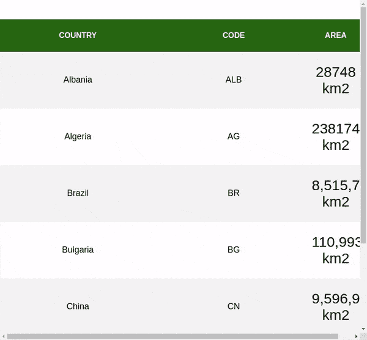

# 使用 React 钩子创建粘性标题

> 原文：<https://blog.logrocket.com/using-react-hooks-to-create-sticky-headers/>

对于许多开发人员来说，在 CSS 属性`position: sticky`之前实现一个粘滞表头是一个挑战。在这篇文章中，我们将研究如何使用 React 钩子构建一个粘性头。

## 介绍

在为表格创建粘性标题时，大多数前端开发人员使用`<table />`组件和 CSS `position`属性，然而，在这篇文章中，我们将使用本机 React 挂钩构建一个带有粘性标题的表格。

## 先决条件

本教程假设读者已经:

*   [Node.js](https://nodejs.org/en/download/) 和 NPM 安装在你的机器上
*   JavaScript 的基础知识以及[如何反应](https://reactjs.org/)如何工作

首先安装官方的 React 应用支架工具，`create-react-app`:

```
npm install -g create-react-app

```

您可以通过运行`create-react-app`来验证安装。这应该会要求您指定目录名，在我们的例子中，我们将构建一个带有粘性头的国家表，这个粘性头是由 React Hooks 构建的。我们将把应用程序构建成一个`<Table />`组件，它接收标题表的数据和应用程序的数据，在我们的例子中，当用户悬停在上面时，`<Table />`将接收一个国家列表和一些关于这个国家的信息。

## 构建粘性标题表

React 允许使用带有功能组件的挂钩，因此，我们将创建以下文件:

*   `Table.js` —这个组件将包含我们应用程序的表格和粘滞挂钩
*   这个组件将包含在我们的应用程序中作为道具传递的数据
*   这将是一个自定义的挂钩，使我们的标题更有粘性

## 入门指南

我们将使用`create-react-app`来启动我们的项目。要使用`create-react-app`样板文件创建一个新项目，请在您喜欢的终端中运行该命令:

```
create-react-app sticky-header-app

```

名称“sticky-header-app”被用作本教程的项目名称，它可以替换为您选择使用的任何名称。

接下来，导航到项目目录，通过运行以下命令启动开发服务器:

```
cd sticky-heade-app && npm start 

```

上面的命令打开一个浏览器选项卡，显示默认的样板应用程序。

## 构建数据组件

在`src`文件夹中，我们创建一个新文件`Data.js`。请注意，该文件可以是您想要的任何文件，也可以是您认为合适的任何文件。

这里，我们导出一个常量`HeaderTable`，一个以国家、代码和地区为对象的数组，接下来我们导出另一个包含一些国家、代码和它们的总土地面积的对象数组:

```
export const HeaderTable = ["Country", "Code", "Area"];
export const tableData = [
  {
    country: "Albania",
    code: "ALB",
    area: "28748 km2"
  },
  {
    country: "Algeria",
    code: "AG",
    area: "2381740 km2"
  },
  {
    country: "Brazil",
    code: "BR",
    area: "8,515,767 km2",
  },
  {
    country: "Bulgaria",
    code: "BG",
    area: "110,993.6 km2",
  },
  {
    country: "China",
    code: "CN",
    area: "9,596,961 km2",
  },
  {
    country: "Denmark",
    code: "DK",
    area: "42,933 km2",
  },
  {
    country: "USA",
    code: "US",
    area: "9,833,520 km2",
  }
];
export const countryData = [
  {
    country: "China", 
    data: `China, is a country
          in East Asia. It is the world's most populous country, with a
          population of around 1.4 billion in 2019.`
  },
  {
    country: "Albania", 
    data: `The land was first settled by a tribe of people called 
    the Illyrians in about 2000 BC. The Romans were one of the 
    first empires to conquer the land and Albania was part of first 
    the Roman Empire and then later the Byzantine Empire or Eastern Roman Empire.`
  },
  {
    country: "Algeria", 
    data: `In ancient times Algeria was known as Numidia. 
    The Numidians were known for their army which rode horses, or cavalry. 
    During the Middle Ages, Algeria was lead by various tribes and Berber dynasties`
  },
  {
    country: "Brazil", 
    data: `Brazil was officially "discovered" in 1500, when a fleet commanded by 
    Portuguese diplomat Pedro Álvares Cabral, on its way to India, landed in Porto 
    Seguro, between Salvador and Rio de Janeiro.`
  },
  {
    country: "Bulgaria", 
    data: `Bulgarian history really starts with the Thracians. 
    The Thracians were a group of Indo-European tribes that 
    lived throughout the Balkan Peninsula from about 1000 BC.`
  },
  {
    country: "Denmark", 
    data: `Denmark has been inhabited by the Danes since its early prehistoric history. The Vikings rose to power during the 9th century. 
    Over the next 300 years Vikings would raid and explore areas around Denmark all the way to the island of England.`
  },
  { 
    country: "USA", 
    data: `The United States of America (USA) is a sovereign country in North America. 
    It is commonly called the United States (U.S.) or America. There are forty-eight states 
    that border each other and Washington, D.C., the capital district. These states are between 
    the Pacific and Atlantic Oceans.`
  },
]

```

在上面的代码中，我们初始化了一个名为`HeaderTable`的数组，其中包含了我们的应用程序的数据，包括国家、他们的代码和地区。我们还导出了一个数据对象，其中包含一些关于国家的信息。接下来，我们将构建我们的定制`StickyHeader`钩子。

## 构建`StickyHeader`钩子

在这个组件中，我们将为标题表构建一个自定义的挂钩粘性标题，我们将添加事件侦听器来处理滚动和强制粘性:

```
import { useState, useEffect, useRef, useCallback } from "react";
const StickyHeader = (defaultSticky = false) => {
  const [isSticky, setIsSticky] = useState(defaultSticky);
  const tableRef = useRef(null);
  const toggleSticky = useCallback(
    ({ top, bottom }) => {
      if (top <= 0 && bottom > 2 * 68) {
        !isSticky && setIsSticky(true);
      } else {
        isSticky && setIsSticky(false);
      }
    },
    [isSticky]
  );
  useEffect(() => {
    const handleScroll = () => {
      toggleSticky(tableRef.current.getBoundingClientRect());
    };
    window.addEventListener("scroll", handleScroll);
    return () => {
      window.removeEventListener("scroll", handleScroll);
    };
  }, [toggleSticky]);
  return { tableRef, isSticky };
};
export default StickyHeader;

```

在上面的代码块中，我们导入了本机 React `useState`来更新应用程序的初始状态，我们将其定义为`isSticky`，接下来我们将对象`tableRef`初始化为对表元素的引用。

我们初始化了一个常量`handleScroll`来详细描述表格在屏幕上的位置，并检查标题的当前大小。数字 65 是标题的高度，`if…else`语句只是检查`isSticky`的值，如果它改变了就返回一个新值。

最后，我们添加了一个事件监听器来处理用户的滚动事件，接下来我们将构建`Table`组件来处理作为道具的用户数据并呈现我们的应用程序。

## 构建表格组件

在这个组件中，我们将构建一个功能组件，它从我们的`StickyHeader`组件获取参数并呈现我们的应用程序:

```
import React, { useState } from "react";
import StickyHeader from "./StickyHeader.js";
import { countryData } from "./Data";
export default function Table({ headers = [], data = [] }) {
  const { tableRef, isSticky } = StickyHeader();
  const [display, setDisplay] = useState(false);
  const [countryDetails, setData] = useState({
    countryHistroy: null,
  });

  const openDetails= (e) => {
    countryData.forEach(details => {
      if (details.country === e.target.textContent) {
        setData({
          countryHistroy: details.data,
        })
      }
    });
    setDisplay(true);
  };
  const closeDetails= () => {
    setDisplay(false);
  };
  const renderHeader = () => (
    <thead>
      <tr>
        {headers.map((item) => (
          <th key={item}>{item}</th>
        ))}
      </tr>
    </thead>
  );
  return (
    <div>
      {isSticky && (
        <table
          className="sticky"
          style={{
            position: "fixed",
            top: 0,
            left: 0,
            right: 0
          }}
        >
          {renderHeader()}
        </table>
      )}
      <table ref={tableRef}>
        {renderHeader()}
        <tbody>
          {data.map((item) => (
            <tr key={item.code}>
              <td className="country" onMouseEnter={openDetails} onMouseOut={closeDetails}>{item.country}</td>
              <td>{item.code}</td>
              <td>{item.area}</td>
            </tr>
          ))}
        </tbody>
      </table>
      <div className="country-details" style={{display: display ? "block" : "none"}}>
          <p className="country-description">
          {countryDetails.countryHistroy}
          </p>
        </div>
    </div>
  );
}

```

在这个组件中，我们使用两个参数`tableRef`和`isSticky`初始化了`StickyHeader`组件，`tableRef`引用了 table 元素，当`isSticky`检查页面中的滚动事件时，我们将有一个粘性的标题。

`<table />`组件采用`.sticky`样式来区分粘性标题和原始表格，为了结束我们的应用程序，我们需要更新我们的`App.js`文件来使用`Table`组件呈现我们的各个组件，如下所示:

```
import React from "react";
import Table from "./Table";
import { HeaderTable, tableData } from "./Data";
import "./styles.css";
export default function App() {
  return (
    <div className="App">
      <Table headers={HeaderTable} data={tableData} />
    </div>
  );
}

```

在上面的代码块中，我们首先导入我们的`HeaderTable`和`tableData`，接下来，我们渲染`Table`组件，传递`headerTable`和`tableData`作为道具。

最后，当我们滚动浏览我们的国家/地区表时，我们的应用程序标题应该保持粘性，它应该看起来像下面的视频:



## 结论

在这篇文章中，我们已经学习了如何使用钩子来构建一个粘性头，我们也看到了如何从组件中传递数据并把它渲染成道具。你可以在博客上阅读更多的 React 文章。本文使用的代码可以在 [CodeSandbox](https://codesandbox.io/s/upbeat-albattani-euzu7?file=/src/Table.js) 上找到。

## 使用 LogRocket 消除传统反应错误报告的噪音

[LogRocket](https://lp.logrocket.com/blg/react-signup-issue-free)

是一款 React analytics 解决方案，可保护您免受数百个误报错误警报的影响，只针对少数真正重要的项目。LogRocket 告诉您 React 应用程序中实际影响用户的最具影响力的 bug 和 UX 问题。

[ ](https://lp.logrocket.com/blg/react-signup-general) [  ](https://lp.logrocket.com/blg/react-signup-general) [LogRocket](https://lp.logrocket.com/blg/react-signup-issue-free)

自动聚合客户端错误、反应错误边界、还原状态、缓慢的组件加载时间、JS 异常、前端性能指标和用户交互。然后，LogRocket 使用机器学习来通知您影响大多数用户的最具影响力的问题，并提供您修复它所需的上下文。

关注重要的 React bug—[今天就试试 LogRocket】。](https://lp.logrocket.com/blg/react-signup-issue-free)