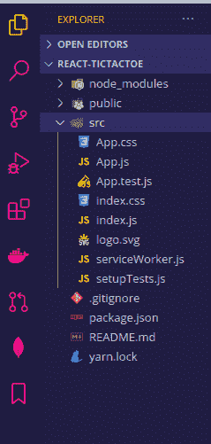
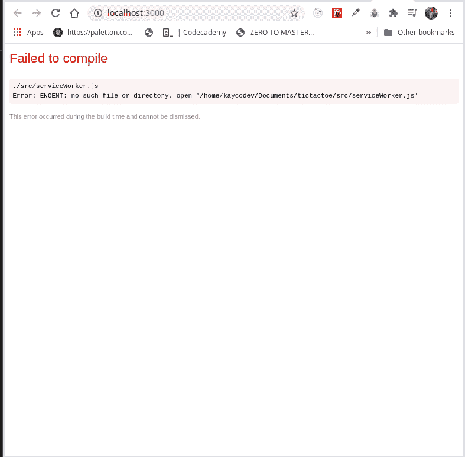
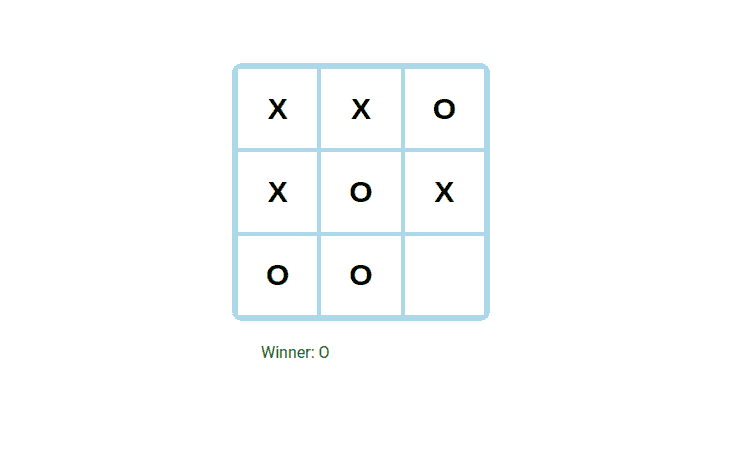

# 在网页游戏中使用 React-log rocket 博客

> 原文：<https://blog.logrocket.com/using-react-in-web-games/>

在本文中，我们将通过构建一个井字游戏来了解 React 如何用于开发网页游戏。

## 介绍

根据其官方[文档](https://reactjs.org/)，React 是一个用于构建用户界面的 JavaScript 库。它还可以用于使用 React Native 在 JavaScript 中构建本机应用程序。

## 先决条件

本教程假设读者已经:

*   [Node.js](https://nodejs.org/en/download/) 和 npm 安装在您的机器上
*   JavaScript 的基础知识以及[如何反应](https://reactjs.org/)如何工作

首先安装官方的 React 应用支架工具，`create-react-app`:

```
npm install -g create-react-app
```

您可以通过运行`create-react-app`来验证安装，这将要求您指定目录名。

## 在游戏中使用 React

React 允许我们创建可重用的组件，因此，我们可以构建可以在应用程序的各个部分重用的应用程序单元或组件。利用这一点，我们将构建以下组件:

*   组件——这将是我们游戏的盒子组件，它将是处理井字游戏对象的单元
*   `Game`组件——该组件处理游戏逻辑，例如“游戏结束”和“重置”到初始状态功能
*   组件——这个组件处理游戏的布局。我们将使用 CSS 网格来构建我们的布局

## 入门指南

我们将使用`create-react-app`来启动我们的项目，`create-react-app`是一个由脸书和社区维护的开源工具，帮助开发者在很短的时间内启动一个`react`项目。

要使用`create-react-app`样板文件创建一个新项目，请在您喜欢的终端中运行该命令:

```
npx create-react-app react-tictactoe
```

在本教程中，名称 react-tictactoe 用作项目名称，但它可以替换为您选择使用的任何名称。

接下来，`cd`进入您的项目目录，通过运行以下命令启动您的开发服务器:

```
cd react-tictactoe && npm start
```

该命令打开一个浏览器点击，呈现默认的样板应用程序。接下来，重组应用程序文件夹，看起来就像下面的图片:


为此，在`src`文件夹中，删除以下文件:`App.css`、`App.test.js`、`serviceWorker.js`和`setupTests.js`。

这些文件主要用于为 react 应用程序设置测试，因为我们将使用内联 CSS，所以不需要`App.css`。如果我们已经注意到，删除这些文件会在我们的浏览器上引发以下错误:



为了解决上述问题，我们转到`src`目录中的`App.js`文件，并删除以下代码行:

```
 import logo from './logo.svg';
 import './App.css';
```

做完这些，让我们开始构建我们的游戏组件。

## 构建游戏组件

我们将从盒子组件开始。

### 构建盒子组件

在我们的`src`文件夹中，让我们创建一个组件文件夹，在组件文件夹中，创建一个名为`Box.js`的文件。请注意，文件名可以是您想要的任何名称，只要您认为合适。

接下来，我们创建一个具有`value`和`onClick`属性的功能组件，该组件将返回一个按钮标签，这些属性被析构:

```
import React from 'react';
function Box({ value, onClick }) {
    return (
        <button
            style={style}
            onClick={onClick}>
            {value}
        </button>
    );
}
export default Box;
```

在上面的代码块中，我们的`Box`组件接受一个`value`和`onClick`道具。这是因为我们的应用程序将有一个 3 行 3 列的类似盒子的形状，单击每个盒子将显示一个`value`。在继续刷新我们的浏览器之前，让我们编写一下`style`，因为我们已经将它包含在了`Box`组件中:

```
const style = {
    background: '#fff',
    border: '2px solid lightblue',
    fontSize: '30px',
    fontWeight: '800',
    cursor: 'pointer',
    outline: 'none'
}
```

### 构建布局组件

在这个组件中，我们将导入我们的`Box`组件，并使用它作为主干为我们的游戏创建一个稳定的用户界面，为此我们需要创建一个类似于我们在`Box`组件中的功能组件，之后我们将传递`boxes`和`onClick`作为该功能的道具，接下来，我们将通过`Box`组件创建 3 行 3 列:

```
import React from 'react';
import Box from './Box'

function Layout({boxes, onClick }) {
    return (
      <div style={style}>
        {boxes.map((box, i) => (
          <Box key={i} value={box} onClick={() => onClick(i)} />
      ))}
      </div>
    );
}
export default Layout;
```

在上面的代码块中，我们映射了`Box`组件中的框，直到我们的应用程序有 3 行和 3 列，在上面的代码中，我们没有添加所需数量的框，为此，我们向组件添加了一个样式对象:

```
const style = {
  border: '4px solid lightblue',
  borderRadius: '10px',
  width: '320px',
  height: '320px',
  margin: '0 auto',
  display: 'grid',
  gridTemplate: 'repeat(3, 1fr) / repeat(3, 1fr)'
};
```

在上面的样式中，我们添加了一个网格模板来指定应用程序中需要多少行和列，在我们的例子中，我们需要三行和三列。

### 游戏组件

这个组件是我们游戏应用程序的主要组件，在这里我们将为我们的游戏构建大部分的逻辑，包括宣布一个赢家。

我们将首先导入一个函数来检查我们的`Layout`组件，稍后我们将使用它来处理用户的点击。接下来，我们将添加一个`div`标签，并在其中添加一个段落来显示我们的获奖者，不久我们将添加一个功能来帮助我们自动确定获奖者:

```
import React, { useState } from 'react';
import Layout from './Layout';

const styles = {
    width: '200px',
    margin: '20px auto',
};
const pStyle = {
    color: 'green'
}

function Game() {
    return (
        <React.Fragment>
            <Layout boxes={layout} />
            <div style={styles}>
                <p style={pStyle}> The winner goes here
              </p>        
            </div>
        </React.Fragment>
    )
}
export default Game;
```

在上面的代码中，我们的`Game`组件被包装在一个`React.Fragment`中。接下来，我们添加了作为道具的`Layout`组件和显示获胜者的`p`标签。

我们接下来要做的是向应用程序添加一个状态，向组件添加一个事件侦听器。这告诉我们什么时候我们有一个获胜者，然后它显示`p`标签来宣布我们的获胜者:

```
function Game() {
    const [layout, setLayout] = useState(Array(9).fill(null));
    const [xIsNext, setXisNext] = useState(true);
    const winner = checkWinner(layout)

    const handleClick = (i) => {
        const layoutState = [...layout];
        if (winner || layoutState[i]) return;
        layoutState[i] = xIsNext ? 'X' : 'O';
        setLayout(layoutState);
        setXisNext(!xIsNext);
    }

    return (
            <React.Fragment>
            <Layout boxes={layout} onClick={handleClick} />
            <div style={styles}>
                <p style={pStyle}>
                    {winner ? 'Winner: ' + winner : 'Next Player '
                    + (xIsNext ? 'X' : 'O')}
                </p>

            </div>
        </React.Fragment>
            )
}
export default Game;
```

在上面的代码块中，我们使用了`useState`钩子来为我们的布局创建一个状态，并使用了盒子数组。接下来，我们设置一个状态，`xIsNext`,它告诉我们在游戏中要点击的下一个字母。

最后一个变量`winner`将在游戏中发现赢家后阻止点击盒子。`handleClick`函数接受我们的`layoutState`的复制版本，而不是直接改变我们的状态，`layoutState`返回一个空集。

接下来，如果点击一个空框，那么`xIsNext`状态在空框中呈现一个 X 或 O，并将其设置为布局状态。

### 构建游戏逻辑

这个组件是我们游戏完成前的最后一个组件。这里，我们将使用一个导出的函数来计算游戏的获胜者:

```
export function checkWinner(boxes) {
 const lines = [
   [0, 1, 2],
   [3, 4, 5],
   [6, 7, 8],
   [0, 3, 6],
   [1, 4, 7],
   [2, 5, 8],
   [0, 4, 8],
   [2, 4, 6],
 ];
 for (let i = 0; i < lines.length; i++) {
   const [x, y, z] = lines[i];
   if (boxes[x] && boxes[x] === boxes[y] && boxes[x] === boxes[z]) {
     return boxes[x];
   }
 }
 return null;
}
const boxes = [null, null, null, "X", "X", "O", null, null, null];
console.log(checkWinner(boxes));
```

在上面的代码块中，我们编写了一个名为`checkWinner`的函数来检查获胜者，这个函数将`boxes`作为一个参数。接下来，我们创建了一个包含所有获胜棋步的查找数组，从 0 数到 8，因此我们将遍历查找数组，而不是遍历一个盒子。接下来，我们使用 ES6 语法来析构获胜的盒子，并给它默认的字母 **x，y，z** ，然后我们检查我们是否有一个 X 或 O。如果我们这样做了，我们就继续走这条路，否则下一封信就会和我们收到的相反。否则，我们检查第一个值是否与第二个值匹配，如果它们都与第三个值匹配，那么我们就有了一个获胜者，如果都没有完成，那么我们返回 null —这意味着我们没有获胜者。

最后，我们的项目应该是这样的:



## 结论

在这篇文章中，我们学习了 React 以及如何使用 React 来构建网页游戏，我们也看到了如何使用 ES JavaScript 来编写游戏逻辑以及如何使用 React 钩子来进行状态管理。你可以在这里阅读更多关于 React 的文章。本文使用的代码可以在 [GitHub](https://github.com/iamfortune/React-tictactoe) 上找到，这个游戏的工作版本可以在[这里](https://codesandbox.io/s/react-tictactoe-game-kdyjy?file=/src/components/Box.js)找到。

## 使用 LogRocket 消除传统反应错误报告的噪音

[LogRocket](https://lp.logrocket.com/blg/react-signup-issue-free)

是一款 React analytics 解决方案，可保护您免受数百个误报错误警报的影响，只针对少数真正重要的项目。LogRocket 告诉您 React 应用程序中实际影响用户的最具影响力的 bug 和 UX 问题。

[ ](https://lp.logrocket.com/blg/react-signup-general) [  ](https://lp.logrocket.com/blg/react-signup-general) [LogRocket](https://lp.logrocket.com/blg/react-signup-issue-free)

自动聚合客户端错误、反应错误边界、还原状态、缓慢的组件加载时间、JS 异常、前端性能指标和用户交互。然后，LogRocket 使用机器学习来通知您影响大多数用户的最具影响力的问题，并提供您修复它所需的上下文。

关注重要的 React bug—[今天就试试 LogRocket】。](https://lp.logrocket.com/blg/react-signup-issue-free)