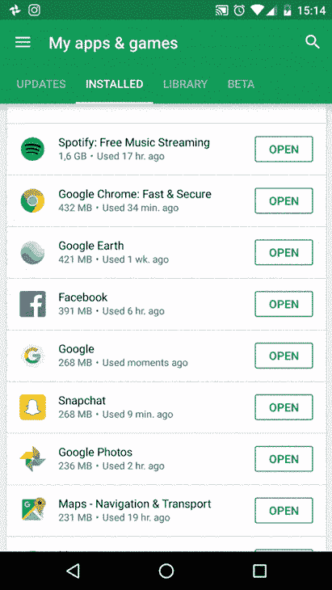
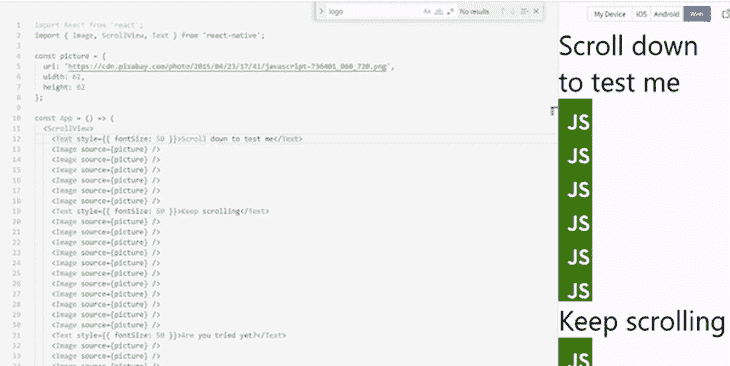
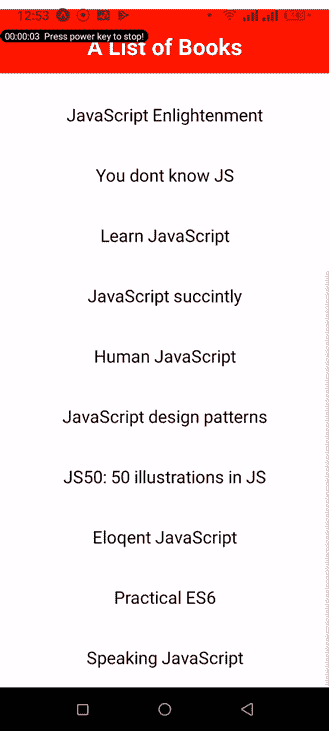

# 使用 React Native ScrollView 创建粘性 header 

> 原文：<https://blog.logrocket.com/using-react-native-scrollview-create-sticky-header/>

可折叠的粘性头技术在现代移动应用中已经变得相当普遍。在这种技术中，标题固定在顶部，当用户向下滚动时变窄，当用户滚动回顶部时变宽。

在本教程中，我们将回顾使用 React Native 的`ScrollView`组件构建可折叠粘性头的基本原理。然后，您可以使用这些原则作为基础，在未来的项目中制定更高级的原则。[查看世博小吃](https://snack.expo.dev/@ubahthebuilder/b179dc)的完整演示。

*   【React 原生教程你需要知道的内容*   [在 React Native 中创建可折叠的标题元素](#creating-collapsible-header-element-react-native)*   [理解](#understanding-animheadervalue-scrolloffsety) `[animHeaderValue](#understanding-animheadervalue-scrolloffsety)` [和](#understanding-animheadervalue-scrolloffsety) `[scrollOffsetY](#understanding-animheadervalue-scrolloffsety)`*   [设计标题并添加动画](#styling-header-adding-animations)*   [添加](#adding-scrollview-sticky-header) `[<ScrollView>](#adding-scrollview-sticky-header)` [到我们的粘性头](#adding-scrollview-sticky-header)

感到兴奋吗？我们走吧！

通常，可折叠标题技术用于隐藏标题中最不需要的部分，以便为滚动视图释放更多空间，如下面的 Google Play 移动应用程序示例所示。



动画的使用也为应用程序增加了流畅友好的体验。

一个`ScrollView`是一个内置的 React 本地组件，它不仅可以作为其他元素的容器，还可以让您滚动其中的子元素和视图。基本上，它是一个可滚动的容器。

`ScrollView`的语法非常简单:

```
<ScrollView/>

```

看看下面的例子，看看`ScrollView`在起作用:


`ScrollView`组件可以以多种方式使用。让我们复习一些例子。

首先，当您想要呈现一系列子元素——文本、图像、视图等——时，可以使用`ScrollView`。—在屏幕上。列表中的所有元素将立即呈现，包括那些当前不可见的元素。

您也可以使用`ScrollView`来滚动子元素。当您在`ScrollView`中呈现元素时，如果这些元素超出了屏幕的可见部分，您可以滚动它们。

`ScrollView`也非常适合渲染一些有限大小的项目，如文本。

最后，当呈现一个`ScrollView`时，它会一次加载其子元素所需的所有数据。这极大地提高了子组件访问数据的速度。

您使用 props 配置`ScrollView`组件。`ScrollView`支持各种道具，用于配置不同的方面。

例如，通过在一个`ScrollView`组件上将`pagingEnabled`属性设置为`true`,您可以将它配置为允许使用滑动手势在视图间翻页。在 iOS 上，你可以在`ScrollView`上设置`maximumZoomScale`和`minimumZoomScale`道具，允许用户放大和缩小其内容。

`onScroll`道具与这个粘性头教程特别相关。`onScroll`允许您定义当用户滚动`ScrollView`时要执行的动作。对于粘性标题，您可以使用`onScroll`在用户向上滚动时扩展标题，在用户向下滚动时收缩标题。

现在让我们开始使用[本地](https://blog.logrocket.com/common-bugs-react-native-scrollview/) `[ScrollView](https://blog.logrocket.com/common-bugs-react-native-scrollview/)` [组件](https://blog.logrocket.com/common-bugs-react-native-scrollview/)实现一个可折叠的头部。

## 对于这个 React Native 教程，你需要知道什么

本教程假设您[熟悉 JavaScript ES6](https://blog.logrocket.com/javascript-es6-5-new-abstractions-to-improve-your-code-54a369e82407/) 和 React，React Native 所基于的语言和库。我们将使用[博览会小吃作为我们的在线代码编辑器](https://snack.expo.dev)，这将使我们能够在浏览器内开发我们的 React 本地应用程序。

使用 Expo Snack 比在本地建立开发环境更快，因为您不需要安装任何东西。只需[在您的设备上下载世博客户端应用](https://play.google.com/store/apps/details?id=host.exp.exponent&hl=en&gl=US)，并通过简单的二维码扫描将其与您的世博小吃项目挂钩即可开始。

如果您仍然喜欢在本地设置开发环境，那么在继续本教程之前，请遵循 React Native docs 中的[环境设置说明来指导您如何进行设置。](https://reactnative.dev/docs/environment-setup)

第一步是在您的`components`目录中创建一个名为`DynamicHeader.js`的新文件。该文件用于可折叠的头组件。

接下来，在`DynamicHeader.js`文件中，我们将从导入`React`和一些 React 原生 UI 组件开始。然后，我们将创建一个非常基本的组件，暂时不返回任何内容。

```
import * as React from 'react';
import { Text, View, StyleSheet, Animated } from 'react-native';

const DynamicHeader = ({animHeaderValue}) => {
  return null;
};

export default DynamicHeader;

```

你可以看到上面的函数将`animHeaderValue`作为参数，但是`animHeaderValue`是什么意思呢？为了回答这个问题，让我们简单地从我们的`DynamicHeader.js`文件切换到我们的`App.js`文件。

在我们的`App.js`文件的开始，我们将导入`React`库、`useRef`钩子、我们刚刚创建的`DynamicHeader`，以及构建 UI 所需的某些组件。

* * *

### 更多来自 LogRocket 的精彩文章:

* * *

```
import React, { useState, useRef } from 'react';
import AnimatedHeader from './components/AnimatedHeader';
import { SafeAreaView, ScrollView, Text, View, Animated, StyleSheet } from 'react-native';

```

在导入下面，我们有`App()`函数。在里面，我们要做的第一件事是使用 React 的`useRef()`钩子来设置一个跟踪`scrollOffsetY`的引用，它代表了滚动视图沿水平轴偏移其初始位置的距离。

```
export default function App() {
  const scrollOffsetY = useRef(new Animated.Value(0)).current;

}

```

为了给 React Native 中的元素制作动画，我们需要 `[Animated](https://reactnative.dev/docs/animated)` [库](https://reactnative.dev/docs/animated)中的`Animated.Value` [。](https://reactnative.dev/docs/animated)

使用`Animated.Value`，我们将滚动位置的初始值设置为`0`。`scrollOffsetY`将在用户每次滚动时更新滚动视图的当前位置。我们将这个值作为道具传递给`<DynamicHeader>`。

```
return (    
      <SafeAreaView style={{ flex: 1 }} forceInset={{ top: 'always' }}>       
        <DynamicHeader animHeaderValue={scrollOffsetY} />
        <View style={{ flex: 1, alignItems: 'center' }}>
          <Text>Open up App.js to start working on your app!</Text>
        </View>
      </SafeAreaView>   
  );

```

现在我们明白了`DynamicHeader()`的参数`animHeaderValue`来自哪里，是时候完成这个头文件了。

回到`component/DynamicHeader.js`，我们将继续在组件函数上定义三个常数:

```
// Imports

const Max_Header_Height = 200;
const Min_Header_Height = 70;
const Scroll_Distance = Max_Header_Height - Min_Header_Height

const Header = ({scrollOffsetY}) => {
  return null;
};

```

*   `Max_Header_Height`:割台的最大高度
*   `Min_Header_Height`:割台的最小高度
*   `Scroll_Distance`:最大和最小割台高度之差

现在我们已经将这些值存储在变量中，我们将使用来自`Animated.Value`的`interpolate()`函数，根据`scrollOffsetY`的当前值来制作标题高度的动画。

```
const animatedHeaderHeight =  animatedValue.interpolate({
    inputRange: [0, Scroll_Distance],
    outputRange: [Header_Max_Height , Header_Min_Height],
    extrapolate: 'clamp'
  })

```

这将使标题在最大和最小高度之间以与`inputRange`值从`0`到`Scroll_Distance`相同的速率运动。我们还设置了`extrapolate`属性来定义插值应该如何操作。

除了页眉高度之外，我们还可以通过设置其他属性的动画来进一步增强用户体验，例如背景颜色、填充和其他所有可设置动画的 CSS 属性。

为了演示这一点，让我们也将背景色从蓝色变为红色，插入中间的颜色值:

```
const animateHeaderBackgroundColor = animHeaderValue.interpolate({
    inputRange: [0, Header_Max_Height - Header_Min_Height],
    outputRange: ['blue', 'red'],
    extrapolate: 'clamp'
  })

```

现在，让我们将这些动画应用到`Animated.View`中，以便为我们的`DynamicHeader`组件制作动画:

```
const AnimatedHeader = ({ animatedValue }) => {
  // ...
  return (
    <Animated.View 
        style={[
          styles.header,
          {
            height: animateHeaderHeight,
            backgroundColor: animateHeaderBackgroundColor
          }

        ]}
      >
        <Text style={styles.headerText}>
          A List of Books
        </Text>         
    </Animated.View>
  );
};

```

在这里，我们将一些样式应用于标题及其文本——您可以在下面看到完整的样式表。然后，对于`height`和`backgroundColor`属性，我们传递两个插值函数(`animatedHeaderHeight`和`animateHeaderBackgroundColor`)来应用动画。

为了完成这一部分，下面是这个组件的样式表的剩余部分:

```
const styles = StyleSheet.create({
  header: {
    justifyContent: 'center',
    alignItems: 'center',      
    left: 0,
    right: 0,
    paddingTop: 10         
  },
  headerText: {
    color: '#fff',
    fontSize: 25,
    fontWeight: 'bold',
    textAlign: 'center'
  },
});

```

为了让动画工作，我们需要为头部创建一个`<ScrollView>`来制作动画。`<ScrollView>`将呈现以下编程书籍列表，该列表位于根文件夹中的`data.js`文件中:

```
export const DATA = [
  {
    id: 1,
    title: 'Modern JS: A curated collection'
  },
  {
    id: 2,
    title: 'JavaScript notes for professionals'
  },
  {
    id: 3,
    title: 'JavaScript: The Good Parts'
  },
  {
    id: 4,
    title: 'JavaScript: The right way'
  },
  {
    id: 5,
    title: 'Exploring ES6'
  },
  {
    id: 6,
    title: 'JavaScript Enlightenment'
  },
  {
    id: 7,
    title: 'You dont know JS'
  },
  {
    id: 8,
    title: 'Learn JavaScript'
  },
  {
    id: 9,
    title: 'JavaScript succintly'
  },
  {
    id: 10,
    title: 'Human JavaScript'
  },
  {
    id: 11,
    title: 'JavaScript design patterns'
  },
  {
    id: 12,
    title: "JS50: 50 illustrations in JS"
  },
  {
    id: 13,
    title: 'Eloqent JavaScript'
  },
  {
    id: 14,
    title: 'Practical ES6'
  },
  {
    id: 15,
    title: 'Speaking JavaScript'
  }
];

```

然后回到`App.js`，我们将从停止的地方继续。首先，我们将导入文件顶部的图书数据，以及其他导入内容:

```
// Other imports
import { DATA } from './data';

```

导入数据后，我们将修改`App()`函数，在视图中添加一个`<ScrollView>`，就在`<DynamicHeader>`下面。

如下所示，`<ScrollView>`采用了几个非常重要的道具来配置滚动视图。第一个也是最重要的道具是`[onScroll](https://reactnative.dev/docs/scrollview#onscroll)`[道具](https://reactnative.dev/docs/scrollview#onscroll)，它在用户每次滚动`<ScrollView>`时运行。

为了响应用户滚动，我们[使用](https://reactnative.dev/docs/animated#event) `[Animated.event](https://reactnative.dev/docs/animated#event)` [函数](https://reactnative.dev/docs/animated#event)和`scrollOffsetY`一起映射水平滚动偏移值。

```
export default function App() {
  let scrollOffsetY = useRef(new Animated.Value(0)).current;  

  return (
    <SafeAreaView style={styles.container}>
      <DynamicHeader animHeaderValue={scrollOffsetY} />
      <ScrollView 
        scrollEventThrottle={16}
        onScroll={Animated.event(
          [{ nativeEvent: { contentOffset: { y: scrollOffsetY}}}],
          {useNativeDriver: false}
        )}
      >         
            {DATA.map((book, index) => {
              return (                
                  <Text style={styles.scrollText} key={book.id}>{book.title}</Text>                
              )
            })}         
      </ScrollView>
    </SafeAreaView>
  );
}

```

另一个属性`scrollEventThrottle`——这是一个特定于 iOS 应用的 [React 原生属性——控制滚动时滚动事件被触发的频率(以毫秒为单位的时间间隔)。从`10`到`16`的任何值对于性能来说都是最佳的。](https://blog.logrocket.com/how-to-build-ios-apps-using-react-native/)

这是在安卓设备上的结果:



[查看世博小吃的完整演示](https://snack.expo.dev/@ubahthebuilder/b179dc)。

## 结论

在 scroll 上使用可折叠的标题极大地改善了 React 本机应用程序的用户体验，尤其是对于具有复杂标题结构的应用程序。移动应用程序应该总是以这样一种方式构建，它们可以灵活地适应用户的需求。

祝你一周愉快。

## [LogRocket](https://lp.logrocket.com/blg/react-native-signup) :即时重现 React 原生应用中的问题。

[](https://lp.logrocket.com/blg/react-native-signup)

[LogRocket](https://lp.logrocket.com/blg/react-native-signup) 是一款 React 原生监控解决方案，可帮助您即时重现问题、确定 bug 的优先级并了解 React 原生应用的性能。

LogRocket 还可以向你展示用户是如何与你的应用程序互动的，从而帮助你提高转化率和产品使用率。LogRocket 的产品分析功能揭示了用户不完成特定流程或不采用新功能的原因。

开始主动监控您的 React 原生应用— [免费试用 LogRocket】。](https://lp.logrocket.com/blg/react-native-signup)