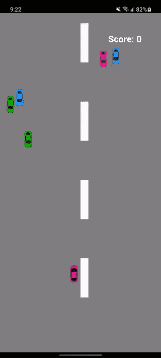

# 使用 React 本地传感器创建赛车游戏

> 原文：<https://blog.logrocket.com/using-react-native-sensors-create-racing-game/>

如今，大多数智能手机已经配备了加速度计、陀螺仪、磁力计和气压计。这些组件用于帮助确定用户的位置、移动速度以及健康和地图应用程序通常使用的其他类似数据。

在本教程中，我们将看到一个如何使用器件加速度计数据的实际例子。具体来说，我们将创建一个赛车游戏，用户可以通过向左或向右倾斜他们的设备来驾驶汽车。

## 先决条件

如果你想跟着做，具备以下条件是很重要的:

*   反应本地开发环境
*   带加速度计的手机
*   了解 JavaScript 和 React Native

## 应用概述

如前所述，我们将创建一个赛车游戏。这个游戏的主要目的是避免与你的车逆向行驶的车。我们将通过使用手机的加速度计数据来实现这一点。具体来说，我们用它来检测手机的倾斜。

这是该应用程序的外观:



我们将使用以下库来构建游戏:

## 设置项目

让演示工作的最快方法是创建一个新的 React 本地项目，然后将所有文件从 [repo](https://github.com/anchetaWern/RNSensorCarGame) 复制到您的项目中:

```
npx react-native init RNSensorCarGame

```

完成后，安装所有依赖项:

```
cd RNSensorCarGame
npm install

```

最后，遵循 React 本地传感器的[安装说明。在撰写本文时，这个库仍然不支持自动链接。因此，您必须手动链接它:](https://react-native-sensors.github.io/docs/Installation.html)

```
react-native link react-native-sensors

```

对于 iOS，将以下内容添加到您的`podfile`:

```
pod 'RNSensors', :path => '../node_modules/react-native-sensors'

```

然后执行以下命令:

```
cd ios && pod install

```

完成后，您应该能够运行项目了:

```
npx react-native run-android

```

对于 iOS，最好通过 Xcode 运行。

## 创建应用程序

如果你已经运行了应用程序，那么就没有必要再跟着做了。如果你想了解它是如何构建的，那么请随意。

在`App.js`文件中，我们简单地呈现了`World`组件，所有神奇的事情都发生在那里:

```
// App.js
import React from 'react';
import type {Node} from 'react';

import World from './src/World';

const App: () => Node = () => {
  return <World />;
};

export default App;

```

在`World.js`文件中，我们首先导入我们需要的库。这包括`react-native-sensors`、`matter-js`和`react-native-game-engine`。`random-int`和`sampleSize`只是助手，稍后你会看到:

```
// World.js
import React, {Component} from 'react';
import {StyleSheet, Text, View, Alert} from 'react-native';

import {
  accelerometer,
  setUpdateIntervalForType,
  SensorTypes,
} from 'react-native-sensors';

import Matter from 'matter-js';
import {GameEngine} from 'react-native-game-engine';

import randomInt from 'random-int';
import sampleSize from 'lodash.samplesize';

```

接下来是代表我们将在屏幕上呈现的游戏对象的组件。我们还引入了一个自制的助手来生成随机小数:

```
import Car from './components/Car';
import Box from './components/Box';
import Road from './components/Road';

import getRandomDecimal from './helpers/getRandomDecimal';

```

接下来是对象要使用的常数值:

```
import {
  CAR_WIDTH,
  CAR_HEIGHT,
  MID_POINT, // position of the mid-point of the screen in the X axis
  DEVICE_HEIGHT,
  DEVICE_WIDTH,
} from './Constants';

import {OPPOSING_CAR_IMAGES} from './Images';

```

我们还需要创建相应的 Matter.js 对象。这些是提供功能的实际游戏对象，并且可以与其他对象交互(或被交互)。我们之前创建的`Car`、`Box`和`Road`组件只是这些对象的渲染器:

```
import {car, floor, road} from './Objects';

```

### 渲染器

让我们快速看一下每个渲染器的代码。首先是`Car`组件。我们正在根据设备的宽度和高度计算其宽度和高度。我们不能简单地使用固定的宽度和高度，因为设备大小不同。

该组件接受`body`和`image`作为其参数。这些都将使用 Matter.js 传递给这个组件。稍后当我们在`World.js`文件中声明游戏实体时，您将看到这是如何完成的:

```
// src/components/Car.js
import React from 'react';
import {Image} from 'react-native';

import {DEVICE_WIDTH, DEVICE_HEIGHT} from '../Constants';

const BODY_DIAMETER = Math.trunc(Math.max(DEVICE_WIDTH, DEVICE_HEIGHT) * 0.05);

function Car({body, image}) {
  const {position} = body;

  const x = position.x - BODY_DIAMETER / 2;
  const y = position.y - BODY_DIAMETER / 2;

  return (
    <Image
      source={image}
      resizeMode="contain"
      style={{
        width: BODY_DIAMETER,
        height: BODY_DIAMETER,
        position: 'absolute',
        left: x,
        top: y,
      }}
    />
  );
}

export default Car;

```

接下来，我们有了`Box`组件。与`Car`组件相比，这相对简单，因为它只使用了`View`组件。该组件用作`floor`对象的渲染器:

```
// src/components/Box.js
import React from 'react';
import {View} from 'react-native';

const Box = ({body, size, color}) => {
  const width = size[0];
  const height = size[1];

  const x = body.position.x;
  const y = body.position.y;

  return (
    <View
      style={{
        position: 'absolute',
        left: x,
        top: y,
        width: width,
        height: height,
        backgroundColor: color,
      }}
    />
  );
};

export default Box;

```

最后，我们有`Road`组件。看起来和`Box`差不多。唯一的区别是它有多个`RoadLine`组件作为它的子组件。它们代表你在路上看到的白线。这是非常重要的，因为这是用来提供汽车正在移动的错觉。

我们稍后将通过 React 原生游戏引擎提供的“系统”制作动画:

```
// src/components/Road.js
import React from 'react';
import {View} from 'react-native';

import RoadLine from './RoadLine';

const Road = ({body, size}) => {
  const width = size[0];
  const height = size[1];

  const x = body.position.x;
  const y = body.position.y;

  return (
    <View
      style={{
        position: 'absolute',
        left: x,
        top: y,
      }}
    >
      <RoadLine width={width} height={height} top={0} />
      <RoadLine width={width} height={height} />
      <RoadLine width={width} height={height} />
      <RoadLine width={width} height={height} />
      <RoadLine width={width} height={height} />
    </View>
  );
};

export default Road;

```

下面是`RoadLine`组件的代码:

```
// src/components/RoadLine.js
import React from 'react';
import {View} from 'react-native';

const RoadLine = ({width, height, top = 100}) => {
  return (
    <View
      style={{
        marginTop: top,
        width: width,
        height: height,
        backgroundColor: '#fff',
      }}
    ></View>
  );
};

export default RoadLine;

```

### 目标

现在让我们创建 Matter.js 对象。这些代表了现实世界中的物体。MatterJS 允许你创建基于基本形状的物体，比如矩形和 T2 圆形，但是你也可以创建任何你想要的 T4 形状。

在本教程中，我们将只坚持矩形，因为这是最好的形状代表我们试图创建的对象。

要创建一个矩形对象，调用`Matter.Bodies.rectangle()`方法。它接受对象的`x`和`y`位置作为第一个和第二个参数，宽度和高度作为第三个和第四个参数，对象属性作为第五个参数。对于[对象属性](https://brm.io/matter-js/docs/classes/Body.html#properties)，我们需要的全部内容如下:

*   `isStatic` —将此设置为`true`意味着对象不受物理定律(例如重力)的影响，因此为了改变其位置，您需要调用物体上的`setPosition()`方法。这是默认的`false`，所以如果你没有在一个对象上指定这个选项，默认情况下它会受到物理定律的影响
*   `isSensor` —将此项设置为`true`意味着当另一个非静态物体通过重力或任何其他力的方式撞上该物体时，该物体将触发碰撞事件
*   `label` —描述对象的可读标签。我们稍后将使用它来指代该对象

```
// src/Objects.js
import Matter from 'matter-js';
import {CAR_WIDTH, CAR_HEIGHT, DEVICE_WIDTH, DEVICE_HEIGHT} from './Constants';

import randomInt from 'random-int';

export const car = Matter.Bodies.rectangle(
  0,
  DEVICE_HEIGHT - 30,
  CAR_WIDTH,
  CAR_HEIGHT,
  {
    isStatic: true,
    label: 'car',
  },
);

export const floor = Matter.Bodies.rectangle(
  DEVICE_WIDTH / 2,
  DEVICE_HEIGHT,
  DEVICE_WIDTH,
  10,
  {
    isStatic: true,
    isSensor: true,
    label: 'floor',
  },
);

export const road = Matter.Bodies.rectangle(DEVICE_WIDTH / 2, 100, 20, 100, {
  isStatic: true,
  isSensor: false,
  label: 'road',
});

```

现在让我们回到`World.js`。要开始监听加速度计的变化，调用由`react-native-sensors`库提供的`setUpdateIntervalForType()`方法。这将接受您想要监听的传感器，以及以毫秒为单位的时间间隔。

我们已经设置了`15`,所以它只会每 15 毫秒触发一次获取当前加速度计数据的功能。您可以相应地对此进行调整以节省电池寿命:

```
// ..
import getRandomDecimal from './helpers/getRandomDecimal';

// add this
setUpdateIntervalForType(SensorTypes.accelerometer, 15);

```

接下来，创建组件并设置初始状态。

我们使用基于类的组件，而不是基于函数的组件，因为我们需要创建类的本地对象。我们实际上不能在功能组件中这样做，因为我们将被限制于使用状态。Matter.js 对象不能真正存在于状态中:

```
export default class World extends Component {

  state = {
    x: 0, // initial x position of the player's car
    y: DEVICE_HEIGHT - 200, // initial y position of the player's car
    isGameSetup: false, // if the world has been setup
    isGamePaused: false, // if the game is currently paused
    score: 0, // the current player score
  };

}

```

在构造函数中，我们需要做三件事:

1.  初始化数组以存储对面汽车的对象
2.  将所有对象添加到世界中
3.  构造`entities`对象。这是我们稍后需要传递给 React 本地游戏引擎的内容

```
constructor(props) {
  super(props);

  this.opposing_cars = [];

  const {engine, world} = this.addObjectsToWorld(car);
  this.entities = this.getEntities(engine, world, car, road);

  // next: add code for customizing game physics
}

// last: add componentDidMount
```

接下来，还是在`constructor()`里面，我们声明游戏物理。这是运行游戏的系统之一。这个函数在游戏的每一次滴答都会被调用。

这里，我们指定`y`轴的[重力](https://brm.io/matter-js/docs/classes/Engine.html#property_gravity)。将其设置为`0.5`意味着物体将以该速度下落。因为重力的原因，相对的车实际上会从初始位置落下:

```
this.physics = (entities, {time}) => {
  let engine = entities['physics'].engine;
  engine.world.gravity.y = 0.5; 
  Matter.Engine.update(engine, time.delta);
  return entities;
};

// next: add code for road animation

```

接下来，我们有另一个系统。它的主要职责是在游戏时钟的每一秒改变道路的位置。我们将`1`添加到道路的`y`位置，使它看起来像汽车在移动。一旦它达到设备高度的五分之一，我们就将其重置回原始位置，使其永远运行下去:

```
this.roadTranslation = (entities, {time}) => {
  if (!this.state.isGamePaused) {
    Matter.Body.setPosition(road, {
      x: road.position.x,
      y: road.position.y + 1,
    });

    if (road.position.y >= DEVICE_HEIGHT / 5) {
      Matter.Body.setPosition(road, {
        x: road.position.x,
        y: 0,
      });
    }
  }
  return entities;
};

// next: add code for setting up collision handler

```

最后，设置冲突处理程序:

```
this.setupCollisionHandler(engine);

```

现在我们走出构造函数，监听组件何时被挂载。这是我们初始化玩家汽车的位置和订阅加速度计数据的地方。

玩家的汽车被限制为只能侧向移动以避开对面的汽车。这就是为什么我们只获取`x`轴的数据，然后用它来更新状态。

这也是我们将`isGameSetup`更新为`true`的地方，因为游戏运行所需的一切都已在此时初始化:

```
componentDidMount() {
  // initialize car position
  Matter.Body.setPosition(car, {
    x: DEVICE_WIDTH / 2,
    y: DEVICE_HEIGHT - 200,
  });

  this.accelerometer = accelerometer.subscribe(({x}) => {
    if (!this.state.isGamePaused) {
      Matter.Body.setPosition(car, {
        x: this.state.x + x,
        y: DEVICE_HEIGHT - 200,
      });

      // next: add code for detecting if car goes out of bounds
    }
  });

  // start the game  
  this.setState({
    isGameSetup: true,
  });
}

// last: add componentWillUnmount

```

如果用户向一侧倾斜足够长的时间，玩家的汽车将移动到设备屏幕的边界之外。我们真的不希望这种情况发生，所以我们需要采取一些措施来防止这种情况发生。

在我们的例子中，我们只是使用状态来跟踪它。每当状态更新时，我们就执行一个函数。这将检查它是小于零还是大于设备宽度。这两种情况都意味着玩家的车转向了路边。当这种情况发生时，我们结束当前游戏并将汽车重置回初始位置:

```
this.setState(
  state => ({
    x: x + state.x,
  }),
  () => {
    if (this.state.x < 0 || this.state.x > DEVICE_WIDTH) {
      Matter.Body.setPosition(car, {
        x: MID_POINT,
        y: DEVICE_HEIGHT - 30,
      });

      this.setState({
        x: MID_POINT,
      });

      this.gameOver('You hit the side of the road!');
    }
  },
);

```

当组件即将被卸载时，我们也需要自己清理。在这种情况下，我们停止应用程序与加速度计的交互:

```
componentWillUnmount() {
  if (this.accelerometer) {
    this.accelerometer.stop();
  }
}

// next: add objects to world

```

接下来，我们现在继续处理前面在构造函数中调用的函数的函数体。首先是`addObjectsToWorld()`。这是我们通过调用`Matter.Engine.create()`创建物理引擎的地方。`enableSleeping`使引擎停止更新和检测已停止的对象上的碰撞(例如，在碰撞后被另一个对象停止)。

之后，我们构造一个数组，包含我们想要添加到世界中的对象。这包括道路、玩家的车、地板和对方的车。相对的汽车有一个随机的`x`位置，但是它们的`y`位置总是在屏幕的顶部。我们还设置了`frictionAir`，它就是物体的[空气阻力](https://brm.io/matter-js/docs/classes/Body.html#property_frictionAir)。该值越高，物体在空间中穿行的速度越快:

```
addObjectsToWorld = car => {
  const engine = Matter.Engine.create({enableSleeping: false});
  const world = engine.world;

  let objects = [road, car, floor];

  for (let x = 0; x <= 4; x++) {
    const opposing_cars = Matter.Bodies.rectangle(
      randomInt(1, DEVICE_WIDTH - 10),
      0,
      CAR_WIDTH,
      CAR_HEIGHT,
      {
        frictionAir: getRandomDecimal(0.05, 0.25),
        label: 'opposing_car',
      },
    );

    this.opposing_cars.push(opposing_cars);
  }

  objects = objects.concat(this.opposing_cars);

  Matter.World.add(world, objects);

  return {
    engine,
    world,
  };
};

// next: add code for getEntities()

```

接下来，我们有`getEntities()`函数，它返回你在屏幕上看到的对象。每个实体都由 Matter.js 主体和渲染器组成。你传递给它的其他东西基本上都是作为道具传递给渲染器的，就像你之前看到的那样。这包括像`size`、`image`和`color`这样的东西:

```
getEntities = (engine, world, car, road) => {
  const entities = {
    physics: {
      engine,
      world,
    },

    theRoad: {
      body: road,
      size: [20, 100],
      renderer: Road,
    },

    playerCar: {
      body: car,
      size: [CAR_WIDTH, CAR_WIDTH],
      image: require('../assets/images/red-car.png'),
      renderer: Car,
    },

    gameFloor: {
      body: floor,
      size: [DEVICE_WIDTH, 10],
      color: '#414448',
      renderer: Box,
    },
  };

  // next: add code for generating entities for opposing cars

  return entities;
};

// last: add setupCollisionHandler()

```

下面是为对立的汽车生成实体的代码。使用`sampleSize()`功能选择随机图像，然后将这些图像用作每个实体的图像:

```
// get unique items from array
const selected_car_images = sampleSize(OPPOSING_CAR_IMAGES, 5);

for (let x = 0; x <= 4; x++) {
  Object.assign(entities, {
    ['opposing_car' + x]: {
      body: this.opposing_cars[x],
      size: [CAR_WIDTH, CAR_HEIGHT],
      image: selected_car_images[x],
      renderer: Car,
    },
  });
}

```

接下来是第二个系统(第一个是道路翻译器),我们需要通过它来对本地游戏引擎做出反应:碰撞处理器。冲突处理程序有两个目的:

*   检测地板和对面车厢之间的碰撞。一旦对面的车撞到地板，它的工作就完成了，所以我们需要通过重置它的位置来重用它。这也意味着用户成功避开了对方的汽车而获得了一分
*   检测玩家的汽车和对面汽车之间的碰撞。当这种情况发生时，游戏也被认为结束了

```
setupCollisionHandler = engine => {
  Matter.Events.on(engine, 'collisionStart', event => {
    var pairs = event.pairs;

    var objA = pairs[0].bodyA.label;
    var objB = pairs[0].bodyB.label;

    if (objA === 'floor' && objB === 'opposing_car') {
      Matter.Body.setPosition(pairs[0].bodyB, {
        // set new initial position for the block
        x: randomInt(20, DEVICE_WIDTH - 20),
        y: 0,
      });

      this.setState(state => ({
        score: state.score + 1,
      }));
    }

    if (objA === 'car' && objB === 'opposing_car') {
      this.gameOver('You bumped to another car!');
    }
  });
};

```

下面是`gameOver()`函数。它所做的只是将所有相对的车设置为一个静态体。发生这种情况时，它们基本上会悬浮在半空中。在等待用户输入是否继续玩游戏时，游戏也被暂停。

如果用户取消，应用程序将停止监听加速度计数据的变化。如果他们决定继续，游戏将重新开始:

```
gameOver = msg => {
  this.opposing_cars.forEach(item => {
    Matter.Body.set(item, {
      isStatic: true,
    });
  });

  this.setState({
    isGamePaused: true,
  });

  Alert.alert(`Game Over, ${msg}`, 'Want to play again?', [
    {
      text: 'Cancel',
      onPress: () => {
        this.accelerometer.unsubscribe();
        Alert.alert(
          'Bye!',
          'Just relaunch the app if you want to play again.',
        );
      },
    },
    {
      text: 'OK',
      onPress: () => {
        this.resetGame();
      },
    },
  ]);
};

// next: add resetGame()

```

这是重新开始的函数:

```
resetGame = () => {
  this.setState({
    isGamePaused: false,
  });

  this.opposing_cars.forEach(item => {
    // loop through all the blocks
    Matter.Body.set(item, {
      isStatic: false, // make the block susceptible to gravity again
    });
    Matter.Body.setPosition(item, {
      // set new position for the block
      x: randomInt(20, DEVICE_WIDTH - 20),
      y: 0,
    });
  });

  this.setState({
    score: 0, // reset the player score
  });
};

```

最后，我们有`render()`函数，在这里我们使用 React 原生游戏引擎提供的`GameEngine`组件将所有东西集合在一起。它负责渲染所有实体并同时运行所有系统。在它里面，我们只有分数容器，因为它并不真的与游戏实体直接交互:

```
render() {
  const {isGameSetup, score} = this.state;

  if (isGameSetup) {
    return (
      <GameEngine
        style={styles.container}
        systems={[this.physics, this.roadTranslation]}
        entities={this.entities}
      >
        <View style={styles.infoWrapper}>
          <View style={styles.scoreContainer}>
            <Text style={styles.scoreText}>Score: {score}</Text>
          </View>
        </View>
      </GameEngine>
    );
  }

  return (
    <View style={styles.centered}>
      <Text style={styles.text}>Something isn't right..</Text>
    </View>
  );
}

```

您可以在 [GitHub repo](https://github.com/anchetaWern/RNSensorCarGame) 中查看样式和任何其他非重要代码。

现在，你可以玩游戏了:

```
npx react-native run-android

```

如果你在 Mac 上，只需从 Xcode 启动应用程序。

## 结论

就是这样！在本教程中，您学习了如何使用手机的加速度计数据来移动屏幕上的对象。在这个过程中，您还学习了如何使用 React 原生游戏引擎和 Matter.js 来创建游戏。

你可以在其 [GitHub repo](https://github.com/anchetaWern/RNSensorCarGame) 上查看该应用的源代码。

## [LogRocket](https://lp.logrocket.com/blg/react-native-signup) :即时重现 React 原生应用中的问题。

[](https://lp.logrocket.com/blg/react-native-signup)

[LogRocket](https://lp.logrocket.com/blg/react-native-signup) 是一款 React 原生监控解决方案，可帮助您即时重现问题、确定 bug 的优先级并了解 React 原生应用的性能。

LogRocket 还可以向你展示用户是如何与你的应用程序互动的，从而帮助你提高转化率和产品使用率。LogRocket 的产品分析功能揭示了用户不完成特定流程或不采用新功能的原因。

开始主动监控您的 React 原生应用— [免费试用 LogRocket】。](https://lp.logrocket.com/blg/react-native-signup)