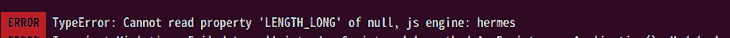
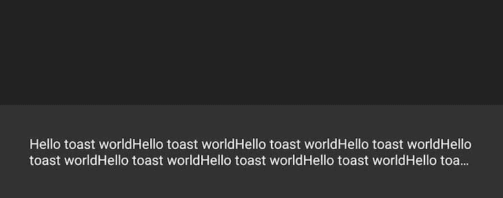
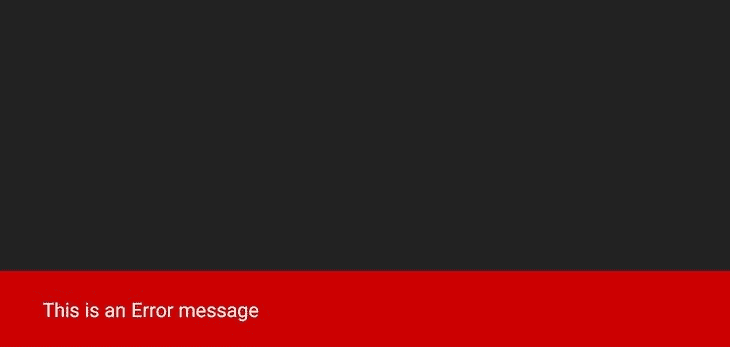
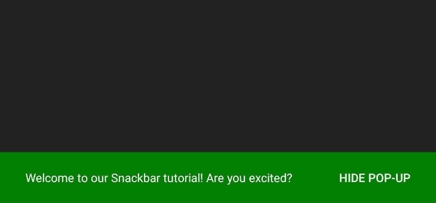

# 使用 React Native Snackbar 创建自定义弹出消息

> 原文：<https://blog.logrocket.com/using-react-native-snackbar-custom-pop-up-messages/>

弹出消息在网站上变得非常普遍。您可以使用这些消息根据用户的交互状态向用户显示通知或相关信息，例如，指示加载页面、获取请求等。

Snackbar 是一个可以帮助您在 React 原生项目中实现这一功能的工具。就像`toastify-react-native`、`react-native-toast-message`和其他 toast 库一样，Snackbar 帮助你在 React 原生应用中显示通知或弹出消息。

除了是这个 toast 库的名称之外，“snackbar”还指一种特定类型的弹出消息，可以用来向用户显示信息。Snackbars 从屏幕底部动画显示到视口中，并为用户提供了一个可选的动作按钮。

在本文中，我们将看到如何使用 React 本机 Snackbar 包来创建一个非常酷的弹出消息或通知。我们将看到 Snackbar 为我们提供的特性，以及如何用这个包添加和处理按钮事件。

向前跳:

## 在 React 本地项目中安装 Snackbar

您可以使用下面的任一代码命令在 React 本机应用程序中安装该包:

```
// Npm
npm i react-native-snackbar

// Yarn
yarn add react-native-snackbar

```

一旦你安装了这个包，你就可以在你的项目中使用 Snackbar 了。

## 在 React 本机应用程序中使用 Snackbar

要使用 Snackbar 包，首先将其导入 React 本机应用程序的组件顶部:

```
/* App.js */
import Snackbar from "react-native-snackbar"

```

在应用程序中导入 Snackbar 库后，您可能会遇到类似下图的错误:



如果您遇到这个问题，请在应用程序的根目录下创建一个名为`_mocks_`的文件夹。在该文件夹中，创建一个名为`react-native-snackbar.js`的文件，并在该文件中添加以下代码:

```
/* react-native-snackbar.js */

module.exports = {
  show: jest.fn()
};

```

之后，清理你的 Gradle 和 build 来同步变化:

```
cd android && ./gradlew clean

```

在上面的代码中，您将移动到您的`android`文件夹，该文件夹位于 React 本地文件夹中。然后，`./gradlew clean`使用 Gradle wrapper 来清理您的项目，方法是删除您以前的构建目录，重新构建它，并在这个过程中配置您的模块。

这个[解决了上面的 React Native 问题](https://blog.logrocket.com/addressing-common-errors-react-native/),因为它在创建新的构建目录时同步了我们的新更改。

构建项目并确保一切正常后，您可以简单地在组件中调用 Snackbar，如下所示:

```
/* App.js */

Snackbar.show({
  text: 'Hello world',
  duration: Snackbar.LENGTH_SHORT,
});

```

简单吧？您还可以向 Snackbar 添加一个按钮，并处理按钮事件，以确保当用户触摸该按钮时会发生正确的事情，例如，撤消之前的操作或关闭 Snackbar。

看看如何在下面的代码中设置这一点，并注意`*/ Do something. */`注释，在这里您可以定制您的按钮事件:

```
/* App.js */

Snackbar.show({
  text: 'Hello world',
  duration: Snackbar.LENGTH_INDEFINITE,
  action: {
    text: 'close',
    textColor: 'green',
    onPress: () => { /* Do something. */ },
  },
});

```

一些 toast 库提供了几种通知变体。例如， [React-Toastify 有](https://blog.logrocket.com/using-react-toastify-style-toast-messages/)`success``error`等吐司变体。Snackbar 不提供这样的功能；它只有一种通知变体。

尽管如此，您始终可以设计弹出消息的样式，以适应您希望传达给用户的任何状态、事件或信息。一般来说，绿色倾向于表示成功通知，而红色通常用于显示错误或警告消息。

## 设置 React 本机 Snackbar 选项

Snackbar 还有一些选项，如文本、持续时间、行数等，允许您定制通知的样式。我们将了解这些选项是什么，以及在我们的应用程序中在哪里以及如何使用它们。

### `text`选项

第一个选项是`text`选项。它允许您指定要传递给用户的信息，例如成功文本或错误消息。

```
/* Success */
Snackbar.show({
  text: 'Login successful',
  duration: Snackbar.LENGTH_SHORT,
});

/* Error */
Snackbar.show({
  text: 'Sorry, Incorrect login details',
  duration: Snackbar.LENGTH_SHORT,
});

```

在上面的代码中，我们用不同的`text`选项创建了两个 Snackbars】和`Sorry, Incorrect login details`。`text`选项总是必需的，因为您是设置您想要传递什么信息的人。

### `duration`选项

您的 Snackbar 的`duration`选项指定了您希望您的 toast 通知显示多长时间。Snackbar 提供了三种持续时间选项:`SHORT`、`LONG`和`INDEFINITE`。

*   运行一秒多一点
*   `Snackbar_LENGTH_LONG`运行大约三秒钟
*   停留在屏幕上，直到被另一个 Snackbar 替换或被用户取消

默认情况下，持续时间使用`Snackbar.LENGTH_SHORT`选项，除非您明确指定所需的`duration`。

看看下面的代码，了解如何实现每个选项:

```
/* Snackbar.LENGTH_SHORT */
Snackbar.show({
  text: 'Login successful',
  duration: Snackbar.LENGTH_SHORT,
});

/* Snackbar.LENGTH_LONG */
Snackbar.show({
  text: 'Login successful',
  duration: Snackbar.LENGTH_LONG,
});

/* Snackbar.LENGTH_INDEFINITE */
Snackbar.show({
  text: 'Login successful',
  duration: Snackbar.LENGTH_INDEFINITE,
});

```

### `numberOfLines`选项

`numberOfLines`选项指定 Snackbar 通知在被截断之前允许的行数。例如:

```
/* App.js */

Snackbar.show({
      text: 'Hello toast worldHello toast worldHello toast worldHello toast worldHello toast worldHello toast worldHello toast worldHello toast worldHello toast worldHello toast worldHello toast worldHello toast worldHello toast worldHello toast worldHello toast worldHello toast worldello toast world ',
      duration: Snackbar.LENGTH_SHORT,
      numberOfLines: 2
    });

```

上面只允许在剩余的文本被截断之前保留两行。省略号是用来表示正文被删去了。您可以在下面看到结果:



此选项的默认行数是两行。

### `fontFamily`、`textColor`和`backgroundColor`选项

通过使用`textColor`、`backgroundColor`和`fontFamily`选项，您可以在 React 本机应用程序中对 Snackbar 进行更多定制。

*   `textColor`允许你改变弹出文本的颜色
*   `backgroundColor`改变弹出通知的背景颜色
*   `fontFamily`可用于将字体系列更改为您想要的任何字体

默认`textColor`为`White`，默认`backgroundColor`为`Darkgrey`。

参见下面的`textColor`和`backgroundColor`选项:

```
/* App.js */

    Snackbar.show({
      text: 'This is an Error message',
      duration: Snackbar.LENGTH_SHORT,
      numberOfLines: 2,
      textColor: '#fff',
      backgroundColor: '#cc0000'
    });

```



### `action`选项

`action`选项允许您创建一个要在 Snackbar 上处理的动作。它与 Snackbar 一起显示，并允许用户执行操作。一个示例操作可以是在 Snackbar 打开后将其关闭或隐藏。

当用户加载一个屏幕或者当用户单击一个视图或按钮时，您可能想要传递重要的信息。在这种情况下，您可能希望一直向用户显示这些信息，直到用户决定手动隐藏或关闭它。

您可以使用`Snackbar.dismiss()`来删除或消除任何可用或现有的通知，如下所示:

```
/* App.js */

Snackbar.show({
   text: 'Welcome to our Snackbar tutorial! Are you excited?',
   duration: Snackbar.LENGTH_INDEFINITE,
   numberOfLines: 2,
   textColor: '#fff',
   backgroundColor: 'green',
   action: {
     text: 'Hide Pop-up',
     textColor: '#fff',
     onPress: () => {
        Snackbar.dismiss();
      }
   }
 });

```



如果您点击`Hide Pop-up`操作按钮，它将关闭 Snackbar 通知。

您还可以创建一个不同的按钮函数，并在 Snackbar 中调用它，如下所示:

```
/^ App.js */

  const closePopup = () => {
    Snackbar.dismiss();
  };

  const showToast = () => {
    Snackbar.show({
      text: 'Welcome to our Snackbar tutorial! Are you excited?',
      duration: Snackbar.LENGTH_INDEFINITE,
      numberOfLines: 2,
      textColor: '#fff',
      backgroundColor: 'green',
      action: {
        text: 'Close Pop-up',
        textColor: '#fff',
        onPress: () => closePopup
      }
    });
  };

```

上面的例子就像其他例子一样，我们在动作中调用了我们的`Snackbar.dismiss()`。但是，您可以决定使用不同的函数来防止代码模糊，也就是说，使您的代码更清晰，而不是在另一个长函数中包含一个长函数。

可以使用上述示例的另一个常见场景是调用不同的 Snackbars。在这种情况下，您可以选择一个`closePopup`函数，并在任何需要的地方调用它。请参见下面的示例以获得进一步的说明:

```
/^ App.js */

  const closePopup = () => {
    /* you can do something here before closing the Snackbar */
    /* like opening a "Are you sure you want to cancel" modal */
    Snackbar.dismiss();
  };

  const getRequest = () => {
    axios
      .get(api)
      .then((response) => {
        // console.log(response)

        Snackbar.show({
          text: "Request was successful",
          duration: Snackbar.LENGTH_INDEFINITE,
          numberOfLines: 2,
          textColor: "#fff",
          backgroundColor: "green",
          action: {
            text: "Close Pop-up",
            textColor: "#fff",
            onPress: () => closePopup
          }
        });
      })
      .catch((error) => {
        Snackbar.show({
          text: `Error message: ${error}`,
          duration: Snackbar.LENGTH_INDEFINITE,
          textColor: "#fff",
          backgroundColor: "red",
          action: {
            text: "Close Pop-up",
            textColor: "#fff",
            onPress: () => closePopup
          }
        });
      });
  };

```

## 将所有这些放在一起:在一个简单的 React 本机应用程序中使用 Snackbar

现在我们已经看到了 Snackbar 库是如何工作的，让我们把我们所学的放在一起并用它来构建一个非常简单的 React 本地应用程序。参见下面的完整代码，在代码块下面有更详细的解释:

```
/* App.js */

import React, { useState, useEffect } from 'react';
import { SafeAreaView, StyleSheet, Text, useColorScheme, View, TouchableOpacity } from 'react-native';
import { Colors } from 'react-native/Libraries/NewAppScreen';
import Snackbar from 'react-native-snackbar';

const App = () => {
  const isDarkMode = useColorScheme() === 'dark';
  const [ loadOptions, setLoadOptions ] = useState(false);
  const backgroundStyle = {
    backgroundColor: isDarkMode ? Colors.darker : Colors.lighter
  };

  useEffect(() => {
    Snackbar.show({
      text: 'Welcome to our Snackbar tutorial! Are you excited?',
      duration: Snackbar.LENGTH_INDEFINITE,
      textColor: isDarkMode ? Colors.lighter : Colors.darker,
      backgroundColor: isDarkMode,
      action: {
        text: 'Close Pop-up',
        textColor: '#fff',
        onPress: () => {
          Snackbar.dismiss();
        }
      }
    });
  }, []);

  const showOptions = () => {
    Snackbar.show({
      text: 'Loading SnackBar Options...',
      duration: Snackbar.LENGTH_SHORT,
      textColor: '#fff',
      backgroundColor: 'green'
    });
    setTimeout(() => {
      setLoadOptions(true);
    }, 2000);
  };

  return (
    <SafeAreaView style={[ backgroundStyle, styles.sectionContainer ]}>
      <View>
        <Text style={styles.sectionTitle}> A SnackBar Tutorial </Text>
      </View>
      <TouchableOpacity onPress={showOptions} style={styles.buttonHighlight}>
        <Text style={styles.button}>Show Snackbar Options</Text>
      </TouchableOpacity>
      {loadOptions && (
        <View>
          <Text style={styles.sectionList}>1\. Text</Text>
          <Text style={styles.sectionList}>2\. Duration</Text>
          <Text style={styles.sectionList}>3\. Number of Lines</Text>
          <Text style={styles.sectionList}>4\. Text Color</Text>
          <Text style={styles.sectionList}>5\. Background Color</Text>
          <Text style={styles.sectionList}>6\. Font family</Text>
          <Text style={styles.sectionList}>7\. Action</Text>
        </View>
      )}
    </SafeAreaView>
  );
};

const styles = StyleSheet.create({
  sectionContainer: {
    flex: 1,
    paddingHorizontal: 24,
    paddingTop: 24
  },
  sectionTitle: {
    fontSize: 24,
    fontWeight: '600',
    marginBottom: 20
  },
  buttonHighlight: {
    marginVertical: 8,
    fontWeight: '400',
    backgroundColor: '#fff',
    padding: 5,
    borderRadius: 5
  },
  button: {
    fontSize: 24,
    color: '#000',
    textAlign: 'center',
    fontWeight: '700'
  },
  sectionList: {
    fontSize: 22,
    fontWeight: '600',
    marginBottom: 10
  }
});
export default App;

```

在上面的代码中，我们显示了一个 Snackbar 弹出消息，在页面加载时欢迎用户。这条消息的持续时间是不确定的，所以它不会离开，直到用户取消它。

接下来，单击`Show Snackbar` `Options`按钮，我们调用第二个 Snackbar，但是这一次我们使用一个短的持续时间来显示`Loading SnackBar Options...`消息，向用户表明他们的请求正在加载。

然后，第二个 Snackbar 就在选项列表加载到页面上之前消失，使用户体验和交互性变得很好很酷。

看看下面这些零食吧:


## 结论

我们已经了解了 Snackbar 库的工作原理和使用方法。它使用起来非常简单，在我们的应用程序中看起来也很酷。

通过练习上面的代码示例，您将很容易掌握在 React 本机应用程序中使用 Snackbar 的窍门。这个例子只是展示如何使用 Snackbar 库来显示定制的弹出消息。你可以在应用程序中的任何地方使用它们。

## [LogRocket](https://lp.logrocket.com/blg/react-native-signup) :即时重现 React 原生应用中的问题。

[](https://lp.logrocket.com/blg/react-native-signup)

[LogRocket](https://lp.logrocket.com/blg/react-native-signup) 是一款 React 原生监控解决方案，可帮助您即时重现问题、确定 bug 的优先级并了解 React 原生应用的性能。

LogRocket 还可以向你展示用户是如何与你的应用程序互动的，从而帮助你提高转化率和产品使用率。LogRocket 的产品分析功能揭示了用户不完成特定流程或不采用新功能的原因。

开始主动监控您的 React 原生应用— [免费试用 LogRocket】。](https://lp.logrocket.com/blg/react-native-signup)