# 使用 React 测试库调试方法

> 原文：<https://blog.logrocket.com/using-react-testing-library-debug-method/>

在将应用程序部署到生产环境之前对其进行测试，可以保证产品不会出错，并按预期运行。知道如何执行正确的测试和调试代码是使你成为更好的开发人员的必要条件。

在本文中，我们将介绍如何使用 React 测试库`[debug](https://testing-library.com/docs/react-testing-library/api/#debug)`方法来识别和分析测试错误。我们将讨论以下内容:

在本文的后面，我们还将探索用 RTL `logTestingPlaygroundURL()`方法进行[调试。要跟随本教程，您应该](#debugging-log-testing-playground-url-method)[熟悉 React 和 React 测试库](https://blog.logrocket.com/comparing-react-testing-libraries/)。你可以在 GitHub 库找到本教程[的完整代码。我们开始吧！](https://github.com/Ibaslogic/react-rtl-debug)

## React 测试库概述

React 测试库，也称为 RTL，提供了一个测试 React 组件的解决方案，模拟用户如何与它们交互。RTL 的方法避免了测试实现细节，从而使我们的测试代码更容易维护。本质上，React 测试库是一组与 Jest 或 Mocha 等测试运行程序一起使用的实用工具。

### React 测试库 vs. Jest

回顾一下， [Jest 既是 JavaScript 相关库和框架的测试人员，也是测试框架](https://blog.logrocket.com/jest-testing-top-features/)。因此，我们可以为 React 应用程序编写测试，并且只使用 Jest 来调试 Jest 测试。

Jest [提供了一些不同的方法](https://jestjs.io/docs/troubleshooting)来调试应用程序，并在出错时解决问题。根据环境的不同，我们可以使用 Chrome Inspector 中的 [Node.js `debugger;`](https://blog.logrocket.com/debugging-node-js-chrome-devtools/#debugger-keyword) 语句或 Visual Studio 代码中的[调试来对 Jest 测试进行故障排除。](https://blog.logrocket.com/debugging-react-native-vs-code/)

虽然如果我们只使用 Jest，上面的方法可能会很方便，但 React 测试库为我们提供了像`debug()`、`logTestingPlaygroundURL()`和`logRoles`函数这样的方法来简化调试测试。让我们深入研究并实现这些方法吧！

## 向 React 应用程序添加 React 测试库

要在带有 RTL 的 React 应用程序上执行测试，并在调试期间识别测试错误，首先，我们必须将 RTL 添加到我们的应用程序中。

使用 Create React App CLI 创建的 React 项目与 RTL 捆绑在一起，因此不需要额外安装。否则，我们必须使用国家预防机制将 RTL 包括在内，如下所示:

```
npm install --save-dev @testing-library/react

```

我们也可以用纱线安装 RTL:

```
yarn add --dev @testing-library/react

```

除了 RTL，我们还将包括[`jest-dom`实用程序](https://github.com/testing-library/jest-dom)，它允许我们使用像`.toBeInTheDocument()`这样的定制匹配器:

```
npm install --save-dev @testing-library/jest-dom

```

接下来，让我们[克隆我们将在本教程中使用的 React 项目](https://github.com/Ibaslogic/react-rtl-debug):

```
git clone https://github.com/Ibaslogic/react-rtl-debug 

```

然后，转到项目文件夹并生成`node_modules`文件夹:

```
cd react-rtl-debug

npm install
# or
yarn

```

最后，运行项目:

```
npm run start
# or
yarn start

```

您应该会在`port 3000`看到项目在浏览器中打开。如果它没有自动打开，请在成功启动开发服务器后访问`[http://localhost:3000/](http://localhost:3000/)`:


如上面的 GIF 所示，当从后端服务器检索和显示帖子列表时，应用程序在初始页面加载时显示了一条加载消息。

如果你需要一个关于创建项目的复习，看看这篇关于如何在一个 React 项目中获取数据的文章。项目文件结构应类似于以下代码:

```
 project
   ...
    ├── src
    │    ├── components
    │    │      ├── App.js
    │    │      ├── Header.js
    │    │      └── Posts.js
    │    ├── app.css
    │    ├── index.js
    │    └── setupTest.js
   ...

```

现在，我们可以开始与 React 测试库进行交互。

## 使用 React 测试库

在我们开始使用`debug`方法之前，让我们探索一下 RTL 的一些设施。

RTL 提供了让我们查询 DOM 节点并断言其内容的方法。在最简单的实现中，我们将编写一个测试来断言标题文本 reading `Fetch asynchronous posts`显示在应用程序的 UI 中。

在名为`components/Header.test.js`的文本文件中，我们可以添加以下代码:

```
import { render, screen } from '@testing-library/react';
import Header from './Header';

test('should display heading text', () => {
  render(<Header />);
  const headingText = screen.getByText('Fetch asynchronous posts');
  expect(headingText).toBeInTheDocument();
});

```

React 测试库中的`render`方法允许我们将想要测试的 React 组件呈现到测试环境中。同时，`screen`对象提供了对查询方法的访问，比如用`getByText()`来查找 DOM 节点。

然后，在测试块中，我们通过使用来自`jest-dom`的`toBeInTheDocument()`匹配器断言返回的 DOM 节点中的文本出现在页面上。

如果我们保存文件并用`npm run test`命令运行测试，测试应该通过，结果如下:

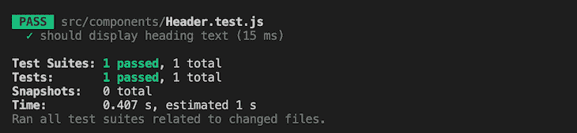

## 用 React 测试库调试测试失败

有时，不知不觉中，我们可能会编写一个测试来查询一个不存在的 DOM 元素。例如，让我们修改之前编写的查询中的文本，使其不匹配特定的元素:

```
const headingText = screen.getByText(
  'Does not exist: Fetch asynchronous posts'
);

```

由于上述更改，测试将失败，结果如下:

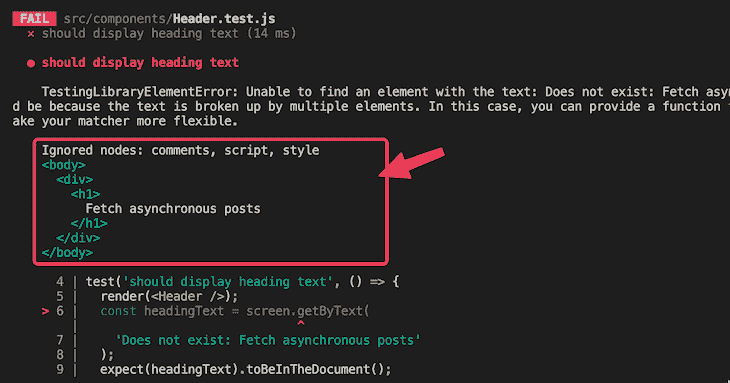

## 自动记录

当`screen.getByText()`方法没有找到匹配的 DOM 节点时，它抛出一个有意义的错误消息，如上图所示。此错误包含 DOM 的当前状态，如图中突出显示的。

由于这种失败发生时的自动记录，我们可以更容易地可视化 DOM，提示我们断言失败的原因。上图显示标题文本与我们在测试块中提供的不匹配。现在我们已经找到了错误，我们可以修复文本，这样我们的测试就会通过。

一种叫做[测试驱动开发(TDD)](https://blog.logrocket.com/test-driven-development-methods-deno/#what-test-driven-development) 的测试方法有助于使开发变得轻而易举；TDD 让我们在产品完全开发出来之前，根据产品需求编写测试用例。

## 使用`screen.debug()`方法

React 测试库从`screen`对象中公开了一个`debug()`方法来打印出 DOM 的状态。除了我们上面解释的自动日志记录之外，`debug()`方法还可以帮助我们在编写断言之前可视化 DOM 树。

### 理解`screen.debug()`语法

看看下面显示的`screen.debug()`语法:

```
screen.debug(element, maxLengthToPrint, options);

```

`debug()`方法的第一个参数是我们希望`screen.debug()`方法打印出来的`element`。该参数可以是单个元素，也可以是多个元素。如果未定义，它将默认打印根节点。

第二个参数让我们指定要打印的内容长度。默认输出长度是`7000`，这意味着内容将在七千个字符后被截断。我们可以根据需要增加或限制输出长度。

我们可能还想使用`options`参数来[配置测试格式。例如，我们可以在终端中使用参数`options`关闭语法高亮显示，如下所示:](https://github.com/facebook/jest/tree/main/packages/pretty-format#usage-with-options)

```
screen.debug(undefined, null, { highlight: false });

```

### 使用`debug()`方法的示例

使用我们最后的测试示例，我们将使用`screen.debug()`方法来调试文档状态和`heading`元素。首先，让我们考虑调试文档状态:

```
test('should display heading text', () => {
  render(<Header />);
  screen.debug();
  // assertion
});

```

由于我们没有向`debug()`传递任何参数，它将如下所示打印 DOM 树的状态:

```
<body>
  <div>
    <h1>
      Fetch asynchronous posts
    </h1>
  </div>
</body>

```

通过可视化 DOM，我们可以很容易地识别和分析测试错误，我们将在本文的后面探讨这一点。

接下来，我们考虑调试`heading`元素。为了记录`heading`元素，我们将把`heading`节点传递给`debug()`:

```
test('should display heading text', () => {
  render(<Header />);
  const headingText = screen.getByText('Fetch asynchronous posts');
  screen.debug(headingText);
  // assertion
});

```

以下是输出:

```
<h1>
  Fetch asynchronous posts
</h1>

```

使用由`debug()`方法打印的输出，我们确信目标元素存在于开发阶段。这将有助于我们在测试中做出正确的断言。

## 使用`debug()`等待出现和消失

让我们进一步探索 React 测试库`debug()`方法，看看我们如何使用它来检查程序在不同开发阶段的状态。

在本教程的前面，当从服务器获取数据时，我们看到了应用程序中显示的加载消息。数据一返回，加载消息就消失了。现在，我们将为这个异步操作编写一个测试，同时使用`debug()`方法调试测试代码。

### 创建我们的测试文件并检查 DOM 状态

为了渲染文章，我们使用了`components/Posts.js`组件文件。在同一个目录中，我们将创建一个名为`Posts.test.js`的测试文件，并添加以下代码:

```
import { render, screen } from '@testing-library/react';
import Posts from './Posts.js';

test('should display loading message', () => {
  render(<Posts />);
  screen.debug();
});

```

如果我们保存文件，我们应该看到 DOM 的当前状态:

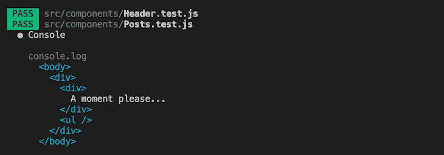

DOM 中的当前状态包含预期的加载消息。此时，数据还没有到达。

### Axios >0.27.2 将在 CRA 打破 Jest 测试

如果您在撰写本文时使用的是最新版本的 Axios 1 . 2 . 5，您可能会遇到以下错误:

```
SyntaxError: Cannot use import statement outside a module

```

这个 Jest 错误是由于较新版本的 Axios 如何发出 [ES 模块而不是 CommonJS](https://blog.logrocket.com/commonjs-vs-es-modules-node-js/) 。对此的解决方法是将`package.json`中的测试脚本更新为以下内容:

```
"test": "react-scripts test --transformIgnorePatterns \"node_modules/(?!axios)/\"",

```

另一种选择是使用 npm 将 Axios 降级到 v0.27.2:

```
npm i [email protected]

```

然后，用`Ctrl + C`停止测试，用`npm run test`重新运行。现在您应该可以看到 DOM 树的当前状态。

### 断言我们的文本在文档中

现在我们知道了 React 测试库看到的是什么，我们可以断言字符串`A moment please…`存在于文档中。为此，请将测试块更新为以下代码:

```
test('should display loading message', () => {
  render(<Posts />);
  // screen.debug();
  const loadingMessage = screen.getByText('A moment please...');
  expect(loadingMessage).toBeInTheDocument();
});

```

如果我们保存测试文件，测试应该通过，结果如下:

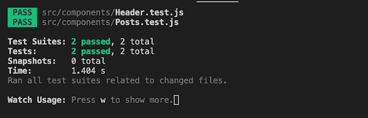

## 外观测试

让我们执行一个测试来确保我们的 post 数据从服务器返回并显示在客户机上。我们将使用`debug`方法来简化测试过程。

因为我们异步获取 post 数据，所以我们必须设置我们的测试来等待 post 在 DOM 中显示。对于这样的操作，RTL 提供了像`findBy*`和`waitFor`这样的异步方法。这些方法返回承诺，所以我们在调用它们时将通过使用`await`关键字来对待它们。下面的代码使用`findBy*`异步方法执行异步测试:

```
test('should fetch and display asynchronous posts', async () => {
  render(<Posts />);
  screen.debug(); //post initially not present
  const postItemNode = await screen.findByText('qui est esse');
  screen.debug(); //post is present
});

```

`findBy*`返回一个承诺，该承诺只有在其他情况下找到或拒绝某个元素时才会解决。我们已经用关键字`await`处理了这个返回的承诺，以防止测试在异步承诺解决之前完成。这样做有助于避免误报失败，这是一种即使应用程序中断，测试也能通过的情况。

注意我们是如何有策略地放置`debug()`方法来在 post 数据到达之前和之后可视化 DOM 树的。请参见下面的输出:

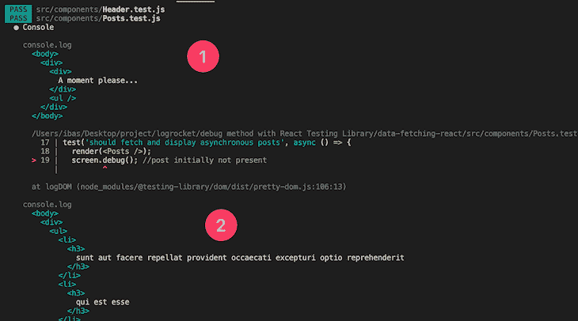

正如我们所见，`debug`方法有助于模拟应用程序的行为。当页面最初加载时，它会打印一条加载消息。当数据返回时，它用数据替换加载消息。

既然我们已经确定 post 数据已经到达，我们可以断言 DOM 中存在一个`post`条目:

```
test('should fetch and display asynchronous posts', async () => {
  render(<Posts />);
  const postItemNode = await screen.findByText('qui est esse');
  expect(postItemNode).toBeInTheDocument();
});

```

测试应该通过，结果如下:

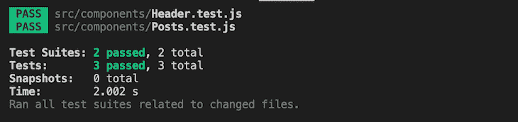

### 避免触及实际的 API

在实践中，当执行测试时，我们应该避免触及实际的 API，以防止我们的测试变得缓慢和脆弱。相反，我们应该创建模拟数据来模拟 API 交互。

本教程关注的是`debug`方法，所以我们不会讨论模仿 API。然而，[这个项目的 GitHub 库](https://github.com/Ibaslogic/react-rtl-debug)使用[模拟服务工作者(MSW)](https://blog.logrocket.com/getting-started-with-mock-service-worker/) 实现 API 模拟。

## 消失测试

为了结束我们关于 React 测试库`debug`方法的课程，我们可以测试加载消息最初出现在页面加载中，然后在 post 数据到达时消失。测试代码如下所示:

```
test('Should display loading message and disappear when posts arrive', async () => {
  render(<Posts />);
  screen.debug(); //message initially present
  await waitForElementToBeRemoved(() =>
    screen.getByText('A moment please...')
  );
  screen.debug(); //loading message not present
});

```

虽然这不是本文的重点，但 RTL 提供了 [`waitForElementToBeRemoved`](https://testing-library.com/docs/dom-testing-library/api-async/#waitforelementtoberemoved) 助手函数来测试一个元素最初异步出现，然后消失。它返回一个承诺，当目标节点从 DOM 中移除时，该承诺将被解析。

`debug()`方法的放置让我们可以在加载消息消失前后可视化 DOM 树。以下是输出:

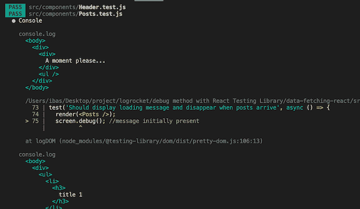

如上图所示，第一个`debug`方法打印包含加载消息的 DOM 树，而第二个`debug`方法通知我们消息不再存在，因为数据已经从服务器到达。

请记住，我们已经使用 MSW 实现了一个模拟 API 来拦截网络请求并返回响应。在这种情况下，它返回上面看到的`title 1`文本，而不是 API post 的实际数据。

现在，测试应该通过，结果如下:

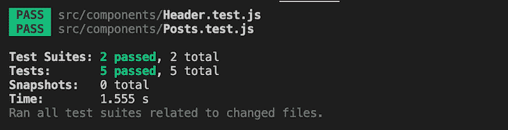

## `logRoles`功能

像`debug()`方法一样，`[logRoles](https://testing-library.com/docs/dom-testing-library/api-accessibility/#logroles)`可以记录一个元素的 ARIA 角色或应用于 DOM 树中元素的角色列表。这个过程有助于使测试更容易，我们马上就会看到。

在本教程中，我们使用了`getByText`和`findByText`查询方法来查找页面上的元素。在这一过程中，RTL 将`*ByRole`的同行放在的[优先级列表的顶端。](https://testing-library.com/docs/queries/about#priority)

要使用`*ByRole`查询，我们必须熟悉 HTML 元素中隐含的角色。在处理非语义元素时，我们可以手动提供一个`role`属性。像`<button>`这样的语义元素有一个隐含的角色`button`。请随意查看适用于 HTML 元素的 ARIA 角色的[列表。](https://www.w3.org/TR/html-aria/#docconformance)

使用`logRoles`函数，我们可以很容易地记录元素的隐式 ARIA 角色，以便在我们的可访问性测试中使用。如果我们使用`findByText`重温我们之前的测试，我们可以像这样将助手函数应用到我们的测试代码中:

```
import {
  // ...
  logRoles,
} from '@testing-library/react';
// ...
test('should view implicit roles with logRoles', async () => {
  render(<Posts />);
  const postItemNode = await screen.findByText('title 1');
  logRoles(postItemNode);
  expect(postItemNode).toBeInTheDocument();
});

```

在上面的代码中，我们从测试库中导入`logRoles`开始。然后，我们将目标节点作为参数传递给函数。输出将为我们提供该元素的 ARIA 角色:

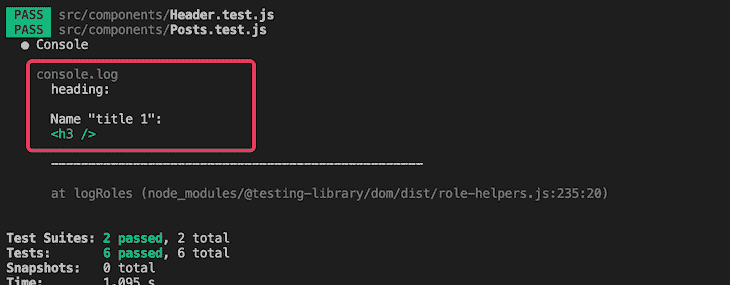

如上图所示，咏叹调角色是`heading`。我们可以重构测试代码来使用`findByRole`可访问的查询，而不是`findByText`，因此我们有如下代码:

```
test('should view implicit roles with logRoles', async () => {
  render(<Posts />);
  const postItemNode = await screen.findByRole('heading', {
    name: 'title 1',
  });
  expect(postItemNode).toBeInTheDocument();
});

```

为了保证我们的 UI 是可访问的，我们应该考虑在其他查询类型之前使用`*ByRole`。

要打印应用于 DOM 树中元素的 ARIA 角色列表，我们可以将呈现的容器元素作为参数传递给`logRoles`。代码将如下所示:

```
test('should view implicit roles with logRoles', async () => {
  const view = render(<Posts />);
  const postItemNode = await screen.findByRole('heading', {
    name: 'title 1',
  });
  logRoles(view.container);
  expect(postItemNode).toBeInTheDocument();
});

```

现在，输出将如下图所示:

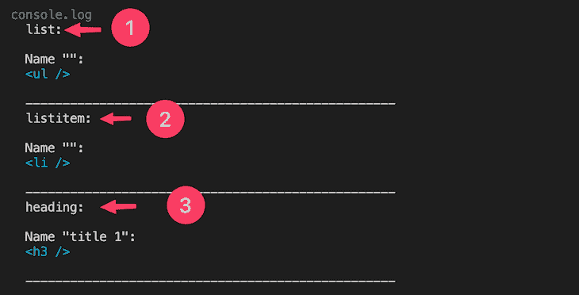

如上所示，输出包含 DOM 元素及其各自的 ARIA 角色。我们可以通过这些元素的隐含角色来定位它们。例如，如果我们想要断言一个`li`项在 DOM 中可见，我们可以编写下面的测试:

```
test('should list item visible in the DOM', async () => {
  render(<Posts />);
  const postItemNode = await screen.findByRole('listitem');
  expect(postItemNode).toBeVisible();
});

```

## 用`logTestingPlaygroundURL()`方法调试

`screen`对象还公开了`logTestingPlaygroundURL()`方法，这进一步简化了调试测试。当我们在测试代码中使用这个方法时，RTL 在编辑器终端[中返回一个链接，指向一个测试平台](https://testing-playground.com/)。

如果您知道 testing playground 是如何工作的，我们可以粘贴使用`debug()`方法打印的 DOM 树，以找到对目标元素的最佳查询。例如，让我们重温一下我们的第一个示例测试。正如我们所知，使用`debug()`方法将打印 DOM 树:

```
test('should display heading text', () => {
  render(<Header />);
  screen.debug();
});

```

打印后，DOM 树应该如下所示:

```
<div>
  <h1>
    Fetch asynchronous posts
  </h1>
</div>

```

记住，在示例中，我们以标题节点为目标，并使用`screen.getByText()`方法进行断言，如下所示:

```
test('should display heading text', () => {
  render(<Header />);
  const headingText = screen.getByText('Fetch asynchronous posts');
  expect(headingText).toBeInTheDocument();
});

```

虽然这是可行的，但是正如我们在`logRoles`部分中提到的，我们应该考虑在其他查询类型之前使用可访问的查询。对于不确定最适合使用的查询方法的初学者来说，playground 可以提供帮助。

如果我们将 DOM 元素复制到 testing playground(标签 1)，我们可以在视图中选择元素(标签 2)。然后，我们将看到一个建议的查询，标签为 3，我们可以将它复制到我们的测试中:

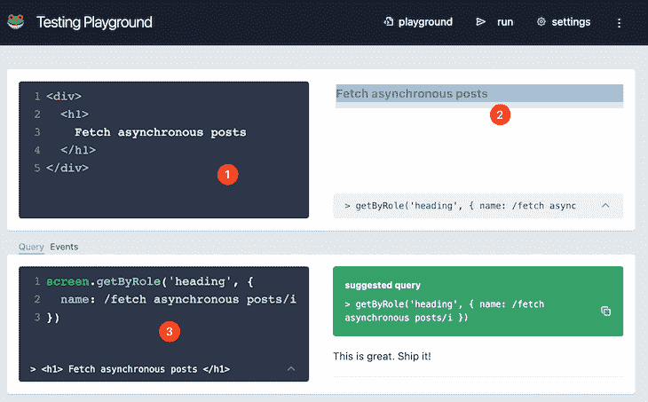

现在，有了这个查询，一个更容易访问的测试将看起来像下面的代码:

```
test('should display heading text', () => {
  render(<Header />);
  const headingText = screen.getByRole('heading', {
    name: /fetch asynchronous posts/i,
  });
  expect(headingText).toBeInTheDocument();
});

```

记住这个操场，让我们在测试块中使用`screen.logTestingPlaygroundURL()`,如下所示:

```
test('should display heading text', () => {
  render(<Header />);
  screen.logTestingPlaygroundURL();
});

```

然后，在我们运行测试之后，RTL 将生成一个到操场的链接:

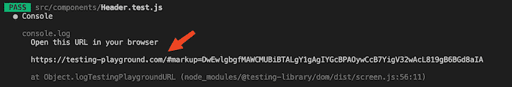

如果我们访问这个链接，我们将得到与上面显示的操场 UI 相当的东西。因此，我们不必使用`debug()`方法将 DOM 树打印并复制到操场中。相反，它会自动添加。

在没有`debug()`方法的情况下，通过`screen.logTestingPlaygroundURL()`方法查看操场让我们一眼就能看出哪些元素对用户是可见的。它还建议了针对元素的最合适的查询方法。

## 结论

如果你刚刚开始使用，测试可能会很麻烦。然而，调试的能力可以使这个过程变得轻而易举。

在本文中，我们讨论了如何使用 React 测试库中的`debug()`方法来识别和分析测试错误。我们还学习了如何使用`logTestingPlaygroundURL()`方法来进一步简化调试过程。如果你喜欢这一课，一定要留下评论。编码快乐！

## [LogRocket](https://lp.logrocket.com/blg/react-signup-general) :全面了解您的生产 React 应用

调试 React 应用程序可能很困难，尤其是当用户遇到难以重现的问题时。如果您对监视和跟踪 Redux 状态、自动显示 JavaScript 错误以及跟踪缓慢的网络请求和组件加载时间感兴趣，

[try LogRocket](https://lp.logrocket.com/blg/react-signup-general)

.

[ ](https://lp.logrocket.com/blg/react-signup-general) [](https://lp.logrocket.com/blg/react-signup-general) 

LogRocket 结合了会话回放、产品分析和错误跟踪，使软件团队能够创建理想的 web 和移动产品体验。这对你来说意味着什么？

LogRocket 不是猜测错误发生的原因，也不是要求用户提供截图和日志转储，而是让您回放问题，就像它们发生在您自己的浏览器中一样，以快速了解哪里出错了。

不再有嘈杂的警报。智能错误跟踪允许您对问题进行分类，然后从中学习。获得有影响的用户问题的通知，而不是误报。警报越少，有用的信号越多。

LogRocket Redux 中间件包为您的用户会话增加了一层额外的可见性。LogRocket 记录 Redux 存储中的所有操作和状态。

现代化您调试 React 应用的方式— [开始免费监控](https://lp.logrocket.com/blg/react-signup-general)。