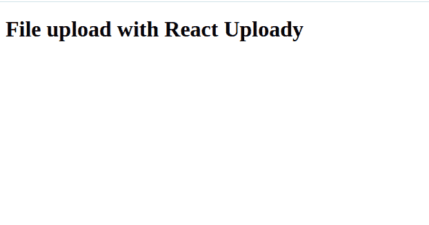
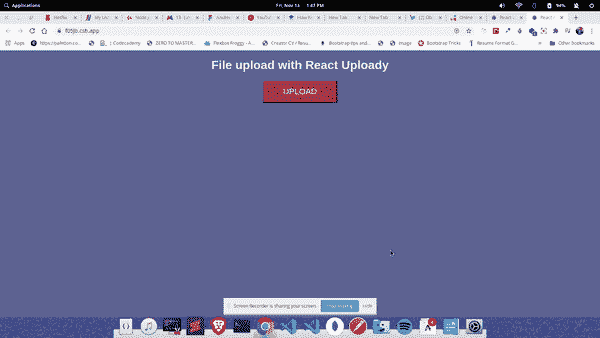

# 使用 React Uploady 上传文件

> 原文：<https://blog.logrocket.com/using-react-uploady-to-upload-files/>

创建应用程序时，能够上传文件是一项基本要求。上传文件意味着来自客户端的用户应该能够上传文件到服务器。有许多方法可以实现这一点，因为每个文件系统都有自己的实现。

在本文中，我们将通过构建一个文件上传系统来看看 React 中的文件上传。

## 什么是反应上传？

根据其官方[文档，](https://github.com/rpldy/react-uploady) React-Uploady 是一个轻量级库，它使开发人员只需几行代码就可以构建客户端的文件上传功能。

本质上，它是一个专注于 React 应用程序的现代文件上传组件和钩子的库。它也是一个所有文件上传功能的一体化商店，比如文件上传进度、上传按钮和上传增强器。

## 先决条件

对于本文，您需要:

*   [Node.js](https://nodejs.org/en/download/) 和 NPM 安装在你的机器上
*   JavaScript 的基础知识以及 [React.js](https://reactjs.org/) 如何工作

首先，安装官方 React 应用脚手架工具，`[create-react-app](https://github.com/facebook/create-react-app)`:

```
npm install -g create-react-app

```

您可以通过运行`create-react-app`来验证安装。这将要求您指定目录名。

## React Uploady 是如何工作的？

React uploady 背后的想法是，它应该易于使用，也可以定制。为了实现这一点，React Uploady 为事件和特性提供了组件和挂钩。利用这一点，我们将建立一个简单的上传系统。

## react 上传入门

我们将使用`create-react-app`来启动我们的项目。`create-react-app`是一个由脸书和社区维护的开源工具，帮助开发者在很短的时间内启动一个`react`项目。

要使用`create-react-app`样板文件创建一个新项目，请在您喜欢的终端中运行这个命令:

```
create-react-app react-uploady 

```

名称`react-uploady`被用作这个项目的项目名称，但是它可以替换为您选择使用的任何名称。

接下来，切换到项目目录，通过运行以下命令启动开发服务器:

```
cd react-uploady && npm start 

```

该命令打开一个浏览器选项卡，呈现默认的样板应用程序。

## 建立我们的上传系统

React Uploady 包含像`UploadButton`这样的钩子和组件，它处理上传按钮，甚至还有一个`Upload Preview`来预览我们的文件上传。

为了开始使用我们的系统，让我们首先使用我们的终端安装以下软件包:

```
npm i @rpldy/upload-button @rpldy/uploady rc-progress

```

在上面的代码中，我们安装了:

*   这是一个来自 React Uploady 的组件，用于我们的上传按钮
*   这是 React 上传库的主包
*   这是一个显示文件上传进度的包

接下来，让我们为我们的系统创建一个`Header`组件。为此，在我们的`src`文件夹中创建一个名为`Header.js`的新文件。请注意，文件名可以是您想要的任何名称。

接下来，我们创建一个如下所示的功能组件。

```
import React from "react";

export default function App() {
  return (
    <div>
      <h1>File upload with React Uploady</h1>
    </div>
  );
}

```

这里，我们创建了一个带有`h1`标签的功能组件，标签上写着“使用 React Uploady 上传文件”

接下来，让我们在下面的`App`组件中渲染`Header`组件。

```
import React from "react";

export default function App() {
  return (
      <div className="App">
        <Header />
      </div>
      );
  }     

```

我们在`App`组件中呈现了`Header`组件，我们应该在浏览器中看到类似下图的结果。



接下来，让我们在我们的`App.js`组件中构建我们的上传系统，并构建一个简单的类似的上传。为此，我们需要导入我们的包，从`upload-button`包中呈现我们的上传按钮，并用`Uploady`组件包装我们的应用程序:

```
import React, { useState } from "react";
import Header from "./Header";
import "./App.css";

import { Line } from "rc-progress";
import Uploady, { useItemProgressListener } from "@rpldy/uploady";
import UploadButton from "@rpldy/upload-button";
import { createMockSender } from "@rpldy/sender";

```

在上面的代码中，我们从`rc-progress`包中导入了`Line`风格的文件上传。接下来，我们从`@rpldy/uploady`导入上传和进度监听器，然后从`@rpldy/upload-button`导入上传按钮。

我们还从`@rpldy/sender`导入了一个模拟发送器，用于替换真实的发送器进行测试。

接下来，让我们构建我们的文件上传进程，首先为它构建一个状态，并在我们的应用程序中将其呈现为一个组件。

```
const UploadProgress = () => {
  const [progress, setProgess] = useState(0);

  const progressData = useItemProgressListener();

  if (progressData && progressData.completed > progress) {
    setProgess(() => progressData.completed);
  }

```

在上面的代码中，我们创建了一个名为`UploadProgress`的函数。然后我们使用`setState`钩子将`progress`初始化为初始状态，并将其设置为初始状态 0。

* * *

### 更多来自 LogRocket 的精彩文章:

* * *

之后，我们将`progressData`变量设置为`useItemProgressListener`，这是从 React Uploady 获得的。在第六行，使用一个`if`语句，我们说如果`progressData`大于进度，那么将进度设置为“进度数据完成”

为了完成文件上传的进度条，让我们返回进度条的行并设置它的样式:

```
 return (
    progressData && (
      <Line
        style={{ height: "10px", marginTop: "20px" }}
        strokeWidth={2}
        strokeColor={progress === 100 ? "#00a626" : "#2db7f5"}
        percent={progress}
      />
    )
  );
};

```

这里，我们使用从`rc-progress`导入的`Line`组件。注意我们添加了高度和边距顶部，我们还添加了`2`作为笔画的宽度。

使用一个开关操作符，我们为进度条加载和完成添加了颜色。最后，我们将进度条的百分比设置为进度。

为了完成我们的应用程序，让我们在我们的应用程序上渲染所有这些，看看它在我们的浏览器上是什么样子。

```
export default function App() {
  return (
    <Uploady
      destination={{ url: "http://server.com" }}
      enhancer={mockEnhancer}
    >
      <div className="App">
        <Header />
        <UploadButton />
        <UploadProgress />
      </div>
    </Uploady>
  );
}

```

在上面的代码中，我们使用`Uploady`组件包装了`App`组件，并为我们的文件上传设置了一个目的地。因为这是为了测试，我们可以设置一个虚拟服务器作为我们的目的地。

然后我们呈现了`Header`组件、`UploadButton`和`UploadProgress`，我们之前已经将它们初始化为一个函数。我们的应用程序应该如下图所示。


我们的申请快完成了。

为了完成它，让我们为我们的上传系统添加样式和增强器。增强器是可以增强上传器实例的功能。使用它们，我们可以为我们的文件上传添加自定义功能。让我们现在就开始吧:

```
const mockEnhancer = (uploader) => {
  const mockSender = createMockSender({ delay: 1500 });
  uploader.update({ send: mockSender.send });
  return uploader;
};

```

在上面的代码中，我们创建了一个函数`mockEnhancer`，它将 uploader 作为一个方法。在其中，我们初始化了从`@rpldy/sender`导入的 mocksender 方法。然后，我们添加了 1.5 秒的延迟，并返回上传者。这样做是为了模仿实际的发送和上传。

让我们在下面添加样式，然后看看我们的应用程序的最终面貌。

```
.App {
  font-family: arial, sans-serif;
  text-align: center;
  margin-top: 20px;
}
body {
  background: #5c6e91;
  color: #eeeded;
}
button {
  height: 60px;
  width: 200px;
  font-size: 22px;
  background-color: #8f384d;
  color: #eeeded;
  text-transform: uppercase;
  cursor: pointer;
}

```

下面是我们最后一个应用的视频，一个带 React Uploady 的文件上传系统:



## 结论

在这篇文章中，我们学习了 React Uploady 以及如何使用它来构建一个简单的文件上传系统。我们还看到了如何使用 ES6 JavaScript 为我们的文件上传编写逻辑。

你可以在 LogRocket 上阅读更多 React 文章，在这里查看 React Uploady [的官方文档。代码和应用程序的工作版本可以在](https://github.com/rpldy/react-uploady)[这里](https://codesandbox.io/s/react-uploady-f05jb?file=/src/App.js:72-91)找到。

## 使用 LogRocket 消除传统反应错误报告的噪音

[LogRocket](https://lp.logrocket.com/blg/react-signup-issue-free)

是一款 React analytics 解决方案，可保护您免受数百个误报错误警报的影响，只针对少数真正重要的项目。LogRocket 告诉您 React 应用程序中实际影响用户的最具影响力的 bug 和 UX 问题。

[ ](https://lp.logrocket.com/blg/react-signup-general) [  ](https://lp.logrocket.com/blg/react-signup-general) [LogRocket](https://lp.logrocket.com/blg/react-signup-issue-free)

自动聚合客户端错误、反应错误边界、还原状态、缓慢的组件加载时间、JS 异常、前端性能指标和用户交互。然后，LogRocket 使用机器学习来通知您影响大多数用户的最具影响力的问题，并提供您修复它所需的上下文。

关注重要的 React bug—[今天就试试 LogRocket】。](https://lp.logrocket.com/blg/react-signup-issue-free)