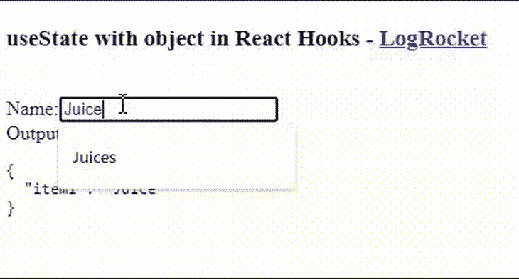
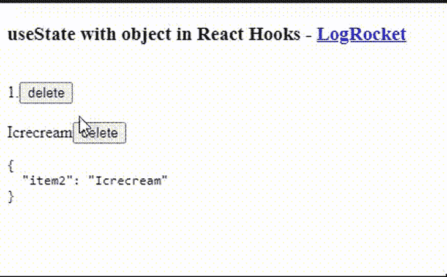

# 将 React useState 与对象日志火箭博客一起使用

> 原文：<https://blog.logrocket.com/using-react-usestate-object/>

React 的创建是为了帮助开发人员在他们的浏览器中比使用普通 Javascript 的传统方式更容易和有效地执行文档对象模型(DOM)操作。

React 最常用的钩子之一是`useState`，它管理 React 项目中的状态以及对象的状态。但是，对于一个对象，我们不能直接更新它，否则组件不会重新呈现。

为了解决这个问题，我们将看看在处理对象时如何使用`useState`，包括用一个属性创建一个临时对象的方法，以及使用对象析构从两个现有对象创建一个新对象的方法。

## 更新 React 对象中项目的状态

为了理解[如何管理一个对象的状态](https://blog.logrocket.com/how-to-choose-the-right-react-state-management-solution/)，我们必须更新对象中一个项目的状态。

在下面的代码示例中，我们将创建一个状态对象`shopCart,`及其设置者`setShopCart`。然后`shopCart`携带对象的当前状态，同时`setShopCart`更新`shopCart`的状态值:

```
const [shopCart, setShopCart] = useState({});

let updatedValue = {};
updatedValue = {"item1":"juice"};
setShopCart(shopCart => ({
      ...shopCart,
      ...updatedValue
    }));
```

然后我们可以创建另一个对象`updatedValue`，它携带状态值来更新`shopCart`。

通过将`updatedValue`对象设置为新的`{"item1":"juice"}`值，`setShopCart`可以将`shopCart`状态对象的值更新为`updatedValue`中的值。

为了更进一步，我们可以创建一个函数来包装提交表单所触发的删除逻辑:

```
import React, { useState } from 'react';

function App() {
 const [shopCart, setShopCart] = useState({item1:"Juice"});
 const handleChange = (e) => {
 let updatedValue = {};
 updatedValue = {item1:e.target.value};
 setShopCart(shopCart => ({
      ...shopCart,
      ...updatedValue
    }));
  }
  return (
    <div classname="App">
      <h3>useState with object in React Hooks - <a href="https://www.logrocket.com">LogRocket</a></h3>
      <br/>
      <label>Name:</label>
      <input type="text" name="item1" defaultValue={shopCart.item1} onChange={(e) => handleChange(e)}/>
      <br></br>
      <label>Output:</label>
      <pre>{JSON.stringify(shopCart, null, 2)}</pre>
    </div>
  );
}

export default App;

```

通过将我们之前讨论的逻辑包装在一个`handleChange`函数中，我们可以处理输入字段中的任何变化。

在输入字段中，让我们将输入元素的值设置为`shopCart`对象中`item1`的值，这允许用户在输入字段中对其进行更改时看到它的值。

接下来，让我们向每个输入元素添加`onChange`事件处理程序，确保当我们在输入字段中进行任何更改时，都会触发`handleChange`函数。最后，当我们对`shopCart`对象进行修改时，我们可以显示它的当前状态。



## 在 React 中从对象中移除项目

可以使用相同的技术从对象中移除项目:

```
const [shopCart, setShopCart] = useState({item1:"Juice", item2: "Icrecream"});

let copyOfObject = { ...shopCart }
delete copyOfObject['propertyToRemove']

setShopCart( shopCart => ({
      ...copyOfObject
    }));

```

通过创建一个`shopCart`状态对象的副本，我们可以从它的副本`copyOfObject`中删除一个项目。然后，我们可以使用之前定义的 setter 对象`setShopCart`，将原始对象`shopCart`的状态设置为复制对象`copyOfObject`的值。

为了更进一步，我们可以创建一个函数来包装逻辑，然后通过单击一个按钮来触发:

```
import React, { useState } from 'react';

function App() {

  const [shopCart, setShopCart] = useState({item1:"Juice", item2:"Icrecream"});

const handleClick = (item_id,e) => {
  let copiedShopCart = {...shopCart};
  delete copiedShopCart[item_id];
  setShopCart( shopCart => ({
      ...copiedShopCart
    }));
  console.log(shopCart);
}

  return (
    <div classname="App">
      <h3>useState with object in React Hooks - <a href="https://www.logrocket.com">LogRocket</a></h3>
      <br/>
      1.{shopCart.item1}
      <button onClick={(e) => handleClick("item1",e)}>delete</button>
      <br/>
      <br/>
      {shopCart.item2}
      <button onClick={(e) => handleClick("item2",e)}>delete</button>
      <pre>{JSON.stringify(shopCart, null, 2)}</pre>
    </div>
  );
}

export default App;

```

同样，我们将之前讨论过的逻辑包装在`handleClick`函数中，该函数处理来自附加到它的按钮的任何点击事件。

这允许我们在`shopCart`对象中列出两个项目，并为每个项目创建一个按钮。

通过使用`onClick`事件将`handleClick`函数附加到按钮上，我们可以将`shopCart`对象中每个项目的 ID 传递给`handleClick`函数，以检测当函数触发时要删除哪个项目。



## 结论

本文教你如何使用对象的使用状态，以及如何使用对象更新和删除条目。

我推荐阅读这篇文章来了解更多关于使用状态的信息。如果你有任何问题，不要犹豫，在推特上联系我，电话: [@LordChuks3](https://twitter.com/LordChuks3) 。

## 使用 LogRocket 消除传统反应错误报告的噪音

[LogRocket](https://lp.logrocket.com/blg/react-signup-issue-free)

是一款 React analytics 解决方案，可保护您免受数百个误报错误警报的影响，只针对少数真正重要的项目。LogRocket 告诉您 React 应用程序中实际影响用户的最具影响力的 bug 和 UX 问题。

[ ](https://lp.logrocket.com/blg/react-signup-general) [  ](https://lp.logrocket.com/blg/react-signup-general) [LogRocket](https://lp.logrocket.com/blg/react-signup-issue-free)

自动聚合客户端错误、反应错误边界、还原状态、缓慢的组件加载时间、JS 异常、前端性能指标和用户交互。然后，LogRocket 使用机器学习来通知您影响大多数用户的最具影响力的问题，并提供您修复它所需的上下文。

关注重要的 React bug—[今天就试试 LogRocket】。](https://lp.logrocket.com/blg/react-signup-issue-free)