# 在 React 中使用 Recharts 添加图表

> 原文：<https://blog.logrocket.com/using-recharts-react-add-charts/>

如今，可视化是必不可少的，你如何呈现信息也很重要。由于手头有大量的数据，整理和理解这些数据通常会很繁琐，尤其是在没有很好地呈现的情况下。

为了让数据更容易理解，图表是组织和可视化数据的好方法。对于 React 应用程序，开发人员可以使用基于 JavaScript 的开源“基于 React 组件构建的可组合图表库”Recharts。

在本教程中，我们将通过构建一个小型 React 应用程序来学习如何使用 Recharts，该应用程序从一个健全的内容湖中获取数据，以一种视觉上吸引人的方式汇总大量数据集。

## Recharts 教程要求

要学习本教程，您必须具备以下条件:

*   安装在计算机上的 Node.js v14
*   代码编辑器(我使用的是 [Visual Studio 代码](https://blog.logrocket.com/top-10-vs-code-extensions-2021/)
*   纱线包装经理

## 设置 Recharts 项目

要开始我们的项目，我们必须首先在我们的机器上安装 Sanity CLI，这可以通过运行以下命令来完成:

```
yarn install -g @sanity/cli

```

这将全局安装命令行工具，以设置新项目、管理数据集、导入数据等。我们将使用它来启动和运行我们的项目。

关于这方面的更多信息，请阅读健全性文档。

### 创建健全项目

接下来，我们必须开始我们的理智项目。为此，请运行以下命令:

```
sanity init

```

上面的命令将要求您选择您的登录类型:或者`Google`、`GitHub`、`Email/password`。

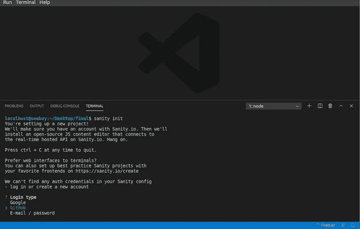

您可以为您的项目选择最方便的浏览器，它会立即打开您的默认浏览器并完成注册/登录过程。

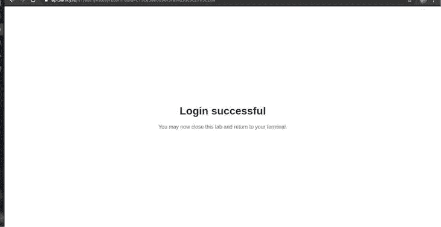

回到您的终端，系统将提示您:

*   导入您喜欢的项目名称
*   选择数据集首选项(使用默认值)
*   确认项目的路径
*   选择一个模式

在发表本文时，Sanity 只提供了三种现成的、已经填充好的模式:`Movie project (schema + sample data)`、`E-commerce (Schema + sample data)`和`Blog(schema + empty data)`。

然而，对于这个项目，我们必须选择`Clean project with no predefined schemas`选项，因为我们必须自己定义我们的模式。

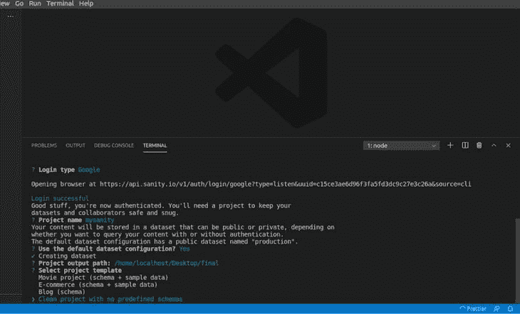

安装完成后，我们可以看到在项目文件夹中创建的文件和文件夹。要启动 Sanity，请运行以下命令:

```
sanity start

```

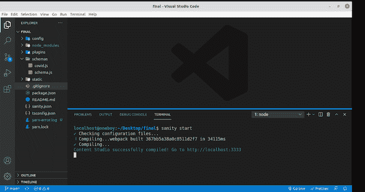

接下来，我们必须安装必要的节点模块，编译，并在 [http://localhost:3333](http://localhost:3333/) 启动项目。登录时，请确保选择了创建项目时使用的同一提供商。

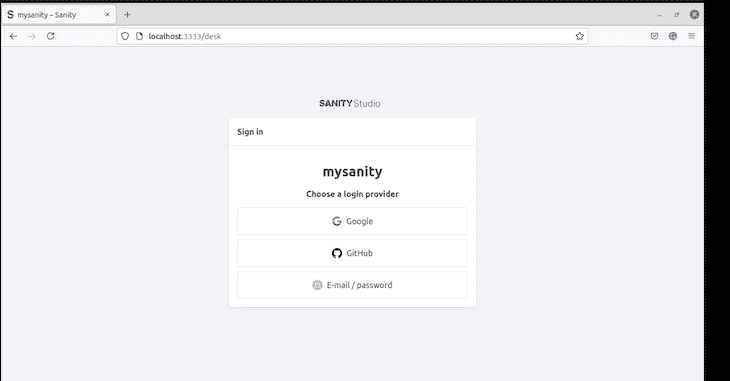

现在，让我们添加我们的模式代码；这就是简单的内容建模，即识别、整理和将所有内容关联到一个集中结构中的过程，这样我们就可以构建高效的工作流和数据结构。

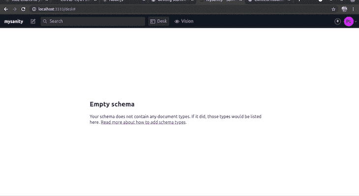

你可以在这里找到更多关于内容建模的信息。

我们将在这个项目中使用的数据来自[约翰·霍普斯金 GitHub 页面](https://github.com/CSSEGISandData/COVID-19/tree/master/csse_covid_19_data/csse_covid_19_daily_reports_us)，它提供了 Covid 病例的每日报告，包括我们感兴趣的字段:省/州、确诊病例和死亡人数。

我们将特别使用 2021 年 1 月 1 日的[数据来表示我们的图表](https://github.com/CSSEGISandData/COVID-19/blob/master/csse_covid_19_data/csse_covid_19_daily_reports_us/01-01-2021.csv)。为此，首先，在`schemas`文件夹中创建一个名为`covid.js`的文件，复制并粘贴下面的代码。

该文件定义了特定模式的结构:

```
// schemas/covid.js

export default{
    name: "covid",
    type : "document",
    title: "Covid19Data",
    fields: [
      {
      name: "title",
      type: "string",
      title: "States"
      },
      {
        name: "confirmed",
        type: "number",
        title: "Confirmed"
      },
        {
          name: "death",
          type: "number",
          title: "Death"
          },
    ],
  }

```

现在，我们必须将`covid.js`导入到我们的`schemas`文件夹中的`schema.js`文件中，就像这样:

```
// schemas/schema.js
// First, we must import the schema creator
import createSchema from 'part:@sanity/base/schema-creator'
// Then import schema types from any plugins that might expose them
import schemaTypes from 'all:part:@sanity/base/schema-type'
import covid from './covid'
// Then we give our schema to the builder and provide the result to Sanity
export default createSchema({
  // We name our schema
  name: 'default',
  // Then proceed to concatenate our document type
  // to the ones provided by any plugins that are installed
  types: schemaTypes.concat([
    /* Your types here! */
    covid,

  ]),
}

```

现在，回到 [http://localhost:3333](http://localhost:3333/) ，我们会看到:

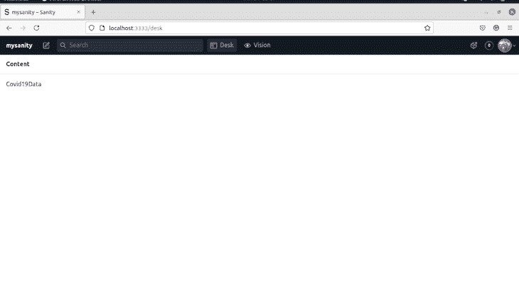

`Covid19Data`是我们在包含`States`、`Confirmed`和`Death`的模式中创建的文档的标题。

`States`显示了 Covid 病例的地点，`Confirmed`显示了 Covid 检测呈阳性的人数，`Death`显示了该州死于 Covid 的人数。

我们现在可以用来自 [01/01/2021](https://github.com/CSSEGISandData/COVID-19/blob/master/csse_covid_19_data/csse_covid_19_daily_reports_us/01-01-2021.csv) 数据集的数据填充我们的项目。

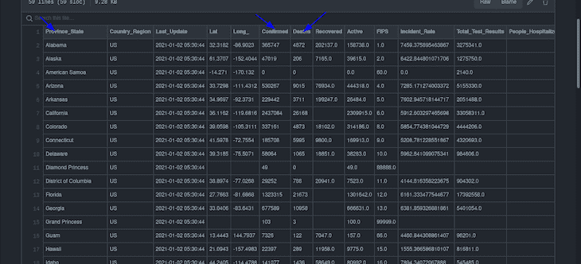

请注意，我们必须仅从以下内容中复制`Province_State`、`Confirmed`和`Deaths`列:


## 创建 React 应用程序

既然我们的 Sanity 项目已经启动并运行，是时候用 React 设置我们的前端应用程序了。

首先，创建一个空文件夹并运行以下命令:

```
npx create-react-app frontendfinal

```

是我决定给我的项目起的名字，但是记住，你的可以是任何东西。

安装 React 后，就该安装 Recharts 了。首先，`cd`变成`frontendfinal`

```
cd frontendfinal

```

然后，我们可以安装`recharts`:

```
npm install recharts

```

在文本编辑器中打开它，并导航到`package.json`，这将打开以下内容:

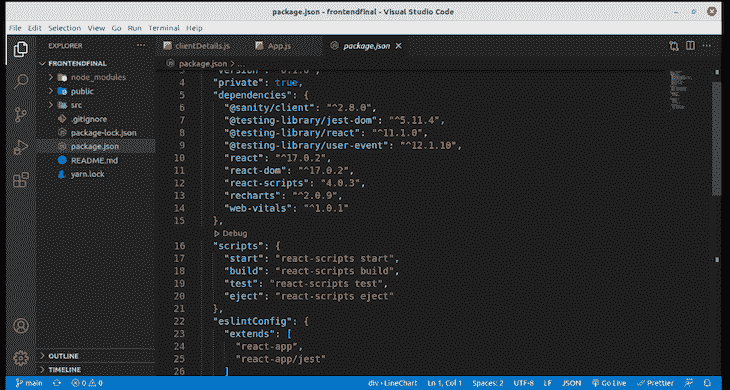

现在，我们的 React 应用程序中安装了 Recharts！

## 清理 React 代码

`create react app`命令快速启动 React 应用程序；现在，我们只需要对它进行一些修改来适应我们的用例，因为我们不需要`create react app`附带的所有东西。

对于这个特殊的用例，我们不需要在`src`文件夹中使用`App.css`或`logo.svg`；干脆把`App.js`里面的代码都删了。

## 安装健全客户端

为了让 React 应用程序连接到正在运行的 Sanity 实例，[您必须通过运行以下命令来安装](https://www.npmjs.com/package/@sanity/client) `[sanity/client](https://www.npmjs.com/package/@sanity/client)`:

```
npm install --save @sanity/client

```

接下来，在`src`文件夹中创建一个文件。我决定使用`clientDetail.js`，所以在`clientDetail.js`内部，复制粘贴以下代码，适当替换细节:

```
// src/clientDetails.js
const sanityClient = require('@sanity/client')
const client = sanityClient({
  projectId: 'xxxxxxx',
  dataset: 'production',
  apiVersion: '2021-03-25', // use a UTC date string
  useCdn: false, // `false` if you want to ensure fresh data
})
export default client;

```

您可以通过登录您的 Sanity 帐户并选择您的项目来获得您的`projectId`。像数据集这样的其他信息也在那里。

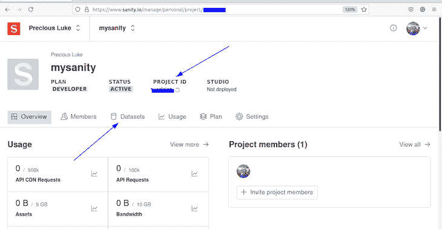

同样，[为了避免 CORS 问题](https://developer.mozilla.org/en-US/docs/Web/HTTP/CORS)，Sanity 允许您添加请求的来源。要添加新原点，请遵循以下步骤:

*   在**设置下** > **API 设置** > **CORS 出身**
*   点击**添加 CORS 原点**添加 [http://localhost:3000](http://localhost:3000) ，这就是你的 React 网址
*   部署此应用程序时，添加您的应用程序 URL
*   勾选**允许凭证** > **保存**

在下面的屏幕截图中，这些步骤已经进行了可视化编号:

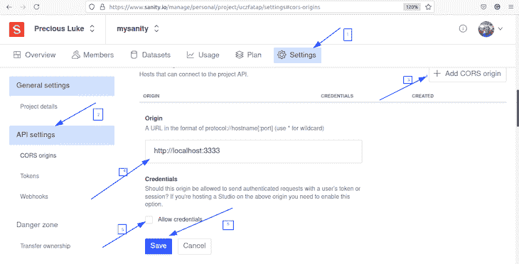

回到我们的`App.js`文件，我们必须从`react`文件导入`useState, useEffect`，从`clientDetails.js`文件导入`client`，并从 Recharts ( `LineChart`、`Line`、`XAxis`、`YAxis`、`CartesianGrid`、`Tooltip`、`Legend`)导入一些组件来表示数据。

我们的`App.js`文件看起来会像这样:

```
// src/App.js
import React, { useState, useEffect } from "react";
import client from "./clientDetails";
import {
  LineChart,
  Line,
  XAxis,
  YAxis,
  CartesianGrid,
  Tooltip,
  Legend,
} from "recharts";

```

然后，我们可以创建一个名为`App`的功能组件，它将使用`useState`、`useEffect`、[，并使用 GROQ](https://www.sanity.io/docs/groq) 从我们的 Sanity 实例中获取数据:

```
// src/App.js
import React, { useState, useEffect } from "react";
import client from "./clientDetails";
import {
  LineChart,
  Line,
  XAxis,
  YAxis,
  CartesianGrid,
  Tooltip,
  Legend,
} from "recharts";
export default function App() {
  const [covidData, setcovidData] = useState(null);
  useEffect(() => {
    client
      .fetch(
        `*[_type == 'covid']{
      confirmed,
      title,
      death
      }`
      )
      .then((data) => {
        setcovidData(data);
      })
      .catch(console.error);
  }, []);

```

然后我们必须返回一个包含所有导入的 Recharts 组件和一些已定义属性的`div`标签。

我们的`App.js`完整代码应该如下:

```
// src/App.js
import React, { useState, useEffect } from "react";
import client from "./clientDetails";
import {
  LineChart,
  Line,
  XAxis,
  YAxis,
  CartesianGrid,
  Tooltip,
  Legend,
} from "recharts";
export default function App() {
  const [covidData, setcovidData] = useState(null);
  useEffect(() => {
    client
      .fetch(
        `*[_type == 'covid']{
      confirmed,
      title,
      death
      }`
      )
      .then((data) => {
        setcovidData(data);
      })
      .catch(console.error);
  }, []);
  return (
    <div>
      {!covidData && <div>Loading</div>}
      {covidData && (
        <LineChart
          width={1000}
          height={400}
          data={covidData}
          margin={{
            top: 10,
            right: 30,
            left: 0,
            bottom: 0,
          }}
        >

          <CartesianGrid strokeDasharray="3 3" />
          <XAxis dataKey="title" />
          <YAxis />
          <Tooltip />
          <Legend />
          <Line
            type="monotone"
            dataKey="death"
            stroke="#8884d8"
            fill="#8884d8"
          />
           <Line
            type="monotone"
            dataKey="confirmed"
            stroke="#8884d8"
            fill="#8884d8"
          />
        </LineChart>
      )}
    </div>
  );
}

```

为了运行我们的最终代码，我们可以使用以下代码运行 React 应用程序:

```
npm run start

```

然后，我们可以在 [http://localhost:3000/](http://localhost:3000/) 启动它:

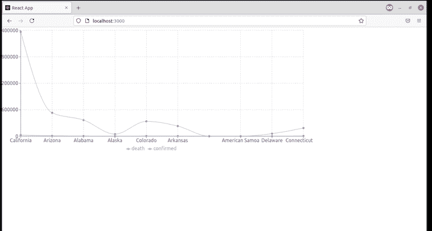

恭喜你，你能看透这一切！

## 结论

可视化对于组织数据至关重要，而且最重要的是我们要明智而简洁地呈现它。我们能够从 Sanity 获取数据到 React 应用程序，并使用 Recharts 显示它。

你可以在这里找到这个项目的源代码，包括 [React app](https://github.com/bigpreshy/Recharts) 和 [Sanity codebase](https://github.com/bigpreshy/sanityproject) 。

## 使用 LogRocket 消除传统反应错误报告的噪音

[LogRocket](https://lp.logrocket.com/blg/react-signup-issue-free)

是一款 React analytics 解决方案，可保护您免受数百个误报错误警报的影响，只针对少数真正重要的项目。LogRocket 告诉您 React 应用程序中实际影响用户的最具影响力的 bug 和 UX 问题。

[ ](https://lp.logrocket.com/blg/react-signup-general) [  ](https://lp.logrocket.com/blg/react-signup-general) [LogRocket](https://lp.logrocket.com/blg/react-signup-issue-free)

自动聚合客户端错误、反应错误边界、还原状态、缓慢的组件加载时间、JS 异常、前端性能指标和用户交互。然后，LogRocket 使用机器学习来通知您影响大多数用户的最具影响力的问题，并提供您修复它所需的上下文。

关注重要的 React bug—[今天就试试 LogRocket】。](https://lp.logrocket.com/blg/react-signup-issue-free)