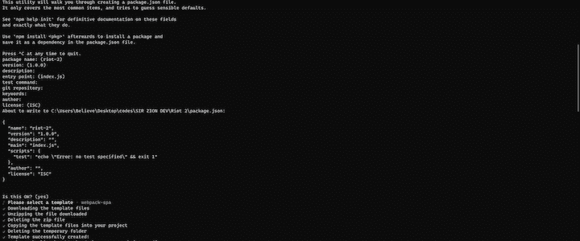
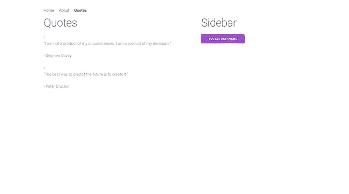
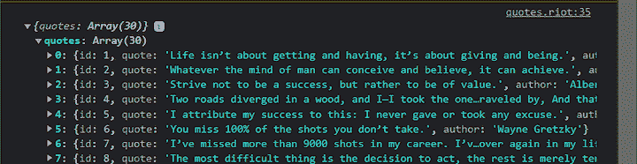
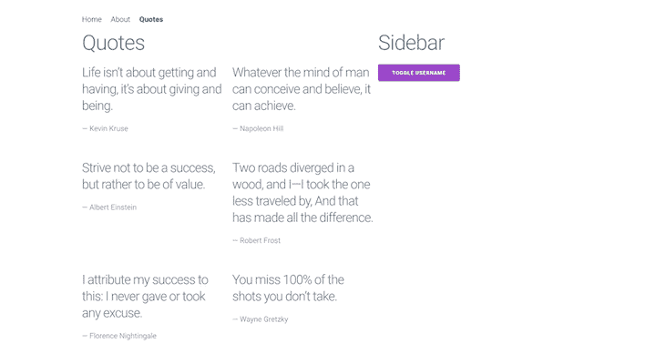
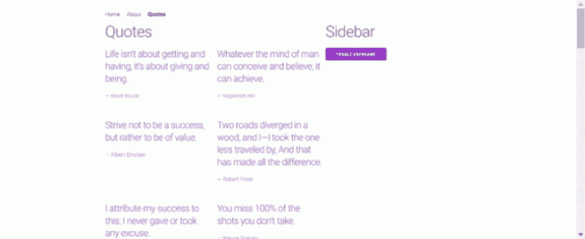

# 使用 Riot.js，一个基于组件的 UI 库

> 原文：<https://blog.logrocket.com/using-riot-js-component-based-ui-library/>

现在有很多 JavaScript 框架，其中一些比另一些更适合开发的某些方面。选择哪种框架实际上取决于项目的具体需求。

[暴动](https://riot.js.org) [。js](https://riot.js.org) 的设计是轻量级的，易于学习，对于熟悉 HTML 和 JavaScript 的开发人员来说，这是一个很好的选择——不需要他们学习使用特定框架编码的严格要求。Riot.js 强调简单性、性能和模块化，其生态系统允许轻松集成第三方库和组件，使其适用于小型和大型项目。

在本教程中，我们将深入研究 Riot.js，将其与本机 [Web 组件 API、](https://developer.mozilla.org/en-US/docs/Web/Web_Components)进行比较，并演示如何使用 Riot.js 构建一个简单的 SPA。

*向前跳转:*

## 先决条件

要理解本文的教程部分，您应该具备:

*   安装在本地计算机上的 Node.js v14 或更高版本
*   HTML、CSS、JavaScript 和 DOM 的基础知识

## Riot.js 是什么？

Riot.js 是一个轻量级的、基于组件的 UI 库，用于开发 web 应用程序。Riot.js 类似于其他流行的 JavaScript 库和框架，如 React、Angular 和 Vue.js，这使它更容易学习。尽管 Riot.js 使用与这些框架相同的基于组件的方法，但它的目标是更小、更易于使用，专注于简单性和灵活性。

Riot.js 使用自定义标签，结合 HTML 和 JavaScript 形成可重用组件。使用 Riot.js，开发人员可以轻松地使用 API 特性操作 DOM，并将数据绑定到模板。

Riot.js 的一些关键特性包括:

*   **声明性组件语法**:允许开发者将 UI 元素定义为独立的、可重用的模块
*   **强大的模板系统**:允许开发者使用类似 HTML 的模板语言定义组件的结构和内容
*   **内置虚拟 DOM** :允许 Riot.js 高效地更新 UI 以响应数据变化
*   **支持定制标签和属性**:使开发者能够扩展 Riot.js 的功能并创建定制 UI 元素
*   灵活和可扩展的 API :允许开发者定制和扩展 Riot.js 的功能，以满足他们特定项目的需求
*   **强大的社区支持**:riot . js 开源库由开发者社区积极维护和支持
*   **兼容现代浏览器**:可与其他库和框架一起使用，构建交互式网络应用

## 为什么要用 Riot.js？

对于想要一个简单、轻量、灵活的库来开发用户界面的开发人员来说，Riot.js 是一个极好的选择。它特别适合于关注性能和优化的应用程序，以及开发人员希望灵活地选择和利用他们选择的工具或库的应用程序。

以下是您应该考虑使用 Riot.js 的一些具体原因:

*   **简单的学习曲线**:利用组件风格的方法，代码基数小，易于使用；开发人员可以不受限制地自由集成他们自己的工具或库
*   定制元素:开发人员可以很容易地使用标签来创建定制组件，这些组件可以在应用程序的任何地方重用
*   **可嵌入 HTML** :使 Riot.js 能够轻松集成到现有项目中
*   轻量级和快速的:这个 JavaScript 框架适合于那些不需要在浏览器中投入太多工作就能提高性能和速度的项目

## Riot.js 与 Web 组件 API

Riot 在基本层面上非常类似于 web 组件 API，这是一组标准化的 API，允许开发人员为 Web 创建可重用的模块化组件。

Web 组件 API 由三种主要技术组成:

*   **定制元素**:JavaScript API 集合，支持定制元素的定义及其在用户界面中的行为
*   **Shadow DOM** :一组 JavaScript APIs，用于将封装的“影子”DOM 树附加到与主文档 DOM 分开呈现的元素上，并对其进行控制。这允许你保持一个元素的特性私有，所以它们可以被脚本化和样式化，而不用担心与其他文档部分冲突
*   **HTML 模板** : `<template>`和`<slot>`元素使您能够创建不会出现在呈现页面上的标记模板；它们也可以作为定制元素结构的基础被重用

Riot.js 和 Web Components 都致力于简化可重用和模块化 Web 组件的开发，但它们使用的方法有很大不同。Web Components 使用标准化的 API 来构造独特的元素并将它们附加到 DOM，而 Riot.js 使用模板语法和有限的一组指令来定义组件。

## Riot.js SPA 演示

为了更好地理解 Riot.js 是如何工作的，让我们构建一个简单的 SPA，它由一页引文组成。我们将从建立项目开始。

### 设置项目

要在本地计算机上创建 Riot.js 项目，请在本地计算机上导航到您选择的目录，打开 CLI 窗口，然后输入以下命令:

```
npm install -g riot webpack webpack-cli webpack-dev-server

```

安装完成后，使用提供的模板创建一个 Riot 实例:

```
npm init riot

```

对于本教程，我们将使用 SPA 模板(`webpack-spa`):



选择模板后，将在目录中创建一个 Riot.js 项目文件夹，其中包含创建 Riot.js 应用程序所需的所有依赖项。

在您选择的代码编辑器中打开新创建的项目。在这个 Riot.js 项目文件夹中，您应该会看到一个类似如下的树结构:

```
     ┣ 📂src
     ┃ ┣ 📂components
     ┃ ┃ ┣ 📂global
     ┃ ┃ ┃ ┣ 📂my-component
     ┃ ┃ ┃ ┃ ┣ 📜my-component.riot
     ┃ ┃ ┃ ┃ ┗ 📜my-component.spec.js
     ┃ ┃ ┃ ┗ 📂sidebar
     ┃ ┃ ┃ ┃ ┣ 📜sidebar.riot
     ┃ ┃ ┃ ┃ ┗ 📜sidebar.spec.js
     ┃ ┃ ┗ 📂includes
     ┃ ┃ ┃ ┣ 📂loader
     ┃ ┃ ┃ ┃ ┗ 📜loader.riot
     ┃ ┃ ┃ ┗ 📂user
     ┃ ┃ ┃ ┃ ┣ 📜user.riot
     ┃ ┃ ┃ ┃ ┗ 📜user.spec.js
     ┃ ┣ 📂pages
     ┃ ┃ ┣ 📜about.riot
     ┃ ┃ ┣ 📜home.riot
     ┃ ┃ ┗ 📜not-found.riot
     ┃ ┣ 📜app.riot
     ┃ ┣ 📜index.html
     ┃ ┣ 📜index.js
     ┃ ┣ 📜pages.js
     ┃ ┗ 📜register-global-components.js
     ┣ 📜.gitignore
     ┣ 📜LICENSE
     ┣ 📜package-lock.json
     ┣ 📜package.json
     ┣ 📜readme.md
     ┗ 📜webpack.config.js

```

这里，我们的应用程序的根是`index.html`，主要组件将被安装在`app.riot`组件中。在`pages`目录中指定了三条路线，组成这些页面的组件在`components`文件夹中。

要运行应用程序，请在 CLI 中输入`npm start`命令。这将启动应用程序，并在浏览器中产生以下结果:


### 创建报价页面

要开始构建我们的报价应用程序，我们需要创建一个新的报价页面来获取报价并显示它们。

首先创建一个新文件，`./src/pages/quotes.riot`:

```
    <quotes>
        <section>
            <header>
                <h1>Quotes</h1>
            </header>
            <ul class="quotes-list">
                <li class="list-item">
                    <p class=" quote"> "I am not a product of my circumstances. I am a product of my decisions." </p>
                    <p class="author">- Stephen Covey</p>
                </li>
                <li class="list-item">
                    <p class=" quote"> "The best way to predict the future is to create it." </p>
                    <p class="author">- Peter Drucker</p>
                </li>
            </ul>
        </section>
    </quotes>

```

这里，我们对报价进行硬编码，以便快速为这个新页面设置路由配置。

### 添加报价页面组件

为了将报价页面组件添加到`app.riot`，首先我们需要将报价页面注册为我们的`./src/app.riot`文件中的一个组件:

```
    <app>
      <div class="container">
        <!-- ... -->
      </div>
      <script>
        // ...
        export default {
          components: {
            // ...

            // register quotes page
            Quotes: lazy(Loader, () => import (
              /* webpackPrefetch: true, webpackChunkName: 'pages/quotes' */
              './pages/quotes.riot'
            ))
          },

          // ...
        }
      </script>
    </app>

```

接下来，我们使用`./src/pages.js`文件将`/quotes`路径分配给页面组件，如下所示:

```
    export default [{
      path: '/',
      label: 'Home',
      componentName: 'home'
    }, {
      path: '/about',
      label: 'About',
      componentName: 'about'
    }, {
      path: '/quotes',
      label: 'Quotes',
      componentName: 'quotes'
    }]

```

现在，如果我们在浏览器上导航到`[http://localhost:3000/quotes](http://localhost:3000/quotes)`，我们应该会看到类似这样的内容:



厉害！

### 获取报价数据

接下来，我们将使用 [DummyJSON](https://dummyjson.com/) 公开可用的 API，`[https://dummyjson.com/quotes](https://dummyjson.com/quotes)`获取报价数据。

首先，我们将在组件中创建一个具有`quotes`属性的`state`对象。然后我们将创建一个`async`函数`getQuotes()`，它将使用本机[获取 API](https://developer.mozilla.org/en-US/docs/Web/API/Fetch_API) 来获取报价。

我们将从`onBeforeMount()`生命周期钩子中调用`getQuotes()`函数，在组件挂载之前获取报价。下面是我们如何在`./src/pages/quotes.riot`中实现这一目标:

```
    <quotes>
      <section>
        <!-- ... -->
      </section>
      <script>
        export default {
          state: {
            quotes: [],
          },
          async getQuotes() {
            try {
              const res = await fetch(`https://dummyjson.com/quotes`);
              const data = await res.json();
              this.update({ quotes: data.quotes });
              console.log({ quotes: this.state.quotes });
            } catch (error) {
              console.log({ error });
            }
          },
          async onBeforeMount({ isServer }) {
            await this.getQuotes();
          },
        };
      </script>
    </quotes>

```

如果我们保存我们的更改并检查我们的控制台，我们应该看到我们的报价:



### 创建报价组件

现在，我们需要创建一个组件来显示报价数组中的每个报价。

要创建报价组件，请创建一个新文件，`./src/components/quote/quote.riot`:

```
    <quote>
      <article class="quote">
        <h3>{props.quote}</h3>
        <p>&mdash; {props.author}</p>
      </article>
    </quote>

```

我们在这里显示了一些非常简单的标记，`quote`和`author`。我们还使用`props`对象来访问使用属性传递给组件的值。

要在我们的报价页面上使用这个组件，我们首先需要注册它。现在，我们将在本地的报价页面组件中注册它。为此，将以下内容添加到`./src/pages/quotes.riot`文件中:

```
    <quotes>
      <section>
        <header>
          <h1>Quotes</h1>
        </header>
        <ul class="quotes-list">
          <li each={quote in the state.quotes} key={quote.id} class="list-item">
            <quote quote={quote.quote} author={quote.author} />
          </li>
        </ul>
      </section>
      <script>
        import Quote from "../components/quote/quote.riot";
        export default {
          components: {
            Quote,
          },
          state: {
            quotes: [],
          },
          // ...
        };
      </script>
      <style>
        .quotes-list {
            display: grid;
            grid-gap: 2rem;
            grid-template-columns: repeat(auto-fit, minmax(300px, 1fr));
        }
        .list-item {
            display: flex;
        }
      </style>
    </quotes>

```

这里，我们使用`each`指令遍历`quotes`数组，并将`quote`和`author`作为道具传递给`Quote`组件。

此时，我们的 SPA 应该看起来像这样:



### 设置动态路由

现在，让我们看看如何在 Riot.js 中设置动态路由，以便在单击时在新页面上打开一个报价。我们将通过几个步骤来实现这一点。首先，让我们在`./src/pages/quotes.riot`文件中设置链接`href`:

```
    <quotes>
      <section>
        <!-- ... -->
        <ul class="quotes-list">
          <li each={quote in state.quotes} key={quote.id} class="list-item">
            <a href={`quotes/${quote.id}`}>
              <quote quote={quote.quote} author={quote.author} />
            </a>
          </li>
        </ul>
      </section>
      <!-- ... -->
    </quotes>

```

如果`quote.id`是`1`，点击报价应该会将我们带到`/quotes/1`。

### 创建报价页面路线

接下来，让我们创建报价页面组件，并将其注册到 Riot.js 应用程序文件中。

首先创建一个新文件，`./src/pages/quote-page.riot`:

```
    <quote-page>
      <article class="quote">
        <h1>{state.quote.quote}</h1>
        <p>&mdash; {state.quote.author}</p>
      </article>
      <script>
        export default {
          state: {
            quote: {},
          },
          async getQuote() {
            try {
              const id = this.props.id;
              const res = await fetch(`https://dummyjson.com/quotes/${id || 1}`);
              const quote = await res.json();
              this.update({ quote });
            } catch (error) {
              console.log({ error });
            }
          },
          onBeforeMount() {
            this.getQuote();
          },
        };
      </script>
    </quote-page>

```

这里，我们再次使用`props`来获取 post `id`。然后，我们将通过`getQuote()`函数中的`id`来获取`quote`，然后在`onBeforeMount`生命周期要点中调用它。

### 注册报价页面组件

现在，让我们在`./src/app.riot`中注册我们最新的页面组件:

```
    <app>
      <!-- ... -->
      <script>
        import { Router, Route, route, toRegexp, match } from '@riotjs/route'
        import lazy from '@riotjs/lazy'
        import Loader from './components/includes/loader/loader.riot'
        import NotFound from './pages/not-found.riot'
        import pages from './pages'
        export default {
          components: {
            Router,
            Route,
            NotFound,
            Home: lazy(Loader, () => import(
              /* webpackPrefetch: true, webpackChunkName: 'pages/home' */
              './pages/home.riot'
            )),
            About: lazy(Loader, () => import(
              /* webpackPrefetch: true, webpackChunkName: 'pages/about' */
              './pages/about.riot'
            )),
            Quotes: lazy(Loader, () => import(
              /* webpackPrefetch: true, webpackChunkName: 'pages/quotes' */
              './pages/quotes.riot'
            )),
            QuotePage: lazy(Loader, () => import (
              /* webpackPrefetch: true, webpackChunkName: 'pages/quote-page' */
              './pages/quote-page.riot'
            ))
          },
        }
      </script>
    </app>

```

接下来，我们将添加一个带有`/quotes/:id`路由路径的路由组件。

现在，让我们回到我们的`./src/app.riot`组件。在模板中，输入以下内容:

```
    <app>
      <div class="container">
        <router>
          <!-- ... -->
          <div if={!state.showNotFound} class="row">
            <div class="column column-60">
              <route each={page in state.pages} path={page.path}>
                <main is={page.componentName}/>
              </route>
              <!-- add new route for quotes -->
              <route path="/quotes/:id">
                <main is="quote-page" id={route.params.id} />
              </route>
            </div>
            <!-- notice how <sidebar> is registered as global component -->
            <div class="column column-40">
              <sidebar/>
            </div>
          </div>
        </router>
      </div>
    </app>

```

这里，我们为`/quotes/:id`添加了一条新路线，其中`:id`是将在`id`之前匹配报价的`route`的参数。

在`<route>`组件中，我们设置了一个动态组件。我们通过将`"quote-page"`组件名传递给`is`指令，将其分配给`Quote`页面组件:



就是这样！我们已经使用 Riot.js 轻松高效地构建了一个用户界面。

## 结论

在本文中，我们演示了如何使用 Riot.js 创建一个简单的 SPA。我们讲述了使用 Riot.js npm 包设置一个简单的 Riot.js 应用程序的基础知识，包括简单的路由以及本地和全局组件设置。

我们展示了如何创建用于数据获取的函数，以及如何在安装组件之前使用生命周期函数来运行它们。我们还演示了如何使用 Riot.js 路由参数设置动态路由。

## 您是否添加了新的 JS 库来提高性能或构建新特性？如果他们反其道而行之呢？

毫无疑问，前端变得越来越复杂。当您向应用程序添加新的 JavaScript 库和其他依赖项时，您将需要更多的可见性，以确保您的用户不会遇到未知的问题。

LogRocket 是一个前端应用程序监控解决方案，可以让您回放 JavaScript 错误，就像它们发生在您自己的浏览器中一样，这样您就可以更有效地对错误做出反应。

[](https://lp.logrocket.com/blg/javascript-signup)[https://logrocket.com/signup/](https://lp.logrocket.com/blg/javascript-signup)

[LogRocket](https://lp.logrocket.com/blg/javascript-signup) 可以与任何应用程序完美配合，不管是什么框架，并且有插件可以记录来自 Redux、Vuex 和@ngrx/store 的额外上下文。您可以汇总并报告问题发生时应用程序的状态，而不是猜测问题发生的原因。LogRocket 还可以监控应用的性能，报告客户端 CPU 负载、客户端内存使用等指标。

自信地构建— [开始免费监控](https://lp.logrocket.com/blg/javascript-signup)。