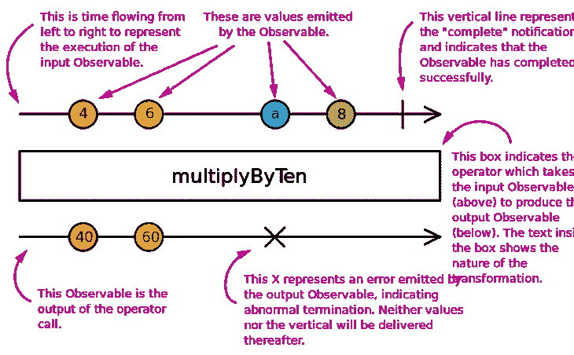
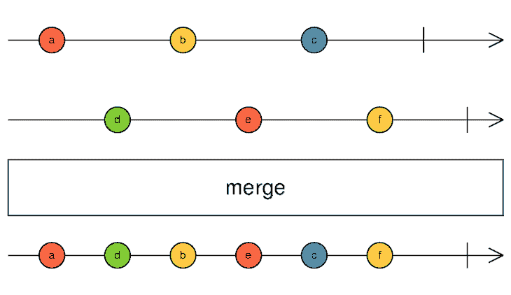
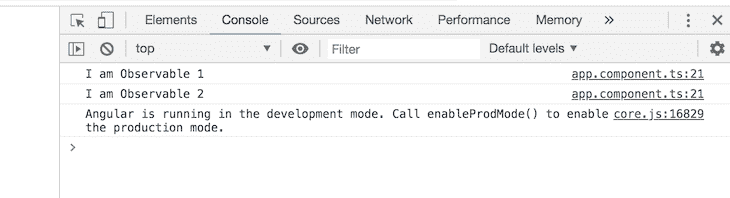
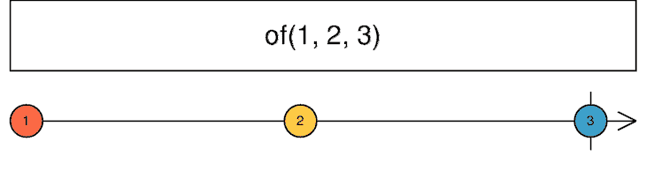
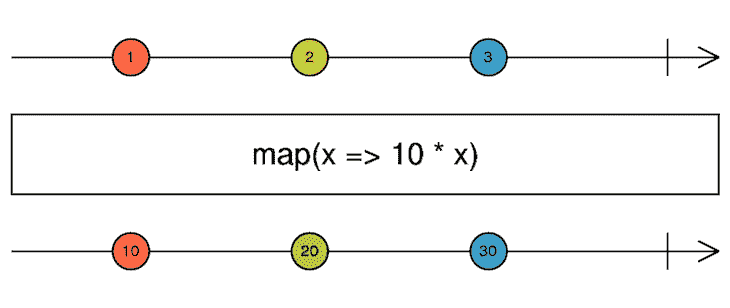
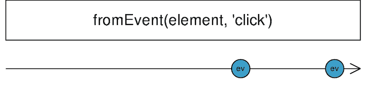
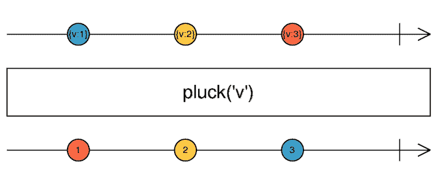
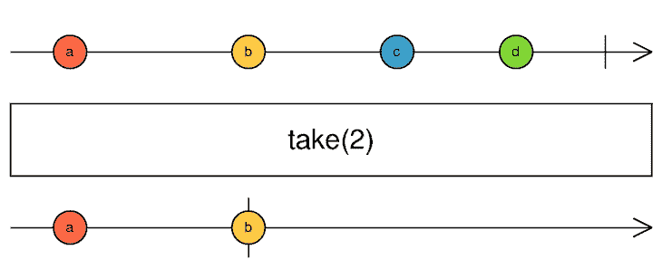

# 使用 RxJS 运算符消耗可观测量

> 原文：<https://blog.logrocket.com/using-rxjs-operators-consume-observables/>

***编者按**:本帖最后更新于 2021 年 8 月 12 日。它可能仍然包含过时的信息。*

RxJS 是一个使用可观察对象的反应式编程框架，使得编写异步代码变得非常容易。

根据官方文档，RxJS 是 JavaScript 的反应式扩展，具有更好的性能、更好的模块化和更好的可调试调用堆栈，同时保持大部分向后兼容，有一些减少 API 面的突破性变化。

它是 Angular 用来处理反应的官方库，将回调的拉操作转换成可观察的操作。

## 先决条件

要完成本文的演示，您应该具备以下条件:

首先，运行以下命令:

```
// run the command in a terminal
ng version

```

确认您使用的是最新版本，如果不是，请更新。

接下来，[在这里下载本教程的起始项目](https://github.com/philipszdavido/angular-ivy-zymjyv)来完成演示。

然后，解压缩项目，并使用以下命令初始化终端中的节点模块:

```
npm install

```

## 什么是 RxJS 运算符？

[可观测量是 RxJS](https://blog.logrocket.com/understanding-rxjs-observables/) 中反应式编程的基础，运算符是消费或利用它们的最佳方式。运算符是一种方法，您可以用它来以特定的方式操纵、过滤或改变可观察对象和主题，使之成为新的可观察对象。

它们为复杂的逻辑在可观测量上运行提供了一个平台，并让开发人员完全控制可观测量的输出。然而，值得注意的是，操作者并不改变初始的可观测值，他们只是编辑它并输出一个全新的可观测值。

### RxJS 中有哪些不同的运算符？

根据官方 [RxJS](https://blog.logrocket.com/tag/rxjs/) 文档，有两种类型的操作符:可管道操作符和创建操作符。

可管道化运算符是可以使用管道语法管道化到现有可观察对象的运算符:

```
observableInstance.pipe(operator())

```

它们在现有的可观察对象上被调用，它们不改变可观察对象的实例，而是基于初始可观察对象用 subscribe 方法返回一个新的可观察对象。

另一方面，创建操作符通过预定义的行为或通过将多个可观察对象连接在一起来创建可观察对象。它们可以被称为创造新的可观测量的独立方法。

### 运算符如何处理大理石图

大理石图直观地展示了运算符的工作方式。它总是一个从左到右和从上到下的过程。

首先创建可观察对象，并发出一些值，然后在完成时，由完整参数定义的操作符将发出的值作为输入，然后修改它们以给出一个全新的可观察对象。



### RxJS 操作员类别

RxJS 中有超过 [100 个操作符，可以分为各种类别，包括创建、转换、过滤、加入、多播、错误处理和实用程序。](https://rxjs-dev.firebaseapp.com/api)

### 流行的 RxJS 运算符

如果您从一开始就关注了这篇文章，那么您将会在 Visual Studio 代码中打开一个入门项目来跟进这些插图。在本节中，您将学习如何在角度工作流中使用一些流行的 RxJS 操作符[:](https://blog.logrocket.com/angular-vs-react-vs-vue-a-performance-comparison/)

#### `merge()`操作员

`merge()`操作符是一个连接创建操作符，它将一个可观察对象与另一个可观察对象合并，将它们的组合作为一个可观察对象返回。



为此，打开`app.component.ts`文件并复制以下代码块:

```
import { Component, OnInit } from '@angular/core';
import { Observable, merge} from 'rxjs';

@Component({
  selector: 'my-app',
  templateUrl: './app.component.html',
  styleUrls: ['./app.component.css']
})
export class AppComponent implements OnInit {
  ngOnInit() {
    const observable1 = Observable.create((observer: any) => {
      observer.next('I am Observable 1');
    });
    const observable2 = Observable.create((observer: any) => {
      observer.next('I am Observable 2');
    });
    const observable3 = merge(observable1, observable2);
    observable3.subscribe(data => console.log(data));
  }
}

```

您的浏览器控制台应该如下所示:



#### `of()`操作员

这是一个创建操作符，它可以从任何类型的数据中创建观察值，可以是字符串、数组、对象，甚至是一个承诺。



用下面的代码块进行测试:

```
import { Component, OnInit } from '@angular/core';
import { of } from 'rxjs';

@Component({
  selector: 'my-app',
  templateUrl: './app.component.html',
  styleUrls: ['./app.component.css']
})
export class AppComponent implements OnInit {
  ngOnInit() {
    const observable1 = of(1, 2, 3).subscribe(data => console.log(data));
  }
}

```

#### `map()`操作员

这个`map()`操作符是在一个管道中定义的，在这个管道中，您可以修改一个可观察值的内容，以形成另一个新的可观察值。



在您的`app.component.ts`文件中，复制下面的代码块:

```
import { Component, OnInit } from '@angular/core';
import { of } from 'rxjs';
import { map } from 'rxjs/operators';

@Component({
  selector: 'my-app',
  templateUrl: './app.component.html',
  styleUrls: ['./app.component.css']
})
export class AppComponent implements OnInit {
  ngOnInit() {
    const observable1 = of('my name is lotanna');
    observable1
      .pipe(map(data => data.toUpperCase()))
      .subscribe(data => console.log(data));
  }
}

```

在管道内部，您可以添加您的修改逻辑；在这种情况下，它将发出的值转换为大写。

#### `fromEvent()`操作员

`fromEvent()`操作符接受任何 DOM 元素和事件名作为道具，并用它创建一个新的可观察对象。



一个简单的文档点击操作符如下所示:

```
import { Component, OnInit } from '@angular/core';
import { fromEvent} from 'rxjs';

@Component({
  selector: 'my-app',
  templateUrl: './app.component.html',
  styleUrls: ['./app.component.css']
})
export class AppComponent implements OnInit {
  ngOnInit() {
    const observable1 = fromEvent(document, 'click').subscribe(() =>
      console.log('You clicked the page!')
    );
  }
}

```

#### `pluck()`操作员

顾名思义，`pluck()`操作符从具有多个属性的数组中选取一个属性。



这里有一个简单的例子:

```
import { Component, OnInit } from '@angular/core';
import { from } from 'rxjs';
import { pluck } from 'rxjs/operators';

@Component({
  selector: 'my-app',
  templateUrl: './app.component.html',
  styleUrls: ['./app.component.css']
})
export class AppComponent implements OnInit {
  ngOnInit() {
    from([
      { brand: 'iPhone', model: 'Xmax', price: '$1000' },
      { brand: 'Samsung', model: 'S10', price: '$850' }
    ])
      .pipe(pluck('price'))
      .subscribe(data => console.log(data));
  }
}

```

#### `take()`操作员

`take()`操作符以可观察的方式记录发射事件的发生。



例如，我们已经为页面点击设计了一个`fromEvent()`操作符。使用`take()`操作符，新的可观察对象只能记录第一次点击:

```
import { Component, OnInit } from '@angular/core';
import { fromEvent } from 'rxjs';
import { take } from 'rxjs/operators';

@Component({
  selector: 'app-root',
  templateUrl: './app.component.html',
  styleUrls: ['./app.component.css']
})
export class AppComponent implements OnInit {
  ngOnInit() {
    const observable1 = fromEvent(document, 'click')
      .pipe(take(2))
      .subscribe(() => console.log('You clicked the page!'));
  }
}

```

如预期的那样，这只记录了页面上的前两次点击。

## 结论

本文介绍 RxJS 操作符作为反应式编程的主要特征。可观物是基础，运营商是帮助我们合理消费可观物的方法。我们还看了运算符的类别以及如何使用一些非常流行的运算符。黑客快乐！

## 使用 [LogRocket](https://lp.logrocket.com/blg/signup) 消除传统错误报告的干扰

[](https://lp.logrocket.com/blg/signup)

[LogRocket](https://lp.logrocket.com/blg/signup) 是一个数字体验分析解决方案，它可以保护您免受数百个假阳性错误警报的影响，只针对几个真正重要的项目。LogRocket 会告诉您应用程序中实际影响用户的最具影响力的 bug 和 UX 问题。

然后，使用具有深层技术遥测的会话重放来确切地查看用户看到了什么以及是什么导致了问题，就像你在他们身后看一样。

LogRocket 自动聚合客户端错误、JS 异常、前端性能指标和用户交互。然后 LogRocket 使用机器学习来告诉你哪些问题正在影响大多数用户，并提供你需要修复它的上下文。

关注重要的 bug—[今天就试试 LogRocket】。](https://lp.logrocket.com/blg/signup-issue-free)