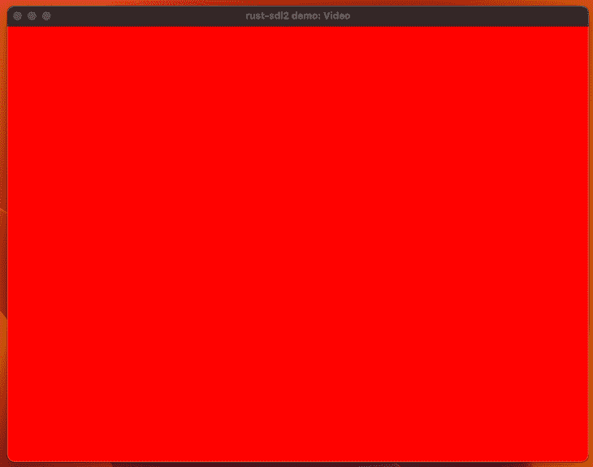
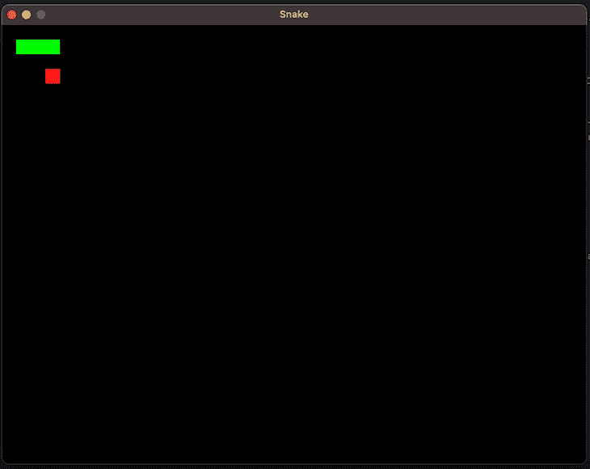
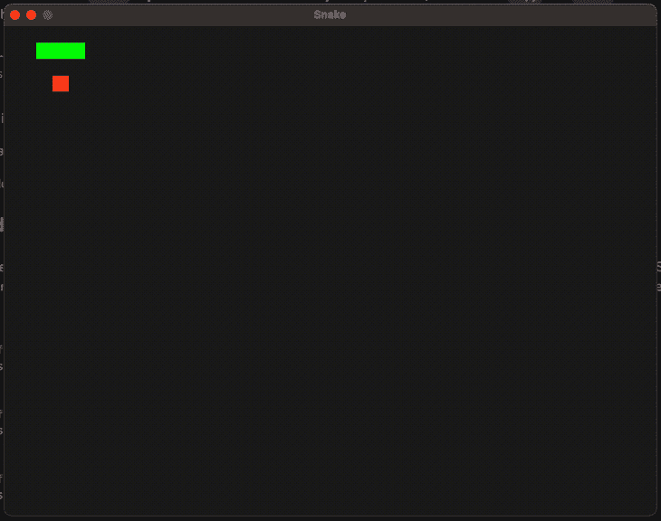

# 在 Rust 中使用 SDL2 绑定进行游戏开发

> 原文：<https://blog.logrocket.com/using-sdl2-bindings-rust/>

SDL 代表简单直接媒体层，这是一个开源库，为用户输入、音频和图形提供 API。它还支持最流行的桌面和移动操作系统— [甚至带有 WebAssembly 的 web 浏览器](http://kth.diva-portal.org/smash/get/diva2:1664916/FULLTEXT01.pdf)—这使得编写跨平台代码变得更加容易。

这些特点使 SDL 成为从头编写游戏的合理和受欢迎的选择，正如你从这个由 SDL 制作的广泛的[游戏列表中所看到的。在这篇博文中，我们将创建一个简单的 Rust 游戏，](https://itch.io/games/made-with-sdl)[使用了](https://github.com/Rust-SDL2/rust-sdl2) `[rust-sdl2](https://github.com/Rust-SDL2/rust-sdl2)` [机箱](https://github.com/Rust-SDL2/rust-sdl2)。

向前跳:

注意，本教程假设已经用 Rustup 设置了 [Rust。](https://blog.logrocket.com/getting-up-to-speed-with-rust/)

## 设置我们的 Rust 和 SDL2 项目

请记住,`rust-sdl2`只是为新的 SDL2.0 库提供了 Rust 绑定。库本身是用 C 写的，我们必须安装原生开发文件来编译任何使用它的程序。

要为 Mac OS 设置，请使用下面的命令:

```
brew install sdl2

```

要通过 Ubuntu 设置 Linux，请使用以下命令:

```
sudo apt install libsdl2-dev

```

其他系统的[设置说明见文档。](https://github.com/Rust-SDL2/rust-sdl2#sdl20-development-libraries)

在熟悉这个库的过程中，`[rust-sdl2](https://github.com/Rust-SDL2/rust-sdl2/tree/master/examples)` [提供了许多例子](https://github.com/Rust-SDL2/rust-sdl2/tree/master/examples)，您可以通过克隆这个库来运行它们。注意，其中一些需要额外的开发库，所以请参考每个例子的官方`README`以获取更多信息。

下一步是创建我们的项目。我们将实现一个非常简单的贪吃蛇游戏:

```
cargo new snake-game

```

接下来，在`Cargo.toml`中的依赖项下添加`sdl2`:

```
[dependencies]
sdl2 = "0.35"

```

[运行](https://blog.logrocket.com/demystifying-cargo-in-rust/) `[cargo build](https://blog.logrocket.com/demystifying-cargo-in-rust/)`下载并编译用于 SDL2 的 Rust 绑定。如果这成功发生，我们都准备好了！

## 理解一个简单的 SDL 程序

在我们创建我们的贪吃蛇游戏之前，让我们看看来自`rust-sdl2`库的[最简单的演示](https://github.com/Rust-SDL2/rust-sdl2/blob/master/examples/demo.rs)，以确保我们理解每个组件:

```
extern crate sdl2;

use sdl2::event::Event;
use sdl2::keyboard::Keycode;
use sdl2::pixels::Color;
use std::time::Duration;

pub fn main() -> Result<(), String> {
    let sdl_context = sdl2::init()?;
    let video_subsystem = sdl_context.video()?;

    let window = video_subsystem
        .window("rust-sdl2 demo: Video", 800, 600)
        .position_centered()
        .opengl()
        .build()
        .map_err(|e| e.to_string())?;

    let mut canvas = window.into_canvas().build().map_err(|e| e.to_string())?;

    canvas.set_draw_color(Color::RGB(255, 0, 0));
    canvas.clear();
    canvas.present();
    let mut event_pump = sdl_context.event_pump()?;

    'running: loop {
        for event in event_pump.poll_iter() {
            match event {
                Event::Quit { .. }
                | Event::KeyDown {
                    keycode: Some(Keycode::Escape),
                    ..
                } => break 'running,
                _ => {}
            }
        }

        canvas.clear();
        canvas.present();
        ::std::thread::sleep(Duration::new(0, 1_000_000_000u32 / 30));
        // The rest of the game loop goes here...
    }

    Ok(())
}

```

这将是我们的脚手架，所以我们可以将它粘贴到我们生成的`src/main.rs`和`cargo run`项目中。结果应该是一个什么都不做的红色窗口，当你点击`esc`时退出:



让我们看看我们的样板代码，了解发生了什么。

### 使用`sdl_context`、`video_subsystem`和`window`

我们要看的第一篇文章复制如下:

```
    let sdl_context = sdl2::init()?;
    let video_subsystem = sdl_context.video()?;

    let window = video_subsystem
        .window("rust-sdl2 demo: Video", 800, 600)
        .position_centered()
        .opengl()
        .build()
        .map_err(|e| e.to_string())?;

```

在 Rust 中使用 SDL2 时，我们必须创建以下中间对象来呈现上面显示的红色窗口:

```
Sdl -> VideoSubsystem -> Window -> WindowCanvas

```

对象管理程序中可能发生的一切。在这种情况下，我们用它来访问视频资源和键盘输入。它还可以用于利用其他操作系统资源，如音频、剪贴板和其他用户输入。

`video_subsystem: VideoSubsystem`集合了所有与视频相关的东西，比如查询显示信息、生成新窗口、管理剪贴板和带有适当虚拟键盘支持的文本输入。

我们用`video_subsystem.window`调用的`WindowBuilder`可以用来生成带有许多参数的主窗口，比如大小和位置。还可以添加对[游戏渲染引擎](https://blog.logrocket.com/5-rust-game-engines-consider-next-project/)的支持，比如 OpenGL 和 Vulkan。

如果您想了解以上所有内容的更多信息，请查看[官方 SDL2 Rust 文档](https://docs.rs/sdl2)。

注意，`VideoSubsystem`和`Window`都保留了对原始`Sdl`上下文对象的引用。如果我们愿意，我们可以通过从它们中的任何一个调用`.sdl()`来获得原始对象。

### 创建画布

让我们创建一个`canvas: WindowCanvas`来渲染我们的游戏:

```
    let mut canvas = window.into_canvas().build().map_err(|e| e.to_string())?;

    canvas.set_draw_color(Color::RGB(255, 0, 0));
    canvas.clear();
    canvas.present();

```

在上面的演示中，我们从`canvas`调用的三个方法足以画出一个红屏:

*   `set_draw_color`定义所有后续操作的当前颜色，直到用另一种颜色再次调用
*   `clear`将当前纯色应用于整个画布
*   `present`渲染下一帧

有许多方法可以用来处理单个像素或纹理。在这个例子中，我们将使用`canvas.draw_rect`来构建我们需要的所有对象。根据具体情况，也可以调用其他方法，如`draw_point`和`draw_line`。

### 编写主循环

我们必须编写我们的游戏在大部分时间里都会存在的代码。这将是主循环:

```
    'running: loop {
        for event in event_pump.poll_iter() {
            match event {
                Event::Quit { .. }
                | Event::KeyDown {
                    keycode: Some(Keycode::Escape),
                    ..
                } => break 'running,
                _ => {}
            }
        }

        canvas.clear();
        canvas.present();
        ::std::thread::sleep(Duration::new(0, 1_000_000_000u32 / 30));
        // The rest of the game loop goes here...
    }

```

在我们的实现中，我们将使用主循环依次做四件事:

1.  读取用户的输入
2.  改变游戏状态
3.  渲染当前游戏状态
4.  睡眠到下一帧

请注意，在这种情况下，顺序实际上并不太重要。比如把游戏循环放在渲染之后也是可以的。

### 读取用户输入

SDL2 为 Rust 提供了一个`event_pump`,我们可以这样得到:

```
let mut event_pump = sdl_context.event_pump()?;

```

然后我们可以在主循环中使用它:

```
for event in event_pump.poll_iter() {
    match event {
        Event::Quit { .. }
        | Event::KeyDown {
            keycode: Some(Keycode::Escape),
            ..
        } => break 'running,
        _ => {}
    }
}

```

在上面的例子中，我们使用`.poll_iter()`和[模式匹配每一个](https://blog.logrocket.com/rust-enums-and-pattern-matching/)来获取事件流。本例仅匹配`esc`按键或`Event::Quit`事件，如`alt+f4`或`cmd+w`退出主循环，标记为`'running`。

由于您在主线程中，许多事件可能在一个循环和另一个循环之间发生，`.poll_iter()`让您获取所有事件，并在每个循环中读取许多事件。

### 管理和呈现游戏状态

游戏状态完全由我们决定！由于 SDL2 是完全与游戏状态无关的，我们甚至想将其从我们的`canvas`中分离出来。

目前，我们的例子所做的就是使用画布用红色和`.clear()`填充屏幕，同时每次使用`.present()`渲染它。我们稍后会改变这一点。

### 一直睡到下一帧

最后，我们是这样等到下一个循环的:

```
::std::thread::sleep(Duration::new(0, 1_000_000_000u32 / 30));

```

`Duration`的第二个参数是纳秒数。在这种情况下，这意味着我们为每一帧等待三十分之一秒，这最终意味着我们每秒最多处理 30 帧。

让我们在设置贪吃蛇游戏时改变这一点。

## 编写我们的游戏逻辑

最简单的第一步是弄清楚我们应该如何构建我们的游戏状态。即使对于一个非常简单的贪吃蛇游戏，我们也有大量的数据要跟踪。以下是主要考虑事项:

*   当前游戏状态，如暂停、正在玩或结束
*   玩家的位置，包括头部和它的部分
*   玩家的头部方向
*   当前的食物位置

我们可以创建自己的结构来对所有这些数据进行分组。在这里，我将称之为`GameContext`:

```
pub enum GameState { Playing, Paused }
pub enum PlayerDirection { Up, Down, Right, Left }
pub struct Point(pub i32, pub i32);

pub struct GameContext {
    pub player_position: Vec<Point>,
    pub player_direction: PlayerDirection,
    pub food: Point,
    pub state: GameState,
}

```

我们还创建了额外的结构，假设我们要实现一个传统的贪吃蛇游戏，它总是一个二维网格。我们创建的`Point`结构将被用来表示我们想要管理和显示给用户的实体。

注意`player_position`占用了一个`Vec<Point>`来保存蛇的头部和分段的位置。我们可以假设头部位于第一个位置，然后是段，直到它达到最大尺寸。

`player_direction`跟踪头部移动到哪里，这是玩家在玩游戏时需要交互的所有内容。

而`food`只是格子上的一个点，玩家吃了之后会随机变化。

最后，我们有`state`，它让我们管理游戏是否正在运行。我们还需要思考我们的初始状态。这是我们要放入构造函数的内容:

```
impl GameContext {
    pub fn new() -> GameContext {
        GameContext {
            player_position: vec![Point(3, 1), Point(2, 1), Point(1, 1)],
            player_direction: PlayerDirection::Right,
            state: GameState::Paused,
            food: Point(3, 3),
        }
    }
}

```

由于这是该代码的第一个版本，我们默认假设了很多。简而言之，这个快速草图显示了我们首先想要渲染的内容:


考虑到我们坚持这个游戏的传统风格，我们还需要为我们的网格设置一个固定的大小。为了简单起见，我们可以在一个 800×600 像素的窗口上给我们的游戏一个 40×30 的网格大小，使每个网格点成为一个完美的 20 像素正方形。

让我们在`src`文件的开头添加这些常量:

```
const GRID_X_SIZE: i32 = 40;
const GRID_Y_SIZE: i32 = 30;
const DOT_SIZE_IN_PXS: i32 = 20;

```

回到我们的`main`函数，我们可以使用这些常量来初始化固定大小的窗口:

```
let window = video_subsystem
    .window(
        "Snake Game",
        GRID_X_SIZE * DOT_SIZE_IN_PXS,
        GRID_Y_SIZE * DOT_SIZE_IN_PXS
    )
    .position_centered()
    .opengl()
    .build()
    .map_err(|e| e.to_string())?;

```

之后，我们可以在循环之前初始化我们的游戏。

```
let mut context = GameContext::new();

```

稍后我们将致力于赋予我们的游戏一些生命，但是让我们首先渲染它，看看它看起来像什么。

## 渲染我们的游戏状态

让我们创建一个名为`Renderer`的结构来抽象游戏的渲染。它的主要目的是将游戏状态转换成对我们的`canvas`的调用:

```
pub struct Renderer { canvas: WindowCanvas }

```

下面是它的构造函数现在的样子:

```
impl Renderer {
    pub fn new(window: Window ) -> Result<Renderer, String> {
        let canvas = window.into_canvas().build().map_err(|e| e.to_string())?;
        Ok(Renderer { canvas })
    }
}

```

我们也在主循环之前初始化它。它必须是可变的，因为它引用了我们在渲染游戏时将要变异的画布:

```
let mut renderer = Renderer::new(window)?;

```

让我们继续实现我们的`Renderer`的最基本的操作。因为我们处理的是大像素网格，所以我们将实现填充其中一个像素的方法:

```
// impl Renderer { ...

fn draw_dot(&mut self, point: &Point) -> Result<(), String> {
    let Point(x, y) = point;
    self.canvas.fill_rect(Rect::new(
        x * DOT_SIZE_IN_PXS as i32,
        y * DOT_SIZE_IN_PXS as i32,
        DOT_SIZE_IN_PXS,
        DOT_SIZE_IN_PXS,
    ))?;

    Ok(())
}

```

我们稍微作弊一下，看看是否真的有效。在这种情况下，我们将只手动绘制初始游戏状态:

```
// impl Renderer { ...

pub fn draw(&mut self) -> Result<(), String> {
    self.canvas.set_draw_color(Color::BLACK);
    self.canvas.clear();

    self.canvas.set_draw_color(Color::GREEN);
    self.draw_dot(&Point(3, 1))?;
    self.draw_dot(&Point(2, 1))?;
    self.draw_dot(&Point(1, 1))?;

    self.canvas.set_draw_color(Color::RED);
    self.draw_dot(&Point(3, 3))?;

    self.canvas.present();

    Ok(())
}

```

在主循环中，让我们去掉旧的`canvas`调用，改用我们的渲染器:

```
renderer.draw()?;

```

如果做得正确，一个新的`cargo run`应该向我们展示与之前图中相同的初始游戏状态:



现在让我们用我们之前创建的游戏`context`来做正确的事情:

```
renderer.draw(&context)?;
// impl Renderer { ...

pub fn draw(&mut self, context: &GameContext) -> Result<(), String> {
    self.draw_background(context);
    self.draw_player(context)?;
    self.draw_food(context)?;
    self.canvas.present();

    Ok(())
}

fn draw_background(&mut self, context: &GameContext) {
    let color = match context.state {
        GameState::Playing => Color::RGB(0, 0, 0),
        GameState::Paused => Color::RGB(30, 30, 30),
    };
    self.canvas.set_draw_color(color);
    self.canvas.clear();
}

fn draw_player(&mut self, context: &GameContext) -> Result<(), String> {
    self.canvas.set_draw_color(Color::GREEN);
    for point in &context.player_position {
        self.draw_dot(point)?;
    }

    Ok(())
}

fn draw_food(&mut self, context: &GameContext) -> Result<(), String> {
    self.canvas.set_draw_color(Color::RED);
    self.draw_dot(&context.food)?;
    Ok(())
}

```

现在，如果我们再次`cargo run`，我们应该会看到与之前硬编码运行几乎相同的结果，除了现在背景是深灰色，因为游戏暂停了。

我们的游戏在视觉上完成了！下一步是给它一些生命。

## 在滴答中思考

目前，我们的程序所做的就是以每秒 30 帧的速度绘制相同的初始游戏状态。为了让它“活着”并且可以玩，我们需要在主循环中更新它的状态。

在贪吃蛇游戏中，下一个状态基本上是将玩家的头移到下一个位置。根据下一个插槽是什么，将出现以下情况之一:

*   如果是自由空间:
    *   蛇头取代了它的位置
    *   所有的蛇段转移到下一个位置
*   如果是食物:
    *   蛇头占据了它的位置
    *   蛇增长了 1 节
    *   另一个食物块在地图上随机产生
*   如果是墙壁或蛇自己的身体部分:

每次游戏状态更新通常被称为一次滴答。许多游戏以 1:1 的比率与 FPS 绑定 ticks，尤其是旧游戏。

我们可以在每一帧更新我们的游戏状态，但这意味着我们的蛇将在一秒钟内移动 30 个位置，这使得游戏非常难玩。相反，让我们让游戏每 10 帧滴答一次，让我们的蛇每秒移动三个槽。

我们必须跟踪主循环中的帧，如下所示:

```
let mut frame_counter = 0;
'running: loop {
    // ...input events... (omitted)

    ::std::thread::sleep(Duration::new(0, 1_000_000_000u32 / 30));

    frame_counter += 1;
    if frame_counter % 10 == 0 {
        context.next_tick(); // We will implement this yet.
        frame_counter = 0;
    }

    renderer.draw()?;
}

```

根据游戏的不同，很难想象在每一次滴答之间需要更新什么才能让游戏以合理的速度前进。幸运的是，贪吃蛇游戏相当简单，可以逐步实现。

让我们从玩家的动作开始:

```
// impl GameContext { ...

pub fn next_tick(&mut self) {
    let head_position = self.player_position.first().unwrap();
    let next_head_position = match self.player_direction {
        PlayerDirection::Up => *head_position + Point(0, -1),
        PlayerDirection::Down => *head_position + Point(0, 1),
        PlayerDirection::Right => *head_position + Point(1, 0),
        PlayerDirection::Left => *head_position + Point(-1, 0),
    };

    self.player_position.pop();
    self.player_position.reverse();
    self.player_position.push(next_head_position);
    self.player_position.reverse();
}

```

上面的逻辑决定了蛇的下一个头部位置，用`.pop()`删除最远的段，并将`next_head_position`添加到 vec 的头部。这应该给我们的印象是所有的部分都在一起移动。

然而，上面的代码无法编译，因为我们的程序还不知道如何添加点:

```
cannot add `Point` to `Point`

```

这是一种易于实现的方法:

```
impl Add<Point> for Point {
    type Output = Point;

    fn add(self, rhs: Point) -> Self::Output {
        Point(self.0 + rhs.0, self.1 + rhs.1)
    }
}

```

此外，为了让`Point`对象与我们刚刚实现的方法一起工作，我们需要`Copy`和`Clone`特征。幸运的是，它们可以通过[添加](https://doc.rust-lang.org/rust-by-example/trait/derive.html) `[derive](https://doc.rust-lang.org/rust-by-example/trait/derive.html)` [属性](https://doc.rust-lang.org/rust-by-example/trait/derive.html)为我们的结构生成:

```
#[derive(Copy, Clone)]
pub struct Point(pub i32, pub i32);

```

最后，如果我们再次尝试`cargo` `run`，我们应该会看到我们的滴答发生:

这看起来棒极了！现在下一步是实际读取和使用用户输入。

## 读取用户输入来控制贪吃蛇游戏

首先，我们可能希望实现用户可以在`impl GameContext`中与之交互的方法。

贪吃蛇游戏的控制非常简单——我们只需改变蛇的运动方向，此外，我们还可以暂停和取消暂停游戏。

我们已经跟踪了`player_direction`和`state`字段。现在，我们只需要能够改变它们:

```
pub fn move_up(&mut self) {
    self.player_direction = PlayerDirection::Up;
}

pub fn move_down(&mut self) {
    self.player_direction = PlayerDirection::Down;
}

pub fn move_right(&mut self) {
    self.player_direction = PlayerDirection::Right;
}

pub fn move_left(&mut self) {
    self.player_direction = PlayerDirection::Left;
}

pub fn toggle_pause(&mut self) {
    self.state = match self.state {
        GameState::Playing => GameState::Paused,
        GameState::Paused => GameState::Playing
    }
}

```

这是非常基本的，但应该是一个良好的开端。现在让我们回到模式匹配事件的部分:

```
match event {
    Event::Quit { .. }
    | Event::KeyDown {
        keycode: Some(Keycode::Escape),
        ..
    } => break 'running,
    _ => {}
}

```

让我们修改代码来调用我们刚刚实现的方法。在我们的例子中，我们将使用`WASD`和`Escape`键来处理移动和暂停或取消暂停游戏:

```
match event {
    Event::Quit { .. } => break 'running,
    Event::KeyDown { keycode: Some(keycode), .. } => {
        match keycode {
            Keycode::W => context.move_up(),
            Keycode::A => context.move_left(),
            Keycode::S => context.move_down(),
            Keycode::D => context.move_right(),
            Keycode::Escape => context.toggle_pause(),
            _ => {}
        }
    }
    _ => {}
}

```

既然我们能够暂停和取消暂停游戏，让我们改变`next_tick`方法，在游戏暂停时不做任何事情:

```
pub fn next_tick(&mut self) {
    if let GameState::Paused = self.state {
        return;
    }
    // ...

```

就是这个！我们可以再次尝试，看看它是否有效。因为我们的游戏开始暂停了，我们可以按下“Escape ”,看看我们是否能控制这条蛇。当我们这样做的时候，背景应该从暗淡变成漆黑一片。

## 结论

这就包含了在 Rust 中使用 SDL2 的基础知识。我希望这篇教程能帮助你熟悉这个库，这样你就可以将这些概念应用到你自己的游戏开发中。

如果您有兴趣进一步练习使用这个简单的贪吃蛇游戏，下面是可能的后续步骤:

*   管理与墙、食物和其他蛇段的碰撞
*   能够消耗食物并成长
*   添加一个能够重新启动的`GameState::Over`状态

如果你有任何问题，请在下面评论。

## [log rocket](https://lp.logrocket.com/blg/rust-signup):Rust 应用的 web 前端的全面可见性

调试 Rust 应用程序可能很困难，尤其是当用户遇到难以重现的问题时。如果您对监控和跟踪 Rust 应用程序的性能、自动显示错误、跟踪缓慢的网络请求和加载时间感兴趣，

[try LogRocket](https://lp.logrocket.com/blg/rust-signup)

.

[](https://lp.logrocket.com/blg/rust-signup)

LogRocket 就像是网络和移动应用程序的 DVR，记录你的 Rust 应用程序上发生的一切。您可以汇总并报告问题发生时应用程序的状态，而不是猜测问题发生的原因。LogRocket 还可以监控应用的性能，报告客户端 CPU 负载、客户端内存使用等指标。

现代化调试 Rust 应用的方式— [开始免费监控](https://lp.logrocket.com/blg/rust-signup)。