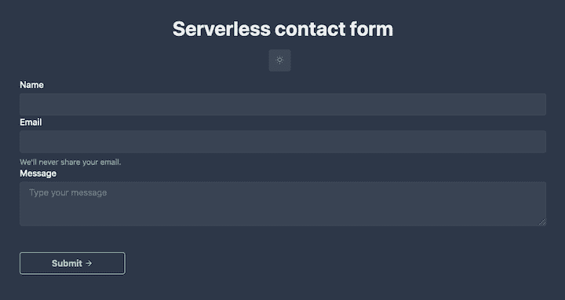
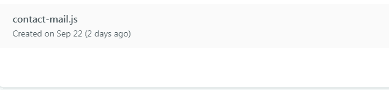

# 通过 Nuxt.js - LogRocket Blog 使用无服务器函数

> 原文：<https://blog.logrocket.com/using-serverless-functions-with-nuxt-js/>

前端开发人员构建 web 应用程序的方式一直在不断变化。如今，您不需要了解如何管理服务器来构建和发布应用程序。这就是无服务器的意义所在。

假设你正在你的投资组合网站上建立一个联系表单。通常，当你的访问者对你的服务感兴趣时，你会希望他们给你发一封电子邮件。您可能想要编写一个 API 来连接到您首选的邮件服务提供商，然后启动一个服务器来运行您的 API。

这种做法有什么问题吗？不会。但是，服务器是全天候工作的，它总是为请求做好准备。对于组合网站联系人表单，这种方法成本低，而且浪费服务器资源。像这样的用例是无服务器真正派上用场的地方。

## 无服务器是什么意思？

无服务器并不意味着没有服务器；这只是意味着您使用第三方服务，如 AWS，来管理和设置服务器，因此您只需提供自治功能。这些通常被称为无服务器功能。这样，您的无服务器“服务器”只在有请求时才旋转，并且只对在此期间使用的资源收费。

## Nuxt.js 中的无服务器函数

为了展示无服务器函数是如何工作的，我们将使用 Nuxt.js 和 Netlify 函数构建一个联系人表单。完整应用的演示可在[此处](https://contact-serverless.netlify.app)获得。

要跟随本教程，您需要以下内容。

*   使用 Vue.js 和 Nuxt.js 的经验
*   净收益账户
*   一个 [Mailgun](https://www.mailgun.com/) 账户

### 设置一个 Nuxt.js 项目

让我们从创建一个新的 Nuxt.js 应用程序开始。为了设计应用程序，我们将使用 [Chakra UI](https://vue.chakra-ui.com/) ，这是一个简单的模块化和可访问的组件库，它提供了快速构建 Vue.js 应用程序的构建块。

```
yarn create nuxt-app serverless-contact-form

```

当提示输入 UI 框架时，选择 Chakra UI。对于 Nuxt.js 模块，选择 Axios。

完成后，启动应用程序。

```
cd serverless-contact-form
yarn dev

```

对于本教程的其余部分，我们将假设应用程序正在运行。

为了简单明了，我们将联系表单直接放在主页上。因此，让我们更新`pages`目录中的`index.vue`文件。

首先更新`template`部分，如下所示。

```
// pages/index.vue

<template>
  <div class="container">
    <CBox
      v-bind="mainStyles[colorMode]"
      d="flex"
      w="100vw"
      h="100vh"
      flex-dir="column"
      justify-content="center"
    >
      <CHeading text-align="center" mb="4">
        Serverless contact form
      </CHeading>

      <CFlex justify="center" direction="column" align="center">
        <CBox mb="3">
          <CIconButton
            mr="3"
            :icon="colorMode === 'light' ? 'moon' : 'sun'"
            :aria-label="`Switch to ${
              colorMode === 'light' ? 'dark' : 'light'
            } mode`"
            @click="toggleColorMode"
          />
        </CBox>

        <CBox text-align="left" width="50%">
          <form @submit.prevent="sendContactToLambdaFunction">
            <CFormControl>
              <CFormLabel for="name">
                Name
              </CFormLabel>
              <CInput id="name" v-model="form.name" type="text" aria-describedby="name" />
            </CFormControl>

            <CFormControl>
              <CFormLabel for="email">
                Email
              </CFormLabel>
              <CInput id="email" v-model="form.email" type="email" aria-describedby="email-helper-text" />
              <CFormHelperText id="email-helper-text">
                We'll never share your email.
              </CFormHelperText>
            </CFormControl>

            <CFormControl>
              <CFormLabel for="message">
                Message
              </CFormLabel>
              <CTextarea v-model="form.message" placeholder="Type your message" />
            </CFormControl>

            <CBox mt="12" d="flex" flex-dir="column" align="center">
              <CButton type="submit" right-icon="arrow-forward" width="20%" variant-color="vue" variant="outline">
                Submit
              </CButton>
            </CBox>
          </form>
        </CBox>
      </CFlex>
    </CBox>
  </div>
</template>

```

联系表单包含三个字段:`name`、`email`和`message`。一旦提交了表单，就会调用一个处理发送消息的`sendContactToLambdaFunction()`。

让我们也更新一下`script`部分。

```
// pages/index.vue

<script lang="js">
  import {
    CBox,
    CButton,
    CIconButton,
    CFlex,
    CHeading,
    CTextarea,
    CFormControl,
    CFormLabel,
    CInput,
    CFormHelperText
  } from '@chakra-ui/vue'

export default {
  name: 'App',
  inject: ['$chakraColorMode', '$toggleColorMode'],
  components: {
    CBox,
    CButton,
    CIconButton,
    CFlex,
    CHeading,
    CTextarea,
    CFormControl,
    CFormLabel,
    CInput,
    CFormHelperText
  },
  data () {
    return {
      mainStyles: {
        dark: {
          bg: 'gray.700',
          color: 'whiteAlpha.900'
        },
        light: {
          bg: 'white',
          color: 'gray.900'
        }
      },
      form: {
        name: '',
        email: '',
        message: ''
      }
    }
  },
  computed: {
    colorMode () {
      return this.$chakraColorMode()
    },
    theme () {
      return this.$chakraTheme()
    },
    toggleColorMode () {
      return this.$toggleColorMode
    }
  },
  methods: {
    async sendContactToLambdaFunction () {
      try {
        const response = await this.$axios.$post('/.netlify/functions/contact-mail', {
          name: this.form.name,
          email: this.form.email,
          message: this.form.message
        })

        this.$toast({
          title: 'Mail sent',
          description: response,
          status: 'success',
          duration: 10000,
          isClosable: true
        })

        this.form.name = ''
        this.form.email = ''
        this.form.message = ''
      } catch (error) {
        this.$toast({
          title: 'An error occured',
          description: error,
          status: 'error',
          duration: 10000,
          isClosable: true
        })
      }
    }
  }
}
</script>

```

当被触发时，`async sendContactToLambdaFunction()`向我们的 Netlify 函数发出一个 API 请求(我们将在下一节讨论)。

如果我们打开浏览器，我们应该会看到类似这样的内容:



在这个阶段，我们已经准备好了 UI 和逻辑，但是还没有任何 API 端点。在最后一部分，我们将调用还不存在的`/.netlify/functions/contact-mail`。

在此之前，让我们花点时间了解一下什么是网络函数。

## 什么是网络功能？

最流行的无服务器架构——或功能即服务(FaaS)——提供商是 [AWS Lambda](https://blog.logrocket.com/testing-node-serverless-applications-aws-lambda-functions/) 。但 AWS 不适合小规模应用。Netlify 允许您在没有 AWS 帐户的情况下部署无服务器 Lambda 函数，并且管理直接在 Netlify 中处理。

Netlify 还提供了一种在本地使用 [Netlify Dev](https://www.netlify.com/products/dev/) 测试无服务器功能的方法。让我们确保我们已经安装了它。

```
// NPM
npm install netlify-cli -g

// Yarn
yarn add global netlify-cli

```

现在让我们在项目的根目录下创建一个`netlify.toml`文件。这个配置文件告诉 Netlify 如何构建和部署项目。

我们的本地开发环境也需要它。

```
// netlify.toml

[dev]
   command = "yarn dev"
[build]
  command = "yarn generate"
  publish = "dist"
  functions = 'functions'  # directs netlify to where your functions directory is located

[[headers]]
  # Define which paths this specific [[headers]] block will cover.
  for = "/*"
    [headers.values]
    Access-Control-Allow-Origin = "*"

```

通过运行以下命令创建 Netlify 函数。

* * *

### 更多来自 LogRocket 的精彩文章:

* * *

```
netlify functions:create contact-mail

```

然后，选择显示 async/await 用法和响应格式化选项的`[hello-world]`基本函数。这个命令将在项目的根目录下创建一个`functions`目录和一个`contact-mail.js`文件。

要在本地测试该函数，请运行:

```
netlify dev

```

这将启动开发服务器。

然后:

```
netlify functions:invoke contact-mail --no-identity

```

您应该得到这样的结果:

```
{"message":"Hello World"}

```

## 设置 Mailgun

为了处理电子邮件的发送，我们将使用 [Mailgun](https://www.mailgun.com/) ，它为测试提供了一个沙箱域。

抓住你的沙盒域以及你的 API 密钥从你的帐户仪表板。在**发送>域名下，**你应该看到一个沙盒域名。选择 API 并复制 API 密钥、API 基本 URL 和沙盒域。

接下来，安装必要的依赖项:

```
yarn add dotenv mailgun-js

```

我们将使用`dotenv`来访问我们的本地环境变量。当部署我们的应用程序时，它将配置 Netlify 在生产中使用适当的细节。`mailgun-js`是用于与 Mailgun API 交互的 Node.js 模块。

在根目录下创建一个`.env`文件，并插入正确的值:

```
// .env

MG_API_KEY=YOUR_API_KEY
MG_DOMAIN=YOUR_SANDBOX_DOMAIN
MG_HOST=YOUR_API_BASE_URL
TO_EMAIL_ADDRESS=ADDRESS_EMAIL_WILL_BE_SENT_TO

```

现在，让我们转到实际的函数逻辑。将下面的代码片段粘贴到`contact-mail.js`中。

```
// functions/contact-mail.js

require('dotenv').config()

const { MG_API_KEY, MG_DOMAIN, MG_HOST, TO_EMAIL_ADDRESS } = process.env
const mailgun = require('mailgun-js')({ apiKey: MG_API_KEY, domain: MG_DOMAIN, url: MG_HOST})

exports.handler = async (event) => {
  if (event.httpMethod !== 'POST') {
    return {
      statusCode: 405,
      body: 'Method Not Allowed',
      headers: { 'Allow': 'POST' }
    }
  }

  const data = JSON.parse(event.body)

  if (!data.message || !data.name || !data.email) {
    return { statusCode: 422, body: 'Name, email, and message are required.' }
  }

  const mailgunData = {
    from: data.email,
    to: TO_EMAIL_ADDRESS,
    'h:Reply-To': data.email,
    subject: `New mail from ${data.name}`,
    html: `
    <h4> Email from ${data.name} ${data.email} </h4>
    <p> ${data.message}</p>
    `
  }

  try {
    await mailgun.messages().send(mailgunData)

    return {
      statusCode: 200,
      body: 'Your message was sent successfully!'
    }
  } catch (error) {
      return {
        statusCode: 422,
        body: `Error: ${error}`
      }
  }
}

```

让我们来看看这个函数的活动部分。首先，`require('dotenv').config()`让我们能够通过`process.env`访问环境变量。接下来，我们用所需的参数实例化 Mailgun 模块。

然后，我们对传入的请求执行一些验证。首先，传入的请求必须是一个`POST`请求。如果任何字段为空，服务器应该返回状态代码`422`(不可处理的实体)。

接下来，我们构建电子邮件正文。Mailgun 接受`to`、`from`、`subject`、HTML 和文本部分、附件等。

最后，我们将对象传递给`mailgun.messages.send()`，并从 Mailgun 返回错误或成功消息。

现在我们可以运行:

```
netlify dev

```

这将启动函数和 Nuxt.js 应用程序的开发服务器。你不用担心前端和 API 端点如何协同工作；Netlify 会为您处理这些细节。

您会注意到该函数运行在端口`8888`上，而 Nuxt.js 应用运行在端口`3000`上。Netlify Dev 将合并它们，并在浏览器的端口`8888`上运行。

## 测试

是时候检验我们所建造的东西了。您可以使用 Postman 或任何其他 HTTP 客户端，但是我们将使用 Netlify Dev，因为它使我们能够执行`POST`请求。

运行以下命令。

```
netlify functions:invoke contact-mail --no-identity --payload '{"email": "[email protected]", "name": "Chioma", "message": "hello this function works fine!"}'

```

您应该会在终端和邮箱中得到类似下面这样的响应。

```
Your message was sent successfully! We'll be in touch.

```

当然，你也可以直接在浏览器里用 app 测试出来。

## 部署到网络

最后，让我们部署我们的静态应用程序。运行下面的命令来生成`dist`目录。

```
yarn generate

```

下一步是在 Netlify 上创建一个全新的网站。

```
netlify init

```

在 Netlify 上进入你的站点仪表板，点击**功能**选项卡，你应该会看到你的`contact-mail.js`功能。



在我们结束之前，让我们添加 Netlify 上的环境变量。进入**设置>构建&部署>环境**，在你的`.env`中添加环境变量。

最后，重新部署应用程序以使更改生效。

## 结论

在本教程中，我们通过使用 Nuxt.js 构建一个静态应用程序并使用 Netlify 函数设置 API 端点来探索无服务器。我们讨论了这种方法相对于使用传统服务器的优势。最后，我们介绍了如何使用 Netlify Dev 简单快速地构建和部署无服务器应用程序。

要了解更多信息，请查看官方的[网络功能文档](https://docs.netlify.com/functions/overview/)。

这个项目的源代码可以在 [GitHub](https://github.com/ammezie/serverless-contact-form) 上找到。