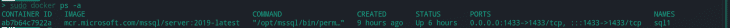
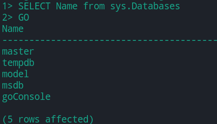
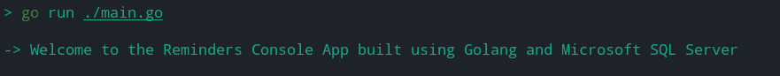
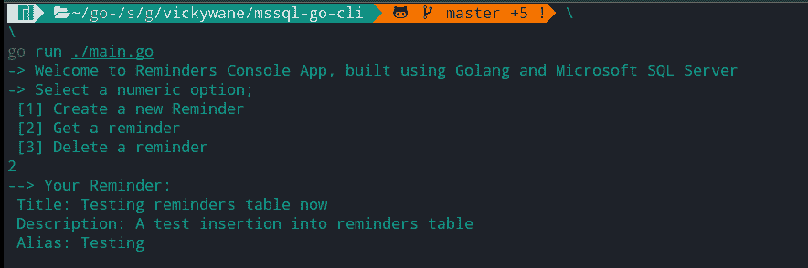
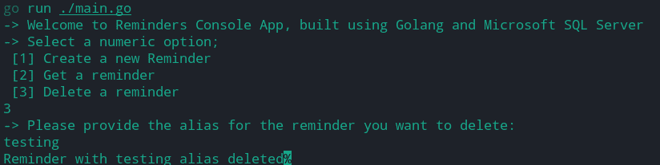

# 在 Golang - LogRocket 博客中使用 SQL 数据库

> 原文：<https://blog.logrocket.com/using-sql-database-golang/>

十二因素应用程序方法中的进程原则断言应用程序作为无状态进程执行。这意味着需要持久化的数据应该存储在外部后台服务中，比如数据库。

当将这一原则应用于 Golang 编写的应用程序时，您可能需要使用 SQL 数据库来持久化数据。

在本教程中，我们将学习如何使用 SQL 数据库构建一个用 Golang 编写的基于控制台的提醒应用程序。

我们将关注 Microsoft SQL Server，并将 Golang 应用程序连接到 SQL Server 中的数据库，以存储用户的提醒。我们选择 Microsoft SQL Server 而不是 MySQL，不是因为一个比另一个好，而是因为一个的教程比另一个少。除此之外，MSSQL 语法比 MySQL 简单。

以下是我们将要介绍的内容:

## Golang 和 SQL 先决条件

要继续构建控制台应用程序，建议您具备以下条件:

*   对 Go 编程语言的基本理解
*   Golang 安装在您的本地计算机上
*   Docker 安装在您的本地计算机上

## 使用 Microsoft SQL Server

Microsoft SQL Server 是一个包含多个组件的关系数据库管理系统(RDBMS)。其中一个组件是数据库引擎，它管理存储在 SQL Server 中的数据。

在本教程中，我们将使用 SQL Server 的数据库引擎组件。为了建立到数据库引擎的连接，我们需要 Golang 标准库中的数据库包和 [`go-mssqldb`包](https://github.com/denisenkom/go-mssqldb)。

首先，让我们将 SQL Server 实例作为 Docker 映像安装在本地计算机上。

### 安装 Microsoft SQL Server

我们现在可以从计算机终端通过 Docker 镜像安装微软 SQL[S](https://blog.logrocket.com/docker-sql-server/)[server 实例。](https://blog.logrocket.com/docker-sql-server/)

从您的终端执行下面的 Docker `pull`命令，从 DockerHub 中提取 2019 Microsoft SQL server 实例的容器映像:

```
docker pull mcr.microsoft.com/mssql/server:2019-latest

```

接下来，执行下面的 Docker run 命令，使用 Docker 运行提取的容器映像。下面的命令包含作为[环境变量](https://docs.docker.com/compose/environment-variables/)传递到容器映像的参数，以配置容器。

确保将命令中的`INSTANCE_PASSWORD`占位符更改为更安全的密码，并记住该密码，因为我们稍后会用到它:

```
sudo docker run -e "ACCEPT_EULA=Y" -e "SA_PASSWORD=INSTANCE_PASSWORD" \
   -p 1433:1433 --name sql1 -h sql1 \
   -d mcr.microsoft.com/mssql/server:2019-latest

```

您可以进一步执行`docker ps`命令来查看在后台运行的 MSSQL 容器。



## 创建 SQL Server 数据库

在上一节中，我们提取了 Microsoft SQL Server 映像来运行 SQL Server 实例。现在，让我们在 SQL Server 实例中为 Golang 应用程序创建一个数据库。

要创建数据库，您可以使用数据库 GUI 工具，如[SQL Server Management Studio(SSMS)](https://docs.microsoft.com/en-us/sql/ssms/download-sql-server-management-studio-ssms?view=sql-server-ver15)，或者通过 [s](https://docs.microsoft.com/en-us/sql/tools/sqlcmd-utility?view=sql-server-ver15) [qlcmd CLI 实用程序](https://docs.microsoft.com/en-us/sql/tools/sqlcmd-utility?view=sql-server-ver15)。

我们将继续连接到运行 SQL server 实例的 Docker 映像，从终端创建一个数据库。

首先，执行下面的 Docker `exec`命令，在运行 SQL Server 实例的 Docker 容器中启动一个 Bash shell。这一步使我们能够访问容器中的 sqlcmd 工具:

```
sudo docker exec -it sql1 "bash"

```

接下来，通过在上面开始的交互式 Bash shell 中执行下面的命令来连接 sqlcmd。

同样，请注意，您必须使用运行 Docker 映像时使用的密码来更改下面的`INSTANCE_PASSWORD`占位符:

```
/opt/mssql-tools/bin/sqlcmd -S localhost -U SA -P "INSTANCE_PASSWORD"

```

要开始创建数据库，输入下面的 SQL 查询来创建一个名为`goConsole`的数据库:

```
CREATE DATABASE goConsole

```

接下来，运行下面的[批处理分隔符命令](https://docs.microsoft.com/en-us/sql/t-sql/language-elements/sql-server-utilities-statements-go?redirectedfrom=MSDN&view=sql-server-ver15)来执行您在上面输入的 SQL 查询:

```
GO 

```

为了进一步确认数据库已创建，我们可以键入下面的`SELECT`语句，按名称检索所有可用的数据库:

```
SELECT Name from sys.Databases

```

然后，运行下面的命令来执行上面的`SELECT`语句:

```
GO

```

在新的 SQL Server 实例中创建的五个数据库将打印出来:



### 创建`Reminders`表

要为我们的提醒应用程序在`goConsole`数据库中创建一个`Reminders`表，键入下面的两个 SQL 查询，首先使用 [USE 语句](https://docs.microsoft.com/en-us/sql/t-sql/language-elements/use-transact-sql?view=sql-server-ver15)将当前数据库从`master`设置为`goConsole`:

```
USE goConsole

```

接下来，键入下面的`CREATE TABLE statement`，在`goConsole`数据库中创建一个名为`Reminders`的表:

```
CREATE TABLE Reminders ( ID int IDENTITY(1, 1), title varchar(75), description varchar(175), alias varchar(70)) 

```

当上面的 SQL 查询执行时，将创建一个`Reminders`表，该表将包含`ID`、`title`、`description`和`alias`列。

使用带有`ID`列的`IDENTITY`函数可以确保每当一条新记录插入到`Reminders`表中时，`ID`列的值就会自动增加`1`。

继续运行下面的 Go 命令，执行我们在上面键入的两个 SQL 查询:

```
GO  

```

现在数据库已经创建好了，让我们继续本教程的 Golang 部分。

## 构建 Golang 控制台应用程序

在本节中，我们将构建一个简化的控制台应用程序，以使用我们刚刚创建的`goConsole`数据库。然而，在我们继续之前，理解 Golangs 的 sql 包和方法是很重要的。

[Golang 的 sql 包](https://pkg.go.dev/database/sql@go1.17.2)来自 Golang 的标准库，它提供了一个围绕 SQL 数据库的接口。要使用 sql 数据库，我们必须使用带有 SQL 数据库驱动程序的 SQL 包。

当我们在 sql 包中使用`go-mssqldb`数据库驱动程序时，我们将看到这是如何实现的。

Golang 方法类似于函数，但是，一个方法有一个附加的接收者参数。

在本教程中，我们将创建一个 struct 类型来包含一个存储指向 sql 包中的数据库处理程序的指针的字段，并创建具有 struct 类型的接收器的方法。

还要注意的是，我们将只实现没有预警的提醒数据的`CREATE`、`RETRIEVE`、`DELETE`操作。

### 创建 Go 应用程序

要开始创建 Go 应用程序，执行下面的两个命令来创建一个新的目录来存储 Go 项目，并移动到`mssql-go-cli`目录中:

```
# create a new directory
mkdir mssql-go-cli

# move into new directory
cd mssql-go-cli

```

接下来，执行下面的 Go 命令，用一个`go.mod`文件引导一个 Go 项目，以管理这个项目中的依赖项:

```
go mod init mssql-go-cli

```

执行下面的`go get`命令来安装`go-mssqldb`包，以便从这个 Go 应用程序连接您的 Microsoft SQL 数据库:

```
go get github.com/denisenkom/go-mssqldb github.com/joho/godotenv/cmd/godotenv

```

最后，创建一个`main.go`文件，并将下面代码块的内容添加到文件中。main 函数中的代码充当应用程序的样板，而我们将在下一节中实现真正的逻辑:

```
// main.go
package main
import "fmt"

func main() {
  fmt.Println("-> Welcome to the Reminders Console App built using Golang and Microsoft SQL Server")  
}

```

当应用程序通过`go run main.go`命令运行时，一个字符串打印到控制台，如下所示:



此时，我们让 Go 应用程序在没有连接到 SQL Server 的情况下工作。因此，接下来让我们创建一个自定义数据库包，其中包含用于建立到 SQL Server 实例的连接的代码。

## 构建数据库包

Go 包是一个目录中包含 Go 代码的文件集合。因此，要为这个应用程序创建数据库包，我们必须在`mssql-go-cli`项目目录中创建一个新目录。

为此，创建一个名为`database`的目录，并在名为`database.go`的新目录中创建一个文件。

接下来，将下面代码块的内容添加到`database.go`文件中，创建一个带有导出的`SqlDb`字段的导出的`Database`结构。字段的数据类型指向`DB`结构:

```
// ./database/database.go
package database

import (
   "context"
   "database/sql"
)

type Database struct {
   SqlDb *sql.DB
}

var dbContext = context.Background()

```

然后，在下一步中，从数据库包中导出的结构在 main 函数中初始化。

### 建筑主体功能

让我们继续重构`main.go`文件，提示用户进行操作并接受来自控制台的输入。

将下面代码块的内容添加到`main.go`文件中:

```
// ./main.go
package main

import (
   "bufio"
   "database/sql"
   "fmt"
   _ "github.com/denisenkom/go-mssqldb"
   "github.com/joho/godotenv"
   "mssql-go-cli/database"
   "os"
)

func main() {
    envErr := godotenv.Load(); if envErr != nil {
       fmt.Printf("Error loading credentials: %v", envErr)
    }

var (
   password = os.Getenv("MSSQL_DB_PASSWORD")
   user = os.Getenv("MSSQL_DB_USER")
   port = os.Getenv("MSSQL_DB_PORT")
   database = os.Getenv("MSSQL_DB_DATABASE")
)

connectionString := fmt.Sprintf("user id=%s;password=%s;port=%s;database=%s", user, password, port, database)

   sqlObj, connectionError := sql.Open("mssql", database.ConnectionString); if connectionError != nil {
      fmt.Println(fmt.Errorf("error opening database: %v", connectionError))
   }

   data := database.Database{
      SqlDb: sqlObj,
   }

   fmt.Println("-> Welcome to Reminders Console App, built using Golang and Microsoft SQL Server")
   fmt.Println("-> Select a numeric option; \n [1] Create a new Reminder \n [2] Get a reminder \n [3] Delete a reminder")

   consoleReader := bufio.NewScanner(os.Stdin)
   consoleReader.Scan()
   userChoice := consoleReader.Text()

   switch userChoice {
   case "1":
      var (
         titleInput,
         descriptionInput,
         aliasInput string
      )
      fmt.Println("You are about to create a new reminder. Please provide the following details:")

      fmt.Println("-> What is the title of your reminder?")
      consoleReader.Scan()
      titleInput = consoleReader.Text()

      fmt.Println("-> What is the description of your reminder?")
      consoleReader.Scan()
      descriptionInput = consoleReader.Text()

      fmt.Println("-> What is an alias of your reminder? [ An alias will be used to retrieve your reminder ]")
      consoleReader.Scan()
      aliasInput = consoleReader.Text()

      data.CreateReminder(titleInput, descriptionInput, aliasInput)

   case "2":
      fmt.Println("-> Please provide an alias for your reminder:")
      consoleReader.Scan()
      aliasInput := consoleReader.Text()

      data.RetrieveReminder(aliasInput)

   case "3":
      fmt.Println("-> Please provide the alias for the reminder you want to delete:")
      consoleReader.Scan()
      deleteAlias := consoleReader.Text()

      data.DeleteReminder(deleteAlias)

   default:
      fmt.Printf("-> Option: %v is not a valid numeric option. Try 1 , 2 , 3", userChoice)
   }
}

```

快速浏览一下，当上面的 main 函数执行时，文本打印到控制台，通知用户创建、检索或删除提醒的可用操作。然后，用户的输入将匹配开关表达式中的一种情况。

为了更好地理解代码，让我们将文件分解，并逐步检查主要部分。

#### 理解主函数的代码

首先，`.env`文件中的环境变量通过`dotenv`包中的`Load`函数加载到应用程序中。然后，我们可以通过调用`sql.Open()`打开数据库，并将结果存储在`Database`结构的`SqlDb`字段中。

从代码块的第 36 行开始，一条消息打印到控制台，通知用户创建、检索或删除提醒的操作。bufio 包中的扫描器然后从控制台读取一个输入，并将文本值存储在`userChoice`变量中。

然后，我们可以使用`userChoice`变量作为代码中包含的 switch 语句的条件表达式。

只要 switch 语句中的任何一个事例匹配，就会进一步提示用户通过控制台提供更多的细节，这些细节将作为参数传递给一个助手函数，该函数对数据库执行 SQL 查询。

例如，第一种情况匹配一个`1`控制台输入来创建一个提醒。当匹配时，进一步提示用户输入将要创建的提醒的标题、描述和别名细节。

上面声明的变量存储所提供的细节，并作为参数传递给一个`createReminder`函数，以在连接的 Microsoft SQL 数据库上执行一个`CREATE`操作。

现在，我们有了一个通过控制台接受用户输入的应用程序。然而，这些输入还没有存储在`goConsole`数据库中，因为切换案例中的方法还没有创建。

让我们继续在数据库包的一个单独的文件中创建`createReminder`、`retrieveReminder`和`deleteReminder`方法。

### 插入提醒记录

要开始构建插入提醒记录的第一个函数，在数据库目录中创建一个名为`operations.go`的文件，并将下面的代码添加到`operations.go`文件中:

```
// ./database/operations.go
package database
import (
   "database/sql"
   "fmt"
)

func (db Database) CreateReminder(titleInput, aliasInput, descriptionInput string) (int64,  error) {
   var err error

   err = db.SqlDb.PingContext(dbContext); if err != nil {
      return -1, err
   }

   queryStatement :=  `
    INSERT INTO reminders(title, description, alias ) VALUES (@Title, @Description, @Alias);
    select isNull(SCOPE_IDENTITY(), -1);
   `

   query, err := db.SqlDb.Prepare(queryStatement); if err != nil {
      return -1, err
   }

   defer query.Close()

   newRecord := query.QueryRowContext(dbContext,
      sql.Named("Title", titleInput),
      sql.Named("Description", descriptionInput),
      sql.Named("Alias", aliasInput),
   )

   var newID int64
   err = newRecord.Scan(&newID); if err != nil {
      return -1, err
   }

   return newID, nil
}

```

上面代码块中导出的`CreateReminder`方法接受提醒的字符串细节。该函数做的第一件事是调用`PingContext()`方法来验证一个连接是活动的。

接下来，使用`Prepare()`方法准备的 SQL 语句被存储在`queryStatement`变量中。然后通过将`dbContext`和查询参数传递给`QueryRowContext`方法来执行 SQL 语句。

注意方法的参数是如何通过`NamedArg()`方法使用参数添加到 SQL 语句中的，而不是直接将参数格式化到 SQL 语句中。

这一过程降低了 SQL 注入病毒攻击的风险。但是，您可以在以后采用数据验证库。

### 检索提醒记录

要检索一个提醒记录，首先在代码块中的现有方法下的`operations.go`文件中添加导出的`RetrieveReminder`方法。

`RetrieveReminder`方法首先检查数据库连接是否处于活动状态，然后执行一个 SQL 查询从数据库中检索一个提醒记录，并将数据打印到控制台:

```
// ./database/operations.go

func (db Database) RetrieveReminder() error {
err := db.SqlDb.PingContext(dbContext); if err != nil {
   return err
}

   sqlStatement := fmt.Sprintf("SELECT title, description, alias FROM REMINDERS;")

   data, queryErr := db.SqlDb.QueryContext(dbContext, sqlStatement); if queryErr != nil {
      return queryErr
   }

   for data.Next() {
      var title, description, alias string

      nErr := data.Scan(&title, &description, &alias); if nErr != nil {
         return nErr
      }

      fmt.Printf("--> Your Reminder: \n \t Title: %v \n \t Description: %v \n \t Alias: %v \n",
      title, description, alias,
         )

      return nil
   }

   return nil
}

```

上面，使用`QueryContext()`方法，执行一个`SELECT` SQL 语句从提醒表中读取`title`、`description`和`alias`值。

然后，`QueryContext()`方法在结果集中返回选择的表行，我们可以在`for`循环中进一步迭代。

`for`循环中的`Scan()`方法进一步将被迭代的列的值复制到`title`、`description`和`alias`变量中；之后，它们被格式化成一个字符串并打印到控制台。

### 删除提醒记录

要删除一条提醒记录，将下面的`deleteReminder`方法添加到`operations.go`文件中现有的`CreateReminder`和`RetrieveReminder`方法中:

```
// ./database/operations.go

func (db Database) DeleteReminder(alias string) error {
var err error

err = db.SqlDb.PingContext(dbContext); if err != nil {
   fmt.Printf("Error checking db connection: %v", err)
}

queryStatement := `DELETE FROM reminders WHERE alias = @alias;`

_, err = db.SqlDb.ExecContext(dbContext, queryStatement, sql.Named("alias", alias))
if err != nil {
   return err
}

fmt.Printf("Reminder with %v alias deleted", alias)

return nil
}

```

上面的`DeleteReminder`方法在其签名中接受一个字符串别名值。`DELETE` SQL 查询语句使用一个`WHERE`子句来指定删除哪个提醒。

然后准备查询语句，函数的`alias`参数被用作 SQL 语句中`WHERE`子句的条件。

对于这个场景，`ExecContext()`方法执行`DELETE` SQL 语句，因为我们不执行任何从查询返回的行。

## 测试 Golang 控制台应用程序

在前三节中，我们实现了三种方法来处理来自连接的`goConsole`数据库的`CREATE`、`READ`和`DELETE`记录。现在让我们继续测试整个控制台应用程序。

以下步骤使用控制台应用程序的可用选项引导我们完成测试过程。

首先，执行下面的命令来运行应用程序。在控制台中键入`1`,选择打印到控制台的消息中的第一项，以创建提醒。

应用程序进一步提示我们为将要创建的提醒输入一个`title`、`description`和`alias`值:

```
go run ./main.go

```

再次执行下面的命令来运行应用程序。这一次，在控制台中键入`2`,选择第二个选项来检索已保存的提醒:

```
go run ./main.go

```



执行下面的命令，运行应用程序进行最终测试。这一次，在控制台中键入`3`选择最后一个选项来删除保存的提醒。应用程序进一步提示我们指定要删除的提醒的别名:

```
go run ./main.go

```



至此，我们可以得出结论，我们构建了一个简化的控制台应用程序，它使用 SQL Server 数据库来处理数据。

## 进一步的考虑

在本文中，我们重点关注了使用 SQL Server 数据库的各个方面。如果您想利用这里编写的代码来构建更复杂的应用程序，请考虑以下几点。

### 使用验证库

在 SQL 查询中使用用户输入之前，请确保使用数据验证库来验证用户输入。这降低了针对连接数据库的 SQL 注入攻击的风险。

Golang 的数据验证库的例子包括 [go-ozzo](https://github.com/go-ozzo/ozzo-validation) 和 [govalidator](https://github.com/asaskevich/govalidator) 。

### 使用 CLI 库

其次，使用库来创建 CLI 应用程序。为了避免使教程变得复杂，我们依赖一个 switch 语句来处理应用程序流。然而，您可以通过使用 Golang 的一个 [CLI 库来改进这个流程，比如 Cobra](https://blog.logrocket.com/using-cobra-build-cli-accounting-app/) 。

### 处理查询超时

Golang 已经能够提供对处理超时的支持，超时用于执行带有超时和取消的查询。这意味着，如果客户端取消请求，我们可以取消数据库查询，或者设置超时来取消查询。这些可以通过使用 Golang 的`context.Context`实例:
来实现

```
​​func retrieveReminder(w http.ResponseWriter, r *http.Request) {
​​        ctx, cancel := context.WithTimeout(dbContext, 3*time.Second)
​​        defer cancel()
​​
​​        _, err := db.QueryContext(ctx, "SELECT sleep(15)")
```

有了这些，我们就可以防止服务器执行不必要的任务，甚至是花费更长的时间来提供资源，在这种情况下就是提醒。

## 结论

在本教程中，我们构建了一个控制台应用程序，它使用 Golang 的原生数据库包和`go-mssqldb`包来连接 SQL Server 数据库并在其上执行 CRUD 操作。

教程中构建的控制台应用程序的代码可以在这个[公共 GitHub](https://github.com/vickywane/golang-mssql-console-app) [r](https://github.com/vickywane/golang-mssql-console-app) [资源库](https://github.com/vickywane/golang-mssql-console-app)中获得。您可以随意克隆存储库，并使用该应用程序作为您自己的 Golang 应用程序的起点。

## 使用 [LogRocket](https://lp.logrocket.com/blg/signup) 消除传统错误报告的干扰

[](https://lp.logrocket.com/blg/signup)

[LogRocket](https://lp.logrocket.com/blg/signup) 是一个数字体验分析解决方案，它可以保护您免受数百个假阳性错误警报的影响，只针对几个真正重要的项目。LogRocket 会告诉您应用程序中实际影响用户的最具影响力的 bug 和 UX 问题。

然后，使用具有深层技术遥测的会话重放来确切地查看用户看到了什么以及是什么导致了问题，就像你在他们身后看一样。

LogRocket 自动聚合客户端错误、JS 异常、前端性能指标和用户交互。然后 LogRocket 使用机器学习来告诉你哪些问题正在影响大多数用户，并提供你需要修复它的上下文。

关注重要的 bug—[今天就试试 LogRocket】。](https://lp.logrocket.com/blg/signup-issue-free)