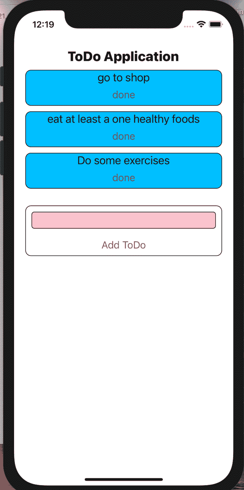

# 使用 SQLite 和 React Native 

> 原文：<https://blog.logrocket.com/using-sqlite-with-react-native/>

开发人员使用 C 语言库 SQLite 作为移动应用程序中的数据存储非常常见。SQLite 对于离线应用程序特别有用，许多平台都包括对 SQLite 的现成支持，这使得安装非常简单。

在本文中，我们将在 React 本机应用程序中使用 SQLite 来建立一个简单的待办事项列表应用程序，它将向我们展示所有 CRUD 操作是如何工作的。考虑到 TypeScript 在代码质量和可维护性方面的优势，我们也将使用它。

### 先决条件:

*   对 React 和 React Native 有基本的了解
*   熟悉打字稿

## 入门指南

我们将创建一个待办事项列表应用程序，包括以下内容:

*   **完成**按钮:清除已完成的项目
*   **添加待办事项**按钮:添加新项目
*   两个`useState`调用:一个用于保存待办事项列表，一个用于跟踪新的待办事项
*   应用程序组件:处理用户事件，如添加和删除待办事项
*   哑组件:显示待办事项列表项

注意，我们将使用一组功能组件和几个新的 hook APIs 来实现状态管理。

### 设置 React 本机和类型脚本

我们将从使用 TypeScript 创建一个 React 本机应用程序开始:

```
npx react-native init MyApp --template react-native-template-typescript
```

您可以[克隆 React 应用程序](https://github.com/dilantha111/example-react-native-sqlite/tree/start),并在通读本文时继续工作。

您将看到存储库中有两个分支，`start`和`main`。我们将从`start`分公司开始。

### SQLite 简介

让我们将 SQLite 引入我们的应用程序。为了连接 SQLite，我们将使用`[react-native-sqlite-storage](https://www.npmjs.com/package/react-native-sqlite-storage)`库。

要安装 SQLite，请在终端中运行以下代码:

```
npm install --save react-native-sqlite-storage
```

## 安装 React 本地包

### ios

如果您使用的是 iOS，运行下面的命令来安装必要的 React 原生包:

```
cd ios && pod install && cd ..
```

如果您运行的是 React Native 0.59 或更低版本，您有两种选择来安装 React Native 包，这取决于您是否使用 CocoaPods。

#### 有椰子的:

如果您正在运行 CocoaPods，请将下面的代码添加到您的 podfile 中:

```
pod 'React', :path => '../node_modules/react-native'
pod 'react-native-sqlite-storage', :path => '../node_modules/react-native-sqlite-storage'

```

运行`pod install`或`pod update`。

#### 没有椰子

如果你没有运行 CocoaPods，你必须使用`react-native link`。如果您遇到任何错误，您必须从 Xcode 打开项目并手动添加依赖项。更多详情，请参考[库文档](https://www.npmjs.com/package/react-native-sqlite-storage)。

### 机器人

如果您在 React Native .60 或更高版本中使用设备的 SQLite，您不必采取任何额外的步骤。

但是，如果您使用的是与`react-native-sqlite-storage`库捆绑在一起的 SQLite，您可以将下面的代码添加到您的`react-native.config.js`文件中:

```
module.exports = {
  ...,
  dependencies: {
    ...,
    "react-native-sqlite-storage": {
      platforms: {
        android: {
          sourceDir:
            "../node_modules/react-native-sqlite-storage/platforms/android-native",
          packageImportPath: "import io.liteglue.SQLitePluginPackage;",
          packageInstance: "new SQLitePluginPackage()"
        }
      }
    }
    ...
  }
  ...
};

```

如果你运行的是旧版本的 React Native，你必须手动更新`Gradle`文件。有关完整配置，请参考[库文档](https://www.npmjs.com/package/react-native-sqlite-storage)。

## 实施数据存储服务

现在，我们已经准备好实现数据存储服务。我们将引入一个名为`db-service.ts`的新`.ts`文件，我们可以在其中添加所有的`db`操作。首先，让我们创建一个方法来获得一个`db`连接。

由于我们使用的是 TypeScript，我们可以安装`@types/react-native-sqlite-storage`来使用包含的类型。如果你坚持使用 JavaScript，你可以不安装这个库。

使用以下代码添加`db`连接方法:

```
import {openDatabase} from 'react-native-sqlite-storage';

export const getDBConnection = async () => {
  return openDatabase({name: 'todo-data.db', location: 'default'});
};

```

如果在我们启动应用程序时还没有表，我们需要创建一个。运行以下代码添加另一个方法:

```
export const createTable = async (db: SQLiteDatabase) => {
  // create table if not exists
  const query = `CREATE TABLE IF NOT EXISTS ${tableName}(
        value TEXT NOT NULL
    );`;

  await db.executeSql(query);
};

```

因为我们在库中使用基于 promise 的 API，所以将下面的代码添加到我们的`db-service.ts`文件中很重要:

```
enablePromise(true);

```

接下来，我们将添加保存、删除和获取待办事项的方法。添加这些方法后，我们的`db`服务文件将看起来像下面的代码块:

```
import { enablePromise, openDatabase, SQLiteDatabase } from 'react-native-sqlite-storage';
import { ToDoItem } from '../models';

const tableName = 'todoData';

enablePromise(true);

export const getDBConnection = async () => {
  return openDatabase({ name: 'todo-data.db', location: 'default' });
};

export const createTable = async (db: SQLiteDatabase) => {
  // create table if not exists
  const query = `CREATE TABLE IF NOT EXISTS ${tableName}(
        value TEXT NOT NULL
    );`;

  await db.executeSql(query);
};

export const getTodoItems = async (db: SQLiteDatabase): Promise<ToDoItem[]> => {
  try {
    const todoItems: ToDoItem[] = [];
    const results = await db.executeSql(`SELECT rowid as id,value FROM ${tableName}`);
    results.forEach(result => {
      for (let index = 0; index < result.rows.length; index++) {
        todoItems.push(result.rows.item(index))
      }
    });
    return todoItems;
  } catch (error) {
    console.error(error);
    throw Error('Failed to get todoItems !!!');
  }
};

export const saveTodoItems = async (db: SQLiteDatabase, todoItems: ToDoItem[]) => {
  const insertQuery =
    `INSERT OR REPLACE INTO ${tableName}(rowid, value) values` +
    todoItems.map(i => `(${i.id}, '${i.value}')`).join(',');

  return db.executeSql(insertQuery);
};

export const deleteTodoItem = async (db: SQLiteDatabase, id: number) => {
  const deleteQuery = `DELETE from ${tableName} where rowid = ${id}`;
  await db.executeSql(deleteQuery);
};

export const deleteTable = async (db: SQLiteDatabase) => {
  const query = `drop table ${tableName}`;

  await db.executeSql(query);
};

```

我们添加了一个`deleteTable`方法，这在我们开发应用程序时会很有用。稍后，我们将为用户添加一个使用`deleteTable`方法清除所有数据的特性。

我们可以使用 SQLite 自带的`rowid`作为主键。我们已经更新了待办事项，使其具有 ID 和值，而不是简单的字符串，这样我们就可以轻松地删除项目。

接下来，我们将为我们的`ToDoItem`类型添加一个模型。将以下代码添加到名为`index.ts`的文件中，该文件位于的另一个名为`models`的文件夹中:

```
export type ToDoItem = {
  id: number;
  value: string;
};

```

## 使用`db`服务

我们必须在`App.tsx`使用我们的`db`服务。遵循以下四个步骤:

1.)更新`ToDoItem`组件和`App`组件以使用新的`ToDoItem`类型
2。)从 SQLite
3 加载数据。)保存数据到`db`
4。)更新`db`中已删除的项目

首先，让我们完成对`db`的设置，然后我们来看看`App.tsx`和`ToDoItem.tsx`文件的最终结果。

### 加载数据

为了在我们的应用程序中加载数据，我们将使用`useEffect`和`useCallback`钩子:

```
const loadDataCallback = useCallback(async () => {
    try {
      const initTodos = [{ id: 0, value: 'go to shop' }, { id: 1, value: 'eat at least a one healthy foods' }, { id: 2, value: 'Do some exercises' }];
      const db = await getDBConnection();
      await createTable(db);
      const storedTodoItems = await getTodoItems(db);
      if (storedTodoItems.length) {
        setTodos(storedTodoItems);
      } else {
        await saveTodoItems(db, initTodos);
        setTodos(initTodos);
      }
    } catch (error) {
      console.error(error);
    }
  }, []);

  useEffect(() => {
    loadDataCallback();
  }, [loadDataCallback]);

```

在上面的代码片段中，我们从`db`中读取数据。如果我们存储了任何待办事项，我们就用这些来初始化应用程序。如果没有，我们将把初始值保存到`db`中，并使用该数据初始化应用程序。

### 添加项目

若要添加待办事项，请运行以下代码:

```
const addTodo = async () => {
    if (!newTodo.trim()) return;
    try {
      const newTodos = [...todos, {
        id: todos.reduce((acc, cur) => {
          if (cur.id > acc.id) return cur;
          return acc;
        }).id + 1, value: newTodo
      }];
      setTodos(newTodos);
      const db = await getDBConnection();
      await saveTodoItems(db, newTodos);
      setNewTodo('');
    } catch (error) {
      console.error(error);
    }
  };

```

### 删除项目

最后，运行下面的代码删除一个待办事项:

```
const deleteItem = async (id: number) => {
    try {
      const db = await getDBConnection();
      await deleteTodoItem(db, id);
      todos.splice(id, 1);
      setTodos(todos.slice(0));
    } catch (error) {
      console.error(error);
    }
  };

```

我们最终的`App.tsx`文件应该看起来像下面的代码:

```
/**
 * Sample React Native App
 * https://github.com/facebook/react-native
 *
 * Generated with the TypeScript template
 * https://github.com/react-native-community/react-native-template-typescript
 *
 * @format
 */
import React, { useCallback, useEffect, useState } from 'react';
import {
  Button,
  SafeAreaView,
  ScrollView,
  StatusBar,
  StyleSheet,
  Text,
  TextInput,
  useColorScheme,
  View,
} from 'react-native';
import { ToDoItemComponent } from './components/ToDoItem';
import { ToDoItem } from './models';
import { getDBConnection, getTodoItems, saveTodoItems, createTable, clearTable, deleteTodoItem } from './services/db-service';
const App = () => {
  const isDarkMode = useColorScheme() === 'dark';
  const [todos, setTodos] = useState<ToDoItem[]>([]);
  const [newTodo, setNewTodo] = useState('');
  const loadDataCallback = useCallback(async () => {
    try {
      const initTodos = [{ id: 0, value: 'go to shop' }, { id: 1, value: 'eat at least a one healthy foods' }, { id: 2, value: 'Do some exercises' }];
      const db = await getDBConnection();
      await createTable(db);
      const storedTodoItems = await getTodoItems(db);
      if (storedTodoItems.length) {
        setTodos(storedTodoItems);
      } else {
        await saveTodoItems(db, initTodos);
        setTodos(initTodos);
      }
    } catch (error) {
      console.error(error);
    }
  }, []);
  useEffect(() => {
    loadDataCallback();
  }, [loadDataCallback]);
  const addTodo = async () => {
    if (!newTodo.trim()) return;
    try {
      const newTodos = [...todos, {
        id: todos.length ? todos.reduce((acc, cur) => {
          if (cur.id > acc.id) return cur;
          return acc;
        }).id + 1 : 0, value: newTodo
      }];
      setTodos(newTodos);
      const db = await getDBConnection();
      await saveTodoItems(db, newTodos);
      setNewTodo('');
    } catch (error) {
      console.error(error);
    }
  };
  const deleteItem = async (id: number) => {
    try {
      const db = await getDBConnection();
      await deleteTodoItem(db, id);
      todos.splice(id, 1);
      setTodos(todos.slice(0));
    } catch (error) {
      console.error(error);
    }
  };
  return (
    <SafeAreaView>
      <StatusBar barStyle={isDarkMode ? 'light-content' : 'dark-content'} />
      <ScrollView
        contentInsetAdjustmentBehavior="automatic">
        <View style={[styles.appTitleView]}>
          <Text style={styles.appTitleText}> ToDo Application </Text>
        </View>
        <View>
          {todos.map((todo) => (
            <ToDoItemComponent key={todo.id} todo={todo} deleteItem={deleteItem} />
          ))}
        </View>
        <View style={styles.textInputContainer}>
          <TextInput style={styles.textInput} value={newTodo} onChangeText={text => setNewTodo(text)} />
          <Button
            onPress={addTodo}
            title="Add ToDo"
            color="#841584"
            accessibilityLabel="add todo item"
          />
        </View>
      </ScrollView>
    </SafeAreaView>
  );
};
const styles = StyleSheet.create({
  appTitleView: {
    marginTop: 20,
    justifyContent: 'center',
    flexDirection: 'row',
  },
  appTitleText: {
    fontSize: 24,
    fontWeight: '800'
  },
  textInputContainer: {
    marginTop: 30,
    marginLeft: 20,
    marginRight: 20,
    borderRadius: 10,
    borderColor: 'black',
    borderWidth: 1,
    justifyContent: 'flex-end'
  },
  textInput: {
    borderWidth: 1,
    borderRadius: 5,
    height: 30,
    margin: 10,
    backgroundColor: 'pink'
  },
});
export default App;

```

最后，我们最终的`ToDoItem.tsx`文件应该看起来像下面的代码块:

```
import React from 'react';
import {
  Button,
  StyleSheet,
  Text,
  View,
} from 'react-native';
import { ToDoItem } from '../models';
export const ToDoItemComponent: React.FC<{
  todo: ToDoItem;
  deleteItem: Function;
}> = ({ todo: {id, value}, deleteItem }) => {
  return (
    <View style={styles.todoContainer}>
      <View style={styles.todoTextContainer}>
        <Text
          style={styles.sectionTitle}>
          {value}
        </Text>
      </View>
      <Button
        onPress={() => deleteItem(id)}
        title="done"
        color="#841584"
        accessibilityLabel="add todo item"
      />
    </View>
  );
};
const styles = StyleSheet.create({
  todoContainer: {
    marginTop: 10,
    paddingHorizontal: 24,
    backgroundColor: 'deepskyblue',
    marginLeft: 20,
    marginRight: 20,
    borderRadius: 10,
    borderColor: 'black',
    borderWidth: 1,
  },
  todoTextContainer: {
    justifyContent: 'center',
    flexDirection: 'row',
  },
  sectionTitle: {
    fontSize: 20,
    fontWeight: '400',
  }
});

```

你有它！我们完成的 React 本机待办事项应用程序应该如下图所示:



## 结论

在本教程中，我们学习了如何将 SQLite 数据库与 React 本机应用程序连接起来，然后使用 TypeScript 创建了我们自己的应用程序。

我们使用了连接器库`react-native-sqlite-storage`，完成了 CRUD 操作。然后，我们将这些操作与 React 状态更新结合起来，并考虑了简单状态管理和持久化数据之间的差异。

我希望你喜欢这篇文章，不要忘记评论任何想法和改进。编码快乐！

## [LogRocket](https://lp.logrocket.com/blg/react-native-signup) :即时重现 React 原生应用中的问题。

[](https://lp.logrocket.com/blg/react-native-signup)

[LogRocket](https://lp.logrocket.com/blg/react-native-signup) 是一款 React 原生监控解决方案，可帮助您即时重现问题、确定 bug 的优先级并了解 React 原生应用的性能。

LogRocket 还可以向你展示用户是如何与你的应用程序互动的，从而帮助你提高转化率和产品使用率。LogRocket 的产品分析功能揭示了用户不完成特定流程或不采用新功能的原因。

开始主动监控您的 React 原生应用— [免费试用 LogRocket】。](https://lp.logrocket.com/blg/react-native-signup)