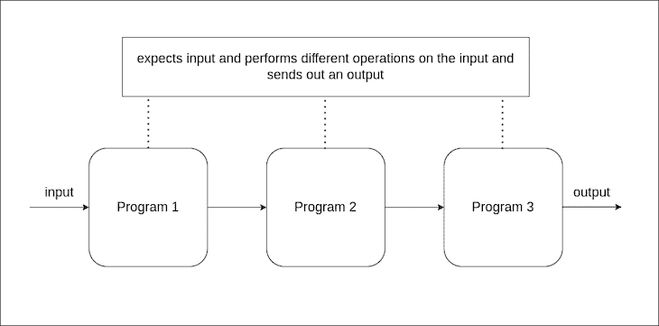

# 在 Node.js 中使用 stdout、stdin 和 stderr

> 原文：<https://blog.logrocket.com/using-stdout-stdin-stderr-node-js/>

`stdout`、`stdin`和`stderr`是标准流，它们在程序执行时将程序与其环境之间的输入和输出通信信道互连。

流通常指数据的流动。您可以将流视为工厂中连接到不同机器(在我们的例子中是程序)的传送带。不同的机器可以以某种方式用一根带子(管子)来排列、指挥和连接，以产生特定的结果。

正如我们可以连接物理 I/O 设备(通过鼠标输入，通过监视器输出)，标准流对此进行了抽象，为我们的代码提供了可组合性。



就像我们可以用小命令组成强大的 Linux 命令一样，我们可以利用 Node.js 标准流在 Node.js 中实现同样的功能。

## Node.js `stdin`、`stdout`和`stdin`

当我们运行 Node.js 程序时，会为该程序的执行启动一个进程。

GNU 文档将进程定义为“分配系统资源的基本单位”。每个进程都有自己的地址空间和(通常)一个控制线程。进程执行程序；您可以让多个进程执行同一个程序，但每个进程在自己的地址空间中都有自己的程序副本，并独立于其他副本执行它

每个进程都用三个打开的文件描述符初始化，分别叫做`stdin`、`stdout`和`stderr`。

这三个文件描述符统称为标准流。

为一个流程启动一组三个标准流，我们可以通过 Node.js 中的`process`对象访问它们。

标准流被视为存在文件。访问任何文件的一种简单方法是使用与之相关联的唯一文件描述符。在这些标准流的情况下，每个标准流都分配有唯一的值。

*   [`process.stdin`](https://nodejs.org/api/process.html#processstdin) (0):标准输入流，是程序的输入源
*   [`process.stdout`](https://nodejs.org/api/process.html#processstdout) (1):标准输出流，它是程序输出的一个来源
*   [`process.stderr`](https://nodejs.org/api/process.html#processstderr) (2):标准错误流，用于程序发出的错误消息和诊断

### `stdin`和`stdout`的简单使用

让我们编写一个简单的应用程序，它通过终端接收数据，并将处理后的输出打印到终端中。

我们将创建一个 JavaScript 文件(`index.js`)并编写如下代码:

```
 // index.js
process.stdin.on("data", data => {
    data = data.toString().toUpperCase()
    process.stdout.write(data + "\n")
})

```

运行上面的程序会创建一个事件监听器来监听数据输入，处理输入，并将输出打印到终端。


我们可以通过按`ctrl + c`来停止终端中正在运行的进程。

### 利用`readline`创建交互式终端脚本

`readline`是一个 Node.js 模块，它提供了一个接口，用于从一个[可读的](https://nodejs.org/api/stream.html#readable-streams)流(比如`process.stdin`)中一次读取一行数据。

首先，我们将创建一个名为`index.js`的新 JavaScript 文件，将`readline`模块导入到我们的程序中，然后创建一个函数`ask`，它接收一个字符串作为参数，并在我们的终端中创建一个包含该字符串的提示:

```
// index.js
const readline = require("readline")

function ask(question) {
    // asks a question and expect an answer
}

```

然后我们将使用`readline`创建一个接口，将`stdin`连接到`stdout`:

```
// index.js
const readline = require("readline")

const rl = readline.createInterface({
    input: process.stdin, 
    output: process.stdout,
})

function ask(question) {
    // asks a question and expectings an answer
}

```

我们将完成`ask`函数来期待答案，并递归地重复整个过程:

```
 // index.js
const readline = require("readline")

const rl = readline.createInterface({
    input: process.stdin, 
    output: process.stdout,
})

function ask(question) {
    rl.question(question, (answer) => {
        rl.write(`The answer received:  ${answer}\n`)

        ask(question)
    })
}

ask("What is your name: ")

```

运行上面的程序将创建一个终端接口，它一直循环，直到我们在终端中按下`ctrl + c`结束 Node.js 进程。

`ctrl + c`向我们正在运行的名为`SIGKILL`的 Node.js 程序发送一个信号，告诉 Node.js 停止我们的程序执行。我们还可以通过调用`process.exit(exitCode)`，以编程方式通知 Node.js 停止执行我们的应用程序。

因此，我们将更新我们的`ask`函数，检查输入“q”的答案是否正确。如果输入是“q”，那么它应该退出应用程序:

```
// index.js
const readline = require("readline")

const rl = readline.createInterface({
    input: process.stdin, 
    output: process.stdout,
})

function ask(question) {
    rl.question(question, (answer) => {
        if(answer === "q") {
            process.exit(1)
        }
        rl.write(`The answer received:  ${answer}\n`)

        ask(question)
    })
}

ask("What is your name: ") 

```

### 什么是`stderr`？

当我们编写应用程序或程序时，可能会由于许多原因而出现错误。`stderr`是默认的文件描述符 *，进程可以在其中写入错误消息。*

 *请考虑下面的代码:

```
// index.js
process.stderr.write("error! some error occurred\n")

```

用`node index.js`运行这个应用程序会将错误消息写到我们的终端，类似于`stdout`输出它的方式。

理解为什么`stdin`和`stdout`存在是非常简单的。然而，`stderr`似乎相当古怪。

* * *

### 更多来自 LogRocket 的精彩文章:

* * *

在基于 UNIX/Linux 的生态系统中，曾经有一段时间`stderr`不存在。UNIX 命令的所有输出都可以通过`stdout`传输，包括命令的预期结果和错误或诊断消息。

这不是最佳做法，因为错误也可能通过管道传递，而管道末端附加的命令可能不理解这一点。

因此，`stderr`被创建来通过一个不同的文件描述符，即`2`，引导错误或诊断消息。

*注意，在 Linux 中，当您通过管道将命令连接在一起时，只会将预期的结果连接在一起。错误或诊断错误信息通过* `stderr` *文件描述符传送，并默认打印到终端。*

让我们通过编写两个名为`logger.js`和`printer.js`的 Node.js 程序来处理这个问题。

`logger.js`模拟了一个日志程序，但是在我们的例子中，日志已经被预定义了。

然后，`printer.js`将从`stdin`中读取数据，并将它们写入文件。

首先，我们将创建下面的`logger.js`:

```
const logObject = [
    {
        type: "normal",
        message: "SUCCESS: 2 + 2 is 4"
    },
    {
        type: "normal",
        message: "SUCCESS 5 + 5 is 10"
    },
    {
        type: "error",
        message: "ERROR! 3 + 3 is not 4"
    },
    {
        type: "normal",
        message: "SUCESS 10 - 4 is 6"
    }
]

function logger() {
    logObject.forEach(log => {
        setTimeout(() => {
            if (log.type === "normal") process.stdout.write(log.message)
            else process.stderr.write(log.message + '\n')
        }, 500)
    })
}

logger()

```

接下来，我们将创建另一个 Node.js 文件，该文件创建或打开一个文本文件`logs.txt`，读取由`stdout`提供的输入，并将它们写入一个文件:

```
const fs = require("fs")

fs.open("./logs.txt", "w", (err, fd) => {
    if (err) throw Error(err.message)
    process.stdin.on("data", data => {
        fs.write(fd, data.toString() + "\n", (err) => {
            if (err) throw Error(err.message)
        })
    })
})

```

要运行这个应用程序，我们可以通过运行以下命令在终端中传输这两个程序:

```
$ node logger.js | node printer.js

```

> **注意**，如果你在 Windows 中用 Git Bash 运行上述命令，你可能会遇到错误`stdout is not a tty`。这可能是 Git Bash 的一个问题。您可以使用 Window Powershell 运行该命令，或者通过在文件顶部包含一个 shebang ( `#!/bin/env node`)并以`./logger.js | ./printer.js`的身份运行上面的命令来使该脚本可执行。

执行后，我们可以确认只有通过`stdout`的成功日志到达了`logs.txt`:

```
// logs.txt
SUCCESS: 2 + 2 is 4
SUCCESS 5 + 5 is 10
SUCcESS 10 - 4 is 6

```

并且错误日志被打印到终端。这是`stderr`的默认行为，但是我们也可以通过重定向和管道来改变它。

## 包扎

现在我们了解了什么是标准流，以及如何在 Node.js 应用程序中使用它们。我们也知道标准流如何帮助我们构建简单的程序，这些程序可以被引导来制定更复杂的程序。

例如，`printer.js`不一定需要知道`logger.js`做什么。所有的`printer.js`所做的就是从`stdout`接收数据并将数据写入文件。

如果它们共享相同的执行环境，可以重用并与其他程序组合，甚至与 Linux 命令组合。

## 200 只显示器出现故障，生产中网络请求缓慢

部署基于节点的 web 应用程序或网站是容易的部分。确保您的节点实例继续为您的应用程序提供资源是事情变得更加困难的地方。如果您对确保对后端或第三方服务的请求成功感兴趣，

[try LogRocket](https://lp.logrocket.com/blg/node-signup)

.

[](https://lp.logrocket.com/blg/node-signup)[https://logrocket.com/signup/](https://lp.logrocket.com/blg/node-signup)

LogRocket 就像是网络和移动应用程序的 DVR，记录下用户与你的应用程序交互时发生的一切。您可以汇总并报告有问题的网络请求，以快速了解根本原因，而不是猜测问题发生的原因。

LogRocket 检测您的应用程序以记录基线性能计时，如页面加载时间、到达第一个字节的时间、慢速网络请求，还记录 Redux、NgRx 和 Vuex 操作/状态。

[Start monitoring for free](https://lp.logrocket.com/blg/node-signup)

.*