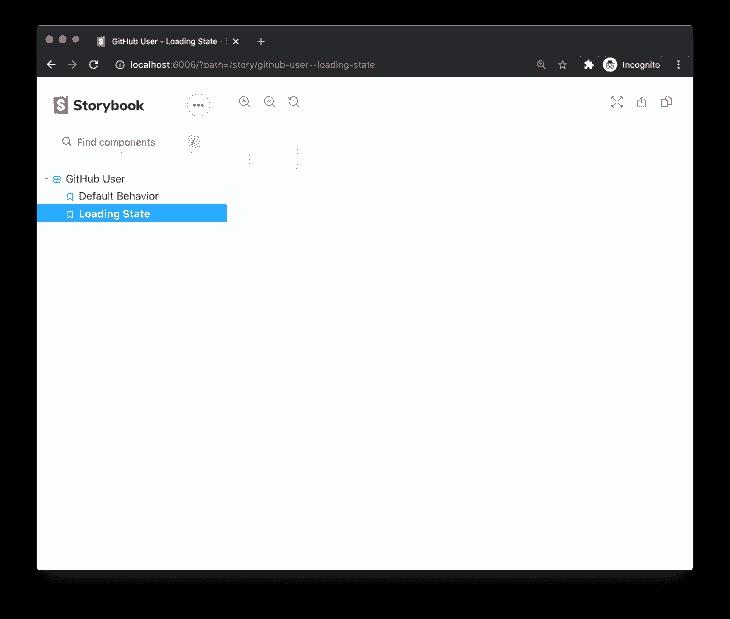
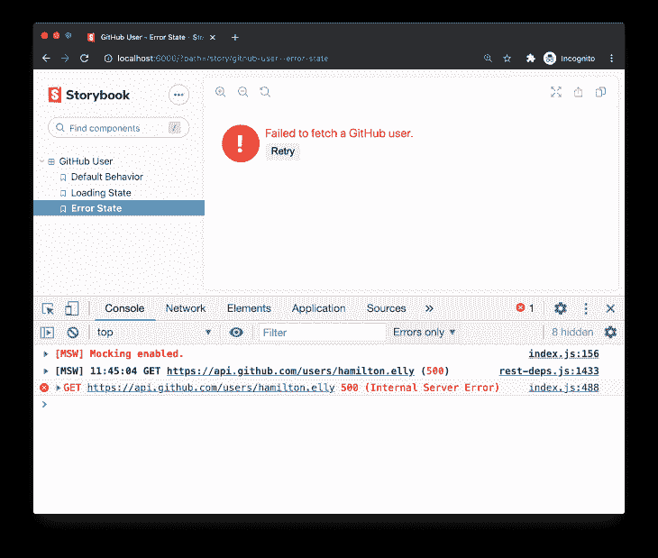

# 使用故事书和模拟服务工作者模拟 API 响应

> 原文：<https://blog.logrocket.com/using-storybook-and-mock-service-worker-for-mocked-api-responses/>

Storybook 是为 JavaScript 应用程序开发 UI 组件的最佳方式之一，因为它允许在多种状态下预览组件，充当代码的交互式文档，并具有支持故事优先开发的实时环境。

虽然在 Storybook 中呈现小的 UI 单元很简单，但是当涉及到发出 API 请求的组件时，开发人员必须寻求一个 API 模拟解决方案来控制响应，并从故事中去掉实际的 HTTP 通信。

在本文中，我们将把一个名为 Mock Service Worker 的 API 模仿库集成到一个故事书项目中。

## 什么是模拟服务人员？

[Mock Service Worker](http://mswjs.io) (MSW)是一个针对 browser 和 Node.js 的 API 模仿库，除了对 [REST](https://en.wikipedia.org/wiki/Representational_state_transfer) 和 [GraphQL API](https://graphql.org/) 的丰富支持之外，该库的关键特性是通过 Service Worker 在网络层面上拦截请求。这意味着对您正在测试或开发的组件绝对不做任何更改，因为它意识不到任何类型的嘲笑，并继续发出与生产中相同的请求。

与 Storybook 相结合，MSW 通过提供一种无缝的方式来控制内部和外部 API 通信，提供了无与伦比的组件开发体验。难怪 MSW 是故事书里[推荐的拦截 API](https://storybook.js.org/docs/react/workflows/build-pages-with-storybook#specific-mocks) 的方式之一！

* * *

## 设置故事书和模拟服务人员项目

我们将使用一个新的 [Create React App](https://create-react-app.dev/) 项目。Storybook 和 MSW 都是与框架无关的工具，因此您可以使用本文中的步骤将它们集成到任何其他 JavaScript 项目中，无论是 [Angular](https://angular.io/) 、 [Vue.js](https://vuejs.org/) 还是 [Svelte](https://svelte.dev/) 。

> 你可以在 [GitHub](https://github.com/mswjs/examples/tree/master/examples/with-storybook) 上看到该项目的完整源代码。

### 安装故事书

让我们从安装故事书开始:

```
$ npx sb init

```

> 请参见故事书文档中的[入门](https://storybook.js.org/docs/react/get-started/install)页，了解更多关于安装的详细信息。

一旦故事书安装完毕，您应该会在项目中看到几个新目录:

```
|-- .storybook
|   |-- main.js
|   |-- preview.js
|-- src
|   |-- /stories

```

接下来，让我们添加`msw`包:

```
$ npm install msw --save-dev

```

### 正在初始化服务工作者

模拟服务工作器使用一个工作器脚本来实现浏览器中的请求拦截。该库附带了一个指定的 CLI 来自动初始化该工作脚本。

要初始化 worker 脚本，运行`npx msw init`命令，并为其提供项目公共目录的相对路径，在 create-react-app 的情况下，该路径是`./public`文件夹:

```
$ npx msw init ./public

```

> 公共目录可能因项目而异。请参见[常用公共目录列表](https://mswjs.io/docs/getting-started/integrate/browser#where-is-my-public-directory)进行参考。

## 创建反应组件

我们的项目将是一个显示 GitHub 用户简短信息的 React 组件。其意图是将组件呈现如下:

```
<GitHubUser username="any-username" />

```

让我们简单看一下`GitHubUser`组件的源代码:

```
// src/GitHubUser.jsx
import React from 'react'
import { useFetch } from '../../../hooks/useFetch'
import './GitHubUser.css'

export const GitHubUser = ({ username }) => {
  // Fetch user details from the GitHub API V3.
  const { data, loading, error, refetch } = useFetch(
    `https://api.github.com/users/${username}`
  )
  const { name, login, avatar_url } = data || {}

  // Compose some conditional classes based on the request state.
  const containerClassNames = [
    'container',
    loading && 'loading',
    error && 'error',
  ]
    .filter(Boolean)
    .join(' ')

  // Eventually, render some markup.
  return (
    <div className={containerClassNames}>
      <div className="avatar-container">
        {avatar_url && }
      </div>
      {error ? (
        <div>
          <p>Failed to fetch a GitHub user.</p>
          <button onClick={refetch}>Retry</button>
        </div>
      ) : (
        <div>
          <p className="name">{name}</p>
          <p className="username">{login}</p>
        </div>
      )}
    </div>
  )
}

```

为了获取给定用户的详细信息，该组件通过自定义的`useFetch`钩子调用 GitHub API V3——这是对原生`window.fetch`的一个微小抽象。当 API 调用失败时，它还有一个很好的“重试”功能。

虽然这是组件行为的有效部分，但它发出的 HTTP 请求不属于 Storybook。在一个故事中发出实际请求，尤其是向第三方提供者发出请求，将会使我们的 UI 与相应的服务建立紧密的依赖关系，从而阻止我们编写的故事被复制，并禁止离线使用 Storybook。

## 写故事

因为我们今天关注故事书中的 API 模仿，所以让我们为我们的`GitHubUser`组件添加一个故事，展示它的默认(成功)行为:

```
// stories/GitHubUser.stories.js
import { GitHubUser } from '../src/GitHubUser'

export default {
  title: 'GitHub User',
  component: GitHubUser,
}

export const DefaultState = () => <GitHubUser username="hamilton.elly" />

```

> 在故事书文档中了解更多关于[写故事](https://storybook.js.org/docs/react/get-started/whats-a-story)的信息。

此时，组件将呈现，但仍然发出实际的 HTTP 请求。是时候添加一些 API 模拟了。

## 实现 API 模拟

为了让 MSW 知道要模拟哪些 API 调用，我们需要声明一组*请求处理程序*——描述请求谓词(捕获什么请求)和响应解析器(如何响应这些请求)的函数。之后，可以使用相同的请求处理程序声明一个用于浏览器内模拟的 worker，或者一个用于 Node.js 环境中模拟的“server”。

### 声明请求处理程序

在您的项目中创建一个`src/mocks`目录来存储与 API 模仿相关的所有内容。在该目录中，创建一个名为`handlers.js`的文件，并为一个`GET /user/:userId`请求声明请求处理程序，如下所示:

```
// src/mocks/handlers.js
import { rest } from 'msw'

export const handlers = [
  // Capture a GET /user/:userId request,
  rest.get('/user/:userId', (req, res, ctx) => {
    // ...and respond with this mocked response.
    return res(ctx.json({}))
  }),
]

```

> 我们在一个单独的模块中声明请求处理程序，因为它们可以被重用用于多种目的:在您的故事书中，在本地开发期间，用于测试，或者用于调试。一次编写，随处重用。

当编写模拟时，将 MSW 想象成一个被模拟的“服务器”虽然这个库没有建立任何实际的服务器，但是它充当了应用程序的服务器。考虑到这一点，我建议在全局`mocks/handlers.js`模块中保留任何 API 的“成功”路径，同时将每个场景的覆盖(例如错误响应)委托给更接近每个单独的使用表面(例如，一个特定的故事，或者一个集成测试)。

MSW 使用服务人员在浏览器中拦截请求和模拟响应。这就是为什么我们要创建一个负责拦截的`worker`实例。

使用`setupWorker` API 并为其提供之前声明的请求处理程序，以注册并激活您在设置步骤中初始化的服务工作器。

```
// src/mocks/browser.js
import { setupWorker } from 'msw'
import { handlers } from './handlers'

export const worker = setupWorker(...handlers)

```

`worker`接口公开了一个 [API 来控制它](https://mswjs.io/docs/api/setup-worker)(比如`start`和`stop`方法)，但是我们现在还不打算使用它。相反，我们将在下一步把这个责任委托给 Storybook。

## MSW 和 API 集成

对于我们使用的工具来说，适应变化是至关重要的。这是采用 MSW 的主要原因之一:它与请求客户端无关，允许您使用相同的集成，即使您的应用程序明天迁移到不同的请求库或完全不同的 API 约定。

现在，让我们在 Storybook 中启用 API 模拟，方法是编辑`.storybook/preview.js`文件，有条件地要求 worker 并启动它:

```
// .storybook/preview.js
if (typeof global.process === 'undefined') {
  const { worker } = require('../src/mocks/browser')
  worker.start()
}

```

> `global.process`检查确保 Storybook 不会试图在非浏览器环境中激活服务人员，因为在 Node.js 中运行的 Storybook 构建过程中也会执行`preview.js`。

完成此步骤后，您可以在您的故事中的浏览器 DevTools 中看到来自 MSW 的成功激活消息:


Storybook page showcasing our “GitHubUser” component receiving the mocked response.

您可以在 UI 和 DevTools 的控制台中看到 MSW 已经成功处理了我们的请求。这种设置最大的好处是我们不需要修改任何应用程序的代码！它仍然与 GitHub API 通信，但是接收我们指定的模拟响应。

`src/mocks/handlers.js`中列出的全局请求处理程序对于保持成功的 API 交互非常有用。然而，并不是所有的互动都是成功的。

如果您希望构建一个防弹 UI，您应该预料到错误，并确保您的组件可以为用户优雅地处理它们。此外，您应该能够在各自的故事中浏览您的组件在多个网络相关状态下的可视化插图。

## 每个故事的 API 响应

Storybook 的好处之一是能够以多种状态展示单个组件。对于我们的组件，我们可以说明各种 HTTP 通信场景的处理:组件等待响应时的加载状态，以及来自 GitHub API 的错误响应。为此，您可以基于每个故事重写请求处理程序。

我们将使用[story decorator](https://storybook.js.org/docs/react/writing-stories/decorators)通过[运行时请求处理器](https://mswjs.io/docs/api/setup-worker/use)来增强一个单独的故事，运行时请求处理器是一个 API，用于在运行时当故事呈现时追加或重写处理器。

### 模拟装载状态

异步操作可能需要时间，HTTP 调用也不例外。为了保证出色的用户体验，我们的组件必须能够处理加载状态，而我们的故事书应该以可重复和可预测的方式来说明加载状态。

幸运的是，你负责被嘲笑的反应，包括它们的反应时间。但是，您不希望影响不相关的故事，所以在全局请求处理程序中模仿加载状态不是最好的选择。相反，将加载状态的嘲讽逻辑放在故事本身的旁边。你可以这样做:

```
// src/stories/Component.story.js
import { rest } from 'msw'
import { worker } from '../mocks/browser'

// Create a new loading state story.
const LoadingState = () => <GitHubUser username="hamilton.elly" />

// Use Storybook decorators and MSW runtime handlers
// to handle the same HTTP call differently for this particular story.
LoadingState.decorators = [
  (Story) => {
    worker.use(
      rest.get('https://api.github.com/users/:username', (req, res, ctx) => {
        // Mock an infinite loading state.
        return res(ctx.delay('infinite'))
      })
    )
    return <Story />
  },
]

```

注意我们如何使用一个`worker.use()`方法来提供一个*运行时请求处理器*。我们仍然提供相同的请求方法和 URL，但是不同的解析器函数无限延迟响应(参见`[ctx.delay](https://mswjs.io/docs/api/context/delay)`实用程序)。这将响应保持在挂起状态，这正是您在 UI 中呈现组件如何处理加载状态所需要的。



Storybook page showcasing our “GitHubUser” component in a loading state.

通过检查您浏览器的 DevTools 中的 **Network** 选项卡，您可以看到 GitHub API 请求从未解决，这允许我们在我们的故事中预览该状态。这正是我们在这里需要 API 模拟的原因——以获得灵活性并控制我们的组件发出的 API 调用。

> MSW 附带了一个简单的 API 和各种实用程序来模拟响应[状态码](https://mswjs.io/docs/api/context/status)、[头](https://mswjs.io/docs/api/context/set)、[服务器 cookie](https://mswjs.io/docs/recipes/cookies)和许多其他工具，以模拟真实世界的场景，如身份验证、CORS 或媒体内容流。

### 模拟错误响应

与加载状态类似，您可以为错误响应创建一个单独的故事，并拥有一个运行时请求处理程序，它总是用特定的 HTTP 服务器错误进行响应。

```
// src/stories/Component.story.js
import { msw } from 'msw'
import { worker } from '../mocks/browser'

const ErrorState = () => <GitHubUser username="hamilton.elly" />
ErrorState.decorators = [
  (Story) => {
    worker.use(
      rest.get('https://api.github.com/users/:username', (req, res, ctx) => {
        // Respond with a 500 response status code.
        return res(ctx.status(500))
      })
    )
    return <Story />
  },
]

```

> 使用`[ctx.status](https://mswjs.io/docs/api/context/status)`和其他[上下文实用程序](https://mswjs.io/docs/api/context)来建模精确的 HTTP 响应，以展示组件的行为。

保存更改并导航到 Storybook，我们看到一个可重现的错误状态:



Storybook page showcasing our “GitHubUser” component’s behavior when it receives an error.

虽然我们的故事现在显示了错误处理，但单击**重试**按钮仍然会导致一个总是返回 500 响应的请求，就像我们在运行时请求处理程序中指定的那样。

如果能在第一次请求 GitHub API 时返回错误响应就太好了。您可以通过在运行时处理程序中使用`res.once`函数而不是`res`来实现这一点:

```
rest.get('https://api.github.com/users/:username', (req, res, ctx) => {
-  return res(ctx.status(500))
+  return res.once(ctx.status(500))
})

```

* * *

## 结论

在本教程中，我们已经了解了 Storybook 和 Mock Service Worker 之间的协同作用，当涉及到以多种状态呈现同一组件时，对模拟 API 响应进行粒度控制的好处，以及如何以无缝的方式将这两种技术集成在一起。

此外，由于 MSW 可以在 browser 和 Node.js 中运行，我们可以重用相同的 API 模拟逻辑进行测试和开发，从而实现富有成效的无缝集成。

你可以在 [GitHub](https://github.com/mswjs/examples/tree/master/examples/with-storybook) 上找到这个例子的源代码，并在 [MSW 文档](https://mswjs.io/docs)中了解更多关于 API 嘲讽的信息。

## 使用 [LogRocket](https://lp.logrocket.com/blg/signup) 消除传统错误报告的干扰

[](https://lp.logrocket.com/blg/signup)

[LogRocket](https://lp.logrocket.com/blg/signup) 是一个数字体验分析解决方案，它可以保护您免受数百个假阳性错误警报的影响，只针对几个真正重要的项目。LogRocket 会告诉您应用程序中实际影响用户的最具影响力的 bug 和 UX 问题。

然后，使用具有深层技术遥测的会话重放来确切地查看用户看到了什么以及是什么导致了问题，就像你在他们身后看一样。

LogRocket 自动聚合客户端错误、JS 异常、前端性能指标和用户交互。然后 LogRocket 使用机器学习来告诉你哪些问题正在影响大多数用户，并提供你需要修复它的上下文。

关注重要的 bug—[今天就试试 LogRocket】。](https://lp.logrocket.com/blg/signup-issue-free)