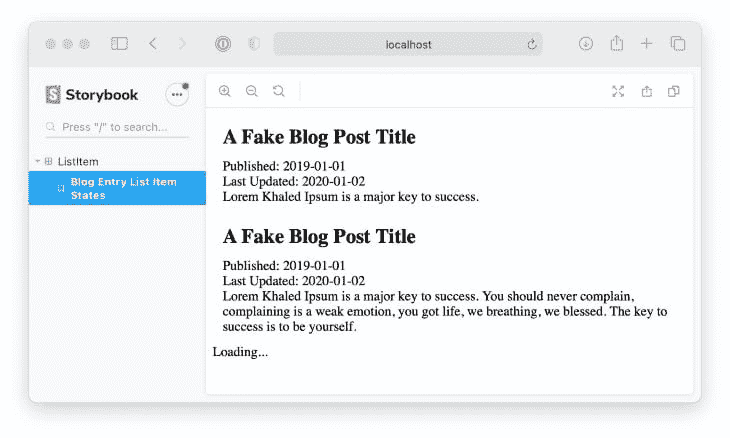
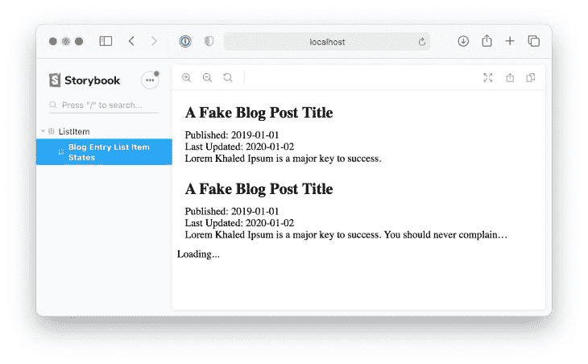
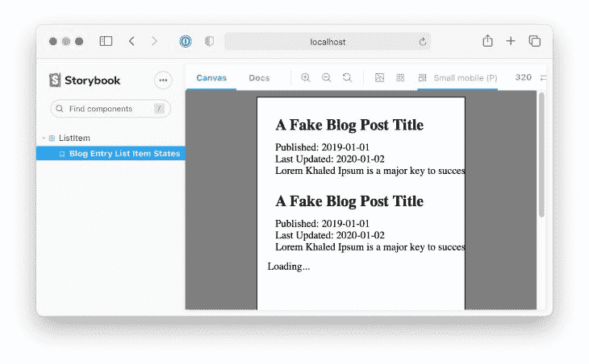
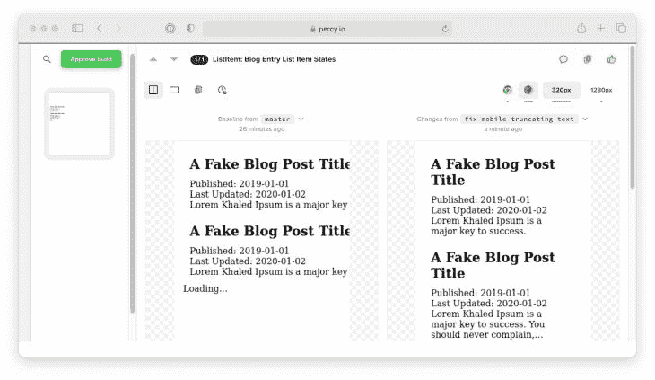
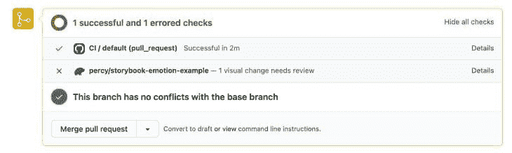
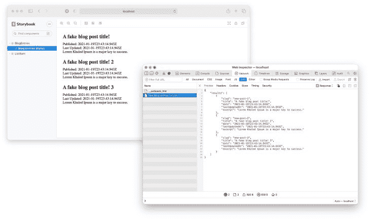

# 使用 Storybook 更快地开发 React 组件

> 原文：<https://blog.logrocket.com/using-storybook-to-develop-react-components-faster/>

作为产品开发人员，当你的目标是更快地发布产品时，这是一个不断添加有用的东西和删除无用的东西的过程。你需要尝试能让你更快完成工作的新流程。

那么，在 React 中，您可以在工作流程中添加哪些工具来加速开发呢？故事书。

## 什么是故事书？

根据 Storybook 网站的说法，【Storybook 是一个“开源平台，允许你在一个隔离的环境中记录、查看和测试你的 JavaScript 组件的许多排列。”

在我开始创建一个[组件](https://www.componentdriven.org/)之前，我首先在 Storybook 中为它创建故事，然后开始将它集成到我的 React 应用程序中。这导致编写更多的代码，但也让我减少了客户流失。

这也迫使我去思考边缘情况，组件的 API 应该如何定义，以及与我的主应用程序分离。

这类似于[测试驱动开发](https://en.wikipedia.org/wiki/Test-driven_development):在编写代码之前写出测试用例，但是在这种情况下，测试是组件可能处于的所有状态的故事。作为自己的应用程序，迭代组件设计很快。故事书让我消除了边缘案例，捕捉了更多的 bug，并最终更快地完成了功能。

将 Storybook 与可视化测试服务(如 [Percy](https://percy.io/) )相结合，可以帮助您的团队快速处理每个 pull 请求，向您展示新组件变化的不同之处。您还可以通过用[模拟服务工作者](https://mswjs.io/)模拟查询响应来进一步测试 [API 驱动的组件。](https://blog.logrocket.com/using-storybook-and-mock-service-worker-for-mocked-api-responses/)

## 在 Storybook 中设置组件

让我们看一个例子，看看如何使用 Storybook 更快地完成功能。故事只是用一套特殊的道具渲染的组件。你喜欢多少都可以。

让我们假设我们正在构建一个博客，并希望在索引页面上有一个条目列表。让我们为将呈现每个条目的组件的每个状态编写一个故事。

```
import React from "react";

import { BlogEntryListItem } from "./BlogEntryListItem";

export default {
  title: "BlogEntryListItem",
  component: BlogEntryListItem,
};

export const BlogEntryListItemLoaded = () => (
  <BlogEntryListItem
    title={"A Fake Blog Post Title"}
    excerpt={"Lorem Khaled Ipsum is a major key to success."}
    date={"2019-01-01"}
    lastUpdatedAt={"2020-01-02"}
    slug={"/a-fake-blog-post-title"}
  />
);

export const BlogEntryListItemLongExcerpt = () => (
  <BlogEntryListItem
    title={"A Fake Blog Post Title"}
    excerpt={
      "Lorem Khaled Ipsum is a major key to success. You should never complain, complaining is a weak emotion, you got life, we breathing, we blessed. The key to success is to be yourself."
    }
    date={"2019-01-01"}
    lastUpdatedAt={"2020-01-02"}
    slug={"/a-fake-blog-post-title"}
  />
);

export const BlogEntryListItemLoading = () => <BlogEntryListItem loading />;

```

在编码真实的东西之前，我们关注组件的 API。我喜欢在这里反映产品需求。

在这个例子中，我知道会有一些博客条目摘录，所以我为它创建了一个故事。我还需要一个加载状态，因为我计划使用 [react-loading-skeleton](https://github.com/dvtng/react-loading-skeleton) 。

下一步是为组件创建基本代码:

```
import React from "react";

export const BlogEntryListItem = (props) => {
  if (props.loading) {
    return <div>Loading...</div>;
  }
  return (
    <NoColorLink to={props.slug}>
      <BlogListItemWrapper>
        <Description>
          <Title>{props.title}</Title>
          <span>
            Published: {props.date}
            <br />
            Last Updated: {props.lastUpdatedAt}
          </span>
          <Excerpt>{props.excerpt}</Excerpt>
        </Description>
      </BlogListItemWrapper>
    </NoColorLink>
  );
};

```

这是它在故事书里的样子:



I rendered all the states in one story to make it fit the screenshot 🙃.

最棒的是，我们还没有接触到我们的主应用程序。我们不需要在产品配置、环境变量或运行本地 API 服务上浪费时间。

## 用故事书改进组件

定义组件需要的所有状态并编写一个简单的实现让我们看起来棒极了！

无需将我们的`BlogEntryListItem`组件添加到主应用程序中，我们就可以立即开始改进。正如你可能注意到的，摘录很长，并且包含在`<div>`中，所以让我们使用`overflow: hidden`来修复它。



Some `overflow: hidden` action 🤘.

看啊！我们改进了我们的组件，甚至没有踏入我们的主应用程序。我们还可以使用一些附加组件来确保我们的组件更加强大。

Storybook 默认附带的附加组件之一是 [Storybook Viewport 附加组件](https://github.com/storybookjs/storybook/tree/next/addons/viewport)，它允许您在各种屏幕尺寸上查看组件的外观。



We can’t read excerpts on mobile!

在这个例子中使用这个附加组件向我们展示了我们不能在移动设备上阅读摘录。

您可以看到使用 Storybook 如何改进我们的组件，而无需运行我们的主要 React 应用程序。这就是使用组件的真正力量。

## 用故事书提高速度

当遍历组件时，必然会发生许多视觉上的变化。让一个同事提取你的代码变更，并在本地运行 Storybook 来查看变更的工作是缓慢的，我们当然可以工作得更快。

[视觉测试](https://www.learnstorybook.com/visual-testing-handbook/)工具在你迭代时给你组件间视觉差异的截图。例如，一个工具可以为我们的组件生成一个修复的截图，以便在移动设备上正确地呈现条目。



Visual Testing example of a mobile text fix in Percy.

这是通过持续集成服务来实现的，如 [CircleCI](https://circleci.com/) 或 [Github Actions](https://github.com/features/actions) ，你可以构建故事书，并使用[珀西故事书插件](https://github.com/percy/percy-storybook)来拍摄你所有的故事。它在一致的浏览器环境中渲染每个故事，并将 HTML 发送给 Percy 进行渲染。然后，它将这些渲染的故事与以前的构件进行比较，以标记差异，如下所示:



What the Percy app looks like in a pull request.

> [Percy 提供了一个很棒的 Github 动作，它自动完成所有这一切](https://github.com/percy/storybook-action)。下面是一个实现这一点的拉请求示例。

根据我的经验，通过发现我们在代码审查中没有发现的变化，使用故事书进行可视化测试已经发现了许多回归。

## 用故事书模拟 API 查询

Storybook 不仅可以为我们提供一种测试组件外观和感觉的方法，还可以帮助我们测试行为。应用程序中的一些组件很可能从远程 API 查询数据。这些通常被称为“容器组件”或“页面组件”

为组件提供假数据很好，但是我们可以通过模仿组件执行的 API 请求来更接近真实情况。

这个例子使用了 REST API，但是使用的库与 GraphQL 兼容。

回想一下我们的博客条目，通常父组件会查询一堆条目:

```
import React from "react";
import { useQuery } from "react-query";

import { BlogEntryListItem } from "./BlogEntryListItem";

async function fetchBlogEntries() {
  const res = await fetch("<https://fake-blog-entries-url.com>");
  if (!res.ok) {
    throw new Error(res.statusText);
  }
  const data = await res.json();
  return data.results;
}

export const BlogEntries = (props) => {
  const { status, data, error } = useQuery("blog-entries", fetchBlogEntries);
  return data.map((datum, index) => {
    return <BlogEntryListItem key={index.toString()} {...datum} />;
  });
};

```

如果我们可以在 Storybook 中模拟来自服务器的响应，以查看组件在不同场景中的行为，那就太好了。有一个很棒的库叫做[模拟服务工作者](https://mswjs.io)，它将拦截浏览器网络查询并提供模拟响应。再加上这个模块的[故事书附件，我们可以提供模拟数据:](https://github.com/itaditya/msw-storybook-addon)

```
import React from "react";
import { QueryClient, QueryClientProvider } from "react-query";
import { rest } from "msw";

import { BlogEntries } from "./BlogEntries";

const mockedQueryClient = new QueryClient({
  defaultOptions: {
    queries: {
      retry: false,
    },
  },
});

export default {
  title: "BlogEntries",
  component: BlogEntries,
};

export const BlogEntriesStates = () => (
  <QueryClientProvider client={mockedQueryClient}>
    <BlogEntries />
  </QueryClientProvider>
);

BlogEntriesStates.story = {
  parameters: {
    msw: [
      rest.get("<https://fake-blog-entries-url.com>", (req, res, ctx) => {
        return res(
          ctx.json({
            results: [
              ...
            ],
          })
        );
      }),
    ],
  },
};

```



It works!

## 结论

我在这里讲了很多，所以我将总结一下我的故事书工作流程:

1.  从产品接收需求
2.  想想我的组件层次结构
3.  对于每个组成部分，为每个重要的状态写一个故事
4.  对于每个“页面”或功能，编写一个故事并添加 API 模拟
5.  为满足每个状态的每个组件编写代码
6.  在 CI 中使用可视化测试来测试我对主要分支的更改

请注意，有许多步骤，需要一些时间来适应这个新流程。但是在实践了这个工作流程之后，现在对我来说似乎很自然了，我再也不会在不使用 Storybook 的情况下回去写 React 代码了。

Storybook 是构建组件原型并确保可视化组件得到应有的喜爱的完美方式。

## [LogRocket](https://lp.logrocket.com/blg/react-signup-general) :全面了解您的生产 React 应用

调试 React 应用程序可能很困难，尤其是当用户遇到难以重现的问题时。如果您对监视和跟踪 Redux 状态、自动显示 JavaScript 错误以及跟踪缓慢的网络请求和组件加载时间感兴趣，

[try LogRocket](https://lp.logrocket.com/blg/react-signup-general)

.

[ ](https://lp.logrocket.com/blg/react-signup-general) [](https://lp.logrocket.com/blg/react-signup-general) 

LogRocket 结合了会话回放、产品分析和错误跟踪，使软件团队能够创建理想的 web 和移动产品体验。这对你来说意味着什么？

LogRocket 不是猜测错误发生的原因，也不是要求用户提供截图和日志转储，而是让您回放问题，就像它们发生在您自己的浏览器中一样，以快速了解哪里出错了。

不再有嘈杂的警报。智能错误跟踪允许您对问题进行分类，然后从中学习。获得有影响的用户问题的通知，而不是误报。警报越少，有用的信号越多。

LogRocket Redux 中间件包为您的用户会话增加了一层额外的可见性。LogRocket 记录 Redux 存储中的所有操作和状态。

现代化您调试 React 应用的方式— [开始免费监控](https://lp.logrocket.com/blg/react-signup-general)。