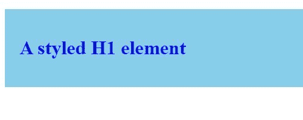
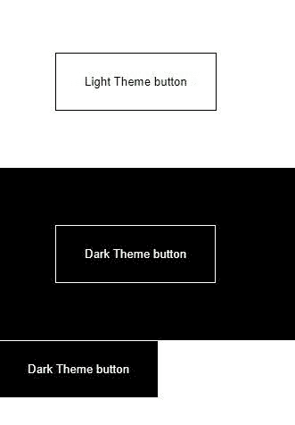

# 在 React 中使用样式组件

> 原文：<https://blog.logrocket.com/using-styled-components-in-react/>

随着现代基于组件的前端框架的出现，编写特定组件范围的 CSS 的需求增加了。与前端领域的大多数问题一样，各种各样的解决方案已经涌现出来。

最常见的解决方案是 [CSS-in-JS](https://blog.logrocket.com/tag/css-in-js/) ，这种模式涉及用 JavaScript 编写组件和应用程序样式(CSS)。现在有很多 CSS-in-JS 库，但是可能最流行和持久的一个——也是这篇文章的重点——是样式化组件。

Styled-components 是一个 CSS-in-JS 库，它极大地改善了现代前端开发人员的开发体验，同时提供了近乎完美的用户体验。除了让开发人员能够编写组件范围的 CSS 之外，styled-components 还有许多其他好处，包括:

*   自动供应商前缀
*   每个样式组件的唯一类名
*   更容易维护样式——开发人员可以删除或修改样式，而不会影响其他组件

现在我们已经正确地介绍了样式组件库，让我们来看看一个基本的用例，它涉及到使用样式 API。

## API:一切开始的地方

`styled` API 允许我们创建一个`StyledComponent`——一个有风格的组件，顾名思义——通过使用一个常规的 HTML 元素或另一个`StyledComponent`作为基础。

我们来看看第一种方法。如果我们想将一个样式化的`div`元素和一个样式化的`<h1>`元素制作成 React 组件，我们可以简单地编写:

```
import React from "react";
import styled from "styled-components";
const StyledDiv = styled.div`
  padding: 1.5rem;
  background-color: skyblue;
`
const StyledH1 = styled.h1`
  color: blue;
`

```

这样，我们就有了两个 React 组件，现在可以用作常规组件:

```
function App() {
  return (
      <StyledDiv>
        <StyledH1>A styled H1 element</StyledH1>
      </StyledDiv>
  );

```

浏览器中的结果应该如下所示:



这就是为我们的组件设计样式是多么容易！

> **注意**:你可能已经注意到了`styled` API 使用了反斜杠(")。这是 ES6 中的一个特性，叫做[标记模板文字](https://wesbos.com/tagged-template-literals)；这和调用函数是一样的。

正如我前面提到的，我们也可以通过使用其他的`StyledComponent`作为基础来创建一个新的`StyledComponent`。因此，如果我们想创建另一个`StyledComponent`，它拥有`<StyledDiv>`的所有样式属性，但边框更圆，我们可以这样做:

```
const StyledRoundedDiv = styled(StyledDiv)`
  border-radius: 30px;
`

```

所以现在`<StyledRoundedDiv>`继承了`<StyledDiv>`的所有风格，但是用自己的风格来调整`border-radius`属性。有了这个特性，我们可以创建不同的组件，这些组件都从单个基础组件继承样式。

`styled` API 还允许我们通过使用 JavaScript 样式化对象来创建`StyledComponent`(在 JSX 很常用)。如文档中所述，“当您拥有现有的样式对象并希望逐渐转移到样式化组件时，这尤其有用。”

如果我们要使用样式对象重新创建我们的`StyledDiv`组件，我们的代码将如下所示:

```
const StyledDiv = styled.div({
  padding: "1.5rem",
  backgroundColor: "skyblue"
})

```

## 使用 React 道具的动态样式

styled-components 的另一个强大特性是它能够使用 props 改变组件的样式。为了更好地说明这个概念，我们来看看 [Material-UI React 库](https://blog.logrocket.com/the-definitive-guide-to-react-material-d730c8a3e8ba/)。我们有一个接受不同道具的`<Button>`组件，但是我们将只关注`variant`和`color`道具。

有了`variant`属性，我们可以决定我们是想要按钮被勾勒出来，还是仅仅用`color`属性中指定的颜色填充。使用`color`属性，我们可以指定轮廓的颜色或者按钮的颜色，这取决于我们传递给`variant`属性的值。

如果我们要使用样式化组件实现这样一个组件，我们的代码可能看起来很像这样:

```
const Button = styled.button`
  border-radius: 4px;
  padding: 6px 16px;
  min-width: 64px;
  text-transform: uppercase;
  font-weight: 500;
  font-size: 0.875rem;
  letter-spacing: 0.02857em;
  line-height: 1.75;
  font-family: "Roboto", "Helvetica", "Arial", sans-serif;
  background-color: ${(props) => backgroundColor(props)};
  ${(props) => colorAndBorder(props)}
`;
const colorToValue = {
  primary: "#1976d2",
  secondary: "rgb(220, 0, 78)",
};
const colorAndBorder = (props) => {
  var finalColor = "white";
  if (props.variant == "outlined") {
    if (colorToValue[props.color]) {
      finalColor = colorToValue[props.color];
    } else {
      finalColor = "black";
    }
  } else if (props.variant == "contained") {
    if (props.color) {
      finalColor = "white";
    } else {
      finalColor = "black";
    }
  }
  return css`
    color: ${finalColor};
    border: ${(prop) =>
      props.variant == "outlined" ? "1px solid " + finalColor : "none"};
  `;
};
const backgroundColor = (props) => {
  if (props.variant == "outlined") {
    return "white";
  } else if (props.variant == "contained") {
    if (props.color) {
      let color = colorToValue[props.color];
      if (color) {
        return color;
      } else {
        return "#e0e0e0";
      }
    } else {
      return "#e0e0e0";
    }
  }
};

```

从上面的代码块中，你可以看到我为`Button`组件设置了基本样式，为`background-color`、`color`和`border`属性设置了动态样式，这取决于道具。

由于`styled`和`css`API 使用标记的模板文字，我们可以将 JavaScript(使用字符串插值)“注入”到我们的 CSS 中，以动态样式化组件，我们使用了两个自定义函数:`backgroundColor`和`colorAndBorder`。

`backgroundColor`接受`StyledComponent`的道具，并以字符串形式返回按钮的合适背景色。`Button`组件样式中的外部函数现在可以使用该字符串来设置按钮的样式。

然而，对于`color`和`border`属性，我们使用了一个函数，它返回一个我们可以直接在`Button`的样式字符串中使用的值，而不仅仅是一个由外部函数使用的字符串。这就是`css`助手函数的用武之地。

`css`辅助函数生成一个可以直接在模板文本样式中使用的值，特别是当传递给`css`函数的模板文本包含[字符串插值](https://dmitripavlutin.com/string-interpolation-in-javascript/#:~:text=String%20interpolation%20is%20replacing%20placeholders,%24%7Bexpression%7D%20as%20a%20placeholder.)时。

我们现在可以像这样使用我们的`Button`组件:

```
function App() {
  return (
    <>
      <Button variant="contained" color="primary">
        Primary Contained
      </Button>

      <Button variant="outlined" color="secondary">
       Secondary Outlined
      </Button>

      <Button variant="contained">
       Default contained
      </Button>
    </>
  );
}

```

### 使用`attrs`构造函数的其他样式方法

styled-components 还允许使用`attrs`方法向组件添加额外的属性或 HTML 属性。使用`attrs`，我们可以定义静态属性，比如`<input>`元素的类型，以及动态属性。下面是一个正在使用的`attrs`方法的例子:

```
const Link = styled.a.attrs((props) => ({
  href: props.$to,
}))`
  text-decoration: none;
  color: #000;
  border: 1px solid #000;
  padding: 1rem 1.5rem;
  border-radius: 5px;
`;

function App() {
  return (
    <>
      <Link $to="https://blog.logrocket.com">Test link</Link>
    </>
  );
}

```

在上面的代码中，我们给我们的`<Link>`组件附加了一个`href`属性，它的底层 HTML 元素是一个锚元素。传递给`href`元素的值是从我们的`<Link>`组件的瞬态属性`$to`接收的。

瞬态属性是样式化组件中的一个特性，它允许我们使用不会出现在 DOM 中的属性。因此，如果您检查我们的`Link`组件，您会注意到它被简单地呈现为:

```
<a href="https://blog.logrocket.com" class="sc-bdfBwQ geNjDe">Test link</a>

```

## 使用样式化组件对 React 应用程序进行主题化

styled-components 还通过使用一个`ThemeProvider`组件来支持主题化。我们可以传递一个`theme`道具给`<ThemeProvider>`，这个`theme`会作为道具传递给`<ThemeProvider>`的所有孩子。

我们现在可以选择基于`theme`属性的值动态地设计这些子组件的样式。这里有一个简单的例子来说明这是如何工作的:

```
const lightTheme = {
  main: "#fff",
};
const darkTheme = {
  main: "#000",
};
const invertColor = (props) => {
  if (props.theme.main == "#000"){
    return "#fff"
  } else {
    return "#000"
  }
}
const Div = styled.div`
  padding: 4rem;
  background-color: ${props => props.theme.main}
`
const Button = styled.button`
  padding: 1.5rem 2rem;
  color: ${props => invertColor(props)};
  border: 1px solid ${props => invertColor(props)};
  background-color: ${props => props.theme.main};
  transition: all 0.5s;
  &:hover{
    color: ${props => props.theme.main};
    background-color: ${props => invertColor(props)};
    border: 1px solid ${props => props.theme.main};
  }
`
/*Default props for the Button component in case it has no theme attached to its props
*/
Button.defaultProps = {
  theme: darkTheme
}
function App() {
  return (
    <>
    <ThemeProvider theme = {lightTheme}>
      <Div>
        <Button>Light Theme button</Button>
      </Div>
    </ThemeProvider>
    <ThemeProvider theme = {darkTheme}>
      <Div>
        <Button>Dark Theme button</Button>
      </Div>
      <Button>Dark Theme button</Button>
    </ThemeProvider>

    </>
  );
}

```

浏览器中上述代码块的结果应该是:



从代码中可以看出，有两个对象，`lightTheme`和`darkTheme`，分别代表浅色和深色主题的原色。

还有一个叫`invertColor`的函数，它只是简单的接受道具，并返回道具所附带的主题的相反原色。使用主题对象和`invertColor`函数，我们能够创建一个明暗主题，并相应地设计我们的组件。

还要注意，我们在`<Button>`组件的模板文本中使用了&符号(`&`);它的用法类似于你在 CSS 预处理器如 SCSS 中发现的。这个符号仅仅代表我们正在设计样式的组件，所以它可以用来设计组件的 CSS 伪元素或类的样式，就像我们所做的那样。

## 动画功能

应该的是，styled-components 也通过`keyframes`辅助函数支持 CSS 动画。这个函数利用模板文字来定义动画的 CSS，并返回一个值，这个值现在可以被插入到`css`辅助函数中或者与`styled` API 一起使用。

下面是文档中的一个简单示例，展示了我们代码中的`keyframes`函数:

```
import styled, { keyframes } from 'styled-components'

const fadeIn = keyframes`
  0% {
    opacity: 0;
  }
  100% {
    opacity: 1;
  }
`

const FadeInButton = styled.button`
  animation: 1s ${fadeIn} ease-out;
` 

```

## 结论

我们终于讨论了我认为是样式组件库中最重要和最常用的部分。你可以在综合文档[这里](https://styled-components.com/docs/basics)了解更多关于这个库的信息。

## 使用 LogRocket 消除传统反应错误报告的噪音

[LogRocket](https://lp.logrocket.com/blg/react-signup-issue-free)

是一款 React analytics 解决方案，可保护您免受数百个误报错误警报的影响，只针对少数真正重要的项目。LogRocket 告诉您 React 应用程序中实际影响用户的最具影响力的 bug 和 UX 问题。

[ ](https://lp.logrocket.com/blg/react-signup-general) [  ](https://lp.logrocket.com/blg/react-signup-general) [LogRocket](https://lp.logrocket.com/blg/react-signup-issue-free)

自动聚合客户端错误、反应错误边界、还原状态、缓慢的组件加载时间、JS 异常、前端性能指标和用户交互。然后，LogRocket 使用机器学习来通知您影响大多数用户的最具影响力的问题，并提供您修复它所需的上下文。

关注重要的 React bug—[今天就试试 LogRocket】。](https://lp.logrocket.com/blg/react-signup-issue-free)