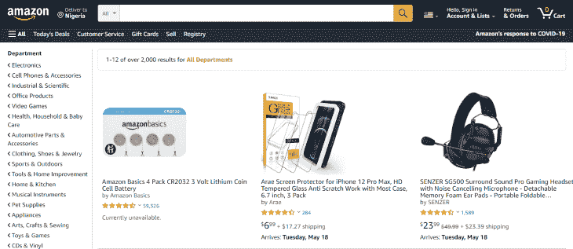
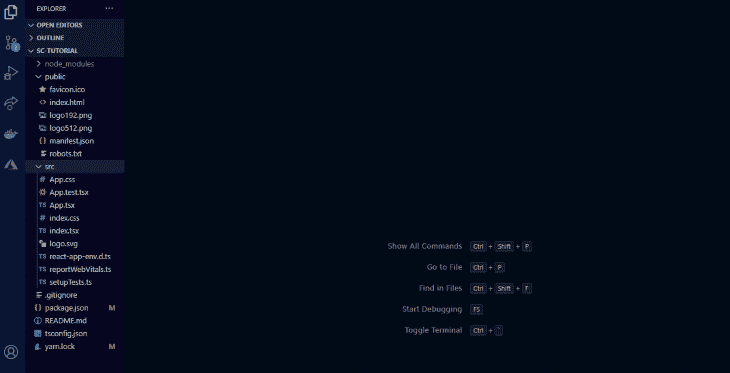
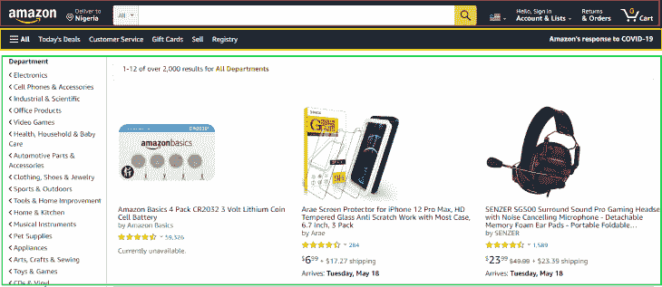
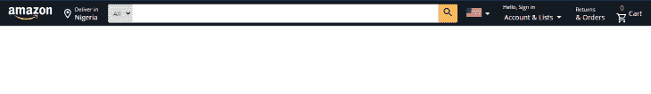
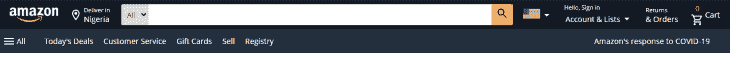
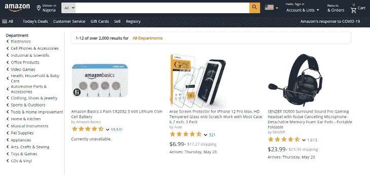

# 在 TypeScript 中使用样式化组件:示例教程

> 原文：<https://blog.logrocket.com/using-styled-components-in-typescript-a-tutorial-with-examples/>

样式是构建 web 和移动应用程序的重要部分。一个应用程序要想让你的用户看起来像样，就需要设计风格。CSS 是我们最常用来美化应用程序的东西。

但是，尽管我们热爱 CSS，还是有一些恼人的问题需要处理，比如类名重复、拼写错误和未知的类名、不确定类名是否合适等等。在拥有大量代码库的项目中，使用普通 CSS 会变得非常耗时和累人。这就是样式化组件的用武之地。

在本教程中，我们将向您展示如何使用 [styled-components](https://styled-components.com/docs/api#typescript) 构建和样式化一个 TypeScript 应用程序。

为了用一个实际的例子来演示，我们将使用 styled-components 和 TypeScript 来创建一个类似于亚马逊的电子商务页面。成品看起来会像这样:



你可以在我的 [GitHub 库](https://github.com/Iamhafsah/amazon-page/tree/main/src/components/assets)中访问这个演示所需的图片。在本教程结束时，您应该能够使用样式化组件来设计自己的 TypeScript 项目的样式。

## 什么是样式组件？

[Styled-components](https://styled-components.com/) 是一个 [CSS-in-JS](https://blog.logrocket.com/5-things-you-can-do-in-css-in-js-that-you-didnt-know-about-c422fb67ceb6/) 库，它使你能够编写常规的 CSS 并将其附加到 JavaScript 组件上。使用样式化组件，您可以使用已经熟悉的 CSS，而不必学习新的样式结构。

styled-components 让您可以设计您的工作，而不必担心类名是否冲突或者它们是否适合给定的用例。这也有助于调试，因为一旦您发现哪个组件有问题，您就知道在哪里可以找到它的样式。

## 设置 TypeScript 项目

我们将使用`create-react-app`为我们的项目生成一个模板。由于这是一个 TypeScript 项目，我们将在命令中添加`--template typescript`。

打开终端，键入以下内容，然后按 enter 键:

```
 npx create-react-app --template typescript

```

创建项目后，通过键入以下命令进入项目目录:

```
cd amazon-clone

```

在终端中键入`code .`,在代码编辑器中打开项目。或者，你可以通过右击文件夹并选择**用代码**打开它，从你的文件管理器打开它。

我们需要安装一些依赖项，因为 create-react-app 没有 styled-components。

运行以下命令:

```
yarn add styled-components

```

安装完成后，运行以下命令:

```
yarn add -D @types/styled-components 

```

这将安装 TypeScript 的样式化组件类型作为开发依赖项。

我们还将使用[材质图标](https://material-ui.com/components/material-icons/)，所以让我们安装`[material-ui package](https://www.npmjs.com/package/@material-ui/core)`。键入以下内容，然后按 enter 键:

```
yarn add @material-ui/icons @material-ui/core

```

有一个针对 VS 代码的样式化组件扩展，它使我们看起来像是在键入实际的 CSS，尽管它是一个 TypeScript 文件。它叫做`[vs-code-styled-components](https://marketplace.visualstudio.com/items?itemName=jpoissonnier.vscode-styled-components)`，如果你还没有安装它，我建议你在继续之前安装它。

您的文件夹现在应该是这样的:



现在是时候清理我们的项目了。我们不需要 Create React App 生成的所有文件，所以让我们删除多余的文件:

*   在公共文件夹中，删除徽标文件
*   在`index.html`文件中，将标题更改为您想要的，并删除从元描述到标题标签开始处的所有信息
*   在`src`文件夹中，删除除了`App.tsx`和`index.tsx`之外的所有文件
*   在`index.tsx`中，删除导入`index.css`和`reportWebVitals`的行。此外，删除所有与网络生命相关的行
*   删除`App.tsx`的所有内容，除了我们导入 React 和导出 app 的地方

有了这种方式，让我们开始建设。

## 创建项目结构

首先，让我们规划页面的布局:



我们的页面由三个主要部分组成:导航栏、菜单栏和主体。我们将从上到下开始。

在`App.tsx`中，创建一个 React 功能组件。它应该是这样的:

```
 import React from 'react';

 const App:React.FC = ()=> (
   <> </>
 )

 export default App;

```

在您的`src`文件夹中，创建一个 styles 文件夹。你可以给它起任何你喜欢的名字；我给我的取名`styles`。

在 styles 文件夹中，创建一个文件并将其命名为`global.ts`。这个文件将包含我们的全局样式。全局样式是页面中所有元素使用的样式。

在`global.ts`中，我们导入`createGlobalStyle`并创建全局样式。您的`global.ts`文件应该是这样的:

```
 import {createGlobalStyle} from "styled-components"

 export default createGlobalStyle`
    *{
        margin: 0;
        padding: 0;
        outline:0;
        box-sizing:border-box;
        font-family: 'Open Sans', sans-serif; 
    }
    #root{
        margin:0 auto;
    }
 `

```

这些样式确保页面上没有边距或填充，除非在明确声明的地方。

在`src`文件夹中，我们将为组件创建一个文件夹。在 components 文件夹中，我们将再创建三个文件夹，页面的每个部分一个。我们将为我们的资产再创建一个文件夹。所有的图像都应该存储在这个文件夹中。

在 navbar 文件夹中，创建两个文件:`index.tsx`和`styles.tsx`。在`index.tsx`中，导入以下项目:

```
import React from 'react'
import {
    Container, 
    Logo, 
    Flag, 
    Text, 
    Wrapper, 
    Searchbox,
    Select,
    SearchIconWrapper
} from "./styles"
import { ShoppingCartOutlined, SearchOutlined, ArrowDropDown, RoomOutlined } from '@material-ui/icons';
import logo from "../assets/logo.png"
import flag from "../assets/flag.png"

```

导入 React 很重要，因为我们需要它来创建我们的函数。

在第二行，我们从 styles 文件中导入了一些组件(我们很快就会看到它们做了什么)。然后，我们从材质图标中导入我们的图标。最后，我们从资产文件夹中导入图像。

在索引文件夹中，让我们创建一个功能组件，并将容器组件放入其中:

```
import React from 'react';

const App:React.FC = ()=> (
  <>
    <Container></Container>
  </>
)

export default App;

```

如果您不习惯使用样式化组件，这可能看起来很奇怪。

容器组件表示我们将使用的其他组件的整体包装。当不使用 styled-components 时，它的用法与`div`相同。当我们从样式开始时，您会发现容器组件实际上是一个`div`组件。

让我们看看样式文件是什么样子的:

```
import styled from "styled-components"

export const Container = styled.div`
    display: flex;
    justify-content:space-evenly;
    align-items: center;
    color: white;
    background-color: #131A22;
`

```

在顶部，我们从`styled-components`导入了`styled`。`styled`让我们可以选择使用任何 HTML 元素，比如`div`、`section`、`span`、`inputs`等。我们可以接触到他们所有人。

* * *

### 更多来自 LogRocket 的精彩文章:

* * *

对于我们的容器组件，我们使用了`div`。在元素名称之后，我们添加了`template literals`，它充当组件样式的包装器。然后，我们在模板文本中编写 CSS 样式。

注意到我写的是普通的 CSS 了吗？那是因为我前面提到的扩展。它有助于颜色和自动完成。

这些组件是可重用的，它们使每个组件与其风格的关联变得更加容易。这是因为每个组件的主体中都已经有了自己的风格，所以当你需要调试的时候，你马上就知道去哪里检查了。

## 助手组件

让我们再创建一个文件夹:一个助手文件夹。在 helper 文件夹中，我们将创建两个文件:`PageText.tsx`和`ItemWrapper.tsx`。

这一页上有许多不同大小和颜色的文字。为了避免重复，我们需要创建 TypeScript 组件并传递一些 CSS 属性作为道具。这将使我们能够重用组件，并根据需要修改它们，而无需在样式文件中编写新的代码行。

`PageText`组件将用于页面上的所有文本。`ItemWrapper`组件将被用作包装页面上各种元素的容器。

在`PageText.tsx`中，插入以下内容:

```
import React from 'react'

interface Props{
    className?: string;
    fontSize?: any;
    color?: string;
}
export const PageText:React.FC <Props> = ({className, children}) => {
    return (
       <span className={className}>{children}</span>
    )
}

```

注意到组件中传递的道具了吗？这些都是使用组件时可以接受的道具。如果您不包含`className`道具，那么您试图在组件主体中声明的任何样式都不会生效。使用它时，您可以移除`className`道具，看看它会抛出什么错误。儿童道具代表我们将在组件中编写或使用的任何项目。

在`ItemWrapper.tsx`中，插入以下代码行:

```
import React from 'react'

interface Props{
    className?: string;
    display?: string;
    flexDirection?: string;
    alignItems?: string;
    maxWidth?: string;
    margin?: string;
}
export const PageItemWrapper:React.FC <Props> = ({className, children}) => {
    return (
       <div className={className}>{children}</div>
    )
}

```

## 设计导航栏的样式

现在我们已经完成了助手，让我们创建我们的导航条。示例页面的导航栏以 Amazon 徽标开始。我们已经在索引文件中导入了它，所以让我们为它创建一个组件，并对它进行样式化:

```
import{ PageText as NavText} from "../helpers/PageText"
import{ PageItemWrapper as NavItemWrapper} from "../helpers/ItemWrapper"

export const Logo = styled.img`
    width: 6em;
    border:1px solid #131A22;
    padding: .2em .1em;
    cursor:pointer;

    &:hover{
        border:1px solid #ffffff;
        border-radius: .2em;
    }
`

```

我们为宽度、边框、填充和光标行为创建了样式。我们还添加了额外的风格，当标志悬停。不像在普通 CSS 中，我们使用类似于`a:hover`的东西，这里我们使用`&`符号来表示我们正在为元素悬停时创建样式。

在为`::before`、`::after`和其他伪元素创建样式时，使用相同的过程。样式化组件最大的好处之一就是你可以在一个地方编写所有的样式。

现在我们已经完成了徽标的设计，让我们来看看导航栏的其他部分。

在`styles.tsx`中，添加以下内容:

```
import{ PageText as NavText} from "../helpers/PageText"

export const Text = styled(NavText)`
    color:${(props)=>props.color ? props.color :"#ffffff" };
    font-size: ${(props)=>props.fontSize ? props.fontSize  : ".9em"
};    
`

```

这里，我们以另一种方式使用了样式化组件。我们将`PageText`作为`NavText`从助手文件夹中导入。我们用`NavText`代替元素的名字。

请注意，当使用现有组件时，我们没有包括点。我们没有写`styled.NavText`，而是写了`styled(NavText)`。我们还为组件创建了默认样式。

组件内部的代码行意味着，如果在使用组件时指定了一个`color`或`font-size`属性，那么`color`和`font-size`等于指定的属性，否则，文本组件使用其中指定的默认值。

```
import{ PageItemWrapper as NavItemWrapper} from "../helpers/ItemWrapper"

export const Wrapper = styled(NavItemWrapper)`
    display: flex;
    flex-direction: ${(props)=>props.flexDirection ?  props.flexDirection  : "column"};
    align-items:  ${(props)=>props.alignItems ? props.alignItems  : "flex-start"};
    padding: .1em;
    cursor:pointer;
    border:1px solid #131A22;

    &:hover{
        border:1px solid #ffffff;
        border-radius: .2em;
    }
     @media(max-width:850px){
        display: none;
    }

`

```

现在让我们在页面中使用它们。在`index.tsx`中，添加以下代码行:

```
const Navbar:React.FC = () => {
    return (
        <>
            <Container>
                    <Logo src={logo}/>

                    <Wrapper flexDirection="row"
                    alignItems="center">
                        <RoomOutlined/>

                        <Wrapper >
                        <Text fontSize=".7em">Deliver in 
                        </Text>
                        <Text >Nigeria</Text>
                        </Wrapper>
                    </Wrapper>

                 {/* the search button */}
                    <Select>
                    <option value="All">All</option>
                    </Select>
                    <Searchbox/>
                    <SearchIconWrapper>
                        <SearchOutlined/>
                    </SearchIconWrapper>

                    {/* flag image */}
                    <Wrapper flexDirection="row"
                    alignItems="flex-start"
                    >
                        <Flag src={flag}/>
                        <ArrowDropDown/>
                    </Wrapper>

                    <Wrapper>
                        <Text fontSize=".7em">Hello, Sign   in</Text>
                        <Wrapper flexDirection="row" alignItems="center">
                            <Text>Account & Lists </Text>
                            <ArrowDropDown/>
                        </Wrapper>
                    </Wrapper>

                    <Wrapper>
                        <Text fontSize=".7em">Returns</Text>
                        <Text >& Orders</Text>
                    </Wrapper>

                    <Wrapper flexDirection="row"
                    alignItems="center">
                        <Wrapper alignItems="center">
                        <Text color="#ff9900">0</Text>
                        <ShoppingCartOutlined/>
                        </Wrapper>

                        <Text>Cart</Text>
                    </Wrapper>

              </Container>
        </>
    )
}

export default Navbar

```

代码很多，但不要不知所措。我们一起经历吧。

我们使用了我们的`Wrapper`和`NavText`组件，您可以看到如何根据需要修改它们。我们还使用了在本教程开始时导入的图标。这里唯一的新东西是`Select`、`Searchbox`、`SearchIconWrapper`和`Flag`组件。让我们解释一下它们是什么，以及我们是如何创建它们的。

在页面的导航栏中，有一个搜索框，它的两侧有两个元素。让我们创造它们。

在`styles.tsx`中:

```
export const Searchbox = styled.input`
    background-color: #ffffff;
    padding: .78em;
    width: 47%;
    border: none;

    @media(max-width:850px){
       border-radius: .2em;
       margin: .3em 0;
    }

`
export const Select = styled.select`
    background-color:#ddd;
    margin-right: -1.2em;
    padding: .72em .5em;
    border-radius: .2em 0em 0em .2em;
    border: none;
    cursor: pointer;

@media(max-width:850px){
        display: none;
    }

` 
export const SearchIconWrapper = styled.span`
    background-color:#fabd60;
    color: #131A22;
    margin-left: -1em;
    border-radius: 0em .2em .2em 0em ;
    padding: .32em .5em;
    cursor: pointer;
    transition: all 250ms ease;

    &:hover{
        background-color:#ff9900;
    }

     @media(max-width:850px){
        display: none;
    }

` 
export const Flag = styled.img`
    width:2em;
`

```

我们为`Searchbox`组件使用了一个`input`标签，为`Select`组件使用了一个`select`标签，为`Flag`组件使用了一个`img`标签，为`SearchIconWrapper`组件使用了一个`span`标签。我们还为`SearchIconWrapper`添加了悬停效果，以及新组件的媒体查询。

导航条到此为止。现在你的页面应该是这样的:



现在，让我们建立菜单栏。

## 构建菜单栏

在我们之前创建的`Menubar`文件夹中，创建一个`index.tsx`文件和一个`styles.tsx`文件。

在`index.tsx`中，创建一个功能组件，并在其中添加以下行:

```
import React from 'react'
import {Container, Wrapper, Text, LeftText} from "./styles"
import {Menu} from '@material-ui/icons';

const Menubar:React.FC = () => {
    return (
        <></>
    )
}

export default Menubar

```

我们从`styles.tsx`中导入了一些组件，从材质图标中导入了菜单图标。就像在我们的`Navbar`文件夹中一样，我们将从助手文件夹中导入包装器和文本组件，并在我们的 `styles.tsx`文件中使用它:

```
import styled from "styled-components"
import{ PageText as MenuText} from "../helpers/PageText"
import{ PageItemWrapper as MenuItemWrapper} from "../helpers/ItemWrapper"

 export const Container = styled.div`
   display: flex;
   justify-content:space-between;
   color: white;
   padding: .3em;
   background-color: #232f3e;
`

export const Text = styled(MenuText)`
    color:${(props)=>props.color ? props.color :"#ffffff" };
    font-size: ${(props)=>props.fontSize ? props.fontSize  : ".9em"};
    margin-right: 1em;
    border:1px solid #232f3e;
    padding: .5em .1em;
    cursor:pointer;

    &:hover{
        border:1px solid #ffffff;
        border-radius: .2em;
    }
    @media(max-width:850px){
        display: none;
    }

`
export const LeftText = styled(Text)`
    @media(max-width:850px){
        display: block;
    }
`

export const Wrapper = styled(MenuItemWrapper)`
    display: flex;
    flex-direction: row;
    align-items: center;
    margin-right: 1em;
`

```

我们设计了我们的`Container`、`Wrapper`和`Text`组件。我们还定制了`Text`组件的颜色和字体大小。让我们在`index.tsx`文件中使用它们:

```
const Menubar:React.FC = () => {
    return (
        <Container>

            <Wrapper>
                <Wrapper>
                        <Menu/>
                        <Text>All</Text>
                </Wrapper>

                <Wrapper>
                    <Text>Today's Deals</Text>
                    <Text>Customer Service</Text>
                    <Text>Gift Cards</Text>
                    <Text>Sell</Text>
                    <Text>Registry</Text>
                </Wrapper>
            </Wrapper>

            <Wrapper>
                <LeftText>Amazon's response to COVID-19</LeftText>
            </Wrapper>

        </Container>
    )
}

export default Menubar

```

我们的菜单栏应该是这样的:



现在让我们构建我们的页面主体。

## 布局页面正文

在页面的左侧，有一个下拉菜单，显示各个部门的名称。我们在页面上还有产品细节。让我们在`PageBody`文件夹中创建一个新文件来存储这些信息。

在`PageInfo.ts`中:

```
import battery from "../assets/cell-battery.jpg"
import headset from "../assets/headset.jpg"
import screen from "../assets/screen-protector.jpg"

export  const departmentList = [
    "Electronics",
    "Cell Phones & Accessories",
    "Industrial & Scientific",
   " Office Products",
   " Video Games",
   " Health, Household & Baby Care",
   " Automotive Parts & Accessories",
   " Clothing, Shoes & Jewelry",
    "Sports & Outdoors",
   " Tools & Home Improvement",
    "Home & Kitchen",
    "Musical Instruments",
    "Pet Supplies",
    "Appliances",
    "Arts, Crafts & Sewing",
   " Toys & Games",
   " CDs & Vinyl"
]

export const productDetails=[
    {
        name:"Amazon Basics 4 Pack CR2032 3 Volt Lithium Coin Cell Battery",
        by: "by Amazon Basics",
        starcount: "59,531",
        price: "",
        shipping: "",
        available: "Currently unavailable.",
        src: battery
    },
    {
        name: "Arae Screen Protector for iPhone 12 Pro Max, HD Tempered Glass Anti Scratch Work with Most Case, 6.7 inch, 3 Pack",
        by: "by Arae",
        starcount: "321",
        price: "$6.99",
        shipping: " + $17.27 shipping",
        available: "Arrives: Thursday, May 20",
        src: screen
    },
    {
        name: "SENZER SG500 Surround Sound Pro Gaming Headset with Noise Cancelling Microphone - Detachable Memory Foam Ear Pads - Portable Foldable",
        by: "by SENZER",
        starcount: "1,613",
        price: "$23.99 ",
        shipping: " + $23.39 shipping",
        available: "Arrives: Thursday, May 20",
        src: headset
    }
]

```

在`PageInfo`文件中，我们有`departmentList`，它是一个部门名称数组，还有`productDetails`，一个包含产品信息的对象数组。在顶部，我们从资产文件夹中导入了产品图像。

让我们在`PageBody`文件夹中创建一些新文件。创建一个`index.tsx`文件和一个`styles.tsx`文件。在`index.tsx`中，添加以下内容:

```
import React from 'react'
import {
    Container, 
    LeftContainer, 
    RightContainer, 
    Wrapper, 
    Image, 
    Text, 
    Paragraph,
    ProductContainer,
    ImageContainer,
    SearchResultDiv,
    IconWrapper,
    BoldText
} from "./styles"
import {KeyboardArrowLeft, Star, StarHalf, KeyboardArrowDown} from '@material-ui/icons';
import {departmentList, productDetails} from "./PageInfo"

```

我们从样式文件中导入组件，从`PageInfo.ts`中导入图标和页面信息。

现在让我们创建我们的组件并对它们进行样式化。

在您的 `styles.tsx`文件中，添加以下代码行:

```
import styled from "styled-components"
import {PageText} from "./PageText"
import {PageItemWrapper} from "./PageItemWrapper"

export const Container = styled.div`
    display: flex;
    padding: 1em;
`

export const LeftContainer = styled.aside`
    height:80vh;
    width: 18vw;
    border-right: 2px solid #ddd;

    @media(max-width:650px){
        display: none
   }

`

export const RightContainer = styled.section`
    height:80vh;
    width: 82vw;
    display: flex;
    flex-direction: column;
    margin-left: 1.5em;

`
export const Image = styled.img`
    width: 13em;
`
export const Text = styled(PageText)`
    color:${(props)=>props.color ? props.color :"#131A22" };
    font-size:${(props)=>props.fontSize ? props.fontSize :".9em" };
`
export const BoldText = styled(Text)`
    font-weight: bold;
    padding: .4em;
`

export const Paragraph = styled.p`
    font-size:.9em;
    display: flex;
    align-items: center;
    padding-bottom: .1em;
`
export const SearchResultDiv = styled.div`
    border: 1px solid #ddd;
    padding: .6em;
    width: 95%;
    border-radius: 4px;
`
export const ProductContainer = styled.div`
    display: grid;
    grid-template-columns: repeat(auto-fit, 22em);
    margin-top: 2em;

    @media(max-width:915px){
        grid-template-columns: repeat(auto-fit, 15em);
        align-items: center;
        justify-content: center;
    }

`
export const ImageContainer = styled.div`
    height: 14em;
    display: flex;
    align-items: center;
`

export const Wrapper = styled(PageItemWrapper)`
    display: flex;
    margin-right: 1em;
    flex-direction: ${(props)=>props.flexDirection ? props.flexDirection  : "row"};
    align-items:  ${(props)=>props.alignItems ? props.alignItems  : "left"};
    margin:  ${(props)=>props.margin ? props.margin : ""};
`

export const IconWrapper = styled.div`
    color: #ff9900;
`

```

在上面的代码中，我们为页面主体创建了一个容器，然后将页面分成两个部分。左边部分包含部门列表，右边部分包含产品及其信息。

然后，我们为产品图像创建了一个组件，并使用了我们导入的助手组件。

如果你看一下`BoldText`组件，你会注意到它是`PageText`组件的扩展，其中有一些新的样式。我们用它来创建比页面文本更粗的文本。使用样式化组件，您可以扩展另一个组件。这就像复制组件及其所有样式，然后向其添加额外的样式。

`SearchResultDiv`组件是产品图片上方的长栏，包含搜索结果的详细信息。

我们还创建了一个包含我们的产品及其信息的`ProductContainer`组件，然后是产品图片的图片容器。

样式文件中的最后一个组件是星形图标的包装器。

如果你愿意，你可以花些时间研究这些风格，如果你喜欢的话，了解每一行的作用。

现在，让我们使用索引文件中的组件:

```
const Menubar:React.FC = () => {
    return (
        <Container>
            <LeftContainer>
                <BoldText>Department</BoldText >
                {departmentList.map(item =>(
                    <Paragraph> <KeyboardArrowLeft/>{item}</Paragraph>
                ))}
            </LeftContainer>
            <RightContainer>
                <SearchResultDiv> 
                    <BoldText>1-12 of over 2,000 results for
                    </BoldText>
                    <BoldText color="#c45500"> All Departments
                    </BoldText> 
                </SearchResultDiv>

                <ProductContainer>
                {productDetails.map(item =>(
                    <Wrapper 
                    flexDirection="column"
                    >
                        <ImageContainer>
                            <Image src={item.src}/>
                        </ImageContainer>
                        <Text>{item.name}</Text>
                        <Text fontSize=".8em" color="grey" >{item.by}</Text>

                        {/* stars */}
                        <Wrapper 
                        margin=".3em 0 0 0"
                        alignItems="center"
                        >
                            <IconWrapper>
                                <Star/>
                                <Star/>
                                <Star/>
                                <Star/>
                                <StarHalf/>
                            </IconWrapper>

                            <KeyboardArrowDown/>
                            <Text color="blue">{item.starcount}</Text>
                        </Wrapper>

                        <Wrapper 
                        alignItems="center"
                        margin=".3em 0 .3em 0"
                        >
                            <Text fontSize="1.3em">{item.price }</Text>
                            <Text color="grey">{ item.shipping}</Text>
                        </Wrapper>
                        <Text>{item.available}</Text>

                    </Wrapper>
                ))}
                </ProductContainer>
            </RightContainer>
        </Container>
    )
}

export default Menubar

```

上面，我们使用了自己创建的组件来构建页面主体，并对它们进行了定制，以适应它们应该出现的位置。

我们使用了从`pageInfo`文件导入的产品细节。在`LeftContainer`组件中，我们通过`departmentList`数组进行映射。在`ProductContainer`组件中，我们通过`productDetails`数组进行映射。通过映射数组而不是一个接一个地编写细节，使我们能够编写更干净、重复性更少的代码。

这就是页面正文的全部内容。我们的页面现在应该是这样的:



## 结论

恭喜你！现在，您已经具备了用样式化组件来设计自己的 TypeScript 项目的所有基础知识和技能。你可以点击查看已完成的示例页面[。](https://amazon-page-clone.netlify.app/)

要了解更多关于样式化组件的信息，你可以查看官方文档。

## [LogRocket](https://lp.logrocket.com/blg/typescript-signup) :全面了解您的网络和移动应用

[](https://lp.logrocket.com/blg/typescript-signup)

LogRocket 是一个前端应用程序监控解决方案，可以让您回放问题，就像问题发生在您自己的浏览器中一样。LogRocket 不需要猜测错误发生的原因，也不需要向用户询问截图和日志转储，而是让您重放会话以快速了解哪里出错了。它可以与任何应用程序完美配合，不管是什么框架，并且有插件可以记录来自 Redux、Vuex 和@ngrx/store 的额外上下文。

除了记录 Redux 操作和状态，LogRocket 还记录控制台日志、JavaScript 错误、堆栈跟踪、带有头+正文的网络请求/响应、浏览器元数据和自定义日志。它还使用 DOM 来记录页面上的 HTML 和 CSS，甚至为最复杂的单页面和移动应用程序重新创建像素级完美视频。

[Try it for free](https://lp.logrocket.com/blg/typescript-signup)

.