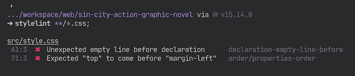
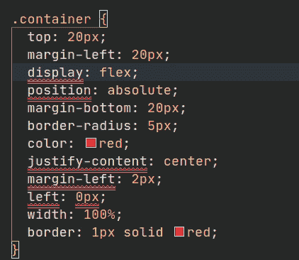
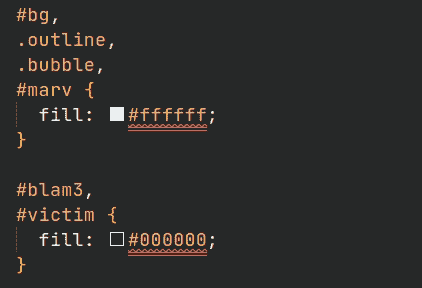
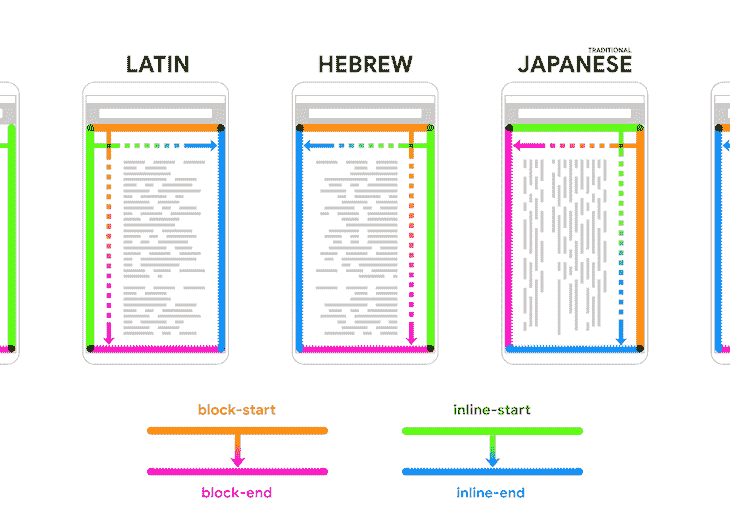
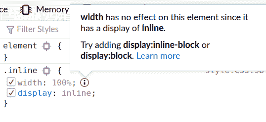
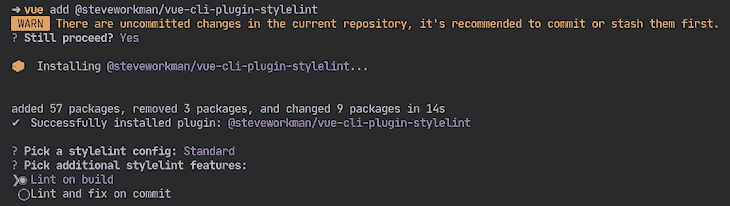

# 使用 Stylelint 提升你的 CSS 林挺

> 原文：<https://blog.logrocket.com/using-stylelint-improve-lint-css-scss-sass/>

编写高质量的 CSS 是很棘手的。人们似乎对 CSS 比对其他技术更恼火，这就是为什么我很惊讶为什么对 CSS 使用像 [Stylelint](https://stylelint.io/) 这样的 [linter](https://www.testim.io/blog/what-is-a-linter-heres-a-definition-and-quick-start-guide/) 没有被更多地讨论。在进行过程中捕捉并修复错误，以及在编码时实施最佳实践，可以显著提高代码质量。

此外，虽然许多现代开发工具，如 [Vue CLI](https://cli.vuejs.org/) 和 [Create React App](https://github.com/facebook/create-react-app) 包括 [ESLint](https://eslint.org/) 作为其配置的一部分，以便您可以轻松地 lint JavaScript，但当涉及到林挺 CSS 时，您只能靠自己。

这篇文章并不是 Stylelint 的官方用户指南的替代品，该指南写得很好，可以满足你的大部分需求。本文旨在让您了解 Stylelint 可以为您做的一些高级事情的最新情况(这可能会让您大吃一惊！)并展示了如何将 Stylelint 集成到工作流中。

首先，这里有一个 Stylelint 的快速概述。

## 什么是 Stylelint？

如果你是 linters 新手，你可以阅读 Stylelint 作者写的关于林挺 CSS 的教程来了解完整的背景。

Stylelint 理解最新的 CSS 语法，并解析类似 CSS 的语法，如 s CSS、萨斯等。

Stylelint 可以从以下位置提取嵌入的样式:

*   超文本标记语言
*   降价
*   JS 中的 CSS 对象
*   模板文字

本质上，Stylelint 应该能够在任何地方解析任何形式的 CSS。与 ESLint 类似，它有内置的规则来捕捉错误，并可以自动修复其中的一些错误。它支持可共享的配置，并具有扩展功能的插件。它集成了[代码编辑器](https://stylelint.io/user-guide/integrations/editor)、[任务运行器](https://stylelint.io/user-guide/integrations/task-runner)和一些[打包器](https://github.com/webpack-contrib/stylelint-webpack-plugin)。

## 将 Stylelint 用于林挺

Stylelint 遵循与 ESLint 相似的约定。

首先，使用 [npm](https://docs.npmjs.com/about-npm/) 来安装 Stylelint，同时使用[Stylelint-config-standard](https://github.com/stylelint/stylelint-config-standard)来启用一组核心规则。Stylelint-config-standard 基于一些 CSS 样式指南中常见的常见样式约定，如[惯用 CSS 原则](https://github.com/necolas/idiomatic-css)和 Airbnb 的样式指南。

```
npm install --save-dev stylelint stylelint-config-standard

```

在项目的根目录下创建一个配置文件。可以命名为`.stylelintrc`或`.stylelintrc.json`:

```
{
  "extends": "stylelint-config-standard"
}

```

现在可以在命令行上运行 Stylelint 了。例如，要只针对项目中的 CSS 文件，运行`stylelint "**/*.css"`。为了自动修复错误，您可以添加`--fix`标志。



通读[标准规则](https://stylelint.io/user-guide/rules/list/)以更熟悉 Stylelint 是一个好主意。一些人主张从空白配置开始，只添加您需要的规则，而另一些人使用标准配置作为基础，并在获得更多经验后对其进行修改。

后者无疑是最快的开始方式。我认为一开始就关闭自动修复是个好主意，这样你就可以看到发生的常见错误并理解它们。一旦你有了一个好的理解，打开自动修复。当然是看你自己啦！

如果你想了解更多关于 Stylelint 的配置和一般用法，请查看官方用户指南。我现在将谈谈我在其他地方没有看到的内容。

## 使用 Stylelint 表演鲜为人知的新奇技巧

除了基本功能之外，Stylelint 还可以做一些您可能想不到但会喜欢的事情。如果您想要一个使用我将要讨论的大部分内容的示例配置，[您可以从我的 npm](https://www.npmjs.com/package/stylelint-config-roboleary) 安装我的配置。

### 自动排序属性以提高可读性

stylelint-order 插件可以按照你选择的顺序自动排序属性。这有助于你的 CSS 代码更容易浏览和理解。每次保存时对属性进行排序是很方便的，如下所示。



对于在项目中自动化这一点，我要提出一个警告，因为如果盲目地做，可能会破坏东西。这就是为什么更漂亮的[选择不把它作为一个功能](https://github.com/prettier/prettier/issues/1963#issuecomment-307147922)。在 Sass 中使用`@mixin`和`@include`是您需要小心的一个方面。因为属性包含在当前块之外，所以更改现有声明的顺序可能会更改该规则的计算样式。

字母排序并不是人们遵循的唯一排序模式。另外两个例子是:

1.  乔纳森·史努克的 [SMACSS](http://smacss.com/book/formatting#grouping)
2.  安东·科尔祖诺夫的[stylelint-semantic-groups](https://github.com/theKashey/stylelint-semantic-groups)

惯用 CSS 样式指南给出了一些关于何时使用的建议。

> 如果要对声明进行一致的排序，它们应该遵循一个简单的原则。
> 
> 较小的团队可能更喜欢将相关属性(例如，定位和箱式模型)聚集在一起。
> 
> 较大的团队可能更喜欢字母排序带来的简单性和易维护性。

组的例子有:定位属性(`position`、`top`、`bottom`、`left`、`right`、`float`、`display`)和盒模型属性(`width`、`height`、`margin`、`padding`)。

如果你想进一步了解这个话题，我推荐你阅读安东·科尔祖诺夫的文章:“[哈利·波特和 CSS 的顺序](https://dev.to/thekashey/happy-potter-and-the-order-of-css-5ec)”和埃里克·贝利的文章“[按字母顺序组织你的 CSS 声明](https://ericwbailey.design/writing/organize-your-css-declarations-alphabetically/)”。作者的观点截然不同！

我开始在我的一些个人项目中使用[stylelint-config-idiomatic-order](https://github.com/ream88/stylelint-config-idiomatic-order)配置。它将属性组织成几个不同的组，主要的组有:布局、显示和盒子模型。

该组织大致相当于这样的东西:

```
.wrapper{ 
  /* position */
  position: absolute; 
  top: 20px;
  left: 0;

  /* display */
  display: flex; 
  justify-content: center;

  /* box-model */
  width: 100%; 
  height: 100%; 
  margin-bottom: 20px;
  margin-left: 20px; 
  margin-left: 2px;

  color: red;

  /* groups family of props together */
  border: 1px solid red;
  border-radius: 5px; 
}

```

如果想要组之间的空行，需要调整与空行相关的内置规则，在之前用[声明-empty-line。添加下面的规则对我来说很有用。它有效地禁止将声明之间的空行报告为错误。](https://stylelint.io/user-guide/rules/list/declaration-empty-line-before/)

```
 "declaration-empty-line-before": [
      "always",
      {
        "ignore": [
          "after-comment",
          "after-declaration",
          "first-nested",
          "inside-single-line-block"
        ]
      }
    ]

```

### 提高可访问性

stylelint-a11y 插件有助于使可访问性成为开发过程中更重要的一部分。我觉得这很棒。可访问性应该是一个关键问题，不要留到以后。

该插件添加了这些规则:

⭐️:是推荐规则的标志，✒️:是可修正规则的标志。

### 规范化颜色格式

[stylelint-color-format](https://github.com/filipekiss/stylelint-color-format) 插件可以将所有颜色归一化为 RGB(A)或 HSL(A)。我喜欢在任何地方使用 HSL。HSL 是一种使用起来更直观的格式，并且拥有[一些独特的应用](https://www.smashingmagazine.com/2021/07/hsl-colors-css/)，这是其他格式所不具备的。



唯一的限制是，如果你有一个带名称的颜色，例如`color: blue;`，它不会为你转换。

### 过渡到更新的推荐功能，如逻辑属性

对于开发人员来说，继续学习和适应不断发展的最佳实践是一项挑战，因此添加新的规则集，使新的建议成为开发过程中的一个活跃部分，会有很大的帮助。

最近的一个例子是使用逻辑属性。逻辑属性是物理属性的[写模式](https://www.w3.org/TR/css-writing-modes-4/#writing-mode)等价物。它们提供了一种用通用词汇描述网页布局的方法，这种词汇在不同的语言中是明确的。

例如，可以有一组适用于从右向左语言(例如阿拉伯语)和从左向右语言(例如英语)的 CSS 声明。您可以在本文 [CSS 逻辑属性和值](https://css-tricks.com/css-logical-properties-and-values/)中了解更多关于这些属性的信息。



Image credit: Web.dev

逻辑属性已经存在很长时间了，但是直到最近几年，所有主流浏览器对它的采用才有了显著的改善。你可以使用[stylelint-use-logical-spec](https://www.npmjs.com/package/stylelint-use-logical-spec)插件过渡到逻辑属性，打破你的旧习惯！

### 增加知识，抓住容易犯的错误

您知道吗，有些属性在与其他属性值组合一起使用时会被忽略。

例如，当您使用`display: inline`时，`width`等尺寸属性将被忽略。对你来说这可能是一个明显的例子，但其他的就不那么明显了。显而易见或不显而易见，在繁忙的项目中，这些可能会被遗忘或错过！为什么不让棉绒帮你抓这些呢？

您可以使用[stylelint-declaration-block-no-ignored-properties](https://github.com/kristerkari/stylelint-declaration-block-no-ignored-properties)插件来 lint 这些。

顺便提一下，一些浏览器已经开始在他们的开发工具中强调这些被忽略的值。这是它在 Firefox 中的样子:



Chrome 不显示这些信息。

## 使用 Stylelint 的常用方法

我通常:

1.  使用 Stylelint 和 appellister 来 lint 和格式化我的 CSS
2.  使用带有 [Stylelint 扩展](https://marketplace.visualstudio.com/items?itemName=stylelint.vscode-stylelint)的 VS 代码为错误提供弯曲的下划线，并且我将错误设置为在保存时自动修复
3.  对于使用 webpack 的项目，我将 Stylelint 插件添加到我的 webpack 配置中，为每个构建添加 lint 样式
4.  对于 Vue 项目，我将 Stylelint 添加到我的 Vue CLI 配置中

这些是 Stylelint 的几种常见用法。我会告诉你如何设置这些情况。

### 1.使用 Stylelint 和更漂亮的

更漂亮的是非常受欢迎的处理代码格式。因为 Stylelint 将一些格式约定报告为错误，所以它会与 Prettier 发生冲突。Prettier 会以特定的方式格式化一些东西，Stylelint 不会喜欢这样。

您可以在配置中包含[stylelint-config-appellister](https://github.com/prettier/stylelint-config-prettier)来禁用任何冲突的规则。这应该始终是`extends`中最后引用的配置，以便其规则不会被覆盖。

```
{
  "extends": [
    "stylelint-config-standard",
    "stylelint-config-prettier",
  ]
};

```

### 2.在 VS 代码中使用 Stylelint

您可以使用一个 [Stylelint 扩展](https://marketplace.visualstudio.com/items?itemName=stylelint.vscode-stylelint)。一旦你安装了 Stylelint(全局或本地)并在你的工作空间中添加了一个 [Stylelint 配置](https://stylelint.io/user-guide/configure)，扩展将自动打开文件。它涵盖了默认情况下可能包含 CSS 的大多数语言，例如，Svelte。

您可能希望向您的`package.json`添加一些脚本，以便定期从命令行运行它。

```
{
     "scripts": {
       "lint": "stylelint src",
       "lint:fix": "npm run lint -- --fix",
     }
}

```

如果你想在 VS 代码中使用 Stylelint 和 appelliate，我推荐安装这两个扩展:[appelliate](https://marketplace.visualstudio.com/items?itemName=esbenp.prettier-vscode)和[格式代码动作](https://marketplace.visualstudio.com/items?itemName=rohit-gohri.format-code-action&ssr=false#review-details)，使 appelliate 能够作为代码动作运行。要在保存时格式化和 lint CSS 代码，可以使用以下内容更新您的用户设置:

```
{
  "editor.defaultFormatter": "esbenp.prettier-vscode",
  "editor.formatOnSave": false,
  "editor.codeActionsOnSave": [
    "source.formatDocument",
    "source.fixAll"
  ],
}

```

### 3.将 Stylelint 与 webpack 一起使用

如果您正在使用 webpack，您可能更喜欢让 Stylelint 作为构建过程的一部分运行。你需要安装 [stylelint-webpack-plugin](https://github.com/webpack-contrib/stylelint-webpack-plugin) 来完成这个任务。

如果你通过像 [Create React App](https://github.com/facebook/create-react-app) 或 [Vue CLI](https://cli.vuejs.org/) 这样的开发工具使用 webpack，你需要做不同的事情。在下一节中，我将描述如何为 Vue CLI 做到这一点。

要在 webpack 中自行设置:

*   安装 Stylelint 和 webpack 插件:`npm i --save-dev stylelint stylelint-webpack-plugin`
*   将插件包含在您的`webpack.config.js` // webpack.config.js 中

```
// webpack.config.js
const StyleLintPlugin = require('stylelint-webpack-plugin');
module.exports = {
  // ... other options
  plugins: [
    new StyleLintPlugin({
      files: ['**/*.{htm,html,css,sss,less,scss,sass}'],
    })
  ]
}

```

*   将您的`.stylelintrc`配置添加到根目录，您就一切就绪了！

### 4.在 Vue CLI 中使用 Stylelint

对于 Vue CLI，可以安装 npm 包[@ Steve workman/Vue-CLI-plugin-stylelint](https://www.npmjs.com/package/@steveworkman/vue-cli-plugin-stylelint/v/2.2.1)为你集成 Stylelint。要将它添加到一个现有的项目中，运行命令`vue add @steveworkman/vue-cli-plugin-stylelint`，它将引导您完成设置。



它将使用您选择的插件选项填充`vue.config.js`，并为您添加一个 Stylelint 配置(`.stylelintrc.js`)。

它还将以下脚本添加到您的`package.json`中:

```
 "lint:style": "vue-cli-service lint:style"

```

## 结论

我希望读完这篇文章后，你能明白林挺 CSS 的价值。尽管许多前端开发工具没有强调它的用法，也没有将它包含在快速设置中，但我认为使用 Stylelint 是至关重要的。这将为您省去一些麻烦，并帮助您保持高水平的代码质量。快乐的林挺！

## 你的前端是否占用了用户的 CPU？

随着 web 前端变得越来越复杂，资源贪婪的特性对浏览器的要求越来越高。如果您对监控和跟踪生产环境中所有用户的客户端 CPU 使用、内存使用等感兴趣，

[try LogRocket](https://lp.logrocket.com/blg/css-signup)

.

[](https://lp.logrocket.com/blg/css-signup)[https://logrocket.com/signup/](https://lp.logrocket.com/blg/css-signup)

LogRocket 就像是网络和移动应用的 DVR，记录你的网络应用或网站上发生的一切。您可以汇总和报告关键的前端性能指标，重放用户会话和应用程序状态，记录网络请求，并自动显示所有错误，而不是猜测问题发生的原因。

现代化您调试 web 和移动应用的方式— [开始免费监控](https://lp.logrocket.com/blg/css-signup)。