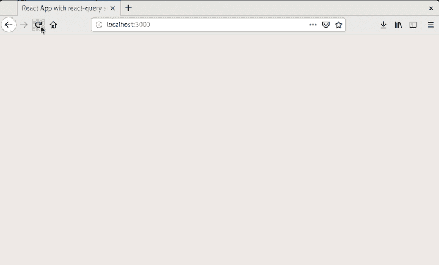
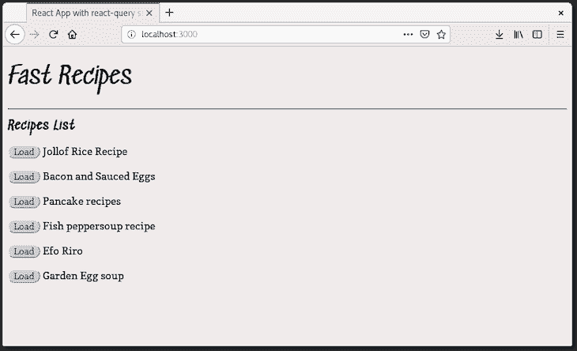
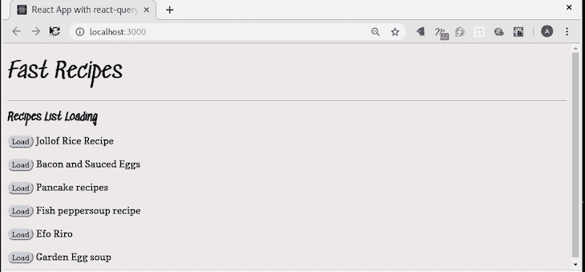
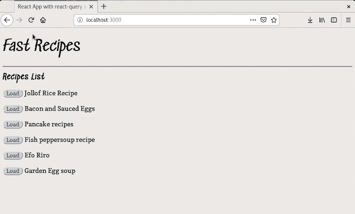

# 使用悬念和反应查询:示例教程

> 原文：<https://blog.logrocket.com/using-suspense-react-query-tutorial-examples/>

***编者按**:这篇文章最后更新于 2022 年 7 月 14 日，以反映创建 React 应用程序的更新。*

为了用更少的代码更容易地编写 React 组件，React 团队引入了钩子来管理功能应用程序中的状态。尽管 React 进行了这些改进，但仍然缺少一个主要功能，即缓存。

[暂挂](https://reactjs.org/docs/react-api.html#suspense)简化了 React 组件中加载状态的管理，在组件尚未完成加载的情况下支持回退。这些特性使得从前端获取数据变得更加容易，并且当您需要一种更好的方式向用户显示加载屏幕时非常有用。

在本文中，我们将探索使用 [React Query](https://github.com/tannerlinsley/react-query) 和悬念来构建一个简单的食谱应用程序，它将从 API 获取食谱数据并将其呈现给 DOM。我们开始吧！

## 什么是`useQuery`？

React Query 的`useQuery(query, fn)`是一个钩子，它根据传递给它的查询获取数据，然后将数据存储在其父变量中。在这种情况下，查询由一个惟一的键和一个被执行的异步函数组成。

传递到查询中的唯一键用于内部操作，如获取数据、缓存和重新获取链接到查询的数据。

您可以通过 npm 或 Yarn 安装 React 查询钩子库，如下所示:

```
yarn add react-query

// or

npm i -s react-query

```

假设您想通过从特定源获取一些数据来测试 React Query 的钩子。钩子存储在一个名为`query`的变量中，使用默认样式:

```
const query = useQuery("demo", fetchQueries)

// fetchQueries() 

async function fetchQueries() {
  return (await fetch(`http://some-url.com/endpoint`))
}

```

使用时，`query`变量与异步函数`fetchQueries`返回的信息一起存储。

## `useQuery()`特性

如果你需要从一个数据源获取数据，比如一个 API，你通常需要在`useEffect()`钩子中、在`componentDidMount`中或者在另一个函数中创建一个请求，这个请求将在你的应用程序每次重新加载时运行。这个过程可能会变得非常紧张，这正是 React Query 派上用场的地方。

### 获取数据

`useQuery()`背后的基本特性是数据获取。让我们用一个简单的演示来看看数据获取方面是如何工作的。首先，定义组件并将来自`useQuery`的结果存储到三个析构变量中:

```
function Recipes() {
   const { data, isLoading, error } = useQuery('recipes', fetchRecipes)

  return (
      <div>

      </div>
  )
}

```

要析构的三个变量将包含具有以下名称的返回信息:

*   `data`变量:保存从`fetchRecipes`函数返回的数据
*   `isLoading`:保存钩子运行状态的布尔变量
*   变量:保存从钩子返回的任何错误

接下来，通过将以下代码块添加到`<div>`主体中来显示接收到的信息:

```
function Recipes() {

  ...
  <div>
    { isLoading ? (
      <b> Loading .. </b>
    ) : error ? (
      <b>There's an error: {error.message}</b>
    ) : data ? (
      <ul>
        {data.map(recipe => (
          <li key={recipe.id}>{recipe.title}</li>
        ))}
      </ul>
    ) : null }
  </div>
  ...
}

```

上面的代码使用三元运算符有条件地呈现来自`useQuery()`的数据。如果您是一名经验丰富的 React 开发人员，这对您来说应该不陌生。但是，如果你是一个初学者，那么你应该仔细阅读 JavaScript 中的[条件渲染以及 React。请记住，三元运算符是本机`if-else`的一种简写方法。](https://blog.logrocket.com/conditional-rendering-in-react-c6b0e5af381e/)

上面的代码从布尔变量`isLoading`中检查查询的加载状态。如果变量读数为`true`，则显示加载信息。否则，如果 error 对象中有错误消息，它将显示一个错误。

如果没有错误消息，并且数据不是空的并且是由查询创建的，它将显示该数据。否则，它返回一个默认的`null`对象，如果以上条件都不满足，就让页面保持空白。将页面留空的想法并不理想，所以我们将看看在没有加载任何数据时如何返回相关消息。

### 预取

预取是 React Query 中最有趣的特性之一。它与数据获取的工作方式相同，都是从一开始就从您的`useEffect()`或`componentDidMount()`方法加载的。

在这种情况下，数据被加载并存储在缓存中，因此您的应用程序不必在每次用户需要时都发送新的请求来检索数据。

### 贮藏

缓存简单地说就是将数据存储一段时间。缓存是 React Query 的一项出色功能，它允许您的应用程序在缓存数据后从内存中检索数据，而无需重新查询。

## 构建应用程序

我们将构建一个简单的 recipe 应用程序，它使用 React Query 的`useQuery()`钩子从 API 获取并呈现[数据。这篇文章的完整代码也可以在](https://blog.logrocket.com/react-hooks-cheat-sheet-unlock-solutions-to-common-problems-af4caf699e70/) [this GitHub repo](https://github.com/Youngestdev/react-query-app) 找到。我们开始吧！


### 设置

构建我们的应用程序的第一步是通过安装所需的依赖项和创建所需的文件来建立一个工作目录。要从终端设置工作目录，请在首选根目录中运行以下命令:

```
npx create-react-app react-query-app
mkdir api
cd react-query-app

```

接下来，我们在 React 应用程序中安装 React Query:

```
npm install react-query

```

接下来，我们将在`index.css`文件中设计我们的应用程序:

```
body {
  background-color: #f0ebeb;
  font-family: 'Sedgwick Ave', cursive;
  font-size: 16px;
}
h1 {
  font-size: 40px;
  font-weight: lighter;
}
h2 {
  font-size: 20px;
}
button {
  background-color: #c8d2ddf3;
  border-radius: 12px;
  border: 5px 10px;
  font-family: 'Arvo', serif;
}
p {
  font-size: 18px;
  font-family: 'Copse', serif;
}

```

### 应用程序接口

让我们通过构建获取数据的后端 API 来启动我们的应用程序。我们将从安装所需的依赖项开始:

```
npm init -y // initialize the repo first
npm i express cors body-parser

```

现在，我们将在之前创建的`app.js`文件中编写后端代码:

### `app.js`

我们将在`app.js`中编写应用的后端代码。在这个文件中，一个简单的路由和静态 JSON 数据被归档到一个数组中，在这个数组中，它使用`GET`方法从静态 JSON 返回数据。将下面的代码添加到`app.js`:

```
// import necessary dependencies

const express = require("express");
const bodyParser = require("body-parser");
const cors = require('cors')

// initialize express.js
const app = express();

app.use(bodyParser.json());
app.use(cors())

// hardcoded recipes

const recipes = [
  {
    id: 1,
    title: "Jollof Rice Recipe",
    content: "How to make jollof rice ..."
  },
  {
    id: 2,
    title: "Bacon and Sauced Eggs",
    content: "How to make bacon and sauced eggs"
  },
  {
    id: 3,
    title: "Pancake recipes",
    content: "how to make pancakes..."
  },
  {
    id: 4,
    title: "Fish peppersoup recipe",
    content: "how to make it..."
  },
  {
    id: 5,
    title: "Efo Riro",
    content: "how to make it..."
  },
  {
    id: 6,
    title: "Garden Egg soup",
    content: "how to make it..."
  }
];

// return all recipes
app.get("/", (req, res) => {
  res.send(recipes);
});

// return a single recipe by ID
app.get("/:id", (req, res) => {
  const recipe = recipes.filter(
    recipe => recipe.id === parseInt(req.params.id)
  );
  if (recipe.length === 0) return res.status(404).send();
  if (recipe.length > 1) return res.status(500).send();
  res.send(recipe[0]);
});

app.listen(8081, () => {
  console.log("App's running on port 8081");
});

```

如前所述，后端代码包含硬编码的食谱数组和简单的路线。后端只是接收请求，借助`body-parser`解析成 JSON，并返回 JSON 格式的数据。后端 API 只接收两个请求:

*   `"/"`:当一个请求指向`"/"`时，后端返回食谱数组中的所有数据
*   `"/:id"`:当一个请求被定向到`"/:id"`并且`:id`被替换为一个整数时，它返回一个带有相应 ID 的配方

由于我们正在构建一个简单的食谱应用程序，这就是所有需要的后端代码。让我们继续构建应用程序的前端部分，在这里我们将看到 React Query 如何处理悬念。

## 成分

我们已经成功构建了应用程序的后端部分，将从该部分检索数据。现在，我们必须构建我们的应用程序的前端部分，数据将在那里显示或呈现。

### `index.jsx`

在`index.jsx`文件中，我们安装 React 应用程序并呈现数据:

```
import React, { lazy } from "react";
import ReactDOM from "react-dom";

const rootElement = document.getElementById("root");
ReactDOM.render(<App />, rootElement)

```

`index.jsx`是一个基本的渲染文件。接下来，我们导入 React Query 和 recipe 组件，因为我们将在`index.jsx`文件中编写主应用程序组件`<App />`:

```
import { ReactQueryConfigProvider } from "react-query";

const Recipes = lazy(() => import("./components/Recipes"));
const Recipe = lazy(() => import("./components/Recipe"));

const queryConfig = {
  suspense: true
};

```

我们导入了 React Query 的配置上下文提供程序，还创建了一个`queryConfig`对象，这表明我们将在应用程序中与 React Query 一起使用悬念。接下来，我们将如下编写我们的`App`组件:

```
function App() {
  const [activeRecipe, setActiveRecipe] = React.useState(null);

  return (
  <React.Fragment>
    <h2>Fast Recipes</h2>
    <hr />
    <ReactQueryConfigProvider config={queryConfig}>
        <React.Suspense fallback={<h1> Loading ...</h1>}>
          {  activeRecipe ? (
              <Recipe
                activeRecipe={activeRecipe}
                setActiveRecipe={setActiveRecipe}
              />
            ) : (
              <Recipes setActiveRecipe={setActiveRecipe} />
            )}
        </React.Suspense>
    </ReactQueryConfigProvider>
  </React.Fragment>  
  );
}

```

在我们的应用程序组件中，我们初始化了一个名为`activeRecipe`的状态和状态处理程序`setActiveRecipe`。然后，我们为我们的应用程序创建了一个标题，并将儿童标签分组到`React.Fragment`下。

接下来，我们加载了 React Query 的配置提供者组件，并传递了配置对象`queryConfig`,它告诉 React Query 我们将使用悬念。

接下来，我们将条件渲染包装在`React.Suspense`下。如果`activeRecipe`设置为真，则显示制作方法。否则，它会显示配方列表。

我们还在`React.Suspense`上加了一个`fallback`道具。这是一个必需的属性，每当没有任何数据要呈现或者获取数据有延迟时，它就会呈现传递的数据。

如果不添加悬念，React Query 在查询和呈现数据的过程中会呈现一个空白页面。这并不理想，因为这些情况并没有给用户任何应用程序正在做什么的提示。

* * *

### 更多来自 LogRocket 的精彩文章:

* * *

接下来，我们将编写 React Query 将在`queries.jsx`中处理的查询。

### `queries.jsx`

```
export async function fetchRecipes() {
  return (await fetch(`http://localhost:8081`)).json();
}

export async function fetchRecipe({ id }) {
  return (await fetch(
    `http://localhost:8081/${id}`
  )).json();
}

```

当被查询时，`fetchRecipes()`函数返回所有食谱的列表，而`fetchRecipe`只返回一个食谱。

接下来，我们将编写呈现单个菜谱的组件。

### `Recipe.jsx`

```
import React from "react";
import { useQuery } from "react-query";

import Button from "./Button";

import { fetchRecipe } from "../queries";

```

首先，我们从它的库中导入 React 和`useQuery`来访问它的特性。我们还导入处理小事情的辅助组件，稍后我们会看到。

接下来，我们在导入语句后编写组件:

```
export default function Recipe({ activeRecipe, setActiveRecipe }) {
  const { data, isFetching } = useQuery(
    ["recipe", { id: activeRecipe }],
    fetchRecipe
  );

  return (
    <React.Fragment>
      &lt;Button onClick={() => setActiveRecipe(null)}>Back</Button>
      <h1>
        ID: {activeRecipe} {isFetching ? "Loading Recipe" : null}
      </h1>
      {data ? (
        <div>
          <p>Title: {data.title}</p>
          <p>Content: {data.content}</p>
        </div>
      ) : null}
      <br />
      <br />
    </React.Fragment>
  );
}

```

`Recipe`组件有两个道具，`activeRecipe`和`setActiveRecipe`，它们将被`useQuery`钩子用来查询和呈现数据。

这个`useQuery`钩子有两个参数，`(["recipe", { id: activeRecipe }],fetchRecipe)`。

第一个参数是一个由查询名和惟一标识符组成的数组，在本例中，惟一标识符是`{ id: activeRecipe }`。当通过第二个参数`fetchRecipe`查询数据时，应用程序使用唯一标识符。钩子被保存到一个可析构的对象中:

*   `data`:包含第二个参数`fetchRecipe`返回的信息
*   `isFetching`:一个布尔值，告诉我们应用程序的加载状态

一旦从`useQuery`钩子返回了数据，组件就会呈现食谱数据，如第 13–18 行所示。否则，它不会呈现任何内容。数据依次被缓存，如果用户返回并点击同一个菜谱，新的请求不会被发送。相反，菜谱会立即显示出来，速度大约是发送请求的两倍。

还有一个`Button`组件，允许用户在应用程序中轻松导航。接下来，我们将构建`Recipes`组件。

### `Recipes.jsx`

`Recipes`组件负责使用`useQuery()`呈现从`fetchRecipes`查询的食谱列表。我们将使用下面的代码:

```
import React from "react";
import { useQuery, prefetchQuery } from "react-query";

import Button from "./Button";

import { fetchRecipes, fetchRecipe } from "../queries";

export default function Recipes({ setActiveRecipe }) {
  const { data, isFetching } = useQuery("Recipes", fetchRecipes);

  return (
    <div>
      <h1>Recipes List 
      { isFetching 
        ? "Loading" 
        : null 
      }
        </h1>
      {data.map(Recipe => (
        <p key={Recipe.title}>
          <Button
            onClick={() => {
              // Prefetch the Recipe query
              prefetchQuery(["Recipe", { id: Recipe.id }], fetchRecipe);
              setActiveRecipe(Recipe.id);
            }}
          >
            Load
          </Button>{" "}
          {Recipe.title}
        </p>
      ))}
    </div>
  );
}

```

在组件中，我们从导入 React 和 React Query 开始，使我们能够使用`useQuery`钩子。

提取数据时，会显示加载消息。`useQuery()`钩子用于从后端检索食谱列表。传统上，这将在`useEffect()`钩子中完成，如下所示:

```
const [data, setData] = useState([])

useEffect(() => {
  fetch('https://api-url/recipes')
      .then(response => response.json())
      .then(data => {
        setData(data); // save recipes in state
      });
}, [])

```

这是 React 查询在后台进行的过程。接下来，从 React Query 检索的数据被缓存，从其数组中映射出来，然后呈现在 DOM 上。

### `Button.jsx`

助手组件`Button`的代码如下:

```
import React from "react";

export default function Button({ children, timeoutMs = 3000, onClick }) {

  const handleClick = e => {
      onClick(e);
  };

  return (
    <>
      <button onClick={handleClick}>
        {children}
      </button>
    </>
  );
}

```

## 运行我们的应用

接下来，我们想预览我们已经建立的应用程序。我们将首先在没有后端的情况下运行应用程序，以验证当没有数据返回时将显示一个空白页。从您的终端启动 React 应用程序:

```
npm run start

```

接下来，打开您的网络浏览器并导航到`[http://localhost:3000](http://localhost:3000)`，您应该会看到如下页面:



超时后，我们得到一个空白页，大约 1000 毫秒，因为应用程序没有任何东西呈现给 DOM。接下来，我们通过从`api`文件夹运行下面的命令来启动我们的后端应用程序:

```
npm run start

// or

node app.js

```

一旦我们的后端应用程序开始运行，我们就会收到来自终端的通知。然后，我们在`localhost:3000`刷新浏览器以呈现我们的食谱:



当从数据源获取或加载数据时，暂停将通知用户应用程序的状态。在这种情况下，React Query 获取数据，而悬念让我们更新应用程序状态，正如在`App`组件中所指示的。

不过由于 app 加载速度快，我们还没有看到悬疑的真实效果。将浏览器连接设置为 3G，刷新浏览器渲染`Loading…`很长时间。应用程序仍在等待来自后端的数据，即获取状态为待定，因此，悬念显示回退消息以避免呈现空白页面。获取数据后，页面会呈现食谱:



### 行动中的悬念

这样，我们就成功地在 React 查询应用程序中实现了悬念。

加载配方时，如果数据获取延迟，将显示暂停回退消息。提取的配方数据存储在缓存中，如果再次加载相同的配方，将立即再次显示:



## 结论

在本文中，我们通过构建一个简单的食谱应用程序，探索了悬念和反应查询是怎么一回事。我们了解了如何通过在加载期间通知用户来改善用户体验，以及如何使用 React Query 的`useQuery()`钩子来改善数据获取。你可以在 GitHub repo 找到本文[中构建的应用程序的完整代码。编码快乐！](https://github.com/Youngestdev/react-query-app)

## [LogRocket](https://lp.logrocket.com/blg/react-signup-general) :全面了解您的生产 React 应用

调试 React 应用程序可能很困难，尤其是当用户遇到难以重现的问题时。如果您对监视和跟踪 Redux 状态、自动显示 JavaScript 错误以及跟踪缓慢的网络请求和组件加载时间感兴趣，

[try LogRocket](https://lp.logrocket.com/blg/react-signup-general)

.

[ ](https://lp.logrocket.com/blg/react-signup-general) [](https://lp.logrocket.com/blg/react-signup-general) 

LogRocket 结合了会话回放、产品分析和错误跟踪，使软件团队能够创建理想的 web 和移动产品体验。这对你来说意味着什么？

LogRocket 不是猜测错误发生的原因，也不是要求用户提供截图和日志转储，而是让您回放问题，就像它们发生在您自己的浏览器中一样，以快速了解哪里出错了。

不再有嘈杂的警报。智能错误跟踪允许您对问题进行分类，然后从中学习。获得有影响的用户问题的通知，而不是误报。警报越少，有用的信号越多。

LogRocket Redux 中间件包为您的用户会话增加了一层额外的可见性。LogRocket 记录 Redux 存储中的所有操作和状态。

现代化您调试 React 应用的方式— [开始免费监控](https://lp.logrocket.com/blg/react-signup-general)。