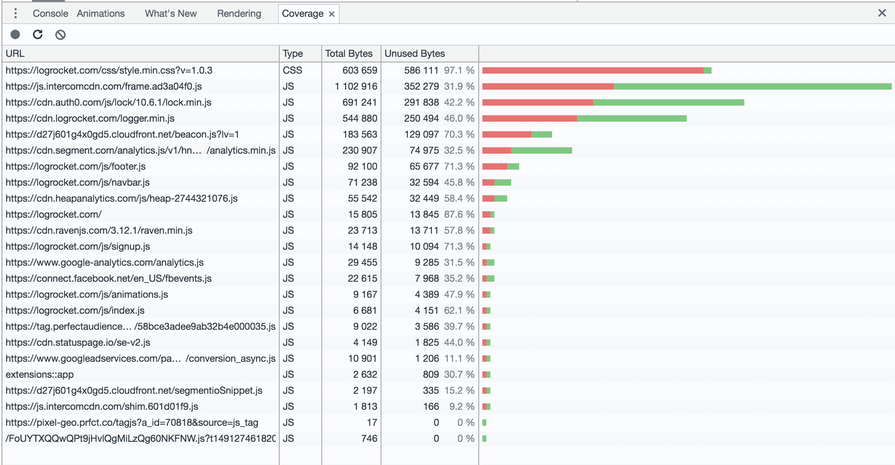
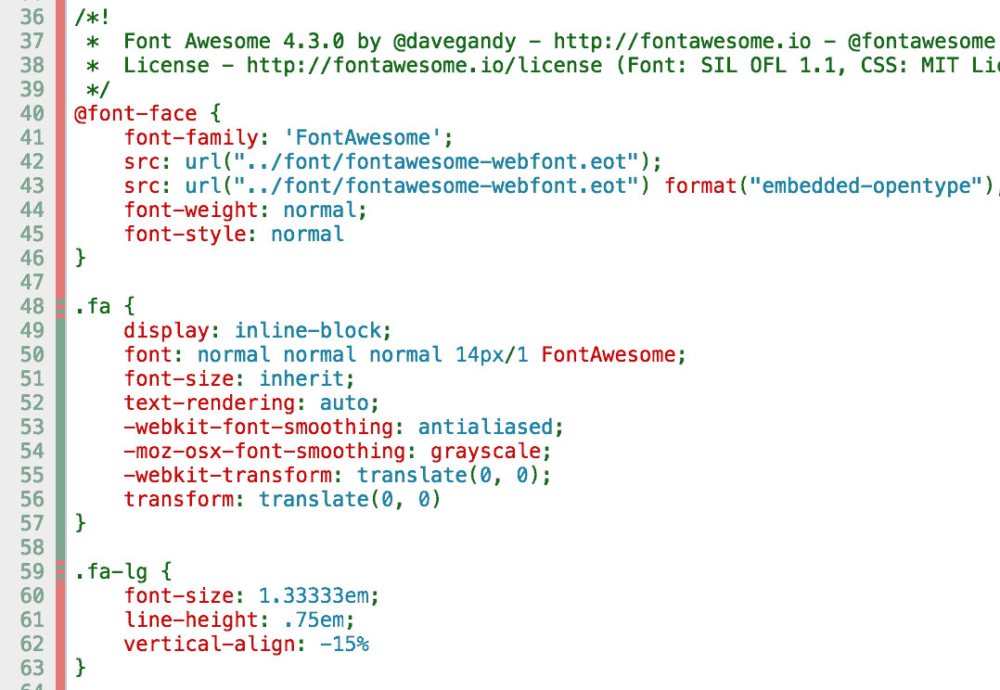

# 使用 Chrome devtools 新的代码覆盖特性

> 原文：<https://blog.logrocket.com/using-the-chrome-devtools-new-code-coverage-feature-ca96c3dddcaf/>

# 使用 Chrome devtools 新的代码覆盖特性

## 

2017 年 4 月 4 日 1 分钟阅读 386

代码覆盖率终于走出了实验，进入了 Chrome Canary，这意味着它将很快全面上市。这是一个令人兴奋的特性，在使用 JavaScript 和 CSS 时都很有用，所以我想我应该做一个快速演示，并探索它如何有所帮助。

**更新:**标准 Chrome 现在提供代码覆盖特性。如果你已经更新到最新版本，没有必要使用金丝雀！

#### 它是做什么的？

代码覆盖率允许您运行您的 web 应用程序，并且对于每个 JS/CSS 文件，查看哪些代码行运行了，哪些没有运行。

在这里，我运行了一个简单的静态网页 Chrome 生成了页面上 CSS 和 JS 文件的分解。右边的条形显示每个文件的相对大小，红色代表未使用的代码，绿色显示运行的代码。

记录代码覆盖率的工作方式类似于 devtools 时间轴——点击 record，然后正常地与站点交互。完成后，Chrome 会进行一些计算并生成读数。在这里，我很好奇网站上有多少未使用的 css，所以我导航到各个子页面，以确保我找到了每个 CSS“代码路径”。果然——这里有很大的改进空间，因为我的网站上 97%的 css 都没有使用！

Chrome 还能让你深入到单个文件的代码覆盖范围。这里，左边的红/绿条显示了哪些特定行运行了，哪些没有运行。请注意，在检查缩小的文件时，您可以按下文件左下角的按钮来“美化”代码。

#### 为什么有用？

当处理一个复杂或长期的项目时，很容易积累死代码。如果您正在使用 webpack 或另一个 JS 构建系统，有一些工具可以防止大多数死 JS 代码进入生产环境。但是对于 CSS 来说，要做到这一点可能有点棘手。在 Chrome 中拥有这个覆盖工具是一个很好的方式，可以快速了解你发布了多少额外的代码，以及哪些文件需要优化。

#### 如何获得？

下载 Chrome Canary 或者等待几周，让它达到普通 Chrome。

## 使用 [LogRocket](https://lp.logrocket.com/blg/signup) 消除传统错误报告的干扰

[LogRocket](https://lp.logrocket.com/blg/signup) 是一个数字体验分析解决方案，它可以保护您免受数百个假阳性错误警报的影响，只针对几个真正重要的项目。LogRocket 会告诉您应用程序中实际影响用户的最具影响力的 bug 和 UX 问题。

然后，使用具有深层技术遥测的会话重放来确切地查看用户看到了什么以及是什么导致了问题，就像你在他们身后看一样。

LogRocket 自动聚合客户端错误、JS 异常、前端性能指标和用户交互。然后 LogRocket 使用机器学习来告诉你哪些问题正在影响大多数用户，并提供你需要修复它的上下文。

关注重要的 bug—[今天就试试 LogRocket】。](https://lp.logrocket.com/blg/signup-issue-free)