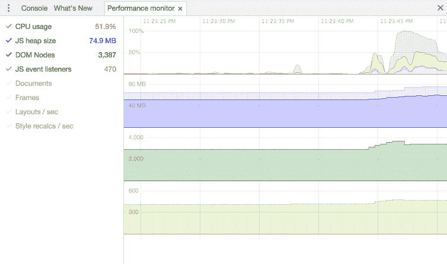
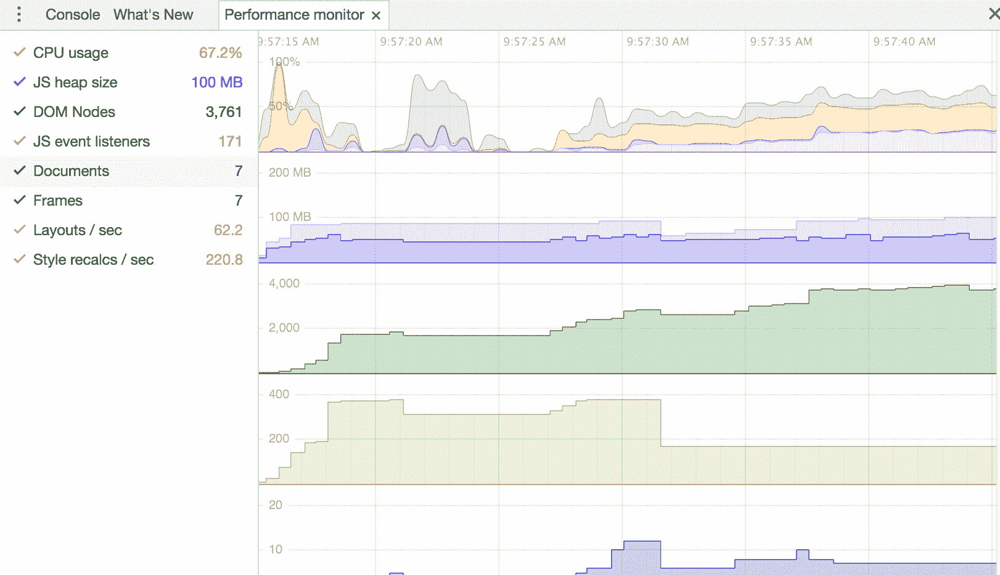
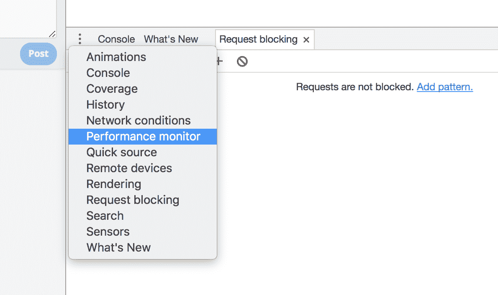

# 在 Google Chrome - LogRocket 博客中使用新的流性能监视器

> 原文：<https://blog.logrocket.com/using-the-new-streaming-performance-monitor-in-google-chrome-d3019afe95e4/>

# 在谷歌浏览器中使用新的流媒体性能监视器

## 

2017 年 10 月 27 日 1 分钟阅读 442

如果你曾经不得不在 Chrome 中调试内存泄漏或分析性能问题，你可能会体验到开发工具中笨拙的性能和内存标签。虽然提供了高度细化的信息，但它们需要有目的地开始和停止“记录”，并显著增加机器上的 CPU 和内存使用。

### 新:实时性能和内存统计

最近在 Chrome Canary 中添加的流性能监视器可以在应用运行时显示实时性能和内存统计数据。它结合了性能和内存选项卡中最有用的数据，显示:

*   **CPU 使用率** —站点使用了您的 CPU 的多少百分比
*   **JS 堆大小** —应用程序使用了多少内存(以兆字节为单位)
*   **DOM 节点—** 内存中有多少 DOM 节点
*   **JS 事件监听器-** 注册了多少个 JavaScript 事件监听器
*   **文档—** 样式表和脚本等实时文档资源的数量
*   **框架—** 页面上活动框架的数量(iframes 和 workers)
*   **布局/秒—** 浏览器必须重新布局 DOM 的速率
*   **样式重新计算/秒—** 浏览器必须重新计算样式的速率

Clicking on a metric on the left side lets you toggle whether or not it is recorded

### 为什么它有帮助

由于性能监视器不需要开始和停止离散记录，因此您可以在日常使用应用程序时保持其打开状态。如果您看到 CPU 或内存峰值，您将知道可能有问题。

当不清楚应用程序中的哪个动作或页面导致速度变慢时，这也可以节省时间——因为统计数据是实时的，当你在应用程序中做一些事情时，你会立即看到 CPU 或内存使用率开始攀升。

需要说明的是，性能监视器并没有完全取代性能和内存选项卡。这些会产生更详细的信息，在试图找出问题的根本原因时很有帮助，因为您可以记录一个实例，然后暂停并放大问题区域。

### 如何获得它

确保你有最新版本的 Chrome Canary，点击开发者工具下方“控制台”旁边下拉菜单中的“性能监视器”。

如果你不想安装 Canary，你只需要等待几周的时间，性能显示器就可以达到 Chrome Stable(Chrome 的普通版本)。

[*LogRocket*](https://logrocket.com) *帮助产品团队为用户构建更好的体验。通过记录用户会话的视频以及日志和网络数据，LogRocket 暴露了 UX 的问题，并揭示了每个 bug 的根源。*