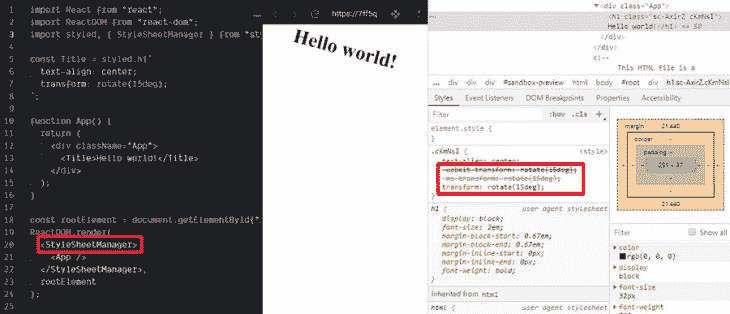
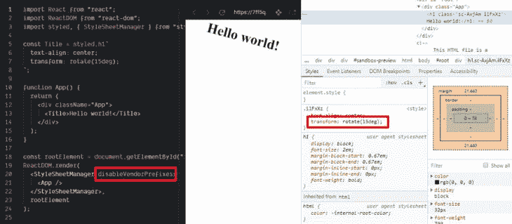

# 在 styled-components 5.0 中使用 StyleSheetManager 组件

> 原文：<https://blog.logrocket.com/using-the-stylesheetmanager-component-in-styled-components-5-0/>

Styled-components version 5 为`StyleSheetManager`组件带来了一些有趣的增强，这是一个助手组件，可以用来修改 CSS 样式的处理。

除了用于为`StyleSheet`对象提供自定义配置的`sheet`属性和用于提供将注入样式的 DOM 节点的`target`属性之外，`StyleSheetManager`组件现在还具有以下属性:

*   `disableCSSOMInjection`
*   `disableVendorPrefixes`
*   `stylisPlugins`

我们来详细回顾一下。

## 修改 CSS 的注入方式

属性`disableCSSOMInjections`允许我们从 CSS 对象模型(CSSOM) API 切换到基于文本节点的 CSS 注入系统。

当浏览器解析页面的 HTML 代码时，除了创建称为 DOM(文档对象模型)的节点树之外，它还以树的形式创建 CSS 对象模型，其中每个节点包含特定 DOM 元素的 CSS 样式信息。

这样，要插入或修改特定节点的样式，我们可以使用 DOM API:

```
document.getElementById('myDiv').style.background = 'blue'
```

或者 CSSOM API:

```
// Assuming there's a stylesheet in the HTML page
const style = document.styleSheets[0];
style.sheet.insertRule('#myDiv {background-color: blue}');
```

这样，当属性`disableCSSOMInjections`存在或者你给它赋值`true`时:

```
ReactDOM.render(
   <StyleSheetManager disableCSSOMInjections={true}>
      <App />
   </StyleSheetManager>,
   root
);
```

样式组件将使用基于文本节点的 CSS 系统来获取、插入和删除样式:

```
export class TextTag implements Tag {
  element: HTMLStyleElement;
  nodes: NodeList<Node>;
  length: number;

  // ...

  insertRule(index: number, rule: string): boolean {
    // ...
    this.element.insertBefore(node, refNode || null);
    // ...
  }

  deleteRule(index: number): void {
    this.element.removeChild(this.nodes[index]);
    // ...
  }

  getRule(index: number): string {
    // ...
    return this.nodes[index].textContent;
  }
}
```

代替 CSSOM API:

```
export class CSSOMTag implements Tag {
  element: HTMLStyleElement;
  sheet: CSSStyleSheet;
  length: number;

  // ...

  insertRule(index: number, rule: string): boolean {
    // ..
    this.sheet.insertRule(rule, index);
    // ...
  }

  deleteRule(index: number): void {
    this.sheet.deleteRule(index);
    // ...
  }

  getRule(index: number): string {
    const rule = this.sheet.cssRules[index];
    // ..
    return rule.cssText;
  }
}
```

[在这里](https://github.com/styled-components/styled-components/blob/master/packages/styled-components/src/sheet/Tag.js)你可以看到这些组件的完整源代码，看看它是如何做到的。

然而，可能只有在与第三方工具有集成问题时才需要使用这个属性，因为 CSSOM API 性能更好，并且是推荐的选项。

## 禁用 CSS 浏览器前缀

顾名思义，属性`disableVendorPrefixes`禁止生成 CSS 供应商前缀(也称为 CSS 浏览器前缀):

*   Chrome/Safari: `-webkit-`
*   火狐:`-moz-`
*   Internet Explorer/Edge: `-ms-`
*   歌剧:`-o-`

例如，默认情况下，规则`transform: rotate(15deg)`使用供应商前缀生成:



但是如果属性`disableVendorPrefixes`存在或者您给它赋值`true`，就不会生成供应商前缀:



试试这里的。

仅当不需要旧版浏览器支持时，才使用此属性。

## 自定义 CSS 的处理方式

在高层次上，这是[当您声明一个样式时,](https://medium.com/styled-components/how-styled-components-works-618a69970421)styled-components 做什么:

1.  它评估了标记的模板
2.  它生成 CSS 类名
3.  它用一个名为 [Stylis](https://github.com/thysultan/stylis.js) (实际上是一个 fork， [@emotion/stylis](https://github.com/styled-components/styled-components/pull/2640) )的库对 CSS 规则进行预处理
4.  它将预处理的 CSS 注入到页面中

版本 5 中的新特性是能够使用插件定制 Stylis 预处理 CSS 规则的方式，并带有属性`stylisPlugins`。

此时最流行的插件似乎是 [stylis-plugin-rtl](https://github.com/styled-components/stylis-plugin-rtl) ，它为 app 增加了 rtl(从右到左)支持(注意这个插件是[原 Stylis RTL 插件](https://www.npmjs.com/package/stylis-rtl)的一个分支)。

基本上， [RTL 改变 CSS 属性](https://stackoverflow.com/questions/12284514/inverted-css-properties-to-change-to-rtl)的值，这些属性处理水平值，比如框和文本阴影、边框、左、右位置等等。

要使用这个插件，我们只需导入它并将其传递给`stylisPlugins`属性，该属性接受一个插件数组。下面是一个使用边界半径的示例:

```
import rtlPlugin from "stylis-plugin-rtl";

const Title = styled.h1`
  border: solid 5px;
  border-radius: 35px 0px 0 35px; /* top-left top-right bottom-right bottom-left */
  color: red;
`;

// ...

<StyleSheetManager
  stylisPlugins={ [rtlPlugin]}
>
   <div className="App">
      <Title>Hello world!</Title>
   </div>
</StyleSheetManager>    

```

不带插件:


使用插件:


[在这里](https://codesandbox.io/s/stylesheetmanager-plugins-2qrhs)你可以试试这个 RTL 插件的例子，[另一个插件](https://github.com/email-types/stylis-plugin-mso)增加了对`mso-`厂商前缀的支持。

你可以在 NPM 上寻找更多的 [stylis 插件。然而，在撰写本文时，并不是所有的组件都与样式化组件完全兼容。](https://www.npmjs.com/search?q=keywords%3AStylis%20plugin)

例如，一些插件会抛出以下错误:

> 提供了一个未命名的 stylis 插件。我们需要为每个插件命名，以防止同一应用程序中不同风格配置之间的风格冲突。在你把你的插件传给`<StyleSheetManager stylisPlugins={[]}>`之前，请确保每个插件都是唯一命名的。

如果是这种情况，您只需要向插件实例添加一个`name`属性，如下所示:

```
import msoPlugin from "stylis-plugin-mso";
Object.defineProperty(msoPlugin, "name", { value: "msoPlugin" });
```

另一方面，一些插件通过返回一个表示已处理 CSS 规则的字符串来工作。原始规则将被此字符串替换。

但是其他插件不返回值，它们使用作为参数传递的引用来处理 CSS 规则。

这是一个插件函数的签名，其中最重要的参数是当前处理阶段`context`和正在处理的 CSS 规则`content`:

```
function stylisPlugin(context, content, selectors, parent, line, column, length) {
  // ...
}
```

在大多数情况下，这些类型的插件(不返回值)与样式化组件不兼容。

如果你想建一个自定义插件，可以在这里了解更多[。](https://github.com/thysultan/stylis.js#plugins)

## 结论

styled-components v5 于 2020 年 1 月发布，它扩展了定制 CSS 样式的能力，而无需对其 API 进行任何重大更改。

您已经了解了`StyleSheetManager`组件的三个新属性:

*   `disableCSSOMInjection` —切换到基于文本节点的 CSS 注入系统，用于向 DOM 添加样式，而不是使用 CSS 对象模型(CSSOM) API
*   `disableVendorPrefixes` —禁止为某些 CSS 属性生成浏览器前缀
*   `stylisPlugins` —使用 Stylis 插件处理您的 CSS 规则

可能最后一个将是最受欢迎的属性，只是在使用 Stylis 插件时要记住上面提到的注意事项。

编码快乐！

## 你的前端是否占用了用户的 CPU？

随着 web 前端变得越来越复杂，资源贪婪的特性对浏览器的要求越来越高。如果您对监控和跟踪生产环境中所有用户的客户端 CPU 使用、内存使用等感兴趣，

[try LogRocket](https://lp.logrocket.com/blg/css-signup)

.

[](https://lp.logrocket.com/blg/css-signup)[https://logrocket.com/signup/](https://lp.logrocket.com/blg/css-signup)

LogRocket 就像是网络和移动应用的 DVR，记录你的网络应用或网站上发生的一切。您可以汇总和报告关键的前端性能指标，重放用户会话和应用程序状态，记录网络请求，并自动显示所有错误，而不是猜测问题发生的原因。

现代化您调试 web 和移动应用的方式— [开始免费监控](https://lp.logrocket.com/blg/css-signup)。