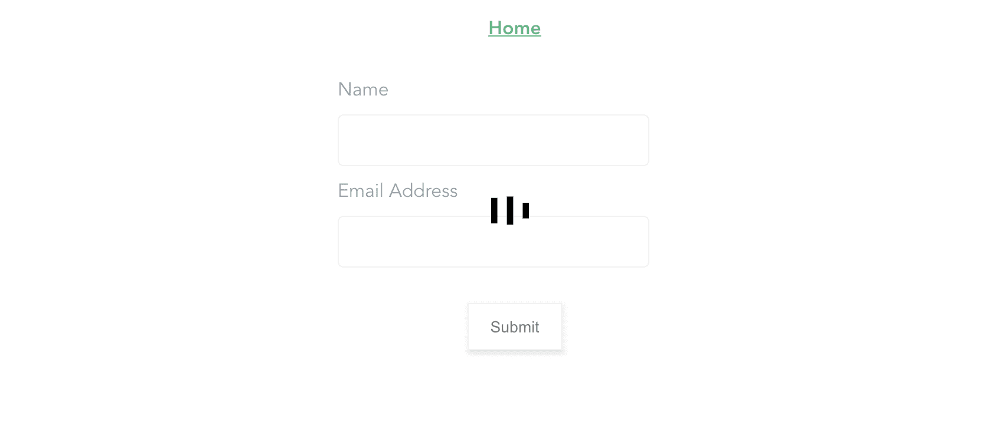
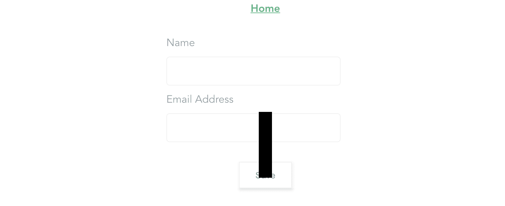
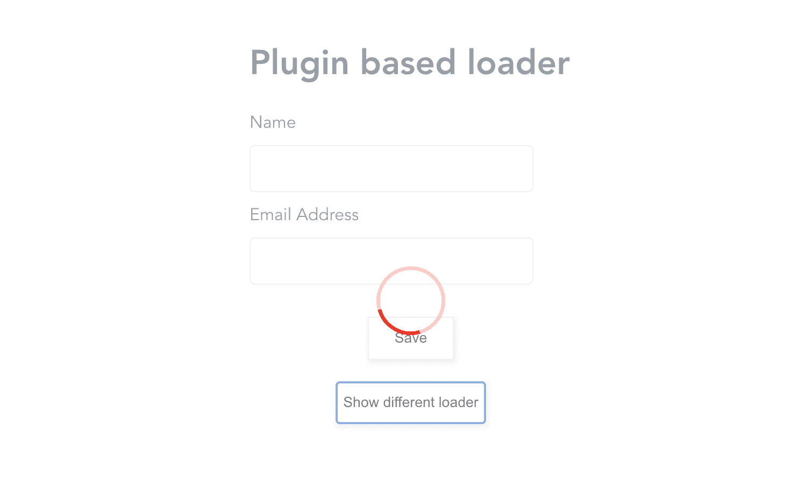

# 在你的 Vue 应用日志博客中使用 Vue 加载叠加插件

> 原文：<https://blog.logrocket.com/using-the-vue-loading-overlay-plugin-in-your-vue-apps/>

## 快速小结

在开发应用程序时，向 API 请求应用程序中的数据以向用户显示特定信息或处理用户输入(如身份验证)的情况并不少见。

当用户与您的应用程序交互时，会发生这些事情，所以当用户等待来自这个 API 请求的响应时，会有一些延迟。理想的做法是通过以文本或动画的形式显示一个负载指示器，让用户知道他们的请求正在被处理。

在本教程中，我们将学习如何在我们的 Vue 应用程序中使用 [Vue 加载覆盖插件](https://github.com/ankurk91/vue-loading-overlay)。

## 先决条件

本教程需要对 Vue.js 有一个基本的了解，以正确理解我们将使用的一些概念。

### 介绍

Vue 加载覆盖插件是一个加载指示器，可以在你的 Vue 应用中以不同的方式使用。它们包括:

它可以从三种不同的装载机中自由选择，它们是:

它还提供了使用您喜欢的动画图标来代替使用[槽](https://vuejs.org/v2/guide/components-slots.html)的可用选项的选项。当你心中有一个特定的动画时，这个特性就派上用场了，我认为这是这个插件最重要的特性之一。

这个插件还附带了一个选项列表，您可以进一步使用它来定制您选择的加载器。这些选项包括:

*   不透明
*   宽度
*   高度
*   装货设备
*   容器

当使用这个插件作为组件时，这些选项也可以作为道具传递。

## 装置

可以使用以下两种方法中的任何一种来安装此插件:

纱线:

```
yarn add vue-loading-overlay
```

NPM:

```
npm install vue-loading-overlay
```

对于本教程，我们将构建一个简单的应用程序来帮助理解本文中使用的所有概念。

完整的应用程序可以在我的 [GitHub](https://github.com/Timibadass/vue-loading-overlay-app) 上找到。

## 使用

一旦安装过程完成，下一件事将是设置这个插件在我们的应用程序中使用。根据我们希望如何使用这个插件，我们将配置我们的应用程序不同。让我们一个一个来看看。

### 作为一个组件

我们需要做的第一件事是将这个插件导入到我们想要使用的文件中。在这种情况下，我将把它导入到`Home.vue`中，这样使用:

```
<script>
import Loading from 'vue-loading-overlay';
import 'vue-loading-overlay/dist/vue-loading.css';
export default {
  name: 'Home',
  components: {
    Loading
  }
}
</script>
```

在将加载器组件导入到组件中之后，只需将它放在您希望它所在的容器中就可以使用它了，或者如果您需要整页加载器，可以放在模板中的任何位置。

```
<loading />
```

下面是我的`Home.vue`文件在配置后的样子:

```
<template>
  <div class="home">
    <form @submit.prevent="logIn">
    <loading :active='isLoading' :is-full-page="fullPage" :loader='loader' />
      <label for="name" class="label">Name</label>
      <input type="text" name="name"  class="input__field" id="name">
      <label for="email" class="label">Email Address</label>
      <input type="email" name="email" class="input__field"  id="email">
      <button type="submit" class="submit__button">Submit</button>
    </form>
  </div>
</template>
<script>
import Loading from 'vue-loading-overlay';
import 'vue-loading-overlay/dist/vue-loading.css';
export default {
  name: 'Home',
  data() {
    return {
      isLoading: false,
      fullPage: false,
      loader: 'bars'
    }
  },
  components: {
    Loading
  },
  methods: {
    logIn() {
      this.isLoading = true;
      setTimeout(() => {
        this.isLoading = false
      }, 3000);
    }
  }
}
</script>
<style scoped>
.home {
  width: 500px;
  margin: auto;
  height: 500px;
  text-align: left;
}
form {
  width: 100%;
  max-width: 300px;
  margin: auto;
  /* important if you do not want fullscreen loader */
  position: relative;
}
.label {
  display: block;
  width: 100%;
  margin-bottom: 10px;
}
.input__field {
  margin-bottom: 10px;
  height: 40px;
  border: 1px solid #e4e4e4;
  border-radius: 5px;
  padding-left: 10px;
  width: 250px;
}
.submit__button {
  width: 80px;
  height: 40px;
  display: block;
  margin: 20px auto;
  background-color: #fff;
  border: 1px solid #e4e4e4;
  box-shadow: 1px 2px 4px 1px #e4e4e4;
}
</style>
```

这里，我们用本地导入的加载组件更新我们的组件，并将它放在表单元素中。

这个加载器组件被传递了三个 props，它们执行以下操作:

*   `active`:该道具用于确定加载器的状态，即当其为`false`时，加载器不可见，当其为`true`时，加载器激活。
*   这个道具用于设置你喜欢的装载器类型。它接受`bars`、`dots`或`spinners`。如果没有提供这个属性，默认使用`spinners`。
*   这个道具用来决定装载器动画是否占据了整个屏幕的宽度，在这种情况下，我将它设置为 false。需要注意的一点是，当将该值设置为 false 时，包装加载器组件的元素需要将其 CSS `position`设置为`relative`。否则，加载器仍然是全屏的，这就是为什么在这个页面的样式部分，我将这个属性添加到了`form`的样式中。

该组件可用道具的完整列表可以在他们的[文档页面](https://github.com/ankurk91/vue-loading-overlay#available-props)上找到。

在这个文件中，因为我们没有进行 API 调用，所以我们利用 JavaScript `setTimeout`函数来控制加载器的切换。当点击按钮时，该功能被激活。


如果要在应用程序的多个文件中使用这个组件，那么在本地导入它会很累。最好是在`main.js`文件中全局导入这个组件。

```
import Vue from 'vue'
import App from './App.vue'
import router from './router'
import store from './store'
import Loading from 'vue-loading-overlay';
import 'vue-loading-overlay/dist/vue-loading.css';
Vue.component('loading-overlay', Loading)
Vue.config.productionTip = false
new Vue({
    router,
    store,
    render: h => h(App)
}).$mount('#app')
```

完成后，我们只需在`Home.vue`中重命名我们的组件，并删除导入的版本。

```
<template>
  <div class="home" ref="homeCont">
    <form @submit.prevent="logIn">
      <loading-overlay :active="isLoading" :is-full-page="fullPage" :loader="loader" />
      <label for="name" class="label">Name</label>
      <input type="text" name="name" class="input__field" id="name" />
      <label for="email" class="label">Email Address</label>
      <input type="email" name="email" class="input__field" id="email" />
      <button type="submit" class="submit__button">Submit</button>
    </form>
  </div>
</template>
<script>
  export default {
    name: "Home",
    data() {
      return {
        isLoading: false,
        fullPage: false,
        loader: "bars"
      };
    },
    methods: {
      logIn() {
        this.isLoading = true;
        setTimeout(() => {
          this.isLoading = false;
        }, 3000);
      }
    }
  };
</script>
<style scoped>
  .home {
    width: 500px;
    margin: auto;
    height: 500px;
    text-align: left;
  }
  form {
    width: 100%;
    max-width: 300px;
    margin: auto;
    /* important if you do not want fullscreen loader */
    position: relative;
  }
  .label {
    display: block;
    width: 100%;
    margin-bottom: 10px;
  }
  .input__field {
    margin-bottom: 10px;
    height: 40px;
    border: 1px solid #e4e4e4;
    border-radius: 5px;
    padding-left: 10px;
    width: 250px;
  }
  .submit__button {
    width: 80px;
    height: 40px;
    display: block;
    margin: 20px auto;
    background-color: #fff;
    border: 1px solid #e4e4e4;
    box-shadow: 1px 2px 4px 1px #e4e4e4;
  }
</style>
```

## 使用插槽

如果你有一个特定的动画，不同于三个可用的加载器选项，这个插件提供了使用插槽来实现这一点的选项。

插槽使您能够创建可在应用程序的不同情况下重用的组件。下面是老虎机工作原理的一个例子:

按钮.视图

```
<template>
  <button type="submit">
    <slot>Submit</slot>
  </button>
</template>
<script>
  export default {
    name: 'FormButton'
  };
</script>
<style>
</style>
```

这里，我们创建一个按钮组件，并传递给它一个默认值为`submit`的`slot`。如果在使用该组件的任何地方都没有提供文本，则该值将作为后备。

家。视图

```
<template>
  <div class="home" ref="homeCont">
    <form @submit.prevent="logIn">
      <loading-overlay :active="isLoading" :is-full-page="fullPage" :loader="loader"></loading-overlay>
      <label for="name" class="label">Name</label>
      <input type="text" name="name" class="input__field" id="name" />
      <label for="email" class="label">Email Address</label>
      <input type="email" name="email" class="input__field" id="email" />
      <!-- replace existing button -->
      <form-button class="submit__button">Save</form-button>
    </form>
  </div>
</template>
<script>
  // import button component
  import FormButton from "@/components/button.vue";
  export default {
    name: "Home",
    data() {
      return {...};
    },
    components: {
      FormButton
    },
    methods: {...}
  };
</script>
<style scoped>...</style>
```

在这个文件中，我们导入这个新创建的组件，并将其与现有的 submit 按钮交换。我们还传递给它一个自定义文本`Save`，这个文本将替换组件中传递的默认文本。

这是我们的页面现在的样子:



让我们看一个如何使用这个槽来显示自定义动画图标的例子:

```
<template>
  <div class="home" ref="homeCont">
    <form @submit.prevent="logIn">
      <loading-overlay :active="isLoading" :is-full-page="fullPage" :loader="loader">
        <div class="loader__container"></div>
      </loading-overlay>

    </form>
  </div>
</template>
<style scoped>

  @keyframes move {
    0%,
    50% {
      transform: translateY(50px);
    }
    50% {
      transform: rotate(90deg);
      transform: translateY(50px);
    }
    60% {
      transform: translateX(50px);
    }
    75% {
      rotate: 0;
    }
    100% {
      transform: translateX(0);
      transform: translateY(0);
    }
  }
  .loader__container {
    width: 20px;
    height: 100px;
    background-color: #000;
    animation: move 5s ease-in-out infinite alternate-reverse forwards;
  }
</style>
```

这里，我们使用 CSS 动画创建一个自定义动画，并将一个`div`作为一个槽传递给加载器。

这个`div`将作为我们的动画图标，它将取代现有的`loader`道具值。现在，如果我们单击该按钮，我们应该会看到:



## 作为插件

我们使用这个加载器的另一种方式是作为一个插件。这个方法具有与将它作为一个组件使用相同的功能。

例如，通过将组件或元素传递给接受`default`属性的对象，将`slot`用于自定义动画图标。在您的应用程序中使用此加载器插件之前，您需要将其配置为插件。

这是你必须做的:

**main.js**

```
import Vue from 'vue

// import the module
import Loading from 'vue-loading-overlay';
import 'vue-loading-overlay/dist/vue-loading.css';

// define the plugin and pass object for config
Vue.use(Loading, {
    color: '#000000',
    width: 64,
    height: 64,
    backgroundColor: '#ffffff',
    opacity: 0.5,
    zIndex: 999
});
```

这里，我们将组件模块与其 CSS 文件一起导入，并将其声明为 Vue 插件。我们还为加载程序传递了一个配置对象。

这类似于我们将它作为组件使用时传递给加载器的`props`。在这种情况下，我们传递类似于`color`、`width`、`height`等属性。作为该加载器的默认配置。这样，我们就不必在每次想要使用加载程序时都设置这些值。

下一件事是在需要的地方调用这个方法，同时传递一个`container`属性，如果我们需要加载器在一个特定的容器中。

**About.vue**

```
<template>
  <div class="home" ref="homeCont">
    <form @submit.prevent="logIn">
      <label for="name" class="label">Name</label>
      <input type="text" name="name" class="input__field" id="name" />
      <label for="email" class="label">Email Address</label>
      <input type="email" name="email" class="input__field" id="email" />
      <form-button class="submit__button">Save</form-button>
    </form>
  </div>
</template>
<script>
  import FormButton from "@/components/button.vue";
  export default {
    name: "About",
    data() {
      return {
        loader: "dots",
      };
    },
    components: {
      FormButton,
    },
    methods: {
      logIn() {
        let homeCont = this.$refs.homeCont;
        let loader = this.$loading.show(
          {
            container: homeCont,
            loader: this.loader,
          }
        );
        setTimeout(() => {
          loader.hide();
        }, 3000);
      },
    },
  };
</script>
<style scoped>...</style>
```

在这个文件中，我们调用附加到加载器插件的方法，并传入一个包含容器的对象，这就是我们希望加载器出现的确切位置。

我们还在这个页面上传递我们想要的加载器类型。所以如果你点击这个按钮，你应该看到`3s`的加载器显示，之后我们使用`loader.hide()`方法关闭加载器。


请注意，一个页面上使用的加载器可能有多个配置。实现这一点的方法是每次调用这个插件时总是传递你想要的配置选项。

```
<template>
  <div class="home" ref="homeCont">
    <form @submit.prevent="logIn">
      <h1>Plugin based loader</h1>
      <label for="name" class="label">Name</label>
      <input type="text" name="name" class="input__field" id="name" />
      <label for="email" class="label">Email Address</label>
      <input type="email" name="email" class="input__field" id="email" />
      <form-button class="submit__button">Save</form-button>
    </form>
    <button class="submit__button" @click.prevent="showNewLoader">
      Show different loader
    </button>
  </div>
</template>
<script>
  // import button component
  import FormButton from "@/components/button.vue";
  export default {
    name: "About",
    data() {
      return {
        loader: "dots",
      };
    },
    components: {
      FormButton,
    },
    methods: {
      showNewLoader() {
        let homeCont = this.$refs.homeCont;
        let loader = this.$loading.show({
          container: homeCont,
          loader: "spinner",
          color: "red",
        });
        setTimeout(() => {
          loader.hide();
        }, 3000);
      },
    },
  };
</script>
<style scoped>...</style>
```

这里，我们创建了一个新方法，其中我们调用 loader 方法并传递不同的`loader`和`color`值。

如果我们单击新添加的按钮，我们将在页面上看到新的加载程序，而初始加载程序保持不变。



## 结论

我们已经介绍了 Vue loading overlay 插件，它不同的安装过程，以及如何在您的应用程序中将其设置为一个组件。我们简要解释了插槽，如何在 Vue 中使用它们，以及如何在这个组件中使用它们。我们还介绍了如何将它作为插件与配置对象一起使用。

## 像用户一样体验您的 Vue 应用

调试 Vue.js 应用程序可能会很困难，尤其是当用户会话期间有几十个(如果不是几百个)突变时。如果您对监视和跟踪生产中所有用户的 Vue 突变感兴趣，

[try LogRocket](https://lp.logrocket.com/blg/vue-signup)

.

[](https://lp.logrocket.com/blg/vue-signup)[https://logrocket.com/signup/](https://lp.logrocket.com/blg/vue-signup)

LogRocket 就像是网络和移动应用程序的 DVR，记录你的 Vue 应用程序中发生的一切，包括网络请求、JavaScript 错误、性能问题等等。您可以汇总并报告问题发生时应用程序的状态，而不是猜测问题发生的原因。

LogRocket Vuex 插件将 Vuex 突变记录到 LogRocket 控制台，为您提供导致错误的环境，以及出现问题时应用程序的状态。

现代化您调试 Vue 应用的方式- [开始免费监控](https://lp.logrocket.com/blg/vue-signup)。