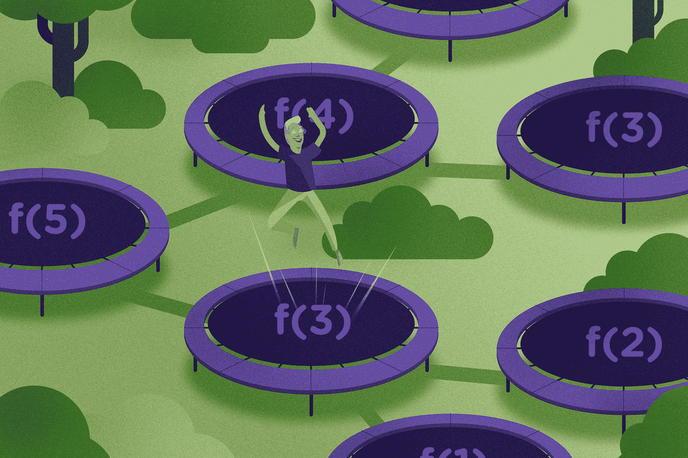

# 使用 trampolines 管理 JavaScript - LogRocket 博客中的大型递归循环

> 原文：<https://blog.logrocket.com/using-trampolines-to-manage-large-recursive-loops-in-javascript-d8c9db095ae3/>



我清楚地记得我进入函数式编程世界的情形。讽刺的是，我正在 ES5 中学习基于类的 JavaScript。我被布置了一些家庭作业来强化所教授的 OOP 概念。然而，一个成熟的基于类的 OOP 实现对于作为家庭作业的问题类型来说是大材小用了，所以我决定在纯函数中完成整个事情。

我非常感谢我在学习编程时有好老师——他们没有扼杀我用函数式风格完成任务的灵感，而是鼓励我更深入地钻研函数式编程(FP)。

自从第一次踏入 FP 世界以来，我已经直接看到了为 JavaScript 采用函数式风格的好处。尤其是在深入研究了 React、Redux 和 RxJS 之后——这些都使得 FP 变得越来越普遍，因为它们在 web 上的许多应用程序中都有使用。然而，在遇到这个叫做*递归的东西之前，很难深入 FP 领域。*

### 递归

首先，让我们快速回顾一下*的递归是什么样子的。出于本文的目的，我们将使用一个名为`sumBelow`的简单函数，它接受一个数字，并返回该数字加上其下所有数字的总和。例如，如果我调用`sumBelow(5)`，我将得到 *15* (5 + 4 + 3 + 2 + 1 = 15)。*

如果我们以经典的迭代方式编写这个函数，它看起来会像这样:

```
// iterative way
const sumBelow = number => {
  let result = 0
for(let i = 0; i <= number; i++) {
    result += i
  }
  return result
}
```

在递归方式中，函数看起来像这样:

```
// the recursive way
const sumBelow = (number, sum = 0) => (
  number === 0 
    ? sum
    : sumBelow(number - 1, sum + number)
)
```

递归的“秘方”在我们的`sumBelow`函数的末尾，我们从`sumBelow`内部调用`sumBelow`。当我们这样做时，函数继续调用自己，直到它产生一个值。然后它将该值一路返回到第一次函数调用。

在许多情况下，递归可以产生更具声明性、自描述性的代码——你不是在解释*如何* *获得值*就像迭代代码一样，你是在描述函数的最终结果应该是什么。此外，递归允许您在函数内部保持不变性(毕竟，易变状态是许多错误的根源)，并且通常导致代码更少。

当然，我们的例子很小，但是随着程序规模和范围的增长，明智地使用递归有助于保持简单。

免责声明:这不是一篇关于递归和迭代风格的文章。两者都有其优点，有时递归解决方案不如迭代解决方案清晰。

[](https://logrocket.com/signup/)

### 递归的问题是

在函数式语言(如 Elm、Elixir、Haskell 等)中，*不可能*执行命令式循环，所以唯一的选择是递归。由于递归内置于语言中，编译器通常会进行优化，以保证在处理大型数据集时不会超出调用堆栈。

然而，在 JavaScript 中，默认情况下我们不会得到这些优化。这意味着当我们有一个递归函数时，我们实际上可能会使 JavaScript 引擎崩溃！

比如我们把上面的`sumBelow`函数拿出来。如果我们用一个很大的数字来打电话，你认为会发生什么？

```
sumBelow(100000);
// Uncaught RangeError: Maximum call stack size exceeded
```

递归函数不断向 JavaScript 引擎调用堆栈添加条目，直到没有更多空间，然后我们得到一个错误(如果您想了解更多关于调用堆栈如何工作的信息，请随意查看本文。

如果您希望您的程序可伸缩，这并不是一个可靠的解决方案。这可能足以让人们相信迭代循环是唯一的出路。但是，有一些替代方法可以获得递归的可读性优势，而不会带来性能损失。

* * *

### 通过适当的尾部调用进行优化

避免调用堆栈崩溃的一种方法是使用适当的尾部调用，这是 ES2015 规范中添加的。为了使用适当的尾部调用(PTC)，函数满足以下条件:

1.  您必须处于`use strict`模式。
2.  递归函数调用必须在*尾位置—* ，也就是说，它是在`return`语句之前最后一个要评估的东西。关于尾部位置的详细概述，在这篇文章的[中有一个很好的探究。](http://2ality.com/2015/06/tail-call-optimization.html#checking-whether-a-function-call-is-in-a-tail-position)

PTC 最酷的一点是，如果你已经用适当的尾部调用编写了递归函数，你就不需要修改任何代码了！例如，我们的`sumBelow`函数已经用适当的尾部调用编写好了，所以我们要做的就是在支持适当尾部调用的环境中运行它。

问题是，适当的尾音最多只能获得不稳定的支持。从 [kangax.github.io](http://kangax.github.io/compat-table/es6/#test-proper_tail_calls_%28tail_call_optimisation%29) 看支持图。


This is support for PTC, lots of red boxes.

在本文撰写之时，Safari 是唯一一款搭载 PTC 的浏览器。Node 在 6.5 版本中实现了 tail 调用，但是它被隐藏在一个标志后面(后来他们在 Node 8 中完全移除了对 PTC 的支持)。

有了这样的浏览器支持，如果我们想暂时使用递归，我们就很难在 PTC 上下注。

### 一个简单、无破坏性的选择:蹦床

我最近刚刚读完 Kyle Simpson 的[Functional Light JavaScript](https://leanpub.com/fljs)。这是对 JavaScript 函数式编程的一次精彩、实用的探索。正是凯尔关于递归的那一章向我介绍了如何使用*蹦床*来管理大型递归循环。

一个蹦床函数基本上将我们的递归函数包装在一个循环中。在引擎盖下，它一段一段地调用递归函数，直到不再产生递归调用。

```
const trampoline = fn => (...args) => {
  let result = fn(...args)
  while (typeof result === 'function') {
    result = result()
  }
  return result
}
```

在这个`trampoline`函数下发生了什么？它将一个函数(`fn`)作为它的参数——这是它将要包装的递归函数——并返回一个新函数。在这个新函数中，调用了递归函数。只要`fn`返回另一个函数，我们就保持循环运行。一旦`fn`解析成一个值，我们就停止运行循环并返回该值。

我们必须稍微修改一下我们的递归函数，以便被`trampoline`函数使用。我们所要做的就是在递归部分添加一个匿名函数。这样它就返回一个函数，并且可以由`trampoline`函数的`while`循环来管理。(我已经在代码片段中加粗了)。

* * *

### 更多来自 LogRocket 的精彩文章:

* * *

```
const sumBelowRec = (number, sum = 0) => (
  number === 0
    ? sum
    : *() =>* sumBelowRec(number - 1, sum + number)
)
```

因为我们的递归函数现在返回一个新函数*，而没有真正调用自己*，所以当下一次调用`sumBelowRecursive`发生在我们的`trampoline`函数内部时，我们开始控制*。这允许我们继续调用`sumBelowRec`而不破坏调用栈。*

最后一步是将`sumBelowRec`封装到我们的蹦床函数中。

```
const sumBelow = trampoline(sumBelowRec)
sumBelow(100000)
// returns 5000050000 🎉🎉🎉
```

作为我的兼职项目之一，我一直在用 JavaScript 完成 [Project Euler](https://projecteuler.net) 。我非常喜欢用蹦床来处理一些大型的数字运算问题——它帮助我提出了比依赖迭代循环更多的声明式解决方案。

虽然有些人警告说蹦床会导致性能开销并对可读性产生负面影响，但我认为好处大于代价。

在我自己的性能分析中，我发现使用蹦床的开销远没有我想象的那么大。毫无疑问，蹦床*比迭代循环要慢。*然而，在许多情况下，递归解决方案可能更简洁，更不容易出错，性能开销可能值得可读性带来的好处。

此外，虽然我们确实需要修改我们的函数来在 trampoline 上下文中工作，但是这种改变是相当不具干扰性的。像任何新概念一样，可读性在开始时有点困难，直到您习惯于编写和阅读使用蹦床的代码。

如果您试图在 JavaScript 中采用函数式风格，那么使用 trampolines 对于处理大型数据集的困难情况是必不可少的。

## 通过理解上下文，更容易地调试 JavaScript 错误

调试代码总是一项单调乏味的任务。但是你越了解自己的错误，就越容易改正。

LogRocket 让你以新的独特的方式理解这些错误。我们的前端监控解决方案跟踪用户与您的 JavaScript 前端的互动，让您能够准确找出导致错误的用户行为。

[](https://lp.logrocket.com/blg/javascript-signup)

LogRocket 记录控制台日志、页面加载时间、堆栈跟踪、慢速网络请求/响应(带有标题+正文)、浏览器元数据和自定义日志。理解您的 JavaScript 代码的影响从来没有这么简单过！

[Try it for free](https://lp.logrocket.com/blg/javascript-signup)

.