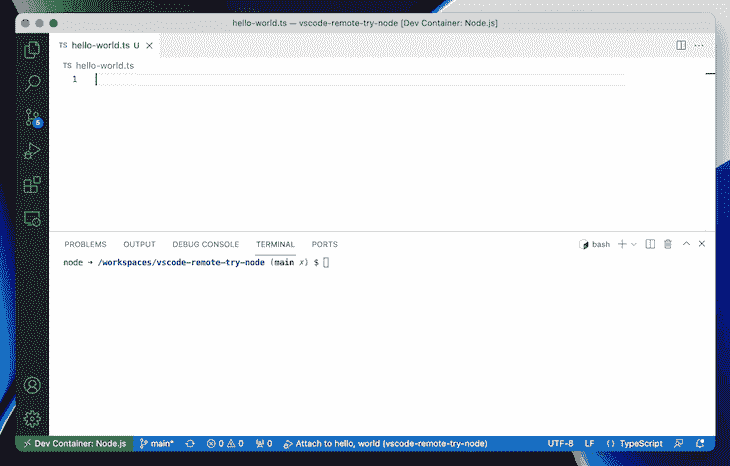

# 在 TypeScript 中使用 tsm 作为 shebang 解释器

> 原文：<https://blog.logrocket.com/using-tsm-shebang-interpreter-typescript/>

TypeScript 已经席卷了 web 开发界，对于企业项目和个人开发人员来说越来越受欢迎。

执行 TypeScript 代码通常需要将其转换成普通的 JavaScript，以便在 Node.js 或浏览器等常见环境中使用。这种方法仍然代表了 TypeScript 程序的大部分运行方式，但是已经出现了一些允许开发人员直接运行他们的 TypeScript 代码的项目。

tsm 在这一领域是一个全新的参与者，代表着更广泛的 TypeScript/JavaScript 生态系统向前迈进了一步。

## 什么是 tsm？

tsm 是卢克·爱德华兹创建的 Node.js、[的 TypeScript 模块加载器。它扩展了 Node.js 以提供本机 TypeScript 支持，而无需先将其转换为 JavaScript。](https://twitter.com/lukeed05)

相反，tsm 使用 [esbuild](https://blog.logrocket.com/getting-started-esbuild/) 在将 TypeScript 源代码传递给 Node.js 运行时之前，快速地将它转换成 JavaScript。这种方法本质上抽象了典型的 transpilation 步骤，使其对用户透明。

## 应该使用 tsm 吗？

使用 tsm 的主要也是最明显的优势是开发人员不需要担心 TypeScript 的移植。这意味着开发反馈循环更短，构建工具更简单，部署更直接。这对于像一次性脚本这样的小项目特别方便。

因为 tsm 运行在 Node.js 之上，熟悉 Node 的开发人员会发现使用 tsm 很自然，只需一个简单的步骤就可以轻松地将 TypeScript 合并到他们的项目中。

例如，esbuild 具有内置的源映射支持，这意味着在 tsm 下运行的 TypeScript 程序可以使用标准的 V8 调试协议(包含在 Node.js 中)和[流行的调试工具(如 VS Code](https://blog.logrocket.com/how-to-debug-node-js-apps-in-visual-studio-code/) )进行调试。

此外，npm 包和节点内置 API 的庞大生态系统可用于运行 tsm 的 TypeScript。

## tsm 的缺点

使用 tsm 的一个相对较小的代价是，除了 Node.js 本身之外，它还必须安装在需要运行 TypeScript 代码的系统上。

如果分发打算直接从 shell 中运行的脚本(比如通过 shebang 解释器指令将 tsm 用作脚本的解释器)，这可能会带来不便，但对于完全打包的 Node.js 模块来说，这不是问题。

除此之外，假设对新的和新兴的(因此，潜在的变化)技术有兴趣，尝试一下 tsm 没有太多的负面影响。

与项目技术栈的其他元素(如数据库、编程语言、框架等)不同。)，JavaScript 构建工具的好处是它们可以在以后被替换，对应用程序源代码本身的影响很小。

## 如何在 Node.js 项目中使用 tsm

有几种不同的方法可以将 tsm 挂接到 Node.js 项目中。

### 作为可执行文件`node`的替代

假设您已经全局安装了 tsm(通过`npm -- global install tsm`或`yarn global add tsm`，您可以使用`tsm`可执行文件运行类型脚本文件，如下所示:

```
tsm index.ts
```

对于本地安装，`tsm`可执行文件可以在`./node_modules/.bin/tsm`找到。

注意，任何命令行标志都将被传递给`node`，这对于实验特性、调试配置等非常方便。

### 使用 shebang 解释器指令

因为 tsm 包含一个可执行文件，所以它可以像任何其他脚本解释器一样在 shebang 指令中使用。Shebang 指令的格式如下:`!#<path/to/interpreter> [arguments]`。

它们出现在文件的第一行，告诉操作系统使用哪个程序来解析和执行文件的其余部分。

例如:

```
#!/usr/local/bin/tsm

function print(message: string): void {
  console.log(message);
}

print('hello from TypeScript!');
```

### 使用`--require`或`--loader`挂钩

如果你仍然需要直接使用`node`而不是`tsm`可执行文件，你可以使用`--require`或`--loader`钩子来指示`node`使用`tsm`来加载类型脚本文件。为此，tsm 需要作为本地依赖项(而不是全局依赖项)安装。

```
node --require tsm index.ts
```

```
node --loader tsm index.ts
```



Demo: using tsm with `require` hook

## deno:TSM 的替代方案

tsm 不是实现无翻译的可执行类型脚本的唯一方法。Node.js 的创建者 Ryan Dahl 发布了一个名为 Deno 的项目，该项目提供了现成的 TypeScript 支持。

像 Node.js 一样，Deno 建立在 V8 JavaScript 引擎之上，并试图克服 Node.js 的一些设计缺陷。

像 Node.js 和 tsm 一样，Deno 可以直接作为可执行文件使用:

```
deno index.ts
```

它也可以用在 shebang 指令中:

```
!#/usr/local/bin/deno

...
```

然而，在 TypeScript 中为 Node.js 编写的代码可能无法移植到 Deno，因为 [Deno](https://blog.logrocket.com/tag/deno/) 提供了自己的标准库来替代 Node.js APIs。它也有自己的分发模块的范例，而不是利用 npm。查看 Deno 的[标准库](https://deno.land/std)和 [API 文档](https://doc.deno.land/builtin/stable)了解更多细节。

## 结论

tsm 是快速无缝地将 TypeScript 集成到 Node.js 项目中的好方法。因为它是基于 Node.js 构建的，所以 tsm 用户可以利用 npm 中庞大的软件包生态系统和强大的 Node.js APIs，所有这些都可以在 TypeScript 中完成，而无需设置复杂的构建过程。

查看 tsm 的 [GitHub repo](https://github.com/lukeed/tsm) 及其[家属名单](https://github.com/lukeed/tsm/network/dependents?package_id=UGFja2FnZS00OTM3NTU4MzY%3D)，了解人们使用它的目的。一些值得注意的例子包括:

*   create-figma-plugin :为 figma 和 FigJam 开发插件和小部件的综合工具包。它是用 TypeScript 编写的，在开发过程中使用 tsm
*   tinyhttp :用 TypeScript 编写的现代 web 框架。它在其文档示例中使用 tsm 作为让用户快速启动和运行的简单方法
*   nano stores:JavaScript 项目的微型状态管理器。tsm 用于该模块的开发周期

简而言之，当您希望从 TypeScript 内部利用 Node 庞大的生态系统或将 TypeScript 集成到现有的 Node 代码库中时，请使用 tsm。如果您没有太多仅依赖 npm 的依赖项，并且希望享受 Deno 安全模型的好处，那么可以考虑在您的下一个服务器端 TypeScript 项目中使用 Deno。

编码快乐！

## [LogRocket](https://lp.logrocket.com/blg/typescript-signup) :全面了解您的网络和移动应用

[](https://lp.logrocket.com/blg/typescript-signup)

LogRocket 是一个前端应用程序监控解决方案，可以让您回放问题，就像问题发生在您自己的浏览器中一样。LogRocket 不需要猜测错误发生的原因，也不需要向用户询问截图和日志转储，而是让您重放会话以快速了解哪里出错了。它可以与任何应用程序完美配合，不管是什么框架，并且有插件可以记录来自 Redux、Vuex 和@ngrx/store 的额外上下文。

除了记录 Redux 操作和状态，LogRocket 还记录控制台日志、JavaScript 错误、堆栈跟踪、带有头+正文的网络请求/响应、浏览器元数据和自定义日志。它还使用 DOM 来记录页面上的 HTML 和 CSS，甚至为最复杂的单页面和移动应用程序重新创建像素级完美视频。

## 200 只显示器出现故障，生产中网络请求缓慢

部署基于节点的 web 应用程序或网站是容易的部分。确保您的节点实例继续为您的应用程序提供资源是事情变得更加困难的地方。如果您对确保对后端或第三方服务的请求成功感兴趣，

[try LogRocket](https://lp.logrocket.com/blg/node-signup)

.

[](https://lp.logrocket.com/blg/node-signup)[https://logrocket.com/signup/](https://lp.logrocket.com/blg/node-signup)

LogRocket 就像是网络和移动应用程序的 DVR，记录下用户与你的应用程序交互时发生的一切。您可以汇总并报告有问题的网络请求，以快速了解根本原因，而不是猜测问题发生的原因。

LogRocket 检测您的应用程序以记录基线性能计时，如页面加载时间、到达第一个字节的时间、慢速网络请求，还记录 Redux、NgRx 和 Vuex 操作/状态。

[Start monitoring for free](https://lp.logrocket.com/blg/node-signup)

.

[Try it for free](https://lp.logrocket.com/blg/typescript-signup)

.